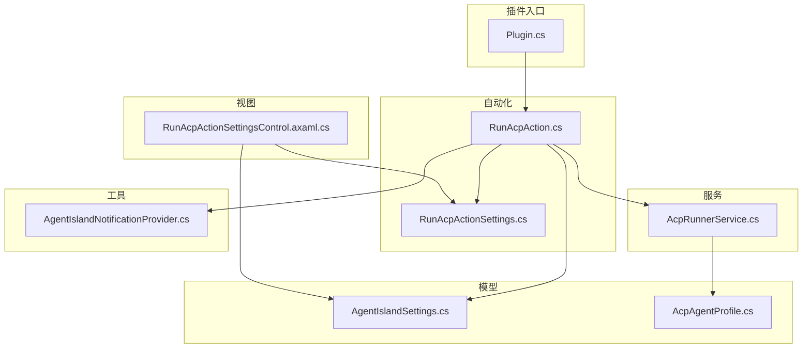
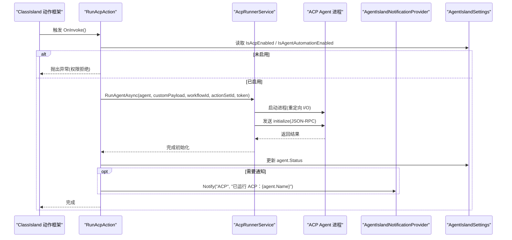
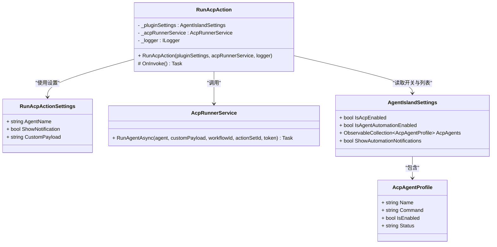
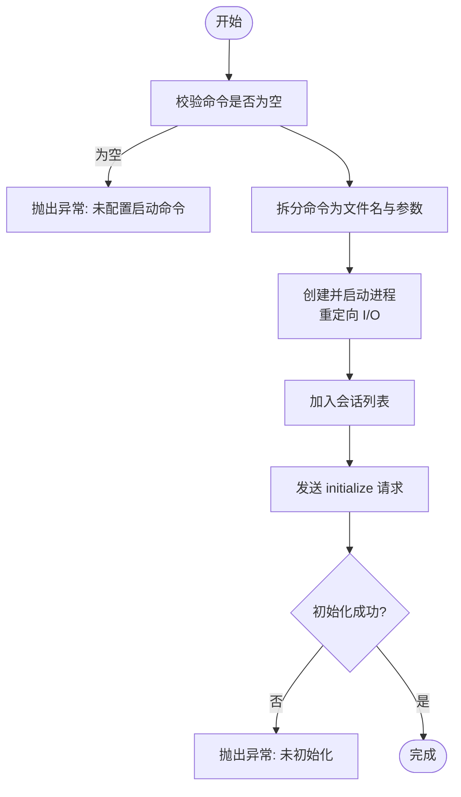
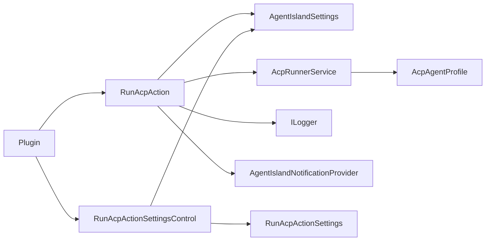

# 自动化动作执行器

<cite>
**本文引用的文件**   
- [Automation/RunAcpAction.cs](file://Automation/RunAcpAction.cs)
- [Models/RunAcpActionSettings.cs](file://Models/RunAcpActionSettings.cs)
- [Services/AcpRunnerService.cs](file://Services/AcpRunnerService.cs)
- [Views/ActionSettings/RunAcpActionSettingsControl.axaml.cs](file://Views/ActionSettings/RunAcpActionSettingsControl.axaml.cs)
- [Models/AcpAgentProfile.cs](file://Models/AcpAgentProfile.cs)
- [Models/AgentIslandSettings.cs](file://Models/AgentIslandSettings.cs)
- [Mcp/Tools/AgentIslandNotificationProvider.cs](file://Mcp/Tools/AgentIslandNotificationProvider.cs)
- [Plugin.cs](file://Plugin.cs)
</cite>

## 目录
1. [简介](#简介)
2. [项目结构](#项目结构)
3. [核心组件](#核心组件)
4. [架构总览](#架构总览)
5. [详细组件分析](#详细组件分析)
6. [依赖关系分析](#依赖关系分析)
7. [性能与可靠性](#性能与可靠性)
8. [故障排查指南](#故障排查指南)
9. [结论](#结论)
10. [附录：自定义动作开发指南](#附录自定义动作开发指南)

## 简介
本文件围绕“自动化动作执行器”展开，重点解析 RunAcpAction 类的完整实现、继承自 ActionBase 的生命周期管理、动作触发流程、参数验证与执行上下文管理；并详细说明 RunAcpActionSettings 配置模型的设计与使用方式。文档还涵盖动作注册机制、权限检查、执行日志记录、与 ClassIsland Action 框架的集成模式与最佳实践，以及扩展点说明和自定义动作开发指南。

## 项目结构
本项目采用按功能域组织的目录结构：
- Automation：定义具体动作实现（如运行 ACP）
- Models：数据模型与设置（包括动作设置、Agent 配置、插件全局设置等）
- Services：服务层（如 ACP 进程管理与会话控制）
- Views/ActionSettings：动作设置 UI 控件
- Mcp/Tools：通知提供器等工具类
- Plugin：插件入口与 DI 注册

图表来源
- [Plugin.cs:29-53](file://Plugin.cs#L29-L53)
- [Automation/RunAcpAction.cs:10-27](file://Automation/RunAcpAction.cs#L10-L27)
- [Services/AcpRunnerService.cs:14-31](file://Services/AcpRunnerService.cs#L14-L31)
- [Views/ActionSettings/RunAcpActionSettingsControl.axaml.cs:8-13](file://Views/ActionSettings/RunAcpActionSettingsControl.axaml.cs#L8-L13)
- [Models/RunAcpActionSettings.cs:9-35](file://Models/RunAcpActionSettings.cs#L9-L35)
- [Models/AgentIslandSettings.cs:13-102](file://Models/AgentIslandSettings.cs#L13-L102)
- [Models/AcpAgentProfile.cs:9-43](file://Models/AcpAgentProfile.cs#L9-L43)
- [Mcp/Tools/AgentIslandNotificationProvider.cs:12-25](file://Mcp/Tools/AgentIslandNotificationProvider.cs#L12-L25)

章节来源
- [Plugin.cs:29-53](file://Plugin.cs#L29-L53)

## 核心组件
- RunAcpAction：基于 ClassIsland Action 框架的动作实现，负责校验配置、启动 ACP Agent 并反馈状态与通知。
- RunAcpActionSettings：动作的配置模型，包含目标 Agent 名称、是否显示通知、自定义负载等字段。
- AcpRunnerService：通过 stdio JSON-RPC 协议与外部 ACP Agent 进程通信，管理进程生命周期与会话初始化。
- RunAcpActionSettingsControl：动作设置的 UI 控件，绑定到 RunAcpActionSettings，并提供默认值与动态标题/图标。
- AgentIslandSettings：插件全局设置，包含 ACP 开关、Agent 列表、通知开关等。
- AcpAgentProfile：单个 ACP Agent 的配置项（名称、命令、启用状态、状态文本）。
- AgentIslandNotificationProvider：ClassIsland 通知通道提供者，用于在 UI 线程上弹出提示。

章节来源
- [Automation/RunAcpAction.cs:10-27](file://Automation/RunAcpAction.cs#L10-L27)
- [Models/RunAcpActionSettings.cs:9-35](file://Models/RunAcpActionSettings.cs#L9-L35)
- [Services/AcpRunnerService.cs:14-31](file://Services/AcpRunnerService.cs#L14-L31)
- [Views/ActionSettings/RunAcpActionSettingsControl.axaml.cs:8-13](file://Views/ActionSettings/RunAcpActionSettingsControl.axaml.cs#L8-L13)
- [Models/AgentIslandSettings.cs:13-102](file://Models/AgentIslandSettings.cs#L13-L102)
- [Models/AcpAgentProfile.cs:9-43](file://Models/AcpAgentProfile.cs#L9-L43)
- [Mcp/Tools/AgentIslandNotificationProvider.cs:12-25](file://Mcp/Tools/AgentIslandNotificationProvider.cs#L12-L25)

## 架构总览
下图展示了从 ClassIsland 动作框架到 ACP Agent 进程的端到端调用链，包括参数校验、权限检查、进程启动、会话初始化、状态更新与通知。

图表来源
- [Automation/RunAcpAction.cs:29-82](file://Automation/RunAcpAction.cs#L29-L82)
- [Services/AcpRunnerService.cs:25-77](file://Services/AcpRunnerService.cs#L25-L77)
- [Mcp/Tools/AgentIslandNotificationProvider.cs:27-50](file://Mcp/Tools/AgentIslandNotificationProvider.cs#L27-L50)
- [Models/AgentIslandSettings.cs:67-102](file://Models/AgentIslandSettings.cs#L67-L102)

## 详细组件分析

### RunAcpAction 类分析
- 继承与声明
  - 继承自 ActionBase<RunAcpActionSettings>，表示该动作拥有强类型设置模型。
  - 使用 ActionInfo 特性进行元数据声明（标识、名称、图标、是否可中断、分组），由 ClassIsland 框架扫描注册。
- 依赖注入
  - 构造函数注入 AgentIslandSettings、AcpRunnerService 与 ILogger，便于访问全局设置、进程管理与日志。
- 生命周期与执行流程
  - 重写 OnInvoke 异步方法，先调用基类 OnInvoke 以进入统一生命周期（例如取消令牌、权限检查等由基类处理）。
  - 权限与开关检查：读取 IsAcpEnabled 与 IsAgentAutomationEnabled，任一为假则记录警告并抛出异常终止执行。
  - 目标 Agent 查找与可用性校验：根据 Settings.AgentName 匹配 AcpAgents，若不存在或已停用则记录警告并抛出异常。
  - 执行：调用 AcpRunnerService.RunAgentAsync，传入 Agent、自定义负载、工作流 ID、动作集 ID 与取消令牌。
  - 状态更新与通知：成功后更新 agent.Status 为“上次运行时间”，并根据 ShowAutomationNotifications 与 Settings.ShowAutomationNotifications 决定是否弹出通知。
- 错误处理
  - 对关键前置条件均做显式校验并抛出 InvalidOperationException，确保失败快速失败且可被上层捕获。
- 日志记录
  - 使用 ILogger 记录触发、拒绝原因、启动信息、完成信息等，便于问题定位。

图表来源
- [Automation/RunAcpAction.cs:10-27](file://Automation/RunAcpAction.cs#L10-L27)
- [Models/RunAcpActionSettings.cs:9-35](file://Models/RunAcpActionSettings.cs#L9-L35)
- [Services/AcpRunnerService.cs:14-31](file://Services/AcpRunnerService.cs#L14-L31)
- [Models/AgentIslandSettings.cs:13-102](file://Models/AgentIslandSettings.cs#L13-L102)
- [Models/AcpAgentProfile.cs:9-43](file://Models/AcpAgentProfile.cs#L9-L43)

章节来源
- [Automation/RunAcpAction.cs:29-82](file://Automation/RunAcpAction.cs#L29-L82)

### RunAcpActionSettings 配置模型
- 设计要点
  - 继承 ObservableObject，支持属性变更通知，便于 UI 双向绑定。
  - 使用 JsonPropertyName 指定序列化键名，保证持久化一致性。
- 字段说明
  - AgentName：要运行的 ACP Agent 名称，需与 AgentIslandSettings.AcpAgents 中的某一项一致。
  - ShowNotification：是否在执行完成后显示系统通知。
  - CustomPayload：传递给 Agent 的自定义负载字符串，供下游消费。
- 使用方式
  - 在动作实例中通过 Settings 属性访问。
  - 在设置 UI 控件中绑定，提供默认值与空状态提示。

章节来源
- [Models/RunAcpActionSettings.cs:9-35](file://Models/RunAcpActionSettings.cs#L9-L35)

### AcpRunnerService 服务分析
- 职责
  - 启动外部 ACP Agent 进程，重定向标准输入输出，建立 JSON-RPC 会话。
  - 维护会话集合，提供发送 Prompt 的能力（当前动作仅启动并初始化）。
- 关键流程
  - RunAgentAsync：校验命令、拆分文件名与参数、创建 Process、加入会话列表、初始化会话。
  - InitializeAcpSessionAsync：发送 initialize 请求并等待响应，标记会话已初始化。
  - SendPromptAsync：向已初始化会话发送 session/prompt 请求。
  - Dispose：关闭所有会话进程，必要时强制终止，释放资源。
- 健壮性
  - 对空命令、无效命令进行校验。
  - 对会话未初始化情况抛出异常。
  - 清理过程捕获异常并记录错误，避免影响整体退出。

图表来源
- [Services/AcpRunnerService.cs:25-77](file://Services/AcpRunnerService.cs#L25-L77)
- [Services/AcpRunnerService.cs:79-100](file://Services/AcpRunnerService.cs#L79-L100)

章节来源
- [Services/AcpRunnerService.cs:25-77](file://Services/AcpRunnerService.cs#L25-L77)
- [Services/AcpRunnerService.cs:79-100](file://Services/AcpRunnerService.cs#L79-L100)
- [Services/AcpRunnerService.cs:102-131](file://Services/AcpRunnerService.cs#L102-L131)
- [Services/AcpRunnerService.cs:156-191](file://Services/AcpRunnerService.cs#L156-L191)

### 动作设置 UI 控件
- 职责
  - 提供动作配置的可视化界面，绑定 RunAcpActionSettings。
  - 自动选择首个可用 Agent 作为默认值，动态更新动作名称与图标。
- 行为
  - OnAdded：当控件添加到运行时，若未设置 AgentName 且有可用 Agent，则自动选择第一个；同时根据设置更新动作标题与图标。
  - EmptyStateText：当无可用 Agent 时给出引导文案。

章节来源
- [Views/ActionSettings/RunAcpActionSettingsControl.axaml.cs:22-35](file://Views/ActionSettings/RunAcpActionSettingsControl.axaml.cs#L22-L35)

### 插件注册与集成
- 插件入口
  - Plugin.Initialize 中完成配置加载、遥测初始化、DI 注册、通知提供者与设置页注册。
  - 关键注册：services.AddAction<RunAcpAction, RunAcpActionSettingsControl>()，将动作与其设置控件关联，交由 ClassIsland 框架发现与调度。
- 生命周期事件
  - AppStarted/AppStopping 钩子用于启动/停止 MCP 服务器，与动作执行无关但体现插件整体生命周期。

章节来源
- [Plugin.cs:29-53](file://Plugin.cs#L29-L53)

## 依赖关系分析
- 直接依赖
  - RunAcpAction 依赖 AgentIslandSettings（开关与 Agent 列表）、AcpRunnerService（进程与会话）、ILogger（日志）。
  - RunAcpActionSettings 为纯数据模型，无外部依赖。
  - AcpRunnerService 依赖 System.Diagnostics.Process 与 JSON 序列化。
  - 通知通过 AgentIslandNotificationProvider 暴露给动作层。
- 间接依赖
  - 动作注册由 Plugin.cs 完成，ClassIsland 框架负责发现与实例化。
  - 设置持久化由 Plugin.cs 监听属性变更并保存。

图表来源
- [Automation/RunAcpAction.cs:18-27](file://Automation/RunAcpAction.cs#L18-L27)
- [Views/ActionSettings/RunAcpActionSettingsControl.axaml.cs:15-20](file://Views/ActionSettings/RunAcpActionSettingsControl.axaml.cs#L15-L20)
- [Services/AcpRunnerService.cs:14-31](file://Services/AcpRunnerService.cs#L14-L31)
- [Plugin.cs:49-49](file://Plugin.cs#L49-L49)

章节来源
- [Plugin.cs:49-49](file://Plugin.cs#L49-L49)

## 性能与可靠性
- 进程启动开销
  - 每次触发都会启动新的 ACP Agent 进程，存在进程创建与初始化的延迟。建议在高并发场景下考虑复用进程与会话（当前实现为一次性启动并初始化）。
- I/O 与序列化
  - JSON-RPC 消息通过标准输入输出行式传输，序列化与反序列化开销较小，但在高频交互时应注意缓冲与批处理。
- 资源清理
  - AcpRunnerService.Dispose 会尝试优雅关闭进程并在超时后强制终止，避免僵尸进程。
- 取消令牌
  - 动作执行传递 CancellationToken，可在长时间操作中支持用户取消。

[本节为通用指导，不直接分析具体文件]

## 故障排查指南
- 常见错误与定位
  - “ACP 功能当前未启用”：检查 AgentIslandSettings.IsAcpEnabled 开关。
  - “基于 Agent 的自动化当前未启用”：检查 AgentIslandSettings.IsAgentAutomationEnabled 开关。
  - “未找到名为 X 的 ACP Agent”：确认 RunAcpActionSettings.AgentName 与 AgentIslandSettings.AcpAgents 中存在同名项。
  - “ACP Agent X 当前已被停用”：检查对应 AcpAgentProfile.IsEnabled。
  - “未配置启动命令/命令无效”：检查 AcpAgentProfile.Command 格式（至少包含可执行文件名）。
  - “未初始化”：检查 AcpRunnerService 的 initialize 响应是否正常。
- 日志与遥测
  - 查看 ILogger 输出，关注“运行 ACP 动作被触发”、“启动 ACP Agent”、“Agent 已启动”等关键日志。
  - SentryTelemetryService 会在关键路径添加 Breadcrumb，便于追踪。
- UI 提示
  - 若 ShowAutomationNotifications 与 Settings.ShowAutomationNotifications 均为真，执行完成后应出现通知。

章节来源
- [Automation/RunAcpAction.cs:35-60](file://Automation/RunAcpAction.cs#L35-L60)
- [Services/AcpRunnerService.cs:37-48](file://Services/AcpRunnerService.cs#L37-L48)
- [Services/AcpRunnerService.cs:112-116](file://Services/AcpRunnerService.cs#L112-L116)
- [Mcp/Tools/AgentIslandNotificationProvider.cs:27-50](file://Mcp/Tools/AgentIslandNotificationProvider.cs#L27-L50)

## 结论
RunAcpAction 基于 ClassIsland Action 框架实现了“运行 ACP”的自动化能力，具备完善的权限检查、参数校验、进程管理与通知反馈。其配置模型简洁清晰，UI 控件提供了良好的用户体验。通过 AcpRunnerService 的 JSON-RPC 会话管理，能够可靠地驱动外部 ACP Agent 进程。建议在后续版本中增强会话复用、错误恢复与更细粒度的权限控制，以提升稳定性与可扩展性。

[本节为总结性内容，不直接分析具体文件]

## 附录：自定义动作开发指南
- 步骤概览
  - 新建动作类：继承 ActionBase<TSettings>，使用 ActionInfo 特性声明元数据。
  - 定义设置模型：继承 ObservableObject，使用 JsonPropertyName 标注字段。
  - 实现 OnInvoke：在方法内完成业务逻辑，遵循“先校验、再执行、后反馈”的模式。
  - 注册动作：在 Plugin.Initialize 中通过 services.AddAction<ActionType, SettingsControlType>() 注册。
  - 可选：提供设置 UI 控件，继承 ActionSettingsControlBase<TSettings>，实现默认值与动态标题/图标。
- 最佳实践
  - 始终调用 base.OnInvoke()，以便接入统一的取消令牌与生命周期。
  - 对关键前置条件进行显式校验，抛出明确异常并记录日志。
  - 使用 ILogger 记录关键路径，便于排障。
  - 如需 UI 通知，使用 NotificationProvider 并通过 Dispatcher 切换到 UI 线程。
  - 合理传递 WorkflowId 与 ActionSetId，便于审计与追踪。
- 扩展点
  - 通过注入更多服务（数据库、缓存、HTTP 客户端等）扩展动作能力。
  - 结合 ClassIsland 的通知、组件与设置页体系，构建完整的用户交互体验。

章节来源
- [Plugin.cs:49-49](file://Plugin.cs#L49-L49)
- [Views/ActionSettings/RunAcpActionSettingsControl.axaml.cs:22-35](file://Views/ActionSettings/RunAcpActionSettingsControl.axaml.cs#L22-L35)
- [Automation/RunAcpAction.cs:29-31](file://Automation/RunAcpAction.cs#L29-L31)