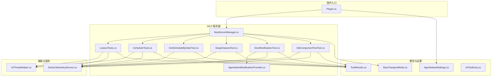
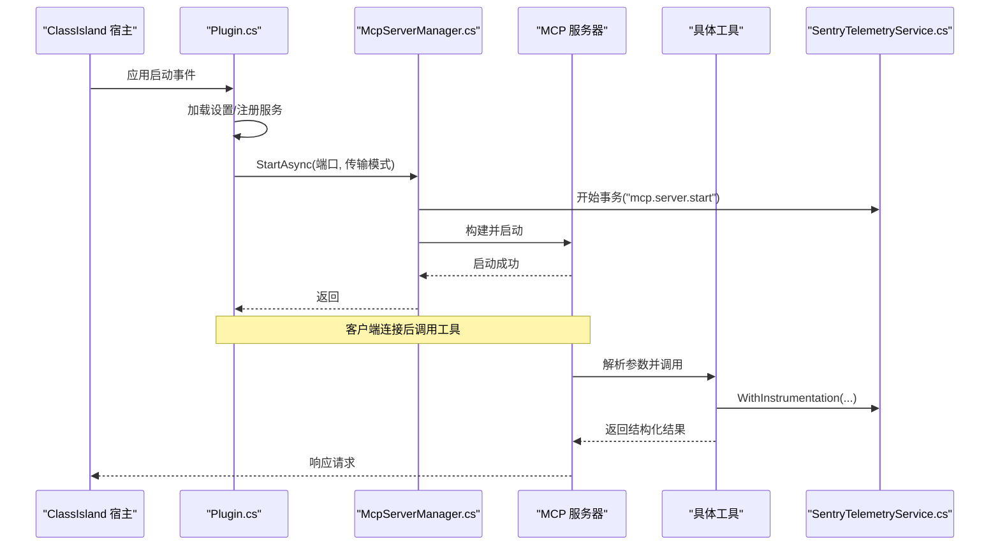
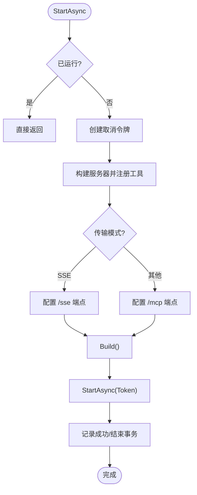
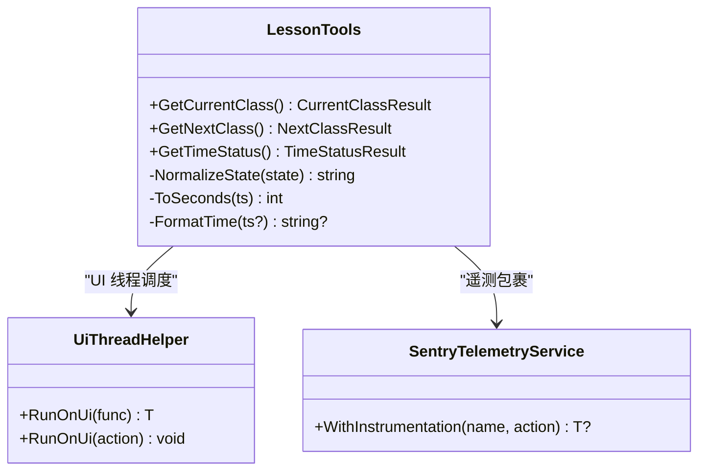
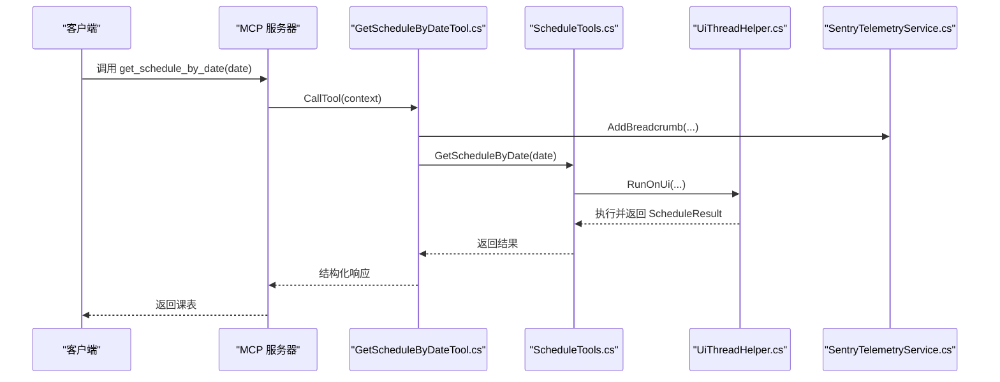
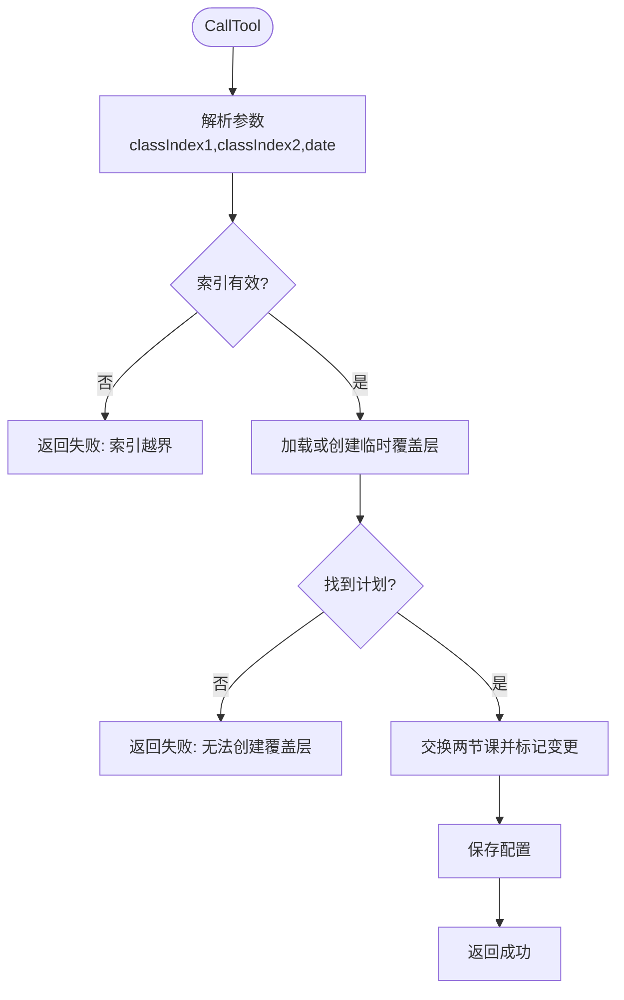
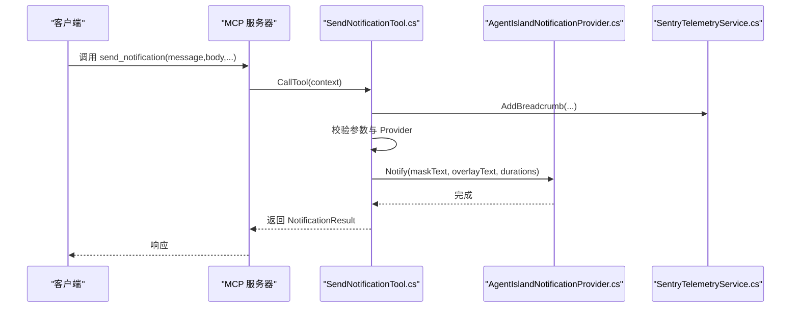
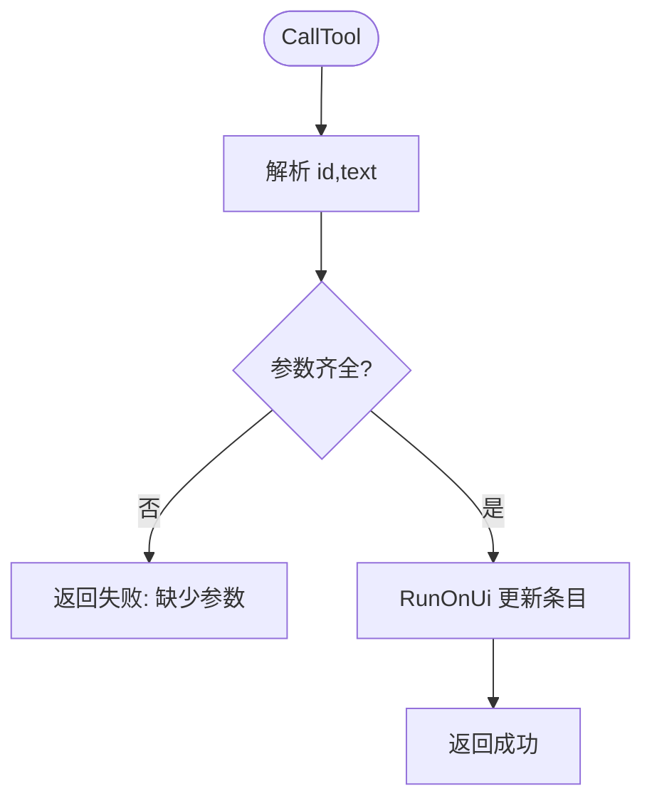
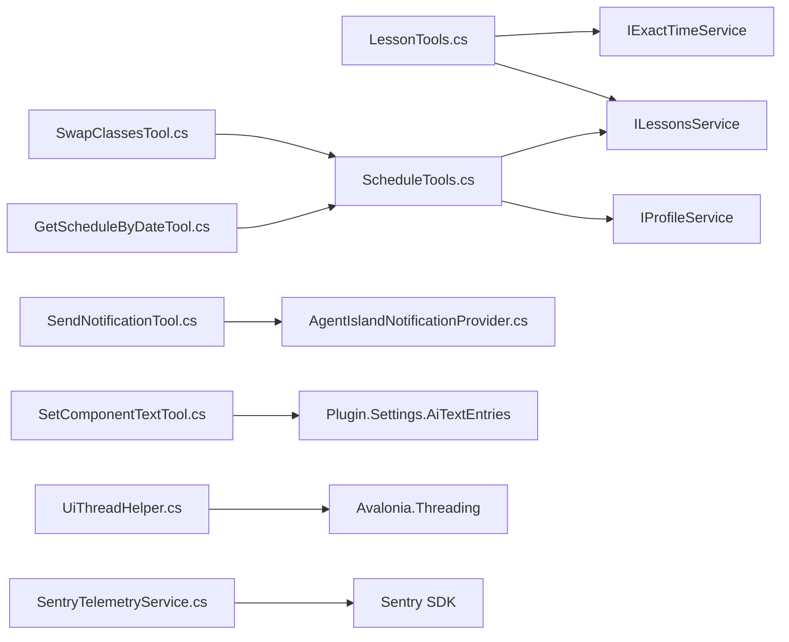

# MCP 工具服务

<cite>
**本文引用的文件**
- [McpServerManager.cs](file://Mcp/McpServerManager.cs)
- [Plugin.cs](file://Plugin.cs)
- [LessonTools.cs](file://Mcp/Tools/LessonTools.cs)
- [ScheduleTools.cs](file://Mcp/Tools/ScheduleTools.cs)
- [GetScheduleByDateTool.cs](file://Mcp/Tools/GetScheduleByDateTool.cs)
- [SwapClassesTool.cs](file://Mcp/Tools/SwapClassesTool.cs)
- [SendNotificationTool.cs](file://Mcp/Tools/SendNotificationTool.cs)
- [SetComponentTextTool.cs](file://Mcp/Tools/SetComponentTextTool.cs)
- [AgentIslandNotificationProvider.cs](file://Mcp/Tools/AgentIslandNotificationProvider.cs)
- [ToolResults.cs](file://Models/ToolResults.cs)
- [McpTransportMode.cs](file://Models/McpTransportMode.cs)
- [AiTextEntry.cs](file://Models/AiTextEntry.cs)
- [UiThreadHelper.cs](file://Helpers/UiThreadHelper.cs)
- [SentryTelemetryService.cs](file://Services/SentryTelemetryService.cs)
- [McpSettingsPage.axaml.cs](file://Views/SettingsPages/McpSettingsPage.axaml.cs)
- [AgentIslandSettings.cs](file://Models/AgentIslandSettings.cs)
</cite>

## 目录
1. [简介](#简介)
2. [项目结构](#项目结构)
3. [核心组件](#核心组件)
4. [架构总览](#架构总览)
5. [详细组件分析](#详细组件分析)
6. [依赖关系分析](#依赖关系分析)
7. [性能与可观测性](#性能与可观测性)
8. [故障排查指南](#故障排查指南)
9. [结论](#结论)
10. [附录：工具方法与数据模型](#附录工具方法与数据模型)

## 简介
本文件面向 AgentIsland 插件中的 MCP（Model Context Protocol）工具服务，系统性说明服务器实现、生命周期管理、工具注册机制，并完整文档化所有可用工具的方法签名、参数与返回值。同时提供使用模式、与其他组件的关系说明、常见问题及解决方案，兼顾初学者与进阶开发者需求。

## 项目结构
MCP 工具服务位于 Mcp 命名空间下，包含服务器管理器与若干工具类；工具返回的数据模型集中于 Models/ToolResults.cs；UI 线程调度由 Helpers/UiThreadHelper.cs 提供；遥测与异常上报通过 Services/SentryTelemetryService.cs 完成；插件入口在 Plugin.cs 中负责初始化与生命周期钩子。

图表来源
- [Plugin.cs:29-79](file://Plugin.cs#L29-L79)
- [McpServerManager.cs:25-82](file://Mcp/McpServerManager.cs#L25-L82)
- [LessonTools.cs:14-83](file://Mcp/Tools/LessonTools.cs#L14-L83)
- [ScheduleTools.cs:15-103](file://Mcp/Tools/ScheduleTools.cs#L15-L103)
- [GetScheduleByDateTool.cs:16-78](file://Mcp/Tools/GetScheduleByDateTool.cs#L16-L78)
- [SwapClassesTool.cs:16-80](file://Mcp/Tools/SwapClassesTool.cs#L16-L80)
- [SendNotificationTool.cs:16-105](file://Mcp/Tools/SendNotificationTool.cs#L16-L105)
- [SetComponentTextTool.cs:17-72](file://Mcp/Tools/SetComponentTextTool.cs#L17-L72)
- [AgentIslandNotificationProvider.cs:12-51](file://Mcp/Tools/AgentIslandNotificationProvider.cs#L12-L51)
- [ToolResults.cs:1-59](file://Models/ToolResults.cs#L1-L59)
- [McpTransportMode.cs:6-17](file://Models/McpTransportMode.cs#L6-L17)
- [AiTextEntry.cs:5-30](file://Models/AiTextEntry.cs#L5-L30)
- [UiThreadHelper.cs:5-24](file://Helpers/UiThreadHelper.cs#L5-L24)
- [SentryTelemetryService.cs:11-148](file://Services/SentryTelemetryService.cs#L11-L148)

章节来源
- [Plugin.cs:29-79](file://Plugin.cs#L29-L79)
- [McpServerManager.cs:25-82](file://Mcp/McpServerManager.cs#L25-L82)

## 核心组件
- 服务器管理器：负责构建、启动和停止 MCP 服务器，按传输模式选择端点，统一注册工具，集成日志与遥测。
- 课程查询工具：提供当前课程、下一节课、时间状态等只读能力。
- 日程管理工具：提供今日课表、指定日期课表、科目列表、换课操作。
- 系统交互工具：发送通知、更新 AI 文字组件文本。
- 通知提供者：封装 ClassIsland 通知通道，支持遮罩与正文叠加显示。
- 结果模型：统一的记录类型用于结构化返回。
- 传输模式：支持 StreamableHttp 与 SSE 两种模式。
- UI 线程助手：确保对 UI 相关资源的访问在主线程执行。
- 遥测服务：为工具调用注入事务、面包屑与异常捕获。

章节来源
- [McpServerManager.cs:25-82](file://Mcp/McpServerManager.cs#L25-L82)
- [LessonTools.cs:14-113](file://Mcp/Tools/LessonTools.cs#L14-L113)
- [ScheduleTools.cs:15-131](file://Mcp/Tools/ScheduleTools.cs#L15-L131)
- [GetScheduleByDateTool.cs:16-78](file://Mcp/Tools/GetScheduleByDateTool.cs#L16-L78)
- [SwapClassesTool.cs:16-80](file://Mcp/Tools/SwapClassesTool.cs#L16-L80)
- [SendNotificationTool.cs:16-105](file://Mcp/Tools/SendNotificationTool.cs#L16-L105)
- [SetComponentTextTool.cs:17-72](file://Mcp/Tools/SetComponentTextTool.cs#L17-L72)
- [AgentIslandNotificationProvider.cs:12-51](file://Mcp/Tools/AgentIslandNotificationProvider.cs#L12-L51)
- [ToolResults.cs:1-59](file://Models/ToolResults.cs#L1-L59)
- [McpTransportMode.cs:6-17](file://Models/McpTransportMode.cs#L6-L17)
- [UiThreadHelper.cs:5-24](file://Helpers/UiThreadHelper.cs#L5-L24)
- [SentryTelemetryService.cs:127-174](file://Services/SentryTelemetryService.cs#L127-L174)

## 架构总览
MCP 服务器由插件在应用启动时按需创建并启动，根据配置选择端口与传输模式。工具通过装饰器或接口方式注册到服务器，运行时解析输入 JSON，调用业务逻辑，返回结构化结果。遥测服务贯穿关键路径，便于问题定位与性能分析。

图表来源
- [Plugin.cs:55-79](file://Plugin.cs#L55-L79)
- [McpServerManager.cs:25-82](file://Mcp/McpServerManager.cs#L25-L82)
- [SentryTelemetryService.cs:127-148](file://Services/SentryTelemetryService.cs#L127-L148)

## 详细组件分析

### 服务器管理与生命周期
- 启动流程：检查是否已运行；创建取消令牌；构建服务器并注册工具；根据传输模式选择端点；启动并记录日志与遥测。
- 停止流程：触发取消令牌；停止服务器；释放资源；记录日志与遥测。
- 传输模式：SSE 使用 /sse 端点，StreamableHttp 使用 /mcp 端点。
- 工具注册：统一通过构建器注册课程、日程、系统交互三类工具。

图表来源
- [McpServerManager.cs:25-82](file://Mcp/McpServerManager.cs#L25-L82)

章节来源
- [McpServerManager.cs:25-112](file://Mcp/McpServerManager.cs#L25-L112)
- [McpTransportMode.cs:6-17](file://Models/McpTransportMode.cs#L6-L17)

### 课程查询工具（LessonTools）
- get_current_class：返回当前课程名称、教师、起止时间、剩余秒数与是否在上课。
- get_next_class：返回下一节课名称、教师、起止时间、距离开始的秒数与是否存在下一节。
- get_time_status：返回当前状态（上课/课间/放学后）、剩余秒数与当前时间。
- 特点：只读、结构化返回、UI 线程安全、遥测包裹。

图表来源
- [LessonTools.cs:14-113](file://Mcp/Tools/LessonTools.cs#L14-L113)
- [UiThreadHelper.cs:5-24](file://Helpers/UiThreadHelper.cs#L5-L24)
- [SentryTelemetryService.cs:127-148](file://Services/SentryTelemetryService.cs#L127-L148)

章节来源
- [LessonTools.cs:14-113](file://Mcp/Tools/LessonTools.cs#L14-L113)

### 日程管理工具（ScheduleTools）
- get_today_schedule：获取今日课表，自动选择当前计划或按日期查找。
- get_schedule_by_date：通过 GetScheduleByDateTool 暴露的接口，按 yyyy-MM-dd 查询指定日期课表。
- list_subjects：列出所有科目及其元信息。
- swap_classes：交换两节课，基于临时覆盖层持久化变更。
- 特点：只读方法标记为 ReadOnly；写操作通过临时覆盖层避免污染原始计划；UI 线程安全；异常处理完善。

图表来源
- [GetScheduleByDateTool.cs:53-78](file://Mcp/Tools/GetScheduleByDateTool.cs#L53-L78)
- [ScheduleTools.cs:41-56](file://Mcp/Tools/ScheduleTools.cs#L41-L56)
- [UiThreadHelper.cs:5-24](file://Helpers/UiThreadHelper.cs#L5-L24)
- [SentryTelemetryService.cs:114-122](file://Services/SentryTelemetryService.cs#L114-L122)

章节来源
- [ScheduleTools.cs:15-131](file://Mcp/Tools/ScheduleTools.cs#L15-L131)
- [GetScheduleByDateTool.cs:16-78](file://Mcp/Tools/GetScheduleByDateTool.cs#L16-L78)

### 换课工具（SwapClassesTool）
- 输入：classIndex1、classIndex2（必填整数索引），date（可选字符串）。
- 行为：校验索引范围；若目标日期无计划则失败；否则创建或复用临时覆盖层并交换两节课；保存配置。
- 输出：SwapResult（Success、Message）。

图表来源
- [SwapClassesTool.cs:63-80](file://Mcp/Tools/SwapClassesTool.cs#L63-L80)
- [ScheduleTools.cs:58-103](file://Mcp/Tools/ScheduleTools.cs#L58-L103)

章节来源
- [SwapClassesTool.cs:16-103](file://Mcp/Tools/SwapClassesTool.cs#L16-L103)
- [ScheduleTools.cs:58-103](file://Mcp/Tools/ScheduleTools.cs#L58-L103)

### 通知工具（SendNotificationTool）
- 输入：message（必填）、body（可选）、maskDuration（可选秒）、overlayDuration（可选秒）。
- 行为：校验通知提供方是否初始化；构造遮罩与正文内容；通过 Channel 展示通知。
- 输出：NotificationResult（Success、Message）。

图表来源
- [SendNotificationTool.cs:68-105](file://Mcp/Tools/SendNotificationTool.cs#L68-L105)
- [AgentIslandNotificationProvider.cs:27-50](file://Mcp/Tools/AgentIslandNotificationProvider.cs#L27-L50)
- [SentryTelemetryService.cs:114-122](file://Services/SentryTelemetryService.cs#L114-L122)

章节来源
- [SendNotificationTool.cs:16-105](file://Mcp/Tools/SendNotificationTool.cs#L16-L105)
- [AgentIslandNotificationProvider.cs:12-51](file://Mcp/Tools/AgentIslandNotificationProvider.cs#L12-L51)

### 组件文本设置工具（SetComponentTextTool）
- 输入：id（必填）、text（必填）。
- 行为：在 UI 线程上查找或新增 AiTextEntry，并更新 Text 字段。
- 输出：SetTextResult（Success、Message）。

图表来源
- [SetComponentTextTool.cs:41-72](file://Mcp/Tools/SetComponentTextTool.cs#L41-L72)
- [AiTextEntry.cs:5-30](file://Models/AiTextEntry.cs#L5-L30)
- [UiThreadHelper.cs:5-24](file://Helpers/UiThreadHelper.cs#L5-L24)

章节来源
- [SetComponentTextTool.cs:17-72](file://Mcp/Tools/SetComponentTextTool.cs#L17-L72)
- [AiTextEntry.cs:5-30](file://Models/AiTextEntry.cs#L5-L30)

## 依赖关系分析
- 低耦合高内聚：每个工具类职责单一，仅依赖必要的服务与模型。
- 外部依赖：
  - DotNetCampus.ModelContextProtocol：MCP 协议与工具框架。
  - ClassIsland.Core.Abstractions.Services：课程、时间、资料库等服务接口。
  - Avalonia.Threading：UI 线程调度。
  - Sentry：遥测与异常上报。
- 潜在循环依赖：未发现循环引用；工具之间通过共享模型与工具类协作。
- 集成点：
  - 插件入口负责注册通知提供者、组件与设置页。
  - 设置页监听端口与传输模式变化，提示重启以生效。

图表来源
- [LessonTools.cs:24-45](file://Mcp/Tools/LessonTools.cs#L24-L45)
- [ScheduleTools.cs:25-39](file://Mcp/Tools/ScheduleTools.cs#L25-L39)
- [GetScheduleByDateTool.cs:66-70](file://Mcp/Tools/GetScheduleByDateTool.cs#L66-L70)
- [SwapClassesTool.cs:76-80](file://Mcp/Tools/SwapClassesTool.cs#L76-L80)
- [SendNotificationTool.cs:85-96](file://Mcp/Tools/SendNotificationTool.cs#L85-L96)
- [SetComponentTextTool.cs:56-63](file://Mcp/Tools/SetComponentTextTool.cs#L56-L63)
- [UiThreadHelper.cs:5-24](file://Helpers/UiThreadHelper.cs#L5-L24)
- [SentryTelemetryService.cs:42-69](file://Services/SentryTelemetryService.cs#L42-L69)

章节来源
- [Plugin.cs:29-53](file://Plugin.cs#L29-L53)
- [McpSettingsPage.axaml.cs:26-41](file://Views/SettingsPages/McpSettingsPage.axaml.cs#L26-L41)

## 性能与可观测性
- 性能要点：
  - 所有涉及 UI 的操作均通过 UiThreadHelper 调度，避免跨线程访问导致的异常与卡顿。
  - 只读工具尽量轻量，避免阻塞主线程；写操作（如换课）尽量减少 IO 次数。
  - 使用结构化返回减少序列化开销。
- 可观测性：
  - 服务器启动/停止、工具调用均有日志与遥测埋点。
  - 异常统一捕获并通过 SentryTelemetryService 上报，附带上下文标签。
  - 建议在生产环境开启 Trace 采样率并根据需要调整。

[本节为通用指导，不直接分析具体文件]

## 故障排查指南
- 服务器未启动或端口占用：
  - 检查配置中的端口与传输模式；修改后需重启应用。
  - 查看日志中“MCP 服务器启动中/已启动”等信息。
- 工具调用失败：
  - 检查输入参数是否符合 Schema（必填项、类型、格式）。
  - 关注遥测面包屑与异常上下文，定位具体工具与方法。
- 通知未显示：
  - 确认通知提供方已初始化；检查遮罩与正文时长参数。
- 换课无效：
  - 确认索引范围正确；确认目标日期存在计划；检查临时覆盖层是否创建成功。
- UI 线程相关错误：
  - 确保所有 UI 访问通过 UiThreadHelper.RunOnUi 执行。

章节来源
- [McpServerManager.cs:76-82](file://Mcp/McpServerManager.cs#L76-L82)
- [McpServerManager.cs:106-112](file://Mcp/McpServerManager.cs#L106-L112)
- [GetScheduleByDateTool.cs:71-77](file://Mcp/Tools/GetScheduleByDateTool.cs#L71-L77)
- [SwapClassesTool.cs:82-101](file://Mcp/Tools/SwapClassesTool.cs#L82-L101)
- [SendNotificationTool.cs:98-104](file://Mcp/Tools/SendNotificationTool.cs#L98-L104)
- [SetComponentTextTool.cs:67-71](file://Mcp/Tools/SetComponentTextTool.cs#L67-L71)
- [SentryTelemetryService.cs:95-109](file://Services/SentryTelemetryService.cs#L95-L109)

## 结论
MCP 工具服务以清晰的模块化设计实现了课程查询、日程管理与系统交互三大能力，结合 UI 线程安全与完善的遥测体系，既保证了稳定性又便于问题定位。通过结构化返回与严格的参数校验，提升了工具调用的可靠性与易用性。

[本节为总结性内容，不直接分析具体文件]

## 附录：工具方法与数据模型

### 工具方法清单与签名
- 课程查询
  - get_current_class(): 返回 CurrentClassResult
  - get_next_class(): 返回 NextClassResult
  - get_time_status(): 返回 TimeStatusResult
- 日程管理
  - get_today_schedule(): 返回 ScheduleResult
  - get_schedule_by_date(date: string): 返回 ScheduleResult
  - list_subjects(): 返回 SubjectListResult
  - swap_classes(classIndex1: int, classIndex2: int, date?: string): 返回 SwapResult
- 系统交互
  - send_notification(message: string, body?: string, maskDuration?: double, overlayDuration?: double): 返回 NotificationResult
  - set_component_text(id: string, text: string): 返回 SetTextResult

章节来源
- [LessonTools.cs:14-113](file://Mcp/Tools/LessonTools.cs#L14-L113)
- [ScheduleTools.cs:15-131](file://Mcp/Tools/ScheduleTools.cs#L15-L131)
- [GetScheduleByDateTool.cs:32-78](file://Mcp/Tools/GetScheduleByDateTool.cs#L32-L78)
- [SwapClassesTool.cs:42-80](file://Mcp/Tools/SwapClassesTool.cs#L42-L80)
- [SendNotificationTool.cs:47-105](file://Mcp/Tools/SendNotificationTool.cs#L47-L105)
- [SetComponentTextTool.cs:30-72](file://Mcp/Tools/SetComponentTextTool.cs#L30-L72)

### 数据模型定义
- CurrentClassResult：SubjectName, TeacherName, StartTime?, EndTime?, RemainingSeconds, IsInClass
- NextClassResult：SubjectName, TeacherName, StartTime?, EndTime?, SecondsUntilStart, HasNextClass
- TimeStatusResult：CurrentState, RemainingSeconds, CurrentTime
- ScheduleResult：ClassPlanName, Date, Classes[]
- ScheduleClassEntry：Index, SubjectName, TeacherName, StartTime?, EndTime?, IsChangedClass, IsEnabled
- SwapResult：Success, Message
- SubjectListResult：Subjects[]
- SubjectEntry：Id, Name, TeacherName, Initial
- NotificationResult：Success, Message
- SetTextResult：Success, Message

章节来源
- [ToolResults.cs:1-59](file://Models/ToolResults.cs#L1-L59)

### 使用模式与示例路径
- 查询当前课程：调用 get_current_class，读取返回的 IsInClass 与 RemainingSeconds 进行提示。
  - 参考路径：[LessonTools.cs:14-45](file://Mcp/Tools/LessonTools.cs#L14-L45)
- 查询指定日期课表：调用 get_schedule_by_date，传入 yyyy-MM-dd 格式日期。
  - 参考路径：[GetScheduleByDateTool.cs:53-78](file://Mcp/Tools/GetScheduleByDateTool.cs#L53-L78)
- 交换两节课：调用 swap_classes，确保索引从 0 开始且在范围内。
  - 参考路径：[SwapClassesTool.cs:63-80](file://Mcp/Tools/SwapClassesTool.cs#L63-L80)
- 发送通知：调用 send_notification，设置遮罩与正文时长以获得更好的用户体验。
  - 参考路径：[SendNotificationTool.cs:68-105](file://Mcp/Tools/SendNotificationTool.cs#L68-L105)
- 更新 AI 文字组件：调用 set_component_text，确保 id 存在或会自动新增。
  - 参考路径：[SetComponentTextTool.cs:41-72](file://Mcp/Tools/SetComponentTextTool.cs#L41-L72)

[本节为使用模式说明，不直接分析具体文件]