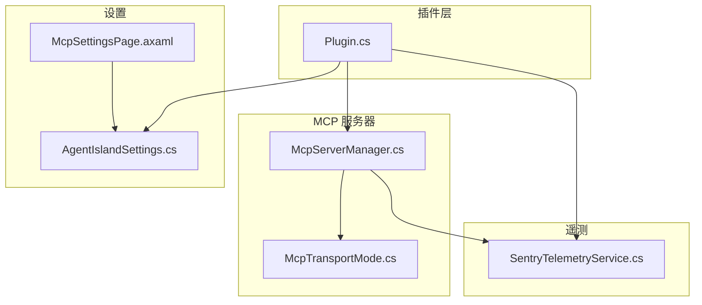
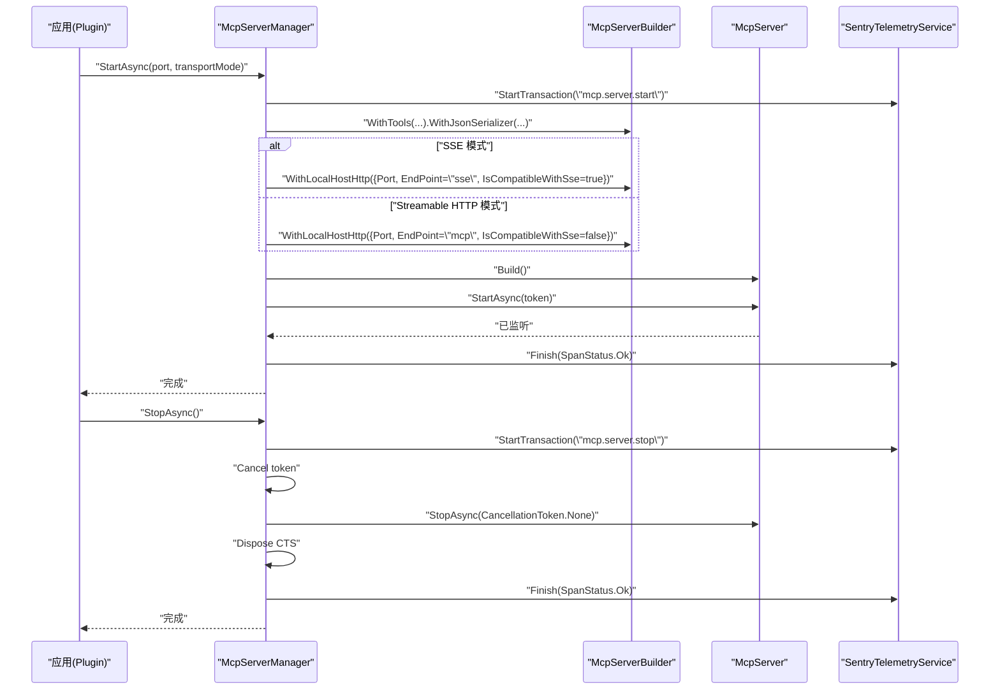
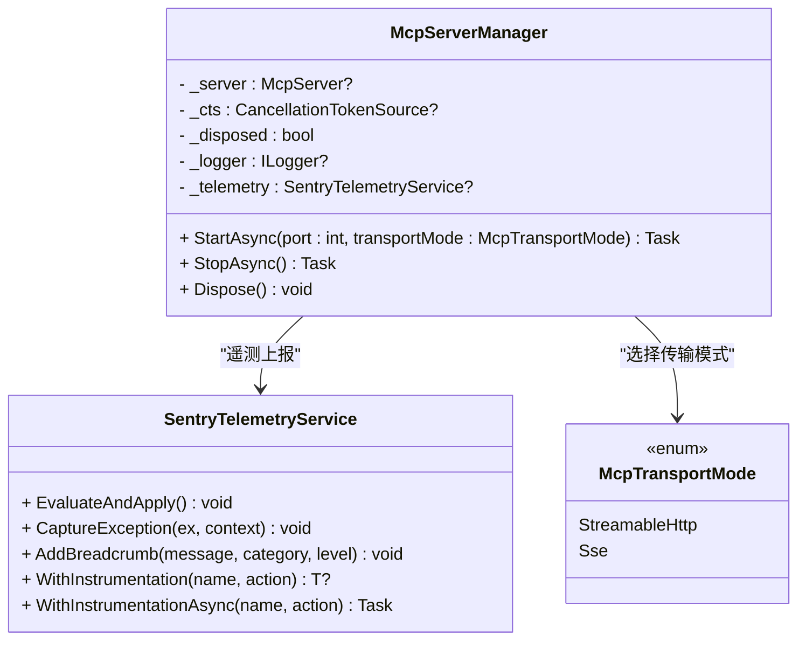
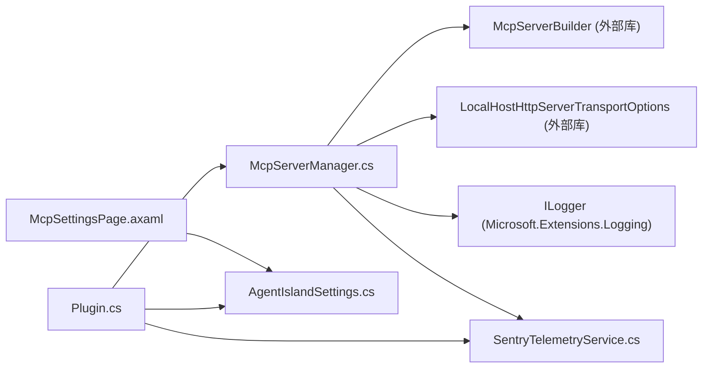

# MCP 服务器管理

<cite>
**本文引用的文件**
- [McpServerManager.cs](file://Mcp/McpServerManager.cs)
- [McpTransportMode.cs](file://Models/McpTransportMode.cs)
- [SentryTelemetryService.cs](file://Services/SentryTelemetryService.cs)
- [Plugin.cs](file://Plugin.cs)
- [AgentIslandSettings.cs](file://Models/AgentIslandSettings.cs)
- [McpSettingsPage.axaml](file://Views/SettingsPages/McpSettingsPage.axaml)
</cite>

## 目录
1. [简介](#简介)
2. [项目结构](#项目结构)
3. [核心组件](#核心组件)
4. [架构总览](#架构总览)
5. [详细组件分析](#详细组件分析)
6. [依赖关系分析](#依赖关系分析)
7. [性能与并发考虑](#性能与并发考虑)
8. [故障排查指南](#故障排查指南)
9. [结论](#结论)
10. [附录：配置与使用示例](#附录配置与使用示例)

## 简介
本文件围绕 McpServerManager 类，系统化阐述 MCP 服务器的生命周期管理（启动、停止、资源清理）、传输模式配置（SSE/HTTP）以及工具注册机制。文档同时覆盖 StartAsync 和 StopAsync 的参数、异常处理与性能考量，并说明与 SentryTelemetryService 的集成用于监控与错误追踪。文末提供不同传输模式的配置与使用示例，以及常见问题（端口冲突、状态管理、资源泄漏）的处理建议，兼顾初学者友好与资深开发者的技术深度。

## 项目结构
与 MCP 服务器管理直接相关的代码分布在以下位置：
- 服务器管理器：Mcp/McpServerManager.cs
- 传输模式枚举：Models/McpTransportMode.cs
- 遥测服务：Services/SentryTelemetryService.cs
- 插件入口与生命周期绑定：Plugin.cs
- 设置模型与连接地址计算：Models/AgentIslandSettings.cs
- 设置界面（端口、传输模式等）：Views/SettingsPages/McpSettingsPage.axaml

图表来源
- [Plugin.cs:55-97](file://Plugin.cs#L55-L97)
- [McpServerManager.cs:25-112](file://Mcp/McpServerManager.cs#L25-L112)
- [McpTransportMode.cs:6-17](file://Models/McpTransportMode.cs#L6-L17)
- [SentryTelemetryService.cs:30-75](file://Services/SentryTelemetryService.cs#L30-L75)
- [AgentIslandSettings.cs:204-211](file://Models/AgentIslandSettings.cs#L204-L211)
- [McpSettingsPage.axaml:25-49](file://Views/SettingsPages/McpSettingsPage.axaml#L25-L49)

章节来源
- [Plugin.cs:55-97](file://Plugin.cs#L55-L97)
- [McpServerManager.cs:25-112](file://Mcp/McpServerManager.cs#L25-L112)
- [McpTransportMode.cs:6-17](file://Models/McpTransportMode.cs#L6-L17)
- [SentryTelemetryService.cs:30-75](file://Services/SentryTelemetryService.cs#L30-L75)
- [AgentIslandSettings.cs:204-211](file://Models/AgentIslandSettings.cs#L204-L211)
- [McpSettingsPage.axaml:25-49](file://Views/SettingsPages/McpSettingsPage.axaml#L25-L49)

## 核心组件
- McpServerManager：封装 MCP 服务器的构建、启动、停止与资源释放；负责按传输模式选择端点；在启动/停止路径中记录日志并通过 Sentry 上报遥测。
- SentryTelemetryService：根据用户隐私同意与开关动态初始化/关闭 Sentry SDK，并提供异常捕获、面包屑、事务包装等能力。
- McpTransportMode：定义 StreamableHttp 与 SSE 两种传输模式。
- Plugin：应用生命周期事件驱动，创建并管理 McpServerManager 实例，并在应用启动/停止时调用其 StartAsync/StopAsync。
- AgentIslandSettings：提供端口、传输模式、连接地址等信息，UI 通过数据绑定修改这些值。

章节来源
- [McpServerManager.cs:11-23](file://Mcp/McpServerManager.cs#L11-L23)
- [SentryTelemetryService.cs:11-25](file://Services/SentryTelemetryService.cs#L11-L25)
- [McpTransportMode.cs:6-17](file://Models/McpTransportMode.cs#L6-L17)
- [Plugin.cs:55-97](file://Plugin.cs#L55-L97)
- [AgentIslandSettings.cs:204-211](file://Models/AgentIslandSettings.cs#L204-L211)

## 架构总览
MCP 服务器由 McpServerManager 统一管理，基于 McpServerBuilder 构建并注入工具集；传输层通过 LocalHostHttpServerTransportOptions 配置端口与端点；SentryTelemetryService 贯穿启动/停止流程进行遥测采集。

图表来源
- [McpServerManager.cs:25-112](file://Mcp/McpServerManager.cs#L25-L112)
- [Plugin.cs:65-97](file://Plugin.cs#L65-L97)
- [SentryTelemetryService.cs:30-75](file://Services/SentryTelemetryService.cs#L30-L75)

## 详细组件分析

### McpServerManager 类分析
职责与关键点：
- 生命周期管理
  - StartAsync：幂等保护（若已有运行中的服务器则直接返回），创建取消令牌源，构建服务器并启动，记录日志，上报成功事务。
  - StopAsync：先取消令牌，再调用底层停止，置空引用并释放取消令牌源，记录日志，上报成功事务。
  - Dispose：同步阻塞调用 StopAsync 确保资源释放。
- 传输模式配置
  - 依据 McpTransportMode 选择端点：SSE 使用 “sse”，默认使用 “mcp”；是否兼容 SSE 由 IsCompatibleWithSse 控制。
- 工具注册机制
  - 通过 WithTools 委托批量注册内置工具（课程、课表、通知、组件文本等）。
- 异常处理与遥测
  - 启动/停止失败时捕获异常，上报到 Sentry，并以 InternalError 结束事务。
- 性能与并发
  - 幂等检查避免重复启动；取消令牌用于优雅退出；StopAsync 顺序执行，避免竞态。

图表来源
- [McpServerManager.cs:11-23](file://Mcp/McpServerManager.cs#L11-L23)
- [McpServerManager.cs:25-112](file://Mcp/McpServerManager.cs#L25-L112)
- [SentryTelemetryService.cs:30-174](file://Services/SentryTelemetryService.cs#L30-L174)
- [McpTransportMode.cs:6-17](file://Models/McpTransportMode.cs#L6-L17)

章节来源
- [McpServerManager.cs:25-112](file://Mcp/McpServerManager.cs#L25-L112)

#### StartAsync 方法详解
- 参数
  - port：本地监听端口
  - transportMode：传输模式（SSE 或 StreamableHttp）
- 行为
  - 幂等保护：若已有运行中的服务器，直接返回
  - 创建取消令牌源
  - 构建服务器：注册工具集、设置 JSON 序列化上下文
  - 根据传输模式选择端点与 SSE 兼容性
  - 启动服务器并记录日志
  - 成功时以 Ok 结束事务；失败时捕获异常并以内错结束事务
- 异常处理
  - 捕获所有异常，上报 Sentry，并重新抛出
- 性能考虑
  - 幂等避免重复绑定端口
  - 取消令牌支持优雅退出
  - 构造阶段尽量轻量，避免阻塞

章节来源
- [McpServerManager.cs:25-82](file://Mcp/McpServerManager.cs#L25-L82)

#### StopAsync 方法详解
- 行为
  - 取消令牌，触发底层停止
  - 等待停止完成后置空引用并释放取消令牌源
  - 记录日志并上报事务结果
- 异常处理
  - 捕获异常，上报 Sentry，并重新抛出
- 性能考虑
  - 顺序执行，避免并发停止导致的状态不一致
  - 释放资源及时，防止句柄泄漏

章节来源
- [McpServerManager.cs:84-112](file://Mcp/McpServerManager.cs#L84-L112)

#### 工具注册机制
- 通过 WithTools 委托集中注册多个工具类，包括课程查询、课表操作、通知发送、组件文本设置等。
- 部分工具以类型注册，部分以实例注册，便于注入外部依赖或复用对象。

章节来源
- [McpServerManager.cs:41-51](file://Mcp/McpServerManager.cs#L41-L51)

### SentryTelemetryService 集成
- 作用
  - 根据设置动态初始化/关闭 Sentry SDK
  - 提供异常捕获、面包屑、事务包装等 API
- 与 McpServerManager 的协作
  - 在 StartAsync/StopAsync 中创建事务，成功/失败分别标记状态
  - 异常发生时统一上报，附带上下文信息
- 关键特性
  - 支持异步/同步包装器，自动添加面包屑与事务
  - 可配置采样率、PII 策略、标签等

章节来源
- [SentryTelemetryService.cs:30-75](file://Services/SentryTelemetryService.cs#L30-L75)
- [SentryTelemetryService.cs:95-174](file://Services/SentryTelemetryService.cs#L95-L174)
- [McpServerManager.cs:32-81](file://Mcp/McpServerManager.cs#L32-L81)
- [McpServerManager.cs:86-111](file://Mcp/McpServerManager.cs#L86-L111)

### 插件生命周期与服务器管理
- 应用启动时：
  - 读取设置，初始化遥测服务
  - 若启用 MCP，则创建 McpServerManager 并调用 StartAsync
  - 记录启动日志与面包屑
- 应用停止时：
  - 调用 StopAsync 停止服务器
  - 记录停止日志与面包屑
- 资源释放：
  - 插件 Dispose 中释放 McpServerManager 与遥测服务

章节来源
- [Plugin.cs:55-97](file://Plugin.cs#L55-L97)

## 依赖关系分析
- 组件耦合
  - McpServerManager 依赖 McpServerBuilder 与传输选项，低耦合于具体工具实现
  - 遥测服务为可选依赖，未启用时不影响核心功能
- 外部依赖
  - DotNetCampus.ModelContextProtocol.Servers 与 Transports.Http
  - Microsoft.Extensions.Logging
  - Sentry SDK
- 可能的循环依赖
  - 当前无循环依赖迹象

图表来源
- [McpServerManager.cs:1-8](file://Mcp/McpServerManager.cs#L1-L8)
- [Plugin.cs:1-16](file://Plugin.cs#L1-L16)
- [McpSettingsPage.axaml:25-49](file://Views/SettingsPages/McpSettingsPage.axaml#L25-L49)
- [AgentIslandSettings.cs:204-211](file://Models/AgentIslandSettings.cs#L204-L211)

章节来源
- [McpServerManager.cs:1-8](file://Mcp/McpServerManager.cs#L1-L8)
- [Plugin.cs:1-16](file://Plugin.cs#L1-L16)
- [McpSettingsPage.axaml:25-49](file://Views/SettingsPages/McpSettingsPage.axaml#L25-L49)
- [AgentIslandSettings.cs:204-211](file://Models/AgentIslandSettings.cs#L204-L211)

## 性能与并发考虑
- 幂等启动：避免重复绑定端口导致的异常与资源浪费
- 取消令牌：支持优雅退出，减少强制终止带来的资源残留
- 事务粒度：将启动/停止作为独立事务，便于定位慢路径与异常
- 工具注册：在构建期一次性注册，避免运行时开销
- 建议
  - 在高并发场景下，确保工具实现内部线程安全
  - 对耗时工具调用使用 Sentry 的 WithInstrumentationAsync 包裹，获取延迟指标

[本节为通用指导，不直接分析具体文件]

## 故障排查指南
- 端口冲突
  - 现象：启动时报端口占用异常
  - 排查：确认端口未被其他进程占用；调整端口号后重启
  - 参考：StartAsync 在异常分支会捕获并上报异常
- 服务器状态管理
  - 现象：多次启动无效或状态不一致
  - 排查：检查幂等逻辑；确保 StopAsync 被正确调用
- 资源泄漏预防
  - 现象：进程退出后仍持有句柄
  - 排查：确认 Dispose 调用链；StopAsync 中释放取消令牌源
- 遥测未上报
  - 现象：Sentry 无数据
  - 排查：检查遥测开关与隐私协议；确认 DSN 有效；查看 EvaluateAndApply 的执行路径

章节来源
- [McpServerManager.cs:76-81](file://Mcp/McpServerManager.cs#L76-L81)
- [McpServerManager.cs:106-111](file://Mcp/McpServerManager.cs#L106-L111)
- [SentryTelemetryService.cs:30-75](file://Services/SentryTelemetryService.cs#L30-L75)

## 结论
McpServerManager 提供了简洁可靠的 MCP 服务器管理能力，涵盖生命周期、传输模式与工具注册，并与 SentryTelemetryService 无缝集成以实现监控与错误追踪。通过幂等设计、取消令牌与有序资源释放，系统在稳定性与可维护性方面表现良好。结合设置界面与插件生命周期，用户可以灵活配置传输模式与端口，快速启用 MCP 服务。

[本节为总结，不直接分析具体文件]

## 附录：配置与使用示例

### 传输模式配置与连接地址
- 传输模式
  - SSE：端点为 “sse”，兼容 SSE
  - Streamable HTTP：端点为 “mcp”，不兼容 SSE
- 连接地址计算
  - 根据端口与传输模式生成 http://localhost:{Port}/{EndPoint}

章节来源
- [McpTransportMode.cs:6-17](file://Models/McpTransportMode.cs#L6-L17)
- [AgentIslandSettings.cs:204-211](file://Models/AgentIslandSettings.cs#L204-L211)

### 在插件中启动与停止服务器
- 启动
  - 读取设置中的端口与传输模式
  - 创建 McpServerManager 并调用 StartAsync
  - 记录日志与面包屑
- 停止
  - 在应用停止事件中调用 StopAsync
  - 记录日志与面包屑

章节来源
- [Plugin.cs:65-97](file://Plugin.cs#L65-L97)

### 设置界面要点
- 端口范围：1-65535
- 传输模式：当前默认启用 Streamable HTTP，SSE 在界面中被禁用（仅展示）

章节来源
- [McpSettingsPage.axaml:25-49](file://Views/SettingsPages/McpSettingsPage.axaml#L25-L49)