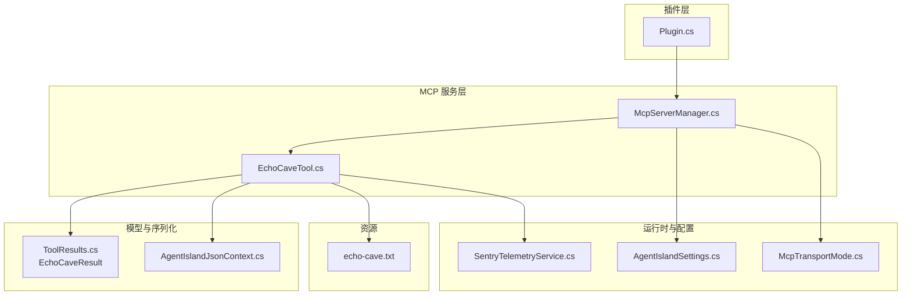
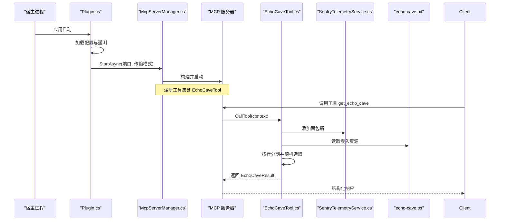
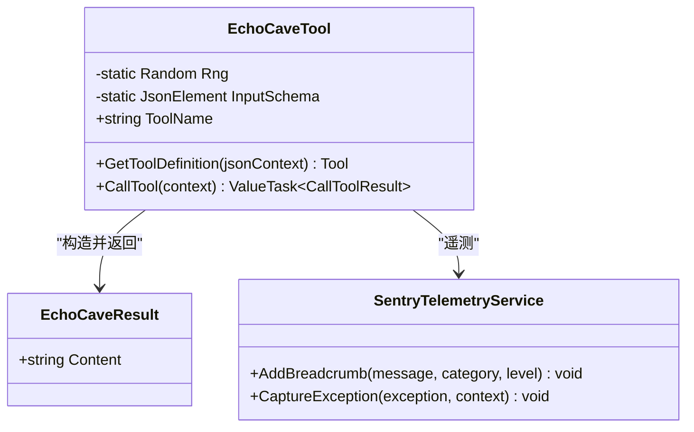
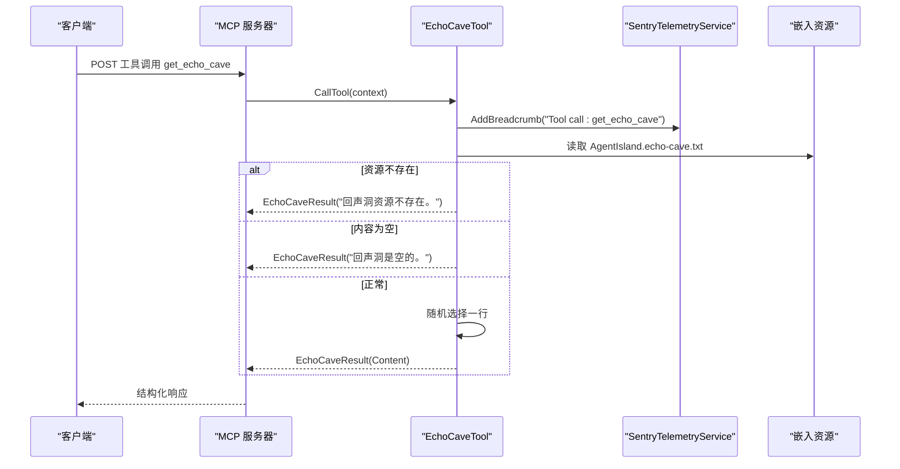
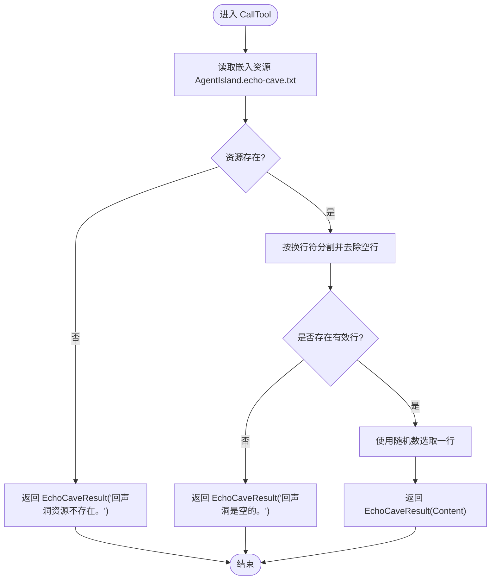
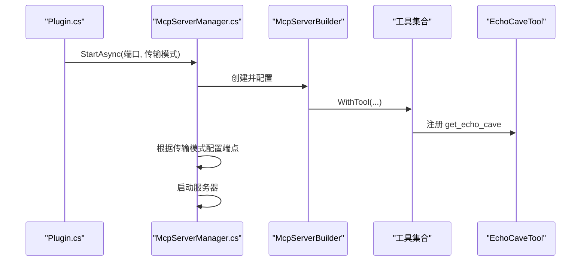
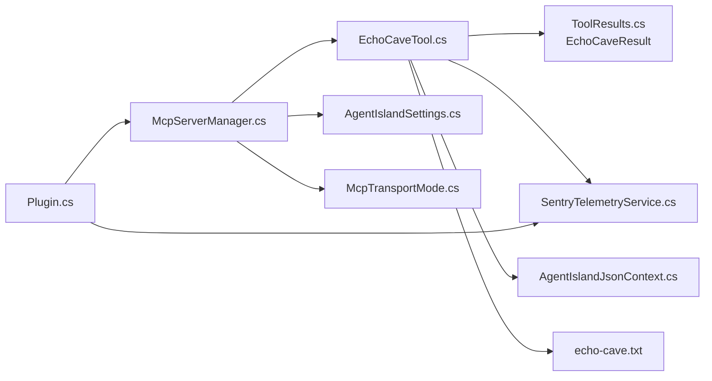

# 回声洞穴功能

<cite>
**本文引用的文件**   
- [Mcp/Tools/EchoCaveTool.cs](file://Mcp/Tools/EchoCaveTool.cs)
- [echo-cave.txt](file://echo-cave.txt)
- [Models/ToolResults.cs](file://Models/ToolResults.cs)
- [Mcp/McpServerManager.cs](file://Mcp/McpServerManager.cs)
- [Plugin.cs](file://Plugin.cs)
- [Services/SentryTelemetryService.cs](file://Services/SentryTelemetryService.cs)
- [Models/AgentIslandSettings.cs](file://Models/AgentIslandSettings.cs)
- [Models/McpTransportMode.cs](file://Models/McpTransportMode.cs)
- [Models/AgentIslandJsonContext.cs](file://Models/AgentIslandJsonContext.cs)
</cite>

## 目录
1. [简介](#简介)
2. [项目结构](#项目结构)
3. [核心组件](#核心组件)
4. [架构总览](#架构总览)
5. [详细组件分析](#详细组件分析)
6. [依赖关系分析](#依赖关系分析)
7. [性能与扩展性](#性能与扩展性)
8. [故障排查指南](#故障排查指南)
9. [结论](#结论)

## 简介
“回声洞穴”是一个轻量级的 MCP（Model Context Protocol）工具，提供从内置文本资源中随机抽取一条内容的能力。该功能通过插件在本地启动一个 HTTP 服务，暴露名为 get_echo_cave 的工具接口，供外部客户端调用。其设计简洁、无状态、幂等友好，适合作为示例或装饰性能力集成到更大的系统中。

## 项目结构
与“回声洞穴”直接相关的代码与资源分布如下：
- 工具实现：Mcp/Tools/EchoCaveTool.cs
- 数据模型：Models/ToolResults.cs（包含 EchoCaveResult）
- JSON 序列化上下文：Models/AgentIslandJsonContext.cs
- 服务器管理：Mcp/McpServerManager.cs（注册工具并启动服务）
- 插件入口：Plugin.cs（生命周期管理与配置加载）
- 遥测服务：Services/SentryTelemetryService.cs（日志与异常上报）
- 传输模式与端口设置：Models/McpTransportMode.cs、Models/AgentIslandSettings.cs
- 内置文本资源：echo-cave.txt

图表来源
- [Plugin.cs:79-103](file://Plugin.cs#L79-L103)
- [Mcp/McpServerManager.cs:25-87](file://Mcp/McpServerManager.cs#L25-L87)
- [Mcp/Tools/EchoCaveTool.cs:29-92](file://Mcp/Tools/EchoCaveTool.cs#L29-L92)
- [Models/ToolResults.cs:59-60](file://Models/ToolResults.cs#L59-L60)
- [Models/AgentIslandJsonContext.cs:15](file://Models/AgentIslandJsonContext.cs#L15)
- [Services/SentryTelemetryService.cs:95-122](file://Services/SentryTelemetryService.cs#L95-L122)
- [Models/AgentIslandSettings.cs:37-62](file://Models/AgentIslandSettings.cs#L37-L62)
- [Models/McpTransportMode.cs:6-17](file://Models/McpTransportMode.cs#L6-L17)
- [echo-cave.txt:1-2](file://echo-cave.txt#L1-L2)

章节来源
- [Plugin.cs:33-103](file://Plugin.cs#L33-L103)
- [Mcp/McpServerManager.cs:25-87](file://Mcp/McpServerManager.cs#L25-L87)
- [Mcp/Tools/EchoCaveTool.cs:29-92](file://Mcp/Tools/EchoCaveTool.cs#L29-L92)
- [Models/ToolResults.cs:59-60](file://Models/ToolResults.cs#L59-L60)
- [Models/AgentIslandJsonContext.cs:15](file://Models/AgentIslandJsonContext.cs#L15)
- [Services/SentryTelemetryService.cs:95-122](file://Services/SentryTelemetryService.cs#L95-L122)
- [Models/AgentIslandSettings.cs:37-62](file://Models/AgentIslandSettings.cs#L37-L62)
- [Models/McpTransportMode.cs:6-17](file://Models/McpTransportMode.cs#L6-L17)
- [echo-cave.txt:1-2](file://echo-cave.txt#L1-L2)

## 核心组件
- EchoCaveTool：实现 IMcpServerTool 接口，定义工具元信息并提供 CallTool 逻辑，负责读取嵌入资源 echo-cave.txt，按行分割后随机返回一行内容。
- EchoCaveResult：结果记录类型，仅包含 Content 字段，用于结构化返回给调用方。
- McpServerManager：构建并启动 MCP 服务器，注册所有工具（包括 EchoCaveTool），根据配置选择传输模式与端口。
- Plugin：插件入口，负责初始化配置、遥测、MCP 服务器生命周期。
- SentryTelemetryService：提供遥测与异常上报能力，EchoCaveTool 在调用前后添加面包屑并在异常时捕获错误。
- AgentIslandSettings / McpTransportMode：控制是否启用 MCP 服务、监听端口与传输模式（StreamableHttp 或 SSE）。
- AgentIslandJsonContext：为工具结果提供编译期 JSON 序列化上下文，确保高效序列化。

章节来源
- [Mcp/Tools/EchoCaveTool.cs:17-92](file://Mcp/Tools/EchoCaveTool.cs#L17-L92)
- [Models/ToolResults.cs:59-60](file://Models/ToolResults.cs#L59-L60)
- [Mcp/McpServerManager.cs:41-56](file://Mcp/McpServerManager.cs#L41-L56)
- [Plugin.cs:79-103](file://Plugin.cs#L79-L103)
- [Services/SentryTelemetryService.cs:95-122](file://Services/SentryTelemetryService.cs#L95-L122)
- [Models/AgentIslandSettings.cs:37-62](file://Models/AgentIslandSettings.cs#L37-L62)
- [Models/McpTransportMode.cs:6-17](file://Models/McpTransportMode.cs#L6-L17)
- [Models/AgentIslandJsonContext.cs:15](file://Models/AgentIslandJsonContext.cs#L15)

## 架构总览
下图展示了从应用启动到工具调用的关键流程，以及各组件之间的交互关系。

图表来源
- [Plugin.cs:79-103](file://Plugin.cs#L79-L103)
- [Mcp/McpServerManager.cs:25-87](file://Mcp/McpServerManager.cs#L25-L87)
- [Mcp/Tools/EchoCaveTool.cs:48-92](file://Mcp/Tools/EchoCaveTool.cs#L48-L92)
- [Services/SentryTelemetryService.cs:114-122](file://Services/SentryTelemetryService.cs#L114-L122)
- [echo-cave.txt:1-2](file://echo-cave.txt#L1-L2)

## 详细组件分析

### EchoCaveTool 类图

图表来源
- [Mcp/Tools/EchoCaveTool.cs:17-92](file://Mcp/Tools/EchoCaveTool.cs#L17-L92)
- [Models/ToolResults.cs:59-60](file://Models/ToolResults.cs#L59-L60)
- [Services/SentryTelemetryService.cs:95-122](file://Services/SentryTelemetryService.cs#L95-L122)

章节来源
- [Mcp/Tools/EchoCaveTool.cs:17-92](file://Mcp/Tools/EchoCaveTool.cs#L17-L92)
- [Models/ToolResults.cs:59-60](file://Models/ToolResults.cs#L59-L60)
- [Services/SentryTelemetryService.cs:95-122](file://Services/SentryTelemetryService.cs#L95-L122)

### 工具调用时序

图表来源
- [Mcp/Tools/EchoCaveTool.cs:48-92](file://Mcp/Tools/EchoCaveTool.cs#L48-L92)
- [Services/SentryTelemetryService.cs:114-122](file://Services/SentryTelemetryService.cs#L114-L122)
- [echo-cave.txt:1-2](file://echo-cave.txt#L1-L2)

### 资源读取与随机选择流程图

图表来源
- [Mcp/Tools/EchoCaveTool.cs:58-83](file://Mcp/Tools/EchoCaveTool.cs#L58-L83)

章节来源
- [Mcp/Tools/EchoCaveTool.cs:48-92](file://Mcp/Tools/EchoCaveTool.cs#L48-L92)
- [echo-cave.txt:1-2](file://echo-cave.txt#L1-L2)

### 服务器注册与启动流程

图表来源
- [Plugin.cs:79-103](file://Plugin.cs#L79-L103)
- [Mcp/McpServerManager.cs:41-76](file://Mcp/McpServerManager.cs#L41-L76)

章节来源
- [Plugin.cs:79-103](file://Plugin.cs#L79-L103)
- [Mcp/McpServerManager.cs:41-76](file://Mcp/McpServerManager.cs#L41-L76)

## 依赖关系分析
- EchoCaveTool 依赖：
  - 嵌入资源 echo-cave.txt（通过程序集资源流读取）
  - 遥测服务 SentryTelemetryService（添加面包屑与异常上报）
  - 结构化结果 EchoCaveResult（用于返回）
  - JSON 序列化上下文 AgentIslandJsonContext（用于结构化返回的序列化）
- McpServerManager 依赖：
  - 工具集合（注册 EchoCaveTool 及其他工具）
  - 传输模式与端口配置（来自 AgentIslandSettings）
- Plugin 依赖：
  - 配置加载与保存（AgentIslandSettings）
  - 遥测服务初始化与生命周期管理
  - MCP 服务器管理器（启动与停止）

图表来源
- [Mcp/Tools/EchoCaveTool.cs:48-92](file://Mcp/Tools/EchoCaveTool.cs#L48-L92)
- [Models/ToolResults.cs:59-60](file://Models/ToolResults.cs#L59-L60)
- [Models/AgentIslandJsonContext.cs:15](file://Models/AgentIslandJsonContext.cs#L15)
- [Mcp/McpServerManager.cs:41-76](file://Mcp/McpServerManager.cs#L41-L76)
- [Models/AgentIslandSettings.cs:37-62](file://Models/AgentIslandSettings.cs#L37-L62)
- [Models/McpTransportMode.cs:6-17](file://Models/McpTransportMode.cs#L6-L17)
- [Plugin.cs:79-103](file://Plugin.cs#L79-L103)

章节来源
- [Mcp/Tools/EchoCaveTool.cs:48-92](file://Mcp/Tools/EchoCaveTool.cs#L48-L92)
- [Mcp/McpServerManager.cs:41-76](file://Mcp/McpServerManager.cs#L41-L76)
- [Plugin.cs:79-103](file://Plugin.cs#L79-L103)
- [Models/AgentIslandSettings.cs:37-62](file://Models/AgentIslandSettings.cs#L37-L62)
- [Models/McpTransportMode.cs:6-17](file://Models/McpTransportMode.cs#L6-L17)
- [Models/AgentIslandJsonContext.cs:15](file://Models/AgentIslandJsonContext.cs#L15)
- [echo-cave.txt:1-2](file://echo-cave.txt#L1-L2)

## 性能与扩展性
- 时间复杂度：读取资源为 O(N)（N 为行数），随机选择为 O(1)。整体单次调用开销极低。
- 空间复杂度：O(N) 存储分割后的行数组；若资源较大可考虑流式处理或缓存策略。
- 并发安全：Random 实例为静态共享，非线程安全。在高并发场景下建议替换为 ThreadLocal 或 System.Random 的安全用法（如 Random.Shared 或每线程实例）。
- 可扩展性：可通过增加更多工具或扩展资源文件来丰富“回声洞”的内容来源；也可引入外部数据源（数据库、网络）以动态生成内容。

[本节为通用指导，不直接分析具体文件]

## 故障排查指南
- 资源缺失
  - 现象：返回“回声洞资源不存在。”
  - 可能原因：嵌入资源未正确打包或命名不一致
  - 检查项：确认资源名称为 AgentIsland.echo-cave.txt，且被标记为嵌入资源
- 内容为空
  - 现象：返回“回声洞是空的。”
  - 可能原因：资源文件为空或仅有空白行
  - 检查项：确保至少有一行非空内容
- 异常捕获
  - 现象：返回“回声洞出错了: ...”
  - 可能原因：IO 异常、解析异常或其他未预期错误
  - 检查项：查看遥测中的异常信息与上下文
- 服务器未启动
  - 现象：无法访问 http://localhost:{Port}/{mcp|sse}
  - 可能原因：端口占用、传输模式配置错误、插件未启用
  - 检查项：确认 AgentIslandSettings.IsEnabled、Port、TransportMode；查看日志与遥测

章节来源
- [Mcp/Tools/EchoCaveTool.cs:61-90](file://Mcp/Tools/EchoCaveTool.cs#L61-L90)
- [Services/SentryTelemetryService.cs:95-122](file://Services/SentryTelemetryService.cs#L95-L122)
- [Plugin.cs:79-103](file://Plugin.cs#L79-L103)
- [Models/AgentIslandSettings.cs:37-62](file://Models/AgentIslandSettings.cs#L37-L62)
- [Models/McpTransportMode.cs:6-17](file://Models/McpTransportMode.cs#L6-L17)

## 结论
“回声洞穴”功能以最小依赖实现了 MCP 工具的典型范式：声明工具元信息、读取资源、随机选择并返回结构化结果。它具备良好的可观测性与错误处理能力，适合作为演示或装饰性能力集成。未来可在并发安全、资源规模与数据来源方面进一步优化与扩展。