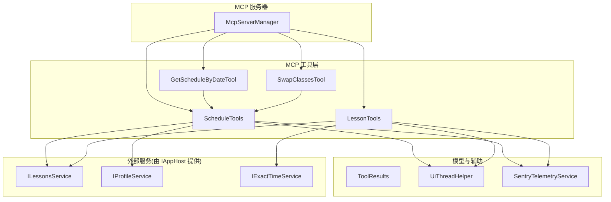
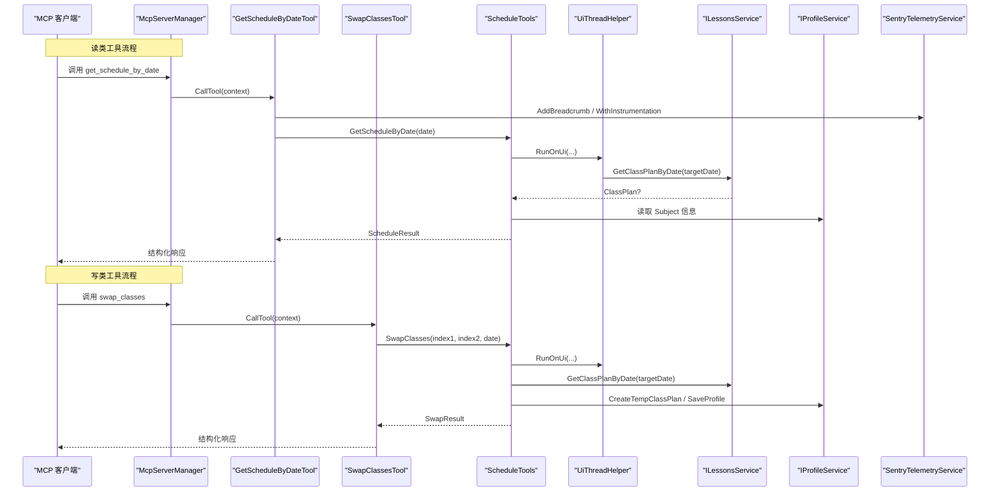
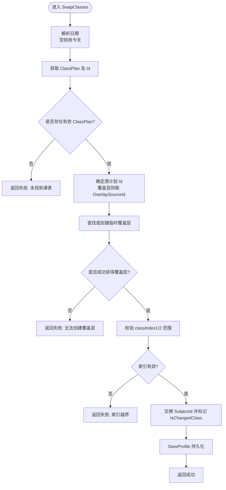
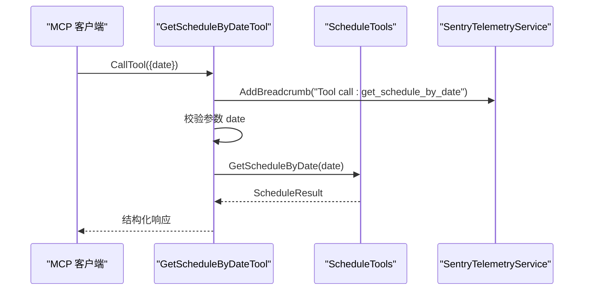
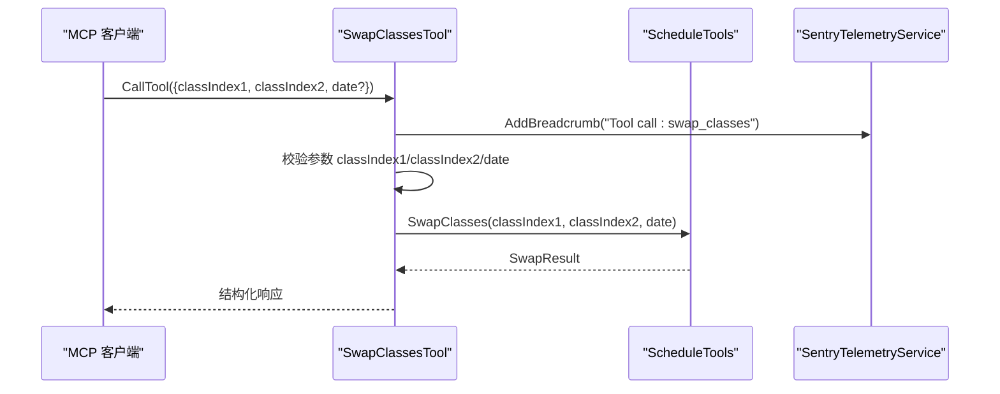
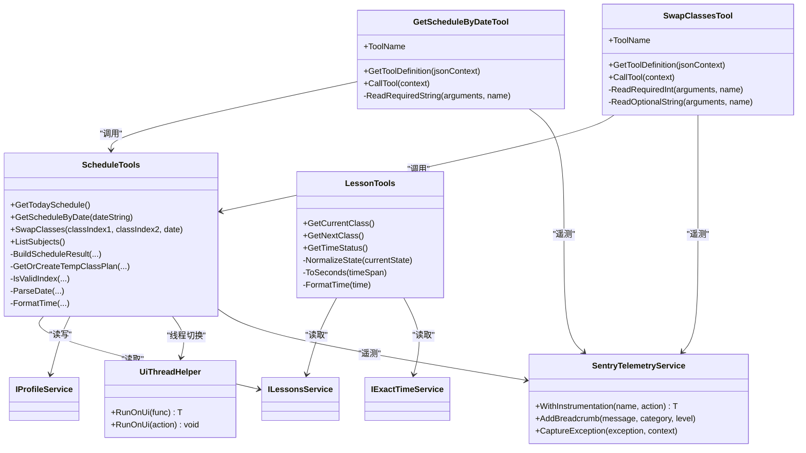

# 日程管理工具

<cite>
**本文引用的文件**   
- [Mcp/Tools/ScheduleTools.cs](file://Mcp/Tools/ScheduleTools.cs)
- [Mcp/Tools/GetScheduleByDateTool.cs](file://Mcp/Tools/GetScheduleByDateTool.cs)
- [Mcp/Tools/SwapClassesTool.cs](file://Mcp/Tools/SwapClassesTool.cs)
- [Mcp/Tools/LessonTools.cs](file://Mcp/Tools/LessonTools.cs)
- [Models/ToolResults.cs](file://Models/ToolResults.cs)
- [Helpers/UiThreadHelper.cs](file://Helpers/UiThreadHelper.cs)
- [Services/SentryTelemetryService.cs](file://Services/SentryTelemetryService.cs)
- [Mcp/McpServerManager.cs](file://Mcp/McpServerManager.cs)
</cite>

## 目录
1. [简介](#简介)
2. [项目结构](#项目结构)
3. [核心组件](#核心组件)
4. [架构总览](#架构总览)
5. [详细组件分析](#详细组件分析)
6. [依赖关系分析](#依赖关系分析)
7. [性能与并发](#性能与并发)
8. [故障排查指南](#故障排查指南)
9. [结论](#结论)
10. [附录：使用示例与扩展指南](#附录使用示例与扩展指南)

## 简介
本文件面向“日程管理工具”的开发者与使用者，系统性梳理并文档化以下能力：
- 今日课程表查询 get_today_schedule
- 指定日期课程表查询 get_schedule_by_date
- 课程交换 swap_classes（基于临时覆盖层）
- 科目列表获取 list_subjects

重点说明每个方法的参数校验、数据操作逻辑、事务处理策略、一致性保证、常见业务规则（如索引范围检查）、持久化机制与并发访问控制，并提供复杂编排场景的使用示例和扩展开发建议。

## 项目结构
围绕日程管理的代码主要分布在 Mcp/Tools 与 Models、Helpers、Services 等目录中：
- 工具实现：ScheduleTools、GetScheduleByDateTool、SwapClassesTool、LessonTools
- 结果模型：ToolResults（包含 ScheduleResult、SwapResult、SubjectListResult 等）
- UI 线程辅助：UiThreadHelper
- 遥测服务：SentryTelemetryService
- MCP 服务器注册：McpServerManager

图表来源
- [Mcp/Tools/ScheduleTools.cs:1-204](file://Mcp/Tools/ScheduleTools.cs#L1-L204)
- [Mcp/Tools/GetScheduleByDateTool.cs:1-92](file://Mcp/Tools/GetScheduleByDateTool.cs#L1-L92)
- [Mcp/Tools/SwapClassesTool.cs:1-103](file://Mcp/Tools/SwapClassesTool.cs#L1-L103)
- [Mcp/Tools/LessonTools.cs:1-146](file://Mcp/Tools/LessonTools.cs#L1-L146)
- [Models/ToolResults.cs:1-59](file://Models/ToolResults.cs#L1-L59)
- [Helpers/UiThreadHelper.cs:1-25](file://Helpers/UiThreadHelper.cs#L1-L25)
- [Services/SentryTelemetryService.cs:1-182](file://Services/SentryTelemetryService.cs#L1-L182)
- [Mcp/McpServerManager.cs:1-43](file://Mcp/McpServerManager.cs#L1-L43)

章节来源
- [Mcp/Tools/ScheduleTools.cs:1-204](file://Mcp/Tools/ScheduleTools.cs#L1-L204)
- [Mcp/Tools/GetScheduleByDateTool.cs:1-92](file://Mcp/Tools/GetScheduleByDateTool.cs#L1-L92)
- [Mcp/Tools/SwapClassesTool.cs:1-103](file://Mcp/Tools/SwapClassesTool.cs#L1-L103)
- [Mcp/Tools/LessonTools.cs:1-146](file://Mcp/Tools/LessonTools.cs#L1-L146)
- [Models/ToolResults.cs:1-59](file://Models/ToolResults.cs#L1-L59)
- [Helpers/UiThreadHelper.cs:1-25](file://Helpers/UiThreadHelper.cs#L1-L25)
- [Services/SentryTelemetryService.cs:1-182](file://Services/SentryTelemetryService.cs#L1-L182)
- [Mcp/McpServerManager.cs:1-43](file://Mcp/McpServerManager.cs#L1-L43)

## 核心组件
- ScheduleTools：封装日程读取与修改的核心逻辑，包括今日/指定日期查询、科目列表、课程交换（基于临时覆盖层）。
- GetScheduleByDateTool：MCP 工具入口，负责参数解析与调用 ScheduleTools.GetScheduleByDate。
- SwapClassesTool：MCP 工具入口，负责参数解析与调用 ScheduleTools.SwapClasses。
- LessonTools：提供当前/下一节课与时间状态查询（与日程相关但非本次重点）。
- ToolResults：定义所有返回记录类型，确保结构化输出。
- UiThreadHelper：确保对 UI 线程有依赖的服务在正确的线程上执行。
- SentryTelemetryService：统一埋点、异常上报与事务包裹。
- McpServerManager：注册并启动 MCP 服务器，将工具暴露给客户端。

章节来源
- [Mcp/Tools/ScheduleTools.cs:1-204](file://Mcp/Tools/ScheduleTools.cs#L1-L204)
- [Mcp/Tools/GetScheduleByDateTool.cs:1-92](file://Mcp/Tools/GetScheduleByDateTool.cs#L1-L92)
- [Mcp/Tools/SwapClassesTool.cs:1-103](file://Mcp/Tools/SwapClassesTool.cs#L1-L103)
- [Mcp/Tools/LessonTools.cs:1-146](file://Mcp/Tools/LessonTools.cs#L1-L146)
- [Models/ToolResults.cs:1-59](file://Models/ToolResults.cs#L1-L59)
- [Helpers/UiThreadHelper.cs:1-25](file://Helpers/UiThreadHelper.cs#L1-L25)
- [Services/SentryTelemetryService.cs:1-182](file://Services/SentryTelemetryService.cs#L1-L182)
- [Mcp/McpServerManager.cs:1-43](file://Mcp/McpServerManager.cs#L1-L43)

## 架构总览
下图展示了从 MCP 客户端到内部服务的完整调用链，以及关键的数据流向。

图表来源
- [Mcp/Tools/GetScheduleByDateTool.cs:53-78](file://Mcp/Tools/GetScheduleByDateTool.cs#L53-L78)
- [Mcp/Tools/SwapClassesTool.cs:63-80](file://Mcp/Tools/SwapClassesTool.cs#L63-L80)
- [Mcp/Tools/ScheduleTools.cs:41-103](file://Mcp/Tools/ScheduleTools.cs#L41-L103)
- [Helpers/UiThreadHelper.cs:7-12](file://Helpers/UiThreadHelper.cs#L7-L12)
- [Services/SentryTelemetryService.cs:127-148](file://Services/SentryTelemetryService.cs#L127-L148)

## 详细组件分析

### 组件一：ScheduleTools（核心日程逻辑）
职责
- 查询今日课程表：get_today_schedule
- 查询指定日期课程表：get_schedule_by_date
- 交换两节课：swap_classes（基于临时覆盖层）
- 列出全部科目：list_subjects

关键方法与行为
- get_today_schedule
  - 通过 ILessonsService.CurrentClassPlan 或按今天日期获取 ClassPlan；若为空则返回空课表结果。
  - 构建结果时合并 TimeLayout 的时间段信息与 Subject 元数据。
- get_schedule_by_date
  - 解析日期字符串（支持 yyyy-MM-dd），失败抛出参数异常；默认回退为当天。
  - 通过 ILessonsService.GetClassPlanByDate 获取目标日期的 ClassPlan。
- swap_classes
  - 参数：classIndex1、classIndex2、date（可选，空表示今天）。
  - 校验索引范围；若不存在对应日期的课表，返回失败。
  - 若原课表是覆盖层，则取 OverlaySourceId 作为源计划；否则直接使用当前 ClassPlanId。
  - 创建或复用“临时覆盖层”（Overlay）以承载换课变更，避免直接修改原始计划。
  - 交换两个位置的 SubjectId，并标记 IsChangedClass=true。
  - 调用 IProfileService.SaveProfile() 持久化。
- list_subjects
  - 从 IProfileService.Profile.Subjects 枚举出所有科目，并按名称排序返回。

数据模型
- 输入/输出均使用 ToolResults 中的记录类型，例如 ScheduleResult、SwapResult、SubjectListResult 等。

并发与线程
- 所有对外方法均在 UiThreadHelper.RunOnUi 中执行，确保对 UI 线程敏感的服务访问安全。

事务与一致性
- 换课操作采用“临时覆盖层”模式：
  - 优先查找已存在的同日期同源的覆盖层，存在则复用。
  - 不存在则通过 IProfileService.CreateTempClassPlan 创建新的覆盖层，并启用至目标日期。
  - 仅修改覆盖层的 Classes 集合，再保存整个 Profile，保证原子性。
- 未显式使用数据库事务，但通过覆盖层隔离与一次性 SaveProfile 减少中间态不一致风险。

错误处理
- 日期格式非法抛出参数异常。
- 索引越界返回失败结果。
- 其他异常被捕获后返回失败消息。

图表来源
- [Mcp/Tools/ScheduleTools.cs:58-103](file://Mcp/Tools/ScheduleTools.cs#L58-L103)
- [Mcp/Tools/ScheduleTools.cs:162-177](file://Mcp/Tools/ScheduleTools.cs#L162-L177)
- [Mcp/Tools/ScheduleTools.cs:179-182](file://Mcp/Tools/ScheduleTools.cs#L179-L182)
- [Mcp/Tools/ScheduleTools.cs:184-197](file://Mcp/Tools/ScheduleTools.cs#L184-L197)

章节来源
- [Mcp/Tools/ScheduleTools.cs:15-39](file://Mcp/Tools/ScheduleTools.cs#L15-L39)
- [Mcp/Tools/ScheduleTools.cs:41-56](file://Mcp/Tools/ScheduleTools.cs#L41-L56)
- [Mcp/Tools/ScheduleTools.cs:58-103](file://Mcp/Tools/ScheduleTools.cs#L58-L103)
- [Mcp/Tools/ScheduleTools.cs:105-131](file://Mcp/Tools/ScheduleTools.cs#L105-L131)
- [Mcp/Tools/ScheduleTools.cs:133-160](file://Mcp/Tools/ScheduleTools.cs#L133-L160)
- [Mcp/Tools/ScheduleTools.cs:162-177](file://Mcp/Tools/ScheduleTools.cs#L162-L177)
- [Mcp/Tools/ScheduleTools.cs:179-197](file://Mcp/Tools/ScheduleTools.cs#L179-L197)

### 组件二：GetScheduleByDateTool（MCP 入口）
职责
- 定义工具名、描述、输入 Schema（必填 date，格式 yyyy-MM-dd）。
- 解析 JSON 参数，调用 ScheduleTools.GetScheduleByDate。
- 结构化返回 ScheduleResult。
- 集成 Sentry 遥测：添加面包屑、异常捕获。

参数校验
- 要求 date 字段为字符串，缺失或类型不符抛出参数异常。

图表来源
- [Mcp/Tools/GetScheduleByDateTool.cs:18-51](file://Mcp/Tools/GetScheduleByDateTool.cs#L18-L51)
- [Mcp/Tools/GetScheduleByDateTool.cs:53-78](file://Mcp/Tools/GetScheduleByDateTool.cs#L53-L78)
- [Mcp/Tools/ScheduleTools.cs:41-56](file://Mcp/Tools/ScheduleTools.cs#L41-L56)

章节来源
- [Mcp/Tools/GetScheduleByDateTool.cs:1-92](file://Mcp/Tools/GetScheduleByDateTool.cs#L1-L92)

### 组件三：SwapClassesTool（MCP 入口）
职责
- 定义工具名、描述、输入 Schema（必填 classIndex1/classIndex2，可选 date）。
- 解析 JSON 参数，调用 ScheduleTools.SwapClasses。
- 结构化返回 SwapResult。
- 集成 Sentry 遥测：添加面包屑。

参数校验
- 要求 classIndex1/classIndex2 为整数，缺失或类型不符抛出参数异常。
- date 为可选字符串，未提供时使用默认值（由 ScheduleTools 内部处理）。

图表来源
- [Mcp/Tools/SwapClassesTool.cs:18-61](file://Mcp/Tools/SwapClassesTool.cs#L18-L61)
- [Mcp/Tools/SwapClassesTool.cs:63-80](file://Mcp/Tools/SwapClassesTool.cs#L63-L80)
- [Mcp/Tools/ScheduleTools.cs:58-103](file://Mcp/Tools/ScheduleTools.cs#L58-L103)

章节来源
- [Mcp/Tools/SwapClassesTool.cs:1-103](file://Mcp/Tools/SwapClassesTool.cs#L1-L103)

### 组件四：LessonTools（关联能力）
职责
- 获取当前上课信息：get_current_class
- 获取下一节课信息：get_next_class
- 获取时间状态：get_time_status

这些方法主要用于展示当前课堂状态，与日程查询互补。

章节来源
- [Mcp/Tools/LessonTools.cs:1-146](file://Mcp/Tools/LessonTools.cs#L1-L146)

## 依赖关系分析
- 工具层依赖外部服务：
  - ILessonsService：提供 CurrentClassPlan、GetClassPlanByDate、NextClassSubject 等。
  - IProfileService：提供 Profile、CreateTempClassPlan、SaveProfile 等。
  - IExactTimeService：提供精确本地时间。
- 工具层依赖辅助与遥测：
  - UiThreadHelper：确保 UI 线程安全。
  - SentryTelemetryService：埋点、异常上报、事务包裹。
- MCP 服务器管理器负责工具注册与生命周期管理。

图表来源
- [Mcp/Tools/ScheduleTools.cs:1-204](file://Mcp/Tools/ScheduleTools.cs#L1-L204)
- [Mcp/Tools/GetScheduleByDateTool.cs:1-92](file://Mcp/Tools/GetScheduleByDateTool.cs#L1-L92)
- [Mcp/Tools/SwapClassesTool.cs:1-103](file://Mcp/Tools/SwapClassesTool.cs#L1-L103)
- [Mcp/Tools/LessonTools.cs:1-146](file://Mcp/Tools/LessonTools.cs#L1-L146)
- [Helpers/UiThreadHelper.cs:1-25](file://Helpers/UiThreadHelper.cs#L1-L25)
- [Services/SentryTelemetryService.cs:1-182](file://Services/SentryTelemetryService.cs#L1-L182)

章节来源
- [Mcp/Tools/ScheduleTools.cs:1-204](file://Mcp/Tools/ScheduleTools.cs#L1-L204)
- [Mcp/Tools/GetScheduleByDateTool.cs:1-92](file://Mcp/Tools/GetScheduleByDateTool.cs#L1-L92)
- [Mcp/Tools/SwapClassesTool.cs:1-103](file://Mcp/Tools/SwapClassesTool.cs#L1-L103)
- [Mcp/Tools/LessonTools.cs:1-146](file://Mcp/Tools/LessonTools.cs#L1-L146)
- [Helpers/UiThreadHelper.cs:1-25](file://Helpers/UiThreadHelper.cs#L1-L25)
- [Services/SentryTelemetryService.cs:1-182](file://Services/SentryTelemetryService.cs#L1-L182)

## 性能与并发
- UI 线程调度：所有涉及 UI 线程的方法都通过 UiThreadHelper.RunOnUi 包装，避免跨线程访问导致的异常与竞态。
- 覆盖层复用：swap_classes 会先尝试复用已有的临时覆盖层，减少重复创建开销。
- 序列化与结构化返回：工具返回结构化记录，便于高效传输与消费。
- 遥测开销：SentryTelemetryService 仅在启用时注入额外开销，且提供 WithInstrumentation 自动包裹，避免手动样板代码。

优化建议
- 批量换课：如需多次交换，可考虑在单次会话内复用同一覆盖层对象，减少多次 SaveProfile 的开销。
- 缓存热点数据：对于频繁读取的科目列表，可在应用层做短期缓存（注意失效策略）。
- 异步化：若后续引入耗时 IO，可将 UI 线程内的阻塞操作改为异步并在 UI 线程回调。

[本节为通用指导，不直接分析具体文件]

## 故障排查指南
常见问题与定位要点
- 日期格式错误
  - 现象：调用 get_schedule_by_date 时报参数异常。
  - 原因：传入的 date 不符合 yyyy-MM-dd 格式。
  - 处理：修正日期格式或使用今天（空字符串）。
  - 参考路径：[Mcp/Tools/ScheduleTools.cs:184-197](file://Mcp/Tools/ScheduleTools.cs#L184-L197)
- 索引越界
  - 现象：swap_classes 返回失败，提示索引越界。
  - 原因：classIndex1 或 classIndex2 超出当日课程数量。
  - 处理：先通过 get_schedule_by_date 确认课程数量与顺序，再调整索引。
  - 参考路径：[Mcp/Tools/ScheduleTools.cs:179-182](file://Mcp/Tools/ScheduleTools.cs#L179-L182)
- 未找到课表
  - 现象：swap_classes 返回失败，提示未找到课表。
  - 原因：目标日期无 ClassPlan。
  - 处理：先创建或导入该日期的课表，再进行交换。
  - 参考路径：[Mcp/Tools/ScheduleTools.cs:70-74](file://Mcp/Tools/ScheduleTools.cs#L70-L74)
- 覆盖层创建失败
  - 现象：swap_classes 返回失败，提示无法创建临时覆盖层。
  - 原因：底层 IProfileService.CreateTempClassPlan 失败。
  - 处理：检查权限与配置，重试或联系管理员。
  - 参考路径：[Mcp/Tools/ScheduleTools.cs:76-83](file://Mcp/Tools/ScheduleTools.cs#L76-L83)
- 遥测与日志
  - 现象：需要定位问题链路。
  - 处理：查看 Sentry 面包屑与异常上下文，结合 ILogger 输出。
  - 参考路径：[Services/SentryTelemetryService.cs:127-148](file://Services/SentryTelemetryService.cs#L127-L148)、[Mcp/Tools/GetScheduleByDateTool.cs:53-78](file://Mcp/Tools/GetScheduleByDateTool.cs#L53-L78)

章节来源
- [Mcp/Tools/ScheduleTools.cs:70-83](file://Mcp/Tools/ScheduleTools.cs#L70-L83)
- [Mcp/Tools/ScheduleTools.cs:179-197](file://Mcp/Tools/ScheduleTools.cs#L179-L197)
- [Services/SentryTelemetryService.cs:127-148](file://Services/SentryTelemetryService.cs#L127-L148)
- [Mcp/Tools/GetScheduleByDateTool.cs:53-78](file://Mcp/Tools/GetScheduleByDateTool.cs#L53-L78)

## 结论
本日程管理工具通过清晰的工具分层与统一的模型定义，提供了稳定的日程查询与轻量级修改能力。其核心优势在于：
- 使用临时覆盖层进行非破坏性修改，保障原始课表完整性。
- 严格的参数校验与异常处理，提升鲁棒性。
- 统一的 UI 线程调度与遥测埋点，便于调试与监控。
- 结构化输出，利于上层系统集成。

建议在后续迭代中补充更丰富的业务规则（如时间冲突检测、权限验证）与更强的并发控制（如锁或队列），以满足更复杂的编排需求。

[本节为总结性内容，不直接分析具体文件]

## 附录：使用示例与扩展指南

### 使用示例
- 查询今日课程表
  - 工具：get_today_schedule
  - 用途：快速了解今天的课程安排与时间。
  - 参考路径：[Mcp/Tools/ScheduleTools.cs:15-39](file://Mcp/Tools/ScheduleTools.cs#L15-L39)
- 查询指定日期课程表
  - 工具：get_schedule_by_date
  - 参数：date（yyyy-MM-dd）
  - 用途：查看历史或未来某天的课程安排。
  - 参考路径：[Mcp/Tools/GetScheduleByDateTool.cs:53-78](file://Mcp/Tools/GetScheduleByDateTool.cs#L53-L78)
- 交换两节课
  - 工具：swap_classes
  - 参数：classIndex1、classIndex2（从 0 开始），date（可选，空表示今天）
  - 用途：临时替换某天的两节课，不影响原始课表。
  - 参考路径：[Mcp/Tools/SwapClassesTool.cs:63-80](file://Mcp/Tools/SwapClassesTool.cs#L63-L80)
- 获取科目列表
  - 工具：list_subjects
  - 用途：列举所有可用科目及其教师信息，用于选择或展示。
  - 参考路径：[Mcp/Tools/ScheduleTools.cs:105-131](file://Mcp/Tools/ScheduleTools.cs#L105-L131)

### 复杂编排场景
- 多日批量换课
  - 步骤：
    1) 对每一天分别调用 get_schedule_by_date 获取课程数量与顺序。
    2) 针对需要交换的日期，调用 swap_classes 进行替换。
    3) 最后通过 list_subjects 核对科目映射是否正确。
  - 注意事项：
    - 每次交换都会创建或复用覆盖层，避免重复创建。
    - 若需撤销，可通过删除覆盖层或重新生成覆盖层的方式恢复。
- 动态排课
  - 步骤：
    1) 使用 list_subjects 获取可用科目。
    2) 根据业务规则（如教师空闲、教室资源）选择科目。
    3) 通过 swap_classes 将选定的科目插入到目标位置。
  - 注意事项：
    - 当前实现未内置时间冲突检测，需在调用方自行校验时间段重叠。
    - 建议在上层维护一个短期缓存，减少重复查询。

### 数据持久化与一致性
- 持久化机制
  - 通过 IProfileService.SaveProfile 保存更改，确保覆盖层生效。
  - 覆盖层通过 OverlaySourceId 指向源计划，便于溯源与撤销。
- 一致性保证
  - 覆盖层隔离：修改仅作用于覆盖层，不污染原始计划。
  - 原子保存：一次 SaveProfile 提交所有变更，降低中间态不一致风险。
- 并发访问控制
  - 当前实现未显式加锁，依赖 UI 线程串行化与覆盖层复用。
  - 在高并发场景下，建议在上层增加互斥或队列，避免并发覆盖层冲突。

### 业务规则与扩展
- 时间冲突检测
  - 当前未内置，可在调用方基于 TimeLayout 的 StartTime/EndTime 进行区间重叠判断。
- 权限验证
  - 可在 MCP 入口层增加鉴权中间件，限制写类工具的调用者。
- 数据完整性检查
  - 建议在 swap_classes 前校验 SubjectId 是否存在于 Subjects 字典中。
- 扩展开发指南
  - 新增工具：参照 GetScheduleByDateTool/SwapClassesTool 的模式，定义 InputSchema 与 CallTool 实现。
  - 新增业务规则：在 ScheduleTools 中增加校验与转换逻辑，保持 UI 线程安全。
  - 增强遥测：使用 SentryTelemetryService.WithInstrumentation 包裹关键路径。

章节来源
- [Mcp/Tools/ScheduleTools.cs:105-131](file://Mcp/Tools/ScheduleTools.cs#L105-L131)
- [Mcp/Tools/GetScheduleByDateTool.cs:53-78](file://Mcp/Tools/GetScheduleByDateTool.cs#L53-L78)
- [Mcp/Tools/SwapClassesTool.cs:63-80](file://Mcp/Tools/SwapClassesTool.cs#L63-L80)
- [Mcp/Tools/ScheduleTools.cs:162-177](file://Mcp/Tools/ScheduleTools.cs#L162-L177)