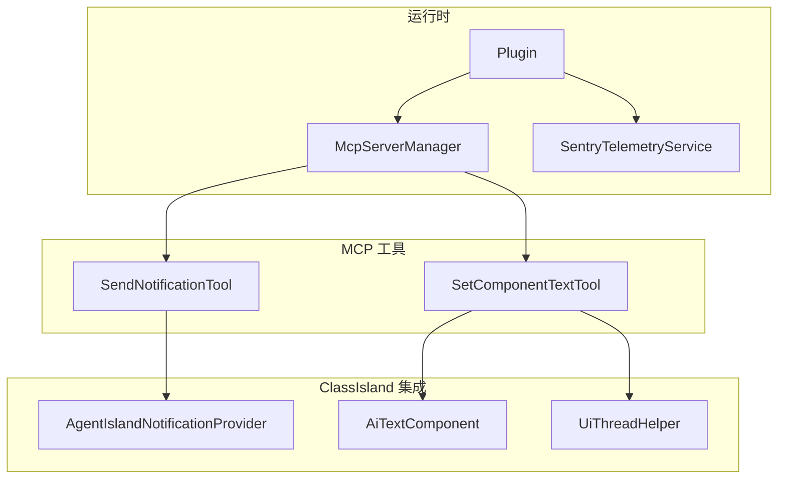
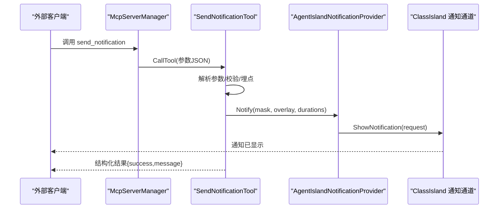
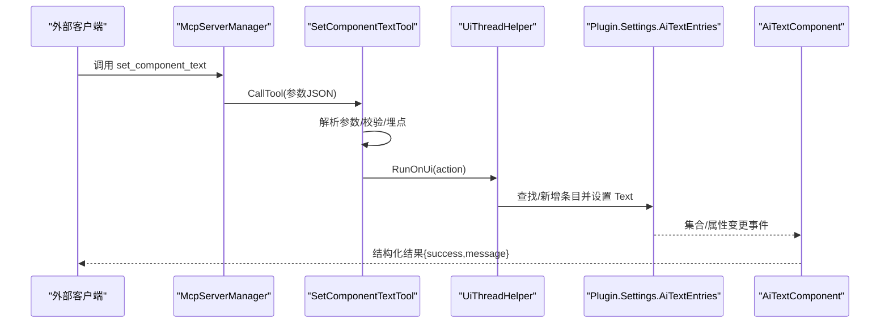
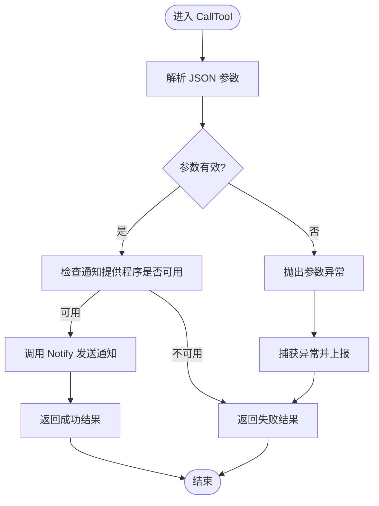
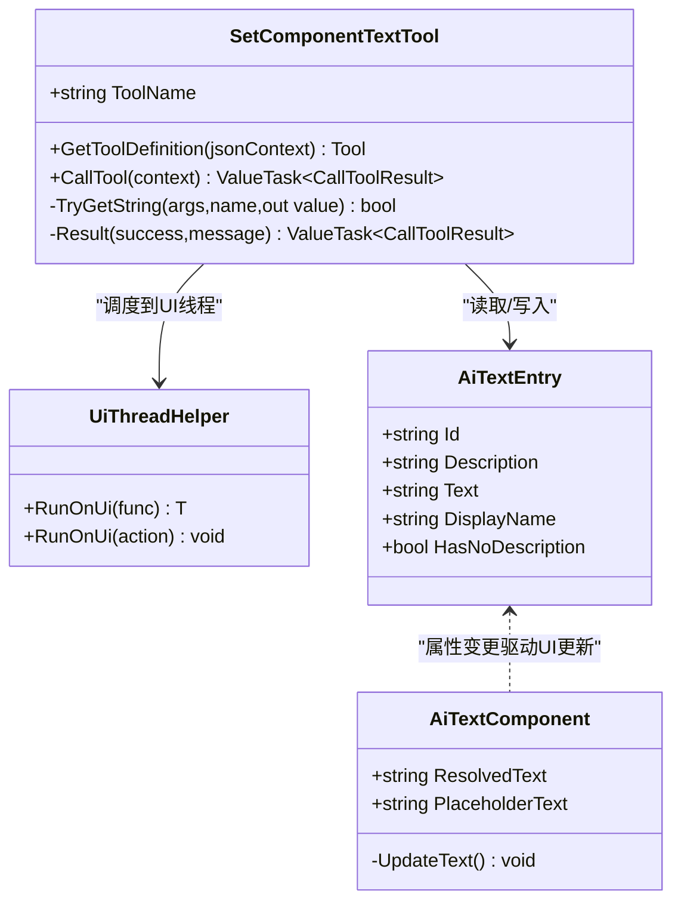
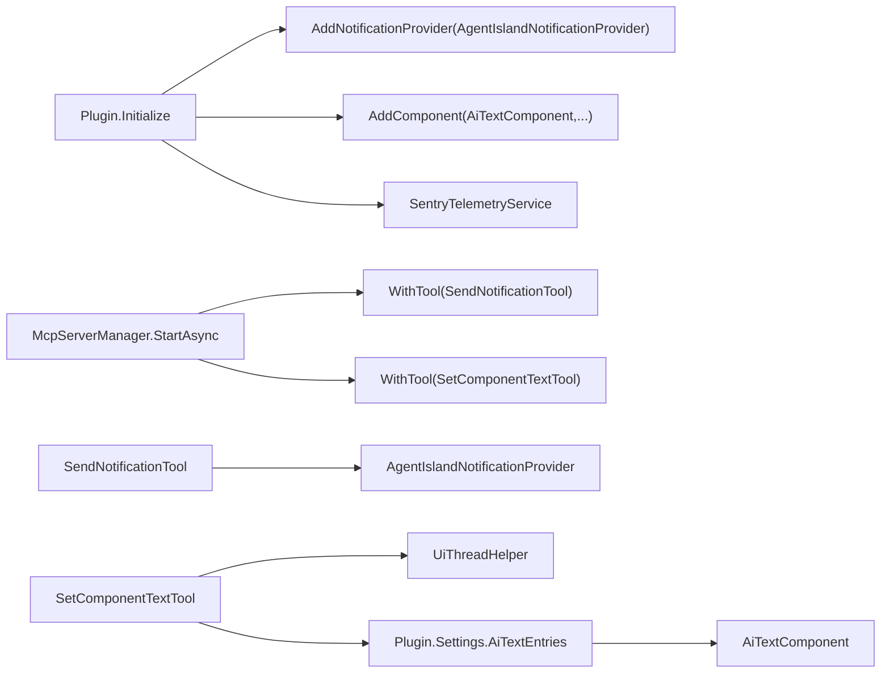

# 系统交互工具

<cite>
**本文引用的文件**   
- [SendNotificationTool.cs](file://Mcp/Tools/SendNotificationTool.cs)
- [SetComponentTextTool.cs](file://Mcp/Tools/SetComponentTextTool.cs)
- [AgentIslandNotificationProvider.cs](file://Mcp/Tools/AgentIslandNotificationProvider.cs)
- [UiThreadHelper.cs](file://Helpers/UiThreadHelper.cs)
- [ToolResults.cs](file://Models/ToolResults.cs)
- [AiTextEntry.cs](file://Models/AiTextEntry.cs)
- [AiTextComponentSettings.cs](file://Models/AiTextComponentSettings.cs)
- [AiTextComponent.axaml.cs](file://Components/AiTextComponent.axaml.cs)
- [Plugin.cs](file://Plugin.cs)
- [McpServerManager.cs](file://Mcp/McpServerManager.cs)
- [SentryTelemetryService.cs](file://Services/SentryTelemetryService.cs)
</cite>

## 目录
1. [简介](#简介)
2. [项目结构](#项目结构)
3. [核心组件](#核心组件)
4. [架构总览](#架构总览)
5. [详细组件分析](#详细组件分析)
6. [依赖关系分析](#依赖关系分析)
7. [性能与并发特性](#性能与并发特性)
8. [故障排查指南](#故障排查指南)
9. [结论](#结论)
10. [附录：使用示例与最佳实践](#附录使用示例与最佳实践)

## 简介
本文件聚焦于 AgentIsland 插件中与 ClassIsland UI 系统进行交互的两大 MCP 工具：
- send_notification：在 ClassIsland 界面发送通知提醒（遮罩+可选正文覆盖层）
- set_component_text：按 ID 更新主界面上“AI 文字”组件的显示文本

文档将深入说明参数格式、消息队列与异步执行机制、与 ClassIsland 事件驱动架构的集成方式，并提供常见交互模式（批量操作、条件触发、状态同步）、用户体验优化建议与可访问性支持要点。

## 项目结构
围绕系统交互工具的关键代码分布在以下位置：
- Mcp/Tools：工具实现与通知提供程序
- Helpers：UI 线程调度辅助
- Models：结果模型与数据项
- Components：UI 组件绑定与展示逻辑
- Plugin：插件初始化与服务注册
- Mcp/McpServerManager：MCP 服务器启动与工具注册
- Services：遥测服务（Sentry）

图表来源
- [Plugin.cs:29-53](file://Plugin.cs#L29-L53)
- [McpServerManager.cs:25-82](file://Mcp/McpServerManager.cs#L25-L82)
- [SendNotificationTool.cs:68-105](file://Mcp/Tools/SendNotificationTool.cs#L68-L105)
- [SetComponentTextTool.cs:41-72](file://Mcp/Tools/SetComponentTextTool.cs#L41-L72)
- [AgentIslandNotificationProvider.cs:27-50](file://Mcp/Tools/AgentIslandNotificationProvider.cs#L27-L50)
- [AiTextComponent.axaml.cs:36-56](file://Components/AiTextComponent.axaml.cs#L36-L56)
- [UiThreadHelper.cs:7-23](file://Helpers/UiThreadHelper.cs#L7-L23)

章节来源
- [Plugin.cs:29-53](file://Plugin.cs#L29-L53)
- [McpServerManager.cs:25-82](file://Mcp/McpServerManager.cs#L25-L82)

## 核心组件
- SendNotificationTool：定义 send_notification 工具的输入 Schema、调用入口、参数解析、错误处理与结构化返回。通过 AgentIslandNotificationProvider 向 ClassIsland 通知通道发送通知。
- SetComponentTextTool：定义 set_component_text 工具的输入 Schema、调用入口、参数校验、UI 线程安全更新与结构化返回。通过 UiThreadHelper 确保对设置集合的修改在 UI 线程执行。
- AgentIslandNotificationProvider：ClassIsland 通知提供程序实现，负责创建遮罩内容与可选覆盖层内容，并通过 Channel 显示通知。
- UiThreadHelper：封装 Avalonia Dispatcher 的跨线程调度，避免 UI 线程访问异常。
- AiTextComponent：订阅设置集合变化并响应属性变更，动态渲染当前条目文本或占位符。
- SentryTelemetryService：统一埋点与异常上报，为工具调用添加面包屑与事务追踪。

章节来源
- [SendNotificationTool.cs:16-105](file://Mcp/Tools/SendNotificationTool.cs#L16-L105)
- [SetComponentTextTool.cs:17-72](file://Mcp/Tools/SetComponentTextTool.cs#L17-L72)
- [AgentIslandNotificationProvider.cs:12-50](file://Mcp/Tools/AgentIslandNotificationProvider.cs#L12-L50)
- [UiThreadHelper.cs:5-23](file://Helpers/UiThreadHelper.cs#L5-L23)
- [AiTextComponent.axaml.cs:16-84](file://Components/AiTextComponent.axaml.cs#L16-L84)
- [SentryTelemetryService.cs:11-122](file://Services/SentryTelemetryService.cs#L11-L122)

## 架构总览
整体采用事件驱动与工具化架构：
- 外部客户端通过 HTTP 调用 MCP 服务器暴露的工具方法
- 工具内部进行参数校验、日志记录与遥测埋点
- 通知类工具通过 ClassIsland 的通知通道异步派发
- 组件更新类工具通过 UI 线程调度更新数据源，由 UI 组件监听数据变化自动刷新

图表来源
- [McpServerManager.cs:25-82](file://Mcp/McpServerManager.cs#L25-L82)
- [SendNotificationTool.cs:68-105](file://Mcp/Tools/SendNotificationTool.cs#L68-L105)
- [AgentIslandNotificationProvider.cs:27-50](file://Mcp/Tools/AgentIslandNotificationProvider.cs#L27-L50)

图表来源
- [McpServerManager.cs:25-82](file://Mcp/McpServerManager.cs#L25-L82)
- [SetComponentTextTool.cs:41-72](file://Mcp/Tools/SetComponentTextTool.cs#L41-L72)
- [UiThreadHelper.cs:7-23](file://Helpers/UiThreadHelper.cs#L7-L23)
- [AiTextComponent.axaml.cs:36-84](file://Components/AiTextComponent.axaml.cs#L36-L84)

## 详细组件分析

### SendNotificationTool（send_notification）
- 工具名称与描述：用于在 ClassIsland 界面显示一条提醒通知
- 输入 Schema 字段
  - message：必填字符串，通知标题/遮罩文字
  - body：可选字符串，通知正文/覆盖层文字
  - maskDuration：可选数字，遮罩显示时长（秒），默认 3.0
  - overlayDuration：可选数字，正文显示时长（秒），默认 5.0
- 输出结果：结构化对象包含 success 与 message 字段
- 关键流程
  - 获取遥测服务并记录调用面包屑
  - 解析 JSON 参数并进行类型校验
  - 若通知提供程序未初始化，直接返回失败结果
  - 调用通知提供程序的 Notify 方法
  - 捕获异常并上报，返回结构化错误信息
- 异步与线程
  - 通知提供程序内部通过 UI 线程调度显示通知，避免跨线程访问 UI
- 错误处理
  - 参数缺失或类型不合法抛出异常
  - 提供程序未初始化时返回明确错误
  - 所有异常均被捕获并上报

图表来源
- [SendNotificationTool.cs:68-105](file://Mcp/Tools/SendNotificationTool.cs#L68-L105)
- [AgentIslandNotificationProvider.cs:27-50](file://Mcp/Tools/AgentIslandNotificationProvider.cs#L27-L50)

章节来源
- [SendNotificationTool.cs:16-105](file://Mcp/Tools/SendNotificationTool.cs#L16-L105)
- [ToolResults.cs:51-57](file://Models/ToolResults.cs#L51-L57)

### SetComponentTextTool（set_component_text）
- 工具名称与描述：按 ID 更新 ClassIsland 主界面上 AI 文字组件显示的内容
- 输入 Schema 字段
  - id：必填字符串，对应设置页中创建的 AI 文字条目 ID
  - text：必填字符串，要显示的文本内容
- 输出结果：结构化对象包含 success 与 message 字段
- 关键流程
  - 获取遥测服务并记录调用面包屑
  - 解析 JSON 参数并进行类型校验
  - 使用 UiThreadHelper 在 UI 线程上查找或新增条目并设置文本
  - 返回结构化结果；异常被捕获并上报
- 线程与数据绑定
  - 通过 UiThreadHelper 确保对设置的写入在 UI 线程执行
  - AiTextComponent 订阅设置集合与条目属性变更，自动刷新显示

图表来源
- [SetComponentTextTool.cs:17-91](file://Mcp/Tools/SetComponentTextTool.cs#L17-L91)
- [UiThreadHelper.cs:5-23](file://Helpers/UiThreadHelper.cs#L5-L23)
- [AiTextEntry.cs:5-30](file://Models/AiTextEntry.cs#L5-L30)
- [AiTextComponent.axaml.cs:16-84](file://Components/AiTextComponent.axaml.cs#L16-L84)

章节来源
- [SetComponentTextTool.cs:17-91](file://Mcp/Tools/SetComponentTextTool.cs#L17-L91)
- [AiTextEntry.cs:5-30](file://Models/AiTextEntry.cs#L5-L30)
- [AiTextComponent.axaml.cs:36-84](file://Components/AiTextComponent.axaml.cs#L36-L84)

### AgentIslandNotificationProvider（通知提供程序）
- 职责：实现 ClassIsland 的通知提供程序接口，创建遮罩内容与可选覆盖层内容，并通过指定渠道显示通知
- 关键行为
  - 构造时注册自身实例
  - Notify 方法在 UI 线程创建 NotificationRequest 并调用 Channel.ShowNotification
  - 支持遮罩时长与覆盖层时长配置
- 与工具集成
  - SendNotificationTool 直接调用其静态 Instance 的 Notify 方法

章节来源
- [AgentIslandNotificationProvider.cs:12-50](file://Mcp/Tools/AgentIslandNotificationProvider.cs#L12-L50)

### UiThreadHelper（UI 线程调度）
- 职责：封装 Avalonia Dispatcher 的跨线程调用，避免 UI 线程访问异常
- 方法
  - RunOnUi<T>(Func<T>)：返回值的 UI 调度
  - RunOnUi(Action)：无返回值的 UI 调度

章节来源
- [UiThreadHelper.cs:5-23](file://Helpers/UiThreadHelper.cs#L5-L23)

### 数据模型与结果
- NotificationResult：通知工具的结构化返回
- SetTextResult：组件文本更新工具的结构化返回
- AiTextEntry：AI 文字条目，包含 Id、Description、Text 等属性，支持属性变更通知
- AiTextComponentSettings：组件设置，包括 EntryId 与 PlaceholderText

章节来源
- [ToolResults.cs:51-57](file://Models/ToolResults.cs#L51-L57)
- [AiTextEntry.cs:5-30](file://Models/AiTextEntry.cs#L5-L30)
- [AiTextComponentSettings.cs:5-12](file://Models/AiTextComponentSettings.cs#L5-L12)

## 依赖关系分析
- 工具注册与生命周期
  - Plugin 初始化时注册通知提供程序、组件与设置页
  - McpServerManager 启动时注册所有工具，包括 send_notification 与 set_component_text
- 外部依赖
  - ClassIsland Core 抽象与通知通道
  - Avalonia Dispatcher 用于 UI 线程调度
  - Sentry SDK 用于遥测与异常上报

图表来源
- [Plugin.cs:29-53](file://Plugin.cs#L29-L53)
- [McpServerManager.cs:25-82](file://Mcp/McpServerManager.cs#L25-L82)
- [SendNotificationTool.cs:68-105](file://Mcp/Tools/SendNotificationTool.cs#L68-L105)
- [SetComponentTextTool.cs:41-72](file://Mcp/Tools/SetComponentTextTool.cs#L41-L72)
- [AiTextComponent.axaml.cs:36-84](file://Components/AiTextComponent.axaml.cs#L36-L84)

章节来源
- [Plugin.cs:29-53](file://Plugin.cs#L29-L53)
- [McpServerManager.cs:25-82](file://Mcp/McpServerManager.cs#L25-L82)

## 性能与并发特性
- 通知发送
  - 通知提供程序在 UI 线程创建请求并显示，避免阻塞工作线程
  - 遮罩与覆盖层时长可配置，合理设置可减少 UI 抖动
- 组件文本更新
  - 通过 UiThreadHelper 确保写操作在 UI 线程执行，避免跨线程异常
  - 组件通过属性变更事件驱动 UI 刷新，减少手动重绘开销
- 遥测与日志
  - 每个工具调用都会记录面包屑与事务，便于定位性能瓶颈
- 并发建议
  - 高频调用场景下，建议在客户端侧做节流与去重，避免频繁 UI 更新
  - 批量更新时合并多次 set_component_text 调用，降低 UI 线程压力

[本节为通用指导，无需特定文件引用]

## 故障排查指南
- 通知未显示
  - 检查通知提供程序是否已初始化（Instance 是否为空）
  - 确认 ClassIsland 通知通道可用
  - 查看 Sentry 面包屑与异常上报
- 组件文本未更新
  - 确认传入的 id 是否存在于设置集合
  - 检查 UiThreadHelper 是否正确调度
  - 观察 AiTextComponent 的属性变更事件是否触发
- 常见问题定位
  - 参数缺失或类型不合法会抛出异常，需检查输入 JSON
  - 工具调用异常会被捕获并上报，可在 Sentry 中检索上下文

章节来源
- [SendNotificationTool.cs:85-104](file://Mcp/Tools/SendNotificationTool.cs#L85-L104)
- [SetComponentTextTool.cs:46-71](file://Mcp/Tools/SetComponentTextTool.cs#L46-L71)
- [SentryTelemetryService.cs:95-122](file://Services/SentryTelemetryService.cs#L95-L122)

## 结论
两个系统交互工具分别覆盖了“通知提醒”和“组件文本更新”两类典型的用户界面交互场景。它们遵循统一的工具契约与结构化返回格式，结合 ClassIsland 的事件驱动架构与 Avalonia 的 UI 线程模型，实现了稳定可靠的跨进程交互。配合遥测与日志，便于在生产环境进行问题定位与性能优化。

[本节为总结性内容，无需特定文件引用]

## 附录：使用示例与最佳实践

### 通知发送（send_notification）
- 基本通知
  - 仅标题：message 必填，body 可选为空
  - 带正文：同时设置 message 与 body
- 控制显示时长
  - maskDuration：遮罩显示时间（秒）
  - overlayDuration：正文显示时间（秒）
- 批量通知
  - 建议在客户端侧进行节流与去重，避免短时间内重复显示相同内容
- 条件触发
  - 根据业务状态决定是否发送通知，例如仅在任务完成或失败时触发
- 用户偏好
  - 可通过上层配置决定是否需要通知以及默认时长

章节来源
- [SendNotificationTool.cs:18-45](file://Mcp/Tools/SendNotificationTool.cs#L18-L45)
- [AgentIslandNotificationProvider.cs:27-50](file://Mcp/Tools/AgentIslandNotificationProvider.cs#L27-L50)

### 组件文本更新（set_component_text）
- 更新已有条目
  - 传入存在的 id 与新的 text，组件将自动刷新显示
- 新增条目
  - 传入新 id 与 text，工具会在设置集合中新增条目并设置文本
- 批量更新
  - 合并多条更新以减少 UI 线程调度次数
- 条件触发
  - 根据数据源变化或外部事件触发更新，保持 UI 与数据一致
- 状态同步
  - 组件通过属性变更事件驱动 UI 刷新，无需手动刷新

章节来源
- [SetComponentTextTool.cs:19-28](file://Mcp/Tools/SetComponentTextTool.cs#L19-L28)
- [SetComponentTextTool.cs:56-63](file://Mcp/Tools/SetComponentTextTool.cs#L56-L63)
- [AiTextComponent.axaml.cs:60-83](file://Components/AiTextComponent.axaml.cs#L60-L83)

### 消息优先级、去重机制与用户偏好
- 优先级
  - 当前实现未内置消息优先级队列，如需优先级可在客户端侧维护队列并按策略分发
- 去重机制
  - 当前实现未内置去重，建议在客户端侧基于消息内容或 ID 进行去重
- 用户偏好
  - 可通过上层设置控制通知开关、默认时长与组件占位符文本

[本节为概念性指导，无需特定文件引用]

### 用户体验优化与可访问性支持
- 用户体验优化
  - 合理设置遮罩与覆盖层时长，避免过长影响使用体验
  - 批量更新合并，减少 UI 抖动
  - 提供清晰的错误消息，便于快速定位问题
- 可访问性支持
  - 通知内容应简洁明了，避免冗长文本
  - 组件文本更新后，确保屏幕阅读器能感知到内容变化（由 ClassIsland 框架保障）

[本节为通用指导，无需特定文件引用]