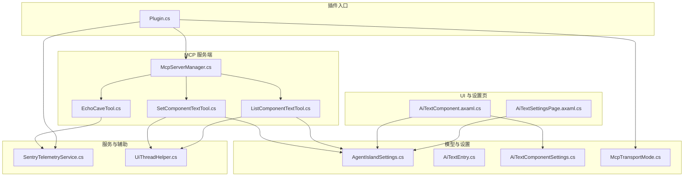
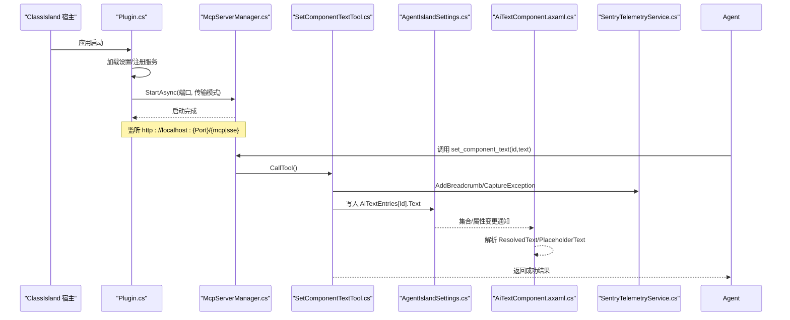
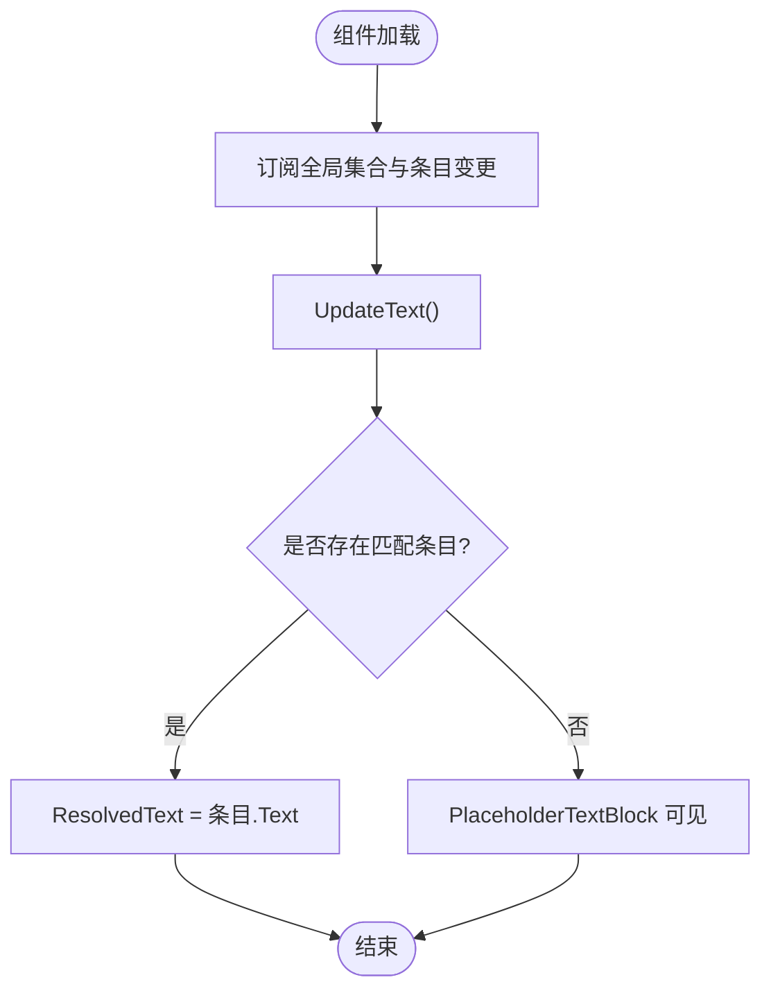
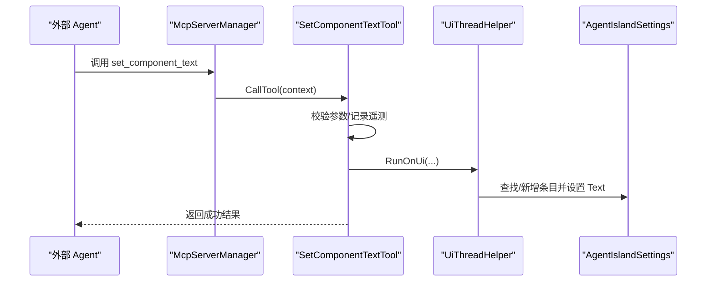
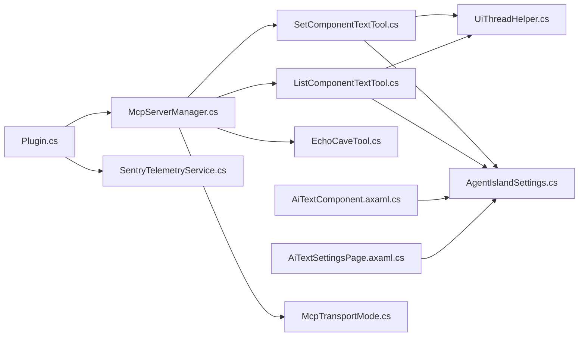

# AI 文字管理工具

<cite>
**本文引用的文件**   
- [Plugin.cs](file://Plugin.cs)
- [manifest.yml](file://manifest.yml)
- [AgentIsland.csproj](file://AgentIsland.csproj)
- [AGENTS.md](file://AGENTS.md)
- [McpServerManager.cs](file://Mcp/McpServerManager.cs)
- [AiTextComponent.axaml.cs](file://Components/AiTextComponent.axaml.cs)
- [AiTextEntry.cs](file://Models/AiTextEntry.cs)
- [AiTextComponentSettings.cs](file://Models/AiTextComponentSettings.cs)
- [SetComponentTextTool.cs](file://Mcp/Tools/SetComponentTextTool.cs)
- [ListComponentTextTool.cs](file://Mcp/Tools/ListComponentTextTool.cs)
- [EchoCaveTool.cs](file://Mcp/Tools/EchoCaveTool.cs)
- [SentryTelemetryService.cs](file://Services/SentryTelemetryService.cs)
- [McpTransportMode.cs](file://Models/McpTransportMode.cs)
- [UiThreadHelper.cs](file://Helpers/UiThreadHelper.cs)
- [AiTextSettingsPage.axaml.cs](file://Views/SettingsPages/AiTextSettingsPage.axaml.cs)
</cite>

## 目录
1. [简介](#简介)
2. [项目结构](#项目结构)
3. [核心组件](#核心组件)
4. [架构总览](#架构总览)
5. [详细组件分析](#详细组件分析)
6. [依赖关系分析](#依赖关系分析)
7. [性能与可靠性](#性能与可靠性)
8. [故障排查指南](#故障排查指南)
9. [结论](#结论)
10. [附录](#附录)

## 简介
本插件为 ClassIsland 的扩展，提供“AI 文字管理”能力：通过 MCP（Model Context Protocol）对外暴露工具，允许外部 AI Agent 动态更新 ClassIsland 主界面上的“AI 文字”组件内容。同时内置设置页、遥测上报、自动化动作等配套能力。

## 项目结构
- 插件入口与生命周期：负责加载配置、注册服务、启动/停止 MCP 服务器、注册 UI 组件与设置页。
- MCP 服务端：基于 DotNetCampus.ModelContextProtocol 实现，支持 Streamable HTTP 与 SSE 两种传输模式。
- 工具集：包括课程/课表相关工具、通知工具、以及“AI 文字”增删改查工具与回声洞随机文本工具。
- 模型与设置：集中式设置对象，包含端口、传输模式、遥测开关、隐私协议同意状态、AI 文字条目集合等。
- UI 组件与设置页：Avalonia 界面，展示并编辑 AI 文字条目；设置页用于新增/删除条目。
- 辅助与服务：UI 线程调度助手、Sentry 遥测服务封装。

图表来源
- [Plugin.cs:33-103](file://Plugin.cs#L33-L103)
- [McpServerManager.cs:25-87](file://Mcp/McpServerManager.cs#L25-L87)
- [SetComponentTextTool.cs:41-72](file://Mcp/Tools/SetComponentTextTool.cs#L41-L72)
- [ListComponentTextTool.cs:37-65](file://Mcp/Tools/ListComponentTextTool.cs#L37-L65)
- [EchoCaveTool.cs:48-92](file://Mcp/Tools/EchoCaveTool.cs#L48-L92)
- [AiTextComponent.axaml.cs:36-83](file://Components/AiTextComponent.axaml.cs#L36-L83)
- [AiTextSettingsPage.axaml.cs:16-34](file://Views/SettingsPages/AiTextSettingsPage.axaml.cs#L16-L34)
- [SentryTelemetryService.cs:30-90](file://Services/SentryTelemetryService.cs#L30-L90)
- [McpTransportMode.cs:6-17](file://Models/McpTransportMode.cs#L6-L17)

章节来源
- [AGENTS.md:24-61](file://AGENTS.md#L24-L61)
- [manifest.yml:1-16](file://manifest.yml#L1-L16)
- [AgentIsland.csproj:1-56](file://AgentIsland.csproj#L1-L56)

## 核心组件
- 插件入口与生命周期
  - 负责加载 Settings.json、注册遥测、注入服务、注册组件与设置页、订阅应用启动/停止事件以启停 MCP 服务器。
- MCP 服务器管理器
  - 根据传输模式选择端点（mcp/sse），构建并启动本地 HTTP 服务器，注册所有工具。
- AI 文字组件
  - 绑定到全局 AiTextEntries 集合，按 EntryId 解析显示文本或占位符。
- 设置页
  - 提供添加/删除 AI 文字条目的操作，数据源为全局设置对象。
- 遥测服务
  - 根据用户同意与开关动态初始化 Sentry SDK，提供异常捕获与事务埋点。

章节来源
- [Plugin.cs:33-103](file://Plugin.cs#L33-L103)
- [McpServerManager.cs:25-87](file://Mcp/McpServerManager.cs#L25-L87)
- [AiTextComponent.axaml.cs:36-83](file://Components/AiTextComponent.axaml.cs#L36-L83)
- [AiTextSettingsPage.axaml.cs:16-34](file://Views/SettingsPages/AiTextSettingsPage.axaml.cs#L16-L34)
- [SentryTelemetryService.cs:30-90](file://Services/SentryTelemetryService.cs#L30-L90)

## 架构总览
整体采用“插件 + 本地 MCP 服务器 + 工具 + 数据模型 + UI 组件”的分层架构。插件在应用启动时按需启动 MCP 服务器，外部 Agent 通过 HTTP 调用工具，工具读写全局设置中的 AI 文字条目，UI 组件实时响应变化进行渲染。

图表来源
- [Plugin.cs:79-103](file://Plugin.cs#L79-L103)
- [McpServerManager.cs:25-87](file://Mcp/McpServerManager.cs#L25-L87)
- [SetComponentTextTool.cs:41-72](file://Mcp/Tools/SetComponentTextTool.cs#L41-L72)
- [AiTextComponent.axaml.cs:73-83](file://Components/AiTextComponent.axaml.cs#L73-L83)
- [SentryTelemetryService.cs:114-122](file://Services/SentryTelemetryService.cs#L114-L122)

## 详细组件分析

### 插件入口与生命周期（Plugin）
- 职责
  - 读取并持久化设置；注册遥测、服务、组件、设置页与自动化动作；订阅宿主生命周期事件，控制 MCP 服务器启停。
- 关键点
  - 使用 ConfigureFileHelper 自动保存设置；根据 TransportMode 输出不同端点日志；异常上报至 Sentry。
- 错误处理
  - 启动/停止失败均记录日志并上报异常。

章节来源
- [Plugin.cs:33-103](file://Plugin.cs#L33-L103)
- [Plugin.cs:105-121](file://Plugin.cs#L105-L121)

### MCP 服务器管理器（McpServerManager）
- 职责
  - 构建 McpServer，注册工具集，按传输模式选择端点，管理启动/停止与取消令牌。
- 关键点
  - 使用 WithJsonSerializer(AgentIslandJsonContext.Default) 统一序列化上下文；StartAsync/StopAsync 包裹遥测事务。
- 错误处理
  - 启动/停止异常捕获并上报，事务标记失败。

章节来源
- [McpServerManager.cs:25-87](file://Mcp/McpServerManager.cs#L25-L87)
- [McpServerManager.cs:89-117](file://Mcp/McpServerManager.cs#L89-L117)

### AI 文字组件（AiTextComponent）
- 职责
  - 根据当前设置的 EntryId 从全局集合中查找对应条目，显示文本或占位符；监听集合与条目属性变更，实时更新 UI。
- 关键点
  - 使用 Avalonia 属性 ResolvedText/PlaceholderText；在 Loaded/Unloaded 中订阅/解绑事件，避免内存泄漏。
- 数据流
  - 外部工具修改 AiTextEntries -> 触发 PropertyChanged -> UpdateText -> 刷新 UI。

图表来源
- [AiTextComponent.axaml.cs:36-83](file://Components/AiTextComponent.axaml.cs#L36-L83)

章节来源
- [AiTextComponent.axaml.cs:36-83](file://Components/AiTextComponent.axaml.cs#L36-L83)

### AI 文字条目与组件设置（AiTextEntry / AiTextComponentSettings）
- AiTextEntry
  - 维护 Id、Description、Text，并提供 DisplayName 派生属性，便于列表展示。
- AiTextComponentSettings
  - 组件级设置：EntryId 与 PlaceholderText，供组件实例绑定。

章节来源
- [AiTextEntry.cs:1-31](file://Models/AiTextEntry.cs#L1-L31)
- [AiTextComponentSettings.cs:1-13](file://Models/AiTextComponentSettings.cs#L1-L13)

### 设置页（AiTextSettingsPage）
- 职责
  - 提供“添加/删除”AI 文字条目按钮，直接操作全局设置集合。
- 关键点
  - DataContext 绑定到 Plugin.Settings；新增条目自动生成递增 ID。

章节来源
- [AiTextSettingsPage.axaml.cs:16-34](file://Views/SettingsPages/AiTextSettingsPage.axaml.cs#L16-L34)

### 遥测服务（SentryTelemetryService）
- 职责
  - 根据 IsTelemetryEnabled、HasAgreedToPrivacyPolicy、CustomSentryDsn 动态初始化/关闭 Sentry SDK；提供异常捕获与事务包装方法。
- 关键点
  - EvaluateAndApply 在设置变更时生效；WithInstrumentation/WithInstrumentationAsync 自动埋点与异常上报。

章节来源
- [SentryTelemetryService.cs:30-90](file://Services/SentryTelemetryService.cs#L30-L90)
- [SentryTelemetryService.cs:127-174](file://Services/SentryTelemetryService.cs#L127-L174)

### 传输模式（McpTransportMode）
- 枚举值
  - StreamableHttp：现代传输协议，默认端点 mcp。
  - Sse：旧版 Server-Sent Events，端点 sse。

章节来源
- [McpTransportMode.cs:6-17](file://Models/McpTransportMode.cs#L6-L17)

### UI 线程助手（UiThreadHelper）
- 职责
  - 确保对 UI 资源（如 Avalonia 控件、Dispatcher）的访问在 UI 线程执行。
- 用法
  - 工具中修改全局集合前，使用 RunOnUi 切换线程。

章节来源
- [UiThreadHelper.cs:5-24](file://Helpers/UiThreadHelper.cs#L5-L24)

### 工具：设置组件文本（SetComponentTextTool）
- 输入参数
  - id：条目标识；text：要显示的文本。
- 行为
  - 校验参数 -> 记录遥测 -> 在 UI 线程上查找或新增条目并设置 Text -> 返回结构化结果。
- 错误处理
  - 参数缺失或异常时返回失败结果并上报异常。

图表来源
- [SetComponentTextTool.cs:41-72](file://Mcp/Tools/SetComponentTextTool.cs#L41-L72)
- [UiThreadHelper.cs:7-23](file://Helpers/UiThreadHelper.cs#L7-L23)

章节来源
- [SetComponentTextTool.cs:17-92](file://Mcp/Tools/SetComponentTextTool.cs#L17-L92)

### 工具：列出组件文本（ListComponentTextTool）
- 行为
  - 在 UI 线程上遍历全局集合，转换为列表结果返回。
- 错误处理
  - 异常时返回空列表并上报异常。

章节来源
- [ListComponentTextTool.cs:18-67](file://Mcp/Tools/ListComponentTextTool.cs#L18-L67)

### 工具：回声洞（EchoCaveTool）
- 行为
  - 从嵌入资源 echo-cave.txt 随机抽取一行文本返回。
- 错误处理
  - 资源不存在或为空时返回友好提示；异常时返回错误信息并上报。

章节来源
- [EchoCaveTool.cs:17-94](file://Mcp/Tools/EchoCaveTool.cs#L17-L94)

## 依赖关系分析
- 外部依赖
  - ClassIsland.PluginSdk：插件框架与 UI 集成。
  - DotNetCampus.ModelContextProtocol：MCP 服务器实现。
  - AgentClientProtocol：ACP 客户端（预留）。
  - Sentry：遥测与异常上报。
- 内部耦合
  - 工具强依赖全局设置与 UI 线程助手；组件强依赖全局设置集合；插件集中编排生命周期与注册。

图表来源
- [Plugin.cs:33-103](file://Plugin.cs#L33-L103)
- [McpServerManager.cs:25-87](file://Mcp/McpServerManager.cs#L25-L87)
- [SetComponentTextTool.cs:41-72](file://Mcp/Tools/SetComponentTextTool.cs#L41-L72)
- [ListComponentTextTool.cs:37-65](file://Mcp/Tools/ListComponentTextTool.cs#L37-L65)
- [EchoCaveTool.cs:48-92](file://Mcp/Tools/EchoCaveTool.cs#L48-L92)
- [AiTextComponent.axaml.cs:36-83](file://Components/AiTextComponent.axaml.cs#L36-L83)
- [AiTextSettingsPage.axaml.cs:16-34](file://Views/SettingsPages/AiTextSettingsPage.axaml.cs#L16-L34)
- [SentryTelemetryService.cs:30-90](file://Services/SentryTelemetryService.cs#L30-L90)
- [McpTransportMode.cs:6-17](file://Models/McpTransportMode.cs#L6-L17)

章节来源
- [AgentIsland.csproj:22-37](file://AgentIsland.csproj#L22-L37)

## 性能与可靠性
- 线程安全
  - 所有涉及 UI 资源的写操作均通过 UiThreadHelper 切换到 UI 线程，避免跨线程访问异常。
- 序列化
  - 使用预编译 JSON 上下文（AgentIslandJsonContext）提升序列化性能。
- 遥测开销
  - 遥测仅在启用且满足条件时初始化；事务与面包屑仅在开启时产生，降低运行时开销。
- 资源管理
  - 组件在 Unloaded 中解绑事件，防止内存泄漏；MCP 服务器在 StopAsync 中释放取消令牌与服务器实例。

[本节为通用指导，不直接分析具体文件]

## 故障排查指南
- MCP 服务器无法启动
  - 检查端口占用与传输模式配置；查看日志与 Sentry 异常上报。
- 工具调用失败
  - 确认传入参数是否完整；检查 UI 线程切换是否成功；查看遥测面包屑与异常上下文。
- UI 未更新
  - 确认 EntryId 是否正确；检查集合与条目属性变更是否触发；验证组件是否已加载并订阅事件。
- 遥测未上报
  - 确认隐私协议同意状态与开关；若使用自定义 DSN，需重新初始化 SDK。

章节来源
- [Plugin.cs:91-103](file://Plugin.cs#L91-L103)
- [McpServerManager.cs:81-86](file://Mcp/McpServerManager.cs#L81-L86)
- [SetComponentTextTool.cs:67-72](file://Mcp/Tools/SetComponentTextTool.cs#L67-L72)
- [ListComponentTextTool.cs:58-65](file://Mcp/Tools/ListComponentTextTool.cs#L58-L65)
- [EchoCaveTool.cs:85-92](file://Mcp/Tools/EchoCaveTool.cs#L85-L92)
- [SentryTelemetryService.cs:77-90](file://Services/SentryTelemetryService.cs#L77-L90)

## 结论
本插件将“AI 文字”作为可被外部 Agent 管理的 UI 元素，通过 MCP 工具提供稳定的读写接口，结合设置页与遥测能力，形成完整的开发-运行-观测闭环。建议后续持续完善工具文档与错误码规范，并对高频路径增加性能监控。

[本节为总结性内容，不直接分析具体文件]

## 附录
- 构建与打包
  - 参考 AGENTS.md 中的命令与环境要求。
- 清单与依赖
  - manifest.yml 定义插件元数据与可选依赖；csproj 声明 NuGet 包与输出资源。

章节来源
- [AGENTS.md:7-22](file://AGENTS.md#L7-L22)
- [manifest.yml:1-16](file://manifest.yml#L1-L16)
- [AgentIsland.csproj:1-56](file://AgentIsland.csproj#L1-L56)