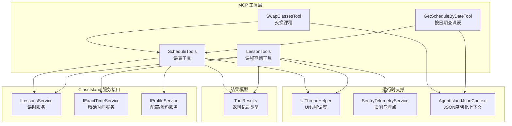
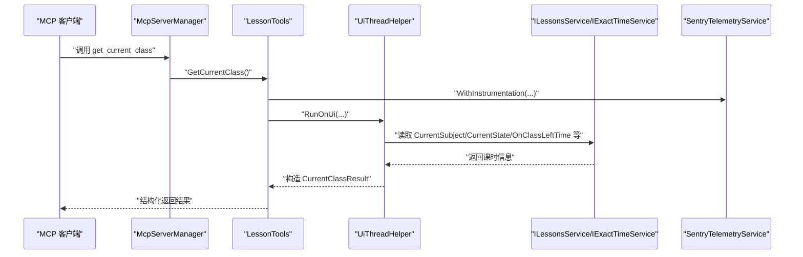
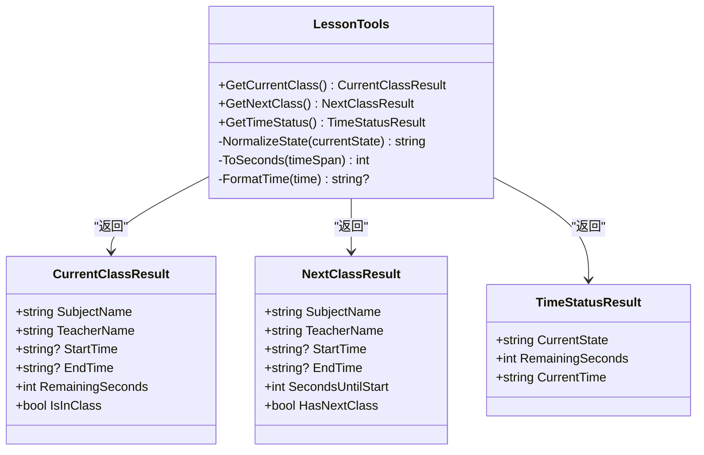
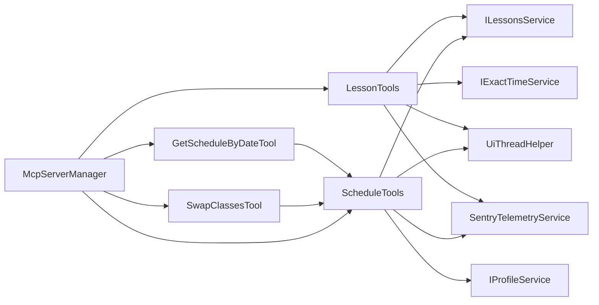

# 课程相关工具

<cite>
**本文引用的文件**   
- [LessonTools.cs](file://Mcp/Tools/LessonTools.cs)
- [ScheduleTools.cs](file://Mcp/Tools/ScheduleTools.cs)
- [GetScheduleByDateTool.cs](file://Mcp/Tools/GetScheduleByDateTool.cs)
- [SwapClassesTool.cs](file://Mcp/Tools/SwapClassesTool.cs)
- [McpServerManager.cs](file://Mcp/McpServerManager.cs)
- [UiThreadHelper.cs](file://Helpers/UiThreadHelper.cs)
- [SentryTelemetryService.cs](file://Services/SentryTelemetryService.cs)
- [AgentIslandJsonContext.cs](file://Models/AgentIslandJsonContext.cs)
- [ToolResults.cs](file://Models/ToolResults.cs)
</cite>

## 目录
1. [简介](#简介)
2. [项目结构](#项目结构)
3. [核心组件](#核心组件)
4. [架构总览](#架构总览)
5. [详细组件分析](#详细组件分析)
6. [依赖关系分析](#依赖关系分析)
7. [性能与缓存](#性能与缓存)
8. [使用示例与错误处理](#使用示例与错误处理)
9. [常见问题与故障排除](#常见问题与故障排除)
10. [结论](#结论)

## 简介
本文件面向需要集成或扩展“课程相关工具”的开发者，聚焦于 LessonTools 类提供的课程查询能力：获取当前课程、获取下一节课、时间状态监控。文档将详细说明各方法的参数定义、返回值结构、业务逻辑实现、与 ClassIsland API 的交互方式、数据获取流程、调用示例、错误处理策略、缓存机制与性能优化建议，并覆盖常见使用场景（课程提醒、时间规划、状态同步）以及调试技巧与故障排除指南。

## 项目结构
本项目采用按功能域组织的方式，课程相关工具位于 Mcp/Tools 目录下，通过 MCP 服务器对外暴露工具方法；模型定义在 Models 目录；UI 线程调度辅助在 Helpers；遥测服务在 Services。

图表来源
- [LessonTools.cs:1-146](file://Mcp/Tools/LessonTools.cs#L1-L146)
- [ScheduleTools.cs:1-204](file://Mcp/Tools/ScheduleTools.cs#L1-L204)
- [GetScheduleByDateTool.cs:1-92](file://Mcp/Tools/GetScheduleByDateTool.cs#L1-L92)
- [SwapClassesTool.cs:1-103](file://Mcp/Tools/SwapClassesTool.cs#L1-L103)
- [UiThreadHelper.cs:1-25](file://Helpers/UiThreadHelper.cs#L1-L25)
- [SentryTelemetryService.cs:1-182](file://Services/SentryTelemetryService.cs#L1-L182)
- [AgentIslandJsonContext.cs:1-19](file://Models/AgentIslandJsonContext.cs#L1-L19)
- [ToolResults.cs:1-59](file://Models/ToolResults.cs#L1-L59)

章节来源
- [McpServerManager.cs:1-125](file://Mcp/McpServerManager.cs#L1-L125)
- [LessonTools.cs:1-146](file://Mcp/Tools/LessonTools.cs#L1-L146)
- [ScheduleTools.cs:1-204](file://Mcp/Tools/ScheduleTools.cs#L1-L204)
- [GetScheduleByDateTool.cs:1-92](file://Mcp/Tools/GetScheduleByDateTool.cs#L1-L92)
- [SwapClassesTool.cs:1-103](file://Mcp/Tools/SwapClassesTool.cs#L1-L103)
- [UiThreadHelper.cs:1-25](file://Helpers/UiThreadHelper.cs#L1-L25)
- [SentryTelemetryService.cs:1-182](file://Services/SentryTelemetryService.cs#L1-L182)
- [AgentIslandJsonContext.cs:1-19](file://Models/AgentIslandJsonContext.cs#L1-L19)
- [ToolResults.cs:1-59](file://Models/ToolResults.cs#L1-L59)

## 核心组件
- LessonTools：提供三个 MCP 工具方法，分别用于获取当前课程、下一节课和时间状态。所有方法均通过 UiThreadHelper 确保在 UI 线程执行，并通过 SentryTelemetryService 进行可选的遥测包裹。
- ScheduleTools：提供今日课表、指定日期课表、列出科目、交换课程等能力，内部同样遵循 UI 线程安全与日志记录。
- GetScheduleByDateTool / SwapClassesTool：基于 IMcpServerTool 的手动实现，负责解析输入参数、调用 ScheduleTools 并提供结构化输出。
- McpServerManager：注册上述工具到 MCP 服务器，统一启用 JSON 序列化上下文。
- ToolResults：定义所有工具返回的记录类型，便于跨进程传输和前端展示。

章节来源
- [LessonTools.cs:1-146](file://Mcp/Tools/LessonTools.cs#L1-L146)
- [ScheduleTools.cs:1-204](file://Mcp/Tools/ScheduleTools.cs#L1-L204)
- [GetScheduleByDateTool.cs:1-92](file://Mcp/Tools/GetScheduleByDateTool.cs#L1-L92)
- [SwapClassesTool.cs:1-103](file://Mcp/Tools/SwapClassesTool.cs#L1-L103)
- [McpServerManager.cs:1-125](file://Mcp/McpServerManager.cs#L1-L125)
- [ToolResults.cs:1-59](file://Models/ToolResults.cs#L1-L59)

## 架构总览
以下序列图展示了从 MCP 客户端调用到 ClassIsland 服务读取数据的完整流程。

图表来源
- [McpServerManager.cs:41-51](file://Mcp/McpServerManager.cs#L41-L51)
- [LessonTools.cs:14-45](file://Mcp/Tools/LessonTools.cs#L14-L45)
- [UiThreadHelper.cs:7-12](file://Helpers/UiThreadHelper.cs#L7-L12)
- [SentryTelemetryService.cs:127-148](file://Services/SentryTelemetryService.cs#L127-L148)

## 详细组件分析

### LessonTools 类分析
LessonTools 实现了三个 MCP 工具方法，均标记为只读且结构化返回。其核心职责是：
- 在 UI 线程中访问 ClassIsland 的课时服务与时钟服务
- 规范化当前状态（上课中、课间、放学后等）
- 计算剩余秒数并格式化时间字符串
- 可选地通过遥测服务包裹执行过程以采集指标

#### 方法一：get_current_class（获取当前课程）
- 目的：返回当前正在进行的课程信息，包括科目名称、教师、起止时间、剩余秒数及是否在上课中标志。
- 参数：无
- 返回值：CurrentClassResult
  - SubjectName：当前科目名称
  - TeacherName：任课教师姓名
  - StartTime：开始时间（hh:mm:ss），若无则为空
  - EndTime：结束时间（hh:mm:ss），若无则为空
  - RemainingSeconds：距离下课剩余秒数（非负）
  - IsInClass：是否处于上课中
- 业务逻辑要点：
  - 通过 ILessonsService.CurrentSubject 获取当前科目
  - 通过 NormalizeState(lessonsService.CurrentState) 判断是否为“上课中”
  - 若不在上课中或无当前科目，返回空结果且 IsInClass=false
  - 否则读取 CurrentTimeLayoutItem 的时间段与 OnClassLeftTime，构造结果
- 与 ClassIsland API 交互：
  - ILessonsService.CurrentSubject
  - ILessonsService.CurrentState
  - ILessonsService.CurrentTimeLayoutItem
  - ILessonsService.OnClassLeftTime

章节来源
- [LessonTools.cs:14-45](file://Mcp/Tools/LessonTools.cs#L14-L45)

#### 方法二：get_next_class（获取下一节课）
- 目的：返回下一节即将开始的课程信息，包括科目、教师、时间段与距开始秒数。
- 参数：无
- 返回值：NextClassResult
  - SubjectName：下一节科目名称
  - TeacherName：任课教师姓名
  - StartTime：开始时间（hh:mm:ss）
  - EndTime：结束时间（hh:mm:ss）
  - SecondsUntilStart：距离开始秒数（非负）
  - HasNextClass：是否存在下一节课
- 业务逻辑要点：
  - 通过 ILessonsService.NextClassSubject 与 NextClassTimeLayoutItem 获取下一节课信息
  - 使用 IExactTimeService.GetCurrentLocalDateTime() 计算当前本地时间
  - 根据日期与 TimeLayoutItem.StartTime 合成具体时间点，计算差值秒数
  - 若缺少任一信息，返回空结果且 HasNextClass=false
- 与 ClassIsland API 交互：
  - ILessonsService.NextClassSubject
  - ILessonsService.NextClassTimeLayoutItem
  - IExactTimeService.GetCurrentLocalDateTime()

章节来源
- [LessonTools.cs:47-83](file://Mcp/Tools/LessonTools.cs#L47-L83)

#### 方法三：get_time_status（时间状态监控）
- 目的：返回当前时间状态、剩余秒数与当前时间字符串，用于状态同步与提醒触发。
- 参数：无
- 返回值：TimeStatusResult
  - CurrentState：标准化后的状态（如 InClass、Breaking、AfterSchool 或原始值）
  - RemainingSeconds：当前状态的剩余秒数（上课中取 OnClassLeftTime，课间取 OnBreakingTimeLeftTime，其他为 0）
  - CurrentTime：当前本地时间的 ISO 格式字符串
- 业务逻辑要点：
  - 通过 NormalizeState 将底层枚举/字符串映射为稳定状态名
  - 根据状态选择对应的剩余时间属性
  - 使用 IExactTimeService 获取当前时间
- 与 ClassIsland API 交互：
  - ILessonsService.CurrentState
  - ILessonsService.OnClassLeftTime
  - ILessonsService.OnBreakingTimeLeftTime
  - IExactTimeService.GetCurrentLocalDateTime()

章节来源
- [LessonTools.cs:85-113](file://Mcp/Tools/LessonTools.cs#L85-L113)

#### 辅助方法与状态归一化
- NormalizeState：将底层状态字符串包含关键字匹配为稳定状态名（Break→Breaking，After→AfterSchool，Class→InClass）。
- ToSeconds：将 TimeSpan 转为非负整型秒数。
- FormatTime：将 TimeSpan? 格式化为 hh:mm:ss 字符串。

章节来源
- [LessonTools.cs:115-144](file://Mcp/Tools/LessonTools.cs#L115-L144)

#### 类图（代码级）

图表来源
- [LessonTools.cs:12-145](file://Mcp/Tools/LessonTools.cs#L12-L145)
- [ToolResults.cs:3-22](file://Models/ToolResults.cs#L3-L22)

### ScheduleTools 类分析（与课程工具协同）
- 今日课表：get_today_schedule 返回当天课表，优先使用当前课表，否则按日期查询。
- 指定日期课表：get_schedule_by_date 支持任意日期查询。
- 列出科目：list_subjects 返回所有已配置的科目列表。
- 交换课程：swap_classes 创建或复用临时换课层，交换两节课的顺序并持久化。

章节来源
- [ScheduleTools.cs:15-103](file://Mcp/Tools/ScheduleTools.cs#L15-L103)
- [ScheduleTools.cs:105-131](file://Mcp/Tools/ScheduleTools.cs#L105-L131)
- [ScheduleTools.cs:133-203](file://Mcp/Tools/ScheduleTools.cs#L133-L203)

### GetScheduleByDateTool 与 SwapClassesTool
- GetScheduleByDateTool：手动实现 IMcpServerTool，解析 date 参数，调用 ScheduleTools.GetScheduleByDate，返回结构化结果。
- SwapClassesTool：手动实现 IMcpServerTool，解析 classIndex1、classIndex2、date 参数，调用 ScheduleTools.SwapClasses，返回 SwapResult。

章节来源
- [GetScheduleByDateTool.cs:16-92](file://Mcp/Tools/GetScheduleByDateTool.cs#L16-L92)
- [SwapClassesTool.cs:16-103](file://Mcp/Tools/SwapClassesTool.cs#L16-L103)

## 依赖关系分析
- LessonTools 依赖：
  - ILessonsService：读取当前/下一节课信息与剩余时间
  - IExactTimeService：获取当前本地时间
  - UiThreadHelper：确保 UI 线程安全访问
  - SentryTelemetryService：可选遥测包裹
- ScheduleTools 依赖：
  - ILessonsService：读取课表与时间布局
  - IProfileService：读取科目配置与保存换课结果
  - UiThreadHelper：UI 线程安全
  - SentryTelemetryService：可选遥测包裹
- McpServerManager：
  - 注册 LessonTools、ScheduleTools、SwapClassesTool、GetScheduleByDateTool 等工具
  - 配置 JSON 序列化上下文 AgentIslandJsonContext

图表来源
- [LessonTools.cs:1-146](file://Mcp/Tools/LessonTools.cs#L1-L146)
- [ScheduleTools.cs:1-204](file://Mcp/Tools/ScheduleTools.cs#L1-L204)
- [GetScheduleByDateTool.cs:1-92](file://Mcp/Tools/GetScheduleByDateTool.cs#L1-L92)
- [SwapClassesTool.cs:1-103](file://Mcp/Tools/SwapClassesTool.cs#L1-L103)
- [McpServerManager.cs:41-51](file://Mcp/McpServerManager.cs#L41-L51)

章节来源
- [McpServerManager.cs:1-125](file://Mcp/McpServerManager.cs#L1-L125)

## 性能与缓存
- 直接读取：当前实现直接从 ClassIsland 服务读取数据，未在本插件内引入额外缓存层。
- UI 线程调度：所有对 ClassIsland 服务的访问均在 UI 线程执行，避免跨线程访问导致的异常与性能抖动。
- 遥测开销：当启用遥测时，每个工具调用会创建事务与面包屑，建议在高频轮询场景下评估采样率与开销。
- 建议优化方向：
  - 在应用层增加短时内存缓存（例如 1~3 秒），减少频繁重复查询带来的开销
  - 针对 get_time_status 可结合事件驱动（如 ClassIsland 的状态变更事件）推送更新，降低主动轮询频率
  - 批量查询（如同时获取当前与下一节课）可合并为一次服务访问以减少 UI 线程切换次数

[本节为通用性能建议，不直接分析具体文件]

## 使用示例与错误处理

### 调用示例（概念性）
- 获取当前课程
  - 调用工具：get_current_class
  - 预期返回字段：SubjectName、TeacherName、StartTime、EndTime、RemainingSeconds、IsInClass
- 获取下一节课
  - 调用工具：get_next_class
  - 预期返回字段：SubjectName、TeacherName、StartTime、EndTime、SecondsUntilStart、HasNextClass
- 获取时间状态
  - 调用工具：get_time_status
  - 预期返回字段：CurrentState、RemainingSeconds、CurrentTime

### 错误处理策略
- 参数校验
  - GetScheduleByDateTool 与 SwapClassesTool 会对必需参数进行严格校验，缺失或类型不符将抛出异常并被捕获后返回错误消息。
- 服务不可用
  - 若 ILessonsService 或 IExactTimeService 为空，工具将返回空结果或默认值（如剩余时间为 0、状态为空等）。
- 异常上报
  - 通过 SentryTelemetryService.WithInstrumentation 包裹关键路径，自动记录事务、面包屑与异常，便于定位问题。
- 结构化返回
  - 所有工具返回结构化记录类型，便于上层统一处理成功与失败分支。

章节来源
- [GetScheduleByDateTool.cs:53-78](file://Mcp/Tools/GetScheduleByDateTool.cs#L53-L78)
- [SwapClassesTool.cs:63-80](file://Mcp/Tools/SwapClassesTool.cs#L63-L80)
- [SentryTelemetryService.cs:127-148](file://Services/SentryTelemetryService.cs#L127-L148)

## 常见问题与故障排除

### 常见问题
- 返回结果为空或 IsInClass=false
  - 可能原因：当前不在上课中、未加载课表、ClassIsland 服务未就绪
  - 排查步骤：检查 CurrentState 是否为“上课中”，确认 CurrentSubject 与 CurrentTimeLayoutItem 是否有效
- 下一节课不存在
  - 可能原因：当日无后续课程或 NextClassSubject/NextClassTimeLayoutItem 为空
  - 排查步骤：查看 ScheduleTools 的构建逻辑与 ClassPlan 内容
- 时间状态不正确
  - 可能原因：NormalizeState 无法识别底层状态字符串
  - 排查步骤：打印 CurrentState 原始值，确认是否包含 Break/After/Class 关键字

### 调试技巧
- 启用日志
  - 工具内部使用 ILogger 记录 Debug 级别日志，可在 ClassIsland 宿主环境中查看日志输出
- 遥测追踪
  - 开启 SentryTelemetryService 后，可在 Sentry 平台查看工具调用的事务与异常堆栈
- UI 线程问题
  - 若出现跨线程访问异常，确认是否通过 UiThreadHelper.RunOnUi 执行

章节来源
- [LessonTools.cs:22-45](file://Mcp/Tools/LessonTools.cs#L22-L45)
- [LessonTools.cs:55-83](file://Mcp/Tools/LessonTools.cs#L55-L83)
- [LessonTools.cs:93-113](file://Mcp/Tools/LessonTools.cs#L93-L113)
- [SentryTelemetryService.cs:127-148](file://Services/SentryTelemetryService.cs#L127-L148)
- [UiThreadHelper.cs:7-12](file://Helpers/UiThreadHelper.cs#L7-L12)

## 结论
LessonTools 提供了简洁而稳定的课程查询能力，通过与 ClassIsland 的核心服务对接，能够准确反映当前与下一节课的状态与时间信息。配合 ScheduleTools 与 MCP 工具封装，可实现课程提醒、时间规划与状态同步等典型场景。建议在高频调用场景中加入短期缓存与事件驱动更新，以降低开销并提升响应速度。借助日志与遥测，可有效定位问题并持续优化体验。