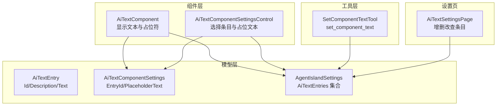
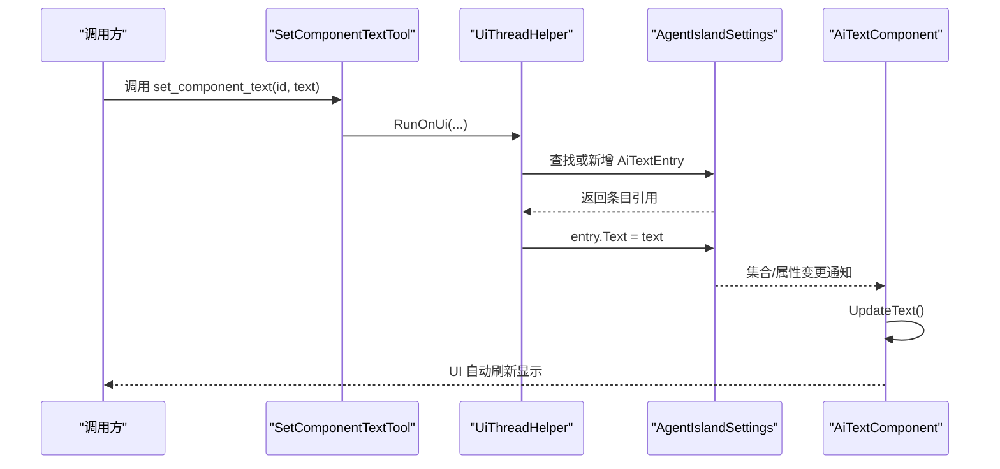
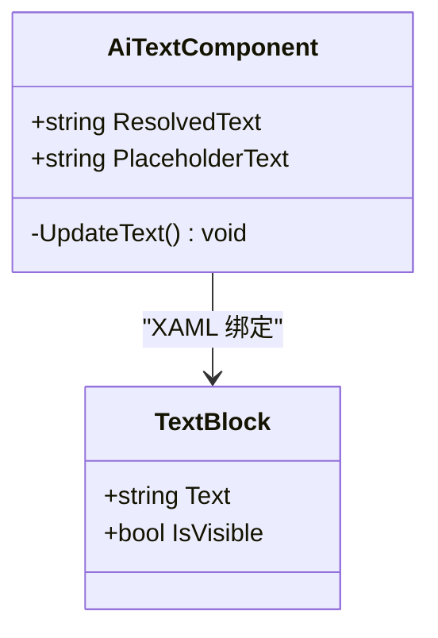
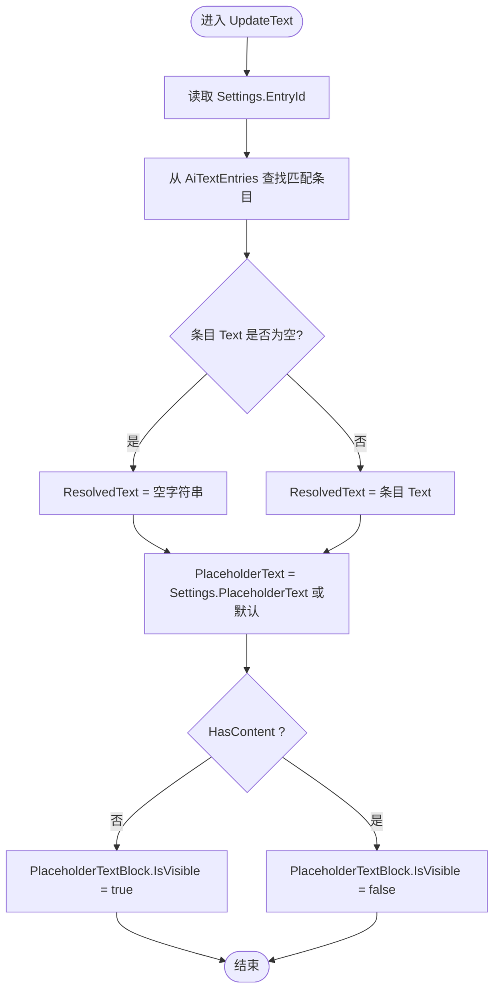
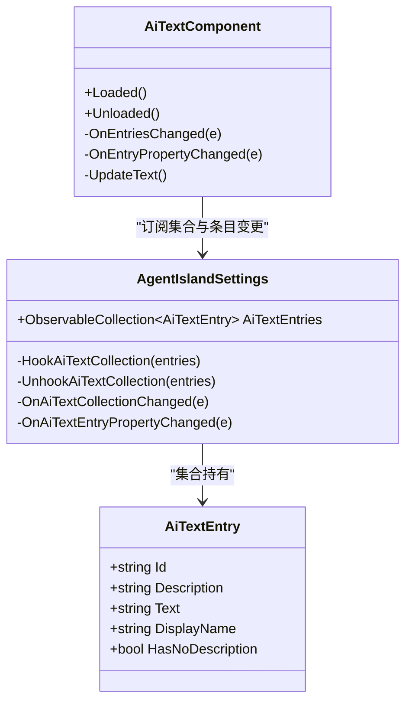
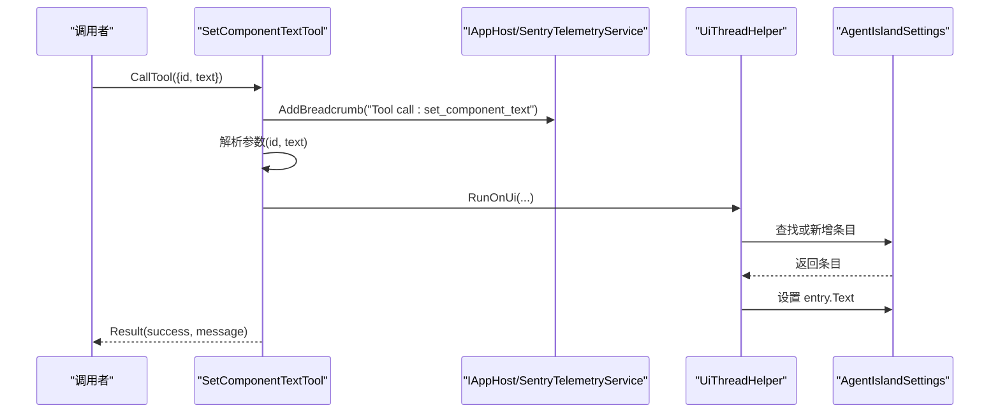
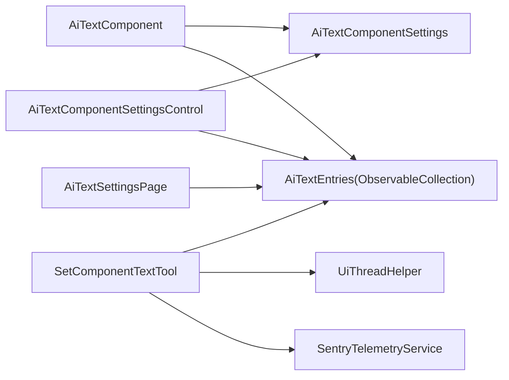

# AI 文字组件

<cite>
**本文引用的文件**   
- [AiTextComponent.axaml](file://Components/AiTextComponent.axaml)
- [AiTextComponent.axaml.cs](file://Components/AiTextComponent.axaml.cs)
- [AiTextEntry.cs](file://Models/AiTextEntry.cs)
- [AiTextComponentSettings.cs](file://Models/AiTextComponentSettings.cs)
- [AgentIslandSettings.cs](file://Models/AgentIslandSettings.cs)
- [SetComponentTextTool.cs](file://Mcp/Tools/SetComponentTextTool.cs)
- [AiTextComponentSettingsControl.axaml](file://Components/AiTextComponentSettingsControl.axaml)
- [AiTextComponentSettingsControl.axaml.cs](file://Components/AiTextComponentSettingsControl.axaml.cs)
- [AiTextSettingsPage.axaml](file://Views/SettingsPages/AiTextSettingsPage.axaml)
- [AiTextSettingsPage.axaml.cs](file://Views/SettingsPages/AiTextSettingsPage.axaml.cs)
</cite>

## 目录
1. [简介](#简介)
2. [项目结构](#项目结构)
3. [核心组件](#核心组件)
4. [架构总览](#架构总览)
5. [详细组件分析](#详细组件分析)
6. [依赖关系分析](#依赖关系分析)
7. [性能与响应式考虑](#性能与响应式考虑)
8. [故障排查指南](#故障排查指南)
9. [结论](#结论)
10. [附录：配置与集成示例](#附录配置与集成示例)

## 简介
AI 文字组件是一个基于 Avalonia UI 的可视化组件，用于在主界面展示由 AI 动态更新的内容。该组件通过 MCP（Model Context Protocol）工具 set_component_text 接收外部指令，按条目 ID 更新对应文本内容；同时提供占位文本显示、样式化属性以及完善的生命周期管理。

## 项目结构
围绕 AI 文字组件的相关代码分布在以下位置：
- 组件视图与逻辑：Components/AiTextComponent.*
- 组件设置控件：Components/AiTextComponentSettingsControl.*
- 数据模型：Models/AiTextEntry.cs、Models/AiTextComponentSettings.cs、Models/AgentIslandSettings.cs
- MCP 工具：Mcp/Tools/SetComponentTextTool.cs
- 设置页：Views/SettingsPages/AiTextSettingsPage.*

图表来源
- [AiTextComponent.axaml.cs:16-84](file://Components/AiTextComponent.axaml.cs#L16-L84)
- [AiTextComponentSettingsControl.axaml.cs:7-52](file://Components/AiTextComponentSettingsControl.axaml.cs#L7-L52)
- [AiTextEntry.cs:5-30](file://Models/AiTextEntry.cs#L5-L30)
- [AiTextComponentSettings.cs:5-12](file://Models/AiTextComponentSettings.cs#L5-L12)
- [AgentIslandSettings.cs:107-122](file://Models/AgentIslandSettings.cs#L107-L122)
- [SetComponentTextTool.cs:17-91](file://Mcp/Tools/SetComponentTextTool.cs#L17-L91)
- [AiTextSettingsPage.axaml.cs:14-35](file://Views/SettingsPages/AiTextSettingsPage.axaml.cs#L14-L35)

章节来源
- [AiTextComponent.axaml:1-20](file://Components/AiTextComponent.axaml#L1-L20)
- [AiTextComponent.axaml.cs:16-84](file://Components/AiTextComponent.axaml.cs#L16-L84)
- [AiTextComponentSettingsControl.axaml:1-32](file://Components/AiTextComponentSettingsControl.axaml#L1-L32)
- [AiTextComponentSettingsControl.axaml.cs:7-52](file://Components/AiTextComponentSettingsControl.axaml.cs#L7-L52)
- [AiTextEntry.cs:5-30](file://Models/AiTextEntry.cs#L5-L30)
- [AiTextComponentSettings.cs:5-12](file://Models/AiTextComponentSettings.cs#L5-L12)
- [AgentIslandSettings.cs:107-122](file://Models/AgentIslandSettings.cs#L107-L122)
- [SetComponentTextTool.cs:17-91](file://Mcp/Tools/SetComponentTextTool.cs#L17-L91)
- [AiTextSettingsPage.axaml:1-81](file://Views/SettingsPages/AiTextSettingsPage.axaml#L1-L81)
- [AiTextSettingsPage.axaml.cs:14-35](file://Views/SettingsPages/AiTextSettingsPage.axaml.cs#L14-L35)

## 核心组件
- AiTextComponent：负责渲染实际文本与占位文本，订阅数据源变更并驱动 UI 更新。
- AiTextComponentSettingsControl：在组件面板中提供“条目”下拉选择与“占位文本”编辑。
- AiTextEntry：单个文字条目的数据模型，包含 Id、Description、Text 等字段。
- AiTextComponentSettings：组件级设置，包括 EntryId 与 PlaceholderText。
- AgentIslandSettings：全局设置，持有 AiTextEntries 集合并提供集合事件钩子。
- SetComponentTextTool：MCP 工具，实现 set_component_text，按 ID 更新或创建条目文本。

章节来源
- [AiTextComponent.axaml.cs:16-84](file://Components/AiTextComponent.axaml.cs#L16-L84)
- [AiTextComponentSettingsControl.axaml.cs:7-52](file://Components/AiTextComponentSettingsControl.axaml.cs#L7-L52)
- [AiTextEntry.cs:5-30](file://Models/AiTextEntry.cs#L5-L30)
- [AiTextComponentSettings.cs:5-12](file://Models/AiTextComponentSettings.cs#L5-L12)
- [AgentIslandSettings.cs:107-122](file://Models/AgentIslandSettings.cs#L107-L122)
- [SetComponentTextTool.cs:17-91](file://Mcp/Tools/SetComponentTextTool.cs#L17-L91)

## 架构总览
AI 文字组件采用“设置驱动 + 集合订阅 + 属性通知”的模式：
- 组件在 Loaded 时订阅全局 AiTextEntries 集合及其项的属性变更；在 Unloaded 时取消订阅，避免内存泄漏。
- 当 Settings.EntryId 变化或集合内容变化时，组件查找对应条目并计算 ResolvedText 与 PlaceholderText。
- MCP 工具 set_component_text 通过 UiThreadHelper 切换到 UI 线程，直接修改或新增条目，触发属性变更通知，从而自动刷新 UI。

图表来源
- [SetComponentTextTool.cs:41-72](file://Mcp/Tools/SetComponentTextTool.cs#L41-L72)
- [AgentIslandSettings.cs:340-392](file://Models/AgentIslandSettings.cs#L340-L392)
- [AiTextComponent.axaml.cs:39-83](file://Components/AiTextComponent.axaml.cs#L39-L83)

## 详细组件分析

### 视觉外观与用户交互
- 主视图使用两个 TextBlock 叠加：一个显示实际文本，另一个以较低不透明度显示占位文本。当无内容时，占位文本可见；有内容时隐藏占位文本。
- 组件设置控件提供：
  - 条目下拉框：绑定到全局 AiTextEntries，显示每个条目的 Id 与 Description。
  - 占位文本输入框：双向绑定到 Settings.PlaceholderText，支持自定义默认提示语。

章节来源
- [AiTextComponent.axaml:9-18](file://Components/AiTextComponent.axaml#L9-L18)
- [AiTextComponentSettingsControl.axaml:9-31](file://Components/AiTextComponentSettingsControl.axaml#L9-L31)

### Avalonia StyledProperty 开发模式
- 组件定义了两个 Avalonia 样式属性：ResolvedText 与 PlaceholderText，类型为 string。
- 这两个属性通过 AvaloniaProperty.Register 注册，并在 XAML 中以 RelativeSource 绑定到 TextBlock.Text。
- 组件内部仅在需要时设置这些属性值，确保只读对外暴露、内部可控。

图表来源
- [AiTextComponent.axaml.cs:18-34](file://Components/AiTextComponent.axaml.cs#L18-L34)
- [AiTextComponent.axaml:10-17](file://Components/AiTextComponent.axaml#L10-L17)

章节来源
- [AiTextComponent.axaml.cs:18-34](file://Components/AiTextComponent.axaml.cs#L18-L34)
- [AiTextComponent.axaml:10-17](file://Components/AiTextComponent.axaml#L10-L17)

### ResolvedText 与 PlaceholderText 的数据绑定机制
- ResolvedText：根据当前 Settings.EntryId 查找对应条目，若条目存在且 Text 非空则显示该文本，否则为空字符串。
- PlaceholderText：取自 Settings.PlaceholderText，若未设置则回退为默认提示语。
- 占位文本块 Visibility：当无内容时显示，有内容时隐藏。

图表来源
- [AiTextComponent.axaml.cs:73-83](file://Components/AiTextComponent.axaml.cs#L73-L83)

章节来源
- [AiTextComponent.axaml.cs:73-83](file://Components/AiTextComponent.axaml.cs#L73-L83)

### 生命周期管理与事件处理
- Loaded：
  - 订阅 Plugin.Settings.AiTextEntries.CollectionChanged。
  - 遍历现有条目并订阅其 PropertyChanged。
  - 若 Settings 已存在，订阅 Settings.PropertyChanged。
  - 立即执行一次 UpdateText。
- Unloaded：
  - 取消所有集合与属性的订阅，防止内存泄漏。

章节来源
- [AiTextComponent.axaml.cs:39-56](file://Components/AiTextComponent.axaml.cs#L39-L56)

### 与 AiTextEntries 集合的订阅关系与属性变更通知
- 集合层面：
  - AgentIslandSettings 维护 AiTextEntries 集合，并在集合替换时进行 Hook/Unhook，保证对旧集合与新集合的事件订阅正确切换。
  - 集合项添加/移除时，会重新订阅/取消订阅各条目的 PropertyChanged。
- 条目层面：
  - AiTextEntry 使用 CommunityToolkit.Mvvm 的 ObservableObject 与 [ObservableProperty] 生成属性变更通知。
  - 当 Id 或 Description 变化时，还会触发 DisplayName 与 HasNoDescription 的变更，便于设置页显示。
- 组件层面：
  - AiTextComponent 在集合变化时，对旧项取消订阅、对新项订阅，然后统一调用 UpdateText 刷新显示。

图表来源
- [AgentIslandSettings.cs:107-122](file://Models/AgentIslandSettings.cs#L107-L122)
- [AgentIslandSettings.cs:340-392](file://Models/AgentIslandSettings.cs#L340-L392)
- [AiTextEntry.cs:5-30](file://Models/AiTextEntry.cs#L5-L30)
- [AiTextComponent.axaml.cs:60-71](file://Components/AiTextComponent.axaml.cs#L60-L71)

章节来源
- [AgentIslandSettings.cs:107-122](file://Models/AgentIslandSettings.cs#L107-L122)
- [AgentIslandSettings.cs:340-392](file://Models/AgentIslandSettings.cs#L340-L392)
- [AiTextEntry.cs:5-30](file://Models/AiTextEntry.cs#L5-L30)
- [AiTextComponent.axaml.cs:60-71](file://Components/AiTextComponent.axaml.cs#L60-L71)

### 组件配置示例
- 在组件设置控件中选择要绑定的条目（EntryId），并可自定义占位文本（PlaceholderText）。
- 在设置页“AgentIsland / AI 文字”中增删条目，并为每个条目设置 Id、Description 与初始 Text。

章节来源
- [AiTextComponentSettingsControl.axaml:9-31](file://Components/AiTextComponentSettingsControl.axaml#L9-L31)
- [AiTextComponentSettingsControl.axaml.cs:29-51](file://Components/AiTextComponentSettingsControl.axaml.cs#L29-L51)
- [AiTextSettingsPage.axaml:25-76](file://Views/SettingsPages/AiTextSettingsPage.axaml#L25-L76)
- [AiTextSettingsPage.axaml.cs:22-34](file://Views/SettingsPages/AiTextSettingsPage.axaml.cs#L22-L34)

### MCP 工具 set_component_text 集成使用方法
- 工具名称：set_component_text
- 输入参数：
  - id：字符串，表示要更新的条目 ID。
  - text：字符串，要设置的文本内容。
- 行为：
  - 在 UI 线程上查找对应条目，若存在则更新 Text；若不存在则新增一条具有指定 Id 和 Text 的条目。
  - 返回结构化结果，包含成功标志与消息。
- 错误处理：
  - 捕获异常并通过遥测服务记录，返回失败结果与错误信息。

图表来源
- [SetComponentTextTool.cs:17-91](file://Mcp/Tools/SetComponentTextTool.cs#L17-L91)

章节来源
- [SetComponentTextTool.cs:17-91](file://Mcp/Tools/SetComponentTextTool.cs#L17-L91)

### 样式自定义选项与响应式设计考虑
- 样式自定义：
  - 组件本身仅包含两个 TextBlock，可通过外层容器或主题资源覆盖字体、颜色、对齐方式等。
  - 占位文本块默认不透明度较低，可根据主题调整 Opacity 或 Foreground。
- 响应式考虑：
  - 文本过长时建议在外层容器启用换行或截断策略（如 TextTrimming）。
  - 占位文本与实际文本的布局采用垂直居中对齐，适合多种尺寸场景。
  - 建议在更高层级应用 FluentAvalonia 主题资源，使组件自适应系统风格。

[本节为通用指导，不直接分析具体文件]

## 依赖关系分析
- 组件依赖：
  - Avalonia UI 框架（StyledProperty、XAML 绑定、控件）。
  - ClassIsland 核心基类（ComponentBase、ComponentInfo）。
  - CommunityToolkit.Mvvm（ObservableObject、ObservableProperty）。
  - ModelContextProtocol（IMcpServerTool、CallToolResult）。
  - Sentry 遥测（SentryTelemetryService）。
- 数据流依赖：
  - AiTextComponent 依赖 AgentIslandSettings.AiTextEntries 与 AiTextComponentSettings。
  - SetComponentTextTool 依赖 AgentIslandSettings 与 UiThreadHelper。
  - 设置控件与设置页均依赖 AgentIslandSettings 提供的集合。

图表来源
- [AiTextComponent.axaml.cs:16-84](file://Components/AiTextComponent.axaml.cs#L16-L84)
- [AiTextComponentSettings.cs:5-12](file://Models/AiTextComponentSettings.cs#L5-L12)
- [AgentIslandSettings.cs:107-122](file://Models/AgentIslandSettings.cs#L107-L122)
- [SetComponentTextTool.cs:17-91](file://Mcp/Tools/SetComponentTextTool.cs#L17-L91)
- [AiTextComponentSettingsControl.axaml.cs:7-52](file://Components/AiTextComponentSettingsControl.axaml.cs#L7-L52)
- [AiTextSettingsPage.axaml.cs:14-35](file://Views/SettingsPages/AiTextSettingsPage.axaml.cs#L14-L35)

章节来源
- [AiTextComponent.axaml.cs:16-84](file://Components/AiTextComponent.axaml.cs#L16-L84)
- [AiTextComponentSettings.cs:5-12](file://Models/AiTextComponentSettings.cs#L5-L12)
- [AgentIslandSettings.cs:107-122](file://Models/AgentIslandSettings.cs#L107-L122)
- [SetComponentTextTool.cs:17-91](file://Mcp/Tools/SetComponentTextTool.cs#L17-L91)
- [AiTextComponentSettingsControl.axaml.cs:7-52](file://Components/AiTextComponentSettingsControl.axaml.cs#L7-L52)
- [AiTextSettingsPage.axaml.cs:14-35](file://Views/SettingsPages/AiTextSettingsPage.axaml.cs#L14-L35)

## 性能与响应式考虑
- 事件订阅与取消订阅：
  - 组件在 Loaded/Unloaded 中精确管理订阅，避免重复订阅与内存泄漏。
  - 集合变化时对旧项与新项分别处理订阅，确保一致性。
- 属性变更传播：
  - 使用 ObservableProperty 自动生成 OnPropertyChanged，减少样板代码。
  - 组件仅在必要时设置 ResolvedText/PlaceholderText，避免不必要的重绘。
- UI 线程安全：
  - MCP 工具通过 UiThreadHelper 切换到 UI 线程更新数据，保证线程安全。

[本节为通用指导，不直接分析具体文件]

## 故障排查指南
- 文本未更新：
  - 检查是否已创建对应 Id 的条目，并确保 MCP 工具传入的 id 与设置页中的条目一致。
  - 确认组件的 Settings.EntryId 是否正确绑定到目标条目。
- 占位文本始终显示：
  - 检查对应条目的 Text 是否为空；若为空将显示占位文本。
- 订阅泄漏或异常：
  - 确认组件的 Unloaded 事件中已取消所有订阅。
  - 查看遥测日志，定位 set_component_text 调用时的异常信息。

章节来源
- [AiTextComponent.axaml.cs:48-56](file://Components/AiTextComponent.axaml.cs#L48-L56)
- [SetComponentTextTool.cs:67-71](file://Mcp/Tools/SetComponentTextTool.cs#L67-L71)

## 结论
AI 文字组件通过清晰的 MVVM 与 Avalonia 样式属性机制，实现了简洁而强大的文本展示能力。结合 MCP 工具，AI 可以按条目 ID 动态更新内容，组件则在生命周期内妥善管理订阅与通知，确保 UI 实时同步与资源释放。

[本节为总结性内容，不直接分析具体文件]

## 附录：配置与集成示例

### 组件配置步骤
- 打开设置页“AgentIsland / AI 文字”，添加条目并填写 Id、Description 与初始 Text。
- 在组件的设置控件中选择对应条目，并可自定义占位文本。

章节来源
- [AiTextSettingsPage.axaml:25-76](file://Views/SettingsPages/AiTextSettingsPage.axaml#L25-L76)
- [AiTextComponentSettingsControl.axaml:9-31](file://Components/AiTextComponentSettingsControl.axaml#L9-L31)

### MCP 工具 set_component_text 调用示例
- 输入参数：
  - id：字符串，例如 "text1"。
  - text：字符串，要显示的文本内容。
- 预期行为：
  - 若存在对应 Id 的条目，则更新其 Text。
  - 若不存在，则新增条目并设置 Text。
  - 组件自动刷新显示。

章节来源
- [SetComponentTextTool.cs:19-28](file://Mcp/Tools/SetComponentTextTool.cs#L19-L28)
- [SetComponentTextTool.cs:41-72](file://Mcp/Tools/SetComponentTextTool.cs#L41-L72)