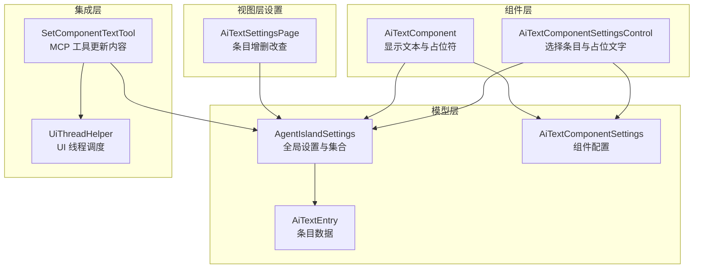
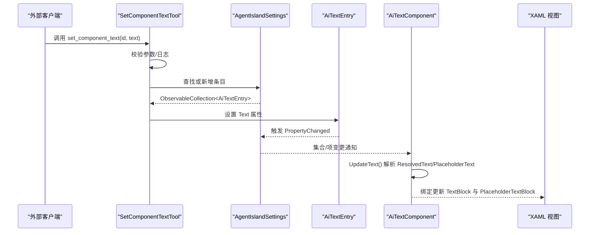
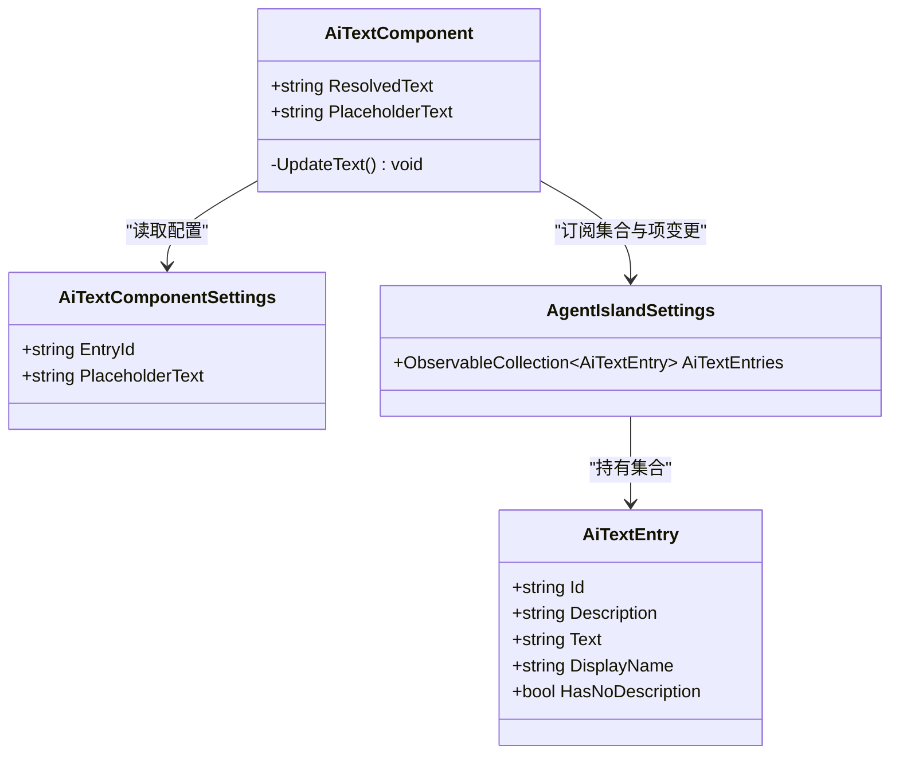
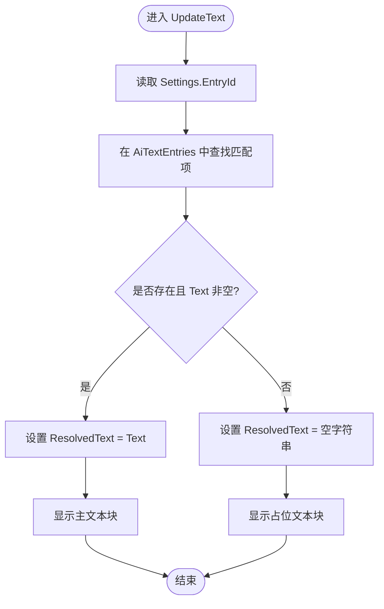
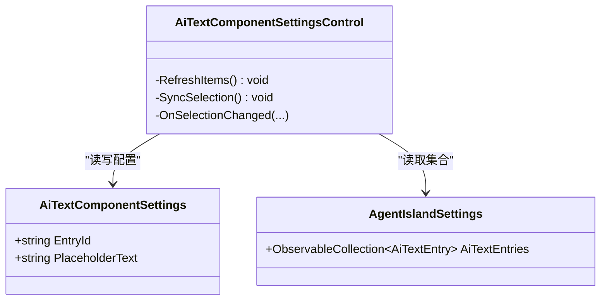
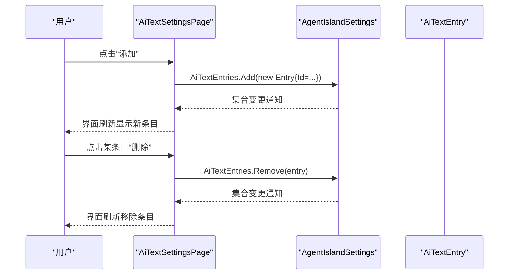
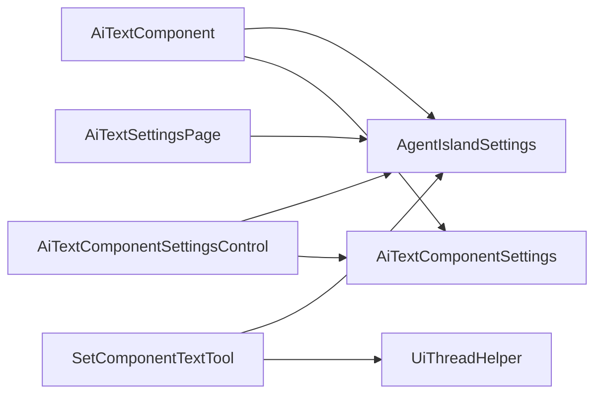

# UI 组件系统

<cite>
**本文引用的文件**   
- [AiTextComponent.axaml](file://Components/AiTextComponent.axaml)
- [AiTextComponent.axaml.cs](file://Components/AiTextComponent.axaml.cs)
- [AiTextComponentSettingsControl.axaml](file://Components/AiTextComponentSettingsControl.axaml)
- [AiTextComponentSettingsControl.axaml.cs](file://Components/AiTextComponentSettingsControl.axaml.cs)
- [AiTextComponentSettings.cs](file://Models/AiTextComponentSettings.cs)
- [AiTextEntry.cs](file://Models/AiTextEntry.cs)
- [AgentIslandSettings.cs](file://Models/AgentIslandSettings.cs)
- [SetComponentTextTool.cs](file://Mcp/Tools/SetComponentTextTool.cs)
- [UiThreadHelper.cs](file://Helpers/UiThreadHelper.cs)
- [AiTextSettingsPage.axaml](file://Views/SettingsPages/AiTextSettingsPage.axaml)
- [AiTextSettingsPage.axaml.cs](file://Views/SettingsPages/AiTextSettingsPage.axaml.cs)
</cite>

## 目录
1. [简介](#简介)
2. [项目结构](#项目结构)
3. [核心组件](#核心组件)
4. [架构总览](#架构总览)
5. [详细组件分析](#详细组件分析)
6. [依赖关系分析](#依赖关系分析)
7. [性能与可访问性](#性能与可访问性)
8. [故障排查指南](#故障排查指南)
9. [结论](#结论)
10. [附录：使用示例与最佳实践](#附录使用示例与最佳实践)

## 简介
本文件面向 AI 文字组件的 UI 系统与 MVVM 实现，覆盖视觉外观、行为与交互模式；文档化属性、事件、插槽与自定义选项；说明 Avalonia UI 开发模式、数据绑定机制；详解设置页面架构与配置数据绑定；提供跨平台兼容性、响应式设计与可访问性建议；记录组件状态、动画与过渡效果；包含样式自定义与主题支持要点；并给出使用示例与代码片段路径。

## 项目结构
AI 文字组件由“展示组件 + 设置控件 + 设置页 + 模型 + MCP 工具”构成，遵循 Avalonia XAML + C# 的 MVVM 模式，通过 ObservableObject/CommunityToolkit.Mvvm 进行双向数据绑定与集合变更通知。

图表来源
- [AiTextComponent.axaml.cs:1-85](file://Components/AiTextComponent.axaml.cs#L1-L85)
- [AiTextComponentSettingsControl.axaml.cs:1-53](file://Components/AiTextComponentSettingsControl.axaml.cs#L1-L53)
- [AiTextSettingsPage.axaml.cs:1-36](file://Views/SettingsPages/AiTextSettingsPage.axaml.cs#L1-L36)
- [AgentIslandSettings.cs:1-394](file://Models/AgentIslandSettings.cs#L1-L394)
- [AiTextEntry.cs:1-31](file://Models/AiTextEntry.cs#L1-L31)
- [AiTextComponentSettings.cs:1-13](file://Models/AiTextComponentSettings.cs#L1-L13)
- [SetComponentTextTool.cs:1-92](file://Mcp/Tools/SetComponentTextTool.cs#L1-L92)
- [UiThreadHelper.cs:1-25](file://Helpers/UiThreadHelper.cs#L1-L25)

章节来源
- [AiTextComponent.axaml:1-20](file://Components/AiTextComponent.axaml#L1-L20)
- [AiTextComponent.axaml.cs:1-85](file://Components/AiTextComponent.axaml.cs#L1-L85)
- [AiTextComponentSettingsControl.axaml:1-32](file://Components/AiTextComponentSettingsControl.axaml#L1-L32)
- [AiTextComponentSettingsControl.axaml.cs:1-53](file://Components/AiTextComponentSettingsControl.axaml.cs#L1-L53)
- [AiTextComponentSettings.cs:1-13](file://Models/AiTextComponentSettings.cs#L1-L13)
- [AiTextEntry.cs:1-31](file://Models/AiTextEntry.cs#L1-L31)
- [AgentIslandSettings.cs:1-394](file://Models/AgentIslandSettings.cs#L1-L394)
- [SetComponentTextTool.cs:1-92](file://Mcp/Tools/SetComponentTextTool.cs#L1-L92)
- [UiThreadHelper.cs:1-25](file://Helpers/UiThreadHelper.cs#L1-L25)
- [AiTextSettingsPage.axaml:1-81](file://Views/SettingsPages/AiTextSettingsPage.axaml#L1-L81)
- [AiTextSettingsPage.axaml.cs:1-36](file://Views/SettingsPages/AiTextSettingsPage.axaml.cs#L1-L36)

## 核心组件
- AiTextComponent：负责渲染实际文本与占位文本，根据当前配置的 EntryId 从全局集合中解析对应条目的 Text，并在无内容时显示占位符。
- AiTextComponentSettingsControl：用于在组件面板中选择要绑定的条目 ID，以及编辑占位文字。
- AiTextSettingsPage：集中管理所有 AI 文字条目（增删改），并通过数据绑定驱动界面。
- AgentIslandSettings：维护 AiTextEntries 集合及派生属性，监听集合与项的属性变化以触发 UI 刷新。
- SetComponentTextTool：MCP 工具，按 id 更新或创建条目文本，确保在 UI 线程执行。

章节来源
- [AiTextComponent.axaml.cs:1-85](file://Components/AiTextComponent.axaml.cs#L1-L85)
- [AiTextComponentSettingsControl.axaml.cs:1-53](file://Components/AiTextComponentSettingsControl.axaml.cs#L1-L53)
- [AiTextSettingsPage.axaml.cs:1-36](file://Views/SettingsPages/AiTextSettingsPage.axaml.cs#L1-L36)
- [AgentIslandSettings.cs:1-394](file://Models/AgentIslandSettings.cs#L1-L394)
- [SetComponentTextTool.cs:1-92](file://Mcp/Tools/SetComponentTextTool.cs#L1-L92)

## 架构总览
下图展示了从 MCP 工具到 UI 更新的完整调用链与数据流。

图表来源
- [SetComponentTextTool.cs:41-72](file://Mcp/Tools/SetComponentTextTool.cs#L41-L72)
- [AgentIslandSettings.cs:340-392](file://Models/AgentIslandSettings.cs#L340-L392)
- [AiTextComponent.axaml.cs:73-83](file://Components/AiTextComponent.axaml.cs#L73-L83)
- [AiTextComponent.axaml:10-18](file://Components/AiTextComponent.axaml#L10-L18)

## 详细组件分析

### AiTextComponent（显示组件）
- 职责
  - 暴露 ResolvedText 与 PlaceholderText 两个样式化属性，供 XAML 绑定。
  - 在 Loaded/Unloaded 生命周期中订阅/取消订阅全局集合与设置变更事件。
  - 根据 Settings.EntryId 解析当前条目文本，决定显示内容与占位符可见性。
- 关键流程
  - 当 Settings 或 AiTextEntries 集合发生变化时，统一调用 UpdateText 计算最终显示值。
  - 若条目存在且 Text 非空则显示文本，否则隐藏文本块并显示占位符。
- 可视化类图

图表来源
- [AiTextComponent.axaml.cs:16-83](file://Components/AiTextComponent.axaml.cs#L16-L83)
- [AiTextComponentSettings.cs:5-12](file://Models/AiTextComponentSettings.cs#L5-L12)
- [AiTextEntry.cs:5-30](file://Models/AiTextEntry.cs#L5-L30)
- [AgentIslandSettings.cs:107-122](file://Models/AgentIslandSettings.cs#L107-L122)

章节来源
- [AiTextComponent.axaml:10-18](file://Components/AiTextComponent.axaml#L10-L18)
- [AiTextComponent.axaml.cs:36-83](file://Components/AiTextComponent.axaml.cs#L36-L83)

#### 文本更新流程图

图表来源
- [AiTextComponent.axaml.cs:73-83](file://Components/AiTextComponent.axaml.cs#L73-L83)

### AiTextComponentSettingsControl（组件设置控件）
- 职责
  - 将 ComboBox 的数据源绑定到全局 AiTextEntries，同步选中项与 Settings.EntryId。
  - 提供占位文字输入框，直接双向绑定至 Settings.PlaceholderText。
- 交互
  - 加载时刷新列表并同步选中项；集合变更时重新刷新；用户选择变化时回写 EntryId。
- 可视化类图

图表来源
- [AiTextComponentSettingsControl.axaml.cs:29-51](file://Components/AiTextComponentSettingsControl.axaml.cs#L29-L51)
- [AiTextComponentSettingsControl.axaml:25-27](file://Components/AiTextComponentSettingsControl.axaml#L25-L27)
- [AgentIslandSettings.cs:107-122](file://Models/AgentIslandSettings.cs#L107-L122)

章节来源
- [AiTextComponentSettingsControl.axaml:1-32](file://Components/AiTextComponentSettingsControl.axaml#L1-L32)
- [AiTextComponentSettingsControl.axaml.cs:1-53](file://Components/AiTextComponentSettingsControl.axaml.cs#L1-L53)

### AiTextSettingsPage（设置页）
- 职责
  - 提供“使用说明”、“添加条目”等区域，使用 ItemsControl 展示所有条目。
  - 支持为每个条目编辑 Id、Description、Text，并提供删除操作。
- 数据绑定
  - DataContext 设置为 Plugin.Settings（AgentIslandSettings），通过 x:DataType 启用编译时绑定。
  - 动态显示“尚未创建任何条目”的空状态提示。
- 可视化序列图（添加/删除条目）

图表来源
- [AiTextSettingsPage.axaml.cs:22-34](file://Views/SettingsPages/AiTextSettingsPage.axaml.cs#L22-L34)
- [AiTextSettingsPage.axaml:25-76](file://Views/SettingsPages/AiTextSettingsPage.axaml#L25-L76)
- [AgentIslandSettings.cs:340-392](file://Models/AgentIslandSettings.cs#L340-L392)

章节来源
- [AiTextSettingsPage.axaml:1-81](file://Views/SettingsPages/AiTextSettingsPage.axaml#L1-L81)
- [AiTextSettingsPage.axaml.cs:1-36](file://Views/SettingsPages/AiTextSettingsPage.axaml.cs#L1-L36)

### MCP 工具：SetComponentTextTool
- 职责
  - 接收 id 与 text 参数，定位或创建对应条目，并将 text 写入条目。
  - 使用 UiThreadHelper 确保对集合与属性的修改在 UI 线程执行。
- 错误处理
  - 参数缺失返回失败结果；异常捕获后上报遥测并返回错误消息。
- 时序图（已在上节“架构总览”中给出）

章节来源
- [SetComponentTextTool.cs:17-92](file://Mcp/Tools/SetComponentTextTool.cs#L17-L92)
- [UiThreadHelper.cs:5-24](file://Helpers/UiThreadHelper.cs#L5-L24)

## 依赖关系分析
- 组件与模型
  - AiTextComponent 依赖 AgentIslandSettings 中的 AiTextEntries 集合与 AiTextComponentSettings 的配置。
  - AiTextComponentSettingsControl 同样依赖上述集合与配置，用于选择条目与编辑占位文字。
- 设置页与模型
  - AiTextSettingsPage 直接绑定 AgentIslandSettings，增删条目通过集合操作完成。
- 外部集成
  - SetComponentTextTool 通过 MCP 协议被外部调用，间接影响 UI 显示。

图表来源
- [AiTextComponent.axaml.cs:36-83](file://Components/AiTextComponent.axaml.cs#L36-L83)
- [AiTextComponentSettingsControl.axaml.cs:16-51](file://Components/AiTextComponentSettingsControl.axaml.cs#L16-L51)
- [AiTextSettingsPage.axaml.cs:16-34](file://Views/SettingsPages/AiTextSettingsPage.axaml.cs#L16-L34)
- [SetComponentTextTool.cs:56-63](file://Mcp/Tools/SetComponentTextTool.cs#L56-L63)
- [UiThreadHelper.cs:14-23](file://Helpers/UiThreadHelper.cs#L14-L23)

章节来源
- [AgentIslandSettings.cs:107-122](file://Models/AgentIslandSettings.cs#L107-L122)
- [AiTextEntry.cs:5-30](file://Models/AiTextEntry.cs#L5-L30)

## 性能与可访问性
- 性能
  - 使用 ObservableCollection 与属性变更通知，避免全量重绘；仅在必要处触发 UpdateText。
  - 通过 UiThreadHelper 保证 UI 线程安全，避免跨线程访问导致的额外开销。
  - 建议在大量条目场景下考虑虚拟化（如采用虚拟化的 ItemsControl 或 ListView）。
- 可访问性
  - 为关键控件提供合适的 Watermark/PlaceholderText，便于屏幕阅读器理解。
  - 保持对比度与字体大小符合 FluentAvalonia 默认主题规范。
  - 为按钮与输入框提供清晰的标签与上下文说明（已在设置页中使用描述性文本）。
- 响应式设计
  - 使用 StackPanel/ScrollViewer 组合，配合 Classes 与 DynamicResource 适配不同窗口尺寸。
  - 文本过长时使用 TextTrimming 与 MaxWidth 控制溢出显示。

[本节为通用指导，不直接分析具体文件]

## 故障排查指南
- 现象：调用 set_component_text 后 UI 未更新
  - 检查是否传入正确的 id，且该 id 存在于 AiTextEntries 集合中。
  - 确认调用是否在后台线程，需通过 UiThreadHelper 切换到 UI 线程。
  - 查看日志与遥测信息，确认工具调用成功与异常堆栈。
- 现象：组件显示空白或始终显示占位符
  - 检查 Settings.EntryId 是否正确指向目标条目。
  - 确认条目 Text 是否为空；为空时会显示占位符。
- 现象：设置页无法添加或删除条目
  - 确认 DataContext 已正确设置为 Plugin.Settings。
  - 检查集合变更事件是否被正确订阅与释放。

章节来源
- [SetComponentTextTool.cs:41-72](file://Mcp/Tools/SetComponentTextTool.cs#L41-L72)
- [AiTextComponent.axaml.cs:73-83](file://Components/AiTextComponent.axaml.cs#L73-L83)
- [AiTextSettingsPage.axaml.cs:22-34](file://Views/SettingsPages/AiTextSettingsPage.axaml.cs#L22-L34)

## 结论
AI 文字组件基于 Avalonia 与 MVVM 模式，通过全局设置与集合变更通知实现数据驱动的 UI 更新。MCP 工具提供了外部更新入口，结合 UiThreadHelper 保障线程安全。设置页提供直观的条目管理能力，整体架构清晰、扩展性强，适合在多平台环境下运行与定制。

[本节为总结，不直接分析具体文件]

## 附录：使用示例与最佳实践
- 在组件中绑定条目与占位文字
  - 参考路径：[AiTextComponent.axaml:10-18](file://Components/AiTextComponent.axaml#L10-L18)
- 在组件设置控件中选择条目与编辑占位文字
  - 参考路径：[AiTextComponentSettingsControl.axaml:11-27](file://Components/AiTextComponentSettingsControl.axaml#L11-L27)
- 在设置页中添加/删除条目
  - 参考路径：[AiTextSettingsPage.axaml:20-76](file://Views/SettingsPages/AiTextSettingsPage.axaml#L20-L76)
- 通过 MCP 工具更新条目文本
  - 参考路径：[SetComponentTextTool.cs:41-72](file://Mcp/Tools/SetComponentTextTool.cs#L41-L72)
- 在 UI 线程安全地修改集合与属性
  - 参考路径：[UiThreadHelper.cs:14-23](file://Helpers/UiThreadHelper.cs#L14-L23)

章节来源
- [AiTextComponent.axaml:10-18](file://Components/AiTextComponent.axaml#L10-L18)
- [AiTextComponentSettingsControl.axaml:11-27](file://Components/AiTextComponentSettingsControl.axaml#L11-L27)
- [AiTextSettingsPage.axaml:20-76](file://Views/SettingsPages/AiTextSettingsPage.axaml#L20-L76)
- [SetComponentTextTool.cs:41-72](file://Mcp/Tools/SetComponentTextTool.cs#L41-L72)
- [UiThreadHelper.cs:14-23](file://Helpers/UiThreadHelper.cs#L14-L23)