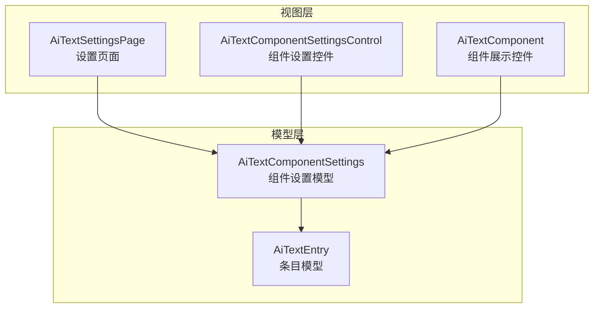
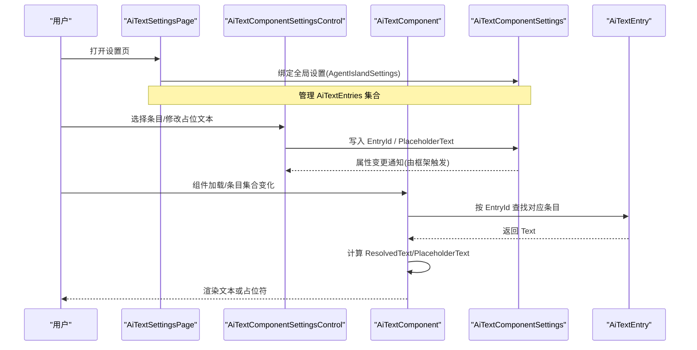
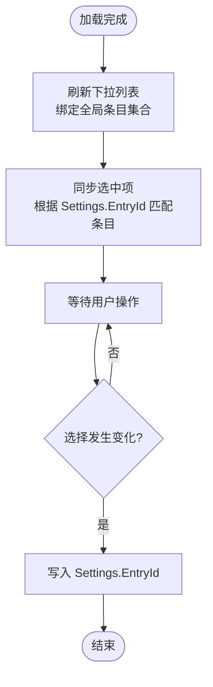
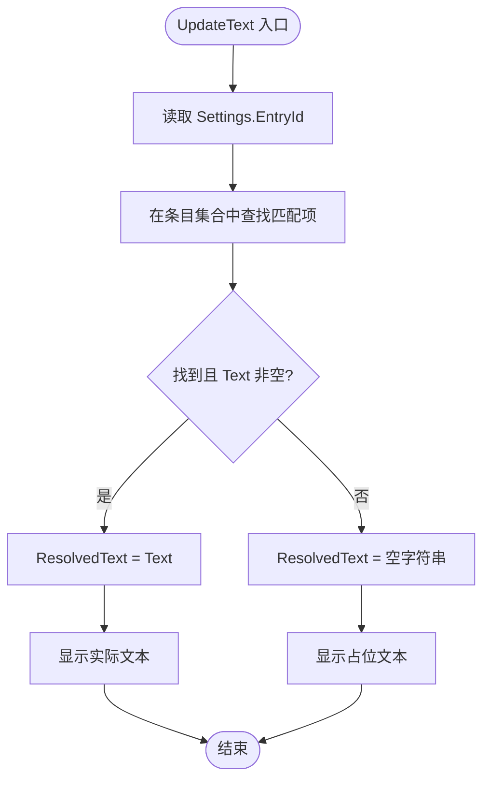
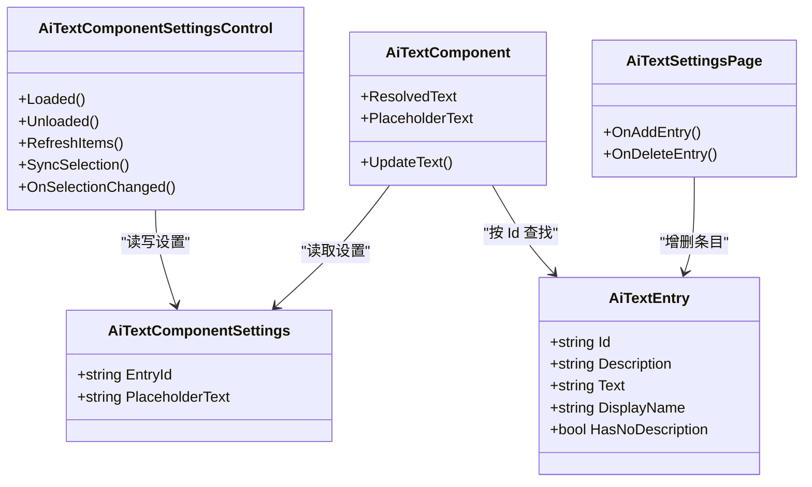

# 组件设置控件

<cite>
**本文引用的文件**   
- [AiTextComponentSettingsControl.axaml](file://Components/AiTextComponentSettingsControl.axaml)
- [AiTextComponentSettingsControl.axaml.cs](file://Components/AiTextComponentSettingsControl.axaml.cs)
- [AiTextComponentSettings.cs](file://Models/AiTextComponentSettings.cs)
- [AiTextEntry.cs](file://Models/AiTextEntry.cs)
- [AiTextComponent.axaml](file://Components/AiTextComponent.axaml)
- [AiTextComponent.axaml.cs](file://Components/AiTextComponent.axaml.cs)
- [AiTextSettingsPage.axaml](file://Views/SettingsPages/AiTextSettingsPage.axaml)
- [AiTextSettingsPage.axaml.cs](file://Views/SettingsPages/AiTextSettingsPage.axaml.cs)
</cite>

## 目录
1. [简介](#简介)
2. [项目结构](#项目结构)
3. [核心组件](#核心组件)
4. [架构总览](#架构总览)
5. [详细组件分析](#详细组件分析)
6. [依赖关系分析](#依赖关系分析)
7. [性能与可维护性](#性能与可维护性)
8. [故障排查指南](#故障排查指南)
9. [结论](#结论)
10. [附录：扩展与样式定制](#附录扩展与样式定制)

## 简介
本文件面向“AI 文字”组件的设置界面，系统性说明其视觉设计、用户交互模式、数据绑定与更新机制，以及与 AiTextComponentSettings 模型的绑定关系。文档还涵盖设置项的控件选型（文本框、下拉选择等）、自定义扩展指南、样式定制方法，以及可访问性与用户体验优化建议。目标是帮助开发者快速理解并扩展该设置控件，同时为使用者提供清晰的操作指引。

## 项目结构
围绕“AI 文字”组件的设置功能，相关文件分布在以下位置：
- 组件设置控件：Components/AiTextComponentSettingsControl.*
- 组件展示控件：Components/AiTextComponent.*
- 模型定义：Models/AiTextComponentSettings.cs、Models/AiTextEntry.cs
- 全局设置页：Views/SettingsPages/AiTextSettingsPage.*

图表来源
- [AiTextSettingsPage.axaml:1-81](file://Views/SettingsPages/AiTextSettingsPage.axaml#L1-L81)
- [AiTextComponentSettingsControl.axaml:1-32](file://Components/AiTextComponentSettingsControl.axaml#L1-L32)
- [AiTextComponent.axaml:1-20](file://Components/AiTextComponent.axaml#L1-L20)
- [AiTextComponentSettings.cs:1-13](file://Models/AiTextComponentSettings.cs#L1-L13)
- [AiTextEntry.cs:1-31](file://Models/AiTextEntry.cs#L1-L31)

章节来源
- [AiTextSettingsPage.axaml:1-81](file://Views/SettingsPages/AiTextSettingsPage.axaml#L1-L81)
- [AiTextSettingsPage.axaml.cs:1-36](file://Views/SettingsPages/AiTextSettingsPage.axaml.cs#L1-L36)
- [AiTextComponentSettingsControl.axaml:1-32](file://Components/AiTextComponentSettingsControl.axaml#L1-L32)
- [AiTextComponentSettingsControl.axaml.cs:1-53](file://Components/AiTextComponentSettingsControl.axaml.cs#L1-L53)
- [AiTextComponent.axaml:1-20](file://Components/AiTextComponent.axaml#L1-L20)
- [AiTextComponent.axaml.cs:1-85](file://Components/AiTextComponent.axaml.cs#L1-L85)
- [AiTextComponentSettings.cs:1-13](file://Models/AiTextComponentSettings.cs#L1-L13)
- [AiTextEntry.cs:1-31](file://Models/AiTextEntry.cs#L1-L31)

## 核心组件
- 组件设置控件（AiTextComponentSettingsControl）
  - 负责在组件内部或设置面板中呈现“AI 文字”的配置项，包括条目选择与占位文本编辑。
  - 通过 ComboBox 绑定到全局条目集合，并在选择变化时同步回 Settings.EntryId。
  - 使用 RelativeSource 双向绑定占位文本到 Settings.PlaceholderText。
- 组件展示控件（AiTextComponent）
  - 根据当前设置的 EntryId 解析实际显示文本；若无内容则显示占位文本。
  - 监听条目集合与属性变更，动态刷新 ResolvedText 与 PlaceholderText。
- 设置页面（AiTextSettingsPage）
  - 提供条目的增删改查入口，管理全局 AiTextEntries 列表。
  - 将 DataContext 指向 Plugin.Settings，以便 ItemsControl 直接绑定集合。

章节来源
- [AiTextComponentSettingsControl.axaml.cs:1-53](file://Components/AiTextComponentSettingsControl.axaml.cs#L1-L53)
- [AiTextComponent.axaml.cs:1-85](file://Components/AiTextComponent.axaml.cs#L1-L85)
- [AiTextSettingsPage.axaml.cs:1-36](file://Views/SettingsPages/AiTextSettingsPage.axaml.cs#L1-L36)

## 架构总览
下图展示了设置控件、组件展示控件与模型之间的数据流与事件驱动关系。

图表来源
- [AiTextSettingsPage.axaml.cs:1-36](file://Views/SettingsPages/AiTextSettingsPage.axaml.cs#L1-L36)
- [AiTextComponentSettingsControl.axaml.cs:1-53](file://Components/AiTextComponentSettingsControl.axaml.cs#L1-L53)
- [AiTextComponent.axaml.cs:1-85](file://Components/AiTextComponent.axaml.cs#L1-L85)
- [AiTextComponentSettings.cs:1-13](file://Models/AiTextComponentSettings.cs#L1-L13)
- [AiTextEntry.cs:1-31](file://Models/AiTextEntry.cs#L1-L31)

## 详细组件分析

### 组件设置控件（AiTextComponentSettingsControl）
- 视觉设计
  - 使用 StackPanel 组织控件，间距统一，标题采用较小字号与较低不透明度以区分层级。
  - 下拉选择（ComboBox）用于选择要绑定的条目，包含占位提示文本。
  - 文本框（TextBox）用于编辑占位文本，带 Watermark 提示。
  - 底部提供简短说明，引导用户前往设置页或通过 MCP 工具更新内容。
- 用户交互模式
  - 加载时初始化条目列表并同步选中项。
  - 监听全局条目集合的 CollectionChanged，自动刷新下拉选项。
  - 选择变化时，将所选条目的 Id 写回 Settings.EntryId；若未选择则清空。
  - 占位文本通过 TwoWay 绑定实时更新。
- 数据绑定与验证
  - 使用 RelativeSource 绑定到父级 Settings 对象，避免额外 ViewModel。
  - 未实现显式输入校验逻辑，建议在后续版本增加空值/格式校验与错误提示。
- 关键流程（选择条目）

图表来源
- [AiTextComponentSettingsControl.axaml.cs:16-51](file://Components/AiTextComponentSettingsControl.axaml.cs#L16-L51)
- [AiTextComponentSettingsControl.axaml:1-32](file://Components/AiTextComponentSettingsControl.axaml#L1-L32)

章节来源
- [AiTextComponentSettingsControl.axaml:1-32](file://Components/AiTextComponentSettingsControl.axaml#L1-L32)
- [AiTextComponentSettingsControl.axaml.cs:1-53](file://Components/AiTextComponentSettingsControl.axaml.cs#L1-L53)

### 组件展示控件（AiTextComponent）
- 视觉设计
  - 使用 Panel 承载两个 TextBlock：一个用于显示实际文本，另一个用于显示占位文本。
  - 当无内容时隐藏实际文本并显示占位文本，提升可读性与一致性。
- 数据绑定与更新机制
  - 注册 Avalonia 样式属性 ResolvedText 与 PlaceholderText，供 XAML 绑定。
  - 监听全局条目集合的 CollectionChanged 与单个条目的 PropertyChanged，确保实时刷新。
  - 根据 Settings.EntryId 查找对应条目，取 Text 作为 ResolvedText；否则为空。
  - PlaceholderText 取自 Settings.PlaceholderText，默认值为“暂无内容”。
- 关键流程（文本解析）

图表来源
- [AiTextComponent.axaml.cs:73-83](file://Components/AiTextComponent.axaml.cs#L73-L83)
- [AiTextComponent.axaml:1-20](file://Components/AiTextComponent.axaml#L1-L20)

章节来源
- [AiTextComponent.axaml:1-20](file://Components/AiTextComponent.axaml#L1-L20)
- [AiTextComponent.axaml.cs:1-85](file://Components/AiTextComponent.axaml.cs#L1-L85)

### 设置页面（AiTextSettingsPage）
- 视觉设计
  - 使用 FluentAvalonia 的 SettingsExpander 分组展示使用说明、添加条目、条目列表等区域。
  - 每个条目使用 ExpanderItem 展示 ID、备注、当前文字等字段，并提供删除按钮。
  - 当没有条目时显示提示文本。
- 用户交互模式
  - 点击“添加”按钮创建新条目，自动生成唯一 ID。
  - 点击“删除”按钮移除指定条目。
  - 所有编辑通过双向绑定直接更新到全局设置集合。
- 数据绑定
  - DataContext 设置为 Plugin.Settings，ItemsControl 直接绑定 AiTextEntries。
  - 各字段通过 Binding 与 AiTextEntry 的属性进行双向绑定。

章节来源
- [AiTextSettingsPage.axaml:1-81](file://Views/SettingsPages/AiTextSettingsPage.axaml#L1-L81)
- [AiTextSettingsPage.axaml.cs:1-36](file://Views/SettingsPages/AiTextSettingsPage.axaml.cs#L1-L36)

### 模型与数据契约
- AiTextComponentSettings
  - 暴露 EntryId 与 PlaceholderText 两个属性，均支持属性变更通知。
  - 作为组件设置控件的数据源，被 XAML 直接绑定。
- AiTextEntry
  - 暴露 Id、Description、Text 三个属性，并提供 DisplayName 与 HasNoDescription 派生属性。
  - 在 Id/Description 变更时触发 DisplayName 与 HasNoDescription 的重新计算，保证 UI 即时反映。

章节来源
- [AiTextComponentSettings.cs:1-13](file://Models/AiTextComponentSettings.cs#L1-L13)
- [AiTextEntry.cs:1-31](file://Models/AiTextEntry.cs#L1-L31)

## 依赖关系分析
- 组件设置控件依赖于全局设置（Plugin.Settings.AiTextEntries），并通过事件订阅实现响应式更新。
- 组件展示控件同样依赖全局设置与条目集合，负责解析最终显示文本。
- 设置页面通过 DataContext 将全局设置注入到 UI，简化了绑定复杂度。

图表来源
- [AiTextComponentSettingsControl.axaml.cs:1-53](file://Components/AiTextComponentSettingsControl.axaml.cs#L1-L53)
- [AiTextComponent.axaml.cs:1-85](file://Components/AiTextComponent.axaml.cs#L1-L85)
- [AiTextSettingsPage.axaml.cs:1-36](file://Views/SettingsPages/AiTextSettingsPage.axaml.cs#L1-L36)
- [AiTextComponentSettings.cs:1-13](file://Models/AiTextComponentSettings.cs#L1-L13)
- [AiTextEntry.cs:1-31](file://Models/AiTextEntry.cs#L1-L31)

章节来源
- [AiTextComponentSettingsControl.axaml.cs:1-53](file://Components/AiTextComponentSettingsControl.axaml.cs#L1-L53)
- [AiTextComponent.axaml.cs:1-85](file://Components/AiTextComponent.axaml.cs#L1-L85)
- [AiTextSettingsPage.axaml.cs:1-36](file://Views/SettingsPages/AiTextSettingsPage.axaml.cs#L1-L36)
- [AiTextComponentSettings.cs:1-13](file://Models/AiTextComponentSettings.cs#L1-L13)
- [AiTextEntry.cs:1-31](file://Models/AiTextEntry.cs#L1-L31)

## 性能与可维护性
- 事件订阅与取消订阅
  - 在 Loaded/Unloaded 生命周期中正确订阅与取消订阅集合与属性变更事件，避免内存泄漏。
- 数据刷新策略
  - 通过事件驱动的方式在集合或属性变化时触发刷新，减少不必要的轮询。
- 可扩展性
  - 模型使用 ObservableProperty 生成属性变更通知，便于后续扩展更多配置项。
- 潜在优化点
  - 可在选择变化时加入防抖或最小化重绘逻辑，降低频繁切换时的开销。
  - 对长列表条目考虑虚拟化或分页加载以提升滚动性能。

[本节为通用指导，不直接分析具体文件]

## 故障排查指南
- 下拉列表未显示条目
  - 检查全局条目集合是否已初始化，确认集合不为 null。
  - 确认组件设置控件是否在 Loaded 后执行了 RefreshItems。
- 选择条目后未生效
  - 确认 OnSelectionChanged 是否正确写入 Settings.EntryId。
  - 检查组件展示控件的 UpdateText 是否能根据 EntryId 找到对应条目。
- 占位文本未更新
  - 确认 TextBox 的绑定路径是否为 RelativeSource 到父级 Settings.PlaceholderText。
  - 检查是否存在其他覆盖占位文本的逻辑。
- 新增/删除条目无效
  - 确认设置页面的按钮事件是否正确调用 Add/Remove。
  - 检查 ItemsControl 的 ItemsSource 是否绑定到正确的集合。

章节来源
- [AiTextComponentSettingsControl.axaml.cs:16-51](file://Components/AiTextComponentSettingsControl.axaml.cs#L16-L51)
- [AiTextComponent.axaml.cs:73-83](file://Components/AiTextComponent.axaml.cs#L73-L83)
- [AiTextSettingsPage.axaml.cs:22-34](file://Views/SettingsPages/AiTextSettingsPage.axaml.cs#L22-L34)

## 结论
“AI 文字”组件的设置控件通过简洁的 XAML 布局与清晰的代码逻辑实现了条目选择与占位文本编辑。借助 Avalonia 的双向绑定与属性变更通知，UI 与模型保持同步。设置页面提供了直观的条目管理能力。整体架构具备良好的扩展性与可维护性，适合进一步丰富配置项与增强输入校验。

[本节为总结性内容，不直接分析具体文件]

## 附录：扩展与样式定制

### 自定义扩展指南
- 新增配置项
  - 在 AiTextComponentSettings 中添加新的 ObservableProperty，并在 XAML 中增加相应控件与绑定。
  - 如需在组件展示时生效，请在 AiTextComponent.UpdateText 中读取新属性并影响显示逻辑。
- 复杂输入控件
  - 对于需要多行输入的字段，可使用 AcceptsReturn 与 TextWrapping 提升可用性。
  - 对于数值或特定格式，可在后台代码中加入验证逻辑，并在 UI 上给出反馈。
- 命令化操作
  - 可将按钮点击改为 Command 绑定，结合 CanExecute 控制可用状态，提高 MVVM 一致性。

章节来源
- [AiTextComponentSettings.cs:1-13](file://Models/AiTextComponentSettings.cs#L1-L13)
- [AiTextComponent.axaml.cs:73-83](file://Components/AiTextComponent.axaml.cs#L73-L83)

### 样式定制方法
- 主题与资源
  - 使用 FluentAvalonia 的动态资源（如 SystemFillColorSubtleBackgroundBrush）保持一致的主题风格。
- 控件外观
  - 通过 Classes 与 Style 对控件进行批量样式定制，例如为按钮添加 accent 类。
  - 调整 TextBlock 的 FontSize、Opacity 与 FontWeight 以强化层次与信息密度。
- 布局与间距
  - 使用 Spacing 与 Margin 统一控件间距，确保在不同分辨率下的一致性。

章节来源
- [AiTextSettingsPage.axaml:37-46](file://Views/SettingsPages/AiTextSettingsPage.axaml#L37-L46)
- [AiTextComponentSettingsControl.axaml:10-29](file://Components/AiTextComponentSettingsControl.axaml#L10-L29)

### 可访问性与用户体验优化建议
- 键盘导航
  - 确保 Tab 顺序合理，重要控件具备明确的焦点指示。
  - 为按钮与下拉框提供合适的 AccessibleName 与描述，便于屏幕阅读器识别。
- 提示与反馈
  - 使用 Watermark 与说明文本帮助用户理解字段用途。
  - 在输入错误或不可用时，提供明确的状态提示与恢复方式。
- 视觉对比与可读性
  - 保持足够的颜色对比度，避免低不透明度文本影响阅读。
  - 合理使用字体粗细与字号，突出关键信息。

[本节为通用指导，不直接分析具体文件]