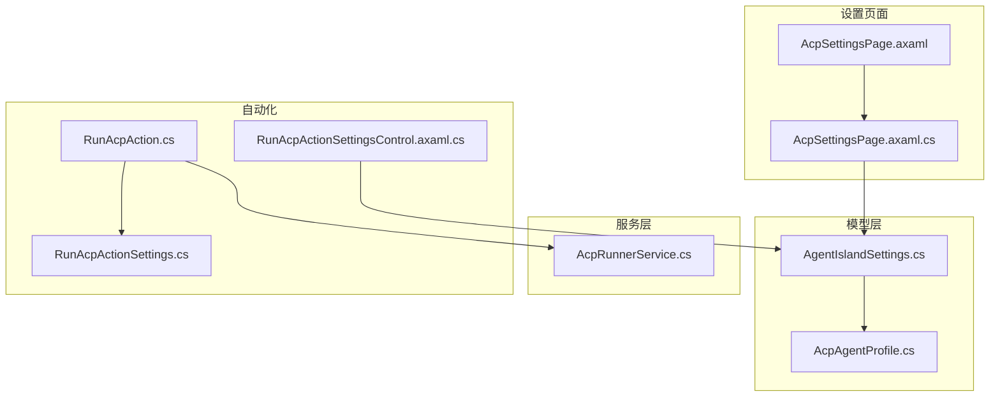
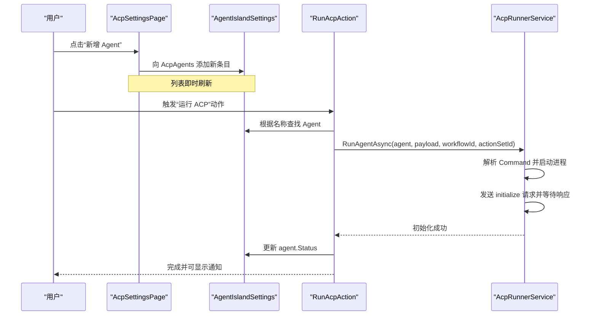
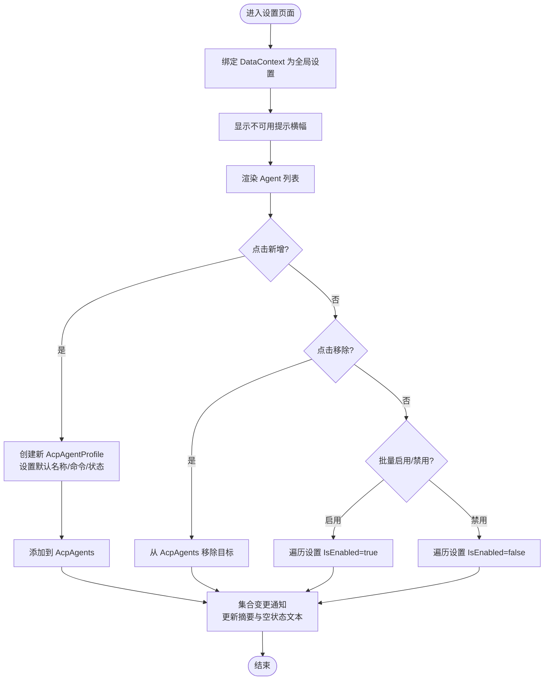
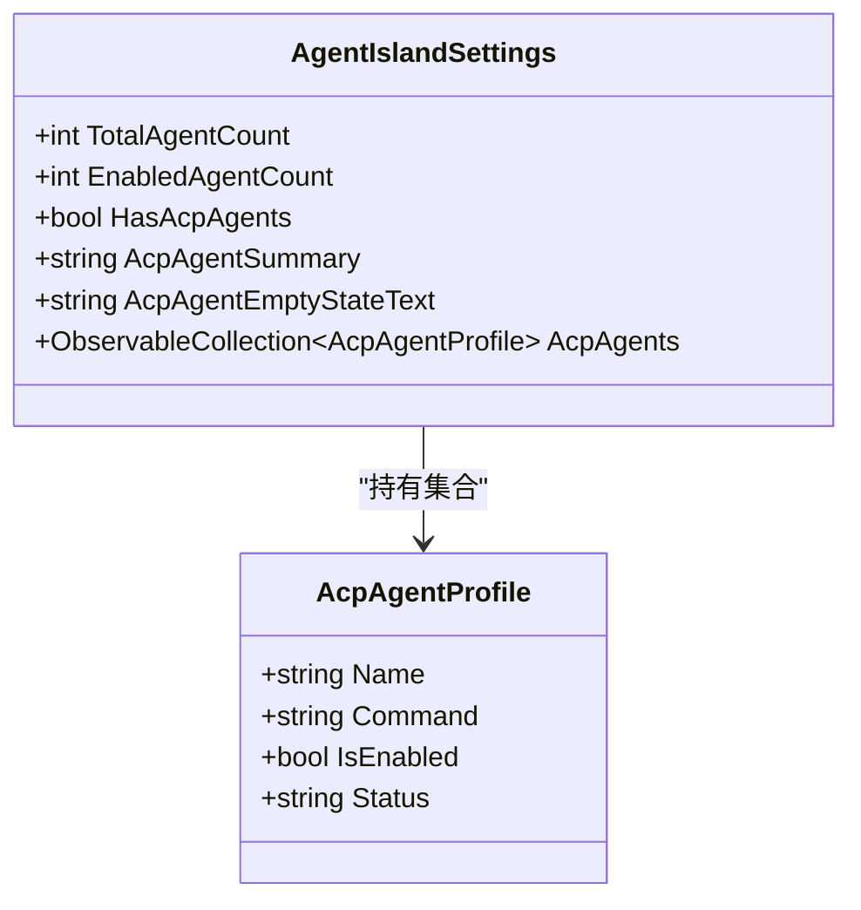
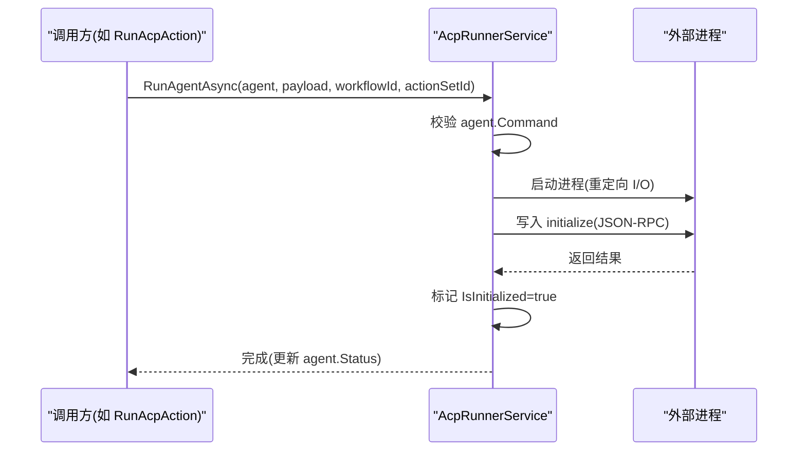
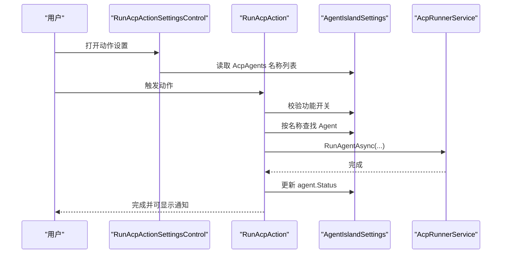
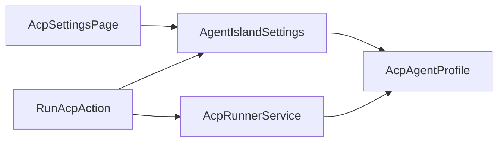

# ACP 设置页面

<cite>
**本文引用的文件**   
- [AcpSettingsPage.axaml.cs](file://Views/SettingsPages/AcpSettingsPage.axaml.cs)
- [AcpSettingsPage.axaml](file://Views/SettingsPages/AcpSettingsPage.axaml)
- [AgentIslandSettings.cs](file://Models/AgentIslandSettings.cs)
- [AcpAgentProfile.cs](file://Models/AcpAgentProfile.cs)
- [AcpRunnerService.cs](file://Services/AcpRunnerService.cs)
- [RunAcpAction.cs](file://Automation/RunAcpAction.cs)
- [RunAcpActionSettingsControl.axaml.cs](file://Views/ActionSettings/RunAcpActionSettingsControl.axaml.cs)
- [RunAcpActionSettings.cs](file://Models/RunAcpActionSettings.cs)
</cite>

## 目录
1. [简介](#简介)
2. [项目结构](#项目结构)
3. [核心组件](#核心组件)
4. [架构总览](#架构总览)
5. [详细组件分析](#详细组件分析)
6. [依赖关系分析](#依赖关系分析)
7. [性能与可靠性考虑](#性能与可靠性考虑)
8. [故障排查指南](#故障排查指南)
9. [结论](#结论)
10. [附录](#附录)

## 简介
本文件为“ACP 自动化设置页面”的权威文档，面向用户与开发者，系统性描述外部 Agent 配置管理界面及其与运行时的集成方式。内容涵盖：
- Agent 列表管理（新增、编辑、删除）
- 连接配置与状态展示
- 认证与安全相关说明
- 多 Agent 配置操作
- 状态监控与连接测试能力现状
- 配置文件验证与错误提示机制
- 与 AcpRunnerService 的集成和数据同步
- 批量操作与导入导出支持现状
- 权限控制与安全注意事项

## 项目结构
ACP 设置页面位于设置页集合中，采用 MVVM 模式，UI 与数据模型分离，并通过插件全局设置对象进行双向绑定。关键路径如下：
- 设置页面视图与代码后台：Views/SettingsPages/AcpSettingsPage.*
- 运行时服务：Services/AcpRunnerService.cs
- 数据模型：Models/AgentIslandSettings.cs、Models/AcpAgentProfile.cs
- 自动化动作入口：Automation/RunAcpAction.cs
- 动作设置控件：Views/ActionSettings/RunAcpActionSettingsControl.axaml.cs、Models/RunAcpActionSettings.cs

图表来源
- [AcpSettingsPage.axaml:1-108](file://Views/SettingsPages/AcpSettingsPage.axaml#L1-L108)
- [AcpSettingsPage.axaml.cs:1-67](file://Views/SettingsPages/AcpSettingsPage.axaml.cs#L1-L67)
- [AgentIslandSettings.cs:1-394](file://Models/AgentIslandSettings.cs#L1-L394)
- [AcpAgentProfile.cs:1-44](file://Models/AcpAgentProfile.cs#L1-L44)
- [AcpRunnerService.cs:1-207](file://Services/AcpRunnerService.cs#L1-L207)
- [RunAcpAction.cs:1-84](file://Automation/RunAcpAction.cs#L1-L84)
- [RunAcpActionSettingsControl.axaml.cs:1-37](file://Views/ActionSettings/RunAcpActionSettingsControl.axaml.cs#L1-L37)
- [RunAcpActionSettings.cs:1-36](file://Models/RunAcpActionSettings.cs#L1-L36)

章节来源
- [AcpSettingsPage.axaml.cs:1-67](file://Views/SettingsPages/AcpSettingsPage.axaml.cs#L1-L67)
- [AcpSettingsPage.axaml:1-108](file://Views/SettingsPages/AcpSettingsPage.axaml#L1-L108)
- [AgentIslandSettings.cs:1-394](file://Models/AgentIslandSettings.cs#L1-L394)
- [AcpAgentProfile.cs:1-44](file://Models/AcpAgentProfile.cs#L1-L44)
- [AcpRunnerService.cs:1-207](file://Services/AcpRunnerService.cs#L1-L207)
- [RunAcpAction.cs:1-84](file://Automation/RunAcpAction.cs#L1-L84)
- [RunAcpActionSettingsControl.axaml.cs:1-37](file://Views/ActionSettings/RunAcpActionSettingsControl.axaml.cs#L1-L37)
- [RunAcpActionSettings.cs:1-36](file://Models/RunAcpActionSettings.cs#L1-L36)

## 核心组件
- 设置页面视图与交互
  - 提供“启用 ACP 功能”开关、Agent 管理器区域、新增/移除 Agent、批量启用/禁用等交互。
  - 通过数据绑定显示 Agent 名称、启动命令、启用状态、运行状态等信息。
- 数据模型
  - AgentIslandSettings：集中保存所有设置项，包括 AcpAgents 集合及派生属性（总数、已启用数、摘要文本、空状态文本）。
  - AcpAgentProfile：单个 Agent 的配置项（名称、命令、是否启用、状态），支持 JSON 序列化与属性变更通知。
- 运行服务
  - AcpRunnerService：负责按 Command 启动外部进程，基于 stdio 的 JSON-RPC 初始化会话，并支持发送 prompt。
- 自动化动作
  - RunAcpAction：在自动化流程中触发 ACP Agent 启动，校验功能开关与 Agent 可用性，更新状态并可选弹出通知。
  - RunAcpActionSettingsControl：为“运行 ACP”动作提供设置界面，列出可用 Agent 名称并默认选中首个。

章节来源
- [AcpSettingsPage.axaml.cs:25-64](file://Views/SettingsPages/AcpSettingsPage.axaml.cs#L25-L64)
- [AcpSettingsPage.axaml:31-103](file://Views/SettingsPages/AcpSettingsPage.axaml#L31-L103)
- [AgentIslandSettings.cs:124-239](file://Models/AgentIslandSettings.cs#L124-L239)
- [AcpAgentProfile.cs:9-43](file://Models/AcpAgentProfile.cs#L9-L43)
- [AcpRunnerService.cs:25-77](file://Services/AcpRunnerService.cs#L25-L77)
- [RunAcpAction.cs:29-82](file://Automation/RunAcpAction.cs#L29-L82)
- [RunAcpActionSettingsControl.axaml.cs:15-35](file://Views/ActionSettings/RunAcpActionSettingsControl.axaml.cs#L15-L35)
- [RunAcpActionSettings.cs:9-35](file://Models/RunAcpActionSettings.cs#L9-L35)

## 架构总览
ACP 设置页面与运行时的交互链路如下：
- 用户在设置页面添加/编辑/删除 Agent，修改会反映到 AgentIslandSettings.AcpAgents 集合。
- 自动化动作“运行 ACP”根据所选 Agent 名称查找对应配置，调用 AcpRunnerService.RunAgentAsync 启动外部进程。
- AcpRunnerService 解析 Command，创建子进程，使用标准输入输出进行 JSON-RPC 初始化，成功后更新 Agent.Status。
- 设置页面通过数据绑定实时显示 Agent 的状态信息。

图表来源
- [AcpSettingsPage.axaml.cs:31-48](file://Views/SettingsPages/AcpSettingsPage.axaml.cs#L31-L48)
- [AgentIslandSettings.cs:124-143](file://Models/AgentIslandSettings.cs#L124-L143)
- [RunAcpAction.cs:29-72](file://Automation/RunAcpAction.cs#L29-L72)
- [AcpRunnerService.cs:25-77](file://Services/AcpRunnerService.cs#L25-L77)

## 详细组件分析

### 设置页面（AcpSettingsPage）
- 功能要点
  - 页面注册为外部类别的设置页，标题为“AgentIsland / ACP 设置”。
  - 顶部有不可用提示横幅；下方为“启用 ACP 功能”开关（当前被禁用）。
  - Agent 管理器区域包含：
    - 新增按钮：向 AcpAgents 追加一个默认名称的 AcpAgentProfile。
    - 列表：每个条目包含 Name、Command、IsEnabled、Status 字段，以及“移除”按钮。
    - 批量操作：启用全部、禁用全部。
- 数据绑定
  - DataContext 指向 Plugin.Settings（即 AgentIslandSettings）。
  - ItemsSource 绑定到 AcpAgents，各字段通过 TwoWay 绑定实现双向同步。
- 事件处理
  - OnAddAcpAgent：计算下一个序号并插入新条目。
  - OnRemoveAcpAgent：从集合中移除选中的 Agent。
  - OnEnableAllAcpAgents/OnDisableAllAcpAgents：遍历集合统一设置 IsEnabled。

图表来源
- [AcpSettingsPage.axaml.cs:25-64](file://Views/SettingsPages/AcpSettingsPage.axaml.cs#L25-L64)
- [AcpSettingsPage.axaml:31-103](file://Views/SettingsPages/AcpSettingsPage.axaml#L31-L103)
- [AgentIslandSettings.cs:275-338](file://Models/AgentIslandSettings.cs#L275-L338)

章节来源
- [AcpSettingsPage.axaml.cs:10-29](file://Views/SettingsPages/AcpSettingsPage.axaml.cs#L10-L29)
- [AcpSettingsPage.axaml:14-29](file://Views/SettingsPages/AcpSettingsPage.axaml#L14-L29)
- [AcpSettingsPage.axaml.cs:31-64](file://Views/SettingsPages/AcpSettingsPage.axaml.cs#L31-L64)
- [AcpSettingsPage.axaml:41-103](file://Views/SettingsPages/AcpSettingsPage.axaml#L41-L103)

### 数据模型（AgentIslandSettings 与 AcpAgentProfile）
- AgentIslandSettings
  - 维护 AcpAgents 集合，并在集合变化时自动更新派生属性：TotalAgentCount、EnabledAgentCount、HasAcpAgents、AcpAgentSummary、AcpAgentEmptyStateText。
  - 提供 Hook/Unhook 机制监听集合内对象的属性变更，确保 UI 实时更新。
- AcpAgentProfile
  - 暴露 Name、Command、IsEnabled、Status 四个可观察属性，支持 JSON 序列化键名映射。
  - Status 由运行阶段写入，用于展示连接或上次运行时间。

图表来源
- [AgentIslandSettings.cs:124-239](file://Models/AgentIslandSettings.cs#L124-L239)
- [AcpAgentProfile.cs:9-43](file://Models/AcpAgentProfile.cs#L9-L43)

章节来源
- [AgentIslandSettings.cs:124-239](file://Models/AgentIslandSettings.cs#L124-L239)
- [AgentIslandSettings.cs:275-338](file://Models/AgentIslandSettings.cs#L275-L338)
- [AcpAgentProfile.cs:9-43](file://Models/AcpAgentProfile.cs#L9-L43)

### 运行服务（AcpRunnerService）
- 职责
  - 根据 AcpAgentProfile.Command 启动外部进程。
  - 通过标准输入输出执行 JSON-RPC 的 initialize 握手，成功后标记会话已初始化。
  - 提供 SendPromptAsync 方法以向已初始化会话发送消息。
  - Dispose 时关闭所有会话进程，必要时强制终止。
- 关键流程
  - 参数校验：检查 Command 是否为空或无效。
  - 进程创建：UseShellExecute=false，重定向 I/O，隐藏窗口。
  - 会话初始化：发送 initialize 请求，读取响应并设置 IsInitialized。
  - 状态更新：将 agent.Status 设置为“已连接：时间戳”。
- 错误处理
  - 未配置命令或命令无效抛出异常。
  - 未初始化会话时发送 Prompt 抛出异常。
  - 停止会话捕获异常并记录日志。

图表来源
- [AcpRunnerService.cs:25-77](file://Services/AcpRunnerService.cs#L25-L77)
- [AcpRunnerService.cs:79-100](file://Services/AcpRunnerService.cs#L79-L100)
- [AcpRunnerService.cs:156-191](file://Services/AcpRunnerService.cs#L156-L191)

章节来源
- [AcpRunnerService.cs:25-77](file://Services/AcpRunnerService.cs#L25-L77)
- [AcpRunnerService.cs:79-100](file://Services/AcpRunnerService.cs#L79-L100)
- [AcpRunnerService.cs:102-131](file://Services/AcpRunnerService.cs#L102-L131)
- [AcpRunnerService.cs:156-191](file://Services/AcpRunnerService.cs#L156-L191)

### 自动化动作（RunAcpAction 与设置控件）
- RunAcpAction
  - 前置校验：检查 IsAcpEnabled 与 IsAgentAutomationEnabled。
  - 查找匹配名称的 Agent，若不存在或已停用则拒绝执行。
  - 调用 AcpRunnerService.RunAgentAsync 启动 Agent，完成后更新 Status，并根据设置弹出通知。
- RunAcpActionSettingsControl
  - 提供 AgentNames 下拉源，默认选择第一个可用 Agent。
  - 动态更新动作名称与图标，便于识别。

图表来源
- [RunAcpAction.cs:29-82](file://Automation/RunAcpAction.cs#L29-L82)
- [RunAcpActionSettingsControl.axaml.cs:15-35](file://Views/ActionSettings/RunAcpActionSettingsControl.axaml.cs#L15-L35)

章节来源
- [RunAcpAction.cs:29-82](file://Automation/RunAcpAction.cs#L29-L82)
- [RunAcpActionSettingsControl.axaml.cs:15-35](file://Views/ActionSettings/RunAcpActionSettingsControl.axaml.cs#L15-L35)
- [RunAcpActionSettings.cs:9-35](file://Models/RunAcpActionSettings.cs#L9-L35)

## 依赖关系分析
- 页面与模型
  - AcpSettingsPage 直接依赖 AgentIslandSettings 作为 DataContext，并通过集合绑定驱动 UI。
- 模型与服务
  - AcpRunnerService 不直接依赖设置页面，但通过传入的 AcpAgentProfile 实例更新其 Status，从而反向影响 UI。
- 自动化与运行
  - RunAcpAction 依赖 AgentIslandSettings 与 AcpRunnerService，构成“配置—执行—状态回写”的闭环。

图表来源
- [AcpSettingsPage.axaml.cs:25-29](file://Views/SettingsPages/AcpSettingsPage.axaml.cs#L25-L29)
- [AgentIslandSettings.cs:124-143](file://Models/AgentIslandSettings.cs#L124-L143)
- [RunAcpAction.cs:29-72](file://Automation/RunAcpAction.cs#L29-L72)
- [AcpRunnerService.cs:25-77](file://Services/AcpRunnerService.cs#L25-L77)

章节来源
- [AcpSettingsPage.axaml.cs:25-29](file://Views/SettingsPages/AcpSettingsPage.axaml.cs#L25-L29)
- [AgentIslandSettings.cs:124-143](file://Models/AgentIslandSettings.cs#L124-L143)
- [RunAcpAction.cs:29-72](file://Automation/RunAcpAction.cs#L29-L72)
- [AcpRunnerService.cs:25-77](file://Services/AcpRunnerService.cs#L25-L77)

## 性能与可靠性考虑
- 进程生命周期
  - AcpRunnerService 在 Dispose 中尝试优雅关闭进程，超时后强制终止，避免僵尸进程。
- 资源释放
  - 每次会话结束后应确保流与进程对象正确释放，防止句柄泄漏。
- 并发与线程
  - 当前实现为单会话顺序读写标准 I/O，建议后续引入异步队列与超时重试以提升稳定性。
- 日志与遥测
  - 关键路径包含日志记录与遥测埋点，有助于定位问题与评估使用量。

[本节为通用指导，无需特定文件引用]

## 故障排查指南
- 常见问题
  - 未配置启动命令：当 Command 为空或无效时，运行服务会抛出异常。请检查 Agent 的 Command 字段。
  - 未初始化会话：在未成功完成 initialize 前发送 Prompt 会失败。确认外部 Agent 是否正确响应 JSON-RPC。
  - 功能未启用：若 IsAcpEnabled 或 IsAgentAutomationEnabled 为 false，自动化动作将被拒绝。
- 定位步骤
  - 查看设置页面的 Agent 状态文本，确认是否显示“已连接：时间戳”或“上次运行：时间戳”。
  - 检查日志输出，关注“启动 ACP Agent”、“Agent 已启动”、“停止 ACP 会话时出错”等关键字。
  - 验证外部进程是否能独立启动，并正确接收/返回 JSON-RPC 消息。

章节来源
- [AcpRunnerService.cs:35-48](file://Services/AcpRunnerService.cs#L35-L48)
- [AcpRunnerService.cs:102-116](file://Services/AcpRunnerService.cs#L102-L116)
- [RunAcpAction.cs:35-60](file://Automation/RunAcpAction.cs#L35-L60)
- [AcpRunnerService.cs:156-191](file://Services/AcpRunnerService.cs#L156-L191)

## 结论
ACP 设置页面提供了基础的 Agent 配置管理能力，并与自动化动作和运行服务形成完整闭环。当前版本实现了：
- 多 Agent 的增删改查与批量启用/禁用
- 基于 Command 的外部进程启动与 JSON-RPC 初始化
- 状态回写到 UI 的基本监控
尚未实现的功能（当前版本）：
- 连接测试按钮与高级认证配置
- 配置文件的显式验证与错误提示
- 批量导入/导出配置
- 细粒度用户权限控制
建议在后续迭代中补充上述能力，以提升用户体验与系统健壮性。

[本节为总结性内容，无需特定文件引用]

## 附录

### 功能清单与现状对照
- 新增/编辑/删除 Agent：已实现
- 批量启用/禁用：已实现
- 连接配置（Command）：已实现
- 认证设置：未实现
- 连接测试：未实现
- 状态监控（Status 文本）：已实现
- 配置文件验证与错误提示：未实现
- 与 AcpRunnerService 集成：已实现
- 数据同步（集合与派生属性）：已实现
- 批量操作：部分实现（启用/禁用）
- 配置导入/导出：未实现
- 用户权限控制：未实现

章节来源
- [AcpSettingsPage.axaml.cs:31-64](file://Views/SettingsPages/AcpSettingsPage.axaml.cs#L31-L64)
- [AcpSettingsPage.axaml:31-103](file://Views/SettingsPages/AcpSettingsPage.axaml#L31-L103)
- [AcpRunnerService.cs:25-77](file://Services/AcpRunnerService.cs#L25-L77)
- [AgentIslandSettings.cs:275-338](file://Models/AgentIslandSettings.cs#L275-L338)