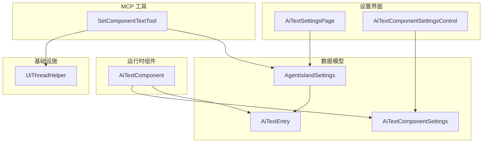
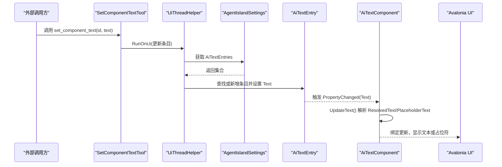
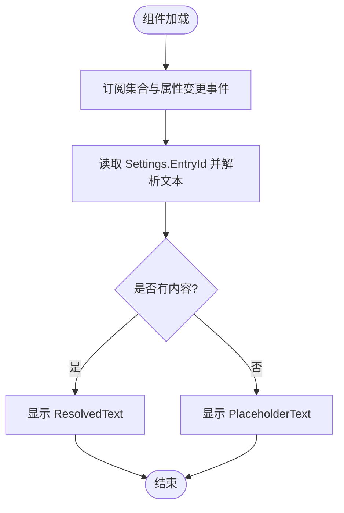
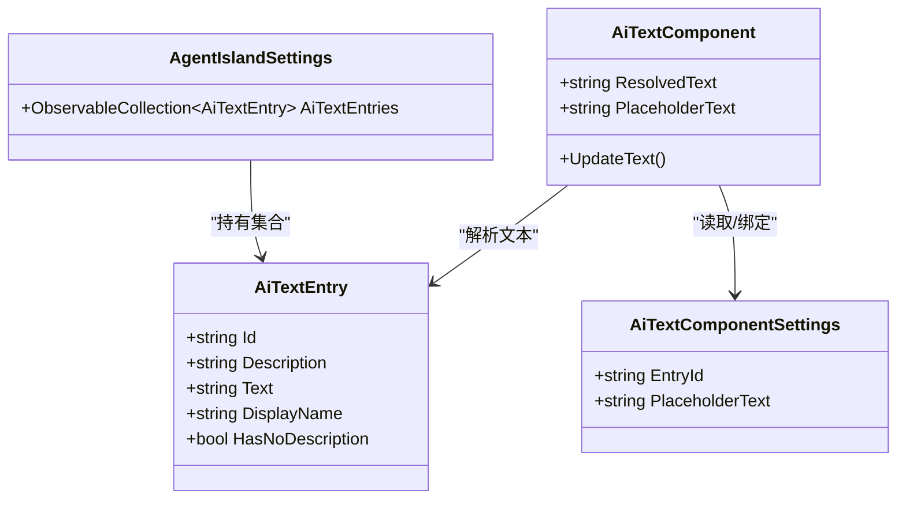
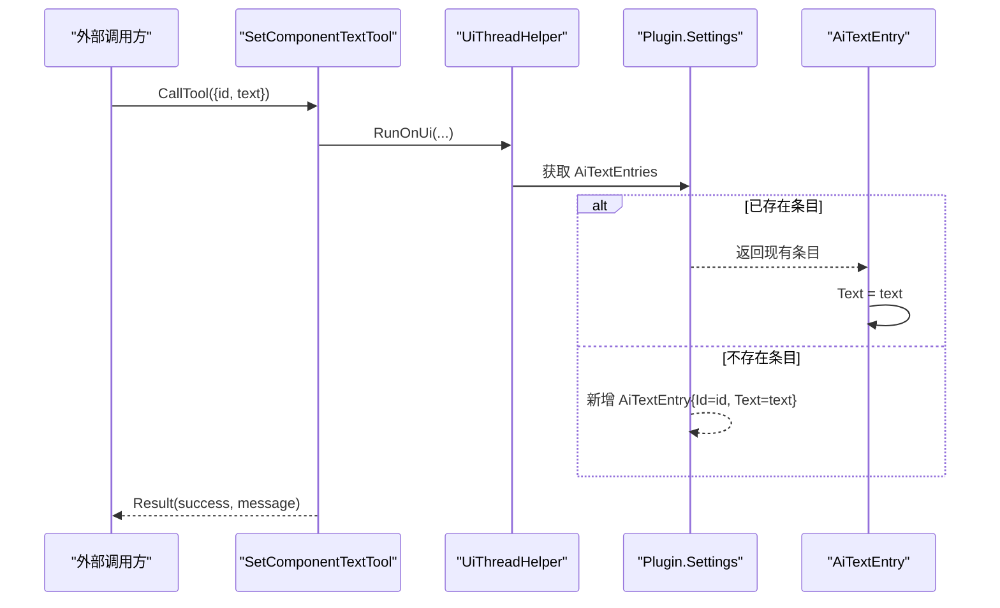
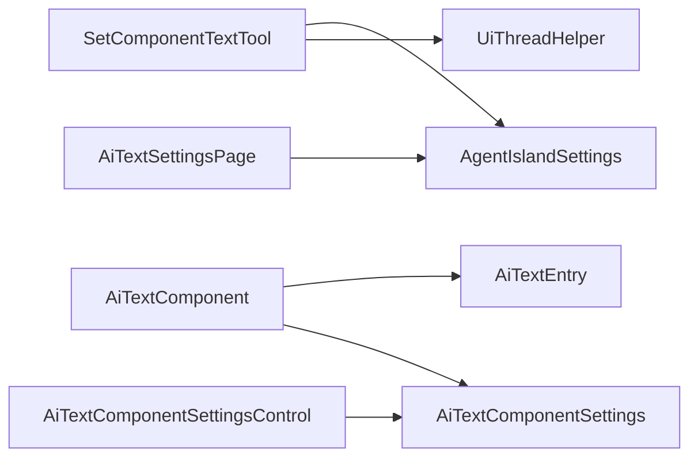

# AI Text 设置页面

<cite>
**本文引用的文件**   
- [AiTextSettingsPage.axaml](file://Views/SettingsPages/AiTextSettingsPage.axaml)
- [AiTextSettingsPage.axaml.cs](file://Views/SettingsPages/AiTextSettingsPage.axaml.cs)
- [AiTextComponentSettingsControl.axaml](file://Components/AiTextComponentSettingsControl.axaml)
- [AiTextComponentSettingsControl.axaml.cs](file://Components/AiTextComponentSettingsControl.axaml.cs)
- [AiTextComponent.axaml](file://Components/AiTextComponent.axaml)
- [AiTextComponent.axaml.cs](file://Components/AiTextComponent.axaml.cs)
- [AiTextEntry.cs](file://Models/AiTextEntry.cs)
- [AiTextComponentSettings.cs](file://Models/AiTextComponentSettings.cs)
- [AgentIslandSettings.cs](file://Models/AgentIslandSettings.cs)
- [SetComponentTextTool.cs](file://Mcp/Tools/SetComponentTextTool.cs)
- [UiThreadHelper.cs](file://Helpers/UiThreadHelper.cs)
</cite>

## 目录
1. [简介](#简介)
2. [项目结构](#项目结构)
3. [核心组件](#核心组件)
4. [架构总览](#架构总览)
5. [详细组件分析](#详细组件分析)
6. [依赖关系分析](#依赖关系分析)
7. [性能与内存管理](#性能与内存管理)
8. [故障排查指南](#故障排查指南)
9. [结论](#结论)
10. [附录：模板语法与示例](#附录模板语法与示例)

## 简介
本文件面向“AI 文字”组件的设置页面与运行时组件，系统性说明以下能力：
- 文本模板管理：在设置页中创建、编辑、删除条目（ID、备注、当前文字），并通过下拉框为组件绑定目标条目。
- 样式与占位符：支持自定义无内容时的占位文字。
- 更新频率配置：当前实现为即时更新；如需定时刷新，可在后续扩展。
- 数据绑定与双向绑定：基于 MVVM 的 ObservableObject 与 Avalonia 数据绑定机制，确保 UI 与模型实时同步。
- 动态渲染与变量替换：当前以纯文本展示；预留扩展点用于未来模板引擎与变量替换。
- 预览与实时效果：设置页直接显示“当前文字”，组件侧实时反映最新文本或占位符。
- 与 AiTextComponent 集成与数据同步策略：通过 MCP 工具 set_component_text 按 ID 写入条目，触发属性变更通知，驱动 UI 自动更新。
- 模板语法与常用示例：提供概念性语法建议与示例（非强制实现）。
- 性能优化与内存管理：事件订阅生命周期、集合变更监听、UI 线程调度等最佳实践。

## 项目结构
围绕“AI 文字”功能的关键文件组织如下：
- 设置页：Views/SettingsPages/AiTextSettingsPage.*
- 组件设置控件：Components/AiTextComponentSettingsControl.*
- 运行时组件：Components/AiTextComponent.*
- 数据模型：Models/AiTextEntry.cs、Models/AiTextComponentSettings.cs、Models/AgentIslandSettings.cs
- MCP 工具：Mcp/Tools/SetComponentTextTool.cs
- UI 线程辅助：Helpers/UiThreadHelper.cs

图表来源
- [AiTextSettingsPage.axaml.cs:1-36](file://Views/SettingsPages/AiTextSettingsPage.axaml.cs#L1-L36)
- [AiTextComponentSettingsControl.axaml.cs:1-53](file://Components/AiTextComponentSettingsControl.axaml.cs#L1-L53)
- [AiTextComponent.axaml.cs:1-85](file://Components/AiTextComponent.axaml.cs#L1-L85)
- [AiTextEntry.cs:1-31](file://Models/AiTextEntry.cs#L1-L31)
- [AiTextComponentSettings.cs:1-13](file://Models/AiTextComponentSettings.cs#L1-L13)
- [AgentIslandSettings.cs:1-394](file://Models/AgentIslandSettings.cs#L1-L394)
- [SetComponentTextTool.cs:1-92](file://Mcp/Tools/SetComponentTextTool.cs#L1-L92)
- [UiThreadHelper.cs:1-25](file://Helpers/UiThreadHelper.cs#L1-L25)

章节来源
- [AiTextSettingsPage.axaml.cs:1-36](file://Views/SettingsPages/AiTextSettingsPage.axaml.cs#L1-L36)
- [AiTextComponentSettingsControl.axaml.cs:1-53](file://Components/AiTextComponentSettingsControl.axaml.cs#L1-L53)
- [AiTextComponent.axaml.cs:1-85](file://Components/AiTextComponent.axaml.cs#L1-L85)
- [AiTextEntry.cs:1-31](file://Models/AiTextEntry.cs#L1-L31)
- [AiTextComponentSettings.cs:1-13](file://Models/AiTextComponentSettings.cs#L1-L13)
- [AgentIslandSettings.cs:1-394](file://Models/AgentIslandSettings.cs#L1-L394)
- [SetComponentTextTool.cs:1-92](file://Mcp/Tools/SetComponentTextTool.cs#L1-L92)
- [UiThreadHelper.cs:1-25](file://Helpers/UiThreadHelper.cs#L1-L25)

## 核心组件
- 设置页 AiTextSettingsPage：负责条目列表的增删与展示，数据源来自全局设置中的 AiTextEntries 集合。
- 组件设置控件 AiTextComponentSettingsControl：用于在组件级选择绑定的条目 ID，并配置占位文字。
- 运行时组件 AiTextComponent：根据 Settings.EntryId 解析对应条目文本，若无内容则显示占位符。
- 数据模型：
  - AiTextEntry：包含 Id、Description、Text 三个可观察字段，并提供 DisplayName 与 HasNoDescription 派生属性。
  - AiTextComponentSettings：保存 EntryId 与 PlaceholderText。
  - AgentIslandSettings：维护 AiTextEntries 集合，并在集合变化时转发 PropertyChanged 事件。
- MCP 工具 SetComponentTextTool：接收 id 与 text，更新或新增对应条目，跨线程安全地写回 UI 上下文。

章节来源
- [AiTextSettingsPage.axaml.cs:1-36](file://Views/SettingsPages/AiTextSettingsPage.axaml.cs#L1-L36)
- [AiTextComponentSettingsControl.axaml.cs:1-53](file://Components/AiTextComponentSettingsControl.axaml.cs#L1-L53)
- [AiTextComponent.axaml.cs:1-85](file://Components/AiTextComponent.axaml.cs#L1-L85)
- [AiTextEntry.cs:1-31](file://Models/AiTextEntry.cs#L1-L31)
- [AiTextComponentSettings.cs:1-13](file://Models/AiTextComponentSettings.cs#L1-L13)
- [AgentIslandSettings.cs:1-394](file://Models/AgentIslandSettings.cs#L1-L394)
- [SetComponentTextTool.cs:1-92](file://Mcp/Tools/SetComponentTextTool.cs#L1-L92)

## 架构总览
下图展示了从 MCP 工具到 UI 更新的完整数据流：

图表来源
- [SetComponentTextTool.cs:41-72](file://Mcp/Tools/SetComponentTextTool.cs#L41-L72)
- [UiThreadHelper.cs:14-23](file://Helpers/UiThreadHelper.cs#L14-L23)
- [AgentIslandSettings.cs:340-392](file://Models/AgentIslandSettings.cs#L340-L392)
- [AiTextEntry.cs:1-31](file://Models/AiTextEntry.cs#L1-L31)
- [AiTextComponent.axaml.cs:58-83](file://Components/AiTextComponent.axaml.cs#L58-L83)

## 详细组件分析

### 设置页：AiTextSettingsPage
职责
- 注册设置页元信息，绑定全局设置对象作为 DataContext。
- 提供“添加条目”按钮，自动生成唯一 ID 并加入集合。
- 提供“删除条目”按钮，移除选中的条目。

关键交互
- 添加条目：生成形如 textN 的 ID，避免重复。
- 删除条目：通过 Button.Tag 传递 AiTextEntry 引用，直接从集合移除。
- 列表展示：ItemsControl 绑定 AiTextEntries，每个条目使用展开面板展示 ID、备注、当前文字。

双向绑定
- 条目 ID、备注、当前文字均通过 TextBox.Text 双向绑定到 AiTextEntry 的属性，修改即生效。

章节来源
- [AiTextSettingsPage.axaml.cs:16-35](file://Views/SettingsPages/AiTextSettingsPage.axaml.cs#L16-L35)
- [AiTextSettingsPage.axaml:25-70](file://Views/SettingsPages/AiTextSettingsPage.axaml#L25-L70)

### 组件设置控件：AiTextComponentSettingsControl
职责
- 在组件级别选择要绑定的条目（EntryComboBox）。
- 提供占位文字输入框，用于无内容时的提示文本。

数据绑定与同步
- 加载时初始化下拉框数据源为 Plugin.Settings.AiTextEntries，并同步选中项。
- 监听集合 CollectionChanged 与下拉框 SelectionChanged，将选中条目的 Id 写入 Settings.EntryId。
- 占位文字通过 RelativeSource 绑定到 Settings.PlaceholderText。

章节来源
- [AiTextComponentSettingsControl.axaml.cs:16-51](file://Components/AiTextComponentSettingsControl.axaml.cs#L16-L51)
- [AiTextComponentSettingsControl.axaml:11-30](file://Components/AiTextComponentSettingsControl.axaml#L11-L30)

### 运行时组件：AiTextComponent
职责
- 根据 Settings.EntryId 找到对应 AiTextEntry，解析其 Text 作为 ResolvedText。
- 当文本为空时显示 PlaceholderText，否则隐藏占位符。

数据同步策略
- 监听全局集合变化与单个条目属性变化，任一变化都触发 UpdateText。
- 暴露 ResolvedText 与 PlaceholderText 两个 Avalonia 属性供 XAML 绑定。

图表来源
- [AiTextComponent.axaml.cs:36-56](file://Components/AiTextComponent.axaml.cs#L36-L56)
- [AiTextComponent.axaml.cs:73-83](file://Components/AiTextComponent.axaml.cs#L73-L83)
- [AiTextComponent.axaml:10-18](file://Components/AiTextComponent.axaml#L10-L18)

章节来源
- [AiTextComponent.axaml.cs:18-83](file://Components/AiTextComponent.axaml.cs#L18-L83)
- [AiTextComponent.axaml:1-20](file://Components/AiTextComponent.axaml#L1-20)

### 数据模型与双向绑定
- AiTextEntry：使用 ObservableProperty 生成属性变更通知，DisplayName 与 HasNoDescription 随 Id/Description 变化而更新。
- AiTextComponentSettings：保存 EntryId 与 PlaceholderText，供组件与设置控件读写。
- AgentIslandSettings：维护 AiTextEntries 集合，并在集合变化时转发 PropertyChanged，使上层 UI 能感知集合变动。

图表来源
- [AiTextEntry.cs:5-30](file://Models/AiTextEntry.cs#L5-L30)
- [AiTextComponentSettings.cs:5-12](file://Models/AiTextComponentSettings.cs#L5-L12)
- [AgentIslandSettings.cs:107-122](file://Models/AgentIslandSettings.cs#L107-L122)
- [AiTextComponent.axaml.cs:18-34](file://Components/AiTextComponent.axaml.cs#L18-L34)

章节来源
- [AiTextEntry.cs:1-31](file://Models/AiTextEntry.cs#L1-L31)
- [AiTextComponentSettings.cs:1-13](file://Models/AiTextComponentSettings.cs#L1-L13)
- [AgentIslandSettings.cs:340-392](file://Models/AgentIslandSettings.cs#L340-L392)

### MCP 工具集成：SetComponentTextTool
职责
- 定义工具名称、描述与输入参数 schema（id、text）。
- 校验参数后，在 UI 线程上更新或新增对应条目。
- 记录日志与遥测，异常捕获并返回结构化结果。

调用流程
- 外部调用方传入 id 与 text。
- 工具在 UiThreadHelper.RunOnUi 中访问 Plugin.Settings.AiTextEntries。
- 若存在匹配条目则更新 Text，否则新增条目并设置 Id 与 Text。
- 由于 AiTextEntry 实现了属性变更通知，AiTextComponent 会收到更新并刷新 UI。

图表来源
- [SetComponentTextTool.cs:32-39](file://Mcp/Tools/SetComponentTextTool.cs#L32-L39)
- [SetComponentTextTool.cs:41-72](file://Mcp/Tools/SetComponentTextTool.cs#L41-L72)
- [UiThreadHelper.cs:14-23](file://Helpers/UiThreadHelper.cs#L14-L23)

章节来源
- [SetComponentTextTool.cs:1-92](file://Mcp/Tools/SetComponentTextTool.cs#L1-L92)
- [UiThreadHelper.cs:1-25](file://Helpers/UiThreadHelper.cs#L1-25)

## 依赖关系分析
- 设置页依赖全局设置对象（AgentIslandSettings）以读写 AiTextEntries。
- 组件设置控件依赖组件级设置（AiTextComponentSettings）以读写 EntryId 与 PlaceholderText。
- 运行时组件依赖全局设置与条目集合，监听集合与属性变更以刷新显示。
- MCP 工具依赖 UiThreadHelper 进行跨线程 UI 操作，依赖全局设置写入数据。

图表来源
- [AiTextSettingsPage.axaml.cs:16-20](file://Views/SettingsPages/AiTextSettingsPage.axaml.cs#L16-L20)
- [AiTextComponentSettingsControl.axaml.cs:16-27](file://Components/AiTextComponentSettingsControl.axaml.cs#L16-L27)
- [AiTextComponent.axaml.cs:36-56](file://Components/AiTextComponent.axaml.cs#L36-L56)
- [SetComponentTextTool.cs:56-63](file://Mcp/Tools/SetComponentTextTool.cs#L56-L63)

章节来源
- [AiTextSettingsPage.axaml.cs:1-36](file://Views/SettingsPages/AiTextSettingsPage.axaml.cs#L1-L36)
- [AiTextComponentSettingsControl.axaml.cs:1-53](file://Components/AiTextComponentSettingsControl.axaml.cs#L1-L53)
- [AiTextComponent.axaml.cs:1-85](file://Components/AiTextComponent.axaml.cs#L1-L85)
- [SetComponentTextTool.cs:1-92](file://Mcp/Tools/SetComponentTextTool.cs#L1-L92)

## 性能与内存管理
- 事件订阅生命周期：
  - 组件与设置控件在 Loaded/Unloaded 中正确订阅与取消订阅集合与属性变更事件，避免内存泄漏。
- 集合变更处理：
  - 对旧条目解绑、对新条目重新绑定，确保只监听活跃条目。
- UI 线程安全：
  - MCP 工具通过 UiThreadHelper 在 UI 线程上更新数据，避免跨线程访问控件状态。
- 渲染效率：
  - 仅当文本为空时才切换占位符可见性，减少不必要的布局重排。
- 可扩展优化建议：
  - 若未来引入模板引擎与变量替换，建议在后台线程计算最终文本，再一次性赋值给 ResolvedText，避免频繁中间状态导致的重绘。
  - 对于大量条目场景，可对 ComboBox 启用虚拟化（由框架默认支持），并限制每次渲染的可视范围。

章节来源
- [AiTextComponent.axaml.cs:36-56](file://Components/AiTextComponent.axaml.cs#L36-L56)
- [AiTextComponentSettingsControl.axaml.cs:16-27](file://Components/AiTextComponentSettingsControl.axaml.cs#L16-L27)
- [SetComponentTextTool.cs:56-63](file://Mcp/Tools/SetComponentTextTool.cs#L56-L63)
- [AiTextComponent.axaml.cs:73-83](file://Components/AiTextComponent.axaml.cs#L73-L83)

## 故障排查指南
- 无法更新文本
  - 检查 MCP 工具是否成功接收到 id 与 text 参数。
  - 确认插件设置中是否存在对应 Id 的条目；若不存在，工具会自动新增。
  - 查看日志输出，确认工具调用路径与异常信息。
- 组件未显示占位符
  - 确认组件设置控件中的占位文字是否正确配置。
  - 检查 ResolvedText 是否为空字符串；若不为空，占位符会被隐藏。
- 设置页删除无效
  - 确认按钮 Tag 是否正确绑定到 AiTextEntry 实例。
  - 检查集合是否被其他代码意外恢复。

章节来源
- [SetComponentTextTool.cs:41-72](file://Mcp/Tools/SetComponentTextTool.cs#L41-L72)
- [AiTextComponent.axaml.cs:73-83](file://Components/AiTextComponent.axaml.cs#L73-L83)
- [AiTextSettingsPage.axaml.cs:30-34](file://Views/SettingsPages/AiTextSettingsPage.axaml.cs#L30-L34)

## 结论
AI 文字设置页面与运行时组件采用清晰的 MVVM 架构，结合 Avalonia 的数据绑定与 CommunityToolkit.Mvvm 的属性变更通知，实现了从设置页到组件展示的端到端双向同步。MCP 工具提供了稳定的外部更新通道，配合 UiThreadHelper 保证线程安全。整体设计简洁、可维护性强，并为未来的模板引擎与变量替换预留了扩展空间。

## 附录：模板语法与示例
以下为概念性模板语法建议（当前版本未实现模板引擎，仅作规划参考）：
- 基本变量替换
  - 语法：使用花括号包裹变量名，例如 {name}、{time}。
  - 示例：欢迎 {name}，今天是 {date}。
- 条件分支
  - 语法：使用 if/else 块，例如 {if condition}{content}{else}{fallback}{/if}。
  - 示例：{if hasData}{data}{else}暂无数据{/if}。
- 循环遍历
  - 语法：使用 for 循环，例如 {for item in list}{item.name}{/for}。
  - 示例：课程列表：{for c in classes}{c.subject} {/for}。
- 格式化与转义
  - 数字格式化：{number:format}。
  - 文本转义：防止注入或特殊字符影响渲染。

注意
- 当前 AiTextEntry.Text 为纯文本，未内置模板解析逻辑。
- 若需实现上述语法，可在 AiTextComponent.UpdateText 前增加模板渲染步骤，并将结果赋给 ResolvedText。

[本节为概念性说明，不直接分析具体文件]