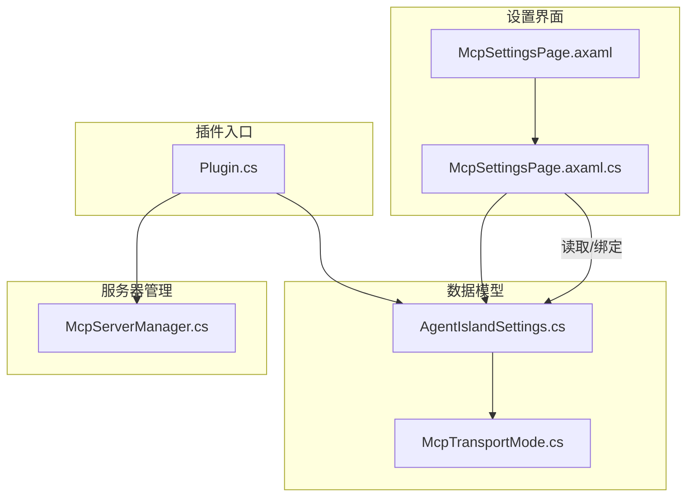
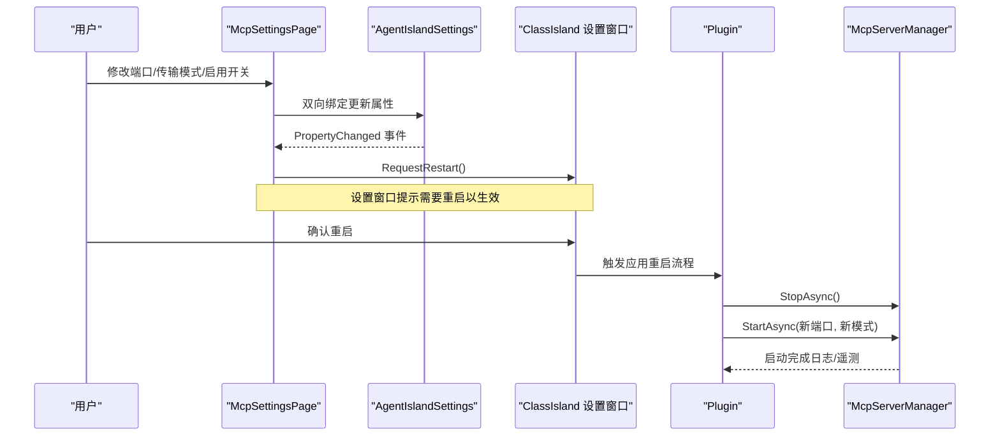
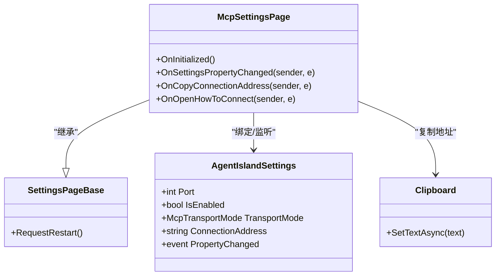
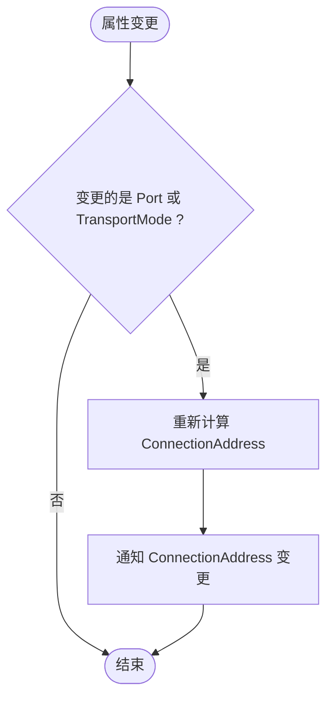
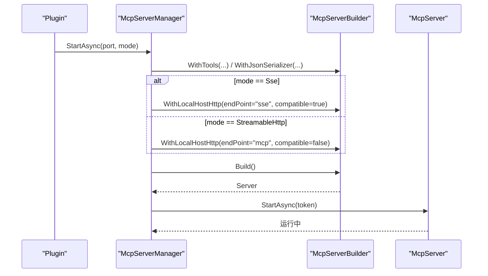
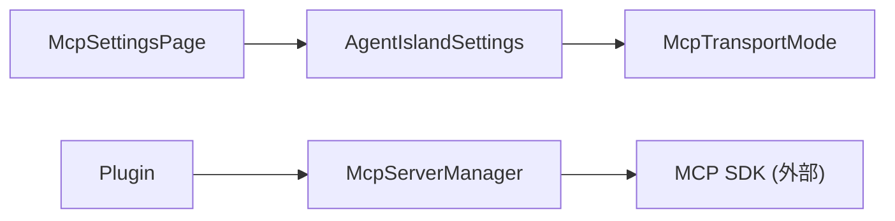

# MCP 设置页面

<cite>
**本文引用的文件**
- [McpSettingsPage.axaml.cs](file://Views/SettingsPages/McpSettingsPage.axaml.cs)
- [McpSettingsPage.axaml](file://Views/SettingsPages/McpSettingsPage.axaml)
- [AgentIslandSettings.cs](file://Models/AgentIslandSettings.cs)
- [McpTransportMode.cs](file://Models/McpTransportMode.cs)
- [McpServerManager.cs](file://Mcp/McpServerManager.cs)
- [Plugin.cs](file://Plugin.cs)
</cite>

## 目录
1. [简介](#简介)
2. [项目结构](#项目结构)
3. [核心组件](#核心组件)
4. [架构总览](#架构总览)
5. [详细组件分析](#详细组件分析)
6. [依赖关系分析](#依赖关系分析)
7. [性能与可用性考虑](#性能与可用性考虑)
8. [故障排查指南](#故障排查指南)
9. [结论](#结论)
10. [附录](#附录)

## 简介
本文件面向开发者与维护者，系统性说明 AgentIsland 插件中“MCP 设置页面”的实现与工作机制。内容涵盖：
- 端口配置、传输模式选择（SSE/HTTP）、启用/禁用控制等界面功能
- SettingsPageInfo 特性的使用与页面注册机制
- 属性变更监听与重启请求机制，解释为何某些配置需要重启服务
- 连接地址复制功能的实现细节与剪贴板操作最佳实践
- 帮助文档的集成方式
- Avalonia UI 组件的使用模式与事件处理机制

## 项目结构
MCP 设置页面位于 Views/SettingsPages 下，由 XAML 描述界面，C# 代码后台处理交互逻辑；设置数据模型位于 Models；服务器生命周期管理位于 Mcp；插件入口负责加载设置、注册设置页并启动/停止 MCP 服务器。

图表来源
- [McpSettingsPage.axaml:1-89](file://Views/SettingsPages/McpSettingsPage.axaml#L1-L89)
- [McpSettingsPage.axaml.cs:1-66](file://Views/SettingsPages/McpSettingsPage.axaml.cs#L1-L66)
- [AgentIslandSettings.cs:1-394](file://Models/AgentIslandSettings.cs#L1-L394)
- [McpTransportMode.cs:1-18](file://Models/McpTransportMode.cs#L1-L18)
- [McpServerManager.cs:1-125](file://Mcp/McpServerManager.cs#L1-L125)
- [Plugin.cs:1-114](file://Plugin.cs#L1-L114)

章节来源
- [McpSettingsPage.axaml:1-89](file://Views/SettingsPages/McpSettingsPage.axaml#L1-L89)
- [McpSettingsPage.axaml.cs:1-66](file://Views/SettingsPages/McpSettingsPage.axaml.cs#L1-L66)
- [AgentIslandSettings.cs:1-394](file://Models/AgentIslandSettings.cs#L1-L394)
- [McpTransportMode.cs:1-18](file://Models/McpTransportMode.cs#L1-L18)
- [McpServerManager.cs:1-125](file://Mcp/McpServerManager.cs#L1-L125)
- [Plugin.cs:1-114](file://Plugin.cs#L1-L114)

## 核心组件
- 设置页面类：继承自基类，提供页面元信息、初始化、属性变更监听、UI 交互处理。
- 设置数据模型：集中保存所有设置项，支持属性变更通知与派生属性计算。
- 传输模式枚举：定义当前支持的传输协议类型。
- 服务器管理器：封装 MCP 服务器的启动、停止与资源释放。
- 插件入口：加载持久化设置、注册设置页、应用生命周期内启动/停止服务器。

章节来源
- [McpSettingsPage.axaml.cs:1-66](file://Views/SettingsPages/McpSettingsPage.axaml.cs#L1-L66)
- [AgentIslandSettings.cs:1-394](file://Models/AgentIslandSettings.cs#L1-L394)
- [McpTransportMode.cs:1-18](file://Models/McpTransportMode.cs#L1-L18)
- [McpServerManager.cs:1-125](file://Mcp/McpServerManager.cs#L1-L125)
- [Plugin.cs:1-114](file://Plugin.cs#L1-L114)

## 架构总览
下图展示了从用户交互到服务器启停的整体流程，包括设置页注册、属性绑定、重启提示、以及实际的服务启动路径。

图表来源
- [McpSettingsPage.axaml.cs:26-41](file://Views/SettingsPages/McpSettingsPage.axaml.cs#L26-L41)
- [AgentIslandSettings.cs:240-273](file://Models/AgentIslandSettings.cs#L240-L273)
- [Plugin.cs:55-79](file://Plugin.cs#L55-L79)
- [McpServerManager.cs:25-82](file://Mcp/McpServerManager.cs#L25-L82)

## 详细组件分析

### 设置页面：McpSettingsPage
- 页面注册与元信息
  - 通过特性标注页面的唯一标识、显示名称与分类，供设置窗口扫描注册。
- 初始化与数据绑定
  - 在初始化时设置 DataContext 为全局设置实例，并订阅其属性变更事件。
- 属性变更监听与重启请求
  - 当 IsEnabled、Port、TransportMode 任一属性变化时，调用基类的重启请求方法，提示用户重启后生效。
- 连接地址复制
  - 按钮 Tag 绑定 ConnectionAddress，点击后通过 TopLevel.Clipboard 异步写入文本，并弹出 Flyout 反馈“已复制”。
- 打开帮助文档
  - 使用系统默认浏览器打开指定链接，便于查看连接说明与使用指南。

图表来源
- [McpSettingsPage.axaml.cs:14-63](file://Views/SettingsPages/McpSettingsPage.axaml.cs#L14-L63)
- [AgentIslandSettings.cs:34-62](file://Models/AgentIslandSettings.cs#L34-L62)
- [AgentIslandSettings.cs:202-211](file://Models/AgentIslandSettings.cs#L202-L211)

章节来源
- [McpSettingsPage.axaml.cs:14-63](file://Views/SettingsPages/McpSettingsPage.axaml.cs#L14-L63)
- [McpSettingsPage.axaml:16-83](file://Views/SettingsPages/McpSettingsPage.axaml#L16-L83)

### 数据模型：AgentIslandSettings
- 关键属性
  - Port：MCP 服务器监听端口，默认值在构造时设定。
  - IsEnabled：是否启用 MCP 服务器。
  - TransportMode：传输模式，对应枚举类型。
  - ConnectionAddress：只读派生属性，根据 TransportMode 与 Port 动态生成连接地址。
- 属性变更通知
  - 基于可观察对象框架实现属性变更通知；当 Port 或 TransportMode 变化时，重新计算并通知 ConnectionAddress。
- 持久化
  - 插件入口在设置变更时自动保存到配置文件。

图表来源
- [AgentIslandSettings.cs:240-273](file://Models/AgentIslandSettings.cs#L240-L273)
- [AgentIslandSettings.cs:202-211](file://Models/AgentIslandSettings.cs#L202-L211)

章节来源
- [AgentIslandSettings.cs:34-62](file://Models/AgentIslandSettings.cs#L34-L62)
- [AgentIslandSettings.cs:202-211](file://Models/AgentIslandSettings.cs#L202-L211)
- [AgentIslandSettings.cs:240-273](file://Models/AgentIslandSettings.cs#L240-L273)

### 传输模式：McpTransportMode
- 枚举定义
  - StreamableHttp：现代传输协议。
  - Sse：旧版 Server-Sent Events 协议。
- 界面表现
  - 设置页中 ComboBox 绑定 SelectedIndex 到 TransportMode，当前仅启用 Streamable HTTP，SSE 选项被禁用。

章节来源
- [McpTransportMode.cs:1-18](file://Models/McpTransportMode.cs#L1-L18)
- [McpSettingsPage.axaml:39-49](file://Views/SettingsPages/McpSettingsPage.axaml#L39-L49)

### 服务器管理：McpServerManager
- 启动流程
  - 根据 TransportMode 选择端点与 SSE 兼容性参数，构建并启动本地 HTTP 服务器。
  - 记录日志与遥测，异常捕获上报。
- 停止流程
  - 取消令牌、停止服务、释放资源，记录日志与遥测。
- 资源释放
  - Dispose 中同步等待停止并标记已释放。

图表来源
- [McpServerManager.cs:25-82](file://Mcp/McpServerManager.cs#L25-L82)

章节来源
- [McpServerManager.cs:25-82](file://Mcp/McpServerManager.cs#L25-L82)
- [McpServerManager.cs:84-112](file://Mcp/McpServerManager.cs#L84-L112)
- [McpServerManager.cs:114-124](file://Mcp/McpServerManager.cs#L114-L124)

### 插件入口：Plugin
- 设置加载与持久化
  - 从配置文件加载设置，并在属性变更时自动保存。
- 设置页注册
  - 将各设置页添加到服务容器，供设置窗口发现与展示。
- 生命周期管理
  - 应用启动时根据 IsEnabled 决定是否启动 MCP 服务器；应用停止时确保服务器关闭。

章节来源
- [Plugin.cs:29-53](file://Plugin.cs#L29-L53)
- [Plugin.cs:55-79](file://Plugin.cs#L55-L79)
- [Plugin.cs:81-97](file://Plugin.cs#L81-L97)

## 依赖关系分析
- 页面层依赖
  - McpSettingsPage 依赖 AgentIslandSettings 进行数据绑定与监听。
  - 通过 ClassIsland 核心提供的基类与特性完成页面注册与重启提示。
- 模型层依赖
  - AgentIslandSettings 依赖 McpTransportMode 枚举。
- 运行时依赖
  - Plugin 依赖 McpServerManager 管理服务器生命周期。
  - McpServerManager 依赖底层 MCP SDK 构建与启动本地 HTTP 服务。

图表来源
- [McpSettingsPage.axaml.cs:14-41](file://Views/SettingsPages/McpSettingsPage.axaml.cs#L14-L41)
- [AgentIslandSettings.cs:34-62](file://Models/AgentIslandSettings.cs#L34-L62)
- [McpTransportMode.cs:1-18](file://Models/McpTransportMode.cs#L1-L18)
- [Plugin.cs:29-53](file://Plugin.cs#L29-L53)
- [McpServerManager.cs:25-82](file://Mcp/McpServerManager.cs#L25-L82)

章节来源
- [McpSettingsPage.axaml.cs:14-41](file://Views/SettingsPages/McpSettingsPage.axaml.cs#L14-L41)
- [AgentIslandSettings.cs:34-62](file://Models/AgentIslandSettings.cs#L34-L62)
- [McpTransportMode.cs:1-18](file://Models/McpTransportMode.cs#L1-L18)
- [Plugin.cs:29-53](file://Plugin.cs#L29-L53)
- [McpServerManager.cs:25-82](file://Mcp/McpServerManager.cs#L25-L82)

## 性能与可用性考虑
- 属性变更节流
  - 当前对 IsEnabled、Port、TransportMode 的变更直接触发重启请求，避免频繁重启建议在上层（设置窗口）合并多次变更后再提示。
- 连接地址计算
  - ConnectionAddress 为只读派生属性，仅在相关属性变更时重新计算，开销极低。
- 剪贴板操作
  - 使用异步 API 写入剪贴板，避免阻塞 UI 线程；在失败情况下应增加错误提示与回退策略。
- 传输模式选择
  - 当前 SSE 选项禁用，若未来启用需评估兼容性与性能差异，并提供迁移指引。

[本节为通用指导，不直接分析具体文件]

## 故障排查指南
- 无法复制连接地址
  - 检查按钮 Tag 是否正确绑定 ConnectionAddress。
  - 确认 TopLevel.Clipboard 可用且未受权限限制。
  - 建议在异步写入失败时捕获异常并提示用户。
- 修改端口/传输模式后未生效
  - 确认页面已正确监听属性变更并调用重启请求。
  - 确认设置窗口接受重启提示并执行重启流程。
  - 检查应用启动时是否按最新配置启动服务器。
- 服务器启动失败
  - 查看日志与遥测上报，定位端口占用或端点冲突问题。
  - 确认所选传输模式的端点与 SSE 兼容性参数匹配。

章节来源
- [McpSettingsPage.axaml.cs:43-63](file://Views/SettingsPages/McpSettingsPage.axaml.cs#L43-L63)
- [Plugin.cs:55-79](file://Plugin.cs#L55-L79)
- [McpServerManager.cs:25-82](file://Mcp/McpServerManager.cs#L25-L82)

## 结论
MCP 设置页面通过清晰的 MVVM 绑定与属性变更监听，实现了端口、传输模式与启用状态的便捷配置。借助特性与设置窗口集成，页面注册与重启提示流程顺畅。连接地址复制与帮助文档打开提供了良好的用户体验。后续可在错误处理、重试与迁移引导方面进一步增强健壮性。

[本节为总结性内容，不直接分析具体文件]

## 附录

### 设置项与行为对照表
- 启用 MCP 服务器
  - 作用：控制是否在应用启动时创建并启动 MCP 服务器。
  - 行为：变更后立即触发重启请求。
- 服务监听端口
  - 作用：指定本地 HTTP 服务监听的端口号。
  - 行为：变更后立即触发重启请求；影响 ConnectionAddress。
- 传输模式
  - 作用：选择 Streamable HTTP 或 SSE。
  - 行为：变更后立即触发重启请求；影响端点与 SSE 兼容性。
- 连接地址
  - 作用：显示当前可用的连接地址。
  - 行为：只读，随端口与传输模式变化自动更新。
- 如何连接
  - 作用：打开帮助文档链接。
  - 行为：使用系统默认浏览器打开指定 URL。

章节来源
- [McpSettingsPage.axaml:16-83](file://Views/SettingsPages/McpSettingsPage.axaml#L16-L83)
- [AgentIslandSettings.cs:202-211](file://Models/AgentIslandSettings.cs#L202-L211)
- [McpSettingsPage.axaml.cs:56-63](file://Views/SettingsPages/McpSettingsPage.axaml.cs#L56-L63)

### Avalonia UI 组件与事件处理要点
- 控件使用
  - ToggleSwitch：用于启用/禁用开关。
  - NumericUpDown：用于端口输入，限制范围与步长。
  - ComboBox：用于传输模式选择，当前禁用 SSE 选项。
  - Button + Flyout：用于复制地址并给出反馈。
- 事件处理
  - Click 事件绑定到后台方法，执行剪贴板写入与 Flyout 展示。
  - 属性变更事件订阅于 OnInitialized，统一处理重启请求。
- 主题与图标
  - 使用 FluentAvalonia 的 SettingsExpander 组织设置项。
  - 使用 ci:FluentIcon 与 Glyph 编码显示图标。

章节来源
- [McpSettingsPage.axaml:16-83](file://Views/SettingsPages/McpSettingsPage.axaml#L16-L83)
- [McpSettingsPage.axaml.cs:26-63](file://Views/SettingsPages/McpSettingsPage.axaml.cs#L26-L63)