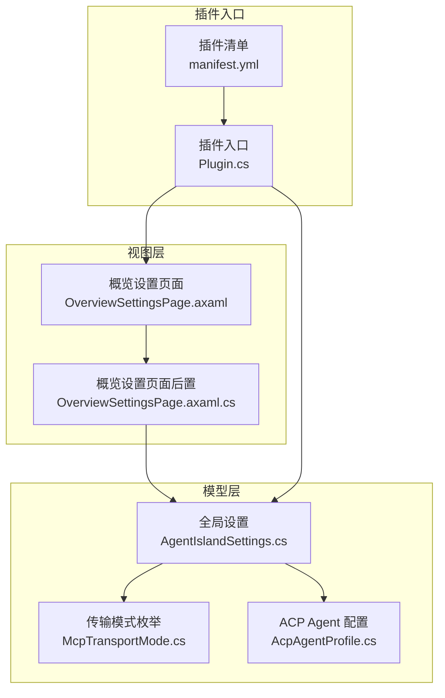
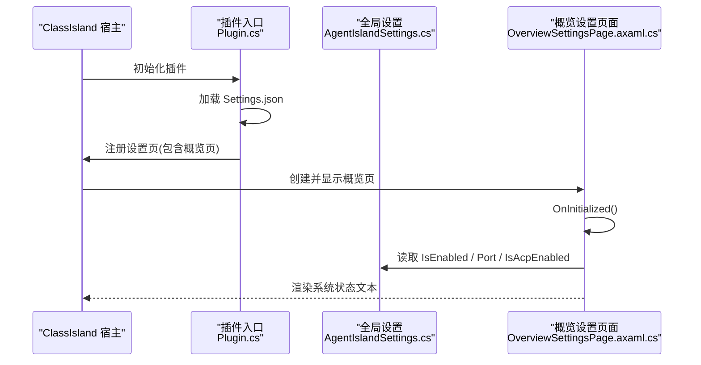
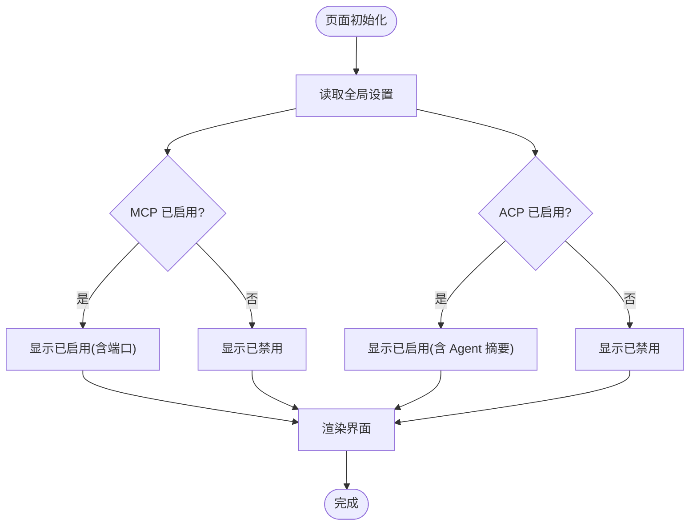
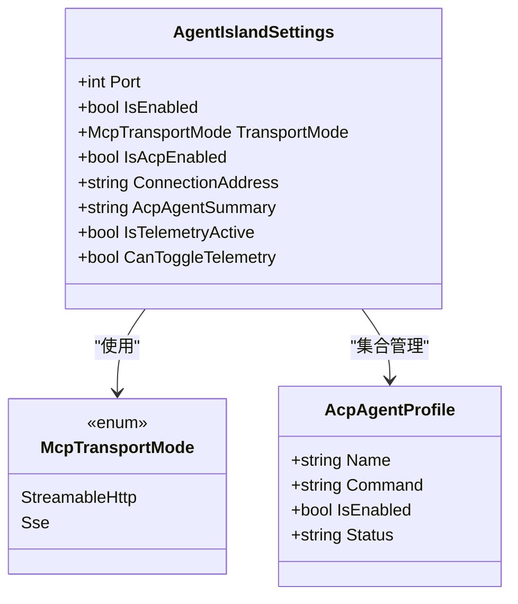
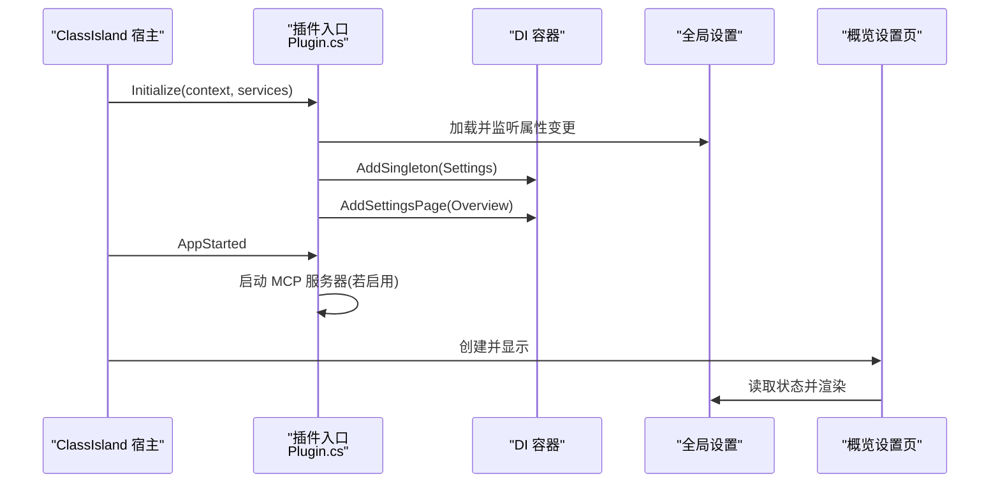
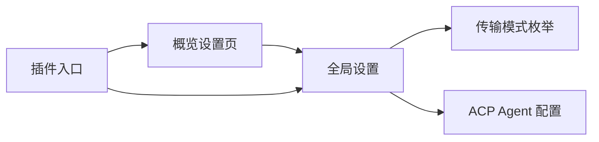

# 概览设置页面

<cite>
**本文引用的文件**   
- [OverviewSettingsPage.axaml](file://Views/SettingsPages/OverviewSettingsPage.axaml)
- [OverviewSettingsPage.axaml.cs](file://Views/SettingsPages/OverviewSettingsPage.axaml.cs)
- [Plugin.cs](file://Plugin.cs)
- [AgentIslandSettings.cs](file://Models/AgentIslandSettings.cs)
- [McpTransportMode.cs](file://Models/McpTransportMode.cs)
- [AcpAgentProfile.cs](file://Models/AcpAgentProfile.cs)
- [McpSettingsPage.axaml.cs](file://Views/SettingsPages/McpSettingsPage.axaml.cs)
- [AcpSettingsPage.axaml.cs](file://Views/SettingsPages/AcpSettingsPage.axaml.cs)
- [manifest.yml](file://manifest.yml)
</cite>

## 目录
1. [简介](#简介)
2. [项目结构](#项目结构)
3. [核心组件](#核心组件)
4. [架构总览](#架构总览)
5. [详细组件分析](#详细组件分析)
6. [依赖关系分析](#依赖关系分析)
7. [性能与可用性考虑](#性能与可用性考虑)
8. [故障排查指南](#故障排查指南)
9. [结论](#结论)

## 简介
本文件聚焦于“概览设置页面”的实现与集成，说明该页面在 ClassIsland 插件体系中的角色、UI 构成、数据绑定与状态展示逻辑，以及与 MCP 服务器和 ACP 面板的关联。读者无需深入代码即可理解该页面的功能边界、交互方式与扩展点。

## 项目结构
概览设置页面位于 Views/SettingsPages 目录下，采用 Avalonia XAML + 代码后置的模式实现，并通过 ClassIsland 的设置页注册机制注入到宿主应用的设置窗口中。

图表来源
- [OverviewSettingsPage.axaml:1-66](file://Views/SettingsPages/OverviewSettingsPage.axaml#L1-L66)
- [OverviewSettingsPage.axaml.cs:1-57](file://Views/SettingsPages/OverviewSettingsPage.axaml.cs#L1-L57)
- [AgentIslandSettings.cs:1-394](file://Models/AgentIslandSettings.cs#L1-L394)
- [McpTransportMode.cs:1-18](file://Models/McpTransportMode.cs#L1-L18)
- [AcpAgentProfile.cs:1-44](file://Models/AcpAgentProfile.cs#L1-L44)
- [Plugin.cs:1-115](file://Plugin.cs#L1-L115)
- [manifest.yml:1-13](file://manifest.yml#L1-L13)

章节来源
- [OverviewSettingsPage.axaml:1-66](file://Views/SettingsPages/OverviewSettingsPage.axaml#L1-L66)
- [OverviewSettingsPage.axaml.cs:1-57](file://Views/SettingsPages/OverviewSettingsPage.axaml.cs#L1-L57)
- [Plugin.cs:1-115](file://Plugin.cs#L1-L115)
- [AgentIslandSettings.cs:1-394](file://Models/AgentIslandSettings.cs#L1-L394)
- [McpTransportMode.cs:1-18](file://Models/McpTransportMode.cs#L1-L18)
- [AcpAgentProfile.cs:1-44](file://Models/AcpAgentProfile.cs#L1-L44)
- [manifest.yml:1-13](file://manifest.yml#L1-L13)

## 核心组件
- 概览设置页面：提供插件基本信息、功能概览、快速链接与系统状态的可视化展示。
- 全局设置模型：集中管理 MCP 端口、传输模式、ACP 开关、遥测等配置项，并提供派生属性（如连接地址、Agent 摘要）。
- 插件入口：负责加载配置、注册设置页、启动/停止 MCP 服务以及将设置对象注入到 DI 容器。

章节来源
- [OverviewSettingsPage.axaml.cs:10-56](file://Views/SettingsPages/OverviewSettingsPage.axaml.cs#L10-L56)
- [AgentIslandSettings.cs:13-232](file://Models/AgentIslandSettings.cs#L13-L232)
- [Plugin.cs:29-54](file://Plugin.cs#L29-L54)

## 架构总览
概览设置页面通过 ClassIsland 的设置页注册机制被宿主发现并显示。页面初始化时读取全局设置，动态渲染 MCP 与 ACP 的运行状态；同时提供外部链接跳转能力。

图表来源
- [Plugin.cs:29-54](file://Plugin.cs#L29-L54)
- [OverviewSettingsPage.axaml.cs:25-42](file://Views/SettingsPages/OverviewSettingsPage.axaml.cs#L25-L42)
- [AgentIslandSettings.cs:34-72](file://Models/AgentIslandSettings.cs#L34-L72)

## 详细组件分析

### 概览设置页面 UI 与交互
- 布局与分组：使用可折叠设置组展示“基本信息”、“功能概览”、“快速链接”、“系统状态”四大区块。
- 状态展示：根据全局设置动态更新 MCP 与 ACP 的状态文本。
- 外部链接：点击按钮后调用系统默认浏览器打开对应 URL。

图表来源
- [OverviewSettingsPage.axaml.cs:31-42](file://Views/SettingsPages/OverviewSettingsPage.axaml.cs#L31-L42)
- [AgentIslandSettings.cs:214-232](file://Models/AgentIslandSettings.cs#L214-L232)

章节来源
- [OverviewSettingsPage.axaml:10-60](file://Views/SettingsPages/OverviewSettingsPage.axaml#L10-L60)
- [OverviewSettingsPage.axaml.cs:25-54](file://Views/SettingsPages/OverviewSettingsPage.axaml.cs#L25-L54)

### 全局设置模型与派生属性
- 关键开关与参数：MCP 端口、是否启用、传输模式、ACP 开关、遥测开关、隐私协议同意状态、自定义 DSN 等。
- 派生属性：
  - 连接地址：基于端口与传输模式生成 http://localhost:{Port}/{mcp|sse}。
  - Agent 摘要：统计总数与启用数，用于概览页展示。
- 属性变更联动：当端口或传输模式变化时，自动通知连接地址变化；遥测相关属性变更会联动启用状态与可用性。

图表来源
- [AgentIslandSettings.cs:34-232](file://Models/AgentIslandSettings.cs#L34-L232)
- [McpTransportMode.cs:6-17](file://Models/McpTransportMode.cs#L6-L17)
- [AcpAgentProfile.cs:9-43](file://Models/AcpAgentProfile.cs#L9-L43)

章节来源
- [AgentIslandSettings.cs:13-232](file://Models/AgentIslandSettings.cs#L13-L232)
- [McpTransportMode.cs:1-18](file://Models/McpTransportMode.cs#L1-L18)
- [AcpAgentProfile.cs:1-44](file://Models/AcpAgentProfile.cs#L1-L44)

### 插件入口与设置页注册
- 插件初始化阶段：
  - 从配置文件加载全局设置，并在属性变更时持久化保存。
  - 注册遥测服务、通知提供者、AI 文字组件与各设置页（包括概览页）。
  - 应用启动时根据设置启动 MCP 服务器；应用停止时优雅关闭。
- 设置页注册：概览页通过 AddSettingsPage 注册为外部设置页，由宿主统一呈现。

图表来源
- [Plugin.cs:29-54](file://Plugin.cs#L29-L54)
- [Plugin.cs:56-80](file://Plugin.cs#L56-L80)
- [OverviewSettingsPage.axaml.cs:25-42](file://Views/SettingsPages/OverviewSettingsPage.axaml.cs#L25-L42)

章节来源
- [Plugin.cs:29-80](file://Plugin.cs#L29-L80)

### 与其他设置页的协作
- MCP 设置页：监听端口、传输模式与启用状态变化，必要时请求重启以生效。
- ACP 设置页：维护 Agent 列表，支持增删与批量启停，影响概览页的 Agent 摘要文本。

章节来源
- [McpSettingsPage.axaml.cs:26-41](file://Views/SettingsPages/McpSettingsPage.axaml.cs#L26-L41)
- [AcpSettingsPage.axaml.cs:25-64](file://Views/SettingsPages/AcpSettingsPage.axaml.cs#L25-L64)

## 依赖关系分析
- 视图对模型的单向依赖：概览页仅读取全局设置的只读信息，不直接修改配置。
- 插件入口作为协调者：负责生命周期管理与资源注册。
- 枚举与实体模型：为设置项提供类型安全与序列化支持。

图表来源
- [OverviewSettingsPage.axaml.cs:31-42](file://Views/SettingsPages/OverviewSettingsPage.axaml.cs#L31-L42)
- [AgentIslandSettings.cs:34-232](file://Models/AgentIslandSettings.cs#L34-L232)
- [Plugin.cs:29-54](file://Plugin.cs#L29-L54)

章节来源
- [OverviewSettingsPage.axaml.cs:31-42](file://Views/SettingsPages/OverviewSettingsPage.axaml.cs#L31-L42)
- [AgentIslandSettings.cs:34-232](file://Models/AgentIslandSettings.cs#L34-L232)
- [Plugin.cs:29-54](file://Plugin.cs#L29-L54)

## 性能与可用性考虑
- 轻量级状态渲染：概览页仅在初始化时读取设置并渲染文本，避免频繁轮询。
- 派生属性优化：连接地址与 Agent 摘要通过属性变更事件计算，减少重复计算。
- 用户反馈：状态文本直观反映当前运行状况，便于快速定位问题。

[本节为通用指导，不涉及具体文件分析]

## 故障排查指南
- 链接无法打开：检查操作系统默认浏览器是否正确设置；确认按钮 Tag 中的 URL 有效。
- 状态未更新：确认全局设置已正确加载且属性变更事件已触发；检查 MCP/ACP 开关与端口配置。
- 需要重启生效：修改 MCP 端口或传输模式后，请在相应设置页触发重启提示。

章节来源
- [OverviewSettingsPage.axaml.cs:44-54](file://Views/SettingsPages/OverviewSettingsPage.axaml.cs#L44-L54)
- [McpSettingsPage.axaml.cs:33-41](file://Views/SettingsPages/McpSettingsPage.axaml.cs#L33-L41)

## 结论
概览设置页面以简洁直观的方式呈现插件的核心信息与运行状态，配合全局设置模型与插件入口的生命周期管理，形成清晰的数据流与职责划分。通过与其他设置页的协作，用户可在统一的设置窗口内完成 MCP、ACP、遥测等功能的配置与管理。