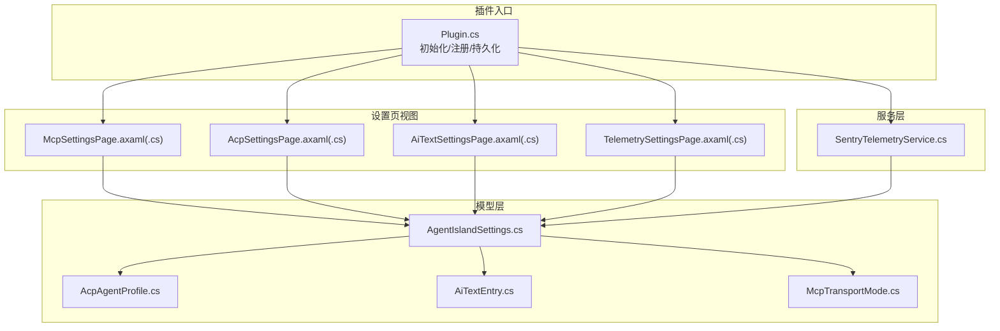
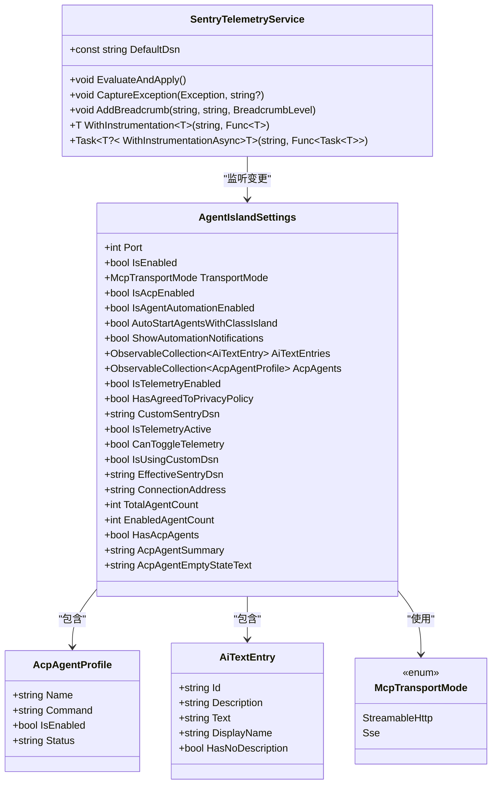
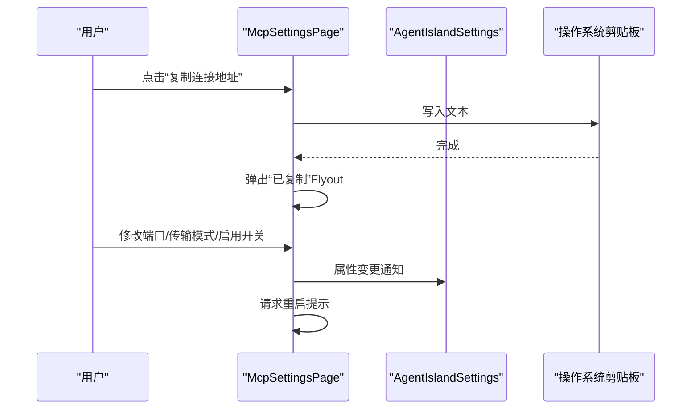
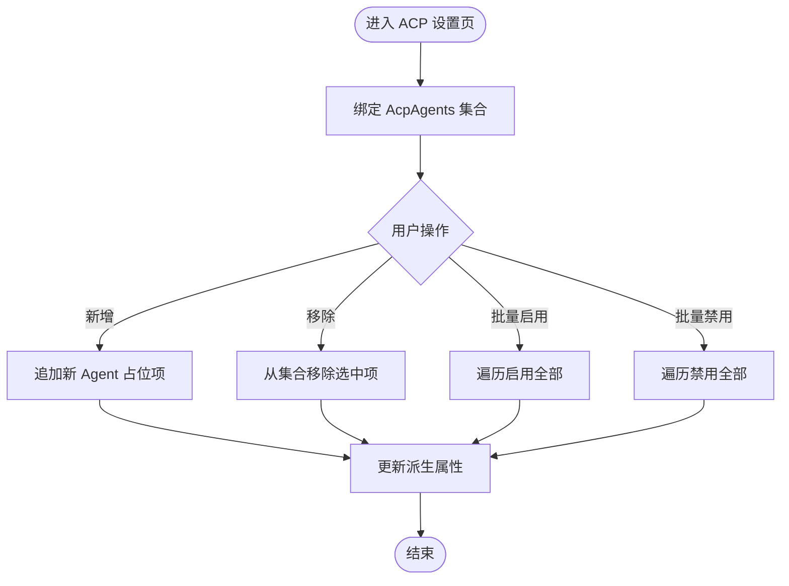
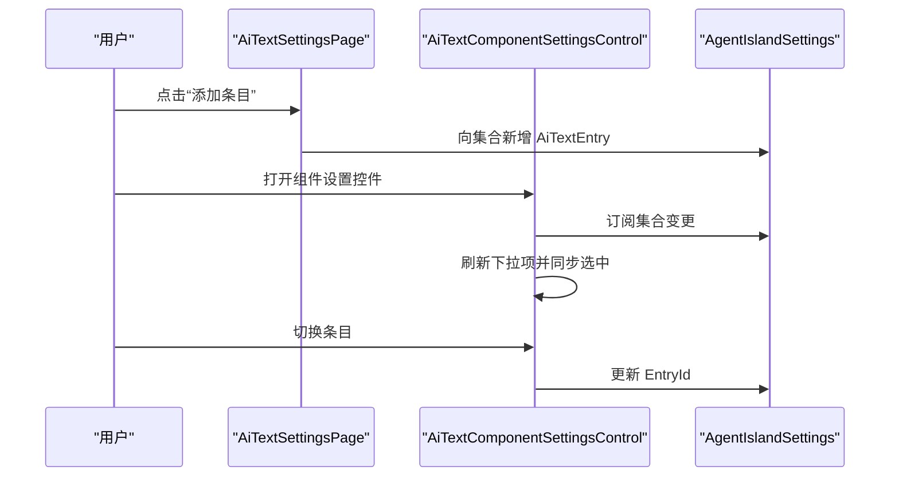
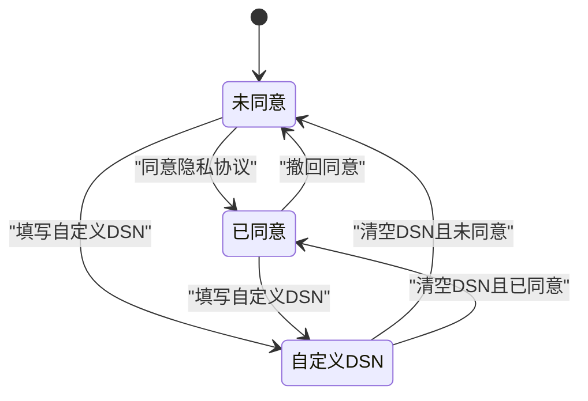
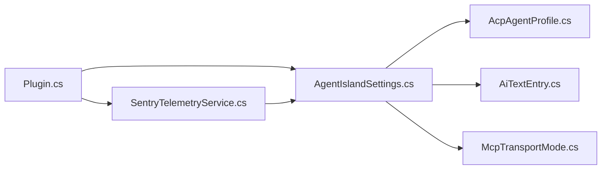

# 设置页面

<cite>
**本文引用的文件**   
- [Plugin.cs](file://Plugin.cs)
- [AgentIslandSettings.cs](file://Models/AgentIslandSettings.cs)
- [AcpAgentProfile.cs](file://Models/AcpAgentProfile.cs)
- [AiTextEntry.cs](file://Models/AiTextEntry.cs)
- [McpTransportMode.cs](file://Models/McpTransportMode.cs)
- [SentryTelemetryService.cs](file://Services/SentryTelemetryService.cs)
- [McpSettingsPage.axaml.cs](file://Views/SettingsPages/McpSettingsPage.axaml.cs)
- [McpSettingsPage.axaml](file://Views/SettingsPages/McpSettingsPage.axaml)
- [AcpSettingsPage.axaml.cs](file://Views/SettingsPages/AcpSettingsPage.axaml.cs)
- [AcpSettingsPage.axaml](file://Views/SettingsPages/AcpSettingsPage.axaml)
- [AiTextSettingsPage.axaml.cs](file://Views/SettingsPages/AiTextSettingsPage.axaml.cs)
- [AiTextSettingsPage.axaml](file://Views/SettingsPages/AiTextSettingsPage.axaml)
- [TelemetrySettingsPage.axaml.cs](file://Views/SettingsPages/TelemetrySettingsPage.axaml.cs)
- [TelemetrySettingsPage.axaml](file://Views/SettingsPages/TelemetrySettingsPage.axaml)
- [AiTextComponentSettingsControl.axaml.cs](file://Components/AiTextComponentSettingsControl.axaml.cs)
</cite>

## 目录
1. [简介](#简介)
2. [项目结构](#项目结构)
3. [核心组件](#核心组件)
4. [架构总览](#架构总览)
5. [详细组件分析](#详细组件分析)
6. [依赖分析](#依赖分析)
7. [性能考虑](#性能考虑)
8. [故障排查指南](#故障排查指南)
9. [结论](#结论)
10. [附录](#附录)

## 简介
本文件面向 ClassIsland 插件“设置页面系统”的架构与实现，聚焦以下目标：
- 说明设置页面的整体架构、生命周期管理与数据持久化机制
- 详解各设置页面功能：MCP 服务器配置、ACP 自动化设置、AI 文字组件配置、遥测监控设置
- 阐述 MVVM 模式在设置页面中的应用（ViewModel 与数据绑定）
- 提供新设置页面的开发指南与最佳实践
- 记录设置验证、错误处理与用户反馈机制
- 总结跨平台兼容性与主题适配方案

## 项目结构
设置页面系统由“视图层（XAML + Code-behind）+ 模型层（ObservableObject + ObservableCollection）+ 服务层（遥测服务）+ 插件入口（注册与持久化）”组成。

图表来源
- [Plugin.cs:29-53](file://Plugin.cs#L29-L53)
- [AgentIslandSettings.cs:13-32](file://Models/AgentIslandSettings.cs#L13-L32)
- [SentryTelemetryService.cs:21-25](file://Services/SentryTelemetryService.cs#L21-L25)

章节来源
- [Plugin.cs:29-53](file://Plugin.cs#L29-L53)

## 核心组件
- 设置中心模型：集中承载所有设置项，提供派生属性与集合变更通知，驱动 UI 联动与持久化。
- 设置页面：基于 ClassIsland 框架的 SettingsPageBase，通过 DataContext 绑定到全局设置实例。
- 遥测服务：根据隐私同意与 DSN 状态动态初始化/关闭 Sentry SDK，并提供埋点 API。
- 插件入口：负责加载/保存设置、注册设置页、启动 MCP 服务、注入遥测服务。

章节来源
- [AgentIslandSettings.cs:13-394](file://Models/AgentIslandSettings.cs#L13-L394)
- [SentryTelemetryService.cs:11-182](file://Services/SentryTelemetryService.cs#L11-L182)
- [Plugin.cs:29-53](file://Plugin.cs#L29-L53)

## 架构总览
设置页面采用 MVVM 模式：
- View：XAML 定义布局与交互控件
- ViewModel：使用全局设置对象作为 DataContext（可视为轻量 ViewModel）
- Model：ObservableObject 与 ObservableCollection 提供双向绑定与集合变化通知

图表来源
- [AgentIslandSettings.cs:13-394](file://Models/AgentIslandSettings.cs#L13-L394)
- [AcpAgentProfile.cs:9-44](file://Models/AcpAgentProfile.cs#L9-L44)
- [AiTextEntry.cs:5-31](file://Models/AiTextEntry.cs#L5-L31)
- [McpTransportMode.cs:6-17](file://Models/McpTransportMode.cs#L6-L17)
- [SentryTelemetryService.cs:11-182](file://Services/SentryTelemetryService.cs#L11-L182)

## 详细组件分析

### MCP 服务器配置页面
- 功能要点
  - 启用/禁用 MCP 服务器
  - 设置监听端口（范围校验由 NumericUpDown 控制）
  - 选择传输模式（当前仅支持 Streamable HTTP；SSE 选项置灰）
  - 显示连接地址并支持一键复制
  - 打开外部帮助文档
- 生命周期与数据流
  - 页面初始化时设置 DataContext 为全局设置
  - 监听关键属性变更（启用、端口、传输模式），触发重启提示
  - 连接地址为只读派生属性，随端口与模式自动更新
- 用户反馈
  - 复制成功通过 Flyout 提示
  - 重要变更需要重启时调用 RequestRestart 提示

图表来源
- [McpSettingsPage.axaml.cs:26-41](file://Views/SettingsPages/McpSettingsPage.axaml.cs#L26-L41)
- [McpSettingsPage.axaml.cs:43-54](file://Views/SettingsPages/McpSettingsPage.axaml.cs#L43-L54)
- [McpSettingsPage.axaml:25-49](file://Views/SettingsPages/McpSettingsPage.axaml#L25-L49)
- [McpSettingsPage.axaml:52-73](file://Views/SettingsPages/McpSettingsPage.axaml#L52-L73)
- [AgentIslandSettings.cs:204-211](file://Models/AgentIslandSettings.cs#L204-L211)

章节来源
- [McpSettingsPage.axaml.cs:1-66](file://Views/SettingsPages/McpSettingsPage.axaml.cs#L1-L66)
- [McpSettingsPage.axaml:1-89](file://Views/SettingsPages/McpSettingsPage.axaml#L1-L89)
- [AgentIslandSettings.cs:204-211](file://Models/AgentIslandSettings.cs#L204-L211)

### ACP 自动化设置页面
- 功能要点
  - 展示 ACP 功能暂不可用的提示
  - 管理 ACP Agent 列表：新增、移除、批量启用/禁用
  - 显示 Agent 摘要与空状态文案
- 数据绑定
  - 列表绑定至 AcpAgents 集合
  - 每个 Agent 项包含名称、命令、启用状态、状态文本
  - 聚合属性（总数、已启用数、摘要、空状态）由设置模型计算并通知

图表来源
- [AcpSettingsPage.axaml.cs:31-64](file://Views/SettingsPages/AcpSettingsPage.axaml.cs#L31-L64)
- [AgentIslandSettings.cs:214-238](file://Models/AgentIslandSettings.cs#L214-L238)

章节来源
- [AcpSettingsPage.axaml.cs:1-67](file://Views/SettingsPages/AcpSettingsPage.axaml.cs#L1-L67)
- [AcpSettingsPage.axaml:1-108](file://Views/SettingsPages/AcpSettingsPage.axaml#L1-L108)
- [AcpAgentProfile.cs:9-44](file://Models/AcpAgentProfile.cs#L9-L44)
- [AgentIslandSettings.cs:214-238](file://Models/AgentIslandSettings.cs#L214-L238)

### AI 文字组件配置页面
- 功能要点
  - 管理 AI 文字条目：添加、删除
  - 每条包含 ID、备注、当前文字（可由 AI 工具更新）
  - 组件侧设置控件用于将组件绑定到具体条目 ID
- 数据绑定
  - 列表绑定至 AiTextEntries 集合
  - 组件设置控件在加载时刷新下拉项并同步选中项

图表来源
- [AiTextSettingsPage.axaml.cs:22-34](file://Views/SettingsPages/AiTextSettingsPage.axaml.cs#L22-L34)
- [AiTextComponentSettingsControl.axaml.cs:16-51](file://Components/AiTextComponentSettingsControl.axaml.cs#L16-L51)
- [AiTextEntry.cs:5-31](file://Models/AiTextEntry.cs#L5-L31)

章节来源
- [AiTextSettingsPage.axaml.cs:1-36](file://Views/SettingsPages/AiTextSettingsPage.axaml.cs#L1-L36)
- [AiTextSettingsPage.axaml:1-81](file://Views/SettingsPages/AiTextSettingsPage.axaml#L1-L81)
- [AiTextComponentSettingsControl.axaml.cs:1-53](file://Components/AiTextComponentSettingsControl.axaml.cs#L1-L53)
- [AiTextEntry.cs:5-31](file://Models/AiTextEntry.cs#L5-L31)

### 遥测与隐私设置页面
- 功能要点
  - 启用/禁用遥测数据收集
  - 隐私协议同意/撤回（默认 DSN 场景）
  - 自定义 Sentry DSN（忽略隐私协议检查）
  - 测试 Sentry 连接（Debug 或自定义 DSN 时可见）
- 状态机与 UI 联动
  - 根据是否使用自定义 DSN 与是否同意协议，动态显示横幅、按钮状态与测试区域
  - 同意或使用自定义 DSN 后自动开启遥测

图表来源
- [TelemetrySettingsPage.axaml.cs:44-73](file://Views/SettingsPages/TelemetrySettingsPage.axaml.cs#L44-L73)
- [AgentIslandSettings.cs:176-200](file://Models/AgentIslandSettings.cs#L176-L200)

章节来源
- [TelemetrySettingsPage.axaml.cs:1-145](file://Views/SettingsPages/TelemetrySettingsPage.axaml.cs#L1-L145)
- [TelemetrySettingsPage.axaml:1-106](file://Views/SettingsPages/TelemetrySettingsPage.axaml#L1-L106)
- [SentryTelemetryService.cs:21-90](file://Services/SentryTelemetryService.cs#L21-L90)
- [AgentIslandSettings.cs:176-200](file://Models/AgentIslandSettings.cs#L176-L200)

## 依赖分析
- 插件入口负责：
  - 加载/保存设置（JSON 文件）
  - 注册设置页面与组件
  - 初始化遥测服务并评估应用
- 设置模型负责：
  - 暴露派生属性与集合变更通知
  - 维护 MCP 连接地址、遥测有效 DSN、Agent 统计等
- 遥测服务负责：
  - 监听设置变更，按需初始化/关闭 Sentry SDK
  - 提供异常捕获与埋点方法

图表来源
- [Plugin.cs:29-53](file://Plugin.cs#L29-L53)
- [AgentIslandSettings.cs:13-32](file://Models/AgentIslandSettings.cs#L13-L32)
- [SentryTelemetryService.cs:21-25](file://Services/SentryTelemetryService.cs#L21-L25)

章节来源
- [Plugin.cs:29-53](file://Plugin.cs#L29-L53)
- [AgentIslandSettings.cs:13-32](file://Models/AgentIslandSettings.cs#L13-L32)
- [SentryTelemetryService.cs:21-25](file://Services/SentryTelemetryService.cs#L21-L25)

## 性能考虑
- 设置变更频率高时，避免在 PropertyChanged 中执行重逻辑，尽量只做派生属性通知与必要 UI 提示
- 大集合操作（批量启用/禁用）已在页面层直接修改集合，注意保持 UI 响应性
- 遥测服务在 SDK 未初始化时快速返回，减少开销
- 连接地址等派生属性仅在相关字段变更时重新计算

[本节为通用指导，不直接分析具体文件]

## 故障排查指南
- 无法复制连接地址
  - 确认 TopLevel 与 Clipboard 可用
  - 参考路径：[McpSettingsPage.axaml.cs:43-54](file://Views/SettingsPages/McpSettingsPage.axaml.cs#L43-L54)
- 遥测未上报
  - 检查是否同意隐私协议或未填写自定义 DSN
  - 查看 IsTelemetryActive 与 EffectiveSentryDsn 的计算结果
  - 参考路径：
    - [AgentIslandSettings.cs:176-200](file://Models/AgentIslandSettings.cs#L176-L200)
    - [SentryTelemetryService.cs:30-40](file://Services/SentryTelemetryService.cs#L30-L40)
- MCP 服务未启动
  - 检查 IsEnabled、Port、TransportMode 是否正确
  - 参考插件启动流程与日志输出位置
  - 参考路径：[Plugin.cs:55-79](file://Plugin.cs#L55-L79)

章节来源
- [McpSettingsPage.axaml.cs:43-54](file://Views/SettingsPages/McpSettingsPage.axaml.cs#L43-L54)
- [AgentIslandSettings.cs:176-200](file://Models/AgentIslandSettings.cs#L176-L200)
- [SentryTelemetryService.cs:30-40](file://Services/SentryTelemetryService.cs#L30-L40)
- [Plugin.cs:55-79](file://Plugin.cs#L55-L79)

## 结论
设置页面系统以全局设置为中心，结合 MVVM 与集合变更通知，实现了简洁而可扩展的配置体验。遥测服务与隐私策略解耦清晰，支持运行时动态启停。各页面职责单一、交互明确，便于后续扩展与维护。

[本节为总结性内容，不直接分析具体文件]

## 附录

### MVVM 在设置页面中的应用
- View 层：XAML 通过 x:DataType 指定强类型绑定，控件属性与设置模型属性双向绑定
- ViewModel 层：使用全局设置对象作为 DataContext，提供派生属性与集合变更通知
- Model 层：继承 ObservableObject，使用 SetProperty 与 partial 方法简化属性变更通知

章节来源
- [McpSettingsPage.axaml:10](file://Views/SettingsPages/McpSettingsPage.axaml#L10)
- [AgentIslandSettings.cs:13-32](file://Models/AgentIslandSettings.cs#L13-L32)

### 设置页面生命周期管理
- 页面初始化：设置 DataContext，必要时订阅设置变更事件
- 页面卸载：取消订阅，释放资源（如遥测页面显式 Dispose）
- 插件生命周期：加载/保存设置、注册页面与服务、启动/停止 MCP 服务

章节来源
- [McpSettingsPage.axaml.cs:26-31](file://Views/SettingsPages/McpSettingsPage.axaml.cs#L26-L31)
- [TelemetrySettingsPage.axaml.cs:27-33](file://Views/SettingsPages/TelemetrySettingsPage.axaml.cs#L27-L33)
- [TelemetrySettingsPage.axaml.cs:140-144](file://Views/SettingsPages/TelemetrySettingsPage.axaml.cs#L140-L144)
- [Plugin.cs:29-53](file://Plugin.cs#L29-L53)

### 数据持久化机制
- 插件初始化时从 JSON 文件加载设置
- 设置对象订阅 PropertyChanged，任何变更立即写回 JSON 文件
- 文件路径位于插件配置目录下的 Settings.json

章节来源
- [Plugin.cs:31-34](file://Plugin.cs#L31-L34)

### 设置验证、错误处理与用户反馈
- 输入验证：NumericUpDown 限制端口范围；ComboBox 禁用不支持的模式
- 错误处理：遥测服务在 SDK 未初始化时快速返回；MCP 启动失败捕获异常并上报
- 用户反馈：Flyout 提示复制成功；ContentDialog 引导隐私协议同意/撤回；横幅提示当前遥测状态

章节来源
- [McpSettingsPage.axaml:29-35](file://Views/SettingsPages/McpSettingsPage.axaml#L29-L35)
- [McpSettingsPage.axaml:42-48](file://Views/SettingsPages/McpSettingsPage.axaml#L42-L48)
- [TelemetrySettingsPage.axaml.cs:75-124](file://Views/SettingsPages/TelemetrySettingsPage.axaml.cs#L75-L124)
- [Plugin.cs:67-78](file://Plugin.cs#L67-L78)

### 跨平台兼容性与主题适配
- 跨平台：基于 AvaloniaUI 与 FluentAvalonia，支持多平台 UI 渲染
- 主题适配：使用 DynamicResource 与 Fluent 样式，确保在不同主题下保持一致外观
- 剪贴板与外部链接：通过 TopLevel.Clipboard 与 Process.Start 访问系统能力

章节来源
- [McpSettingsPage.axaml.cs:47-51](file://Views/SettingsPages/McpSettingsPage.axaml.cs#L47-L51)
- [TelemetrySettingsPage.axaml.cs:131-138](file://Views/SettingsPages/TelemetrySettingsPage.axaml.cs#L131-L138)
- [TelemetrySettingsPage.axaml:31-38](file://Views/SettingsPages/TelemetrySettingsPage.axaml#L31-L38)

### 新设置页面开发指南与最佳实践
- 步骤
  - 新建 XAML 与 Code-behind，继承自 SettingsPageBase
  - 使用 [SettingsPageInfo] 特性标注 id、name、category
  - 在 Initialize 中设置 DataContext 为全局设置，必要时订阅 PropertyChanged
  - 在插件入口注册：services.AddSettingsPage<YourPage>()
- 最佳实践
  - 使用派生属性表达只读信息（如连接地址、遥测状态）
  - 对集合操作提供明确的空状态与提示信息
  - 对用户敏感操作（同意/撤回）使用 ContentDialog 二次确认
  - 对可能影响运行时的变更（端口、模式）提示重启
  - 避免在属性变更回调中执行耗时操作

章节来源
- [McpSettingsPage.axaml.cs:14-18](file://Views/SettingsPages/McpSettingsPage.axaml.cs#L14-L18)
- [Plugin.cs:45-48](file://Plugin.cs#L45-L48)
- [AgentIslandSettings.cs:204-211](file://Models/AgentIslandSettings.cs#L204-L211)
- [TelemetrySettingsPage.axaml.cs:75-124](file://Views/SettingsPages/TelemetrySettingsPage.axaml.cs#L75-L124)