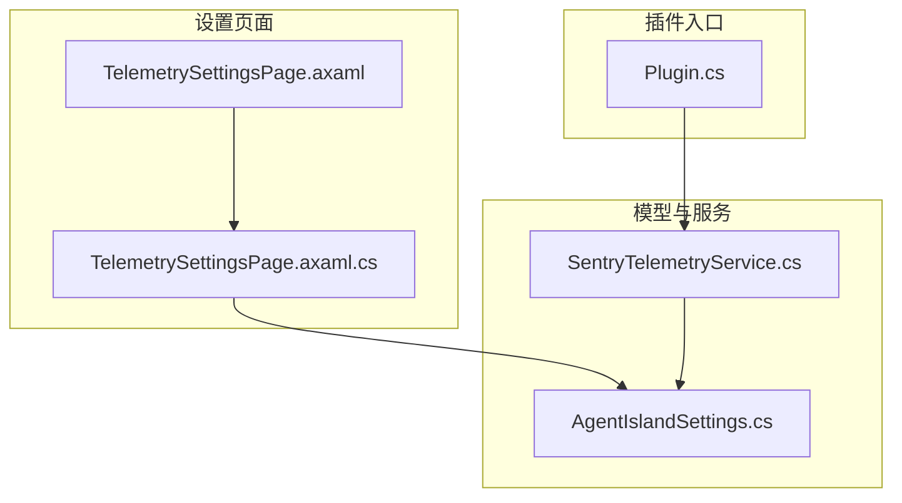
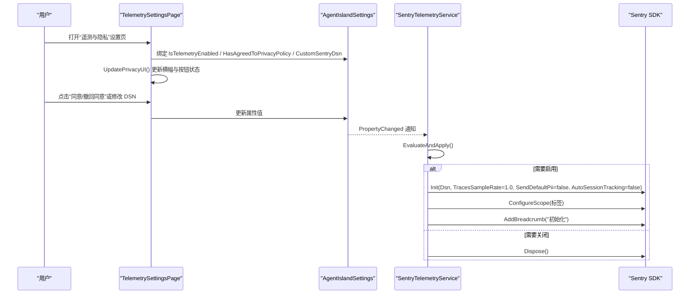
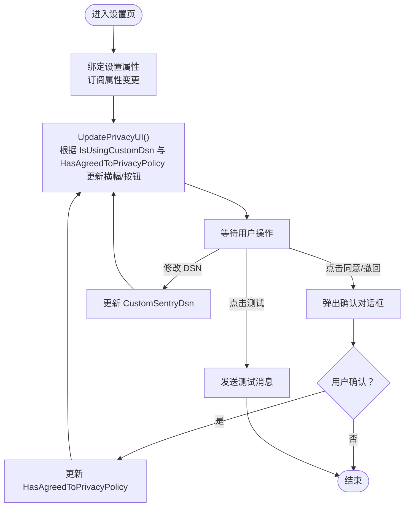
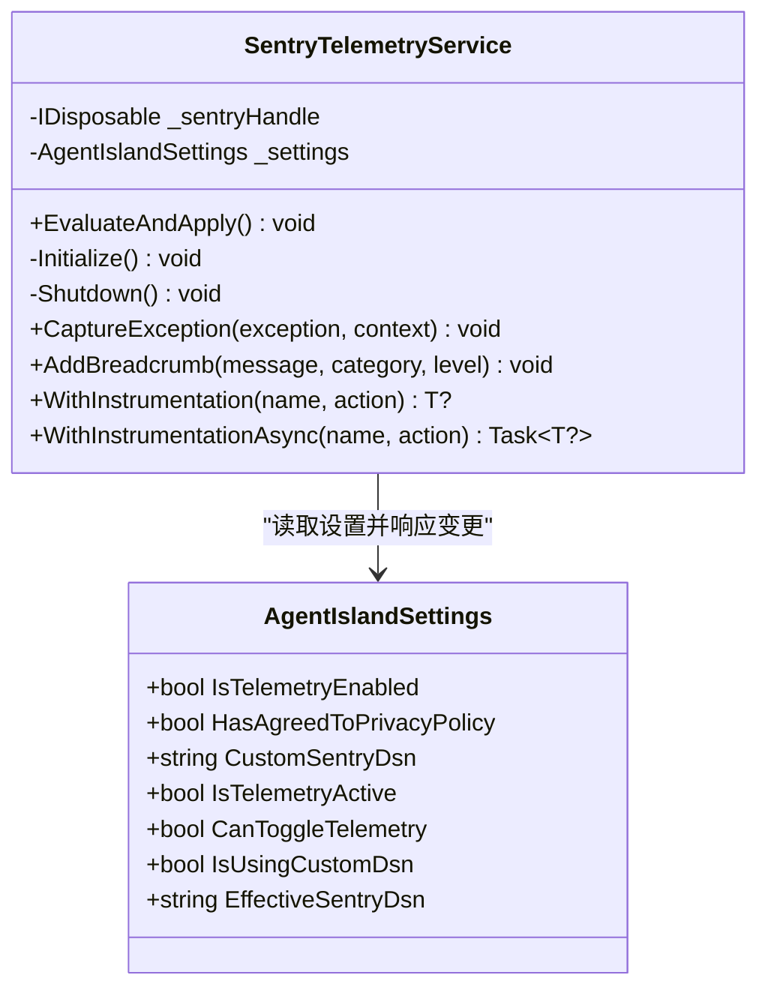
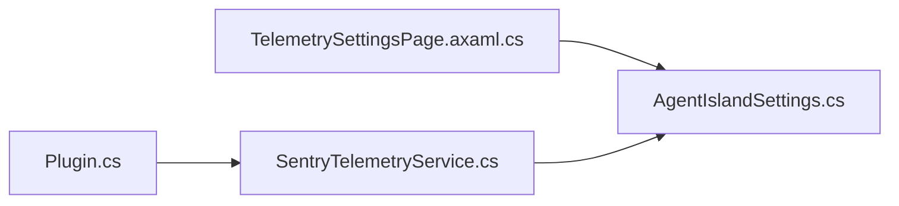

# 遥测设置页面

<cite>
**本文引用的文件**
- [TelemetrySettingsPage.axaml.cs](file://Views/SettingsPages/TelemetrySettingsPage.axaml.cs)
- [TelemetrySettingsPage.axaml](file://Views/SettingsPages/TelemetrySettingsPage.axaml)
- [SentryTelemetryService.cs](file://Services/SentryTelemetryService.cs)
- [AgentIslandSettings.cs](file://Models/AgentIslandSettings.cs)
- [Plugin.cs](file://Plugin.cs)
- [PRIVACY_POLICY.md](file://PRIVACY_POLICY.md)
- [CROSS_BORDER_DATA_TRANSFER.md](file://CROSS_BORDER_DATA_TRANSFER.md)
</cite>

## 目录
1. [简介](#简介)
2. [项目结构](#项目结构)
3. [核心组件](#核心组件)
4. [架构总览](#架构总览)
5. [详细组件分析](#详细组件分析)
6. [依赖关系分析](#依赖关系分析)
7. [性能考量](#性能考量)
8. [故障排查指南](#故障排查指南)
9. [结论](#结论)
10. [附录](#附录)

## 简介
本文件面向“遥测与隐私”设置页面的使用者与维护者，系统性说明 Sentry 错误追踪服务的配置界面、遥测数据收集策略、用户隐私保护机制、与 SentryTelemetryService 的集成方式、手动触发错误报告与调试模式支持、不同环境下的行为差异（开发/生产）、合规性考虑与数据导出能力，以及性能影响评估与监控指标说明。

## 项目结构
遥测相关代码主要分布在以下位置：
- 设置页面 UI 与交互逻辑：Views/SettingsPages/TelemetrySettingsPage.*
- 遥测服务封装：Services/SentryTelemetryService.cs
- 设置模型与派生属性：Models/AgentIslandSettings.cs
- 插件初始化与注册：Plugin.cs
- 隐私政策与跨境传输协议文档：PRIVACY_POLICY.md、CROSS_BORDER_DATA_TRANSFER.md

图表来源
- [TelemetrySettingsPage.axaml:1-106](file://Views/SettingsPages/TelemetrySettingsPage.axaml#L1-L106)
- [TelemetrySettingsPage.axaml.cs:1-145](file://Views/SettingsPages/TelemetrySettingsPage.axaml.cs#L1-L145)
- [AgentIslandSettings.cs:145-200](file://Models/AgentIslandSettings.cs#L145-L200)
- [SentryTelemetryService.cs:1-182](file://Services/SentryTelemetryService.cs#L1-L182)
- [Plugin.cs:37-53](file://Plugin.cs#L37-L53)

章节来源
- [TelemetrySettingsPage.axaml:1-106](file://Views/SettingsPages/TelemetrySettingsPage.axaml#L1-L106)
- [TelemetrySettingsPage.axaml.cs:1-145](file://Views/SettingsPages/TelemetrySettingsPage.axaml.cs#L1-L145)
- [AgentIslandSettings.cs:145-200](file://Models/AgentIslandSettings.cs#L145-L200)
- [SentryTelemetryService.cs:1-182](file://Services/SentryTelemetryService.cs#L1-L182)
- [Plugin.cs:37-53](file://Plugin.cs#L37-L53)

## 核心组件
- 设置页面（UI + 交互）
  - 提供“启用遥测数据收集”开关、“隐私政策与数据协议”同意/撤回按钮、“自定义 Sentry DSN”输入框、“测试 Sentry 连接”按钮（条件显示）。
  - 根据当前设置动态更新横幅提示与按钮状态。
- 遥测服务（SentryTelemetryService）
  - 管理 Sentry SDK 生命周期，依据设置实时初始化或关闭。
  - 提供异常捕获、面包屑记录、同步/异步操作自动埋点包装方法。
- 设置模型（AgentIslandSettings）
  - 暴露遥测开关、隐私同意状态、自定义 DSN 等字段。
  - 计算派生属性：是否处于活动状态、是否可切换、是否使用自定义 DSN、实际使用的 DSN。
- 插件初始化（Plugin）
  - 在应用启动时注入并初始化遥测服务，记录生命周期事件。

章节来源
- [TelemetrySettingsPage.axaml.cs:27-42](file://Views/SettingsPages/TelemetrySettingsPage.axaml.cs#L27-L42)
- [TelemetrySettingsPage.axaml.cs:44-73](file://Views/SettingsPages/TelemetrySettingsPage.axaml.cs#L44-L73)
- [TelemetrySettingsPage.axaml.cs:75-124](file://Views/SettingsPages/TelemetrySettingsPage.axaml.cs#L75-L124)
- [TelemetrySettingsPage.axaml.cs:126-138](file://Views/SettingsPages/TelemetrySettingsPage.axaml.cs#L126-L138)
- [SentryTelemetryService.cs:27-40](file://Services/SentryTelemetryService.cs#L27-L40)
- [SentryTelemetryService.cs:42-69](file://Services/SentryTelemetryService.cs#L42-L69)
- [SentryTelemetryService.cs:92-174](file://Services/SentryTelemetryService.cs#L92-L174)
- [AgentIslandSettings.cs:145-200](file://Models/AgentIslandSettings.cs#L145-L200)
- [Plugin.cs:37-53](file://Plugin.cs#L37-L53)

## 架构总览
下图展示了设置页面、设置模型与遥测服务之间的交互关系，以及 Sentry SDK 的初始化流程。

图表来源
- [TelemetrySettingsPage.axaml.cs:27-42](file://Views/SettingsPages/TelemetrySettingsPage.axaml.cs#L27-L42)
- [TelemetrySettingsPage.axaml.cs:44-73](file://Views/SettingsPages/TelemetrySettingsPage.axaml.cs#L44-L73)
- [SentryTelemetryService.cs:27-40](file://Services/SentryTelemetryService.cs#L27-L40)
- [SentryTelemetryService.cs:42-69](file://Services/SentryTelemetryService.cs#L42-L69)
- [AgentIslandSettings.cs:145-200](file://Models/AgentIslandSettings.cs#L145-L200)

## 详细组件分析

### 设置页面（UI 与交互）
- 功能要点
  - 启用/禁用遥测开关：绑定到 IsTelemetryEnabled。
  - 隐私协议同意/撤回：通过 ContentDialog 二次确认，更新 HasAgreedToPrivacyPolicy。
  - 自定义 DSN：文本框绑定 CustomSentryDsn；留空则使用默认 DSN。
  - 测试 Sentry 连接：仅在 Debug 构建或使用自定义 DSN时可见，调用 SentrySdk.CaptureMessage 发送一条测试消息。
  - 横幅提示：根据是否使用自定义 DSN 和同意状态动态显示。
- 关键实现路径
  - 初始化与属性监听：[OnInitialized:27-33](file://Views/SettingsPages/TelemetrySettingsPage.axaml.cs#L27-L33)、[OnSettingsPropertyChanged:35-42](file://Views/SettingsPages/TelemetrySettingsPage.axaml.cs#L35-L42)
  - 隐私 UI 更新：[UpdatePrivacyUI:44-73](file://Views/SettingsPages/TelemetrySettingsPage.axaml.cs#L44-L73)
  - 同意/撤回流程：[OnPrivacyActionClick:75-124](file://Views/SettingsPages/TelemetrySettingsPage.axaml.cs#L75-L124)
  - 测试消息发送：[OnTestSentryClick:126-129](file://Views/SettingsPages/TelemetrySettingsPage.axaml.cs#L126-L129)
  - XAML 布局与控件绑定：[TelemetrySettingsPage.axaml:1-106](file://Views/SettingsPages/TelemetrySettingsPage.axaml#L1-L106)

图表来源
- [TelemetrySettingsPage.axaml.cs:27-42](file://Views/SettingsPages/TelemetrySettingsPage.axaml.cs#L27-L42)
- [TelemetrySettingsPage.axaml.cs:44-73](file://Views/SettingsPages/TelemetrySettingsPage.axaml.cs#L44-L73)
- [TelemetrySettingsPage.axaml.cs:75-124](file://Views/SettingsPages/TelemetrySettingsPage.axaml.cs#L75-L124)
- [TelemetrySettingsPage.axaml.cs:126-129](file://Views/SettingsPages/TelemetrySettingsPage.axaml.cs#L126-L129)
- [TelemetrySettingsPage.axaml:1-106](file://Views/SettingsPages/TelemetrySettingsPage.axaml#L1-L106)

章节来源
- [TelemetrySettingsPage.axaml.cs:27-138](file://Views/SettingsPages/TelemetrySettingsPage.axaml.cs#L27-L138)
- [TelemetrySettingsPage.axaml:1-106](file://Views/SettingsPages/TelemetrySettingsPage.axaml#L1-L106)

### 遥测服务（SentryTelemetryService）
- 职责
  - 根据设置决定是否初始化或关闭 Sentry SDK。
  - 统一封装异常上报、面包屑记录、同步/异步操作自动埋点。
- 关键配置
  - DSN：优先使用 EffectiveSentryDsn（自定义优先，否则默认）。
  - 性能与隐私：TracesSampleRate=1.0，SendDefaultPii=false，AutoSessionTracking=false。
  - 标签：为事件添加 plugin/classisland.plugin 标签。
- 生命周期
  - EvaluateAndApply：当 IsTelemetryActive 变化时，按需 Initialize/Shutdown。
  - OnSettingsPropertyChanged：监听 IsTelemetryEnabled、HasAgreedToPrivacyPolicy、CustomSentryDsn 的变化，必要时先 Shutdown 再 EvaluateAndApply。
- 埋点 API
  - CaptureException：带上下文上下文的异常上报。
  - AddBreadcrumb：记录面包屑事件。
  - WithInstrumentation/WithInstrumentationAsync：自动创建 Transaction、记录面包屑、捕获异常并标记成功/失败状态。

图表来源
- [AgentIslandSettings.cs:145-200](file://Models/AgentIslandSettings.cs#L145-L200)
- [SentryTelemetryService.cs:27-90](file://Services/SentryTelemetryService.cs#L27-L90)
- [SentryTelemetryService.cs:92-174](file://Services/SentryTelemetryService.cs#L92-L174)

章节来源
- [SentryTelemetryService.cs:27-90](file://Services/SentryTelemetryService.cs#L27-L90)
- [SentryTelemetryService.cs:92-174](file://Services/SentryTelemetryService.cs#L92-L174)
- [AgentIslandSettings.cs:145-200](file://Models/AgentIslandSettings.cs#L145-L200)

### 设置模型（AgentIslandSettings）
- 遥测控制逻辑
  - IsTelemetryActive：已启用且（已同意隐私政策 或 使用了自定义 DSN）。
  - CanToggleTelemetry：只有在同意隐私政策或使用自定义 DSN 时才可开启遥测。
  - IsUsingCustomDsn：是否填写了自定义 DSN。
  - EffectiveSentryDsn：若未填写自定义 DSN，则回退到 SentryTelemetryService.DefaultDsn。
- 联动行为
  - 当 CanToggleTelemetry 变为 true 且尚未启用遥测时，自动将 IsTelemetryEnabled 置为 true。
  - 当 CustomSentryDsn 变化时，重新计算 EffectiveSentryDsn 与 IsUsingCustomDsn。

章节来源
- [AgentIslandSettings.cs:145-200](file://Models/AgentIslandSettings.cs#L145-L200)
- [AgentIslandSettings.cs:240-273](file://Models/AgentIslandSettings.cs#L240-L273)

### 插件初始化与集成（Plugin）
- 在插件启动阶段：
  - 调用 _telemetry.EvaluateAndApply() 以根据当前设置初始化或关闭 Sentry SDK。
  - 记录“插件初始化完成”的面包屑事件。
  - 将 Settings 与 TelemetryService 注册为单例，供其他模块使用。
  - 注册设置页面，包括“遥测与隐私”。

章节来源
- [Plugin.cs:37-53](file://Plugin.cs#L37-L53)

## 依赖关系分析
- 设置页面依赖设置模型（DataContext 绑定），并通过属性变更驱动 UI 更新。
- 遥测服务依赖设置模型，监听其属性变更，动态管理 Sentry SDK 生命周期。
- 插件入口负责实例化并注册遥测服务，确保在应用生命周期内可用。

图表来源
- [TelemetrySettingsPage.axaml.cs:27-42](file://Views/SettingsPages/TelemetrySettingsPage.axaml.cs#L27-L42)
- [SentryTelemetryService.cs:77-90](file://Services/SentryTelemetryService.cs#L77-L90)
- [Plugin.cs:37-53](file://Plugin.cs#L37-L53)

章节来源
- [TelemetrySettingsPage.axaml.cs:27-42](file://Views/SettingsPages/TelemetrySettingsPage.axaml.cs#L27-L42)
- [SentryTelemetryService.cs:77-90](file://Services/SentryTelemetryService.cs#L77-L90)
- [Plugin.cs:37-53](file://Plugin.cs#L37-L53)

## 性能考量
- 采样率与开销
  - 当前 TracesSampleRate 设置为 1.0，表示所有事务均被采样上报。这有利于问题复现，但会增加网络与存储开销。
  - 在生产环境中建议根据流量与成本评估降低采样率，以减少对主线程与网络的影响。
- PII 过滤
  - SendDefaultPii=false，避免上传 IP、主机名等个人身份信息，有助于降低隐私风险与合规压力。
- 会话跟踪
  - AutoSessionTracking=false，减少不必要的会话级开销。
- 日志级别
  - options.Debug=false，避免在运行时输出大量调试信息。
- 建议
  - 针对高频工具调用路径，结合 WithInstrumentation/WithInstrumentationAsync 进行轻量埋点，避免重复采集。
  - 在高负载场景下，可考虑按环境或用户群体差异化采样策略。

章节来源
- [SentryTelemetryService.cs:49-61](file://Services/SentryTelemetryService.cs#L49-L61)

## 故障排查指南
- 无法上报或无数据
  - 检查 IsTelemetryEnabled 是否为 true。
  - 检查 HasAgreedToPrivacyPolicy 是否为 true，或是否填写了有效的自定义 DSN。
  - 确认 EffectiveSentryDsn 非空且格式正确。
- 测试连接
  - 在 Debug 构建或使用自定义 DSN 时，“测试 Sentry 连接”可见，点击后发送一条测试消息用于验证链路。
- 查看隐私状态
  - 页面横幅会明确提示当前使用的是默认 DSN 还是自定义 DSN，以及隐私协议的状态。
- 常见问题定位
  - 使用 WithInstrumentation/WithInstrumentationAsync 包裹可疑操作，观察 Transaction 与面包屑。
  - 通过 CaptureException 上报异常并附加 context 以便快速定位。

章节来源
- [TelemetrySettingsPage.axaml.cs:54-58](file://Views/SettingsPages/TelemetrySettingsPage.axaml.cs#L54-L58)
- [TelemetrySettingsPage.axaml.cs:126-129](file://Views/SettingsPages/TelemetrySettingsPage.axaml.cs#L126-L129)
- [SentryTelemetryService.cs:92-174](file://Services/SentryTelemetryService.cs#L92-L174)

## 结论
遥测设置页面提供了直观的配置入口，结合设置模型的派生属性与遥测服务的生命周期管理，实现了灵活的遥测开关、隐私同意控制与自定义 DSN 支持。通过合理的采样与 PII 过滤策略，在保证问题诊断能力的同时兼顾了性能与隐私合规。建议在正式生产环境中进一步细化采样策略与监控指标，以满足稳定性与成本的双重目标。

## 附录

### 遥测数据收集策略与隐私保护
- 收集的数据类型
  - 未处理异常与崩溃信息
  - MCP 工具调用的性能指标（延迟、成功率）
  - 插件生命周期事件（面包屑）
  - 插件元数据（如 plugin 标签）
- 不收集的数据
  - 个人课程信息、课表内容
  - 个人身份信息（IP、主机名等）
  - 用户输入内容与敏感凭证
- 数据来源与用途
  - 仅用于错误诊断、性能优化、稳定性监控与功能改进。
- 数据处理方
  - Sentry（Functional Software, Inc.），遵循其隐私与安全策略。
- 跨境数据传输
  - 默认 DSN 指向美国服务器，采用 HTTPS/TLS 加密传输；用户需单独同意后方可传输。
- 用户控制
  - 可随时同意或撤回同意；撤回后立即停止新数据收集。
  - 使用自定义 DSN 时跳过隐私协议同意检查，数据直接发送至自有项目。

章节来源
- [PRIVACY_POLICY.md:16-35](file://PRIVACY_POLICY.md#L16-L35)
- [PRIVACY_POLICY.md:39-57](file://PRIVACY_POLICY.md#L39-L57)
- [PRIVACY_POLICY.md:69-102](file://PRIVACY_POLICY.md#L69-L102)
- [CROSS_BORDER_DATA_TRANSFER.md:16-55](file://CROSS_BORDER_DATA_TRANSFER.md#L16-L55)
- [CROSS_BORDER_DATA_TRANSFER.md:58-93](file://CROSS_BORDER_DATA_TRANSFER.md#L58-L93)

### 与 SentryTelemetryService 的集成与配置同步
- 集成方式
  - 插件启动时调用 EvaluateAndApply()，根据 IsTelemetryActive 决定初始化或关闭 SDK。
  - 遥测服务监听设置属性变更，动态调整 SDK 状态。
- 配置项映射
  - IsTelemetryEnabled：遥测总开关
  - HasAgreedToPrivacyPolicy：隐私同意标志
  - CustomSentryDsn：自定义 DSN（留空则使用默认）
  - EffectiveSentryDsn：最终生效的 DSN
- 同步时机
  - 设置页面属性变更 → 遥测服务收到 PropertyChanged → EvaluateAndApply → Initialize/Shutdown

章节来源
- [Plugin.cs:37-53](file://Plugin.cs#L37-L53)
- [SentryTelemetryService.cs:27-40](file://Services/SentryTelemetryService.cs#L27-L40)
- [SentryTelemetryService.cs:77-90](file://Services/SentryTelemetryService.cs#L77-L90)
- [AgentIslandSettings.cs:145-200](file://Models/AgentIslandSettings.cs#L145-L200)

### 错误报告的手动触发与调试模式
- 手动触发
  - 设置页面提供“测试 Sentry 连接”，点击后发送一条测试消息，便于验证配置是否正确。
- 调试模式
  - Debug 构建下，“测试 Sentry 连接”始终可见；Release 构建下仅在使用自定义 DSN 时可见。
  - 可通过 WithInstrumentation/WithInstrumentationAsync 包裹关键路径，自动记录事务与异常。

章节来源
- [TelemetrySettingsPage.axaml.cs:54-58](file://Views/SettingsPages/TelemetrySettingsPage.axaml.cs#L54-L58)
- [TelemetrySettingsPage.axaml.cs:126-129](file://Views/SettingsPages/TelemetrySettingsPage.axaml.cs#L126-L129)
- [SentryTelemetryService.cs:127-174](file://Services/SentryTelemetryService.cs#L127-L174)

### 不同环境下的遥测行为差异（开发/生产）
- 开发环境（DEBUG）
  - “测试 Sentry 连接”始终可见，便于快速验证。
  - 可配合更详细的本地日志与调试手段定位问题。
- 生产环境（Release）
  - “测试 Sentry 连接”仅在使用自定义 DSN 时可见，避免误触。
  - 建议降低采样率与限制非必要上报，平衡诊断能力与性能。

章节来源
- [TelemetrySettingsPage.axaml.cs:54-58](file://Views/SettingsPages/TelemetrySettingsPage.axaml.cs#L54-L58)

### 合规性考虑与数据导出
- 合规要点
  - 取得用户的单独同意后方可进行跨境数据传输。
  - 用户享有知情权、同意权、撤回权、访问权与删除权。
- 数据保留
  - Sentry 默认保留事件数据 90 天（可由项目管理员调整）。
- 数据导出
  - 如需导出历史遥测数据，请联系开发者或通过 Sentry 项目管理后台进行操作。

章节来源
- [CROSS_BORDER_DATA_TRANSFER.md:58-106](file://CROSS_BORDER_DATA_TRANSFER.md#L58-L106)
- [PRIVACY_POLICY.md:105-112](file://PRIVACY_POLICY.md#L105-L112)

### 监控指标说明
- 异常类指标
  - 未处理异常数量、崩溃率、错误分类与堆栈摘要。
- 性能类指标
  - MCP 工具调用耗时、成功率、事务状态（Ok/InternalError）。
- 生命周期指标
  - 插件启动、停止、Sentry 初始化等面包屑事件。
- 标签维度
  - plugin/classisland.plugin 标签用于区分插件来源。

章节来源
- [SentryTelemetryService.cs:56-68](file://Services/SentryTelemetryService.cs#L56-L68)
- [SentryTelemetryService.cs:127-174](file://Services/SentryTelemetryService.cs#L127-L174)