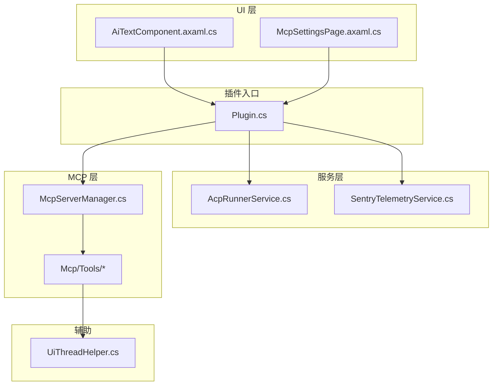
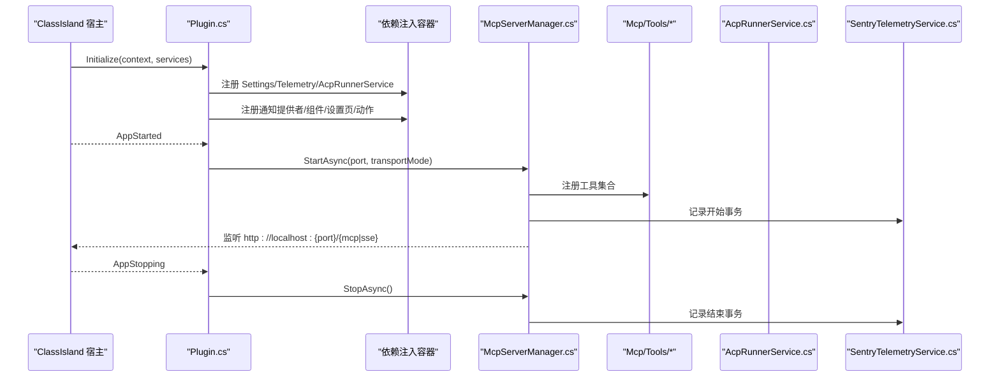
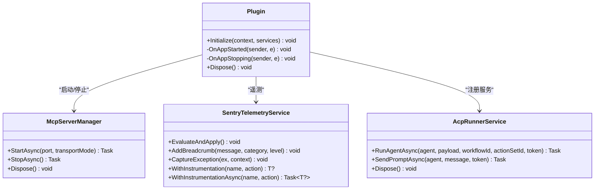
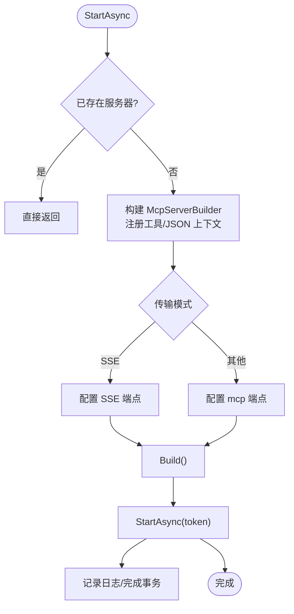
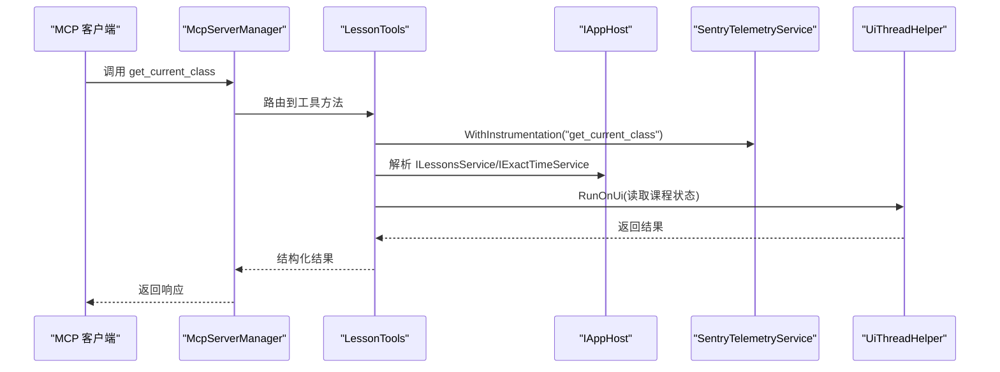
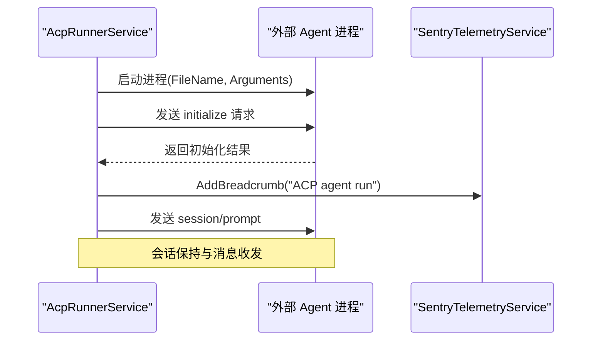
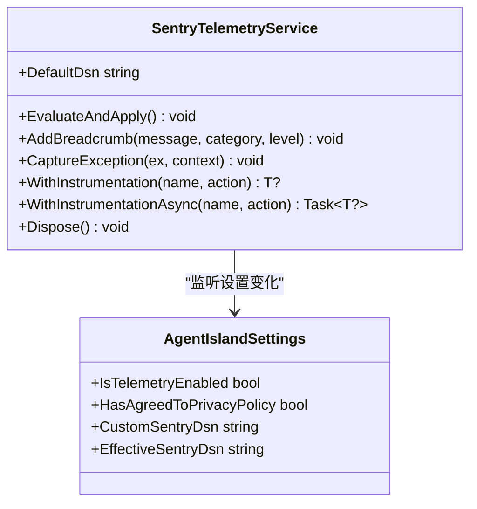
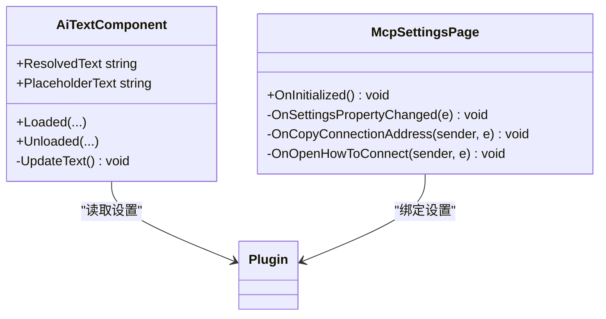
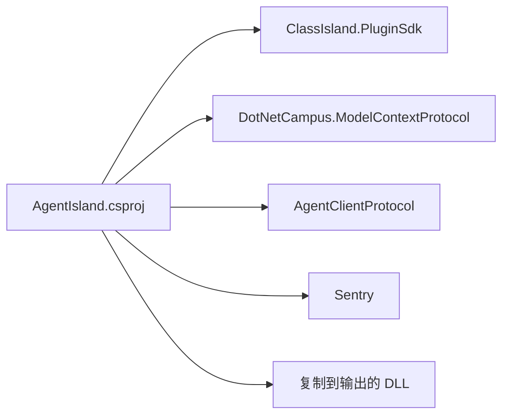
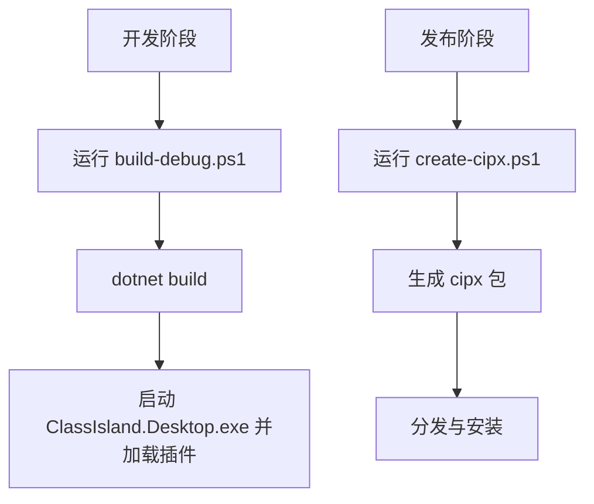

# 开发指南

<cite>
**本文引用的文件**   
- [Plugin.cs](file://Plugin.cs)
- [AgentIsland.csproj](file://AgentIsland.csproj)
- [manifest.yml](file://manifest.yml)
- [McpServerManager.cs](file://Mcp/McpServerManager.cs)
- [LessonTools.cs](file://Mcp/Tools/LessonTools.cs)
- [AcpRunnerService.cs](file://Services/AcpRunnerService.cs)
- [SentryTelemetryService.cs](file://Services/SentryTelemetryService.cs)
- [AiTextComponent.axaml.cs](file://Components/AiTextComponent.axaml.cs)
- [McpSettingsPage.axaml.cs](file://Views/SettingsPages/McpSettingsPage.axaml.cs)
- [UiThreadHelper.cs](file://Helpers/UiThreadHelper.cs)
- [build-debug.ps1](file://build-debug.ps1)
- [create-cipx.ps1](file://create-cipx.ps1)
</cite>

## 目录
1. [简介](#简介)
2. [项目结构](#项目结构)
3. [核心组件](#核心组件)
4. [架构总览](#架构总览)
5. [详细组件分析](#详细组件分析)
6. [依赖关系分析](#依赖关系分析)
7. [性能与可观测性](#性能与可观测性)
8. [构建、打包与发布](#构建打包与发布)
9. [自定义 MCP 工具开发教程](#自定义-mcp-工具开发教程)
10. [新 UI 组件创建步骤](#新-ui-组件创建步骤)
11. [第三方集成示例](#第三方集成示例)
12. [插件扩展点与服务注册模式](#插件扩展点与服务注册模式)
13. [代码规范与测试策略](#代码规范与测试策略)
14. [调试技巧与排障指南](#调试技巧与排障指南)
15. [结论](#结论)

## 简介
本指南面向 AgentIsland 插件开发者，覆盖从环境配置、依赖安装、项目构建到功能扩展的完整流程。重点包括：
- 如何基于 ClassIsland 插件 SDK 进行开发与调试
- 如何编写自定义 MCP 工具并接入本地 HTTP/SSE 服务
- 如何创建新的 UI 组件与设置页
- 如何通过依赖注入容器注册服务与扩展点
- 如何构建、打包为 cipx 并发布
- 遥测与错误上报的配置与最佳实践

## 项目结构
本项目采用分层与按职责组织的方式：
- 入口与生命周期：Plugin.cs
- 模型与配置：Models 目录（如 AgentIslandSettings）
- 服务层：Services 目录（ACP 运行器、遥测）
- MCP 服务器与工具：Mcp 目录（服务器管理器与工具集）
- UI 组件与设置页：Components 与 Views 目录
- 辅助工具：Helpers（UI 线程调度等）
- 构建脚本：PowerShell 脚本用于调试与打包

图表来源
- [Plugin.cs:1-114](file://Plugin.cs#L1-L114)
- [McpServerManager.cs:1-125](file://Mcp/McpServerManager.cs#L1-L125)
- [LessonTools.cs:1-146](file://Mcp/Tools/LessonTools.cs#L1-L146)
- [AcpRunnerService.cs:1-207](file://Services/AcpRunnerService.cs#L1-L207)
- [SentryTelemetryService.cs:1-182](file://Services/SentryTelemetryService.cs#L1-L182)
- [AiTextComponent.axaml.cs:1-85](file://Components/AiTextComponent.axaml.cs#L1-L85)
- [McpSettingsPage.axaml.cs:1-66](file://Views/SettingsPages/McpSettingsPage.axaml.cs#L1-L66)
- [UiThreadHelper.cs:1-25](file://Helpers/UiThreadHelper.cs#L1-L25)

章节来源
- [Plugin.cs:1-114](file://Plugin.cs#L1-L114)
- [AgentIsland.csproj:1-52](file://AgentIsland.csproj#L1-L52)
- [manifest.yml:1-13](file://manifest.yml#L1-L13)

## 核心组件
- 插件入口与生命周期管理：负责加载配置、注册服务、启动/停止 MCP 服务器、订阅宿主事件。
- MCP 服务器管理器：封装 McpServerBuilder，根据传输模式选择端点，注册工具集合，处理启停与异常上报。
- ACP 运行器：通过 stdio JSON-RPC 协议启动外部 Agent 进程，维护会话并发送提示。
- 遥测服务：动态初始化 Sentry SDK，提供统一埋点、事务与异常捕获能力。
- UI 组件与设置页：提供可视化配置与运行时展示，绑定设置项并响应变更。

章节来源
- [Plugin.cs:29-53](file://Plugin.cs#L29-L53)
- [McpServerManager.cs:25-82](file://Mcp/McpServerManager.cs#L25-L82)
- [AcpRunnerService.cs:25-77](file://Services/AcpRunnerService.cs#L25-L77)
- [SentryTelemetryService.cs:30-69](file://Services/SentryTelemetryService.cs#L30-L69)
- [AiTextComponent.axaml.cs:36-56](file://Components/AiTextComponent.axaml.cs#L36-L56)
- [McpSettingsPage.axaml.cs:26-41](file://Views/SettingsPages/McpSettingsPage.axaml.cs#L26-L41)

## 架构总览
下图展示了插件在宿主中的关键交互路径：插件入口在应用启动时初始化服务与扩展点；随后根据配置启动 MCP 服务器，暴露工具供外部调用；同时提供 ACP 运行器以驱动外部 Agent 进程；遥测服务贯穿各模块提供可观测性。

图表来源
- [Plugin.cs:55-79](file://Plugin.cs#L55-L79)
- [McpServerManager.cs:25-82](file://Mcp/McpServerManager.cs#L25-L82)
- [SentryTelemetryService.cs:127-174](file://Services/SentryTelemetryService.cs#L127-L174)

## 详细组件分析

### 插件入口与生命周期（Plugin.cs）
- 职责
  - 读取并持久化插件设置
  - 注册遥测、ACP 运行器、通知提供者、组件、设置页与动作
  - 订阅宿主启动/停止事件，按需启动/停止 MCP 服务器
- 关键点
  - 使用宿主提供的依赖注入容器进行服务注册
  - 根据传输模式输出不同端点地址
  - 对启动/停止过程进行异常捕获与遥测上报

图表来源
- [Plugin.cs:29-97](file://Plugin.cs#L29-L97)
- [McpServerManager.cs:25-112](file://Mcp/McpServerManager.cs#L25-L112)
- [SentryTelemetryService.cs:30-174](file://Services/SentryTelemetryService.cs#L30-L174)
- [AcpRunnerService.cs:25-191](file://Services/AcpRunnerService.cs#L25-L191)

章节来源
- [Plugin.cs:29-97](file://Plugin.cs#L29-L97)

### MCP 服务器管理器（McpServerManager.cs）
- 职责
  - 构建并启动 McpServer，注册工具集合
  - 根据传输模式选择端点（mcp/sse）
  - 管理取消令牌与生命周期
- 关键点
  - 使用 Json 序列化上下文
  - 对异常进行捕获与事务标记

图表来源
- [McpServerManager.cs:25-82](file://Mcp/McpServerManager.cs#L25-L82)

章节来源
- [McpServerManager.cs:25-112](file://Mcp/McpServerManager.cs#L25-L112)

### 课程相关 MCP 工具（LessonTools.cs）
- 职责
  - 暴露获取当前课表、下一节课、时间状态等工具
- 关键点
  - 通过 IAppHost 解析服务（课程服务、精确时间服务等）
  - 使用 UiThreadHelper 确保 UI 线程安全访问
  - 使用遥测服务包裹工具执行，自动记录事务与异常

图表来源
- [LessonTools.cs:14-45](file://Mcp/Tools/LessonTools.cs#L14-L45)
- [UiThreadHelper.cs:7-23](file://Helpers/UiThreadHelper.cs#L7-L23)
- [SentryTelemetryService.cs:127-148](file://Services/SentryTelemetryService.cs#L127-L148)

章节来源
- [LessonTools.cs:14-146](file://Mcp/Tools/LessonTools.cs#L14-L146)

### ACP 运行器（AcpRunnerService.cs）
- 职责
  - 通过标准输入输出与外部 Agent 进程通信（stdio JSON-RPC）
  - 维护会话状态，支持发送提示
- 关键点
  - 启动子进程并重定向 IO
  - 初始化会话后发送 session/prompt
  - 资源释放时优雅关闭或强制终止进程

图表来源
- [AcpRunnerService.cs:25-131](file://Services/AcpRunnerService.cs#L25-L131)
- [SentryTelemetryService.cs:114-122](file://Services/SentryTelemetryService.cs#L114-L122)

章节来源
- [AcpRunnerService.cs:25-191](file://Services/AcpRunnerService.cs#L25-L191)

### 遥测服务（SentryTelemetryService.cs）
- 职责
  - 根据用户隐私同意与开关动态初始化/关闭 Sentry SDK
  - 提供统一的埋点、事务与异常捕获 API
- 关键点
  - 监听设置变更，实时生效
  - 提供同步/异步包装方法，自动记录事务与异常

图表来源
- [SentryTelemetryService.cs:30-90](file://Services/SentryTelemetryService.cs#L30-L90)
- [SentryTelemetryService.cs:127-174](file://Services/SentryTelemetryService.cs#L127-L174)

章节来源
- [SentryTelemetryService.cs:30-174](file://Services/SentryTelemetryService.cs#L30-L174)

### UI 组件与设置页
- AiText 组件
  - 基于 Avalonia 的组件基类，绑定 AI 文字条目集合
  - 在加载/卸载时订阅/取消订阅集合与属性变更
  - 根据配置显示占位符或实际内容
- MCP 设置页
  - 绑定插件设置，监听端口/传输模式变更，提示重启
  - 提供复制连接地址与打开帮助文档的操作

图表来源
- [AiTextComponent.axaml.cs:36-83](file://Components/AiTextComponent.axaml.cs#L36-L83)
- [McpSettingsPage.axaml.cs:26-63](file://Views/SettingsPages/McpSettingsPage.axaml.cs#L26-L63)

章节来源
- [AiTextComponent.axaml.cs:36-83](file://Components/AiTextComponent.axaml.cs#L36-L83)
- [McpSettingsPage.axaml.cs:26-63](file://Views/SettingsPages/McpSettingsPage.axaml.cs#L26-L63)

## 依赖关系分析
- 项目目标框架与 SDK 版本
  - 目标框架：net8.0-windows
  - ClassIsland 插件 SDK 版本常量定义在项目文件中
- NuGet 包引用
  - ClassIsland.PluginSdk（排除运行时与原生依赖）
  - DotNetCampus.ModelContextProtocol（MCP 服务端）
  - AgentClientProtocol（ACP 协议）
  - Sentry（遥测）
- 输出产物拷贝
  - 将部分依赖 DLL 复制到输出目录以便宿主加载

图表来源
- [AgentIsland.csproj:1-52](file://AgentIsland.csproj#L1-L52)

章节来源
- [AgentIsland.csproj:1-52](file://AgentIsland.csproj#L1-L52)

## 性能与可观测性
- 性能建议
  - 避免在工具中执行长时间阻塞操作，必要时使用异步与取消令牌
  - 减少 UI 线程切换频率，批量更新数据
  - 合理设置 MCP 传输模式，SSE 适合流式推送，StreamableHttp 更现代
- 可观测性
  - 使用遥测服务的 WithInstrumentation 系列方法包裹关键逻辑
  - 添加面包屑记录关键事件，便于问题定位
  - 对异常进行捕获并附带上下文信息

[本节为通用指导，不直接分析具体文件]

## 构建、打包与发布
- 调试构建与运行
  - 使用调试脚本编译并启动宿主，自动加载插件输出目录
- 发布打包
  - 使用发布脚本生成 cipx 包，便于分发与安装
- 清单与元数据
  - manifest.yml 包含插件 ID、名称、入口程序集、版本、API 版本、作者与平台支持等信息

图表来源
- [build-debug.ps1:1-10](file://build-debug.ps1#L1-L10)
- [create-cipx.ps1:1-9](file://create-cipx.ps1#L1-L9)
- [manifest.yml:1-13](file://manifest.yml#L1-L13)

章节来源
- [build-debug.ps1:1-10](file://build-debug.ps1#L1-L10)
- [create-cipx.ps1:1-9](file://create-cipx.ps1#L1-L9)
- [manifest.yml:1-13](file://manifest.yml#L1-L13)

## 自定义 MCP 工具开发教程
- 基本步骤
  - 新建工具类，使用工具特性声明工具名、是否只读、是否结构化返回
  - 在工具方法中通过 IAppHost 解析所需服务
  - 如需访问 UI 线程，使用 UiThreadHelper 进行调度
  - 使用遥测服务包裹执行逻辑，自动记录事务与异常
  - 在 McpServerManager 中注册该工具
- 参考实现路径
  - 工具定义与调用链路：[LessonTools.cs:14-45](file://Mcp/Tools/LessonTools.cs#L14-L45)
  - UI 线程调度：[UiThreadHelper.cs:7-23](file://Helpers/UiThreadHelper.cs#L7-L23)
  - 工具注册位置：[McpServerManager.cs:42-50](file://Mcp/McpServerManager.cs#L42-L50)

章节来源
- [LessonTools.cs:14-45](file://Mcp/Tools/LessonTools.cs#L14-L45)
- [McpServerManager.cs:42-50](file://Mcp/McpServerManager.cs#L42-L50)
- [UiThreadHelper.cs:7-23](file://Helpers/UiThreadHelper.cs#L7-L23)

## 新 UI 组件创建步骤
- 步骤概览
  - 创建 Avalonia 组件类，继承自组件基类并传入设置类型
  - 使用组件特性标注 ID、名称、图标与描述
  - 在 Loaded/Unloaded 中订阅/取消订阅设置集合与属性变更
  - 在 UpdateText 等方法中根据配置渲染界面
  - 在插件入口注册组件与其设置控件
- 参考实现路径
  - 组件类与属性绑定：[AiTextComponent.axaml.cs:11-83](file://Components/AiTextComponent.axaml.cs#L11-L83)
  - 组件注册位置：[Plugin.cs:44](file://Plugin.cs#L44)

章节来源
- [AiTextComponent.axaml.cs:11-83](file://Components/AiTextComponent.axaml.cs#L11-L83)
- [Plugin.cs:44](file://Plugin.cs#L44)

## 第三方集成示例
- ACP 外部 Agent 集成
  - 通过 AcpRunnerService 启动外部进程并使用 JSON-RPC 协议通信
  - 支持发送 prompt 并维护会话状态
  - 参考实现路径：[AcpRunnerService.cs:25-131](file://Services/AcpRunnerService.cs#L25-L131)
- 遥测与错误上报
  - 使用 SentryTelemetryService 进行异常捕获与事务记录
  - 参考实现路径：[SentryTelemetryService.cs:95-174](file://Services/SentryTelemetryService.cs#L95-L174)

章节来源
- [AcpRunnerService.cs:25-131](file://Services/AcpRunnerService.cs#L25-L131)
- [SentryTelemetryService.cs:95-174](file://Services/SentryTelemetryService.cs#L95-L174)

## 插件扩展点与服务注册模式
- 扩展点
  - 通知提供者：通过服务扩展注册自定义通知提供者
  - 组件：注册 UI 组件及其设置控件
  - 设置页：注册设置页面
  - 动作：注册动作及其设置控件
- 服务注册模式
  - 使用宿主提供的 IServiceCollection 进行单例注册
  - 在 Initialize 中集中注册所有扩展点与服务
- 参考实现路径
  - 服务与扩展点注册：[Plugin.cs:40-49](file://Plugin.cs#L40-L49)

章节来源
- [Plugin.cs:40-49](file://Plugin.cs#L40-L49)

## 代码规范与测试策略
- 代码规范
  - 遵循 C# 空引用与隐式 using 启用
  - 使用 ObservableObject 与属性变更通知机制
  - 对 UI 线程访问进行显式调度
  - 使用结构化日志与遥测记录关键路径
- 测试策略
  - 单元测试：针对纯函数与无副作用逻辑进行断言
  - 集成测试：模拟 IAppHost 服务与 UI 线程调度
  - 端到端测试：验证 MCP 工具调用与 ACP 会话流程

[本节为通用指导，不直接分析具体文件]

## 调试技巧与排障指南
- 常见问题
  - MCP 服务器启动失败：检查端口占用与传输模式配置
  - ACP Agent 未初始化：确认命令配置正确且进程正常启动
  - UI 线程访问异常：确保通过 UiThreadHelper 调度
- 调试建议
  - 使用调试脚本快速编译并启动宿主
  - 查看遥测面包屑与事务，定位问题路径
  - 在关键路径添加日志与异常捕获
- 参考实现路径
  - 调试脚本：[build-debug.ps1:1-10](file://build-debug.ps1#L1-L10)
  - 遥测与异常捕获：[SentryTelemetryService.cs:95-174](file://Services/SentryTelemetryService.cs#L95-L174)
  - UI 线程调度：[UiThreadHelper.cs:7-23](file://Helpers/UiThreadHelper.cs#L7-L23)

章节来源
- [build-debug.ps1:1-10](file://build-debug.ps1#L1-L10)
- [SentryTelemetryService.cs:95-174](file://Services/SentryTelemetryService.cs#L95-L174)
- [UiThreadHelper.cs:7-23](file://Helpers/UiThreadHelper.cs#L7-L23)

## 结论
本指南系统梳理了 AgentIsland 插件的开发流程与关键扩展点，涵盖 MCP 工具、UI 组件、服务注册、遥测与构建发布等内容。按照本文档的步骤与最佳实践，开发者可以快速上手并持续迭代插件功能。