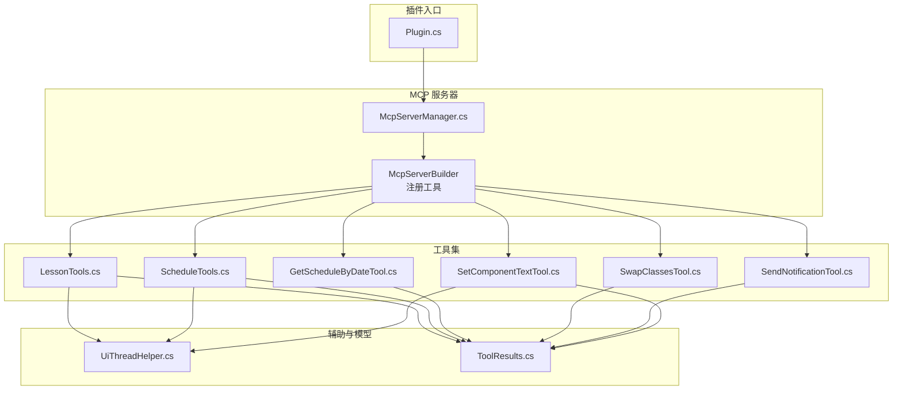
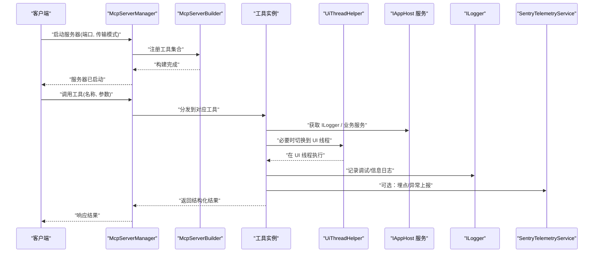
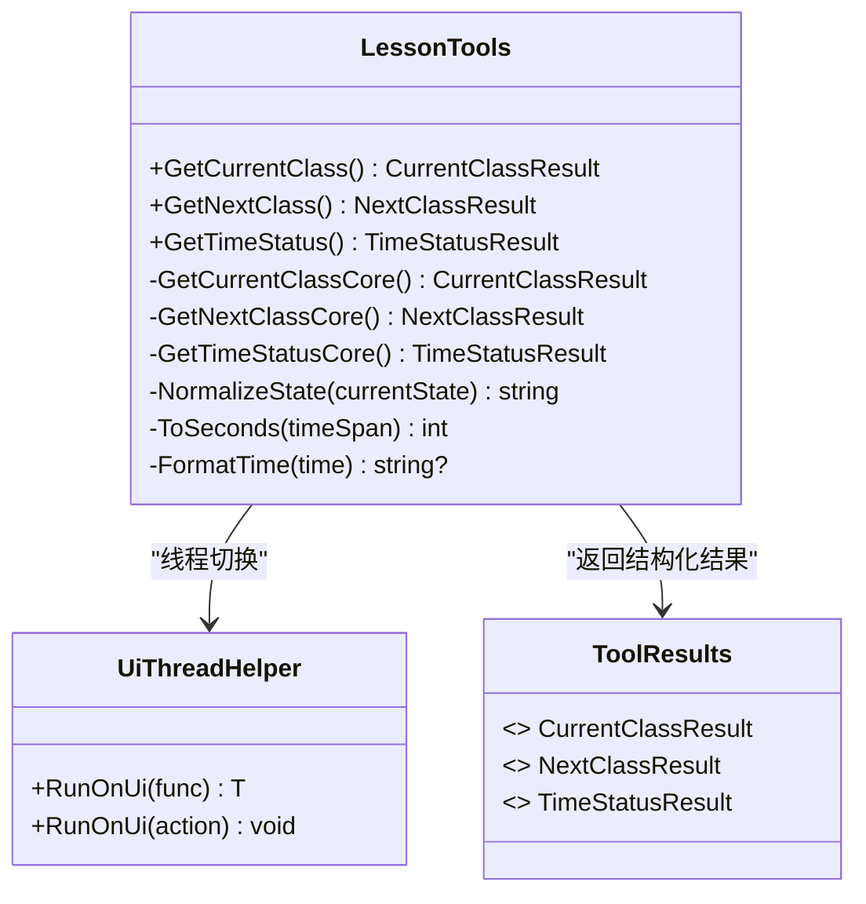
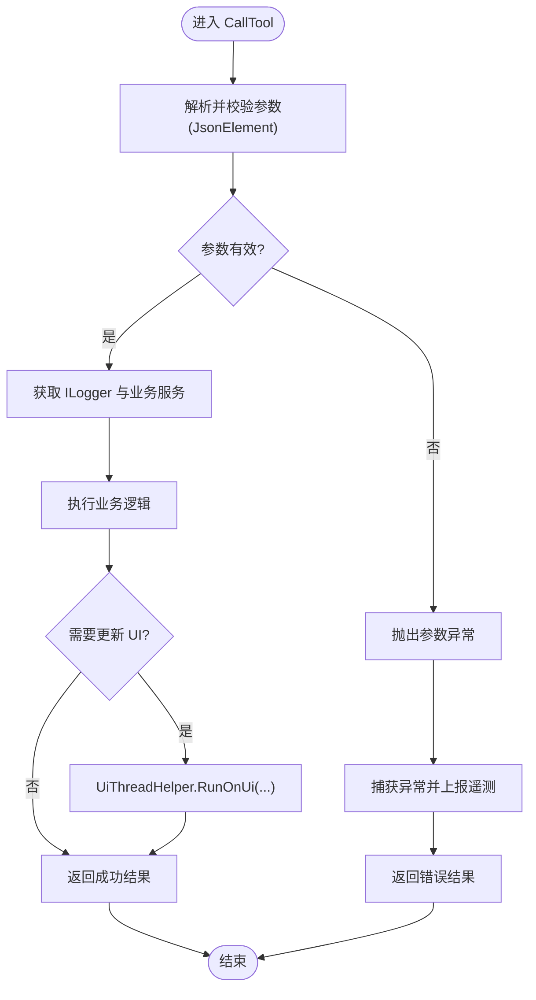
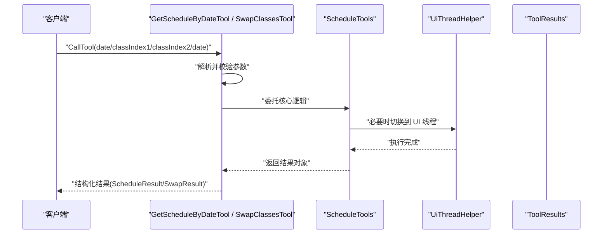
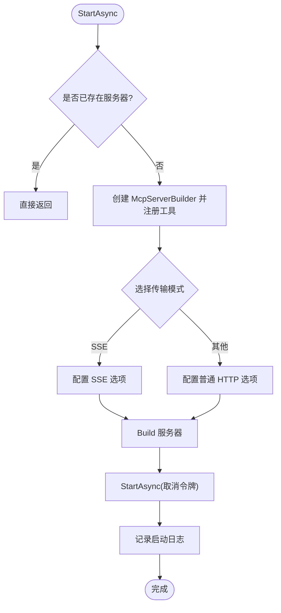
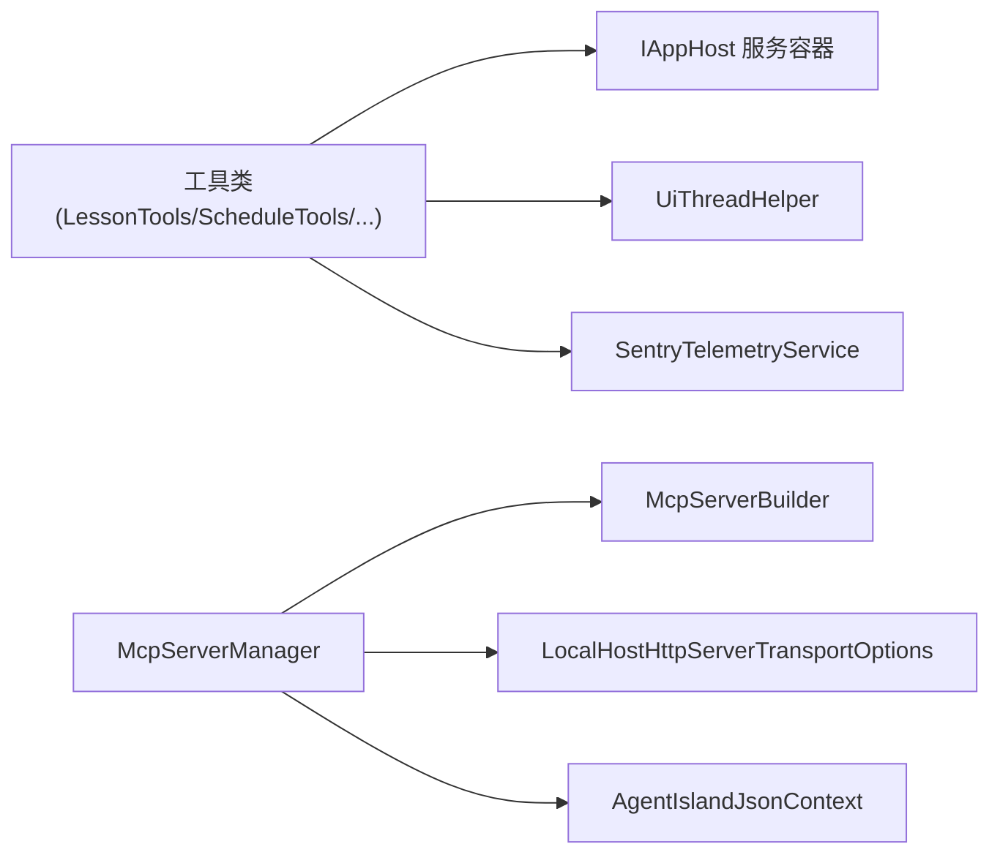

# MCP 工具基础开发

<cite>
**本文引用的文件**   
- [McpServerManager.cs](file://Mcp/McpServerManager.cs)
- [LessonTools.cs](file://Mcp/Tools/LessonTools.cs)
- [ScheduleTools.cs](file://Mcp/Tools/ScheduleTools.cs)
- [GetScheduleByDateTool.cs](file://Mcp/Tools/GetScheduleByDateTool.cs)
- [SwapClassesTool.cs](file://Mcp/Tools/SwapClassesTool.cs)
- [SendNotificationTool.cs](file://Mcp/Tools/SendNotificationTool.cs)
- [SetComponentTextTool.cs](file://Mcp/Tools/SetComponentTextTool.cs)
- [UiThreadHelper.cs](file://Helpers/UiThreadHelper.cs)
- [ToolResults.cs](file://Models/ToolResults.cs)
- [Plugin.cs](file://Plugin.cs)
</cite>

## 目录
1. [简介](#简介)
2. [项目结构](#项目结构)
3. [核心组件](#核心组件)
4. [架构总览](#架构总览)
5. [详细组件分析](#详细组件分析)
6. [依赖关系分析](#依赖关系分析)
7. [性能与可观测性](#性能与可观测性)
8. [故障排查指南](#故障排查指南)
9. [结论](#结论)
10. [附录：第一个简单工具的完整实现示例](#附录第一个简单工具的完整实现示例)

## 简介
本教程面向希望为 MCP（Model Context Protocol）服务开发新工具的开发者，基于现有代码库中的实践，系统讲解如何声明和实现 MCP 工具。内容涵盖：
- 使用特性声明工具（名称、描述、参数定义）
- 工具方法签名规范（同步/异步、参数验证、返回值处理）
- 依赖注入与服务获取模式（日志记录、遥测集成）
- UiThreadHelper 的线程安全使用
- 错误处理与性能监控的最佳实践
- 提供一个可直接复用的“第一个简单工具”的完整实现路径

## 项目结构
本项目采用按功能域组织的方式，MCP 工具集中在 Mcp/Tools 目录下，服务器管理在 Mcp/McpServerManager.cs，UI 线程辅助在 Helpers/UiThreadHelper.cs，统一的结果模型在 Models/ToolResults.cs。

图表来源
- [McpServerManager.cs:41-51](file://Mcp/McpServerManager.cs#L41-L51)
- [LessonTools.cs:14-145](file://Mcp/Tools/LessonTools.cs#L14-L145)
- [ScheduleTools.cs:15-203](file://Mcp/Tools/ScheduleTools.cs#L15-L203)
- [GetScheduleByDateTool.cs:18-91](file://Mcp/Tools/GetScheduleByDateTool.cs#L18-L91)
- [SwapClassesTool.cs:18-102](file://Mcp/Tools/SwapClassesTool.cs#L18-L102)
- [SendNotificationTool.cs:18-136](file://Mcp/Tools/SendNotificationTool.cs#L18-L136)
- [SetComponentTextTool.cs:19-91](file://Mcp/Tools/SetComponentTextTool.cs#L19-L91)
- [UiThreadHelper.cs:5-24](file://Helpers/UiThreadHelper.cs#L5-L24)
- [ToolResults.cs:3-59](file://Models/ToolResults.cs#L3-L59)

章节来源
- [McpServerManager.cs:1-125](file://Mcp/McpServerManager.cs#L1-L125)
- [Plugin.cs:19-39](file://Plugin.cs#L19-L39)

## 核心组件
- McpServerManager：负责构建并启动 MCP 服务器，集中注册所有工具，配置传输端点，并集成日志与遥测。
- 工具类：提供具体业务能力的 MCP 工具，分为两类：
  - 特性驱动型工具：通过特性声明工具元数据与方法映射，如 LessonTools、ScheduleTools。
  - 接口驱动型工具：实现 IMcpServerTool，手动定义输入 Schema 与调用逻辑，如 SendNotificationTool、SetComponentTextTool、GetScheduleByDateTool、SwapClassesTool。
- UiThreadHelper：封装 UI 线程调度，确保对 UI 相关服务的访问线程安全。
- ToolResults：统一的返回结果模型，便于结构化输出与序列化。

章节来源
- [McpServerManager.cs:25-82](file://Mcp/McpServerManager.cs#L25-L82)
- [LessonTools.cs:12-145](file://Mcp/Tools/LessonTools.cs#L12-L145)
- [ScheduleTools.cs:13-203](file://Mcp/Tools/ScheduleTools.cs#L13-L203)
- [SendNotificationTool.cs:16-136](file://Mcp/Tools/SendNotificationTool.cs#L16-L136)
- [SetComponentTextTool.cs:17-91](file://Mcp/Tools/SetComponentTextTool.cs#L17-L91)
- [GetScheduleByDateTool.cs:16-91](file://Mcp/Tools/GetScheduleByDateTool.cs#L16-L91)
- [SwapClassesTool.cs:16-102](file://Mcp/Tools/SwapClassesTool.cs#L16-L102)
- [UiThreadHelper.cs:5-24](file://Helpers/UiThreadHelper.cs#L5-L24)
- [ToolResults.cs:3-59](file://Models/ToolResults.cs#L3-L59)

## 架构总览
下图展示了从客户端到工具实现的典型调用流程，包括服务器构建、工具发现、参数解析、线程切换、服务获取、执行与返回。

图表来源
- [McpServerManager.cs:41-71](file://Mcp/McpServerManager.cs#L41-L71)
- [LessonTools.cs:14-45](file://Mcp/Tools/LessonTools.cs#L14-L45)
- [ScheduleTools.cs:23-39](file://Mcp/Tools/ScheduleTools.cs#L23-L39)
- [SendNotificationTool.cs:68-105](file://Mcp/Tools/SendNotificationTool.cs#L68-L105)
- [SetComponentTextTool.cs:41-72](file://Mcp/Tools/SetComponentTextTool.cs#L41-L72)
- [UiThreadHelper.cs:7-23](file://Helpers/UiThreadHelper.cs#L7-L23)

## 详细组件分析

### 特性驱动型工具（以 LessonTools 为例）
- 使用特性声明工具名、只读标记、结构化输出等元数据。
- 方法签名建议：
  - 返回类型：强类型的 record（如 CurrentClassResult），便于结构化输出与序列化。
  - 参数：尽量无参或仅使用简单值；复杂参数建议使用接口驱动型工具进行 JSON 校验。
  - 线程：若涉及 UI 线程资源，使用 UiThreadHelper.RunOnUi 包裹核心逻辑。
  - 日志：通过 IAppHost.GetService<ILogger<T>> 获取日志器。
  - 遥测：可选地通过 SentryTelemetryService.WithInstrumentation 包装核心方法，自动采集耗时与异常。

图表来源
- [LessonTools.cs:12-145](file://Mcp/Tools/LessonTools.cs#L12-L145)
- [UiThreadHelper.cs:5-24](file://Helpers/UiThreadHelper.cs#L5-L24)
- [ToolResults.cs:3-22](file://Models/ToolResults.cs#L3-L22)

章节来源
- [LessonTools.cs:14-145](file://Mcp/Tools/LessonTools.cs#L14-L145)

### 接口驱动型工具（以 SendNotificationTool 为例）
- 实现 IMcpServerTool，显式定义 ToolName、InputSchema、OutputSchema、Annotations。
- CallTool 中：
  - 解析 JsonElement 参数，严格校验必填字段与类型。
  - 获取日志器与业务服务，执行操作。
  - 捕获异常并通过遥测上报，返回结构化结果。
  - 如需更新 UI，使用 UiThreadHelper.RunOnUi。

图表来源
- [SendNotificationTool.cs:68-105](file://Mcp/Tools/SendNotificationTool.cs#L68-L105)
- [SendNotificationTool.cs:107-135](file://Mcp/Tools/SendNotificationTool.cs#L107-L135)
- [SetComponentTextTool.cs:41-72](file://Mcp/Tools/SetComponentTextTool.cs#L41-L72)
- [UiThreadHelper.cs:7-23](file://Helpers/UiThreadHelper.cs#L7-L23)

章节来源
- [SendNotificationTool.cs:16-136](file://Mcp/Tools/SendNotificationTool.cs#L16-L136)
- [SetComponentTextTool.cs:17-91](file://Mcp/Tools/SetComponentTextTool.cs#L17-L91)

### 带参数的查询与写操作（GetScheduleByDateTool、SwapClassesTool）
- GetScheduleByDateTool：
  - 输入参数 date（字符串，格式 yyyy-MM-dd）。
  - 内部委托给 ScheduleTools.GetScheduleByDate 执行，返回 ScheduleResult。
- SwapClassesTool：
  - 输入参数 classIndex1、classIndex2（整数）、date（可选字符串）。
  - 内部委托给 ScheduleTools.SwapClasses 执行，返回 SwapResult。
- 两者均包含参数校验与异常处理，并在必要时使用 UiThreadHelper 保证线程安全。

图表来源
- [GetScheduleByDateTool.cs:53-78](file://Mcp/Tools/GetScheduleByDateTool.cs#L53-L78)
- [SwapClassesTool.cs:63-80](file://Mcp/Tools/SwapClassesTool.cs#L63-L80)
- [ScheduleTools.cs:41-103](file://Mcp/Tools/ScheduleTools.cs#L41-L103)
- [ToolResults.cs:24-40](file://Models/ToolResults.cs#L24-L40)

章节来源
- [GetScheduleByDateTool.cs:16-91](file://Mcp/Tools/GetScheduleByDateTool.cs#L16-L91)
- [SwapClassesTool.cs:16-102](file://Mcp/Tools/SwapClassesTool.cs#L16-L102)
- [ScheduleTools.cs:41-103](file://Mcp/Tools/ScheduleTools.cs#L41-L103)

### 服务器管理与工具注册（McpServerManager）
- 使用 McpServerBuilder 注册工具：
  - 支持泛型 WithTool<T>() 自动发现特性。
  - 支持 WithTool<T>(instance) 传入实例，用于需要自定义构造或状态的工具。
- 根据传输模式选择 SSE 或普通 HTTP 端点。
- 集成日志与遥测，启动/停止过程均有事务埋点。

图表来源
- [McpServerManager.cs:25-82](file://Mcp/McpServerManager.cs#L25-L82)

章节来源
- [McpServerManager.cs:25-82](file://Mcp/McpServerManager.cs#L25-L82)

## 依赖关系分析
- 工具类依赖：
  - IAppHost 服务容器：用于获取 ILogger、业务服务（如 ILessonsService、IProfileService、IExactTimeService 等）。
  - UiThreadHelper：用于 UI 线程安全访问。
  - SentryTelemetryService：可选的性能与异常埋点。
- 服务器层依赖：
  - McpServerBuilder：工具注册与构建。
  - LocalHostHttpServerTransportOptions：HTTP/SSE 传输配置。
  - AgentIslandJsonContext：JSON 序列化上下文。

图表来源
- [LessonTools.cs:17-28](file://Mcp/Tools/LessonTools.cs#L17-L28)
- [ScheduleTools.cs:27-37](file://Mcp/Tools/ScheduleTools.cs#L27-L37)
- [SendNotificationTool.cs:70-84](file://Mcp/Tools/SendNotificationTool.cs#L70-L84)
- [McpServerManager.cs:41-67](file://Mcp/McpServerManager.cs#L41-L67)

章节来源
- [LessonTools.cs:17-28](file://Mcp/Tools/LessonTools.cs#L17-L28)
- [ScheduleTools.cs:27-37](file://Mcp/Tools/ScheduleTools.cs#L27-L37)
- [SendNotificationTool.cs:70-84](file://Mcp/Tools/SendNotificationTool.cs#L70-L84)
- [McpServerManager.cs:41-67](file://Mcp/McpServerManager.cs#L41-L67)

## 性能与可观测性
- 性能监控：
  - 使用 SentryTelemetryService.WithInstrumentation 包装核心方法，自动采集耗时与异常。
  - 在服务器启动/停止时创建事务，记录生命周期指标。
- 日志记录：
  - 每个工具方法内通过 IAppHost.GetService<ILogger<T>> 获取日志器，记录关键步骤与入参。
- 线程优化：
  - 仅在访问 UI 线程资源时使用 UiThreadHelper.RunOnUi，避免不必要的跨线程开销。

章节来源
- [LessonTools.cs:17-20](file://Mcp/Tools/LessonTools.cs#L17-L20)
- [McpServerManager.cs:32-35](file://Mcp/McpServerManager.cs#L32-L35)
- [McpServerManager.cs:86-90](file://Mcp/McpServerManager.cs#L86-L90)

## 故障排查指南
- 常见问题定位：
  - 参数缺失或类型不匹配：检查工具内部的参数解析与校验逻辑，确认 InputSchema 与实际调用一致。
  - UI 线程访问异常：确保涉及 UI 的操作通过 UiThreadHelper.RunOnUi 执行。
  - 服务未初始化：例如通知提供者未就绪，应在工具中做空引用保护并返回明确错误结果。
  - 异常上报：确认 SentryTelemetryService 可用，并在 catch 块中上报异常。
- 建议的排错步骤：
  - 查看工具方法的日志输出，确认入参与中间状态。
  - 检查服务器启动日志与传输模式配置是否正确。
  - 使用结构化结果中的 Success/Message 字段快速判断调用结果。

章节来源
- [SendNotificationTool.cs:85-104](file://Mcp/Tools/SendNotificationTool.cs#L85-L104)
- [SetComponentTextTool.cs:56-71](file://Mcp/Tools/SetComponentTextTool.cs#L56-L71)
- [GetScheduleByDateTool.cs:71-77](file://Mcp/Tools/GetScheduleByDateTool.cs#L71-L77)

## 结论
通过特性与接口两种模式，可以灵活地声明与实现 MCP 工具。结合 IAppHost 服务容器、UiThreadHelper 与 SentryTelemetryService，能够构建出线程安全、可观测且易于维护的工具集。建议在新增工具时遵循统一的参数校验、日志记录与异常处理规范，并使用结构化结果提升可调试性与可读性。

## 附录：第一个简单工具的完整实现示例
以下给出一个“发送通知”的完整实现路径，覆盖特性/接口两种风格的关键要点。你可以参考以下文件路径逐步实现你的第一个工具：

- 使用接口驱动型工具（推荐用于复杂参数与严格校验）：
  - 定义工具类并实现 IMcpServerTool，设置 ToolName、InputSchema、Annotations。
  - 在 CallTool 中解析参数、获取日志器、执行业务逻辑、捕获异常并返回结构化结果。
  - 参考路径：[SendNotificationTool.cs:16-136](file://Mcp/Tools/SendNotificationTool.cs#L16-L136)

- 使用特性驱动型工具（适合简单读取场景）：
  - 在方法上添加特性，指定 Name、ReadOnly、Structured。
  - 方法返回强类型 record，内部通过 UiThreadHelper 切换线程，使用 IAppHost 获取服务与日志。
  - 参考路径：[LessonTools.cs:14-45](file://Mcp/Tools/LessonTools.cs#L14-L45)

- 将工具注册到服务器：
  - 在 McpServerManager 中使用 WithTool 注册工具类或实例。
  - 参考路径：[McpServerManager.cs:41-51](file://Mcp/McpServerManager.cs#L41-L51)

- 线程安全与 UI 交互：
  - 使用 UiThreadHelper.RunOnUi 确保 UI 线程安全。
  - 参考路径：[UiThreadHelper.cs:7-23](file://Helpers/UiThreadHelper.cs#L7-L23)

- 返回结果模型：
  - 使用 Models/ToolResults.cs 中的 record 作为结构化返回。
  - 参考路径：[ToolResults.cs:51-59](file://Models/ToolResults.cs#L51-L59)

- 插件入口与生命周期：
  - 在插件初始化阶段创建并启动 McpServerManager。
  - 参考路径：[Plugin.cs:19-39](file://Plugin.cs#L19-L39)

章节来源
- [SendNotificationTool.cs:16-136](file://Mcp/Tools/SendNotificationTool.cs#L16-L136)
- [LessonTools.cs:14-45](file://Mcp/Tools/LessonTools.cs#L14-L45)
- [McpServerManager.cs:41-51](file://Mcp/McpServerManager.cs#L41-L51)
- [UiThreadHelper.cs:7-23](file://Helpers/UiThreadHelper.cs#L7-L23)
- [ToolResults.cs:51-59](file://Models/ToolResults.cs#L51-L59)
- [Plugin.cs:19-39](file://Plugin.cs#L19-L39)