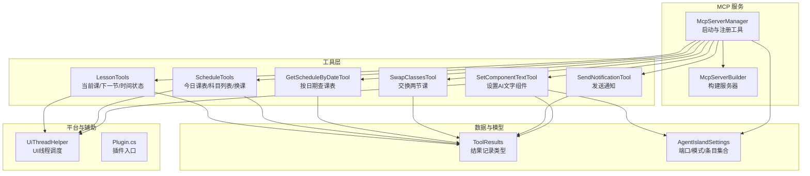
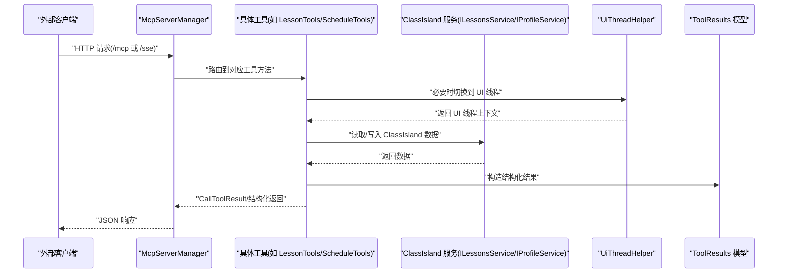
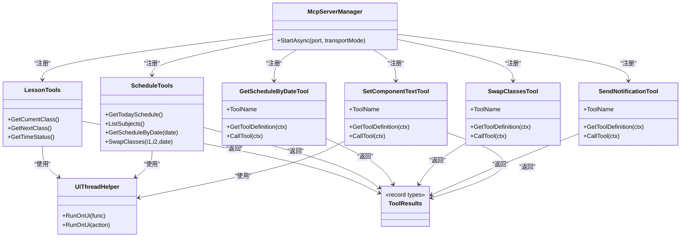

# MCP 工具开发

<cite>
**本文引用的文件**
- [McpServerManager.cs](file://Mcp/McpServerManager.cs)
- [LessonTools.cs](file://Mcp/Tools/LessonTools.cs)
- [ScheduleTools.cs](file://Mcp/Tools/ScheduleTools.cs)
- [GetScheduleByDateTool.cs](file://Mcp/Tools/GetScheduleByDateTool.cs)
- [SwapClassesTool.cs](file://Mcp/Tools/SwapClassesTool.cs)
- [SendNotificationTool.cs](file://Mcp/Tools/SendNotificationTool.cs)
- [SetComponentTextTool.cs](file://Mcp/Tools/SetComponentTextTool.cs)
- [ToolResults.cs](file://Models/ToolResults.cs)
- [UiThreadHelper.cs](file://Helpers/UiThreadHelper.cs)
- [AgentIslandSettings.cs](file://Models/AgentIslandSettings.cs)
- [Plugin.cs](file://Plugin.cs)
</cite>

## 目录
1. [简介](#简介)
2. [项目结构](#项目结构)
3. [核心组件](#核心组件)
4. [架构总览](#架构总览)
5. [详细组件分析](#详细组件分析)
6. [依赖关系分析](#依赖关系分析)
7. [性能与并发考虑](#性能与并发考虑)
8. [错误处理与日志记录](#错误处理与日志记录)
9. [与 ClassIsland API 集成指南](#与-classisland-api-集成指南)
10. [测试与调试建议](#测试与调试建议)
11. [结论](#结论)

## 简介
本教程面向希望在 AgentIsland 插件中开发 MCP（Model Context Protocol）工具的开发者。你将学习：
- 如何使用 [McpServerTool] 特性声明新的 MCP 工具，包括名称、描述和参数定义
- 完整的工具方法签名规范，包括异步支持、参数校验与结构化返回值
- 错误处理机制与日志记录最佳实践
- 与 ClassIsland API 的集成方式（课程查询、日程管理、通知发送等）
- 工具测试与调试技巧及推荐工具

## 项目结构
本项目采用“按功能域组织”的结构，MCP 工具集中在 Mcp/Tools 下，服务管理与传输在 Mcp/ 根目录，模型在 Models/，UI 线程辅助在 Helpers/。

图表来源
- [McpServerManager.cs:1-73](file://Mcp/McpServerManager.cs#L1-L73)
- [LessonTools.cs:1-146](file://Mcp/Tools/LessonTools.cs#L1-L146)
- [ScheduleTools.cs:1-204](file://Mcp/Tools/ScheduleTools.cs#L1-L204)
- [GetScheduleByDateTool.cs:1-92](file://Mcp/Tools/GetScheduleByDateTool.cs#L1-L92)
- [SwapClassesTool.cs:1-103](file://Mcp/Tools/SwapClassesTool.cs#L1-L103)
- [SendNotificationTool.cs:1-137](file://Mcp/Tools/SendNotificationTool.cs#L1-L137)
- [SetComponentTextTool.cs:1-92](file://Mcp/Tools/SetComponentTextTool.cs#L1-L92)
- [ToolResults.cs:1-59](file://Models/ToolResults.cs#L1-L59)
- [UiThreadHelper.cs:1-25](file://Helpers/UiThreadHelper.cs#L1-L25)
- [AgentIslandSettings.cs:1-45](file://Models/AgentIslandSettings.cs#L1-L45)
- [Plugin.cs](file://Plugin.cs)

章节来源
- [McpServerManager.cs:1-73](file://Mcp/McpServerManager.cs#L1-L73)
- [AgentIslandSettings.cs:1-45](file://Models/AgentIslandSettings.cs#L1-L45)

## 核心组件
- McpServerManager：负责创建并启动 MCP 服务器，注册所有工具，配置 JSON 序列化上下文与 HTTP 传输端点。
- 工具类：
  - LessonTools：基于 [McpServerTool] 暴露读时工具（当前课、下一节、时间状态）。
  - ScheduleTools：提供今日课表、科目列表、按日期获取课表、换课等能力。
  - GetScheduleByDateTool / SwapClassesTool / SendNotificationTool / SetComponentTextTool：通过 IMcpServerTool 显式实现，自定义输入 Schema 与调用流程。
- 结果模型：ToolResults 中的 record 类型作为结构化返回体。
- UI 线程辅助：UiThreadHelper 确保对 UI 相关数据的访问在主线程执行。

章节来源
- [McpServerManager.cs:25-73](file://Mcp/McpServerManager.cs#L25-L73)
- [LessonTools.cs:13-146](file://Mcp/Tools/LessonTools.cs#L13-L146)
- [ScheduleTools.cs:14-204](file://Mcp/Tools/ScheduleTools.cs#L14-L204)
- [GetScheduleByDateTool.cs:16-92](file://Mcp/Tools/GetScheduleByDateTool.cs#L16-L92)
- [SwapClassesTool.cs:16-103](file://Mcp/Tools/SwapClassesTool.cs#L16-L103)
- [SendNotificationTool.cs:16-137](file://Mcp/Tools/SendNotificationTool.cs#L16-L137)
- [SetComponentTextTool.cs:17-92](file://Mcp/Tools/SetComponentTextTool.cs#L17-L92)
- [ToolResults.cs:1-59](file://Models/ToolResults.cs#L1-L59)
- [UiThreadHelper.cs:5-25](file://Helpers/UiThreadHelper.cs#L5-L25)

## 架构总览
下图展示了从客户端到工具实现的端到端调用路径，以及工具如何访问 ClassIsland 服务与本地设置。

图表来源
- [McpServerManager.cs:41-73](file://Mcp/McpServerManager.cs#L41-L73)
- [LessonTools.cs:22-45](file://Mcp/Tools/LessonTools.cs#L22-L45)
- [ScheduleTools.cs:23-56](file://Mcp/Tools/ScheduleTools.cs#L23-L56)
- [UiThreadHelper.cs:7-23](file://Helpers/UiThreadHelper.cs#L7-L23)
- [ToolResults.cs:1-59](file://Models/ToolResults.cs#L1-L59)

## 详细组件分析

### 使用 [McpServerTool] 声明工具（方法级）
- 适用场景：快速将现有方法暴露为 MCP 工具，无需手动实现 IMcpServerTool。
- 关键要点：
  - 在方法上添加 [McpServerTool(Name=..., ReadOnly=..., Structured=...)] 特性
  - Name：工具对外名称；ReadOnly：是否只读；Structured：是否启用结构化返回
  - 方法签名：
    - 同步方法：直接返回 ToolResults 中的 record 类型
    - 异步方法：可返回 ValueTask<T> 或 Task<T>（框架会处理）
  - 参数：
    - 无参：直接从 IAppHost 解析所需服务
    - 有参：由框架自动反序列化为方法参数（需保证类型匹配）
  - 返回值：
    - 建议使用 ToolResults 中的 record 类型，便于 JSON 序列化与文档生成
- 示例参考路径：
  - [LessonTools.cs:13-146](file://Mcp/Tools/LessonTools.cs#L13-L146)
  - [ScheduleTools.cs:14-131](file://Mcp/Tools/ScheduleTools.cs#L14-L131)

章节来源
- [LessonTools.cs:13-146](file://Mcp/Tools/LessonTools.cs#L13-L146)
- [ScheduleTools.cs:14-131](file://Mcp/Tools/ScheduleTools.cs#L14-L131)

### 显式实现 IMcpServerTool（Schema 级控制）
- 适用场景：需要自定义输入 Schema、复杂参数校验、异常捕获与结构化错误返回。
- 关键要点：
  - 实现 ToolName、GetToolDefinition、CallTool
  - InputSchema：使用 System.Text.Json 静态字段定义 JSON Schema
  - CallTool：从 context.InputJsonArguments 解析参数，进行校验与业务处理
  - 返回：CallToolResult.FromResultStructured(...)
- 示例参考路径：
  - [GetScheduleByDateTool.cs:16-92](file://Mcp/Tools/GetScheduleByDateTool.cs#L16-L92)
  - [SwapClassesTool.cs:16-103](file://Mcp/Tools/SwapClassesTool.cs#L16-L103)
  - [SendNotificationTool.cs:16-137](file://Mcp/Tools/SendNotificationTool.cs#L16-L137)
  - [SetComponentTextTool.cs:17-92](file://Mcp/Tools/SetComponentTextTool.cs#L17-L92)

章节来源
- [GetScheduleByDateTool.cs:16-92](file://Mcp/Tools/GetScheduleByDateTool.cs#L16-L92)
- [SwapClassesTool.cs:16-103](file://Mcp/Tools/SwapClassesTool.cs#L16-L103)
- [SendNotificationTool.cs:16-137](file://Mcp/Tools/SendNotificationTool.cs#L16-L137)
- [SetComponentTextTool.cs:17-92](file://Mcp/Tools/SetComponentTextTool.cs#L17-L92)

### 工具方法签名规范
- 命名：清晰表达意图，如 GetCurrentClass、GetTodaySchedule、SwapClasses
- 参数：
  - 简单参数可直接映射为方法参数
  - 复杂参数建议使用 record 或强类型 DTO
  - 必填参数应在 Schema 中标记 required，并在代码中进行二次校验
- 返回值：
  - 优先使用 ToolResults 中的 record 类型
  - 若需要错误信息，可在 record 中包含 Success/Message 字段
- 异步：
  - 支持同步与异步方法；异步方法应使用 await 避免阻塞
- UI 线程：
  - 涉及 UI 或 Avalonia 相关访问时，使用 UiThreadHelper.RunOnUi 切换线程

章节来源
- [ToolResults.cs:1-59](file://Models/ToolResults.cs#L1-L59)
- [UiThreadHelper.cs:7-23](file://Helpers/UiThreadHelper.cs#L7-L23)

### 参数验证与输入 Schema
- 推荐做法：
  - 在 InputSchema 中明确 type、description、required
  - 在 CallTool 中再次校验，抛出 ArgumentException 或返回结构化错误
- 示例参考路径：
  - [GetScheduleByDateTool.cs:18-30](file://Mcp/Tools/GetScheduleByDateTool.cs#L18-L30)
  - [SwapClassesTool.cs:18-40](file://Mcp/Tools/SwapClassesTool.cs#L18-L40)
  - [SendNotificationTool.cs:18-45](file://Mcp/Tools/SendNotificationTool.cs#L18-L45)
  - [SetComponentTextTool.cs:19-28](file://Mcp/Tools/SetComponentTextTool.cs#L19-L28)

章节来源
- [GetScheduleByDateTool.cs:18-30](file://Mcp/Tools/GetScheduleByDateTool.cs#L18-L30)
- [SwapClassesTool.cs:18-40](file://Mcp/Tools/SwapClassesTool.cs#L18-L40)
- [SendNotificationTool.cs:18-45](file://Mcp/Tools/SendNotificationTool.cs#L18-L45)
- [SetComponentTextTool.cs:19-28](file://Mcp/Tools/SetComponentTextTool.cs#L19-L28)

### 返回值处理与结构化输出
- 使用 ToolResults 中的 record 类型作为统一返回格式
- 对于写操作，建议包含 Success/Message 字段以反馈结果
- 示例参考路径：
  - [ToolResults.cs:24-59](file://Models/ToolResults.cs#L24-L59)

章节来源
- [ToolResults.cs:24-59](file://Models/ToolResults.cs#L24-L59)

### 错误处理机制
- 通用策略：
  - 在 CallTool 中使用 try/catch 捕获异常
  - 记录 Sentry Breadcrumb/CaptureException
  - 返回结构化错误结果（Success=false, Message=错误信息）
- 示例参考路径：
  - [GetScheduleByDateTool.cs:58-78](file://Mcp/Tools/GetScheduleByDateTool.cs#L58-L78)
  - [SendNotificationTool.cs:73-105](file://Mcp/Tools/SendNotificationTool.cs#L73-L105)
  - [SetComponentTextTool.cs:46-72](file://Mcp/Tools/SetComponentTextTool.cs#L46-L72)
  - [ScheduleTools.cs:98-102](file://Mcp/Tools/ScheduleTools.cs#L98-L102)

章节来源
- [GetScheduleByDateTool.cs:58-78](file://Mcp/Tools/GetScheduleByDateTool.cs#L58-L78)
- [SendNotificationTool.cs:73-105](file://Mcp/Tools/SendNotificationTool.cs#L73-L105)
- [SetComponentTextTool.cs:46-72](file://Mcp/Tools/SetComponentTextTool.cs#L46-L72)
- [ScheduleTools.cs:98-102](file://Mcp/Tools/ScheduleTools.cs#L98-L102)

### 日志记录最佳实践
- 使用 Microsoft.Extensions.Logging 记录关键步骤与异常
- 在工具入口处记录入参与上下文信息
- 在异常分支记录错误详情
- 示例参考路径：
  - [LessonTools.cs:26-28](file://Mcp/Tools/LessonTools.cs#L26-L28)
  - [ScheduleTools.cs:64-66](file://Mcp/Tools/ScheduleTools.cs#L64-L66)
  - [SendNotificationTool.cs:81-84](file://Mcp/Tools/SendNotificationTool.cs#L81-L84)
  - [SetComponentTextTool.cs:52-55](file://Mcp/Tools/SetComponentTextTool.cs#L52-L55)

章节来源
- [LessonTools.cs:26-28](file://Mcp/Tools/LessonTools.cs#L26-L28)
- [ScheduleTools.cs:64-66](file://Mcp/Tools/ScheduleTools.cs#L64-L66)
- [SendNotificationTool.cs:81-84](file://Mcp/Tools/SendNotificationTool.cs#L81-L84)
- [SetComponentTextTool.cs:52-55](file://Mcp/Tools/SetComponentTextTool.cs#L52-L55)

### 与 ClassIsland API 集成
- 课程查询：
  - 使用 ILessonsService 获取当前课、下一节、时间状态
  - 示例参考路径：[LessonTools.cs:28-44](file://Mcp/Tools/LessonTools.cs#L28-L44)、[LessonTools.cs:59-82](file://Mcp/Tools/LessonTools.cs#L59-L82)
- 日程管理：
  - 使用 IProfileService 与 ILessonsService 获取/创建临时换课层、保存配置
  - 示例参考路径：[ScheduleTools.cs:67-96](file://Mcp/Tools/ScheduleTools.cs#L67-L96)
- 通知发送：
  - 通过 AgentIslandNotificationProvider 发送通知
  - 示例参考路径：[SendNotificationTool.cs:85-96](file://Mcp/Tools/SendNotificationTool.cs#L85-L96)

章节来源
- [LessonTools.cs:28-44](file://Mcp/Tools/LessonTools.cs#L28-L44)
- [LessonTools.cs:59-82](file://Mcp/Tools/LessonTools.cs#L59-L82)
- [ScheduleTools.cs:67-96](file://Mcp/Tools/ScheduleTools.cs#L67-L96)
- [SendNotificationTool.cs:85-96](file://Mcp/Tools/SendNotificationTool.cs#L85-L96)

### 工具注册与服务器启动
- 在 McpServerManager 中通过 WithTools 注册所有工具
- 根据传输模式选择 /mcp 或 /sse 端点
- 示例参考路径：[McpServerManager.cs:41-67](file://Mcp/McpServerManager.cs#L41-L67)

章节来源
- [McpServerManager.cs:41-67](file://Mcp/McpServerManager.cs#L41-L67)

## 依赖关系分析
- 工具与服务：
  - LessonTools、ScheduleTools 依赖 ClassIsland 的 ILessonsService、IProfileService、IExactTimeService
  - SetComponentTextTool 依赖 Plugin.Settings.AiTextEntries
- 线程模型：
  - 访问 UI 相关数据时使用 UiThreadHelper 切换到主线程
- 序列化：
  - 使用 AgentIslandJsonContext.Default 进行结构化返回的 JSON 序列化

图表来源
- [McpServerManager.cs:41-67](file://Mcp/McpServerManager.cs#L41-L67)
- [LessonTools.cs:13-146](file://Mcp/Tools/LessonTools.cs#L13-L146)
- [ScheduleTools.cs:14-204](file://Mcp/Tools/ScheduleTools.cs#L14-L204)
- [GetScheduleByDateTool.cs:16-92](file://Mcp/Tools/GetScheduleByDateTool.cs#L16-L92)
- [SwapClassesTool.cs:16-103](file://Mcp/Tools/SwapClassesTool.cs#L16-L103)
- [SendNotificationTool.cs:16-137](file://Mcp/Tools/SendNotificationTool.cs#L16-L137)
- [SetComponentTextTool.cs:17-92](file://Mcp/Tools/SetComponentTextTool.cs#L17-L92)
- [ToolResults.cs:1-59](file://Models/ToolResults.cs#L1-L59)
- [UiThreadHelper.cs:5-25](file://Helpers/UiThreadHelper.cs#L5-L25)

章节来源
- [McpServerManager.cs:41-67](file://Mcp/McpServerManager.cs#L41-L67)
- [ToolResults.cs:1-59](file://Models/ToolResults.cs#L1-L59)

## 性能与并发考虑
- 避免在 UI 线程执行耗时操作：使用 UiThreadHelper 仅用于必要的 UI 访问，其他逻辑保持异步
- 减少不必要的 JSON 序列化开销：复用 JsonElement 与静态 Schema 对象
- 合理划分工具职责：读多写少分离，降低锁竞争与副作用
- 监控与遥测：利用 Sentry 的 Breadcrumb 与 Transaction 跟踪关键路径

章节来源
- [UiThreadHelper.cs:7-23](file://Helpers/UiThreadHelper.cs#L7-L23)
- [McpServerManager.cs:32-35](file://Mcp/McpServerManager.cs#L32-L35)

## 错误处理与日志记录
- 统一错误返回：所有工具在异常分支返回结构化错误结果
- 日志级别：
  - Debug：入参、关键中间状态
  - Information：重要操作完成（如发送通知、换课成功）
  - Error：异常堆栈与上下文
- 遥测：
  - 记录 Breadcrumb 与 CaptureException，便于问题定位

章节来源
- [GetScheduleByDateTool.cs:58-78](file://Mcp/Tools/GetScheduleByDateTool.cs#L58-L78)
- [SendNotificationTool.cs:73-105](file://Mcp/Tools/SendNotificationTool.cs#L73-L105)
- [SetComponentTextTool.cs:46-72](file://Mcp/Tools/SetComponentTextTool.cs#L46-L72)
- [ScheduleTools.cs:98-102](file://Mcp/Tools/ScheduleTools.cs#L98-L102)

## 与 ClassIsland API 集成指南
- 课程查询
  - 使用 ILessonsService.CurrentSubject、NextClassSubject、CurrentState 等属性
  - 结合 IExactTimeService 计算剩余秒数
  - 示例参考路径：[LessonTools.cs:28-44](file://Mcp/Tools/LessonTools.cs#L28-L44)、[LessonTools.cs:59-82](file://Mcp/Tools/LessonTools.cs#L59-L82)
- 日程管理
  - 使用 IProfileService 与 ILessonsService 获取 ClassPlan，必要时创建临时换课层
  - 示例参考路径：[ScheduleTools.cs:67-96](file://Mcp/Tools/ScheduleTools.cs#L67-L96)
- 通知发送
  - 通过 AgentIslandNotificationProvider.Instance.Notify 发送通知
  - 示例参考路径：[SendNotificationTool.cs:85-96](file://Mcp/Tools/SendNotificationTool.cs#L85-L96)

章节来源
- [LessonTools.cs:28-44](file://Mcp/Tools/LessonTools.cs#L28-L44)
- [LessonTools.cs:59-82](file://Mcp/Tools/LessonTools.cs#L59-L82)
- [ScheduleTools.cs:67-96](file://Mcp/Tools/ScheduleTools.cs#L67-L96)
- [SendNotificationTool.cs:85-96](file://Mcp/Tools/SendNotificationTool.cs#L85-L96)

## 测试与调试建议
- 单元测试
  - 针对参数解析与校验逻辑编写单测（如 ReadRequiredString/ReadOptionalDouble）
  - 模拟 ClassIsland 服务接口，验证工具在不同状态下的行为
- 集成测试
  - 使用 Postman 或 curl 调用 /mcp 与 /sse 端点，验证工具返回结构与错误消息
- 调试技巧
  - 在工具入口与异常分支增加 LogDebug/LogInformation
  - 使用 Sentry 的 Breadcrumb 与 CaptureException 追踪问题
- 推荐工具
  - Postman、curl、Sentry Dashboard、Visual Studio 调试器

章节来源
- [SendNotificationTool.cs:107-135](file://Mcp/Tools/SendNotificationTool.cs#L107-L135)
- [GetScheduleByDateTool.cs:80-90](file://Mcp/Tools/GetScheduleByDateTool.cs#L80-L90)
- [SwapClassesTool.cs:82-101](file://Mcp/Tools/SwapClassesTool.cs#L82-L101)
- [McpServerManager.cs:32-35](file://Mcp/McpServerManager.cs#L32-L35)

## 结论
通过 [McpServerTool] 特性与 IMcpServerTool 显式实现两种模式，你可以灵活地扩展 MCP 工具集。遵循统一的参数校验、错误处理与日志记录规范，结合 ClassIsland API 的强大能力，能够快速构建稳定可靠的本地智能体工具。建议在开发过程中充分利用 UI 线程辅助、结构化返回与遥测手段，提升可维护性与可观测性。