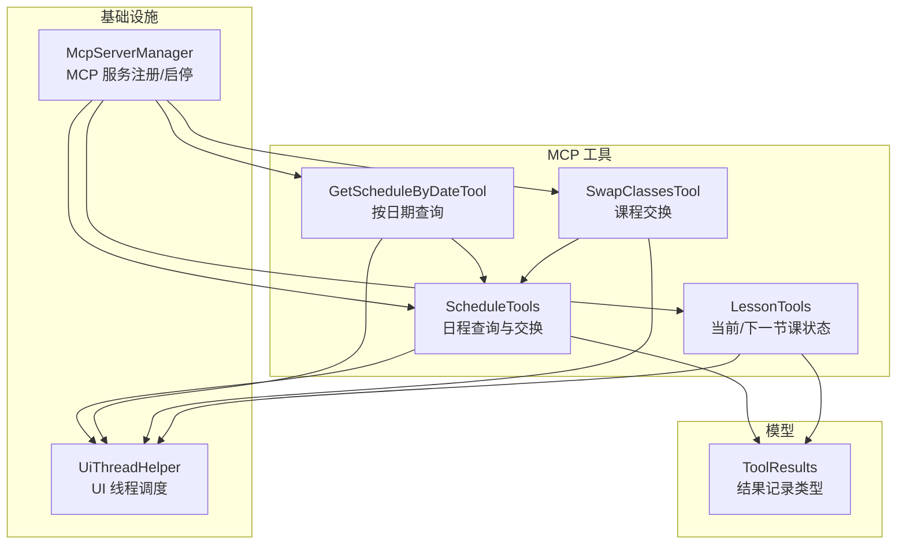
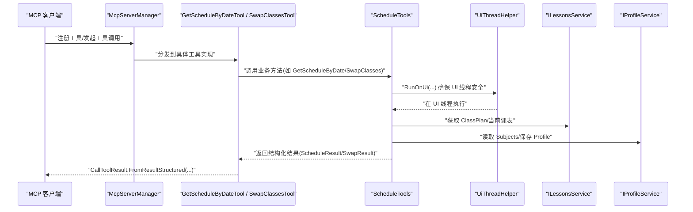
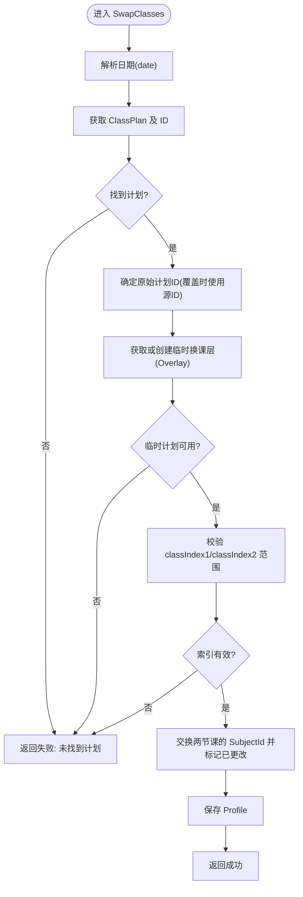
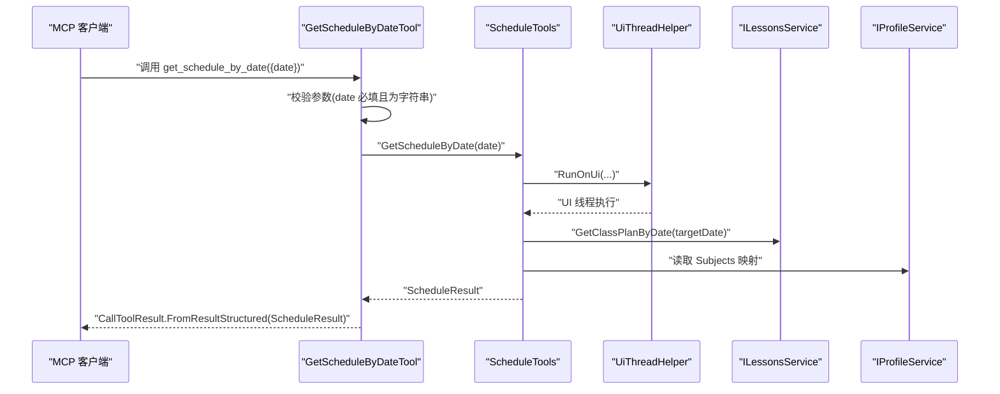
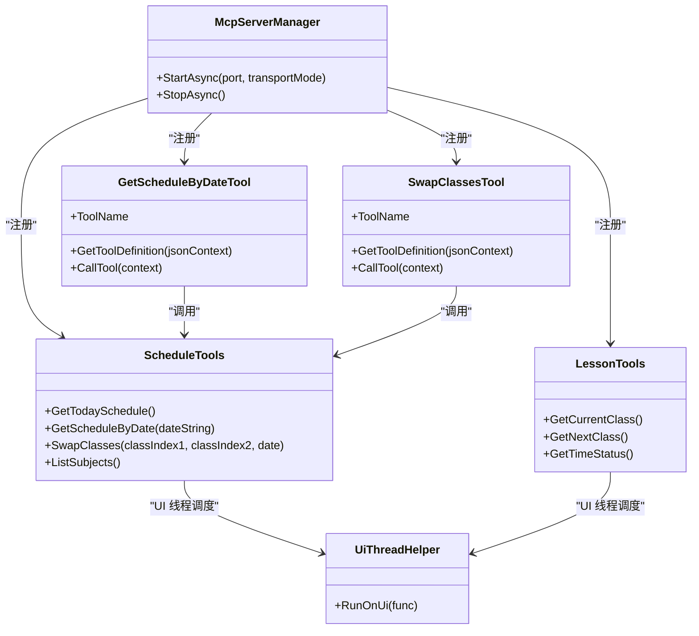
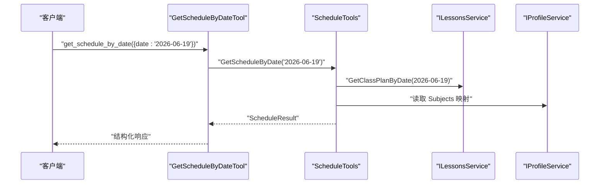
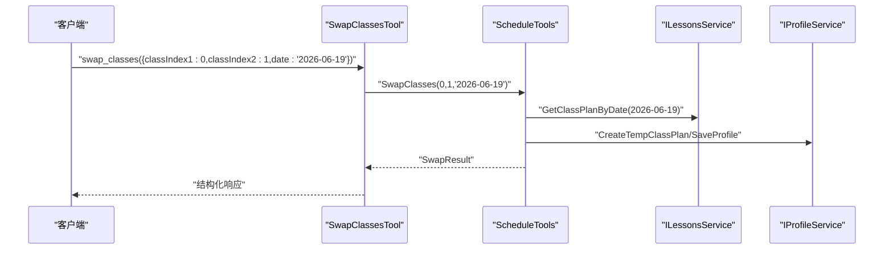

# 日程管理工具开发

<cite>
**本文引用的文件**
- [Mcp/Tools/ScheduleTools.cs](file://Mcp/Tools/ScheduleTools.cs)
- [Mcp/Tools/GetScheduleByDateTool.cs](file://Mcp/Tools/GetScheduleByDateTool.cs)
- [Mcp/Tools/SwapClassesTool.cs](file://Mcp/Tools/SwapClassesTool.cs)
- [Mcp/Tools/LessonTools.cs](file://Mcp/Tools/LessonTools.cs)
- [Models/ToolResults.cs](file://Models/ToolResults.cs)
- [Helpers/UiThreadHelper.cs](file://Helpers/UiThreadHelper.cs)
- [Mcp/McpServerManager.cs](file://Mcp/McpServerManager.cs)
</cite>

## 目录
1. [简介](#简介)
2. [项目结构](#项目结构)
3. [核心组件](#核心组件)
4. [架构总览](#架构总览)
5. [详细组件分析](#详细组件分析)
6. [依赖关系分析](#依赖关系分析)
7. [性能与并发考虑](#性能与并发考虑)
8. [故障排查指南](#故障排查指南)
9. [结论](#结论)
10. [附录：API 调用示例与异常处理模式](#附录api-调用示例与异常处理模式)

## 简介
本指南面向“日程管理工具”的开发与维护，聚焦以下能力：
- ScheduleTools 类中的日程查询工具：get_today_schedule（今日课程表）与 get_schedule_by_date（指定日期课程表）。
- GetScheduleByDateTool 的日期参数解析、校验与数据获取流程。
- SwapClassesTool 的课程交换功能：参数验证、临时换课层创建、交换逻辑与错误处理。
- 课程表数据结构解析与格式化的最佳实践。
- 完整的 API 调用示例与异常处理模式。

## 项目结构
本项目采用按功能域组织的方式，MCP 工具位于 Mcp/Tools 下，结果模型集中于 Models/ToolResults.cs，UI 线程调度封装在 Helpers/UiThreadHelper.cs，MCP 服务器注册与启动由 Mcp/McpServerManager.cs 统一管理。



图表来源
- [Mcp/McpServerManager.cs:41-51](file://Mcp/McpServerManager.cs#L41-L51)
- [Mcp/Tools/ScheduleTools.cs:13-203](file://Mcp/Tools/ScheduleTools.cs#L13-L203)
- [Mcp/Tools/GetScheduleByDateTool.cs:16-91](file://Mcp/Tools/GetScheduleByDateTool.cs#L16-L91)
- [Mcp/Tools/SwapClassesTool.cs:16-102](file://Mcp/Tools/SwapClassesTool.cs#L16-L102)
- [Mcp/Tools/LessonTools.cs:12-145](file://Mcp/Tools/LessonTools.cs#L12-L145)
- [Models/ToolResults.cs:24-49](file://Models/ToolResults.cs#L24-L49)
- [Helpers/UiThreadHelper.cs:5-24](file://Helpers/UiThreadHelper.cs#L5-L24)

章节来源
- [Mcp/McpServerManager.cs:25-82](file://Mcp/McpServerManager.cs#L25-L82)
- [Mcp/Tools/ScheduleTools.cs:13-203](file://Mcp/Tools/ScheduleTools.cs#L13-L203)
- [Mcp/Tools/GetScheduleByDateTool.cs:16-91](file://Mcp/Tools/GetScheduleByDateTool.cs#L16-L91)
- [Mcp/Tools/SwapClassesTool.cs:16-102](file://Mcp/Tools/SwapClassesTool.cs#L16-L102)
- [Mcp/Tools/LessonTools.cs:12-145](file://Mcp/Tools/LessonTools.cs#L12-L145)
- [Models/ToolResults.cs:24-49](file://Models/ToolResults.cs#L24-L49)
- [Helpers/UiThreadHelper.cs:5-24](file://Helpers/UiThreadHelper.cs#L5-L24)

## 核心组件
- ScheduleTools：提供 get_today_schedule、get_schedule_by_date、swap_classes、list_subjects 等能力；内部负责从 ILessonsService 和 IProfileService 读取 ClassPlan、Subject、TimeLayout 等信息，并构建 ScheduleResult。
- GetScheduleByDateTool：作为 MCP 工具入口，定义输入 JSON Schema，解析 date 参数，调用 ScheduleTools.GetScheduleByDate，返回结构化结果。
- SwapClassesTool：作为 MCP 工具入口，定义 classIndex1、classIndex2、date 参数，调用 ScheduleTools.SwapClasses，基于临时换课层完成两节课的 SubjectId 交换。
- LessonTools：提供当前/下一节课与时间状态查询，辅助理解课程表上下文。
- ToolResults：统一的返回记录类型，如 ScheduleResult、ScheduleClassEntry、SwapResult 等。
- UiThreadHelper：确保对 UI 相关服务的访问在 UI 线程执行。
- McpServerManager：集中注册所有工具，配置序列化上下文，启动/停止 MCP 服务。

章节来源
- [Mcp/Tools/ScheduleTools.cs:13-203](file://Mcp/Tools/ScheduleTools.cs#L13-L203)
- [Mcp/Tools/GetScheduleByDateTool.cs:16-91](file://Mcp/Tools/GetScheduleByDateTool.cs#L16-L91)
- [Mcp/Tools/SwapClassesTool.cs:16-102](file://Mcp/Tools/SwapClassesTool.cs#L16-L102)
- [Mcp/Tools/LessonTools.cs:12-145](file://Mcp/Tools/LessonTools.cs#L12-L145)
- [Models/ToolResults.cs:24-49](file://Models/ToolResults.cs#L24-L49)
- [Helpers/UiThreadHelper.cs:5-24](file://Helpers/UiThreadHelper.cs#L5-L24)
- [Mcp/McpServerManager.cs:41-51](file://Mcp/McpServerManager.cs#L41-L51)

## 架构总览
下图展示了 MCP 客户端到工具的调用链，以及工具如何访问底层服务与持久化数据。



图表来源
- [Mcp/McpServerManager.cs:41-51](file://Mcp/McpServerManager.cs#L41-L51)
- [Mcp/Tools/GetScheduleByDateTool.cs:53-78](file://Mcp/Tools/GetScheduleByDateTool.cs#L53-L78)
- [Mcp/Tools/SwapClassesTool.cs:63-80](file://Mcp/Tools/SwapClassesTool.cs#L63-L80)
- [Mcp/Tools/ScheduleTools.cs:41-103](file://Mcp/Tools/ScheduleTools.cs#L41-L103)
- [Helpers/UiThreadHelper.cs:7-12](file://Helpers/UiThreadHelper.cs#L7-L12)

## 详细组件分析

### ScheduleTools：日程查询与交换核心
- 今日课程表 get_today_schedule
  - 通过 ILessonsService.CurrentClassPlan 优先取当前计划，否则按当天日期获取。
  - 使用 BuildScheduleResult 将 ClassPlan 转换为 ScheduleResult，包含每节课的索引、科目名、教师名、起止时间与是否被修改/启用标记。
- 指定日期课程表 get_schedule_by_date
  - 解析 dateString 为 DateTime，若为空则回退到今天。
  - 通过 ILessonsService.GetClassPlanByDate(targetDate, out _) 获取 ClassPlan，再构建结果。
- 课程交换 swap_classes
  - 参数：classIndex1、classIndex2、date（可选，空表示今天）。
  - 步骤：
    1) 解析日期并获取目标日期的 ClassPlan 及其 ID。
    2) 若为覆盖计划，则使用 OverlaySourceId 作为原始计划 ID。
    3) 通过 GetOrCreateTempClassPlan 复用或创建临时换课层（Overlay），以 enableDateTime 绑定到目标日期。
    4) 校验两个索引是否在范围内。
    5) 交换 Classes[classIndex1] 与 Classes[classIndex2] 的 SubjectId，并标记 IsChangedClass=true。
    6) 调用 profileService.SaveProfile() 持久化变更。
    7) 返回 SwapResult。
- 辅助方法
  - ParseDate：支持 yyyy-MM-dd 字符串，非法时抛出异常。
  - FormatTime：将 TimeSpan 格式化为 hh:mm:ss。
  - IsValidIndex：边界检查。
  - ListSubjects：列出所有 Subject 信息，便于前端展示与选择。



图表来源
- [Mcp/Tools/ScheduleTools.cs:58-103](file://Mcp/Tools/ScheduleTools.cs#L58-L103)
- [Mcp/Tools/ScheduleTools.cs:162-177](file://Mcp/Tools/ScheduleTools.cs#L162-L177)
- [Mcp/Tools/ScheduleTools.cs:179-197](file://Mcp/Tools/ScheduleTools.cs#L179-L197)

章节来源
- [Mcp/Tools/ScheduleTools.cs:15-39](file://Mcp/Tools/ScheduleTools.cs#L15-L39)
- [Mcp/Tools/ScheduleTools.cs:41-56](file://Mcp/Tools/ScheduleTools.cs#L41-L56)
- [Mcp/Tools/ScheduleTools.cs:58-103](file://Mcp/Tools/ScheduleTools.cs#L58-L103)
- [Mcp/Tools/ScheduleTools.cs:133-160](file://Mcp/Tools/ScheduleTools.cs#L133-L160)
- [Mcp/Tools/ScheduleTools.cs:162-177](file://Mcp/Tools/ScheduleTools.cs#L162-L177)
- [Mcp/Tools/ScheduleTools.cs:179-197](file://Mcp/Tools/ScheduleTools.cs#L179-L197)

### GetScheduleByDateTool：按日期查询工具
- 输入 Schema
  - 必填字段：date（字符串，yyyy-MM-dd）。
- 处理流程
  - 从 context.InputJsonArguments 中读取并校验 date。
  - 调用 ScheduleTools.GetScheduleByDate(dateString)。
  - 使用 AgentIslandJsonContext.Default.ScheduleResult 进行结构化序列化返回。
  - 捕获异常并以错误消息包装为 ScheduleResult 返回。



图表来源
- [Mcp/Tools/GetScheduleByDateTool.cs:18-51](file://Mcp/Tools/GetScheduleByDateTool.cs#L18-L51)
- [Mcp/Tools/GetScheduleByDateTool.cs:53-78](file://Mcp/Tools/GetScheduleByDateTool.cs#L53-L78)
- [Mcp/Tools/ScheduleTools.cs:41-56](file://Mcp/Tools/ScheduleTools.cs#L41-L56)
- [Helpers/UiThreadHelper.cs:7-12](file://Helpers/UiThreadHelper.cs#L7-L12)

章节来源
- [Mcp/Tools/GetScheduleByDateTool.cs:16-91](file://Mcp/Tools/GetScheduleByDateTool.cs#L16-L91)
- [Mcp/Tools/ScheduleTools.cs:41-56](file://Mcp/Tools/ScheduleTools.cs#L41-L56)

### SwapClassesTool：课程交换工具
- 输入 Schema
  - 必填：classIndex1、classIndex2（整数，从 0 开始）。
  - 可选：date（字符串，yyyy-MM-dd；空串表示今天）。
- 处理流程
  - 解析并校验参数。
  - 调用 ScheduleTools.SwapClasses(classIndex1, classIndex2, date)。
  - 返回 SwapResult 的结构化结果。

```mermaid
sequenceDiagram
participant Client as "MCP 客户端"
participant Tool as "SwapClassesTool"
participant Core as "ScheduleTools"
participant UIH as "UiThreadHelper"
participant Lessons as "ILessonsService"
participant Profile as "IProfileService"
Client->>Tool : "调用 swap_classes({classIndex1,classIndex2,date?})"
Tool->>Tool : "校验 classIndex1/classIndex2 为整数; date 可选"
Tool->>Core : "SwapClasses(classIndex1,classIndex2,date)"
Core->>UIH : "RunOnUi(...)"
UIH-->>Core : "UI 线程执行"
Core->>Lessons : "GetClassPlanByDate(targetDate)"
Core->>Profile : "CreateTempClassPlan/SaveProfile"
Core-->>Tool : "SwapResult"
Tool-->>Client : "CallToolResult.FromResultStructured(SwapResult)"
```

图表来源
- [Mcp/Tools/SwapClassesTool.cs:18-61](file://Mcp/Tools/SwapClassesTool.cs#L18-L61)
- [Mcp/Tools/SwapClassesTool.cs:63-80](file://Mcp/Tools/SwapClassesTool.cs#L63-L80)
- [Mcp/Tools/ScheduleTools.cs:58-103](file://Mcp/Tools/ScheduleTools.cs#L58-L103)
- [Helpers/UiThreadHelper.cs:7-12](file://Helpers/UiThreadHelper.cs#L7-L12)

章节来源
- [Mcp/Tools/SwapClassesTool.cs:16-102](file://Mcp/Tools/SwapClassesTool.cs#L16-L102)
- [Mcp/Tools/ScheduleTools.cs:58-103](file://Mcp/Tools/ScheduleTools.cs#L58-L103)

### LessonTools：当前/下一节课与时间状态
- get_current_class：返回当前上课的科目、教师、起止时间与剩余秒数。
- get_next_class：返回下一节课的科目、教师、起止时间与距离开始的秒数。
- get_time_status：返回当前状态（InClass/Breaking/AfterSchool 等）、剩余秒数与当前时间。

章节来源
- [Mcp/Tools/LessonTools.cs:12-145](file://Mcp/Tools/LessonTools.cs#L12-L145)

## 依赖关系分析
- 工具层依赖
  - GetScheduleByDateTool 与 SwapClassesTool 均依赖 ScheduleTools 的业务方法。
  - 所有工具通过 UiThreadHelper 确保 UI 线程安全访问。
  - ScheduleTools 依赖 ILessonsService 与 IProfileService 获取与持久化数据。
- 服务注册
  - McpServerManager 统一注册 LessonTools、ScheduleTools、SwapClassesTool、GetScheduleByDateTool 等工具，并配置 JSON 序列化上下文。



图表来源
- [Mcp/McpServerManager.cs:41-51](file://Mcp/McpServerManager.cs#L41-L51)
- [Mcp/Tools/GetScheduleByDateTool.cs:16-51](file://Mcp/Tools/GetScheduleByDateTool.cs#L16-L51)
- [Mcp/Tools/SwapClassesTool.cs:16-61](file://Mcp/Tools/SwapClassesTool.cs#L16-L61)
- [Mcp/Tools/ScheduleTools.cs:13-203](file://Mcp/Tools/ScheduleTools.cs#L13-L203)
- [Mcp/Tools/LessonTools.cs:12-145](file://Mcp/Tools/LessonTools.cs#L12-L145)
- [Helpers/UiThreadHelper.cs:5-24](file://Helpers/UiThreadHelper.cs#L5-L24)

章节来源
- [Mcp/McpServerManager.cs:25-82](file://Mcp/McpServerManager.cs#L25-L82)
- [Mcp/Tools/ScheduleTools.cs:13-203](file://Mcp/Tools/ScheduleTools.cs#L13-L203)
- [Mcp/Tools/GetScheduleByDateTool.cs:16-91](file://Mcp/Tools/GetScheduleByDateTool.cs#L16-L91)
- [Mcp/Tools/SwapClassesTool.cs:16-102](file://Mcp/Tools/SwapClassesTool.cs#L16-L102)
- [Mcp/Tools/LessonTools.cs:12-145](file://Mcp/Tools/LessonTools.cs#L12-L145)
- [Helpers/UiThreadHelper.cs:5-24](file://Helpers/UiThreadHelper.cs#L5-L24)

## 性能与并发考虑
- UI 线程调度
  - 所有涉及 UI 线程的服务访问均通过 UiThreadHelper.RunOnUi 包裹，避免跨线程访问导致的异常与竞态条件。
- 临时换课层复用
  - SwapClasses 会先尝试复用已有的临时换课层（Overlay），减少不必要的创建开销。
- 日志与遥测
  - 各工具在关键路径记录调试/信息日志，并通过 SentryTelemetryService 添加 Breadcrumb 或捕获异常，便于定位问题。
- 序列化
  - 使用 AgentIslandJsonContext.Default 提供的强类型序列化上下文，提升性能与一致性。

[本节为通用指导，不直接分析具体文件]

## 故障排查指南
- 日期格式错误
  - 现象：调用 get_schedule_by_date 或 swap_classes 传入非 yyyy-MM-dd 格式。
  - 处理：ParseDate 会抛出异常；GetScheduleByDateTool 捕获后返回带错误消息的 ScheduleResult。
  - 建议：客户端严格校验日期格式，或在服务端增加友好提示。
- 索引越界
  - 现象：swap_classes 的 classIndex1/classIndex2 超出当日课程数量。
  - 处理：IsValidIndex 校验失败，返回 SwapResult 失败消息。
  - 建议：调用前通过 list_subjects 或查询当日课程表确认最大索引。
- 未找到计划
  - 现象：指定日期无 ClassPlan。
  - 处理：返回 SwapResult 失败消息；查询接口返回空课程列表。
  - 建议：确认系统内存在该日期的排课计划。
- 临时换课层创建失败
  - 现象：CreateTempClassPlan 返回 null 或无法在 Profile.ClassPlans 中找到。
  - 处理：返回 SwapResult 失败消息。
  - 建议：检查 Profile 权限与存储状态。
- UI 线程异常
  - 现象：在非 UI 线程访问 UI 相关服务导致异常。
  - 处理：已通过 UiThreadHelper 规避；若仍出现，检查自定义扩展点是否正确封装。
  - 建议：遵循 RunOnUi 封装规范。

章节来源
- [Mcp/Tools/ScheduleTools.cs:184-197](file://Mcp/Tools/ScheduleTools.cs#L184-L197)
- [Mcp/Tools/ScheduleTools.cs:85-88](file://Mcp/Tools/ScheduleTools.cs#L85-L88)
- [Mcp/Tools/ScheduleTools.cs:70-83](file://Mcp/Tools/ScheduleTools.cs#L70-L83)
- [Mcp/Tools/GetScheduleByDateTool.cs:71-77](file://Mcp/Tools/GetScheduleByDateTool.cs#L71-L77)
- [Helpers/UiThreadHelper.cs:7-12](file://Helpers/UiThreadHelper.cs#L7-L12)

## 结论
本指南梳理了日程管理工具的核心实现与调用链路，明确了：
- ScheduleTools 作为业务中枢，负责课程表数据的读取、转换与交换。
- GetScheduleByDateTool 与 SwapClassesTool 作为 MCP 工具入口，承担参数校验、异常捕获与结构化返回。
- 通过 UiThreadHelper 保障 UI 线程安全，结合临时换课层机制实现安全的课程交换。
- 建议在客户端侧做好参数校验与错误提示，在服务端保持日志与遥测完善，以提升可观测性与用户体验。

[本节为总结性内容，不直接分析具体文件]

## 附录：API 调用示例与异常处理模式

### 工具清单与用途
- get_today_schedule：获取今日课程表。
- get_schedule_by_date：获取指定日期课程表。
- swap_classes：交换指定日期的两节课。
- list_subjects：列出所有科目信息。
- get_current_class/get_next_class/get_time_status：获取当前/下一节课与时间状态。

### 输入输出约定
- 日期格式：yyyy-MM-dd。
- 索引：从 0 开始，需小于当日课程总数。
- 结构化返回：所有工具均返回 CallToolResult.FromResultStructured(...)，使用 AgentIslandJsonContext.Default 对应的记录类型。

### 典型调用序列（按日期查询）


图表来源
- [Mcp/Tools/GetScheduleByDateTool.cs:53-78](file://Mcp/Tools/GetScheduleByDateTool.cs#L53-L78)
- [Mcp/Tools/ScheduleTools.cs:41-56](file://Mcp/Tools/ScheduleTools.cs#L41-L56)

### 典型调用序列（课程交换）


图表来源
- [Mcp/Tools/SwapClassesTool.cs:63-80](file://Mcp/Tools/SwapClassesTool.cs#L63-L80)
- [Mcp/Tools/ScheduleTools.cs:58-103](file://Mcp/Tools/ScheduleTools.cs#L58-L103)

### 异常处理模式
- 参数缺失或类型错误：工具层抛出 ArgumentException，上层捕获并返回带错误消息的结构化结果。
- 业务校验失败：如索引越界、未找到计划、临时换课层创建失败，返回 SwapResult 失败消息。
- 运行时异常：通过 SentryTelemetryService 捕获异常并记录 Breadcrumb，便于追踪。

章节来源
- [Mcp/Tools/GetScheduleByDateTool.cs:80-90](file://Mcp/Tools/GetScheduleByDateTool.cs#L80-L90)
- [Mcp/Tools/GetScheduleByDateTool.cs:71-77](file://Mcp/Tools/GetScheduleByDateTool.cs#L71-L77)
- [Mcp/Tools/SwapClassesTool.cs:82-101](file://Mcp/Tools/SwapClassesTool.cs#L82-L101)
- [Mcp/Tools/ScheduleTools.cs:85-101](file://Mcp/Tools/ScheduleTools.cs#L85-L101)

### 数据结构解析与格式化最佳实践
- 课程表数据
  - ClassPlan：包含 Name、Classes、TimeLayout 等。
  - TimeLayout.Layouts：按 TimeType=0 过滤得到课程时间段。
  - ClassInfo：包含 SubjectId、IsChangedClass、IsEnabled。
  - Subject：包含 Name、TeacherName、Initial。
- 结果构建
  - 遍历 ClassPlan.Classes，按顺序匹配 TimeLayoutItem，构造 ScheduleClassEntry。
  - 使用 FormatTime 将 TimeSpan 转为 hh:mm:ss 字符串。
- 交换逻辑
  - 基于临时换课层（Overlay）进行交换，避免影响原始计划。
  - 交换后标记 IsChangedClass=true，并保存 Profile。

章节来源
- [Mcp/Tools/ScheduleTools.cs:133-160](file://Mcp/Tools/ScheduleTools.cs#L133-L160)
- [Mcp/Tools/ScheduleTools.cs:162-177](file://Mcp/Tools/ScheduleTools.cs#L162-L177)
- [Models/ToolResults.cs:24-49](file://Models/ToolResults.cs#L24-L49)