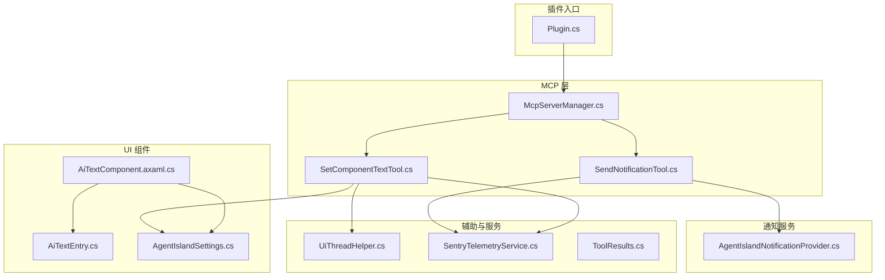
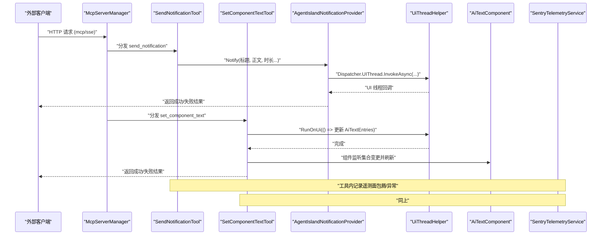
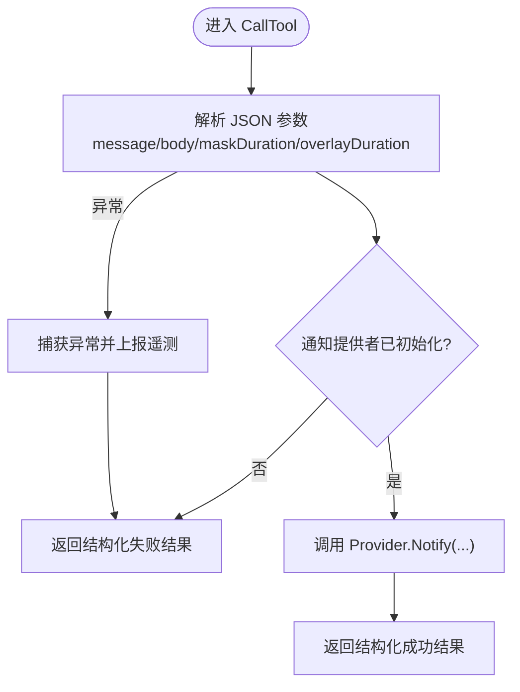
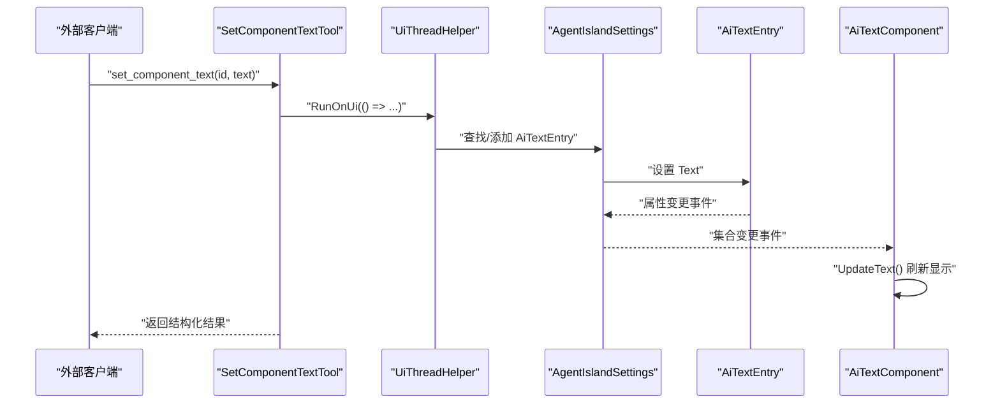
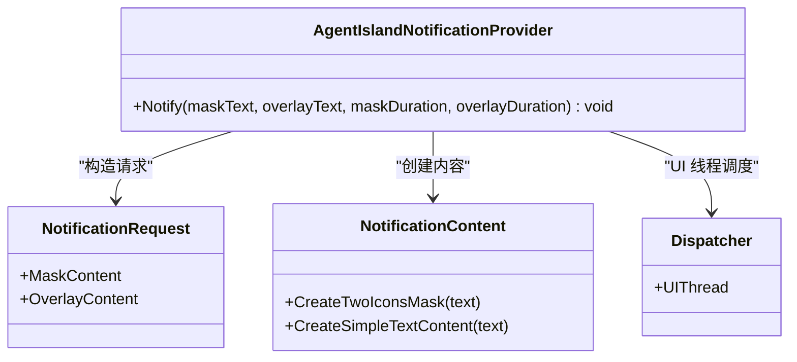
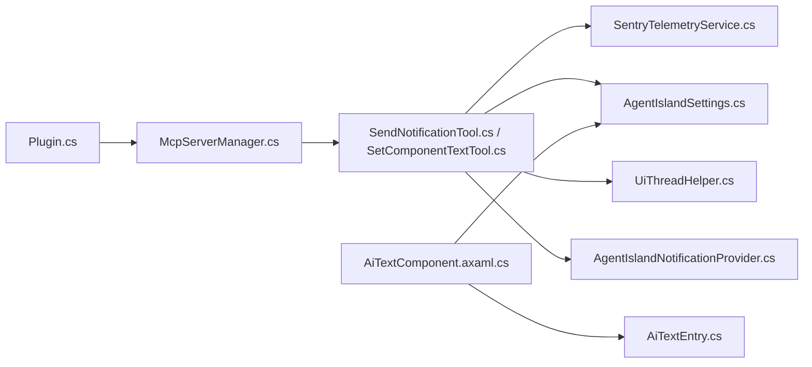

# 系统交互工具开发

<cite>
**本文引用的文件**   
- [Plugin.cs](file://Plugin.cs)
- [McpServerManager.cs](file://Mcp/McpServerManager.cs)
- [SendNotificationTool.cs](file://Mcp/Tools/SendNotificationTool.cs)
- [SetComponentTextTool.cs](file://Mcp/Tools/SetComponentTextTool.cs)
- [AgentIslandNotificationProvider.cs](file://Mcp/Tools/AgentIslandNotificationProvider.cs)
- [AiTextComponent.axaml.cs](file://Components/AiTextComponent.axaml.cs)
- [AiTextEntry.cs](file://Models/AiTextEntry.cs)
- [AgentIslandSettings.cs](file://Models/AgentIslandSettings.cs)
- [UiThreadHelper.cs](file://Helpers/UiThreadHelper.cs)
- [SentryTelemetryService.cs](file://Services/SentryTelemetryService.cs)
- [ToolResults.cs](file://Models/ToolResults.cs)
</cite>

## 目录
1. [简介](#简介)
2. [项目结构](#项目结构)
3. [核心组件](#核心组件)
4. [架构总览](#架构总览)
5. [详细组件分析](#详细组件分析)
6. [依赖关系分析](#依赖关系分析)
7. [性能与线程模型](#性能与线程模型)
8. [最佳实践](#最佳实践)
9. [故障排查指南](#故障排查指南)
10. [结论](#结论)
11. [附录：API 定义与示例](#附录api-定义与示例)

## 简介
本指南面向“系统交互工具”开发者，聚焦以下能力：
- SendNotificationTool：通知消息构建、发送机制与 UI 集成。
- SetComponentTextTool：组件标识符处理、文本设置与 UI 更新机制。
- 与 ClassIsland 核心服务的交互模式：通知服务与组件服务的调用方法。
- 系统交互最佳实践：权限检查、错误处理、用户体验优化。
- 完整工具实现示例与集成测试方法。

## 项目结构
本项目采用分层与按功能域组织相结合的结构：
- Mcp/Tools：MCP 工具实现（通知、组件文本等）。
- Components：ClassIsland 组件（AI 文字组件）及其设置控件。
- Models：数据模型与结果记录（如 AiTextEntry、ToolResults）。
- Services：横切服务（遥测、AcpRunner 等）。
- Helpers：通用辅助（UI 线程调度）。
- Plugin.cs：插件入口，负责初始化、注册、生命周期管理。
- Mcp/McpServerManager.cs：MCP 服务器启动、停止与工具注册。

图表来源
- [Plugin.cs:29-79](file://Plugin.cs#L29-L79)
- [McpServerManager.cs:25-82](file://Mcp/McpServerManager.cs#L25-L82)
- [SendNotificationTool.cs:68-105](file://Mcp/Tools/SendNotificationTool.cs#L68-L105)
- [SetComponentTextTool.cs:41-72](file://Mcp/Tools/SetComponentTextTool.cs#L41-L72)
- [AgentIslandNotificationProvider.cs:27-50](file://Mcp/Tools/AgentIslandNotificationProvider.cs#L27-L50)
- [AiTextComponent.axaml.cs:36-83](file://Components/AiTextComponent.axaml.cs#L36-L83)
- [AiTextEntry.cs:5-30](file://Models/AiTextEntry.cs#L5-L30)
- [AgentIslandSettings.cs:107-122](file://Models/AgentIslandSettings.cs#L107-L122)
- [UiThreadHelper.cs:7-23](file://Helpers/UiThreadHelper.cs#L7-L23)
- [SentryTelemetryService.cs:30-40](file://Services/SentryTelemetryService.cs#L30-L40)
- [ToolResults.cs:51-57](file://Models/ToolResults.cs#L51-L57)

章节来源
- [Plugin.cs:29-79](file://Plugin.cs#L29-L79)
- [McpServerManager.cs:25-82](file://Mcp/McpServerManager.cs#L25-L82)

## 核心组件
- SendNotificationTool：暴露 send_notification 工具，解析输入参数，构建通知内容并通过 AgentIslandNotificationProvider 显示。
- SetComponentTextTool：暴露 set_component_text 工具，根据 id 查找或创建 AiTextEntry，并更新其 Text 属性；通过 UiThreadHelper 确保在 UI 线程执行。
- AgentIslandNotificationProvider：继承自 ClassIsland 的通知提供方基类，封装遮罩与覆盖层通知的构建与展示。
- AiTextComponent：ClassIsland 组件，订阅设置集合变化，动态渲染对应条目文本。
- SentryTelemetryService：统一遥测与异常上报，提供 WithInstrumentation 包装器。

章节来源
- [SendNotificationTool.cs:16-66](file://Mcp/Tools/SendNotificationTool.cs#L16-L66)
- [SetComponentTextTool.cs:17-39](file://Mcp/Tools/SetComponentTextTool.cs#L17-L39)
- [AgentIslandNotificationProvider.cs:10-25](file://Mcp/Tools/AgentIslandNotificationProvider.cs#L10-L25)
- [AiTextComponent.axaml.cs:11-16](file://Components/AiTextComponent.axaml.cs#L11-L16)
- [SentryTelemetryService.cs:11-25](file://Services/SentryTelemetryService.cs#L11-L25)

## 架构总览
整体流程：外部客户端通过 MCP 协议调用工具，McpServerManager 将请求路由到具体工具实现；工具内部访问 ClassIsland 核心服务（通知、组件数据），必要时切换到 UI 线程进行界面更新，并通过遥测服务记录日志与异常。

图表来源
- [McpServerManager.cs:41-71](file://Mcp/McpServerManager.cs#L41-L71)
- [SendNotificationTool.cs:68-105](file://Mcp/Tools/SendNotificationTool.cs#L68-L105)
- [AgentIslandNotificationProvider.cs:27-50](file://Mcp/Tools/AgentIslandNotificationProvider.cs#L27-L50)
- [SetComponentTextTool.cs:41-72](file://Mcp/Tools/SetComponentTextTool.cs#L41-L72)
- [AiTextComponent.axaml.cs:36-83](file://Components/AiTextComponent.axaml.cs#L36-L83)
- [SentryTelemetryService.cs:114-122](file://Services/SentryTelemetryService.cs#L114-L122)

## 详细组件分析

### SendNotificationTool 通知发送
- 输入参数校验：message 必填，body/maskDuration/overlayDuration 可选，默认值分别为空字符串、3.0、5.0。
- 通知提供者可用性检查：若未初始化则直接返回结构化失败结果。
- 调用通知服务：通过 AgentIslandNotificationProvider.Instance.Notify(...) 触发 UI 侧通知。
- 遥测与日志：记录调用面包屑与关键信息，异常捕获后上报。

图表来源
- [SendNotificationTool.cs:68-105](file://Mcp/Tools/SendNotificationTool.cs#L68-L105)
- [AgentIslandNotificationProvider.cs:27-50](file://Mcp/Tools/AgentIslandNotificationProvider.cs#L27-L50)
- [ToolResults.cs:51-53](file://Models/ToolResults.cs#L51-L53)

章节来源
- [SendNotificationTool.cs:18-45](file://Mcp/Tools/SendNotificationTool.cs#L18-L45)
- [SendNotificationTool.cs:68-105](file://Mcp/Tools/SendNotificationTool.cs#L68-L105)
- [AgentIslandNotificationProvider.cs:10-25](file://Mcp/Tools/AgentIslandNotificationProvider.cs#L10-L25)
- [SentryTelemetryService.cs:95-109](file://Services/SentryTelemetryService.cs#L95-L109)

### SetComponentTextTool 组件文本更新
- 输入参数校验：id 与 text 必填。
- UI 线程安全：使用 UiThreadHelper.RunOnUi 确保对设置的修改在 UI 线程执行。
- 数据持久化：若存在对应 id 的条目则更新 Text；否则新增条目。
- 组件联动：AiTextComponent 订阅设置集合变化，自动刷新显示。

图表来源
- [SetComponentTextTool.cs:41-72](file://Mcp/Tools/SetComponentTextTool.cs#L41-L72)
- [AiTextComponent.axaml.cs:36-83](file://Components/AiTextComponent.axaml.cs#L36-L83)
- [AiTextEntry.cs:5-30](file://Models/AiTextEntry.cs#L5-L30)
- [AgentIslandSettings.cs:107-122](file://Models/AgentIslandSettings.cs#L107-L122)
- [UiThreadHelper.cs:14-23](file://Helpers/UiThreadHelper.cs#L14-L23)

章节来源
- [SetComponentTextTool.cs:19-28](file://Mcp/Tools/SetComponentTextTool.cs#L19-L28)
- [SetComponentTextTool.cs:41-72](file://Mcp/Tools/SetComponentTextTool.cs#L41-L72)
- [AiTextComponent.axaml.cs:36-83](file://Components/AiTextComponent.axaml.cs#L36-L83)
- [AiTextEntry.cs:5-30](file://Models/AiTextEntry.cs#L5-L30)
- [AgentIslandSettings.cs:107-122](file://Models/AgentIslandSettings.cs#L107-L122)

### 与 ClassIsland 核心服务的交互模式
- 通知服务：通过 AgentIslandNotificationProvider 提供的 Channel(MessageChannelId).ShowNotification(request) 展示通知。Provider 内部使用 Dispatcher.UIThread.InvokeAsync 保证 UI 线程安全。
- 组件服务：通过 Plugin.Settings.AiTextEntries 集合操作条目，组件侧通过 Avalonia 属性绑定与集合变更事件驱动 UI 更新。

图表来源
- [AgentIslandNotificationProvider.cs:27-50](file://Mcp/Tools/AgentIslandNotificationProvider.cs#L27-L50)

章节来源
- [AgentIslandNotificationProvider.cs:10-25](file://Mcp/Tools/AgentIslandNotificationProvider.cs#L10-L25)
- [AgentIslandNotificationProvider.cs:27-50](file://Mcp/Tools/AgentIslandNotificationProvider.cs#L27-L50)

## 依赖关系分析
- 插件入口负责加载配置、注册通知提供方、组件与设置页，并在应用启动时启动 MCP 服务器。
- McpServerManager 负责工具注册与传输层选择（SSE 或 HTTP）。
- 工具之间无直接耦合，均通过 IAppHost 获取服务实例（遥测、日志）。
- 组件与设置数据通过 Observable 集合与属性变更事件解耦。

图表来源
- [Plugin.cs:29-79](file://Plugin.cs#L29-L79)
- [McpServerManager.cs:41-71](file://Mcp/McpServerManager.cs#L41-L71)
- [SendNotificationTool.cs:68-105](file://Mcp/Tools/SendNotificationTool.cs#L68-L105)
- [SetComponentTextTool.cs:41-72](file://Mcp/Tools/SetComponentTextTool.cs#L41-L72)
- [AiTextComponent.axaml.cs:36-83](file://Components/AiTextComponent.axaml.cs#L36-L83)

章节来源
- [Plugin.cs:29-79](file://Plugin.cs#L29-L79)
- [McpServerManager.cs:25-82](file://Mcp/McpServerManager.cs#L25-L82)

## 性能与线程模型
- UI 线程安全：所有涉及 UI 的操作（通知展示、设置项更新）均在 UI 线程执行，避免跨线程访问导致的异常与竞态。
- 异步与取消：MCP 服务器启停支持取消令牌，便于优雅关闭。
- 遥测开销：遥测仅在启用且满足隐私策略时生效，避免不必要的性能损耗。

章节来源
- [AgentIslandNotificationProvider.cs:31-49](file://Mcp/Tools/AgentIslandNotificationProvider.cs#L31-L49)
- [SetComponentTextTool.cs:56-63](file://Mcp/Tools/SetComponentTextTool.cs#L56-L63)
- [McpServerManager.cs:84-112](file://Mcp/McpServerManager.cs#L84-L112)
- [SentryTelemetryService.cs:30-40](file://Services/SentryTelemetryService.cs#L30-L40)

## 最佳实践
- 参数校验与默认值
  - 对必填字段进行严格校验并提供清晰的错误信息；为可选字段提供合理默认值，降低调用方负担。
- 线程模型
  - 任何 UI 相关操作必须通过 UiThreadHelper 或 Dispatcher 切换至 UI 线程。
- 幂等性与可观测性
  - 对于可重复执行的写操作（如设置文本），建议标记幂等提示；记录关键步骤的面包屑与异常上下文。
- 资源与状态管理
  - 对外部服务（如通知提供方）使用前进行可用性检查，避免空引用。
- 用户体验
  - 通知时长与内容应适度，避免频繁打扰；组件文本为空时提供占位提示。

章节来源
- [SendNotificationTool.cs:18-45](file://Mcp/Tools/SendNotificationTool.cs#L18-L45)
- [SetComponentTextTool.cs:19-28](file://Mcp/Tools/SetComponentTextTool.cs#L19-L28)
- [AgentIslandNotificationProvider.cs:27-50](file://Mcp/Tools/AgentIslandNotificationProvider.cs#L27-L50)
- [AiTextComponent.axaml.cs:73-83](file://Components/AiTextComponent.axaml.cs#L73-L83)

## 故障排查指南
- 通知未显示
  - 检查通知提供方是否已初始化；确认 MessageChannelId 是否正确；查看 UI 线程是否被阻塞。
- 组件文本未更新
  - 确认传入 id 是否存在；检查是否在 UI 线程更新；观察集合变更事件是否触发。
- 遥测未上报
  - 检查遥测开关与隐私策略；确认 DSN 有效；查看是否因异常导致中断。

章节来源
- [SendNotificationTool.cs:85-96](file://Mcp/Tools/SendNotificationTool.cs#L85-L96)
- [SetComponentTextTool.cs:56-71](file://Mcp/Tools/SetComponentTextTool.cs#L56-L71)
- [SentryTelemetryService.cs:30-40](file://Services/SentryTelemetryService.cs#L30-L40)

## 结论
本指南围绕两个核心工具展开，明确了其与 ClassIsland 核心服务的交互方式、UI 线程模型与遥测集成。遵循参数校验、线程安全、幂等性与可观测性等最佳实践，可有效提升系统的稳定性与用户体验。

## 附录：API 定义与示例

### send_notification
- 名称：send_notification
- 描述：在 ClassIsland 界面上显示一条提醒通知。
- 输入参数
  - message：string，必填，通知的主要标题/遮罩文字。
  - body：string，可选，通知的详细内容/正文。
  - maskDuration：number，可选，遮罩显示时间（秒），默认 3.0。
  - overlayDuration：number，可选，正文显示时间（秒），默认 5.0。
- 输出结果
  - 结构化记录：包含成功标志与消息文本。

章节来源
- [SendNotificationTool.cs:18-45](file://Mcp/Tools/SendNotificationTool.cs#L18-L45)
- [SendNotificationTool.cs:68-105](file://Mcp/Tools/SendNotificationTool.cs#L68-L105)
- [ToolResults.cs:51-53](file://Models/ToolResults.cs#L51-L53)

### set_component_text
- 名称：set_component_text
- 描述：按 ID 更新 ClassIsland 主界面上 AI 文字组件显示的内容。
- 输入参数
  - id：string，必填，条目 ID，对应在设置页中创建的 AI 文字条目。
  - text：string，必填，要显示的文字内容。
- 输出结果
  - 结构化记录：包含成功标志与消息文本。

章节来源
- [SetComponentTextTool.cs:19-28](file://Mcp/Tools/SetComponentTextTool.cs#L19-L28)
- [SetComponentTextTool.cs:41-72](file://Mcp/Tools/SetComponentTextTool.cs#L41-L72)
- [ToolResults.cs:55-57](file://Models/ToolResults.cs#L55-L57)

### 集成测试方法
- 本地连接地址
  - 根据传输模式生成 http://localhost:{Port}/{sse|mcp}。
- 工具发现与调用
  - 通过 MCP 协议列出可用工具，分别调用 send_notification 与 set_component_text。
- 断言要点
  - 通知是否按时长显示；组件文本是否按 id 正确更新；遥测是否记录面包屑与异常。
- 边界用例
  - 缺少必填参数、非法类型、超长文本、空 id、重复 id 更新等。

章节来源
- [AgentIslandSettings.cs:204-211](file://Models/AgentIslandSettings.cs#L204-L211)
- [McpServerManager.cs:53-67](file://Mcp/McpServerManager.cs#L53-L67)
- [SentryTelemetryService.cs:114-122](file://Services/SentryTelemetryService.cs#L114-L122)