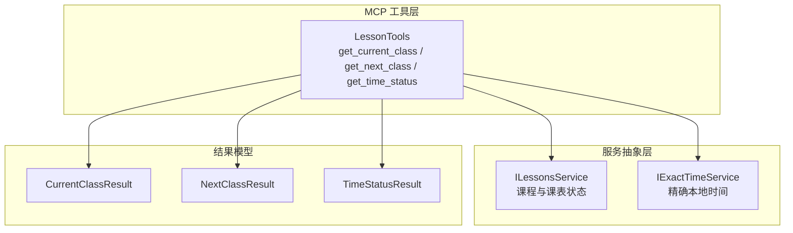
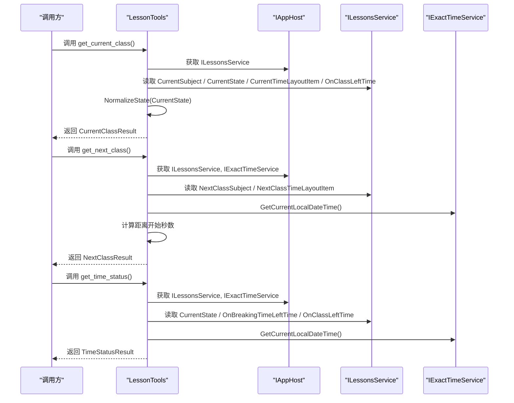
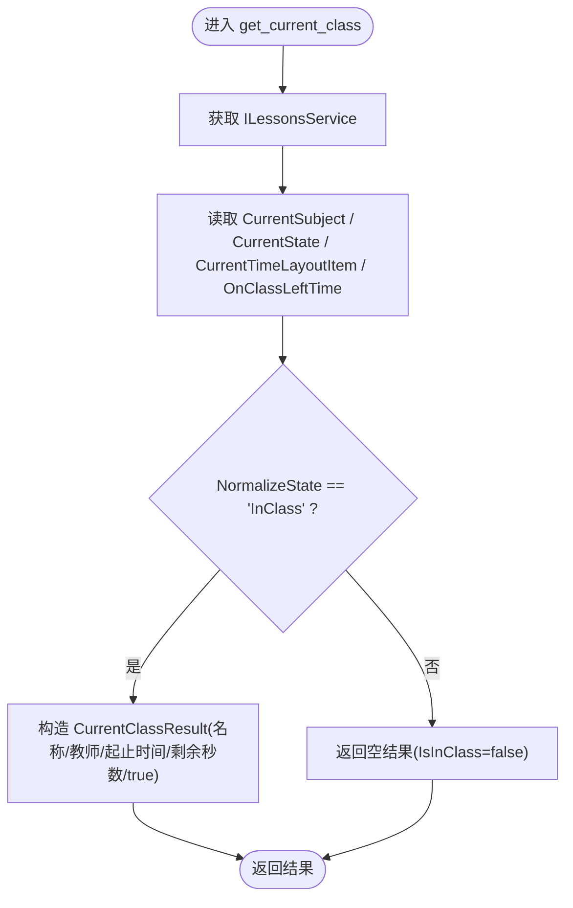
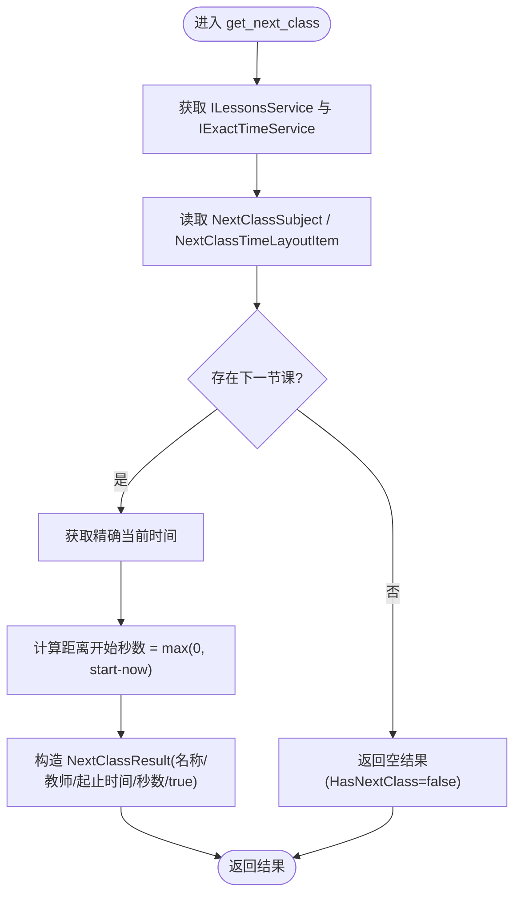
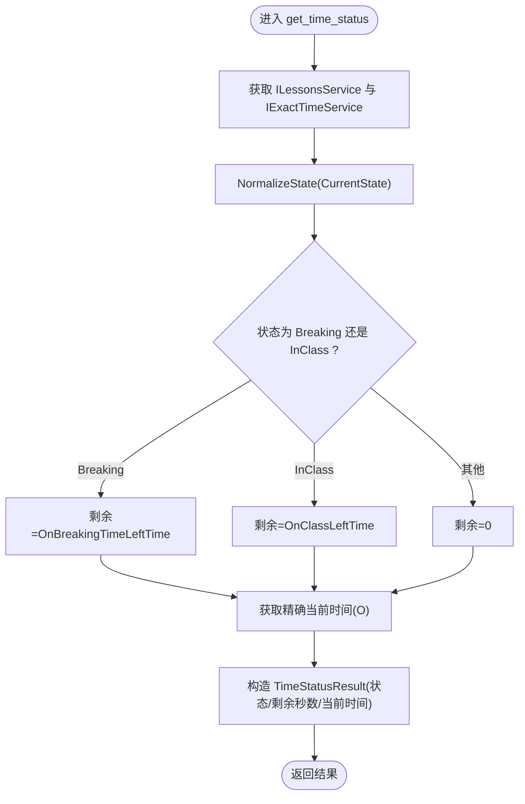
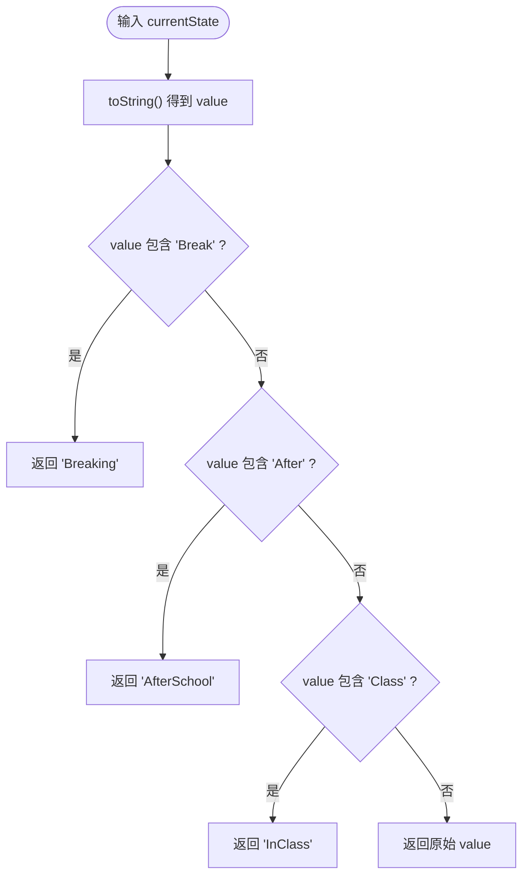
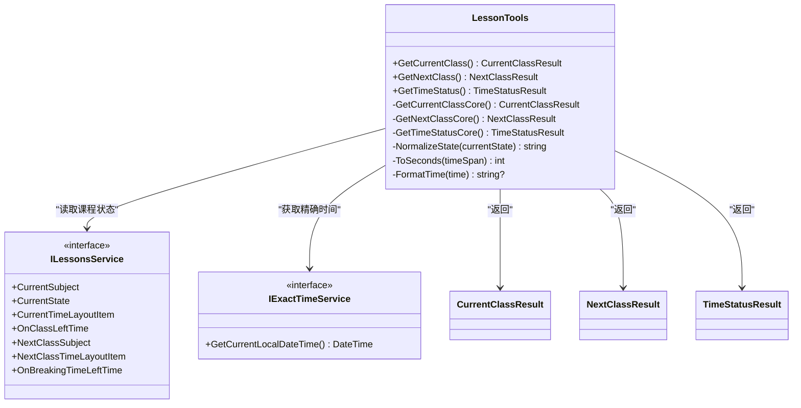

# 课程相关工具开发

<cite>
**本文引用的文件**   
- [LessonTools.cs](file://Mcp/Tools/LessonTools.cs)
- [ToolResults.cs](file://Models/ToolResults.cs)
- [ClassChangeService.cs](file://reference/IslandMQ/IslandMQ.Core/utils/ClassChangeService.cs)
- [README.md](file://reference/IslandMQ/sample/README.md)
</cite>

## 目录
1. [简介](#简介)
2. [项目结构](#项目结构)
3. [核心组件](#核心组件)
4. [架构总览](#架构总览)
5. [详细组件分析](#详细组件分析)
6. [依赖关系分析](#依赖关系分析)
7. [性能与线程模型](#性能与线程模型)
8. [故障排查指南](#故障排查指南)
9. [结论](#结论)
10. [附录：使用示例与最佳实践](#附录使用示例与最佳实践)

## 简介
本指南面向在 AgentIsland 项目中开发与课程相关的 MCP 工具，重点围绕 LessonTools 类中的三个核心工具方法：
- get_current_class（当前课程查询）
- get_next_class（下一节课查询）
- get_time_status（时间状态查询）

文档将详细说明 ILessonsService 和 IExactTimeService 的使用方式、课程数据获取与时间计算逻辑、结果模型 CurrentClassResult、NextClassResult、TimeStatusResult 的语义与用法，并解释 NormalizeState 方法的业务规则与时间格式化技巧。文末提供常见使用场景与最佳实践建议。

## 项目结构
与本课程工具直接相关的代码位于以下位置：
- Mcp/Tools/LessonTools.cs：实现三个 MCP 工具方法与内部辅助逻辑
- Models/ToolResults.cs：定义工具返回的结果记录类型
- reference/IslandMQ/...：参考实现与接口使用示例，帮助理解 ILessonsService 与 IExactTimeService 的行为

图表来源
- [LessonTools.cs:12-146](file://Mcp/Tools/LessonTools.cs#L12-L146)
- [ToolResults.cs:3-23](file://Models/ToolResults.cs#L3-L23)

章节来源
- [LessonTools.cs:1-146](file://Mcp/Tools/LessonTools.cs#L1-L146)
- [ToolResults.cs:1-59](file://Models/ToolResults.cs#L1-L59)

## 核心组件
- LessonTools：封装三个只读 MCP 工具方法，负责从 ILessonsService 读取课程与时间信息，结合 IExactTimeService 进行时间计算，并以标准化结果模型返回。
- ILessonsService：提供当前/下一节课程、当前时间点布局、剩余时间、当前状态等课程相关数据。
- IExactTimeService：提供精确的本地当前时间，用于计算相对秒数与输出 ISO 格式时间字符串。
- 结果模型：
  - CurrentClassResult：描述“当前课程”的名称、教师、起止时间、剩余秒数、是否正在上课。
  - NextClassResult：描述“下一节课”的名称、教师、起止时间、距离开始的秒数、是否存在下一节课。
  - TimeStatusResult：描述当前状态、剩余秒数、当前时间（ISO 格式）。

章节来源
- [LessonTools.cs:12-146](file://Mcp/Tools/LessonTools.cs#L12-L146)
- [ToolResults.cs:3-23](file://Models/ToolResults.cs#L3-L23)

## 架构总览
LessonTools 通过 IAppHost 解析服务实例，并在 UI 线程中执行对 ILessonsService 的访问，以避免跨线程访问问题；同时借助 IExactTimeService 获取精确时间以完成时间差计算。NormalizeState 将底层枚举或字符串状态规范化为统一的状态值，便于上层消费。

图表来源
- [LessonTools.cs:14-113](file://Mcp/Tools/LessonTools.cs#L14-L113)

## 详细组件分析

### 工具方法一：get_current_class（当前课程查询）
- 功能要点
  - 从 ILessonsService 获取当前科目、当前状态、当前时间点布局与剩余时间。
  - 若当前无科目或状态非“InClass”，返回空信息与 IsInClass=false。
  - 否则返回科目名称、教师、起止时间（hh:mm:ss）、距下课剩余秒数、IsInClass=true。
- 关键逻辑
  - 使用 NormalizeState 将底层状态归一化为 InClass/Breaking/AfterSchool 等。
  - 时间字段通过 FormatTime 转换为 hh:mm:ss 字符串。
  - 剩余秒数通过 ToSeconds 确保非负。
- 线程模型
  - 通过 UiThreadHelper.RunOnUi 在 UI 线程执行，避免跨线程访问。

图表来源
- [LessonTools.cs:22-45](file://Mcp/Tools/LessonTools.cs#L22-L45)

章节来源
- [LessonTools.cs:22-45](file://Mcp/Tools/LessonTools.cs#L22-L45)
- [ToolResults.cs:3-9](file://Models/ToolResults.cs#L3-L9)

### 工具方法二：get_next_class（下一节课查询）
- 功能要点
  - 从 ILessonsService 获取下一节课的科目与时间点布局。
  - 使用 IExactTimeService.GetCurrentLocalDateTime() 获取当前精确时间。
  - 计算距离下一节课开始的秒数（非负），并返回 HasNextClass 标志。
- 关键逻辑
  - 若下一节课信息缺失，返回空结果与 HasNextClass=false。
  - 起止时间同样采用 FormatTime 格式化。
- 线程模型
  - 通过 UiThreadHelper.RunOnUi 在 UI 线程执行。

图表来源
- [LessonTools.cs:55-83](file://Mcp/Tools/LessonTools.cs#L55-L83)

章节来源
- [LessonTools.cs:55-83](file://Mcp/Tools/LessonTools.cs#L55-L83)
- [ToolResults.cs:11-17](file://Models/ToolResults.cs#L11-L17)

### 工具方法三：get_time_status（时间状态查询）
- 功能要点
  - 根据 NormalizeState 判断当前状态，选择对应的剩余时间：
    - Breaking：OnBreakingTimeLeftTime
    - InClass：OnClassLeftTime
    - 其他：0
  - 返回当前状态、剩余秒数与当前时间（ISO 格式）。
- 关键逻辑
  - 使用 IExactTimeService.GetCurrentLocalDateTime().ToString("O") 输出标准时间字符串。
- 线程模型
  - 通过 UiThreadHelper.RunOnUi 在 UI 线程执行。

图表来源
- [LessonTools.cs:93-113](file://Mcp/Tools/LessonTools.cs#L93-L113)

章节来源
- [LessonTools.cs:93-113](file://Mcp/Tools/LessonTools.cs#L93-L113)
- [ToolResults.cs:19-23](file://Models/ToolResults.cs#L19-L23)

### NormalizeState 业务逻辑与时间格式化技巧
- NormalizeState
  - 将底层状态字符串按关键字匹配归一化：
    - 包含 Break → "Breaking"
    - 包含 After → "AfterSchool"
    - 包含 Class → "InClass"
    - 否则原样返回
- 时间格式化
  - FormatTime(TimeSpan?) 将 TimeSpan 格式化为 "hh:mm:ss" 字符串，空值返回 null。
  - ToSeconds(TimeSpan) 将 TimeSpan 转为整型秒数，且保证非负。

图表来源
- [LessonTools.cs:115-134](file://Mcp/Tools/LessonTools.cs#L115-L134)

章节来源
- [LessonTools.cs:115-144](file://Mcp/Tools/LessonTools.cs#L115-L144)

## 依赖关系分析
- LessonTools 依赖：
  - ILessonsService：提供课程与课表状态、时间点布局、剩余时间等。
  - IExactTimeService：提供精确本地时间。
  - UiThreadHelper：确保在 UI 线程执行。
  - ILogger：调试日志。
  - SentryTelemetryService：可选的性能与错误追踪包装。
- 结果模型：
  - CurrentClassResult、NextClassResult、TimeStatusResult 由 ToolResults.cs 定义。

图表来源
- [LessonTools.cs:12-146](file://Mcp/Tools/LessonTools.cs#L12-L146)
- [ToolResults.cs:3-23](file://Models/ToolResults.cs#L3-L23)

章节来源
- [LessonTools.cs:12-146](file://Mcp/Tools/LessonTools.cs#L12-L146)
- [ToolResults.cs:3-23](file://Models/ToolResults.cs#L3-L23)

## 性能与线程模型
- UI 线程约束
  - 所有对 ILessonsService 的访问均在 UiThreadHelper.RunOnUi 中执行，避免跨线程访问导致的异常或死锁。
- 时间计算
  - 使用 IExactTimeService 提供的精确时间，减少系统时钟漂移带来的误差。
- 返回值设计
  - 剩余秒数与距离开始秒数均取非负整数，简化上层处理。
- 可观测性
  - 通过 SentryTelemetryService.WithInstrumentation 包裹核心方法，便于采集性能与错误指标。

[本节为通用指导，不直接分析具体文件]

## 故障排查指南
- 常见问题
  - 未加载课表或当前无课程：get_current_class 会返回 IsInClass=false 的空结果；get_next_class 会返回 HasNextClass=false。
  - 状态不一致：检查 NormalizeState 的匹配规则，确认底层状态字符串是否符合预期。
  - 时间偏差：确认 IExactTimeService 可用，并使用其 GetCurrentLocalDateTime 而非系统时间。
- 定位建议
  - 启用调试日志，观察工具入口的 LogDebug 输出。
  - 检查 ILessonsService 的 CurrentState、CurrentSubject、NextClassSubject 是否为空。
  - 对比 FormatTime 的输出是否符合 hh:mm:ss 期望。

章节来源
- [LessonTools.cs:22-45](file://Mcp/Tools/LessonTools.cs#L22-L45)
- [LessonTools.cs:55-83](file://Mcp/Tools/LessonTools.cs#L55-L83)
- [LessonTools.cs:93-113](file://Mcp/Tools/LessonTools.cs#L93-L113)

## 结论
LessonTools 通过统一的工具方法暴露课程与时间状态能力，结合 ILessonsService 与 IExactTimeService 提供稳定、易用的数据源。NormalizeState 与时间格式化方法增强了结果的规范性与可读性。建议在集成时遵循 UI 线程约束与精确时间获取策略，以获得一致且可靠的体验。

[本节为总结性内容，不直接分析具体文件]

## 附录：使用示例与最佳实践

- 使用示例（概念性说明）
  - 获取当前课程：调用 get_current_class，若 IsInClass 为 true，则使用 SubjectName、TeacherName、StartTime、EndTime、RemainingSeconds 展示当前上课信息。
  - 获取下一节课：调用 get_next_class，若 HasNextClass 为 true，则使用 SecondsUntilStart 做倒计时提示。
  - 获取时间状态：调用 get_time_status，根据 CurrentState 显示“上课中/课间/放学后”等状态，并结合 RemainingSeconds 与 CurrentTime 展示。

- 最佳实践
  - 始终在 UI 线程访问课程服务（已由工具内部保证）。
  - 使用 IExactTimeService 的时间作为基准，避免系统时间漂移。
  - 对返回的空结果进行防御性处理（如空字符串与 false 标志）。
  - 利用 NormalizeState 的三种归一化状态进行分支逻辑，保持上层一致性。

- 参考接口行为与数据结构
  - ILessonsService 的典型属性与事件可在参考实现中看到使用方式，例如订阅课时事件、读取当前/下一节课与时间点布局等。
  - 结果模型字段含义与取值范围可参考 README 中对课程数据的说明。

章节来源
- [ClassChangeService.cs:10-130](file://reference/IslandMQ/IslandMQ.Core/utils/ClassChangeService.cs#L10-L130)
- [README.md:188-296](file://reference/IslandMQ/sample/README.md#L188-L296)