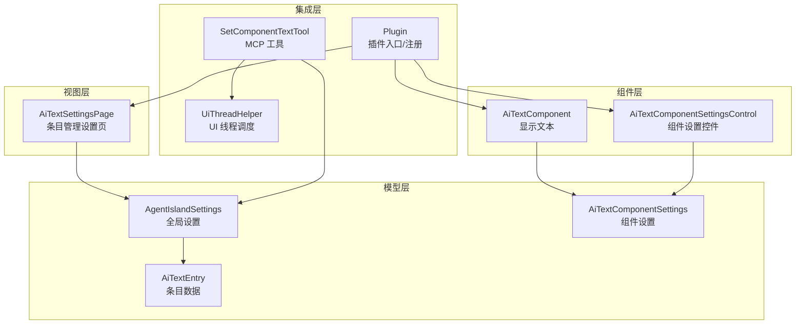
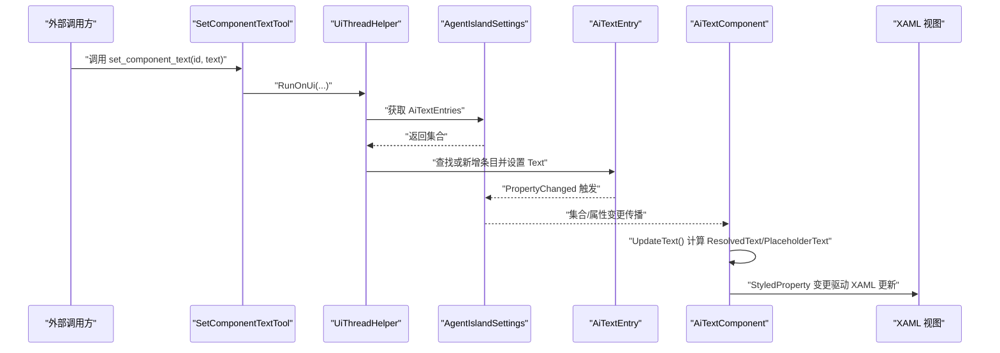
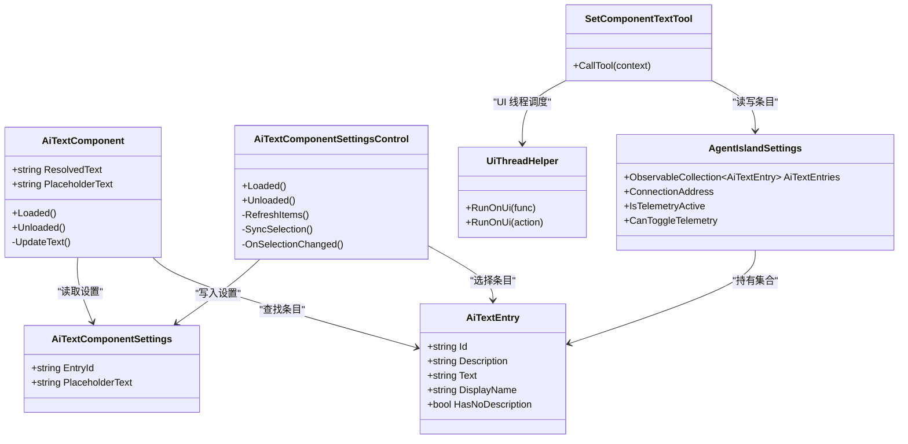
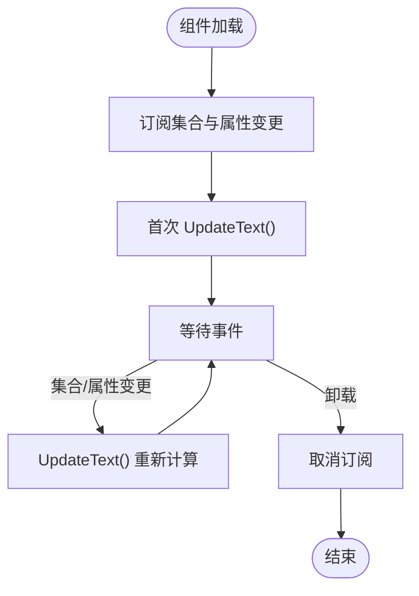
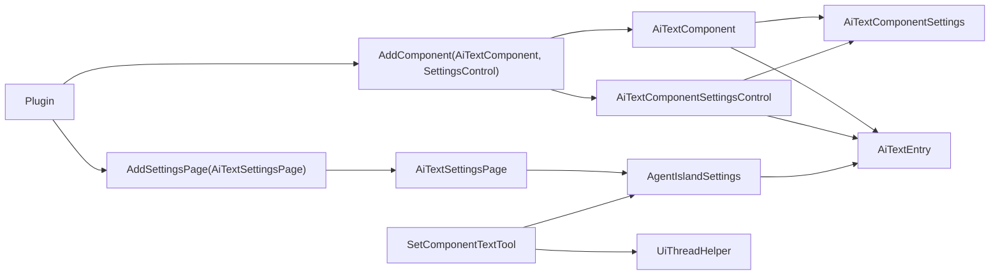

# UI 组件开发

<cite>
**本文引用的文件**   
- [AiTextComponent.axaml](file://Components/AiTextComponent.axaml)
- [AiTextComponent.axaml.cs](file://Components/AiTextComponent.axaml.cs)
- [AiTextComponentSettingsControl.axaml](file://Components/AiTextComponentSettingsControl.axaml)
- [AiTextComponentSettingsControl.axaml.cs](file://Components/AiTextComponentSettingsControl.axaml.cs)
- [AiTextEntry.cs](file://Models/AiTextEntry.cs)
- [AiTextComponentSettings.cs](file://Models/AiTextComponentSettings.cs)
- [AgentIslandSettings.cs](file://Models/AgentIslandSettings.cs)
- [Plugin.cs](file://Plugin.cs)
- [UiThreadHelper.cs](file://Helpers/UiThreadHelper.cs)
- [SetComponentTextTool.cs](file://Mcp/Tools/SetComponentTextTool.cs)
- [AiTextSettingsPage.axaml](file://Views/SettingsPages/AiTextSettingsPage.axaml)
- [AiTextSettingsPage.axaml.cs](file://Views/SettingsPages/AiTextSettingsPage.axaml.cs)
</cite>

## 目录
1. [简介](#简介)
2. [项目结构](#项目结构)
3. [核心组件](#核心组件)
4. [架构总览](#架构总览)
5. [详细组件分析](#详细组件分析)
6. [依赖关系分析](#依赖关系分析)
7. [性能与内存管理](#性能与内存管理)
8. [故障排查指南](#故障排查指南)
9. [结论](#结论)
10. [附录：样式与主题、设置页与持久化](#附录样式与主题设置页与持久化)

## 简介
本指南面向 Avalonia UI 组件开发者，基于仓库中的“AI 文字”组件示例，系统讲解如何创建自定义 UI 组件（XAML + C#）、实现数据绑定（含双向绑定与属性变更通知）、事件处理与状态管理、样式定制与主题支持、设置界面开发与配置持久化，以及性能优化与内存管理最佳实践。读者可据此快速上手并扩展更多组件。

## 项目结构
本项目采用按功能域组织的方式：
- Components：UI 组件及其设置控件
- Models：数据模型与全局设置
- Views/SettingsPages：设置页面
- Mcp/Tools：MCP 工具（用于外部更新组件内容）
- Helpers：跨线程 UI 访问辅助
- Plugin：插件入口、服务注册与生命周期

图表来源
- [Plugin.cs:1-114](file://Plugin.cs#L1-L114)
- [AiTextComponent.axaml.cs:1-85](file://Components/AiTextComponent.axaml.cs#L1-L85)
- [AiTextComponentSettingsControl.axaml.cs:1-53](file://Components/AiTextComponentSettingsControl.axaml.cs#L1-L53)
- [AiTextSettingsPage.axaml.cs:1-36](file://Views/SettingsPages/AiTextSettingsPage.axaml.cs#L1-L36)
- [AgentIslandSettings.cs:1-394](file://Models/AgentIslandSettings.cs#L1-L394)
- [AiTextEntry.cs:1-31](file://Models/AiTextEntry.cs#L1-L31)
- [AiTextComponentSettings.cs:1-13](file://Models/AiTextComponentSettings.cs#L1-L13)
- [SetComponentTextTool.cs:1-92](file://Mcp/Tools/SetComponentTextTool.cs#L1-L92)
- [UiThreadHelper.cs:1-25](file://Helpers/UiThreadHelper.cs#L1-L25)

章节来源
- [Plugin.cs:1-114](file://Plugin.cs#L1-L114)

## 核心组件
- AiTextComponent：展示由 AI 管理的文字，支持占位符；通过 StyledProperty 暴露 ResolvedText 与 PlaceholderText，并在 Loaded/Unloaded 中订阅集合与属性变更事件以驱动刷新。
- AiTextComponentSettingsControl：为组件提供设置能力，包括选择绑定的条目与设置占位文字。
- AiTextEntry：单个条目的数据模型，包含 Id、Description、Text 等字段，使用 ObservableObject 与 [ObservableProperty] 生成变更通知。
- AiTextComponentSettings：组件级设置，包含 EntryId 与 PlaceholderText，继承自 ObservableRecipient，便于在设置对象内部进行消息通信（当前未使用）。
- AgentIslandSettings：全局设置，维护 AiTextEntries 集合，并在集合变化时转发 PropertyChanged，确保 UI 响应。

章节来源
- [AiTextComponent.axaml.cs:1-85](file://Components/AiTextComponent.axaml.cs#L1-L85)
- [AiTextComponentSettingsControl.axaml.cs:1-53](file://Components/AiTextComponentSettingsControl.axaml.cs#L1-L53)
- [AiTextEntry.cs:1-31](file://Models/AiTextEntry.cs#L1-L31)
- [AiTextComponentSettings.cs:1-13](file://Models/AiTextComponentSettings.cs#L1-L13)
- [AgentIslandSettings.cs:1-394](file://Models/AgentIslandSettings.cs#L1-L394)

## 架构总览
下图展示了从 MCP 工具到 UI 的完整调用链：外部通过 MCP 工具更新条目文本，触发集合或属性变更，组件监听后计算最终显示文本并更新 UI。

图表来源
- [SetComponentTextTool.cs:1-92](file://Mcp/Tools/SetComponentTextTool.cs#L1-L92)
- [UiThreadHelper.cs:1-25](file://Helpers/UiThreadHelper.cs#L1-L25)
- [AgentIslandSettings.cs:1-394](file://Models/AgentIslandSettings.cs#L1-L394)
- [AiTextComponent.axaml.cs:1-85](file://Components/AiTextComponent.axaml.cs#L1-L85)
- [AiTextComponent.axaml:1-20](file://Components/AiTextComponent.axaml#L1-L20)

## 详细组件分析

### 组件类图（代码级）

图表来源
- [AiTextComponent.axaml.cs:1-85](file://Components/AiTextComponent.axaml.cs#L1-L85)
- [AiTextComponentSettingsControl.axaml.cs:1-53](file://Components/AiTextComponentSettingsControl.axaml.cs#L1-L53)
- [AiTextEntry.cs:1-31](file://Models/AiTextEntry.cs#L1-L31)
- [AiTextComponentSettings.cs:1-13](file://Models/AiTextComponentSettings.cs#L1-L13)
- [AgentIslandSettings.cs:1-394](file://Models/AgentIslandSettings.cs#L1-L394)
- [SetComponentTextTool.cs:1-92](file://Mcp/Tools/SetComponentTextTool.cs#L1-L92)
- [UiThreadHelper.cs:1-25](file://Helpers/UiThreadHelper.cs#L1-L25)

章节来源
- [AiTextComponent.axaml.cs:1-85](file://Components/AiTextComponent.axaml.cs#L1-L85)
- [AiTextComponentSettingsControl.axaml.cs:1-53](file://Components/AiTextComponentSettingsControl.axaml.cs#L1-L53)
- [AiTextEntry.cs:1-31](file://Models/AiTextEntry.cs#L1-L31)
- [AiTextComponentSettings.cs:1-13](file://Models/AiTextComponentSettings.cs#L1-L13)
- [AgentIslandSettings.cs:1-394](file://Models/AgentIslandSettings.cs#L1-L394)
- [SetComponentTextTool.cs:1-92](file://Mcp/Tools/SetComponentTextTool.cs#L1-L92)
- [UiThreadHelper.cs:1-25](file://Helpers/UiThreadHelper.cs#L1-L25)

### 数据绑定机制
- 单向绑定（组件显示）：XAML 通过 RelativeSource 绑定到组件的 StyledProperty（ResolvedText、PlaceholderText），当后台计算并 SetValue 后，UI 自动刷新。
- 双向绑定（设置控件）：TextBox 的 Text 使用 TwoWay 模式绑定到 Settings.PlaceholderText，用户输入直接回写至设置对象。
- 属性变更通知：
  - 模型层：AiTextEntry 使用 [ObservableProperty] 自动生成属性变更通知；AiTextComponentSettings 同样使用 [ObservableProperty]。
  - 集合层：AgentIslandSettings 对 AiTextEntries 集合进行 Hook，将集合项的 PropertyChanged 转发给自身，从而让上层 UI 感知变化。
- 复杂派生属性：AgentIslandSettings 在 OnPropertyChanged 中根据基础属性重算 ConnectionAddress、IsTelemetryActive 等派生属性，供 UI 绑定。

章节来源
- [AiTextComponent.axaml:1-20](file://Components/AiTextComponent.axaml#L1-L20)
- [AiTextComponentSettingsControl.axaml:1-32](file://Components/AiTextComponentSettingsControl.axaml#L1-L32)
- [AiTextEntry.cs:1-31](file://Models/AiTextEntry.cs#L1-L31)
- [AiTextComponentSettings.cs:1-13](file://Models/AiTextComponentSettings.cs#L1-L13)
- [AgentIslandSettings.cs:1-394](file://Models/AgentIslandSettings.cs#L1-L394)

### 事件处理与状态管理
- 组件生命周期：
  - Loaded：订阅全局集合与设置对象的 PropertyChanged，并执行首次 UpdateText。
  - Unloaded：取消订阅，避免内存泄漏。
- 集合变更：
  - OnEntriesChanged：旧项移除订阅、新项添加订阅，随后统一刷新。
- 设置变更：
  - OnSettingsPropertyChanged：当组件设置改变时触发刷新。
- 外部更新：
  - SetComponentTextTool 通过 UiThreadHelper 在 UI 线程上修改条目，触发后续 UI 更新。

图表来源
- [AiTextComponent.axaml.cs:1-85](file://Components/AiTextComponent.axaml.cs#L1-L85)

章节来源
- [AiTextComponent.axaml.cs:1-85](file://Components/AiTextComponent.axaml.cs#L1-L85)

### 设置界面开发（条目管理与持久化）
- 设置页：AiTextSettingsPage 绑定到全局设置，提供添加/删除条目、编辑 Id/Description/Text 的能力。
- 组件设置控件：AiTextComponentSettingsControl 提供下拉选择条目与设置占位文字的界面。
- 配置持久化：
  - Plugin 初始化时加载 Settings.json，并在 Settings.PropertyChanged 时自动保存。
  - 所有模型属性均使用 SetProperty 或 [ObservableProperty]，保证变更能触发保存。

章节来源
- [AiTextSettingsPage.axaml:1-81](file://Views/SettingsPages/AiTextSettingsPage.axaml#L1-L81)
- [AiTextSettingsPage.axaml.cs:1-36](file://Views/SettingsPages/AiTextSettingsPage.axaml.cs#L1-L36)
- [AiTextComponentSettingsControl.axaml:1-32](file://Components/AiTextComponentSettingsControl.axaml#L1-L32)
- [AiTextComponentSettingsControl.axaml.cs:1-53](file://Components/AiTextComponentSettingsControl.axaml.cs#L1-L53)
- [Plugin.cs:1-114](file://Plugin.cs#L1-L114)
- [AgentIslandSettings.cs:1-394](file://Models/AgentIslandSettings.cs#L1-L394)

### 样式定制与主题支持
- 使用 FluentAvalonia 控件（如 SettingsExpander、FluentIcon）获得一致的主题外观。
- 动态资源：通过 DynamicResource 引用系统色板，适配不同主题。
- 建议：
  - 将颜色、间距、字体等抽象为资源字典，便于统一替换。
  - 使用 Classes 与 StyleSelector 实现条件样式。
  - 避免硬编码颜色，优先使用系统 Brush。

[本节为通用指导，不直接分析具体文件]

## 依赖关系分析
- 组件与模型：
  - AiTextComponent 依赖 AiTextComponentSettings 与 AiTextEntry。
  - AiTextComponentSettingsControl 依赖 AiTextComponentSettings 与 AiTextEntry。
- 全局设置：
  - AgentIslandSettings 持有 AiTextEntries 集合，并转发其变更。
- 插件与注册：
  - Plugin 注册组件、设置页与服务，负责配置加载与保存。
- 外部集成：
  - SetComponentTextTool 通过 UiThreadHelper 在 UI 线程更新模型，间接驱动 UI。

图表来源
- [Plugin.cs:1-114](file://Plugin.cs#L1-L114)
- [AiTextComponent.axaml.cs:1-85](file://Components/AiTextComponent.axaml.cs#L1-L85)
- [AiTextComponentSettingsControl.axaml.cs:1-53](file://Components/AiTextComponentSettingsControl.axaml.cs#L1-L53)
- [AiTextSettingsPage.axaml.cs:1-36](file://Views/SettingsPages/AiTextSettingsPage.axaml.cs#L1-L36)
- [AgentIslandSettings.cs:1-394](file://Models/AgentIslandSettings.cs#L1-L394)
- [AiTextEntry.cs:1-31](file://Models/AiTextEntry.cs#L1-L31)
- [AiTextComponentSettings.cs:1-13](file://Models/AiTextComponentSettings.cs#L1-L13)
- [SetComponentTextTool.cs:1-92](file://Mcp/Tools/SetComponentTextTool.cs#L1-L92)
- [UiThreadHelper.cs:1-25](file://Helpers/UiThreadHelper.cs#L1-L25)

章节来源
- [Plugin.cs:1-114](file://Plugin.cs#L1-L114)

## 性能与内存管理
- 事件订阅与释放：
  - 在 Loaded 中订阅，在 Unloaded 中取消订阅，避免内存泄漏与重复回调。
- 最小化重绘：
  - 仅在必要时更新 StyledProperty，减少不必要的 UI 刷新。
- 集合变更优化：
  - 使用 ObservableCollection 并在集合变化时批量处理订阅，避免逐项重复订阅。
- 跨线程安全：
  - 非 UI 线程修改模型时使用 UiThreadHelper.RunOnUi，避免跨线程异常。
- 大数据量列表：
  - 使用虚拟化（Avalonia ItemsControl 默认行为）与 DataTemplate 精简渲染。
- 资源复用：
  - 重用静态资源与样式，避免重复创建对象。

章节来源
- [AiTextComponent.axaml.cs:1-85](file://Components/AiTextComponent.axaml.cs#L1-L85)
- [AiTextComponentSettingsControl.axaml.cs:1-53](file://Components/AiTextComponentSettingsControl.axaml.cs#L1-L53)
- [AgentIslandSettings.cs:1-394](file://Models/AgentIslandSettings.cs#L1-L394)
- [SetComponentTextTool.cs:1-92](file://Mcp/Tools/SetComponentTextTool.cs#L1-L92)
- [UiThreadHelper.cs:1-25](file://Helpers/UiThreadHelper.cs#L1-L25)

## 故障排查指南
- 现象：外部调用 MCP 工具后 UI 未更新
  - 检查是否通过 UiThreadHelper 在 UI 线程修改模型。
  - 确认 AiTextEntry.Text 变更会触发 PropertyChanged，且 AgentIslandSettings 已转发该事件。
- 现象：设置页无法保存
  - 确认 Plugin 初始化时已加载 Settings.json 并订阅了 Settings.PropertyChanged。
  - 检查各属性是否使用 SetProperty 或 [ObservableProperty]。
- 现象：内存泄漏或重复事件
  - 检查 Loaded/Unloaded 是否正确配对订阅与取消订阅。
- 现象：样式错乱
  - 检查是否使用了 DynamicResource 与 FluentAvalonia 主题资源。

章节来源
- [SetComponentTextTool.cs:1-92](file://Mcp/Tools/SetComponentTextTool.cs#L1-L92)
- [AgentIslandSettings.cs:1-394](file://Models/AgentIslandSettings.cs#L1-L394)
- [Plugin.cs:1-114](file://Plugin.cs#L1-L114)
- [AiTextComponent.axaml.cs:1-85](file://Components/AiTextComponent.axaml.cs#L1-L85)

## 结论
通过本指南，你可以基于现有“AI 文字”组件快速掌握 Avalonia UI 组件开发的关键要点：XAML 与 C# 协同、数据绑定与变更通知、事件与状态管理、设置界面与持久化、样式与主题、以及性能与内存管理。建议在扩展新组件时遵循相同的模式，保持高内聚低耦合，并确保事件订阅的生命周期正确管理。

## 附录：样式与主题、设置页与持久化
- 样式与主题
  - 使用 FluentAvalonia 控件与 DynamicResource 提升主题一致性。
  - 将常用样式抽取为资源字典，便于复用与切换。
- 设置页与持久化
  - 设置页绑定全局设置，增删改操作直接作用于集合。
  - 插件启动时加载配置文件，并在设置变更时自动保存。

[本节为通用指导，不直接分析具体文件]