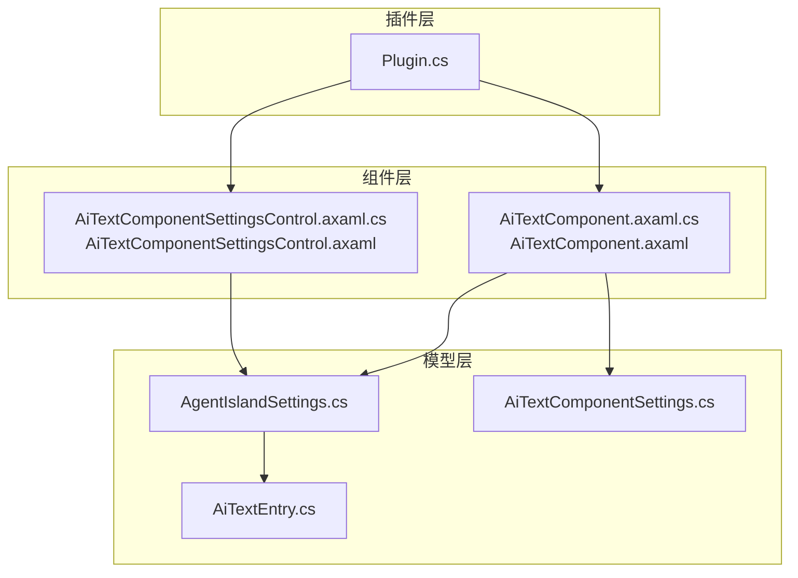
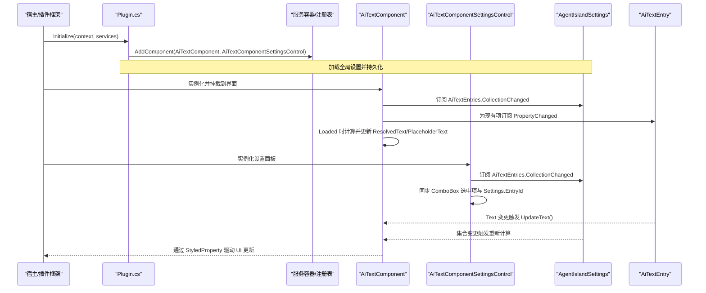
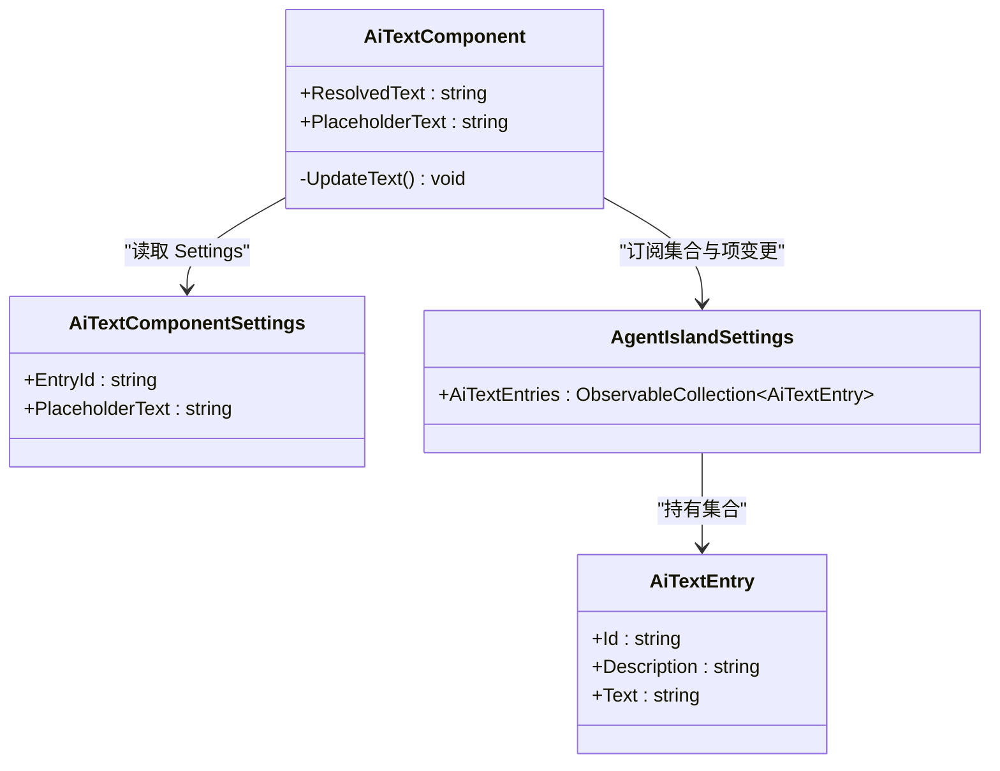
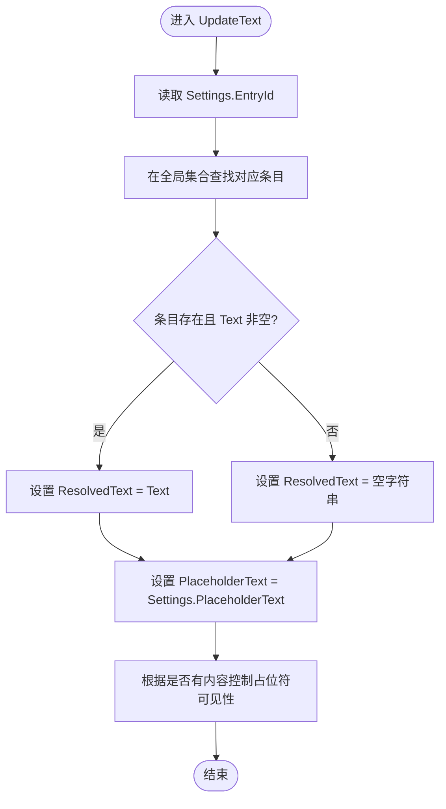
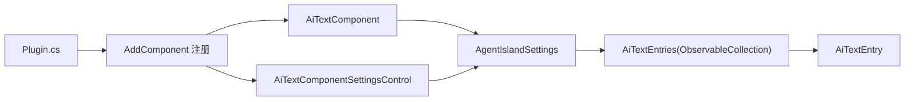

# 主组件开发

<cite>
**本文引用的文件**   
- [Plugin.cs](file://Plugin.cs)
- [AiTextComponent.axaml.cs](file://Components/AiTextComponent.axaml.cs)
- [AiTextComponent.axaml](file://Components/AiTextComponent.axaml)
- [AiTextComponentSettingsControl.axaml.cs](file://Components/AiTextComponentSettingsControl.axaml.cs)
- [AiTextComponentSettingsControl.axaml](file://Components/AiTextComponentSettingsControl.axaml)
- [AiTextComponentSettings.cs](file://Models/AiTextComponentSettings.cs)
- [AiTextEntry.cs](file://Models/AiTextEntry.cs)
- [AgentIslandSettings.cs](file://Models/AgentIslandSettings.cs)
</cite>

## 目录
1. [简介](#简介)
2. [项目结构](#项目结构)
3. [核心组件](#核心组件)
4. [架构总览](#架构总览)
5. [详细组件分析](#详细组件分析)
6. [依赖关系分析](#依赖关系分析)
7. [性能与内存管理](#性能与内存管理)
8. [故障排查指南](#故障排查指南)
9. [结论](#结论)
10. [附录：最佳实践清单](#附录最佳实践清单)

## 简介
本指南面向 Avalonia UI 主组件开发者，基于仓库中的实际实现，系统讲解如何继承 ComponentBase<TSettings> 创建自定义组件，涵盖：
- 组件生命周期管理与事件处理
- StyledProperty 的声明、注册与使用（依赖属性）
- 数据绑定机制（与设置关联、属性变更通知、集合变化监听）
- 状态管理与资源清理（防止内存泄漏）
- 组件图标与描述信息注册、插件系统集成
- 加载与卸载事件处理、动态内容更新机制

## 项目结构
本项目采用“按功能域组织”的结构：
- Components：UI 组件及其设置控件
- Models：数据模型与全局设置
- Views：设置页
- Services/Mcp：服务与 MCP 集成
- Plugin：插件入口与生命周期

图表来源
- [Plugin.cs:29-53](file://Plugin.cs#L29-L53)
- [AiTextComponent.axaml.cs:16-56](file://Components/AiTextComponent.axaml.cs#L16-L56)
- [AiTextComponentSettingsControl.axaml.cs:7-27](file://Components/AiTextComponentSettingsControl.axaml.cs#L7-L27)
- [AgentIslandSettings.cs:107-122](file://Models/AgentIslandSettings.cs#L107-L122)

章节来源
- [Plugin.cs:29-53](file://Plugin.cs#L29-L53)
- [AiTextComponent.axaml.cs:16-56](file://Components/AiTextComponent.axaml.cs#L16-L56)
- [AiTextComponentSettingsControl.axaml.cs:7-27](file://Components/AiTextComponentSettingsControl.axaml.cs#L7-L27)
- [AgentIslandSettings.cs:107-122](file://Models/AgentIslandSettings.cs#L107-L122)

## 核心组件
- AiTextComponent：展示型主组件，继承自 ComponentBase<AiTextComponentSettings>，通过 StyledProperty 暴露 ResolvedText 与 PlaceholderText，并在 Loaded/Unloaded 中订阅/取消订阅集合与属性变更。
- AiTextComponentSettingsControl：组件的设置面板，同样继承 ComponentBase<AiTextComponentSettings>，用于选择条目与编辑占位文本。
- AiTextComponentSettings：组件级设置，包含 EntryId 与 PlaceholderText。
- AgentIslandSettings：全局设置，维护 AiTextEntries 集合，并转发集合与项的属性变更。
- AiTextEntry：单个文字条目，提供 Id、Description、Text 等字段。

章节来源
- [AiTextComponent.axaml.cs:16-56](file://Components/AiTextComponent.axaml.cs#L16-L56)
- [AiTextComponentSettingsControl.axaml.cs:7-27](file://Components/AiTextComponentSettingsControl.axaml.cs#L7-L27)
- [AiTextComponentSettings.cs:5-12](file://Models/AiTextComponentSettings.cs#L5-L12)
- [AgentIslandSettings.cs:107-122](file://Models/AgentIslandSettings.cs#L107-L122)
- [AiTextEntry.cs:5-18](file://Models/AiTextEntry.cs#L5-L18)

## 架构总览
从插件注册到组件渲染的数据流如下：

图表来源
- [Plugin.cs:29-53](file://Plugin.cs#L29-L53)
- [AiTextComponent.axaml.cs:39-56](file://Components/AiTextComponent.axaml.cs#L39-L56)
- [AiTextComponentSettingsControl.axaml.cs:16-27](file://Components/AiTextComponentSettingsControl.axaml.cs#L16-L27)
- [AgentIslandSettings.cs:340-392](file://Models/AgentIslandSettings.cs#L340-L392)

## 详细组件分析

### 组件基类与注册
- 组件通过 [ComponentInfo] 特性声明 ID、名称、图标与描述，供宿主识别与展示。
- 在插件初始化阶段，通过 services.AddComponent 将组件与其设置控件注册到框架。

章节来源
- [AiTextComponent.axaml.cs:11-16](file://Components/AiTextComponent.axaml.cs#L11-L16)
- [Plugin.cs:44-44](file://Plugin.cs#L44-L44)

### 依赖属性（StyledProperty）声明与使用
- 使用 AvaloniaProperty.Register 注册两个只读对外暴露的依赖属性：ResolvedText 与 PlaceholderText。
- 组件内部通过 SetValue 更新，XAML 通过 RelativeSource 绑定到这些属性以驱动显示。

图表来源
- [AiTextComponent.axaml.cs:18-34](file://Components/AiTextComponent.axaml.cs#L18-L34)
- [AiTextComponentSettings.cs:5-12](file://Models/AiTextComponentSettings.cs#L5-L12)
- [AgentIslandSettings.cs:107-122](file://Models/AgentIslandSettings.cs#L107-L122)
- [AiTextEntry.cs:5-18](file://Models/AiTextEntry.cs#L5-L18)

章节来源
- [AiTextComponent.axaml.cs:18-34](file://Components/AiTextComponent.axaml.cs#L18-L34)
- [AiTextComponent.axaml:10-17](file://Components/AiTextComponent.axaml#L10-L17)

### 生命周期与事件处理
- Loaded：订阅全局设置的集合变更、逐项订阅属性变更、订阅自身 Settings 的变更，并执行首次更新。
- Unloaded：反向取消所有订阅，避免内存泄漏。
- 设置控件同理，在 Loaded/Unloaded 中订阅/取消订阅集合与控件事件。

章节来源
- [AiTextComponent.axaml.cs:39-56](file://Components/AiTextComponent.axaml.cs#L39-L56)
- [AiTextComponentSettingsControl.axaml.cs:16-27](file://Components/AiTextComponentSettingsControl.axaml.cs#L16-L27)

### 数据绑定与变更通知
- 组件通过 Settings.EntryId 定位当前条目，结合全局集合获取对应 Text，再根据是否为空决定 ResolvedText 与 PlaceholderText。
- 当集合或某一项的属性发生变化时，触发 UpdateText 重新计算并更新依赖属性，从而驱动 XAML 刷新。
- 设置控件通过 ComboBox 的 SelectionChanged 将用户选择写入 Settings.EntryId；同时监听集合变化以刷新下拉列表。

图表来源
- [AiTextComponent.axaml.cs:73-83](file://Components/AiTextComponent.axaml.cs#L73-L83)

章节来源
- [AiTextComponent.axaml.cs:58-83](file://Components/AiTextComponent.axaml.cs#L58-L83)
- [AiTextComponentSettingsControl.axaml.cs:29-51](file://Components/AiTextComponentSettingsControl.axaml.cs#L29-L51)
- [AgentIslandSettings.cs:340-392](file://Models/AgentIslandSettings.cs#L340-L392)

### 组件图标、描述与插件系统集成
- 组件通过 [ComponentInfo] 指定唯一 ID、显示名、图标字符与说明文本。
- 插件在 Initialize 中调用 services.AddComponent 完成注册，使宿主可发现并渲染该组件。

章节来源
- [AiTextComponent.axaml.cs:11-16](file://Components/AiTextComponent.axaml.cs#L11-L16)
- [Plugin.cs:44-44](file://Plugin.cs#L44-L44)

### 加载与卸载事件处理、动态内容更新
- 加载时建立所有必要的事件订阅，确保数据源变化能即时反映到 UI。
- 卸载时解除所有订阅，保证对象可被垃圾回收，避免内存泄漏。
- 动态更新路径：集合/项变更 → 组件回调 → UpdateText → 设置依赖属性 → XAML 自动刷新。

章节来源
- [AiTextComponent.axaml.cs:39-56](file://Components/AiTextComponent.axaml.cs#L39-L56)
- [AiTextComponent.axaml.cs:60-71](file://Components/AiTextComponent.axaml.cs#L60-L71)
- [AiTextComponent.axaml.cs:73-83](file://Components/AiTextComponent.axaml.cs#L73-L83)

## 依赖关系分析
- 组件对全局设置强依赖，需确保在 Loaded 前已初始化并可用。
- 设置控件与组件共享同一设置类型，形成“展示-配置”双向联动。
- 集合与单项均实现了变更通知，便于细粒度响应。

图表来源
- [Plugin.cs:44-44](file://Plugin.cs#L44-L44)
- [AiTextComponent.axaml.cs:16-56](file://Components/AiTextComponent.axaml.cs#L16-L56)
- [AiTextComponentSettingsControl.axaml.cs:7-27](file://Components/AiTextComponentSettingsControl.axaml.cs#L7-L27)
- [AgentIslandSettings.cs:107-122](file://Models/AgentIslandSettings.cs#L107-L122)
- [AiTextEntry.cs:5-18](file://Models/AiTextEntry.cs#L5-L18)

章节来源
- [Plugin.cs:29-53](file://Plugin.cs#L29-L53)
- [AgentIslandSettings.cs:340-392](file://Models/AgentIslandSettings.cs#L340-L392)

## 性能与内存管理
- 订阅/反订阅成对出现：Loaded 中订阅集合与项的 PropertyChanged，Unloaded 中严格解绑，避免悬挂引用导致内存泄漏。
- 仅在必要时更新：UpdateText 集中处理逻辑，减少重复计算。
- 使用 ObservableRecipient/ObservableObject 与 [ObservableProperty] 自动生成变更通知，降低样板代码与出错概率。
- 建议：
  - 在大型集合场景下，优先使用索引器或缓存最近访问项，避免频繁 LINQ 查询。
  - 对于高频更新的文本，考虑节流或合并更新批次。
  - 谨慎在构造函数中访问外部单例，尽量延迟到 Loaded 或 OnInitialized。

[本节为通用指导，不直接分析具体文件]

## 故障排查指南
- 组件未显示或内容为空：
  - 检查 Settings.EntryId 是否指向有效条目。
  - 确认全局集合已初始化且包含目标条目。
- 修改后 UI 不刷新：
  - 确认集合与项均实现了正确的变更通知。
  - 检查是否在 Loaded 中正确订阅了 CollectionChanged 与 PropertyChanged。
- 内存泄漏迹象：
  - 确认 Unloaded 中解绑了所有事件与订阅。
  - 避免在静态变量或长生命周期对象中持有组件实例引用。

章节来源
- [AiTextComponent.axaml.cs:39-56](file://Components/AiTextComponent.axaml.cs#L39-L56)
- [AiTextComponent.axaml.cs:60-71](file://Components/AiTextComponent.axaml.cs#L60-L71)
- [AgentIslandSettings.cs:340-392](file://Models/AgentIslandSettings.cs#L340-L392)

## 结论
通过继承 ComponentBase<TSettings>，配合 [ComponentInfo] 与 AddComponent 注册，可以快速构建可插拔的 Avalonia UI 组件。利用 StyledProperty 暴露依赖属性，结合集合与属性的变更通知，可实现高效、低耦合的动态内容更新。遵循生命周期内订阅/解绑的最佳实践，可有效避免内存泄漏，提升稳定性与可维护性。

[本节为总结性内容，不直接分析具体文件]

## 附录：最佳实践清单
- 组件元数据
  - 使用 [ComponentInfo] 提供稳定 ID、友好名称、图标与描述。
- 依赖属性
  - 使用 AvaloniaProperty.Register 注册 StyledProperty，并通过 get/set 包装 GetValue/SetValue。
- 数据绑定
  - 在 XAML 中使用 RelativeSource 绑定到组件自身的依赖属性。
  - 将设置对象作为 DataContext 或通过显式绑定路径访问。
- 事件与生命周期
  - 在 Loaded 中订阅集合与属性变更，在 Unloaded 中严格解绑。
  - 对集合旧项与新项分别处理订阅，避免悬挂引用。
- 状态管理
  - 将易变状态收敛到单一方法（如 UpdateText），统一触发依赖属性更新。
- 插件集成
  - 在插件 Initialize 中完成组件与设置控件的注册。
  - 将全局设置注入服务容器，供各组件与页面共享。

章节来源
- [AiTextComponent.axaml.cs:11-16](file://Components/AiTextComponent.axaml.cs#L11-L16)
- [AiTextComponent.axaml.cs:18-34](file://Components/AiTextComponent.axaml.cs#L18-L34)
- [AiTextComponent.axaml.cs:39-56](file://Components/AiTextComponent.axaml.cs#L39-L56)
- [AiTextComponent.axaml.cs:73-83](file://Components/AiTextComponent.axaml.cs#L73-L83)
- [Plugin.cs:44-44](file://Plugin.cs#L44-L44)