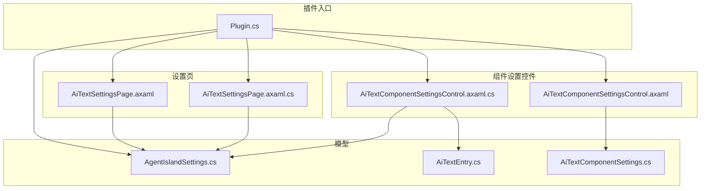
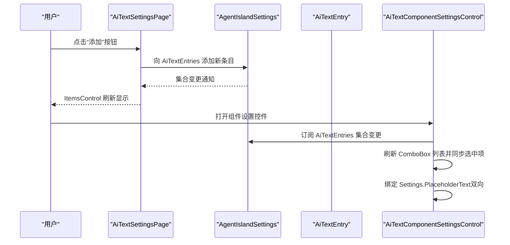
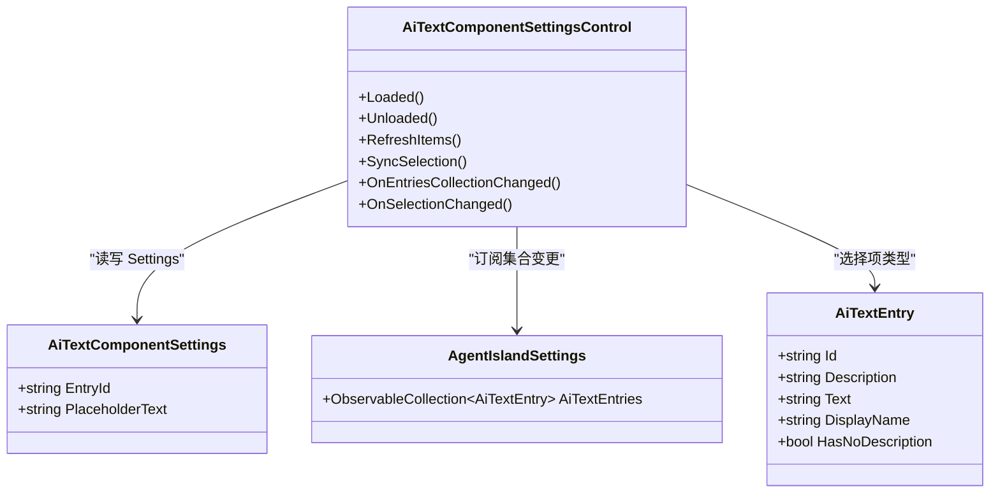
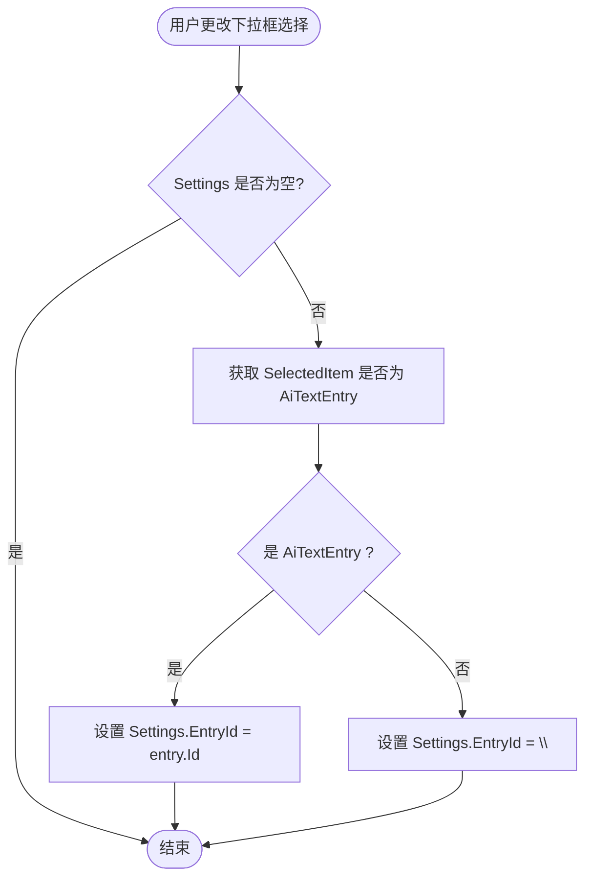
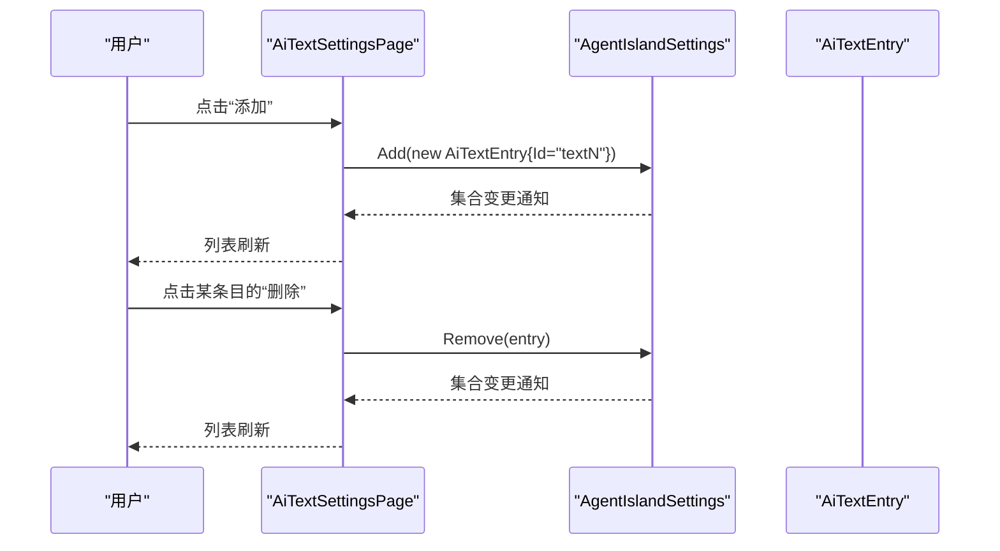
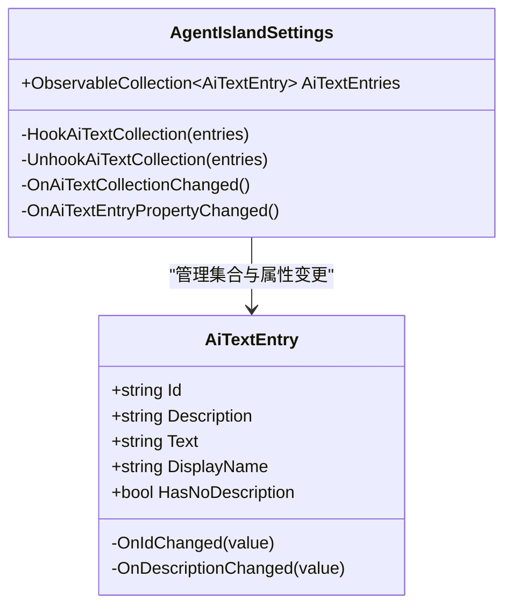
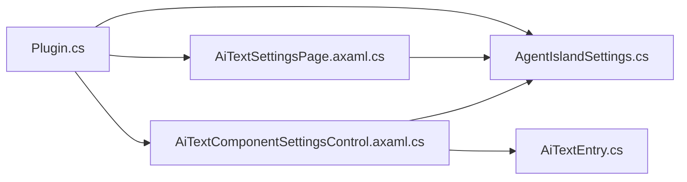

# 设置控件开发

<cite>
**本文引用的文件**   
- [Plugin.cs](file://Plugin.cs)
- [AiTextComponentSettingsControl.axaml](file://Components/AiTextComponentSettingsControl.axaml)
- [AiTextComponentSettingsControl.axaml.cs](file://Components/AiTextComponentSettingsControl.axaml.cs)
- [AiTextComponentSettings.cs](file://Models/AiTextComponentSettings.cs)
- [AiTextEntry.cs](file://Models/AiTextEntry.cs)
- [AgentIslandSettings.cs](file://Models/AgentIslandSettings.cs)
- [AiTextSettingsPage.axaml](file://Views/SettingsPages/AiTextSettingsPage.axaml)
- [AiTextSettingsPage.axaml.cs](file://Views/SettingsPages/AiTextSettingsPage.axaml.cs)
</cite>

## 目录
1. [简介](#简介)
2. [项目结构](#项目结构)
3. [核心组件](#核心组件)
4. [架构总览](#架构总览)
5. [详细组件分析](#详细组件分析)
6. [依赖关系分析](#依赖关系分析)
7. [性能与可维护性建议](#性能与可维护性建议)
8. [故障排查指南](#故障排查指南)
9. [结论](#结论)
10. [附录：最佳实践清单](#附录最佳实践清单)

## 简介
本指南面向在 Avalonia UI 中为插件或应用开发“设置控件”的工程师，结合仓库中的实际实现，系统讲解如何构建组件的设置界面、数据绑定、生命周期管理、持久化存储、用户体验设计与样式主题集成。文档以“AI 文字条目”这一功能为例，覆盖从模型到页面、从控件到全局设置的完整链路，帮助读者快速掌握一套可复用的模式。

## 项目结构
本项目采用按功能域组织的方式，将设置相关的视图与模型分层清晰：
- 组件设置控件：位于 Components 下，用于嵌入到具体组件的配置面板中
- 设置页：位于 Views/SettingsPages 下，作为独立的全局设置入口
- 模型：位于 Models 下，承载配置项与集合，提供属性变更通知
- 插件入口：负责加载/保存配置、注册设置页与组件

图表来源
- [Plugin.cs:29-53](file://Plugin.cs#L29-L53)
- [AiTextSettingsPage.axaml:1-81](file://Views/SettingsPages/AiTextSettingsPage.axaml#L1-L81)
- [AiTextSettingsPage.axaml.cs:1-36](file://Views/SettingsPages/AiTextSettingsPage.axaml.cs#L1-L36)
- [AiTextComponentSettingsControl.axaml:1-32](file://Components/AiTextComponentSettingsControl.axaml#L1-L32)
- [AiTextComponentSettingsControl.axaml.cs:1-53](file://Components/AiTextComponentSettingsControl.axaml.cs#L1-L53)
- [AgentIslandSettings.cs:1-394](file://Models/AgentIslandSettings.cs#L1-L394)
- [AiTextEntry.cs:1-31](file://Models/AiTextEntry.cs#L1-L31)
- [AiTextComponentSettings.cs:1-13](file://Models/AiTextComponentSettings.cs#L1-L13)

章节来源
- [Plugin.cs:29-53](file://Plugin.cs#L29-L53)
- [AiTextSettingsPage.axaml:1-81](file://Views/SettingsPages/AiTextSettingsPage.axaml#L1-L81)
- [AiTextSettingsPage.axaml.cs:1-36](file://Views/SettingsPages/AiTextSettingsPage.axaml.cs#L1-L36)
- [AiTextComponentSettingsControl.axaml:1-32](file://Components/AiTextComponentSettingsControl.axaml#L1-L32)
- [AiTextComponentSettingsControl.axaml.cs:1-53](file://Components/AiTextComponentSettingsControl.axaml.cs#L1-L53)
- [AgentIslandSettings.cs:1-394](file://Models/AgentIslandSettings.cs#L1-L394)
- [AiTextEntry.cs:1-31](file://Models/AiTextEntry.cs#L1-L31)
- [AiTextComponentSettings.cs:1-13](file://Models/AiTextComponentSettings.cs#L1-L13)

## 核心组件
本节聚焦于“AI 文字条目”相关的关键类与控件，说明其职责与交互方式。

- 全局设置模型 AgentIslandSettings
  - 暴露 AI 文字条目集合 AiTextEntries（ObservableCollection），并在集合增删时触发属性变更，驱动 UI 刷新
  - 使用 JsonPropertyName 标注字段名，便于 JSON 序列化
  - 提供派生属性（如连接地址、遥测状态等）与自动联动逻辑

- 条目模型 AiTextEntry
  - 包含 Id、Description、Text 等字段，并提供 DisplayName 与 HasNoDescription 两个只读计算属性
  - 通过 partial 方法在 Id/Description 变化时更新派生属性

- 组件设置模型 AiTextComponentSettings
  - 继承自 ObservableRecipient，持有 EntryId 与 PlaceholderText 两个可观察属性
  - 用于组件级个性化设置（例如当前组件绑定的条目 ID 与占位文本）

- 组件设置控件 AiTextComponentSettingsControl
  - 继承自 ComponentBase<AiTextComponentSettings>，提供 Settings 访问器
  - 在 Loaded 时绑定全局条目集合，并同步选择项；在 Unloaded 时解绑事件，避免内存泄漏
  - 通过 RelativeSource 绑定到父控件的 Settings.PlaceholderText，实现双向绑定

- 设置页 AiTextSettingsPage
  - 继承自 SettingsPageBase，使用 [SettingsPageInfo] 特性注册到设置中心
  - 将 DataContext 设置为全局设置对象，直接操作集合进行添加/删除

章节来源
- [AgentIslandSettings.cs:104-122](file://Models/AgentIslandSettings.cs#L104-L122)
- [AgentIslandSettings.cs:340-392](file://Models/AgentIslandSettings.cs#L340-L392)
- [AiTextEntry.cs:1-31](file://Models/AiTextEntry.cs#L1-L31)
- [AiTextComponentSettings.cs:1-13](file://Models/AiTextComponentSettings.cs#L1-L13)
- [AiTextComponentSettingsControl.axaml.cs:1-53](file://Components/AiTextComponentSettingsControl.axaml.cs#L1-L53)
- [AiTextSettingsPage.axaml.cs:1-36](file://Views/SettingsPages/AiTextSettingsPage.axaml.cs#L1-L36)

## 架构总览
下图展示了设置数据的流向：用户在全局设置页修改集合，组件设置控件读取并同步选择项，同时组件自身通过相对源绑定到组件级设置。

图表来源
- [AiTextSettingsPage.axaml.cs:22-34](file://Views/SettingsPages/AiTextSettingsPage.axaml.cs#L22-L34)
- [AiTextComponentSettingsControl.axaml.cs:16-42](file://Components/AiTextComponentSettingsControl.axaml.cs#L16-L42)
- [AiTextComponentSettingsControl.axaml:25-27](file://Components/AiTextComponentSettingsControl.axaml#L25-L27)

## 详细组件分析

### 组件设置控件：AiTextComponentSettingsControl
该控件负责：
- 在加载时初始化条目下拉框的数据源，并同步当前选中项
- 监听全局条目集合的增删改，动态刷新下拉框
- 当用户在下拉框中选择条目时，更新组件设置中的 EntryId
- 通过 RelativeSource 绑定到父控件的 Settings.PlaceholderText，实现占位文本的双向绑定

图表来源
- [AiTextComponentSettingsControl.axaml.cs:1-53](file://Components/AiTextComponentSettingsControl.axaml.cs#L1-L53)
- [AiTextComponentSettings.cs:1-13](file://Models/AiTextComponentSettings.cs#L1-L13)
- [AgentIslandSettings.cs:104-122](file://Models/AgentIslandSettings.cs#L104-L122)
- [AiTextEntry.cs:1-31](file://Models/AiTextEntry.cs#L1-L31)

章节来源
- [AiTextComponentSettingsControl.axaml.cs:1-53](file://Components/AiTextComponentSettingsControl.axaml.cs#L1-L53)
- [AiTextComponentSettingsControl.axaml:1-32](file://Components/AiTextComponentSettingsControl.axaml#L1-L32)

#### 关键流程：选择条目时的处理

图表来源
- [AiTextComponentSettingsControl.axaml.cs:44-51](file://Components/AiTextComponentSettingsControl.axaml.cs#L44-L51)

### 设置页：AiTextSettingsPage
该页面负责：
- 注册为外部设置页，标题与分类由特性声明
- 将 DataContext 绑定到全局设置对象
- 提供“添加条目”和“删除条目”的操作，直接对全局集合进行增删

图表来源
- [AiTextSettingsPage.axaml.cs:22-34](file://Views/SettingsPages/AiTextSettingsPage.axaml.cs#L22-L34)
- [AiTextSettingsPage.axaml:25-70](file://Views/SettingsPages/AiTextSettingsPage.axaml#L25-L70)

章节来源
- [AiTextSettingsPage.axaml.cs:1-36](file://Views/SettingsPages/AiTextSettingsPage.axaml.cs#L1-L36)
- [AiTextSettingsPage.axaml:1-81](file://Views/SettingsPages/AiTextSettingsPage.axaml#L1-L81)

### 数据模型与集合管理
- AgentIslandSettings 对 AiTextEntries 集合的增删进行 Hook，确保集合内元素属性变更也能触发上层属性变更，从而驱动 UI 刷新
- AiTextEntry 的 DisplayName 与 HasNoDescription 根据 Id/Description 动态计算，减少 UI 层判断逻辑

图表来源
- [AgentIslandSettings.cs:340-392](file://Models/AgentIslandSettings.cs#L340-L392)
- [AiTextEntry.cs:16-29](file://Models/AiTextEntry.cs#L16-L29)

章节来源
- [AgentIslandSettings.cs:104-122](file://Models/AgentIslandSettings.cs#L104-L122)
- [AgentIslandSettings.cs:340-392](file://Models/AgentIslandSettings.cs#L340-L392)
- [AiTextEntry.cs:1-31](file://Models/AiTextEntry.cs#L1-L31)

## 依赖关系分析
- 插件入口 Plugin 负责：
  - 加载配置文件并注入到服务容器
  - 监听设置变更，自动保存到磁盘
  - 注册设置页与组件及其设置控件

图表来源
- [Plugin.cs:29-53](file://Plugin.cs#L29-L53)
- [AiTextSettingsPage.axaml.cs:1-36](file://Views/SettingsPages/AiTextSettingsPage.axaml.cs#L1-L36)
- [AiTextComponentSettingsControl.axaml.cs:1-53](file://Components/AiTextComponentSettingsControl.axaml.cs#L1-L53)
- [AgentIslandSettings.cs:1-394](file://Models/AgentIslandSettings.cs#L1-L394)
- [AiTextEntry.cs:1-31](file://Models/AiTextEntry.cs#L1-L31)

章节来源
- [Plugin.cs:29-53](file://Plugin.cs#L29-L53)

## 性能与可维护性建议
- 集合变更优化
  - 在大量条目场景下，避免频繁重建 ItemsSource；优先复用现有集合引用，仅做增量更新
  - 对于复杂 DataTemplate，考虑虚拟化与延迟加载
- 事件订阅管理
  - 在 Loaded/Unloaded 中成对订阅/取消订阅，防止内存泄漏
  - 对集合内元素的 PropertyChanged 也需正确 Hook/Unhook（参考 AgentIslandSettings 的实现）
- 属性变更传播
  - 使用派生属性（如 DisplayName）减少 UI 层条件判断，提升可读性与性能
- 异步与线程
  - 若涉及 I/O 或网络，确保在后台线程执行，UI 更新回到 UI 线程

[本节为通用建议，不直接分析具体文件]

## 故障排查指南
- 设置未持久化
  - 检查插件入口是否正确监听设置变更并调用保存方法
  - 确认配置文件路径存在且可写
- 下拉框未显示条目
  - 确认全局集合已赋值给控件的 ItemsSource
  - 检查集合是否实现了 INotifyCollectionChanged
- 选择后未生效
  - 核对 SelectionChanged 中是否正确写入 Settings.EntryId
  - 确认 XAML 绑定路径与类型参数一致
- 页面无法打开
  - 检查 [SettingsPageInfo] 特性是否正确注册
  - 确认 DataContext 已设置为全局设置对象

章节来源
- [Plugin.cs:31-34](file://Plugin.cs#L31-L34)
- [AiTextComponentSettingsControl.axaml.cs:16-27](file://Components/AiTextComponentSettingsControl.axaml.cs#L16-L27)
- [AiTextComponentSettingsControl.axaml.cs:44-51](file://Components/AiTextComponentSettingsControl.axaml.cs#L44-L51)
- [AiTextSettingsPage.axaml.cs:9-20](file://Views/SettingsPages/AiTextSettingsPage.axaml.cs#L9-L20)

## 结论
通过本项目的示例，可以总结出一套适用于 Avalonia UI 的设置控件开发范式：
- 使用强类型模型承载配置，配合属性变更通知驱动 UI
- 在设置页集中管理集合，在组件设置控件中按需绑定与同步
- 在插件入口统一完成配置的加载、保存与页面/控件注册
- 遵循生命周期管理原则，避免资源泄漏与重复绑定

[本节为总结性内容，不直接分析具体文件]

## 附录：最佳实践清单
- 数据绑定
  - 使用双向绑定更新用户输入，必要时加入验证规则（可在 Setter 或 ViewModel 中实现）
  - 使用 RelativeSource 跨层级绑定到父控件的 Settings 属性
- 生命周期
  - 在 Loaded 中初始化数据源与事件订阅，在 Unloaded 中清理
  - 对集合内元素的事件也要正确 Hook/Unhook
- 用户体验
  - 使用 Watermark 提示默认值与占位信息
  - 使用展开式控件分组说明与操作，保持界面简洁
  - 提供空状态提示，增强可用性
- 样式与主题
  - 使用 FluentAvalonia 的控件与图标资源，保证与系统风格一致
  - 使用 DynamicResource 与 Classes 进行主题适配
- 持久化与版本兼容
  - 使用 JsonPropertyName 控制字段名，便于向后兼容
  - 在加载失败时使用默认配置，避免崩溃
  - 在升级时进行迁移策略（如字段重命名、默认值填充）

[本节为通用指导，不直接分析具体文件]