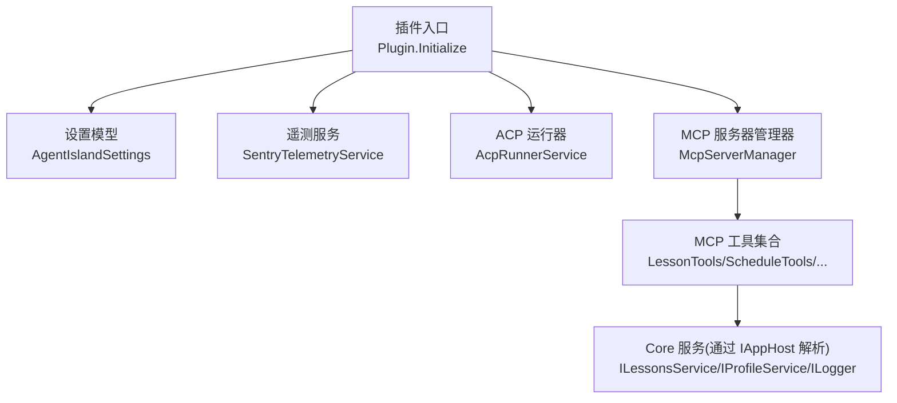
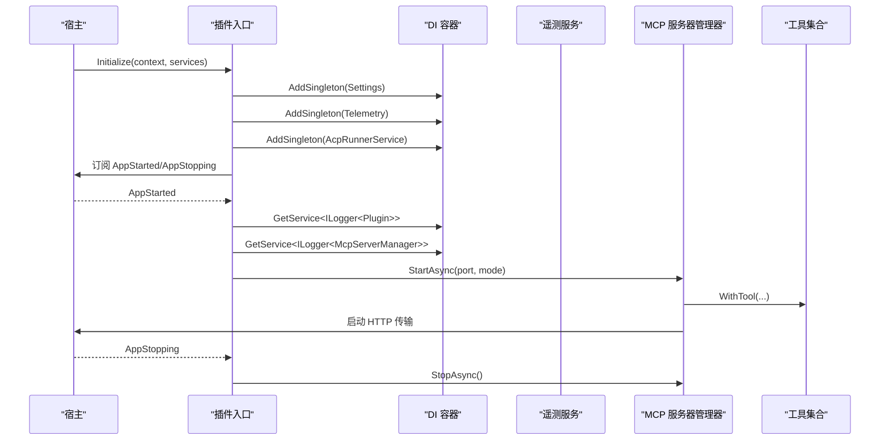
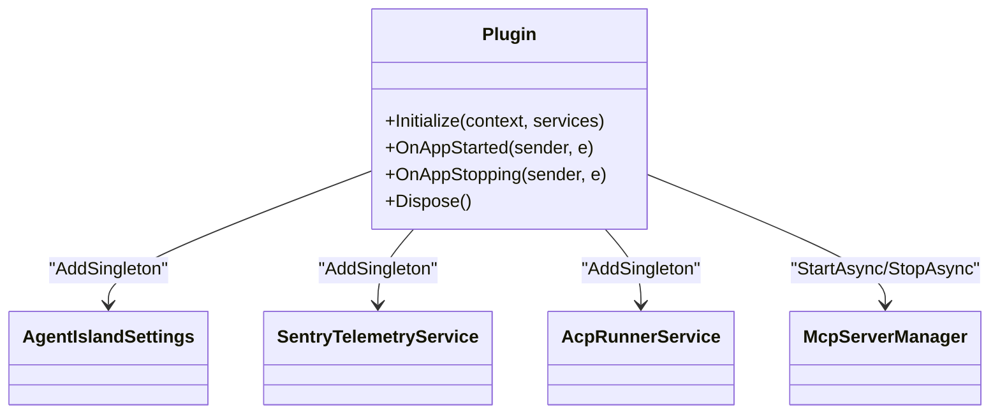
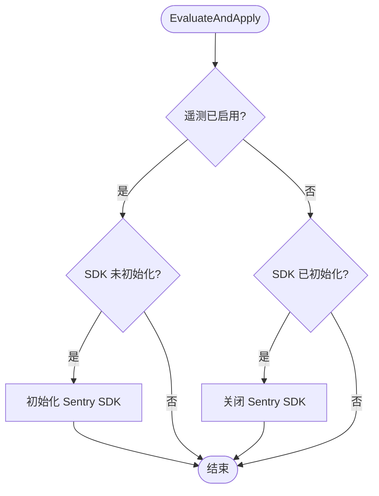
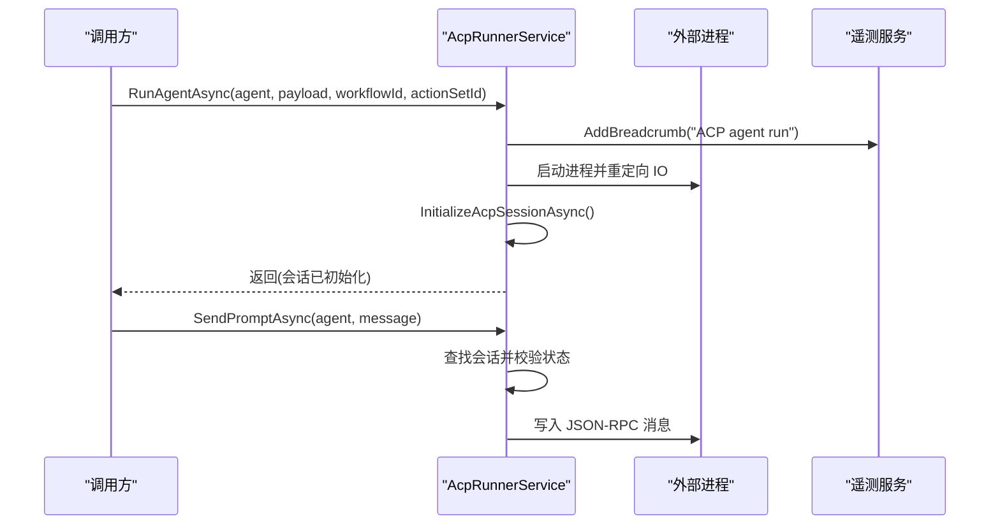
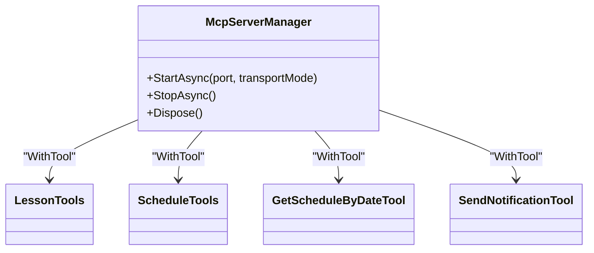
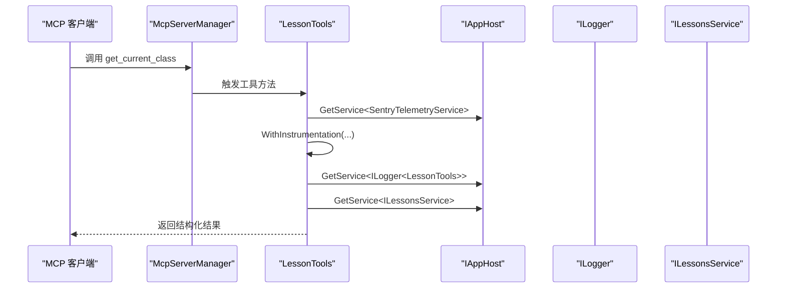
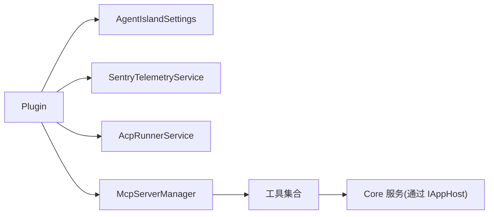
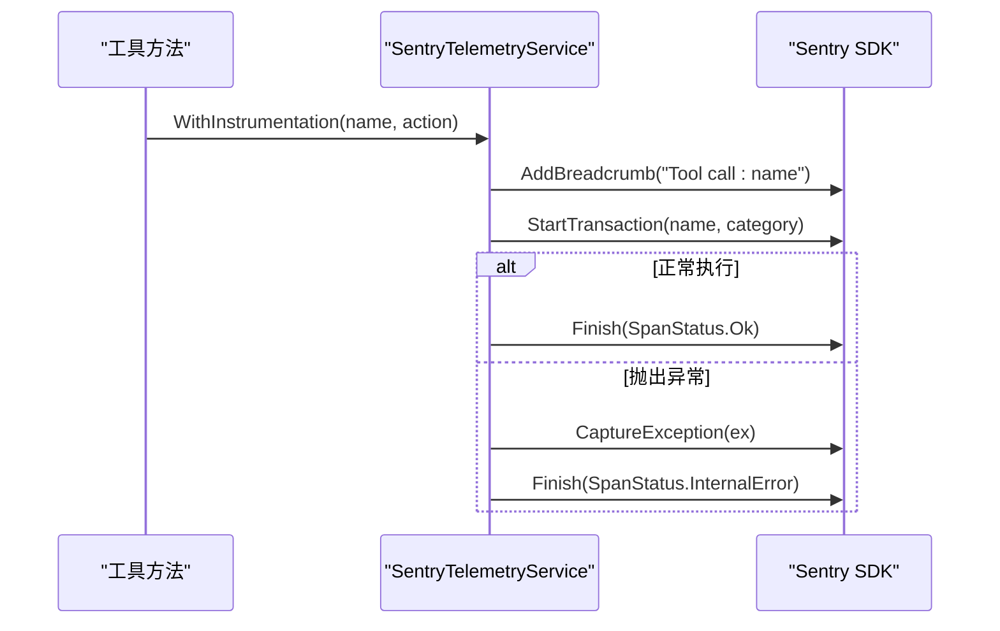

# 依赖注入容器

<cite>
**本文引用的文件**   
- [Plugin.cs](file://Plugin.cs)
- [SentryTelemetryService.cs](file://Services/SentryTelemetryService.cs)
- [AcpRunnerService.cs](file://Services/AcpRunnerService.cs)
- [McpServerManager.cs](file://Mcp/McpServerManager.cs)
- [AgentIslandSettings.cs](file://Models/AgentIslandSettings.cs)
- [LessonTools.cs](file://Mcp/Tools/LessonTools.cs)
- [ScheduleTools.cs](file://Mcp/Tools/ScheduleTools.cs)
- [GetScheduleByDateTool.cs](file://Mcp/Tools/GetScheduleByDateTool.cs)
- [SendNotificationTool.cs](file://Mcp/Tools/SendNotificationTool.cs)
</cite>

## 目录
1. [简介](#简介)
2. [项目结构](#项目结构)
3. [核心组件](#核心组件)
4. [架构总览](#架构总览)
5. [详细组件分析](#详细组件分析)
6. [依赖关系分析](#依赖关系分析)
7. [性能与生命周期管理](#性能与生命周期管理)
8. [服务工厂与条件注册](#服务工厂与条件注册)
9. [复杂依赖与循环依赖处理](#复杂依赖与循环依赖处理)
10. [服务监控与诊断](#服务监控与诊断)
11. [故障排查指南](#故障排查指南)
12. [结论](#结论)

## 简介
本技术文档围绕插件中 Microsoft.Extensions.DependencyInjection 的使用，系统阐述服务注册、生命周期管理与依赖解析实践。结合本项目实际代码，说明单例、瞬态与作用域服务的适用场景；总结服务接口设计与抽象层的重要性；给出复杂依赖关系的解决思路与避免循环依赖的策略；并提供服务工厂与条件注册的实现示例；最后介绍服务监控与诊断方法。

## 项目结构
本项目在插件入口中完成配置加载与服务注册，并在应用启动时按需启动 MCP 服务器与 ACP 运行器。关键路径：
- 插件入口：负责读取设置、注册服务、订阅应用生命周期事件
- 服务层：遥测服务、ACP 运行器
- MCP 服务器管理器：构建并启动 MCP 服务器，注册工具
- 工具层：通过 IAppHost 解析所需服务（日志、遥测、业务服务）

图表来源
- [Plugin.cs:29-53](file://Plugin.cs#L29-L53)
- [McpServerManager.cs:25-82](file://Mcp/McpServerManager.cs#L25-L82)
- [LessonTools.cs:12-45](file://Mcp/Tools/LessonTools.cs#L12-L45)
- [ScheduleTools.cs:13-56](file://Mcp/Tools/ScheduleTools.cs#L13-L56)

章节来源
- [Plugin.cs:29-53](file://Plugin.cs#L29-L53)
- [McpServerManager.cs:25-82](file://Mcp/McpServerManager.cs#L25-L82)

## 核心组件
- 插件入口：加载配置、注册服务、订阅应用启动/停止事件，按需启动 MCP 服务器
- 遥测服务：根据用户隐私策略动态初始化 Sentry SDK，提供异常捕获与事务埋点
- ACP 运行器：通过 stdio 协议与外部 Agent 进程通信，维护会话生命周期
- MCP 服务器管理器：基于 Builder 模式构建并启动 MCP 服务器，注册工具集
- 工具类：封装业务逻辑，通过 IAppHost 解析日志、遥测及核心服务

章节来源
- [Plugin.cs:29-53](file://Plugin.cs#L29-L53)
- [SentryTelemetryService.cs:11-40](file://Services/SentryTelemetryService.cs#L11-L40)
- [AcpRunnerService.cs:14-77](file://Services/AcpRunnerService.cs#L14-L77)
- [McpServerManager.cs:11-82](file://Mcp/McpServerManager.cs#L11-L82)
- [LessonTools.cs:12-45](file://Mcp/Tools/LessonTools.cs#L12-L45)
- [ScheduleTools.cs:13-56](file://Mcp/Tools/ScheduleTools.cs#L13-L56)

## 架构总览
下图展示插件初始化到 MCP 服务器运行的整体流程，以及各组件之间的交互关系。

图表来源
- [Plugin.cs:29-79](file://Plugin.cs#L29-L79)
- [McpServerManager.cs:25-82](file://Mcp/McpServerManager.cs#L25-L82)

## 详细组件分析

### 插件入口与 DI 注册
- 职责
  - 加载并持久化设置
  - 注册遥测、ACP 运行器等单例服务
  - 订阅应用生命周期事件，按需启动 MCP 服务器
- 关键点
  - 使用 AddSingleton 注册全局共享实例
  - 通过 IAppHost.GetService 解析 ILogger 等运行时服务
  - 在 AppStarted 中创建并启动 McpServerManager

图表来源
- [Plugin.cs:29-53](file://Plugin.cs#L29-L53)
- [Plugin.cs:55-97](file://Plugin.cs#L55-L97)

章节来源
- [Plugin.cs:29-53](file://Plugin.cs#L29-L53)
- [Plugin.cs:55-97](file://Plugin.cs#L55-L97)

### 遥测服务（SentryTelemetryService）
- 职责
  - 根据设置动态初始化/关闭 Sentry SDK
  - 提供异常捕获、面包屑记录、事务包裹的辅助方法
- 关键点
  - 监听设置变更，自动评估是否启用遥测
  - 提供同步/异步 WithInstrumentation 包装，统一埋点与错误上报

图表来源
- [SentryTelemetryService.cs:30-75](file://Services/SentryTelemetryService.cs#L30-L75)

章节来源
- [SentryTelemetryService.cs:11-40](file://Services/SentryTelemetryService.cs#L11-L40)
- [SentryTelemetryService.cs:77-90](file://Services/SentryTelemetryService.cs#L77-L90)
- [SentryTelemetryService.cs:127-174](file://Services/SentryTelemetryService.cs#L127-L174)

### ACP 运行器（AcpRunnerService）
- 职责
  - 启动外部 Agent 进程，建立 JSON-RPC 会话
  - 发送 Prompt 消息，管理会话生命周期
- 关键点
  - 内部维护会话列表，按 Agent 标识查找会话
  - 在 Dispose 中优雅关闭或强制终止进程

图表来源
- [AcpRunnerService.cs:25-77](file://Services/AcpRunnerService.cs#L25-L77)
- [AcpRunnerService.cs:79-100](file://Services/AcpRunnerService.cs#L79-L100)
- [AcpRunnerService.cs:102-131](file://Services/AcpRunnerService.cs#L102-L131)

章节来源
- [AcpRunnerService.cs:14-77](file://Services/AcpRunnerService.cs#L14-L77)
- [AcpRunnerService.cs:156-191](file://Services/AcpRunnerService.cs#L156-L191)

### MCP 服务器管理器（McpServerManager）
- 职责
  - 构建并启动 MCP 服务器，注册工具集
  - 支持不同传输模式（SSE/HTTP），统一异常上报与事务埋点
- 关键点
  - 使用 Builder 模式组合工具与序列化上下文
  - 根据传输模式选择端点与兼容性选项

图表来源
- [McpServerManager.cs:25-82](file://Mcp/McpServerManager.cs#L25-L82)

章节来源
- [McpServerManager.cs:25-82](file://Mcp/McpServerManager.cs#L25-L82)

### 工具类与依赖解析
- 工具类通过 IAppHost.GetService 解析日志、遥测与核心服务（如 ILessonsService、IProfileService、IExactTimeService）
- 典型模式
  - 每个工具方法先获取遥测服务，使用 WithInstrumentation 包裹核心逻辑
  - 在 UI 线程执行需要访问 UI 的状态查询（UiThreadHelper.RunOnUi）

图表来源
- [LessonTools.cs:12-45](file://Mcp/Tools/LessonTools.cs#L12-L45)
- [LessonTools.cs:47-83](file://Mcp/Tools/LessonTools.cs#L47-L83)

章节来源
- [LessonTools.cs:12-45](file://Mcp/Tools/LessonTools.cs#L12-L45)
- [LessonTools.cs:47-83](file://Mcp/Tools/LessonTools.cs#L47-L83)
- [ScheduleTools.cs:13-56](file://Mcp/Tools/ScheduleTools.cs#L13-L56)
- [GetScheduleByDateTool.cs:53-78](file://Mcp/Tools/GetScheduleByDateTool.cs#L53-L78)
- [SendNotificationTool.cs:68-105](file://Mcp/Tools/SendNotificationTool.cs#L68-L105)

## 依赖关系分析
- 插件入口对服务进行集中注册，形成“单例”的全局共享能力
- 工具层通过 IAppHost 解析运行时服务，降低耦合度
- 遥测服务贯穿各模块，提供统一的观测能力

图表来源
- [Plugin.cs:29-53](file://Plugin.cs#L29-L53)
- [McpServerManager.cs:25-82](file://Mcp/McpServerManager.cs#L25-L82)

章节来源
- [Plugin.cs:29-53](file://Plugin.cs#L29-L53)
- [McpServerManager.cs:25-82](file://Mcp/McpServerManager.cs#L25-L82)

## 性能与生命周期管理
- 单例服务
  - 适用于无状态或全局共享资源（如设置、遥测、运行器）
  - 优点：减少对象创建开销，便于跨模块共享
  - 注意：需确保线程安全与资源释放
- 瞬态服务
  - 每次解析都会创建新实例，适合轻量、短生命周期的对象
  - 在本项目中，部分工具以直接 new 方式创建（例如 GetScheduleByDateTool），可考虑改为 DI 注册以获得更好的可测试性与一致性
- 作用域服务
  - 当前项目未显式使用作用域范围，若引入请求级上下文（如 HTTP 请求），应使用 AddScoped 保证同一请求内共享实例
- 资源释放
  - 实现 IDisposable 的服务需在合适时机释放（如插件 Dispose、McpServerManager.StopAsync）

章节来源
- [Plugin.cs:29-53](file://Plugin.cs#L29-L53)
- [SentryTelemetryService.cs:176-181](file://Services/SentryTelemetryService.cs#L176-L181)
- [McpServerManager.cs:114-123](file://Mcp/McpServerManager.cs#L114-L123)
- [AcpRunnerService.cs:156-191](file://Services/AcpRunnerService.cs#L156-L191)

## 服务工厂与条件注册
- 服务工厂
  - 当构造参数依赖运行时上下文或需要延迟创建时，可使用工厂委托
  - 示例：为工具类提供带参数的构造函数并通过工厂注册，以便在运行时传入特定配置
- 条件注册
  - 根据设置或环境决定注册哪些服务或工具
  - 示例：仅在遥测启用时注册遥测相关中间件或装饰器；或在特定传输模式下注册不同的工具集

建议实践
- 将复杂构造逻辑封装到工厂方法，保持 AddSingleton/AddTransient 的简洁性
- 使用条件判断在 Initialize 阶段动态扩展服务注册表，提高灵活性

[本节为通用指导，不直接分析具体文件]

## 复杂依赖与循环依赖处理
- 复杂依赖
  - 通过抽象接口解耦（如 ILessonsService、IProfileService、IExactTimeService）
  - 在工具层仅依赖接口，由容器负责解析具体实现
- 循环依赖避免
  - 识别潜在环：A→B→C→A
  - 拆分职责：将公共逻辑下沉至独立服务，打破环
  - 使用延迟解析：在方法体内按需解析服务，而非构造函数强依赖
  - 使用工厂或 Provider 模式：在运行时再决定具体依赖

章节来源
- [LessonTools.cs:24-45](file://Mcp/Tools/LessonTools.cs#L24-L45)
- [ScheduleTools.cs:23-56](file://Mcp/Tools/ScheduleTools.cs#L23-L56)

## 服务监控与诊断
- 日志
  - 使用 ILogger<T> 记录关键操作与错误信息
- 遥测
  - 使用 SentryTelemetryService 的 WithInstrumentation 包裹关键路径
  - 添加面包屑与标签，便于定位问题
- 事务与指标
  - 在服务器启动/停止等关键节点创建事务，记录成功/失败状态

图表来源
- [SentryTelemetryService.cs:127-174](file://Services/SentryTelemetryService.cs#L127-L174)
- [McpServerManager.cs:33-81](file://Mcp/McpServerManager.cs#L33-L81)

章节来源
- [SentryTelemetryService.cs:95-122](file://Services/SentryTelemetryService.cs#L95-L122)
- [McpServerManager.cs:33-81](file://Mcp/McpServerManager.cs#L33-L81)

## 故障排查指南
- 常见问题
  - MCP 服务器启动失败：检查端口占用与传输模式配置
  - ACP Agent 未初始化：确认命令有效且进程正常启动
  - 遥测未上报：检查隐私策略同意状态与 DSN 配置
- 定位步骤
  - 查看日志输出，关注错误信息与堆栈
  - 检查遥测面包屑与事务，定位失败环节
  - 验证服务注册是否正确（单例/瞬态/作用域）

章节来源
- [Plugin.cs:67-79](file://Plugin.cs#L67-L79)
- [AcpRunnerService.cs:35-48](file://Services/AcpRunnerService.cs#L35-L48)
- [SentryTelemetryService.cs:30-40](file://Services/SentryTelemetryService.cs#L30-L40)

## 结论
本项目在插件入口集中完成服务注册，采用单例模式管理全局共享资源；工具层通过 IAppHost 解析依赖，保持低耦合；遥测服务贯穿各模块，提供一致的监控与诊断能力。遵循接口抽象、合理划分生命周期、避免循环依赖，并结合服务工厂与条件注册提升可扩展性，有助于构建稳定、可维护的插件体系。