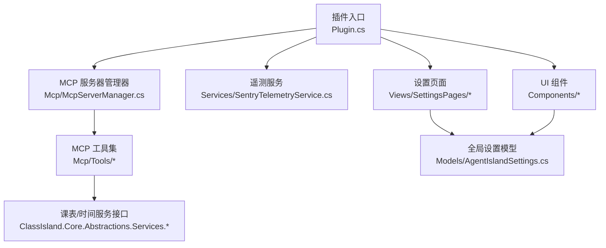
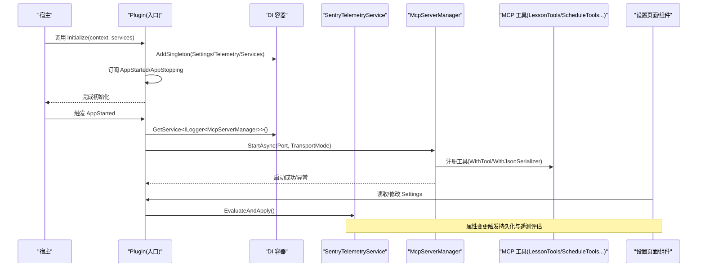
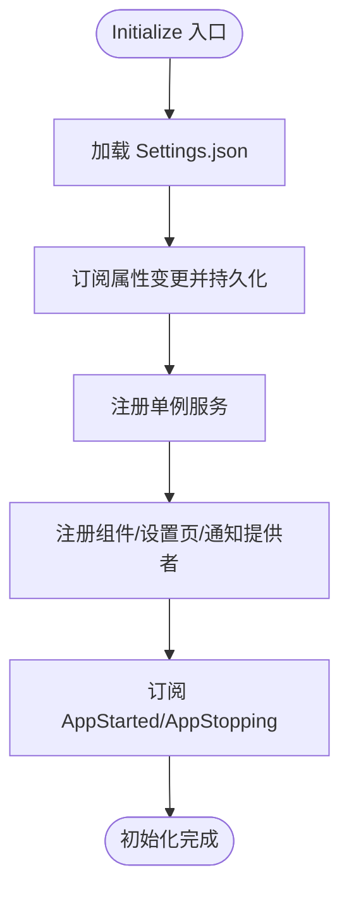
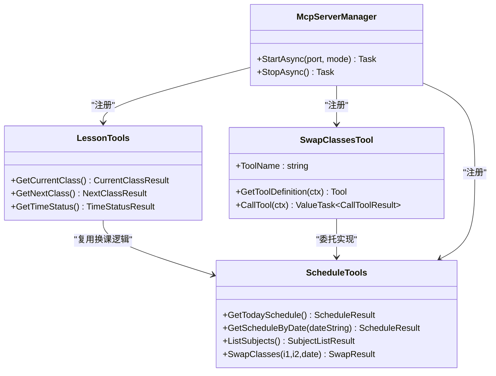
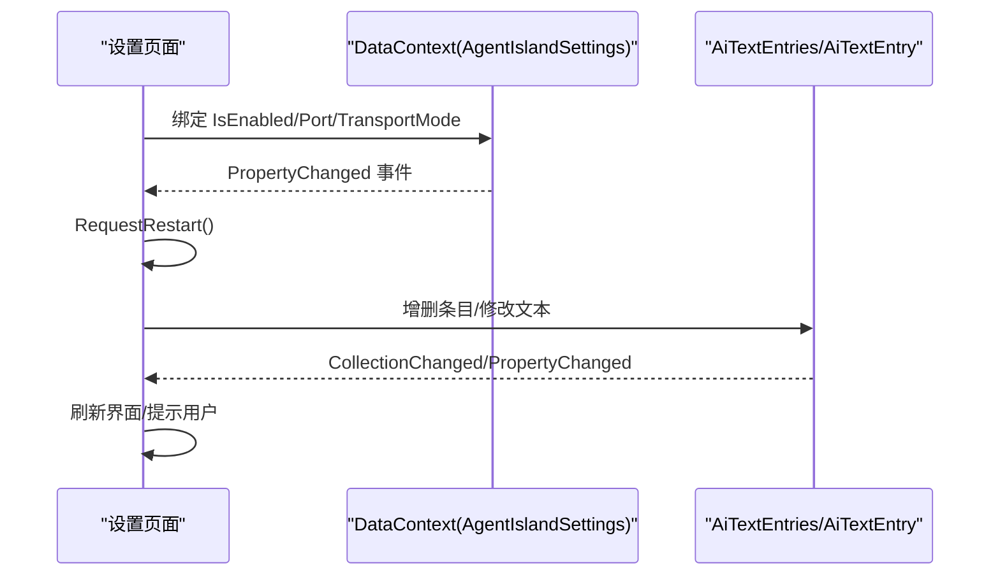
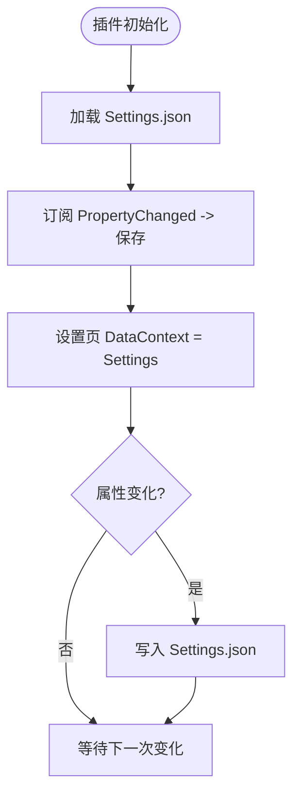
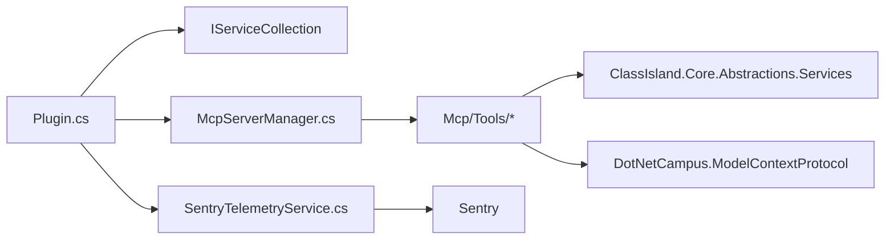

# 插件扩展开发

<cite>
**本文引用的文件**   
- [Plugin.cs](file://Plugin.cs)
- [manifest.yml](file://manifest.yml)
- [McpServerManager.cs](file://Mcp/McpServerManager.cs)
- [LessonTools.cs](file://Mcp/Tools/LessonTools.cs)
- [ScheduleTools.cs](file://Mcp/Tools/ScheduleTools.cs)
- [SwapClassesTool.cs](file://Mcp/Tools/SwapClassesTool.cs)
- [AiTextComponent.axaml.cs](file://Components/AiTextComponent.axaml.cs)
- [AiTextComponentSettingsControl.axaml.cs](file://Components/AiTextComponentSettingsControl.axaml.cs)
- [AiTextSettingsPage.axaml.cs](file://Views/SettingsPages/AiTextSettingsPage.axaml.cs)
- [McpSettingsPage.axaml.cs](file://Views/SettingsPages/McpSettingsPage.axaml.cs)
- [AgentIslandSettings.cs](file://Models/AgentIslandSettings.cs)
- [AiTextEntry.cs](file://Models/AiTextEntry.cs)
- [McpTransportMode.cs](file://Models/McpTransportMode.cs)
- [SentryTelemetryService.cs](file://Services/SentryTelemetryService.cs)
</cite>

## 目录
1. [简介](#简介)
2. [项目结构](#项目结构)
3. [核心组件](#核心组件)
4. [架构总览](#架构总览)
5. [详细组件分析](#详细组件分析)
6. [依赖关系分析](#依赖关系分析)
7. [性能与可观测性](#性能与可观测性)
8. [故障排查指南](#故障排查指南)
9. [结论](#结论)
10. [附录：第三方集成与最佳实践](#附录第三方集成与最佳实践)

## 简介
本指南面向希望在 ClassIsland 中为 AgentIsland 插件进行二次开发与扩展的开发者。内容覆盖：
- 如何继承 PluginBase 实现自定义插件入口点，包括 Initialize 生命周期与资源管理
- MCP 工具开发完整教程（基于 McpServerBuilder 注册、方法签名规范、参数校验与错误处理）
- Avalonia UI 组件与设置页面的开发流程（数据绑定、事件处理、MVVM 模式）
- 依赖注入容器的使用（服务注册、单例解析）
- 遥测与日志集成示例及最佳实践

## 项目结构
AgentIsland 采用分层组织方式：
- 插件入口与生命周期：Plugin.cs
- MCP 服务器管理与工具：Mcp/McpServerManager.cs、Mcp/Tools/*
- 模型与配置：Models/*
- UI 组件与设置页：Components/*、Views/SettingsPages/*
- 服务与遥测：Services/*
- 插件清单：manifest.yml

图表来源
- [Plugin.cs:29-53](file://Plugin.cs#L29-L53)
- [McpServerManager.cs:25-73](file://Mcp/McpServerManager.cs#L25-L73)
- [SentryTelemetryService.cs:30-40](file://Services/SentryTelemetryService.cs#L30-L40)
- [McpSettingsPage.axaml.cs:26-41](file://Views/SettingsPages/McpSettingsPage.axaml.cs#L26-L41)
- [AiTextComponent.axaml.cs:36-56](file://Components/AiTextComponent.axaml.cs#L36-L56)
- [AgentIslandSettings.cs:13-32](file://Models/AgentIslandSettings.cs#L13-L32)

章节来源
- [Plugin.cs:29-53](file://Plugin.cs#L29-L53)
- [manifest.yml:1-13](file://manifest.yml#L1-L13)

## 核心组件
- 插件入口与生命周期
  - 通过 [PluginEntrance] 标记的类继承 PluginBase，重写 Initialize 完成服务注册、配置加载、事件订阅等
  - 在应用启动/停止事件中启动/停止 MCP 服务器，并记录遥测与日志
- MCP 服务器与工具
  - 使用 McpServerBuilder 注册工具集合，支持 StreamableHttp 与 SSE 两种传输模式
  - 工具以特性或 IMcpServerTool 接口形式暴露，统一返回结构化结果
- 设置与持久化
  - 使用 ConfigureFileHelper 加载/保存 Settings.json；属性变更自动持久化
  - 设置页通过 DataContext 绑定到全局设置对象，监听属性变化提示重启
- UI 组件
  - 自定义组件继承 ComponentBase<TSettings>，声明 StyledProperty 并通过事件驱动更新显示
  - 组件设置控件用于选择条目、编辑占位文本等
- 遥测与日志
  - SentryTelemetryService 根据隐私策略与开关动态初始化 SDK，提供 WithInstrumentation 包装器
  - 各工具方法通过 IAppHost.GetService 获取 ILogger 记录调用信息

章节来源
- [Plugin.cs:29-97](file://Plugin.cs#L29-L97)
- [McpServerManager.cs:25-73](file://Mcp/McpServerManager.cs#L25-L73)
- [AgentIslandSettings.cs:28-32](file://Models/AgentIslandSettings.cs#L28-L32)
- [AiTextComponent.axaml.cs:36-56](file://Components/AiTextComponent.axaml.cs#L36-L56)
- [SentryTelemetryService.cs:30-40](file://Services/SentryTelemetryService.cs#L30-L40)

## 架构总览
下图展示了插件初始化、MCP 服务器启动、工具调用与 UI 设置的交互关系。

图表来源
- [Plugin.cs:29-79](file://Plugin.cs#L29-L79)
- [McpServerManager.cs:25-73](file://Mcp/McpServerManager.cs#L25-L73)
- [SentryTelemetryService.cs:30-40](file://Services/SentryTelemetryService.cs#L30-L40)

## 详细组件分析

### 插件入口与生命周期（PluginBase 继承）
- 关键职责
  - 加载并持久化设置：从 PluginConfigFolder 读取 Settings.json，并在属性变更时自动保存
  - 注册服务：将 Settings、遥测服务、AcpRunnerService 等注册为单例
  - 注册 UI：添加通知提供者、组件、设置页、自动化动作
  - 生命周期：订阅 AppStarted/AppStopping，按需启动/停止 MCP 服务器
- 建议模式
  - 在 Initialize 中只做“轻量”初始化，耗时操作放在 AppStarted 中
  - 所有外部资源在 Dispose 中释放，避免内存泄漏
  - 对异常进行捕获并上报遥测，便于问题定位

图表来源
- [Plugin.cs:29-53](file://Plugin.cs#L29-L53)

章节来源
- [Plugin.cs:29-113](file://Plugin.cs#L29-L113)

### MCP 服务器与工具开发
- 服务器管理
  - 使用 McpServerBuilder 构建服务器，注册工具与 JSON 序列化上下文
  - 根据传输模式配置本地 HTTP 端点（sse/mcp），并启动服务
- 工具开发模式
  - 特性方式：在方法上标注 [McpServerTool(Name=..., ReadOnly=..., Structured=...)]，返回强类型结果
  - 接口方式：实现 IMcpServerTool，手动定义 Tool 描述与输入 Schema，并在 CallTool 中解析参数与返回结果
- 线程与 UI 访问
  - 涉及 UI 状态读取时，使用 UiThreadHelper.RunOnUi 切换到 UI 线程
- 参数校验与错误处理
  - 对必填参数进行存在性与类型检查，抛出明确异常
  - 业务异常转换为结构化结果（如 SwapResult），包含成功标志与消息
- 遥测与日志
  - 通过 IAppHost.GetService 获取 ILogger 记录调试信息
  - 使用 SentryTelemetryService.WithInstrumentation 包裹同步/异步逻辑，自动埋点与异常上报

图表来源
- [LessonTools.cs:14-145](file://Mcp/Tools/LessonTools.cs#L14-L145)
- [ScheduleTools.cs:15-203](file://Mcp/Tools/ScheduleTools.cs#L15-L203)
- [SwapClassesTool.cs:16-102](file://Mcp/Tools/SwapClassesTool.cs#L16-L102)
- [McpServerManager.cs:41-73](file://Mcp/McpServerManager.cs#L41-L73)

章节来源
- [McpServerManager.cs:25-73](file://Mcp/McpServerManager.cs#L25-L73)
- [LessonTools.cs:14-145](file://Mcp/Tools/LessonTools.cs#L14-L145)
- [ScheduleTools.cs:15-203](file://Mcp/Tools/ScheduleTools.cs#L15-L203)
- [SwapClassesTool.cs:16-102](file://Mcp/Tools/SwapClassesTool.cs#L16-L102)

### UI 组件与设置页面（Avalonia + MVVM）
- 自定义组件
  - 继承 ComponentBase<TSettings>，声明 ResolvedText/PlaceholderText 等 StyledProperty
  - 在 Loaded/Unloaded 中订阅/取消订阅集合与属性变更事件，确保内存安全
  - 根据当前选中条目与占位文本计算最终显示内容
- 组件设置控件
  - 继承 ComponentBase<AiTextComponentSettings>，绑定 ComboBox 与 TextBox
  - 监听集合变化与选择变化，回写 Settings.EntryId
- 设置页面
  - 继承 SettingsPageBase，使用 [SettingsPageInfo] 注册页面元信息
  - 在 OnInitialized 中将 DataContext 设置为全局设置对象，监听关键属性变化并请求重启
  - 提供复制连接地址、打开帮助文档等交互

图表来源
- [AiTextComponent.axaml.cs:36-83](file://Components/AiTextComponent.axaml.cs#L36-L83)
- [AiTextComponentSettingsControl.axaml.cs:16-51](file://Components/AiTextComponentSettingsControl.axaml.cs#L16-L51)
- [AiTextSettingsPage.axaml.cs:14-35](file://Views/SettingsPages/AiTextSettingsPage.axaml.cs#L14-L35)
- [McpSettingsPage.axaml.cs:26-41](file://Views/SettingsPages/McpSettingsPage.axaml.cs#L26-L41)
- [AgentIslandSettings.cs:107-122](file://Models/AgentIslandSettings.cs#L107-L122)

章节来源
- [AiTextComponent.axaml.cs:11-83](file://Components/AiTextComponent.axaml.cs#L11-L83)
- [AiTextComponentSettingsControl.axaml.cs:1-52](file://Components/AiTextComponentSettingsControl.axaml.cs#L1-L52)
- [AiTextSettingsPage.axaml.cs:1-35](file://Views/SettingsPages/AiTextSettingsPage.axaml.cs#L1-L35)
- [McpSettingsPage.axaml.cs:1-66](file://Views/SettingsPages/McpSettingsPage.axaml.cs#L1-L66)
- [AgentIslandSettings.cs:13-32](file://Models/AgentIslandSettings.cs#L13-L32)

### 设置与数据持久化（MVVM 模式）
- 全局设置模型
  - 使用 ObservableObject 与 SetProperty 实现属性变更通知
  - 维护 ObservableCollection 列表，并在集合变化时重新挂接事件
  - 派生属性（如 ConnectionAddress、遥测相关布尔值）在 OnPropertyChanged 中联动更新
- 持久化策略
  - 在插件初始化时加载 Settings.json，并订阅 PropertyChanged 自动保存
  - 设置页直接绑定到该实例，无需额外保存按钮
- 传输模式枚举
  - McpTransportMode 区分 StreamableHttp 与 Sse，影响端点路径与兼容性

图表来源
- [Plugin.cs:31-34](file://Plugin.cs#L31-L34)
- [AgentIslandSettings.cs:240-273](file://Models/AgentIslandSettings.cs#L240-L273)
- [McpTransportMode.cs:6-17](file://Models/McpTransportMode.cs#L6-L17)

章节来源
- [AgentIslandSettings.cs:13-32](file://Models/AgentIslandSettings.cs#L13-L32)
- [AgentIslandSettings.cs:240-273](file://Models/AgentIslandSettings.cs#L240-L273)
- [McpTransportMode.cs:6-17](file://Models/McpTransportMode.cs#L6-L17)

### 依赖注入容器使用
- 服务注册
  - 在 Initialize 中使用 services.AddSingleton 注册 Settings、遥测服务、AcpRunnerService 等
  - 使用 AddNotificationProvider/AddComponent/AddSettingsPage/AddAction 注册 UI 与功能
- 服务解析
  - 在工具或服务中通过 IAppHost.GetService<T>() 解析所需服务（如 ILogger<T>、ILessonsService 等）
- 生命周期
  - 单例服务由容器统一管理，插件 Dispose 中释放自身持有的非托管资源

章节来源
- [Plugin.cs:40-49](file://Plugin.cs#L40-L49)
- [LessonTools.cs:26-28](file://Mcp/Tools/LessonTools.cs#L26-L28)
- [ScheduleTools.cs:27-31](file://Mcp/Tools/ScheduleTools.cs#L27-L31)

## 依赖关系分析
- 组件耦合
  - Plugin 负责装配与生命周期，低耦合地依赖 McpServerManager、遥测服务与各 UI 组件
  - McpServerManager 仅关注服务器构建与运行，工具类通过 IAppHost 解耦获取运行时服务
- 外部依赖
  - ClassIsland Core：提供插件框架、UI 基类、服务接口
  - DotNetCampus.ModelContextProtocol：MCP 协议与服务器构建
  - Microsoft.Extensions.DependencyInjection/Hosting：依赖注入与宿主
  - Sentry：遥测与异常上报

图表来源
- [Plugin.cs:40-49](file://Plugin.cs#L40-L49)
- [McpServerManager.cs:41-73](file://Mcp/McpServerManager.cs#L41-L73)
- [SentryTelemetryService.cs:49-68](file://Services/SentryTelemetryService.cs#L49-L68)

章节来源
- [Plugin.cs:40-49](file://Plugin.cs#L40-L49)
- [McpServerManager.cs:41-73](file://Mcp/McpServerManager.cs#L41-L73)
- [SentryTelemetryService.cs:49-68](file://Services/SentryTelemetryService.cs#L49-L68)

## 性能与可观测性
- 性能考虑
  - 工具方法尽量保持幂等与快速响应，避免阻塞 UI 线程
  - 批量操作（如换课）应在临时覆盖计划中进行，减少不必要的持久化次数
- 可观测性
  - 使用 ILogger 记录关键路径与异常堆栈
  - 使用 SentryTelemetryService.WithInstrumentation 包裹工具调用，自动创建事务、面包屑与异常上报
  - 在服务器启停阶段记录遥测，便于监控服务可用性

章节来源
- [SentryTelemetryService.cs:127-174](file://Services/SentryTelemetryService.cs#L127-L174)
- [LessonTools.cs:17-20](file://Mcp/Tools/LessonTools.cs#L17-L20)
- [ScheduleTools.cs:18-21](file://Mcp/Tools/ScheduleTools.cs#L18-L21)

## 故障排查指南
- 常见问题
  - MCP 端口冲突：检查 Port 是否被占用，必要时更换端口
  - 传输模式不兼容：确认客户端支持的协议（SSE 或 StreamableHttp）
  - 遥测未上报：检查隐私策略同意状态与 DSN 配置
- 定位步骤
  - 查看日志输出中的服务器启停信息与工具调用调试日志
  - 在 Sentry 中按 Transaction 名称过滤，定位具体工具异常
  - 对于 UI 相关问题，确认属性变更事件是否正确订阅与释放

章节来源
- [Plugin.cs:67-79](file://Plugin.cs#L67-L79)
- [SentryTelemetryService.cs:95-109](file://Services/SentryTelemetryService.cs#L95-L109)
- [McpSettingsPage.axaml.cs:33-41](file://Views/SettingsPages/McpSettingsPage.axaml.cs#L33-L41)

## 结论
AgentIsland 提供了清晰的插件扩展范式：通过 PluginBase 管理生命周期，借助 DI 容器注册服务与 UI，使用 McpServerBuilder 暴露工具能力，并以 Avalonia 组件与设置页完善用户体验。结合遥测与日志，可实现高可维护性与可观测性的插件生态。

## 附录：第三方集成与最佳实践
- 遥测集成
  - 在 Initialize 中构造遥测服务并 EvaluateAndApply，随设置变化动态启用/关闭
  - 在工具方法中使用 WithInstrumentation 包裹核心逻辑，统一埋点与异常上报
- 日志集成
  - 通过 IAppHost.GetService<ILogger<T>> 获取日志器，记录关键路径与异常
- 插件清单
  - manifest.yml 中指定入口程序集、版本与平台支持，确保宿主正确加载

章节来源
- [Plugin.cs:36-38](file://Plugin.cs#L36-L38)
- [SentryTelemetryService.cs:30-40](file://Services/SentryTelemetryService.cs#L30-L40)
- [manifest.yml:1-13](file://manifest.yml#L1-L13)