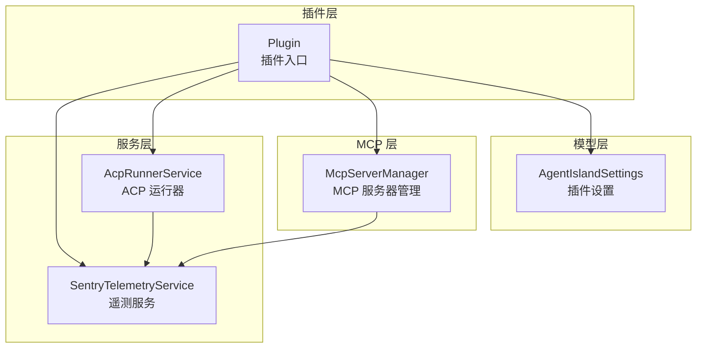
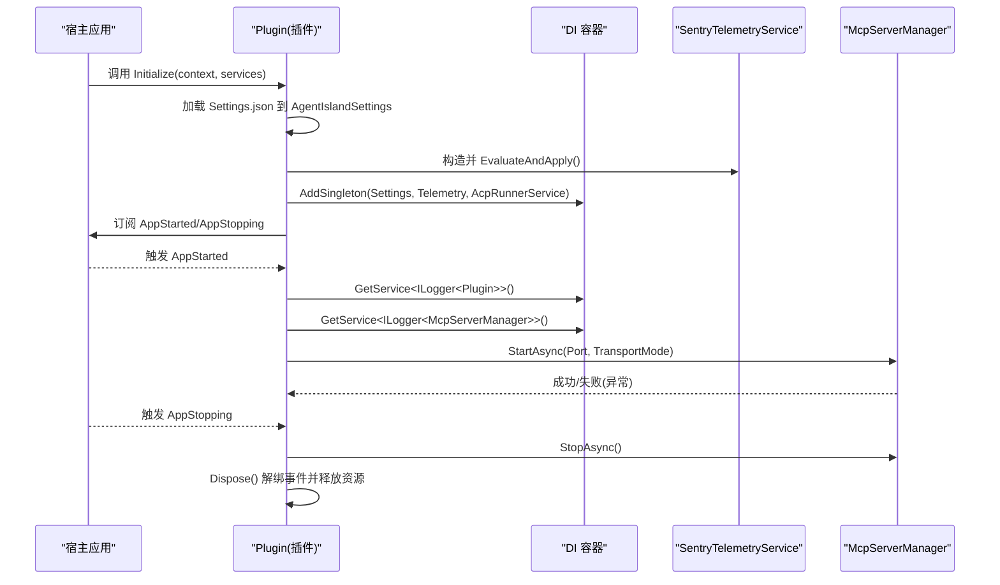
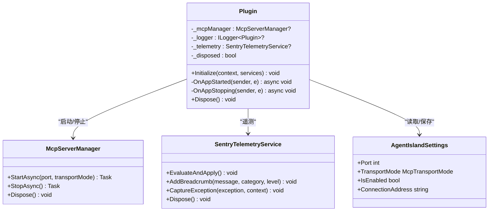
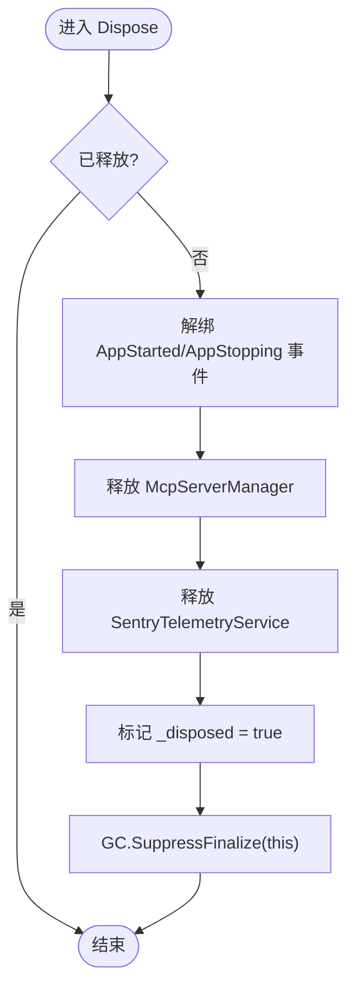
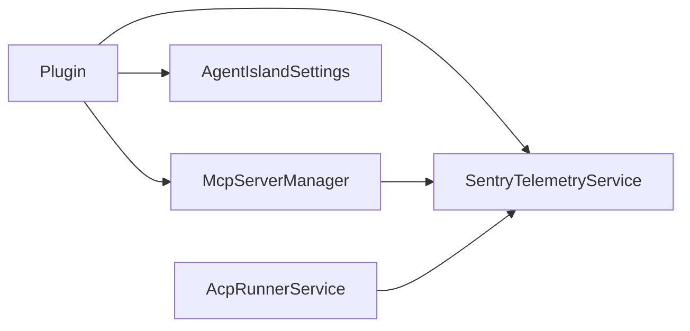

# 插件生命周期管理

<cite>
**本文引用的文件**   
- [Plugin.cs](file://Plugin.cs)
- [McpServerManager.cs](file://Mcp/McpServerManager.cs)
- [SentryTelemetryService.cs](file://Services/SentryTelemetryService.cs)
- [AcpRunnerService.cs](file://Services/AcpRunnerService.cs)
- [AgentIslandSettings.cs](file://Models/AgentIslandSettings.cs)
</cite>

## 目录
1. [简介](#简介)
2. [项目结构](#项目结构)
3. [核心组件](#核心组件)
4. [架构总览](#架构总览)
5. [详细组件分析](#详细组件分析)
6. [依赖关系分析](#依赖关系分析)
7. [性能考虑](#性能考虑)
8. [故障排查指南](#故障排查指南)
9. [结论](#结论)

## 简介
本指南面向希望基于 AgentIsland 插件体系进行二次开发的工程师，聚焦于“插件生命周期管理”。内容涵盖：
- 如何继承 PluginBase 实现自定义插件入口点
- Initialize 方法的实现模式与参数使用
- 插件生命周期事件 AppStarted、AppStopping 的处理机制
- 依赖注入容器的配置方法（服务注册、单例模式、服务解析）
- 资源管理与清理机制（IDisposable 的正确实现）
- 错误处理与异常捕获的完整示例路径

## 项目结构
AgentIsland 采用以功能域划分的目录组织方式，关键文件如下：
- 插件入口与生命周期：Plugin.cs
- MCP 服务器管理：Mcp/McpServerManager.cs
- 遥测服务：Services/SentryTelemetryService.cs
- ACP 代理运行器：Services/AcpRunnerService.cs
- 设置模型：Models/AgentIslandSettings.cs

图表来源
- [Plugin.cs:19-53](file://Plugin.cs#L19-L53)
- [McpServerManager.cs:11-23](file://Mcp/McpServerManager.cs#L11-L23)
- [SentryTelemetryService.cs:11-25](file://Services/SentryTelemetryService.cs#L11-L25)
- [AcpRunnerService.cs:14-23](file://Services/AcpRunnerService.cs#L14-L23)
- [AgentIslandSettings.cs:13-32](file://Models/AgentIslandSettings.cs#L13-L32)

章节来源
- [Plugin.cs:19-53](file://Plugin.cs#L19-L53)
- [McpServerManager.cs:11-23](file://Mcp/McpServerManager.cs#L11-L23)
- [SentryTelemetryService.cs:11-25](file://Services/SentryTelemetryService.cs#L11-L25)
- [AcpRunnerService.cs:14-23](file://Services/AcpRunnerService.cs#L14-L23)
- [AgentIslandSettings.cs:13-32](file://Models/AgentIslandSettings.cs#L13-L32)

## 核心组件
- 插件入口类
  - 继承自 PluginBase，实现 IDisposable，负责初始化、订阅应用生命周期事件、注册 DI 服务、启动/停止 MCP 服务器。
- MCP 服务器管理器
  - 封装 McpServer 的构建、启动、停止与取消令牌管理，提供可观测性埋点。
- 遥测服务
  - 根据用户隐私同意状态和开关动态初始化/关闭 Sentry SDK，提供异常上报与面包屑记录能力。
- ACP 运行器
  - 通过 stdio 协议与外部 Agent 进程通信，管理会话生命周期并安全释放进程资源。
- 设置模型
  - 提供端口、传输模式、遥测开关等配置项，支持属性变更通知与派生属性计算。

章节来源
- [Plugin.cs:19-113](file://Plugin.cs#L19-L113)
- [McpServerManager.cs:11-124](file://Mcp/McpServerManager.cs#L11-L124)
- [SentryTelemetryService.cs:11-181](file://Services/SentryTelemetryService.cs#L11-L181)
- [AcpRunnerService.cs:14-206](file://Services/AcpRunnerService.cs#L14-L206)
- [AgentIslandSettings.cs:13-394](file://Models/AgentIslandSettings.cs#L13-L394)

## 架构总览
下图展示了插件在宿主环境中的生命周期与关键交互：

图表来源
- [Plugin.cs:29-53](file://Plugin.cs#L29-L53)
- [Plugin.cs:55-97](file://Plugin.cs#L55-L97)
- [Plugin.cs:99-113](file://Plugin.cs#L99-L113)
- [McpServerManager.cs:25-82](file://Mcp/McpServerManager.cs#L25-L82)
- [McpServerManager.cs:84-112](file://Mcp/McpServerManager.cs#L84-L112)
- [SentryTelemetryService.cs:30-40](file://Services/SentryTelemetryService.cs#L30-L40)

## 详细组件分析

### 插件入口与生命周期（Plugin）
- 入口标记与基类
  - 使用特性标注为插件入口，继承 PluginBase 并实现 IDisposable。
- Initialize 模式
  - 从插件配置目录加载 Settings.json 到 AgentIslandSettings，并绑定属性变更自动持久化。
  - 创建遥测服务实例并立即评估是否启用。
  - 向 DI 容器注册单例服务：设置对象、遥测服务、ACP 运行器。
  - 注册 UI 组件、设置页、动作等扩展点（由宿主框架消费）。
  - 订阅宿主应用 AppStarted 与 AppStopping 事件。
- AppStarted 处理
  - 若未启用则直接返回；否则解析日志服务，构造 McpServerManager 并启动。
  - 根据传输模式选择端点，记录信息日志与遥测面包屑；异常时记录错误并上报。
- AppStopping 处理
  - 尝试优雅停止 MCP 服务器，异常时记录错误并上报。
- Dispose 清理
  - 解绑事件，释放 MCP 服务器与遥测服务，防止内存泄漏。

图表来源
- [Plugin.cs:19-113](file://Plugin.cs#L19-L113)
- [McpServerManager.cs:11-124](file://Mcp/McpServerManager.cs#L11-L124)
- [SentryTelemetryService.cs:11-181](file://Services/SentryTelemetryService.cs#L11-L181)
- [AgentIslandSettings.cs:13-211](file://Models/AgentIslandSettings.cs#L13-L211)

章节来源
- [Plugin.cs:29-53](file://Plugin.cs#L29-L53)
- [Plugin.cs:55-97](file://Plugin.cs#L55-L97)
- [Plugin.cs:99-113](file://Plugin.cs#L99-L113)

### 依赖注入容器配置
- 服务注册
  - 将设置对象、遥测服务、ACP 运行器以单例形式注册，确保全生命周期唯一实例。
  - 注册 UI 组件、设置页、动作等宿主扩展点（由宿主框架扫描并使用）。
- 服务解析
  - 在 AppStarted 回调中通过 IAppHost.GetService<T>() 解析 ILogger<T> 等运行时服务。
- 最佳实践
  - 仅注册无副作用或幂等的服务；避免在 Initialize 中进行阻塞 IO。
  - 对需要外部资源的对象（如网络、进程）统一交由专用服务管理并在 Dispose 中释放。

章节来源
- [Plugin.cs:29-53](file://Plugin.cs#L29-L53)
- [Plugin.cs:64-66](file://Plugin.cs#L64-L66)

### 资源管理与清理（IDisposable）
- 插件级清理
  - 解绑宿主事件，防止重复触发与内存泄漏。
  - 释放 McpServerManager 与 SentryTelemetryService。
- MCP 服务器清理
  - 取消 CancellationTokenSource，停止服务器并置空引用，确保可重复调用 StopAsync 的安全。
- 遥测服务清理
  - 监听设置变更，当 DSN 变化时先关闭再重新初始化；Dispose 时断开设置变更订阅并关闭 SDK。
- ACP 运行器清理
  - 遍历会话列表，关闭标准输入流，等待退出后必要时强制终止进程，最终释放进程句柄。

图表来源
- [Plugin.cs:99-113](file://Plugin.cs#L99-L113)
- [McpServerManager.cs:114-124](file://Mcp/McpServerManager.cs#L114-L124)
- [SentryTelemetryService.cs:176-181](file://Services/SentryTelemetryService.cs#L176-L181)
- [AcpRunnerService.cs:156-191](file://Services/AcpRunnerService.cs#L156-L191)

章节来源
- [Plugin.cs:99-113](file://Plugin.cs#L99-L113)
- [McpServerManager.cs:114-124](file://Mcp/McpServerManager.cs#L114-L124)
- [SentryTelemetryService.cs:176-181](file://Services/SentryTelemetryService.cs#L176-L181)
- [AcpRunnerService.cs:156-191](file://Services/AcpRunnerService.cs#L156-L191)

### 错误处理与异常捕获
- 启动阶段
  - 捕获启动异常，记录错误日志并通过遥测服务上报，附带上下文标签便于定位。
- 停止阶段
  - 捕获停止异常，记录错误日志并上报。
- 遥测服务内部
  - 提供 WithInstrumentation/WithInstrumentationAsync 包装同步/异步操作，自动添加事务、面包屑与异常捕获。
- ACP 运行器
  - 在关闭会话时捕获异常并记录错误日志，确保单个会话失败不影响整体清理流程。

章节来源
- [Plugin.cs:67-79](file://Plugin.cs#L67-L79)
- [Plugin.cs:85-97](file://Plugin.cs#L85-L97)
- [SentryTelemetryService.cs:127-174](file://Services/SentryTelemetryService.cs#L127-L174)
- [AcpRunnerService.cs:167-186](file://Services/AcpRunnerService.cs#L167-L186)

## 依赖关系分析
- 松耦合设计
  - 插件通过 DI 容器获取日志与遥测服务，降低硬编码依赖。
  - McpServerManager 独立封装服务器生命周期，便于测试与替换。
- 直接依赖
  - Plugin 依赖 McpServerManager、SentryTelemetryService、AgentIslandSettings。
  - McpServerManager 依赖 SentryTelemetryService 用于埋点。
  - AcpRunnerService 依赖 SentryTelemetryService 用于遥测。
- 潜在循环依赖
  - 当前未发现循环依赖；所有依赖方向清晰且单向。

图表来源
- [Plugin.cs:29-53](file://Plugin.cs#L29-L53)
- [McpServerManager.cs:19-23](file://Mcp/McpServerManager.cs#L19-L23)
- [SentryTelemetryService.cs:21-25](file://Services/SentryTelemetryService.cs#L21-L25)
- [AcpRunnerService.cs:20-23](file://Services/AcpRunnerService.cs#L20-L23)

章节来源
- [Plugin.cs:29-53](file://Plugin.cs#L29-L53)
- [McpServerManager.cs:19-23](file://Mcp/McpServerManager.cs#L19-L23)
- [SentryTelemetryService.cs:21-25](file://Services/SentryTelemetryService.cs#L21-L25)
- [AcpRunnerService.cs:20-23](file://Services/AcpRunnerService.cs#L20-L23)

## 性能考虑
- 初始化阶段避免阻塞 IO
  - 将耗时任务（如网络请求、长连接建立）延迟到 AppStarted 中执行，并配合取消令牌。
- 单例服务的构造成本
  - 将昂贵对象（如 HTTP 客户端、数据库连接池）注册为单例，减少重复创建开销。
- 遥测采样与开销
  - 合理设置采样率与调试开关，生产环境关闭调试输出以减少额外开销。
- 资源释放
  - 确保所有实现 IDisposable 的对象在 Dispose 中被正确释放，避免句柄泄漏。

[本节为通用指导，不直接分析具体文件]

## 故障排查指南
- 常见问题
  - 端口占用导致 MCP 启动失败：检查端口配置与冲突进程。
  - 遥测未上报：确认隐私政策同意状态与 DSN 配置，查看 EvaluateAndApply 是否生效。
  - 插件未响应生命周期事件：检查是否正确订阅/解绑 AppStarted/AppStopping。
- 定位手段
  - 使用 ILogger 记录关键步骤与异常堆栈。
  - 使用 SentryTelemetryService 的面包屑与异常上报能力辅助定位问题。
  - 在 Dispose 中增加日志，验证资源释放顺序。

章节来源
- [Plugin.cs:67-79](file://Plugin.cs#L67-L79)
- [Plugin.cs:85-97](file://Plugin.cs#L85-L97)
- [SentryTelemetryService.cs:30-40](file://Services/SentryTelemetryService.cs#L30-L40)
- [SentryTelemetryService.cs:95-122](file://Services/SentryTelemetryService.cs#L95-L122)

## 结论
通过继承 PluginBase 并遵循本文的生命周期管理模式，开发者可以稳定地集成自定义插件。重点在于：
- 在 Initialize 中完成轻量初始化与服务注册
- 在 AppStarted/AppStopping 中管理外部资源
- 使用 DI 容器统一管理依赖
- 严格实现 IDisposable 以确保资源释放
- 结合日志与遥测完善错误处理与可观测性