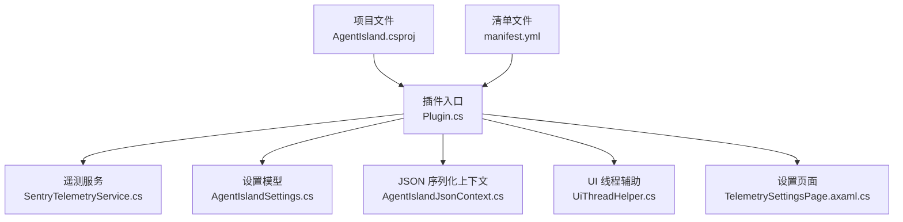
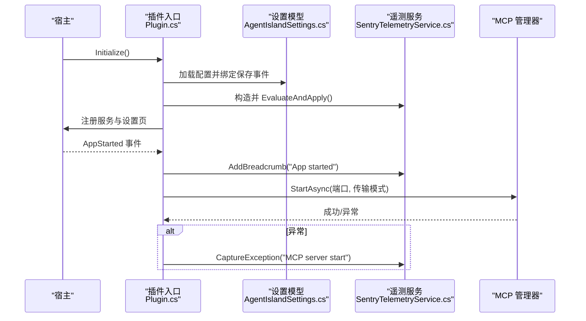
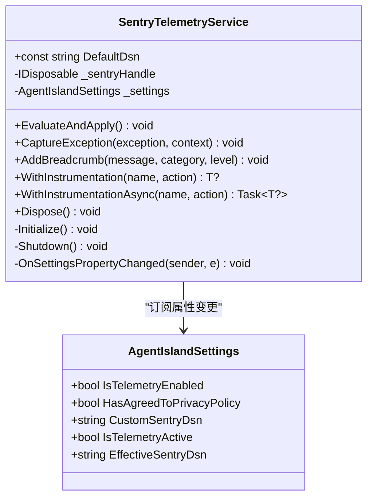
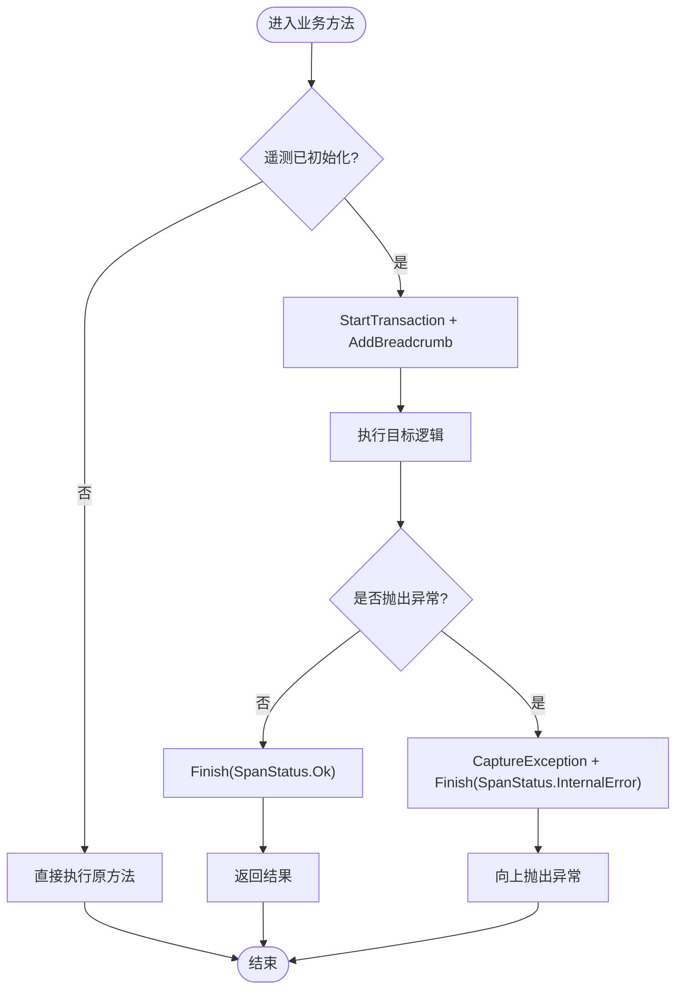
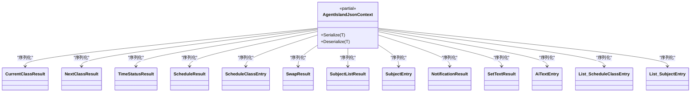
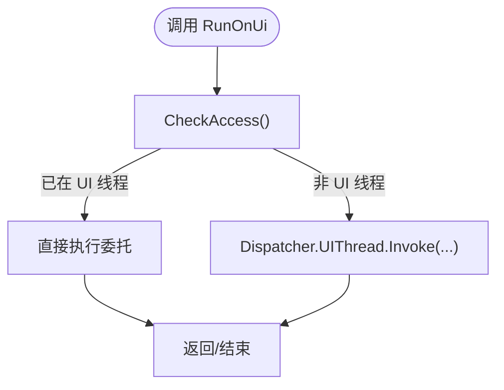
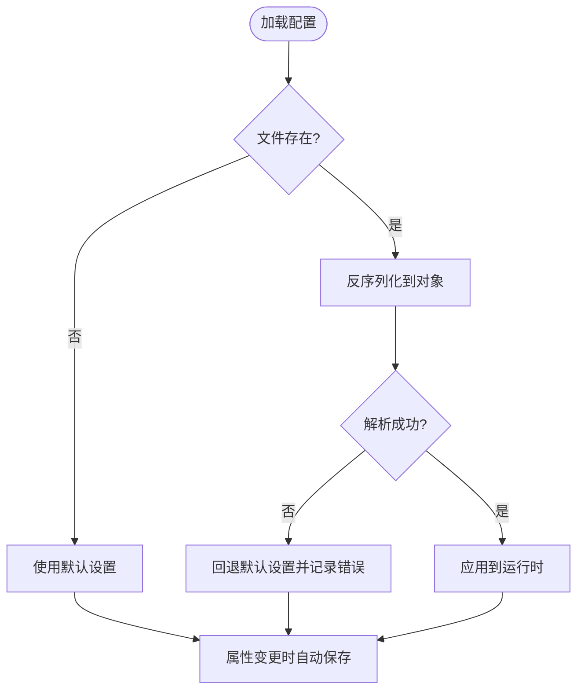
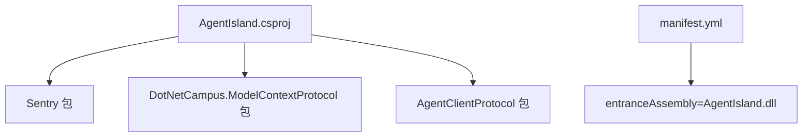

# 第三方集成

<cite>
**本文引用的文件**
- [AgentIsland.csproj](file://AgentIsland.csproj)
- [Plugin.cs](file://Plugin.cs)
- [Services/SentryTelemetryService.cs](file://Services/SentryTelemetryService.cs)
- [Models/AgentIslandSettings.cs](file://Models/AgentIslandSettings.cs)
- [Models/AgentIslandJsonContext.cs](file://Models/AgentIslandJsonContext.cs)
- [Helpers/UiThreadHelper.cs](file://Helpers/UiThreadHelper.cs)
- [Views/SettingsPages/TelemetrySettingsPage.axaml.cs](file://Views/SettingsPages/TelemetrySettingsPage.axaml.cs)
- [manifest.yml](file://manifest.yml)
</cite>

## 目录
1. [简介](#简介)
2. [项目结构](#项目结构)
3. [核心组件](#核心组件)
4. [架构总览](#架构总览)
5. [详细组件分析](#详细组件分析)
6. [依赖关系分析](#依赖关系分析)
7. [性能考量](#性能考量)
8. [故障排查指南](#故障排查指南)
9. [结论](#结论)
10. [附录](#附录)

## 简介
本指南面向需要在插件中集成第三方库的开发者，重点围绕以下主题：
- NuGet 包管理与版本兼容性策略
- 以 Sentry 为例的错误追踪与性能监控集成模式
- JSON 序列化上下文设计与性能优化
- 线程安全调用封装与 UI 线程辅助工具使用
- 配置文件管理、变更持久化与迁移策略
- 第三方库错误处理与降级机制的实现模式

文档基于现有代码实现进行提炼，提供可复用的实践方法与图示说明。

## 项目结构
本项目为 ClassIsland 插件，采用分层组织方式：
- 入口与生命周期：Plugin.cs
- 服务层：遥测服务 Services/SentryTelemetryService.cs
- 模型与配置：Models/AgentIslandSettings.cs、Models/AgentIslandJsonContext.cs
- 辅助工具：Helpers/UiThreadHelper.cs
- 设置页面：Views/SettingsPages/TelemetrySettingsPage.axaml.cs
- 构建与清单：AgentIsland.csproj、manifest.yml

图表来源
- [Plugin.cs:29-53](file://Plugin.cs#L29-L53)
- [Services/SentryTelemetryService.cs:11-40](file://Services/SentryTelemetryService.cs#L11-L40)
- [Models/AgentIslandSettings.cs:13-32](file://Models/AgentIslandSettings.cs#L13-L32)
- [Models/AgentIslandJsonContext.cs:1-20](file://Models/AgentIslandJsonContext.cs#L1-L20)
- [Helpers/UiThreadHelper.cs:5-24](file://Helpers/UiThreadHelper.cs#L5-L24)
- [Views/SettingsPages/TelemetrySettingsPage.axaml.cs:20-33](file://Views/SettingsPages/TelemetrySettingsPage.axaml.cs#L20-L33)
- [AgentIsland.csproj:1-52](file://AgentIsland.csproj#L1-L52)
- [manifest.yml:1-13](file://manifest.yml#L1-L13)

章节来源
- [Plugin.cs:29-53](file://Plugin.cs#L29-L53)
- [AgentIsland.csproj:1-52](file://AgentIsland.csproj#L1-L52)
- [manifest.yml:1-13](file://manifest.yml#L1-L13)

## 核心组件
- 插件入口与依赖注入
  - 在初始化阶段加载并持久化配置，注册遥测服务、MCP 服务器、通知提供者、组件与设置页等。
- 遥测服务（Sentry）
  - 根据用户隐私同意状态和开关动态初始化或关闭 SDK，提供异常捕获、面包屑、事务包装等能力。
- 设置模型
  - 暴露遥测开关、隐私协议、自定义 DSN 等属性，并提供派生属性控制启用逻辑与 UI 行为。
- JSON 序列化上下文
  - 通过 Source Generator 预编译类型元数据，提升 System.Text.Json 序列化性能。
- UI 线程辅助
  - 统一封装跨线程调度到 UI 线程的方法，避免 UI 访问异常。
- 设置页面
  - 提供隐私政策同意、测试上报、查看政策等交互。

章节来源
- [Plugin.cs:29-53](file://Plugin.cs#L29-L53)
- [Services/SentryTelemetryService.cs:11-40](file://Services/SentryTelemetryService.cs#L11-L40)
- [Models/AgentIslandSettings.cs:148-200](file://Models/AgentIslandSettings.cs#L148-L200)
- [Models/AgentIslandJsonContext.cs:1-20](file://Models/AgentIslandJsonContext.cs#L1-L20)
- [Helpers/UiThreadHelper.cs:5-24](file://Helpers/UiThreadHelper.cs#L5-L24)
- [Views/SettingsPages/TelemetrySettingsPage.axaml.cs:20-33](file://Views/SettingsPages/TelemetrySettingsPage.axaml.cs#L20-L33)

## 架构总览
下图展示了插件启动时关键流程：加载配置、初始化遥测、注册服务、应用启动后启动 MCP 服务器，并在异常时上报遥测。

图表来源
- [Plugin.cs:29-79](file://Plugin.cs#L29-L79)
- [Services/SentryTelemetryService.cs:30-69](file://Services/SentryTelemetryService.cs#L30-L69)
- [Models/AgentIslandSettings.cs:178-200](file://Models/AgentIslandSettings.cs#L178-L200)

## 详细组件分析

### 遥测服务（Sentry）集成与生命周期管理
- 设计要点
  - 根据 IsTelemetryActive 与当前句柄状态决定初始化或关闭 SDK。
  - 监听设置变更，当隐私协议或自定义 DSN 变化时重新评估并应用。
  - 提供 WithInstrumentation/WithInstrumentationAsync 包装同步/异步操作，自动创建事务、记录面包屑与异常。
- 关键流程
  - 初始化：设置 DSN、采样率、PII 发送策略、BeforeSend 标签、Scope 标签、面包屑。
  - 关闭：释放句柄，置空引用。
  - 捕获异常：仅在已初始化时上报，附加上下文信息。
  - 包裹执行：失败时记录异常并标记事务状态为内部错误。

图表来源
- [Services/SentryTelemetryService.cs:11-182](file://Services/SentryTelemetryService.cs#L11-L182)
- [Models/AgentIslandSettings.cs:148-200](file://Models/AgentIslandSettings.cs#L148-L200)

章节来源
- [Services/SentryTelemetryService.cs:30-90](file://Services/SentryTelemetryService.cs#L30-L90)
- [Services/SentryTelemetryService.cs:95-174](file://Services/SentryTelemetryService.cs#L95-L174)
- [Models/AgentIslandSettings.cs:178-200](file://Models/AgentIslandSettings.cs#L178-L200)

### 错误追踪与性能监控的使用模式
- 同步包裹
  - 使用 WithInstrumentation 包裹业务方法，自动记录开始/结束与异常。
- 异步包裹
  - 使用 WithInstrumentationAsync 包裹异步方法，确保 await 路径正确完成事务。
- 手动上报
  - 在无法包裹的场景，直接调用 CaptureException 并附带上下文。
- 面包屑
  - 在关键路径添加面包屑，便于定位问题。

图表来源
- [Services/SentryTelemetryService.cs:127-174](file://Services/SentryTelemetryService.cs#L127-L174)

章节来源
- [Services/SentryTelemetryService.cs:127-174](file://Services/SentryTelemetryService.cs#L127-L174)

### JSON 序列化上下文设计与性能优化
- 设计要点
  - 使用 JsonSerializable 特性声明需要序列化的类型，配合 Source Generator 生成强类型元数据，减少运行时反射开销。
  - 通过 JsonSourceGenerationOptions 指定命名策略（如驼峰），保证与外部系统约定一致。
- 适用场景
  - 高频序列化/反序列化、对延迟敏感的工具调用结果、批量数据处理。
- 注意事项
  - 新增类型需同步更新上下文；集合类型需显式声明泛型实例。

图表来源
- [Models/AgentIslandJsonContext.cs:1-20](file://Models/AgentIslandJsonContext.cs#L1-L20)

章节来源
- [Models/AgentIslandJsonContext.cs:1-20](file://Models/AgentIslandJsonContext.cs#L1-L20)

### 线程安全调用封装与 UI 线程辅助工具
- 设计要点
  - 提供 RunOnUi<T>/RunOnUi(Action) 两个重载，内部检查当前线程是否为 UI 线程，必要时调度到 UI 线程执行。
  - 适用于后台任务完成后更新 UI、通知显示等场景。
- 使用建议
  - 所有 UI 相关操作应通过该辅助方法执行，避免跨线程访问控件导致的异常。

图表来源
- [Helpers/UiThreadHelper.cs:5-24](file://Helpers/UiThreadHelper.cs#L5-L24)

章节来源
- [Helpers/UiThreadHelper.cs:5-24](file://Helpers/UiThreadHelper.cs#L5-L24)

### 配置文件管理与迁移策略
- 加载与持久化
  - 在插件初始化时从固定路径加载 Settings.json，并在属性变更时自动保存，确保设置实时落盘。
- 隐私与遥测开关
  - 通过 IsTelemetryEnabled、HasAgreedToPrivacyPolicy、CustomSentryDsn 控制遥测行为；EffectiveSentryDsn 决定实际使用的 DSN。
- 迁移策略建议
  - 字段级兼容：保留旧字段名映射到新字段，读取时优先新字段，回退到旧字段。
  - 版本化迁移：在加载时检测配置版本，执行增量迁移脚本，写入新版本标记。
  - 容错恢复：加载失败时回退默认值并记录日志，避免影响主流程。

图表来源
- [Plugin.cs:31-34](file://Plugin.cs#L31-L34)
- [Models/AgentIslandSettings.cs:148-200](file://Models/AgentIslandSettings.cs#L148-L200)

章节来源
- [Plugin.cs:31-34](file://Plugin.cs#L31-L34)
- [Models/AgentIslandSettings.cs:148-200](file://Models/AgentIslandSettings.cs#L148-L200)

### 第三方库的错误处理与降级机制
- 遥测降级
  - 若未初始化或未启用遥测，则直接执行原逻辑，不阻塞主流程。
  - 捕获异常时仅记录遥测，不影响上层业务返回值。
- 网络与服务可用性
  - 对于远程服务（如 Sentry），SDK 内部具备重试与缓冲机制；插件侧应避免因遥测失败导致功能不可用。
- 配置驱动
  - 通过 CanToggleTelemetry 与 IsTelemetryActive 控制行为，允许用户在无隐私同意时使用自定义 DSN 继续收集遥测。

章节来源
- [Services/SentryTelemetryService.cs:30-40](file://Services/SentryTelemetryService.cs#L30-L40)
- [Services/SentryTelemetryService.cs:95-109](file://Services/SentryTelemetryService.cs#L95-L109)
- [Models/AgentIslandSettings.cs:185-199](file://Models/AgentIslandSettings.cs#L185-L199)

## 依赖关系分析
- 包管理与版本
  - 通过 .csproj 引入 Sentry、MCP 相关包，并将必要 DLL 复制到输出目录，确保运行期可用。
- 插件清单
  - manifest.yml 定义插件 ID、入口程序集、API 版本与平台支持。

图表来源
- [AgentIsland.csproj:22-37](file://AgentIsland.csproj#L22-L37)
- [manifest.yml:1-13](file://manifest.yml#L1-L13)

章节来源
- [AgentIsland.csproj:22-37](file://AgentIsland.csproj#L22-L37)
- [manifest.yml:1-13](file://manifest.yml#L1-L13)

## 性能考量
- JSON 序列化
  - 使用 JsonSourceGenerator 预编译类型元数据，显著降低反射开销，适合高频场景。
- 遥测开销
  - 合理设置 TracesSampleRate，避免全量采集造成额外负载；在非必要路径禁用遥测。
- UI 线程调度
  - 使用 RunOnUi 避免不必要的跨线程切换；批量更新 UI 时合并多次调用。
- 资源释放
  - 遥测服务实现 IDisposable，在插件销毁时释放句柄，防止内存泄漏。

[本节为通用指导，无需具体文件引用]

## 故障排查指南
- 遥测未生效
  - 检查 IsTelemetryEnabled 与 HasAgreedToPrivacyPolicy 组合是否满足 IsTelemetryActive；确认 EffectiveSentryDsn 非空。
- 自定义 DSN 未生效
  - 修改 CustomSentryDsn 后会触发重新初始化；确认 EvaluateAndApply 被调用且 _sentryHandle 已重建。
- 测试上报
  - 在设置页面点击“测试 Sentry”按钮，可在 Sentry 控制台看到测试消息。
- 崩溃与异常
  - 在 MCP 启动/停止等关键路径已捕获异常并上报；结合面包屑与标签定位问题。

章节来源
- [Models/AgentIslandSettings.cs:178-200](file://Models/AgentIslandSettings.cs#L178-L200)
- [Services/SentryTelemetryService.cs:77-90](file://Services/SentryTelemetryService.cs#L77-L90)
- [Views/SettingsPages/TelemetrySettingsPage.axaml.cs:126-129](file://Views/SettingsPages/TelemetrySettingsPage.axaml.cs#L126-L129)
- [Plugin.cs:74-96](file://Plugin.cs#L74-L96)

## 结论
通过在插件中系统化地集成第三方库（以 Sentry 为例），并结合 JSON 源生成器、线程安全封装与配置驱动的降级策略，可以在保障用户体验的前提下获得稳定的错误追踪与性能监控能力。建议在后续迭代中持续完善迁移策略、细化遥测采样与指标维度，并建立完善的测试与回归流程。

[本节为总结性内容，无需具体文件引用]

## 附录
- 包版本与兼容性
  - 在 .csproj 中集中管理第三方包版本，避免运行时冲突；必要时锁定版本范围。
- 清单与分发
  - manifest.yml 中的 apiVersion 应与宿主 API 对齐，确保插件在不同宿主版本间的兼容性。

章节来源
- [AgentIsland.csproj:22-37](file://AgentIsland.csproj#L22-L37)
- [manifest.yml:1-13](file://manifest.yml#L1-L13)