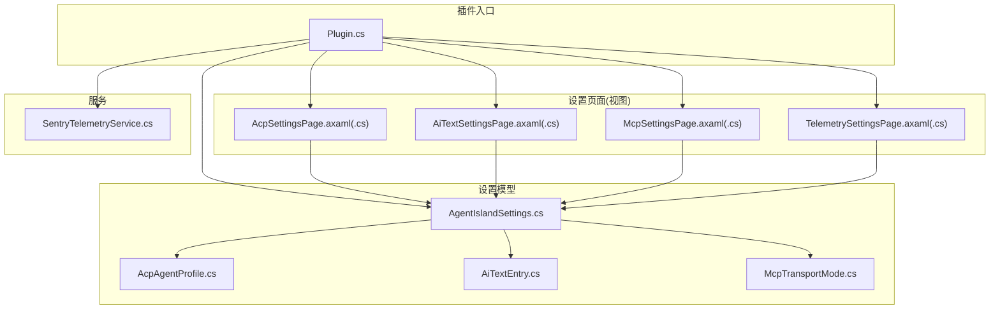
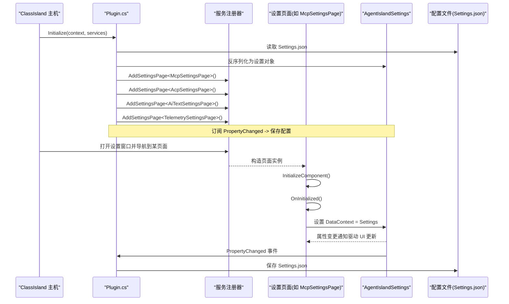
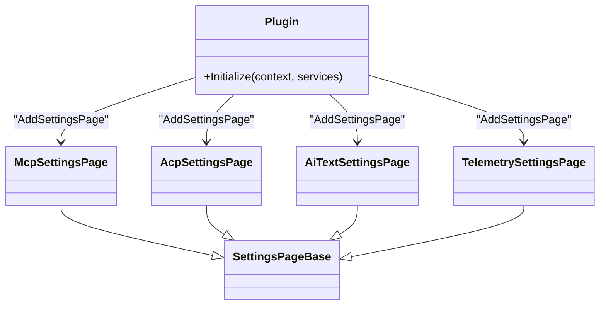
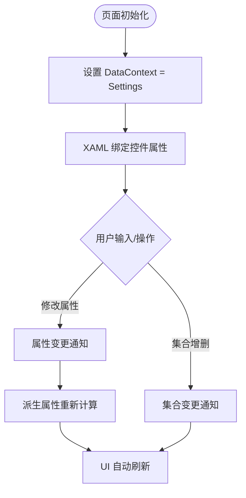
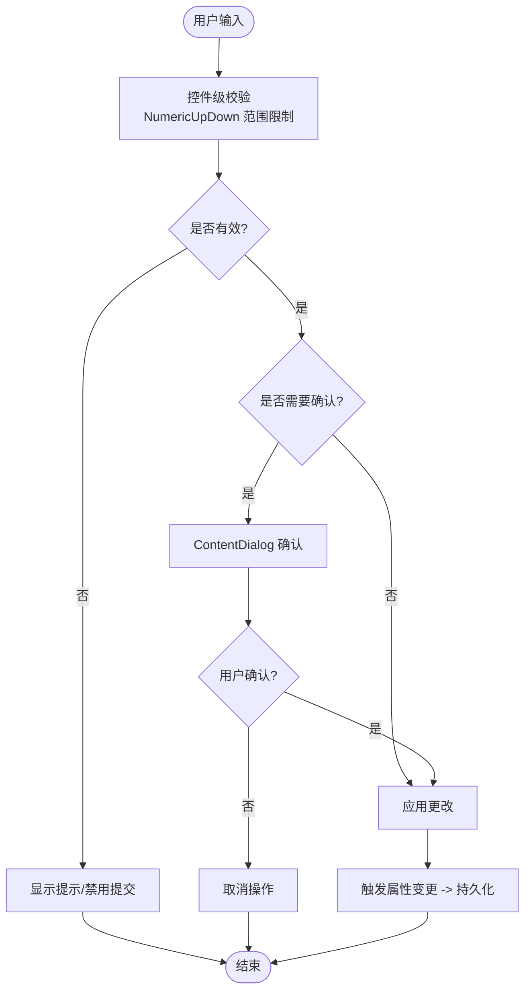
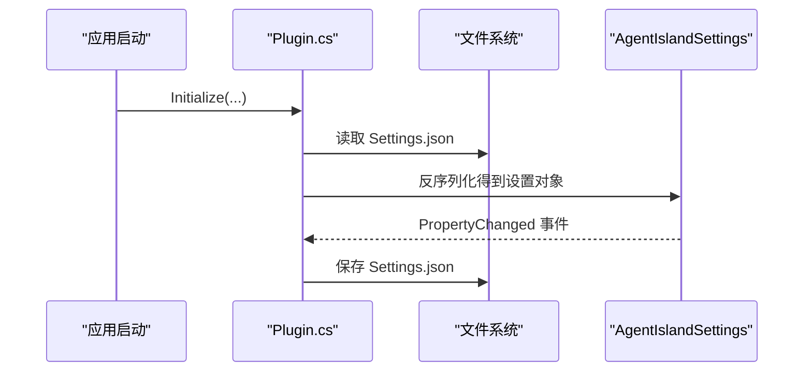
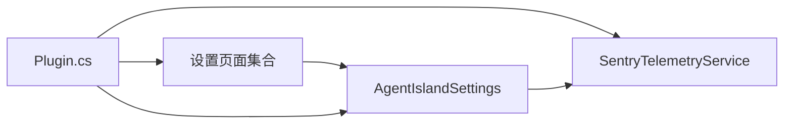

# 设置页面开发

<cite>
**本文引用的文件**
- [Plugin.cs](file://Plugin.cs)
- [AgentIslandSettings.cs](file://Models/AgentIslandSettings.cs)
- [AcpAgentProfile.cs](file://Models/AcpAgentProfile.cs)
- [AiTextEntry.cs](file://Models/AiTextEntry.cs)
- [McpTransportMode.cs](file://Models/McpTransportMode.cs)
- [SentryTelemetryService.cs](file://Services/SentryTelemetryService.cs)
- [AcpSettingsPage.axaml.cs](file://Views/SettingsPages/AcpSettingsPage.axaml.cs)
- [AcpSettingsPage.axaml](file://Views/SettingsPages/AcpSettingsPage.axaml)
- [AiTextSettingsPage.axaml.cs](file://Views/SettingsPages/AiTextSettingsPage.axaml.cs)
- [AiTextSettingsPage.axaml](file://Views/SettingsPages/AiTextSettingsPage.axaml)
- [McpSettingsPage.axaml.cs](file://Views/SettingsPages/McpSettingsPage.axaml.cs)
- [McpSettingsPage.axaml](file://Views/SettingsPages/McpSettingsPage.axaml)
- [TelemetrySettingsPage.axaml.cs](file://Views/SettingsPages/TelemetrySettingsPage.axaml.cs)
- [TelemetrySettingsPage.axaml](file://Views/SettingsPages/TelemetrySettingsPage.axaml)
</cite>

## 目录
1. [简介](#简介)
2. [项目结构](#项目结构)
3. [核心组件](#核心组件)
4. [架构总览](#架构总览)
5. [详细组件分析](#详细组件分析)
6. [依赖关系分析](#依赖关系分析)
7. [性能与可维护性建议](#性能与可维护性建议)
8. [故障排查指南](#故障排查指南)
9. [结论](#结论)
10. [附录](#附录)

## 简介
本指南面向希望在 ClassIsland 插件框架中开发“设置页面”的开发者，围绕以下目标展开：
- 使用 MVVM 模式创建自定义设置页面，实现数据绑定与交互逻辑分离
- 通过 AddSettingsPage 注册机制完成页面导航与发现
- 表单验证与用户输入处理的最佳实践
- 配置数据的持久化（JSON 序列化与文件读写）
- 国际化支持与响应式布局设计要点
- 测试方法与调试技巧

## 项目结构
本项目采用按功能域组织的目录结构：
- Views/SettingsPages：各设置页面的视图与代码后置（MVVM 中的 View 与 ViewModel 宿主）
- Models：设置模型、集合项与枚举（ViewModel 的数据源）
- Services：遥测服务（SentryTelemetryService）
- Plugin.cs：插件入口，负责加载配置、注册设置页、启动/停止服务等

图表来源
- [Plugin.cs:29-53](file://Plugin.cs#L29-L53)
- [AgentIslandSettings.cs:13-232](file://Models/AgentIslandSettings.cs#L13-L232)
- [AcpSettingsPage.axaml.cs:18-29](file://Views/SettingsPages/AcpSettingsPage.axaml.cs#L18-L29)
- [AiTextSettingsPage.axaml.cs:14-20](file://Views/SettingsPages/AiTextSettingsPage.axaml.cs#L14-L20)
- [McpSettingsPage.axaml.cs:19-31](file://Views/SettingsPages/McpSettingsPage.axaml.cs#L19-L31)
- [TelemetrySettingsPage.axaml.cs:20-33](file://Views/SettingsPages/TelemetrySettingsPage.axaml.cs#L20-L33)
- [SentryTelemetryService.cs:11-40](file://Services/SentryTelemetryService.cs#L11-L40)

章节来源
- [Plugin.cs:29-53](file://Plugin.cs#L29-L53)

## 核心组件
- 设置模型 AgentIslandSettings
  - 基于 ObservableObject 的属性变更通知，提供集合属性（AiTextEntries、AcpAgents）与派生属性（ConnectionAddress、IsTelemetryActive 等）
  - 对集合进行 Hook/Unhook，保证集合项变更时触发聚合属性更新
- 设置页面基类 SettingsPageBase
  - 所有设置页面继承该基类，并在 OnInitialized 中设置 DataContext 为全局设置实例
- 设置页面注册
  - 在插件初始化阶段通过 services.AddSettingsPage<T>() 将页面注册到系统，供设置窗口导航显示
- 遥测服务 SentryTelemetryService
  - 根据隐私协议与 DSN 状态动态初始化/关闭 Sentry SDK，并提供 WithInstrumentation 工具方法

章节来源
- [AgentIslandSettings.cs:13-232](file://Models/AgentIslandSettings.cs#L13-L232)
- [AcpSettingsPage.axaml.cs:25-29](file://Views/SettingsPages/AcpSettingsPage.axaml.cs#L25-L29)
- [AiTextSettingsPage.axaml.cs:16-20](file://Views/SettingsPages/AiTextSettingsPage.axaml.cs#L16-L20)
- [McpSettingsPage.axaml.cs:26-31](file://Views/SettingsPages/McpSettingsPage.axaml.cs#L26-L31)
- [TelemetrySettingsPage.axaml.cs:27-33](file://Views/SettingsPages/TelemetrySettingsPage.axaml.cs#L27-L33)
- [Plugin.cs:45-48](file://Plugin.cs#L45-L48)
- [SentryTelemetryService.cs:21-40](file://Services/SentryTelemetryService.cs#L21-L40)

## 架构总览
下图展示了设置页面从注册到渲染、再到数据持久化的整体流程。

图表来源
- [Plugin.cs:29-53](file://Plugin.cs#L29-L53)
- [McpSettingsPage.axaml.cs:26-31](file://Views/SettingsPages/McpSettingsPage.axaml.cs#L26-L31)
- [AcpSettingsPage.axaml.cs:25-29](file://Views/SettingsPages/AcpSettingsPage.axaml.cs#L25-L29)
- [AiTextSettingsPage.axaml.cs:16-20](file://Views/SettingsPages/AiTextSettingsPage.axaml.cs#L16-L20)
- [TelemetrySettingsPage.axaml.cs:27-33](file://Views/SettingsPages/TelemetrySettingsPage.axaml.cs#L27-L33)

## 详细组件分析

### 设置页面注册与导航
- 注册方式
  - 在插件初始化中调用 services.AddSettingsPage<T>() 完成页面注册
- 页面生命周期
  - 页面构造函数中 InitializeComponent() 加载 XAML
  - OnInitialized() 中设置 DataContext 为全局设置对象
- 页面元信息
  - 每个页面使用 [SettingsPageInfo] 特性声明 id、name、category，用于设置窗口菜单展示与路由

图表来源
- [Plugin.cs:45-48](file://Plugin.cs#L45-L48)
- [McpSettingsPage.axaml.cs:14-19](file://Views/SettingsPages/McpSettingsPage.axaml.cs#L14-L19)
- [AcpSettingsPage.axaml.cs:13-18](file://Views/SettingsPages/AcpSettingsPage.axaml.cs#L13-L18)
- [AiTextSettingsPage.axaml.cs:9-14](file://Views/SettingsPages/AiTextSettingsPage.axaml.cs#L9-L14)
- [TelemetrySettingsPage.axaml.cs:15-20](file://Views/SettingsPages/TelemetrySettingsPage.axaml.cs#L15-L20)

章节来源
- [Plugin.cs:45-48](file://Plugin.cs#L45-L48)
- [McpSettingsPage.axaml.cs:14-19](file://Views/SettingsPages/McpSettingsPage.axaml.cs#L14-L19)
- [AcpSettingsPage.axaml.cs:13-18](file://Views/SettingsPages/AcpSettingsPage.axaml.cs#L13-L18)
- [AiTextSettingsPage.axaml.cs:9-14](file://Views/SettingsPages/AiTextSettingsPage.axaml.cs#L9-L14)
- [TelemetrySettingsPage.axaml.cs:15-20](file://Views/SettingsPages/TelemetrySettingsPage.axaml.cs#L15-L20)

### MVVM 数据绑定与集合管理
- 数据上下文
  - 各页面在 OnInitialized 或构造函数中将 DataContext 设置为 Plugin.Settings
- 双向绑定
  - XAML 中使用 Binding 将控件属性与模型属性绑定，例如端口、开关、文本框等
- 集合操作
  - 新增/删除条目通过 ObservableCollection 的 Add/Remove 实现，UI 自动刷新
- 派生属性
  - 当基础属性变化时，通过 OnPropertyChanged 触发派生属性更新（如连接地址、统计摘要）

图表来源
- [AcpSettingsPage.axaml.cs:25-29](file://Views/SettingsPages/AcpSettingsPage.axaml.cs#L25-L29)
- [AiTextSettingsPage.axaml.cs:16-20](file://Views/SettingsPages/AiTextSettingsPage.axaml.cs#L16-L20)
- [McpSettingsPage.axaml.cs:26-31](file://Views/SettingsPages/McpSettingsPage.axaml.cs#L26-L31)
- [TelemetrySettingsPage.axaml.cs:27-33](file://Views/SettingsPages/TelemetrySettingsPage.axaml.cs#L27-L33)
- [AgentIslandSettings.cs:240-273](file://Models/AgentIslandSettings.cs#L240-L273)

章节来源
- [AcpSettingsPage.axaml.cs:25-29](file://Views/SettingsPages/AcpSettingsPage.axaml.cs#L25-L29)
- [AiTextSettingsPage.axaml.cs:16-20](file://Views/SettingsPages/AiTextSettingsPage.axaml.cs#L16-L20)
- [McpSettingsPage.axaml.cs:26-31](file://Views/SettingsPages/McpSettingsPage.axaml.cs#L26-L31)
- [TelemetrySettingsPage.axaml.cs:27-33](file://Views/SettingsPages/TelemetrySettingsPage.axaml.cs#L27-L33)
- [AgentIslandSettings.cs:240-273](file://Models/AgentIslandSettings.cs#L240-L273)

### 表单验证与用户输入处理
- 数值范围校验
  - 端口使用 NumericUpDown 控件，设置 Minimum/Maximum 限制合法范围
- 条件可用性与提示
  - 某些选项在特定条件下禁用或隐藏（如 SSE 传输模式当前不可用）
- 二次确认
  - 隐私协议同意/撤回使用 ContentDialog 进行确认，避免误操作
- 剪贴板与外部链接
  - 复制连接地址到剪贴板；打开帮助文档链接

图表来源
- [McpSettingsPage.axaml:26-36](file://Views/SettingsPages/McpSettingsPage.axaml#L26-L36)
- [McpSettingsPage.axaml:39-49](file://Views/SettingsPages/McpSettingsPage.axaml#L39-L49)
- [TelemetrySettingsPage.axaml.cs:75-124](file://Views/SettingsPages/TelemetrySettingsPage.axaml.cs#L75-L124)
- [McpSettingsPage.axaml.cs:43-54](file://Views/SettingsPages/McpSettingsPage.axaml.cs#L43-L54)

章节来源
- [McpSettingsPage.axaml:26-36](file://Views/SettingsPages/McpSettingsPage.axaml#L26-L36)
- [McpSettingsPage.axaml:39-49](file://Views/SettingsPages/McpSettingsPage.axaml#L39-L49)
- [TelemetrySettingsPage.axaml.cs:75-124](file://Views/SettingsPages/TelemetrySettingsPage.axaml.cs#L75-L124)
- [McpSettingsPage.axaml.cs:43-54](file://Views/SettingsPages/McpSettingsPage.axaml.cs#L43-L54)

### 配置数据持久化（JSON 序列化与文件读写）
- 加载配置
  - 插件初始化时从 Settings.json 反序列化为 AgentIslandSettings 对象
- 保存配置
  - 订阅 Settings.PropertyChanged，任何属性变更均触发保存
- JSON 字段映射
  - 使用 JsonPropertyName 指定序列化键名，确保前后端一致

图表来源
- [Plugin.cs:31-34](file://Plugin.cs#L31-L34)
- [AgentIslandSettings.cs:37-173](file://Models/AgentIslandSettings.cs#L37-L173)

章节来源
- [Plugin.cs:31-34](file://Plugin.cs#L31-L34)
- [AgentIslandSettings.cs:37-173](file://Models/AgentIslandSettings.cs#L37-L173)

### 设置页面示例与最佳实践

#### MCP 设置页面
- 功能点
  - 启用/禁用服务器、端口设置、传输模式选择、连接地址复制、帮助链接
- 关键实现
  - 监听关键属性变更，必要时请求重启
  - 使用 Clipboard 复制地址，使用 Flyout 反馈结果

章节来源
- [McpSettingsPage.axaml.cs:26-41](file://Views/SettingsPages/McpSettingsPage.axaml.cs#L26-L41)
- [McpSettingsPage.axaml.cs:43-54](file://Views/SettingsPages/McpSettingsPage.axaml.cs#L43-L54)
- [McpSettingsPage.axaml.cs:56-63](file://Views/SettingsPages/McpSettingsPage.axaml.cs#L56-L63)
- [McpSettingsPage.axaml:16-83](file://Views/SettingsPages/McpSettingsPage.axaml#L16-L83)

#### ACP 设置页面
- 功能点
  - 列表管理（新增/移除/批量启用/禁用），状态与摘要文本
- 关键实现
  - 通过集合操作与派生属性更新 UI 状态

章节来源
- [AcpSettingsPage.axaml.cs:31-64](file://Views/SettingsPages/AcpSettingsPage.axaml.cs#L31-L64)
- [AcpSettingsPage.axaml:41-102](file://Views/SettingsPages/AcpSettingsPage.axaml#L41-L102)
- [AgentIslandSettings.cs:214-238](file://Models/AgentIslandSettings.cs#L214-L238)

#### AI 文字设置页面
- 功能点
  - 条目增删、ID/描述/内容编辑
- 关键实现
  - 使用 ItemsControl 绑定集合，DataTemplate 定义条目模板

章节来源
- [AiTextSettingsPage.axaml.cs:22-34](file://Views/SettingsPages/AiTextSettingsPage.axaml.cs#L22-L34)
- [AiTextSettingsPage.axaml:25-70](file://Views/SettingsPages/AiTextSettingsPage.axaml#L25-L70)
- [AiTextEntry.cs:1-31](file://Models/AiTextEntry.cs#L1-L31)

#### 遥测与隐私设置页面
- 功能点
  - 遥测开关、隐私协议同意/撤回、自定义 DSN、测试消息
- 关键实现
  - 根据 IsUsingCustomDsn 与 HasAgreedToPrivacyPolicy 动态切换 UI
  - 使用 ContentDialog 进行重要操作的二次确认

章节来源
- [TelemetrySettingsPage.axaml.cs:35-73](file://Views/SettingsPages/TelemetrySettingsPage.axaml.cs#L35-L73)
- [TelemetrySettingsPage.axaml.cs:75-124](file://Views/SettingsPages/TelemetrySettingsPage.axaml.cs#L75-L124)
- [TelemetrySettingsPage.axaml:16-101](file://Views/SettingsPages/TelemetrySettingsPage.axaml#L16-L101)

### 国际化支持
- 现状
  - 当前设置页面文案以中文硬编码为主
- 建议方案
  - 引入资源字典或本地化库，将字符串抽取为资源键
  - 在 XAML 中使用 x:Static 或绑定到资源管理器
  - 运行时根据系统语言或用户偏好切换资源包

[本节为概念性指导，不直接分析具体文件]

### 响应式布局设计
- 现有布局
  - 使用 ScrollViewer + StackPanel 组合，适配不同屏幕尺寸
- 建议优化
  - 使用 Grid 与自适应列宽，提升复杂表单的可读性
  - 针对小屏设备减少内边距与间距，提高信息密度
  - 合理使用 Expander 折叠区域，降低首屏复杂度

[本节为概念性指导，不直接分析具体文件]

## 依赖关系分析
- 页面与模型
  - 所有设置页面均依赖 AgentIslandSettings 作为数据上下文
- 插件与服务
  - Plugin 负责加载配置、注册页面、注入遥测服务
- 遥测服务
  - 根据设置动态初始化/关闭 Sentry SDK，提供带埋点的工具方法

图表来源
- [Plugin.cs:29-53](file://Plugin.cs#L29-L53)
- [AgentIslandSettings.cs:13-232](file://Models/AgentIslandSettings.cs#L13-L232)
- [SentryTelemetryService.cs:11-40](file://Services/SentryTelemetryService.cs#L11-L40)

章节来源
- [Plugin.cs:29-53](file://Plugin.cs#L29-L53)
- [AgentIslandSettings.cs:13-232](file://Models/AgentIslandSettings.cs#L13-L232)
- [SentryTelemetryService.cs:11-40](file://Services/SentryTelemetryService.cs#L11-L40)

## 性能与可维护性建议
- 属性变更节流
  - 高频输入场景下考虑防抖，避免频繁触发保存
- 集合变更优化
  - 对大型集合使用虚拟化控件（如 VirtualizingStackPanel）提升滚动性能
- 派生属性计算
  - 仅在相关基础属性变化时触发，避免全量重算
- 异步 IO
  - 文件保存尽量异步执行，避免阻塞 UI 线程

[本节为通用建议，不直接分析具体文件]

## 故障排查指南
- 设置未生效
  - 检查属性是否正确标记为可观察，并确保 DataContext 已正确设置
- 配置未保存
  - 确认 PropertyChanged 事件是否被订阅，以及保存路径是否存在
- 遥测未上报
  - 检查隐私协议状态与 DSN 配置，确认 EvaluateAndApply 是否被调用
- 页面未显示
  - 确认 AddSettingsPage 是否注册，且 SettingsPageInfo 的 id/name/category 是否正确

章节来源
- [Plugin.cs:31-34](file://Plugin.cs#L31-L34)
- [SentryTelemetryService.cs:30-40](file://Services/SentryTelemetryService.cs#L30-L40)
- [Plugin.cs:45-48](file://Plugin.cs#L45-L48)

## 结论
通过统一的设置模型、清晰的 MVVM 分层与完善的注册机制，本项目实现了可扩展的设置页面体系。结合 JSON 持久化与遥测服务，既保证了用户体验，也便于问题定位与持续改进。建议在后续迭代中完善国际化与响应式布局，进一步提升多语言与多设备的适配能力。

## 附录
- 常用控件与绑定参考
  - ToggleSwitch、ComboBox、TextBox、ItemsControl、Expander 等控件的绑定用法
- 页面元信息特性
  - SettingsPageInfo 的 id/name/category 字段含义与约束

[本节为概念性说明，不直接分析具体文件]