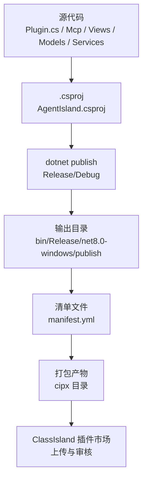
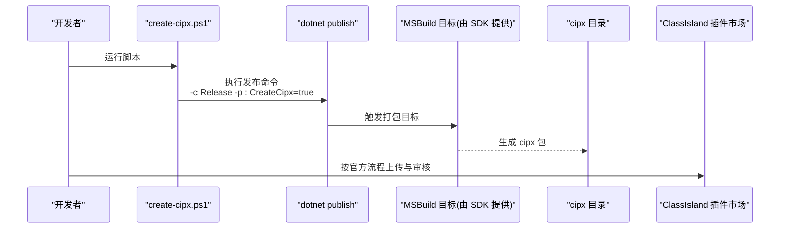
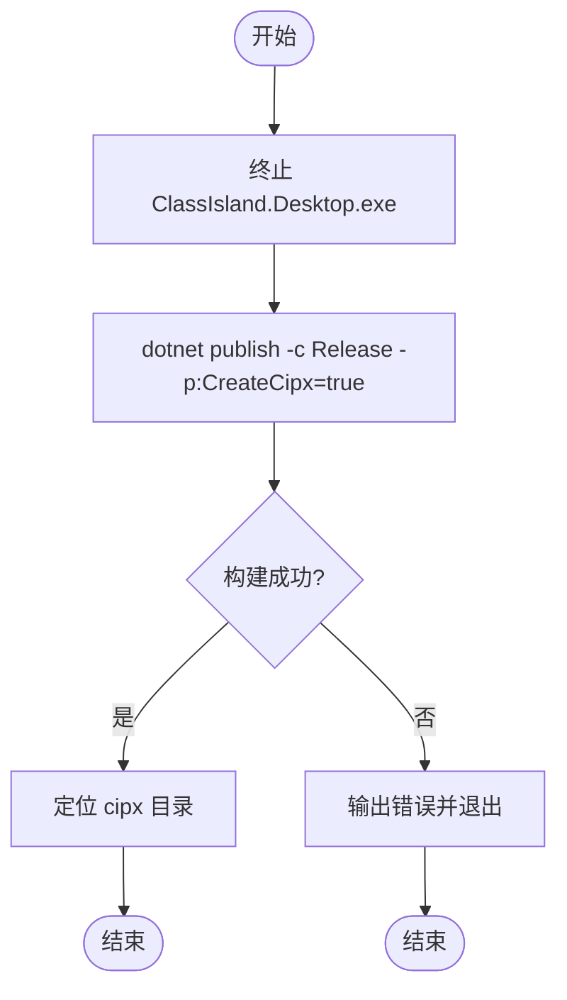
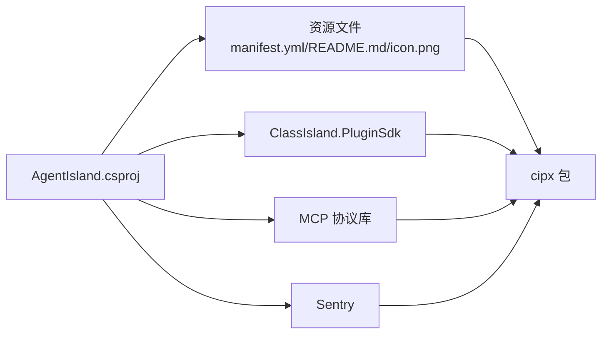

# 构建与发布

<cite>
**本文引用的文件**
- [create-cipx.ps1](file://create-cipx.ps1)
- [build-debug.ps1](file://build-debug.ps1)
- [build-release.ps1](file://build-release.ps1)
- [manifest.yml](file://manifest.yml)
- [AgentIsland.csproj](file://AgentIsland.csproj)
- [.github/workflows/cipx.yml](file://.github/workflows/cipx.yml)
- [README.md](file://README.md)
- [AGENTS.md](file://AGENTS.md)
</cite>

## 目录
1. [简介](#简介)
2. [项目结构](#项目结构)
3. [核心组件](#核心组件)
4. [架构总览](#架构总览)
5. [详细组件分析](#详细组件分析)
6. [依赖分析](#依赖分析)
7. [性能考虑](#性能考虑)
8. [故障排查指南](#故障排查指南)
9. [结论](#结论)
10. [附录](#附录)

## 简介
本指南面向 AgentIsland 插件的开发者与维护者，聚焦于“构建与发布”全流程。内容涵盖：
- 构建脚本 create-cipx.ps1 的使用方法与参数配置
- manifest.yml 清单文件的完整配置项说明（元数据、依赖声明、资源文件管理）
- Debug 与 Release 两种发布模式的差异与适用场景
- 插件打包流程（依赖收集、版本控制、签名验证）
- ClassIsland 插件市场的发布流程与审核要求
- 持续集成示例（GitHub Actions 工作流）
- 版本管理与向后兼容性维护的最佳实践

## 项目结构
本项目为 ClassIsland 插件，基于 .NET 8 + Avalonia，仅支持 Windows。根目录包含构建脚本、清单文件、CI 工作流以及插件源码。关键目录与文件如下：
- 构建与发布脚本：create-cipx.ps1、build-debug.ps1、build-release.ps1
- 清单文件：manifest.yml
- 项目文件：AgentIsland.csproj
- CI 工作流：.github/workflows/cipx.yml
- 文档与入口说明：README.md、AGENTS.md

图表来源
- [AgentIsland.csproj:1-52](file://AgentIsland.csproj#L1-L52)
- [manifest.yml:1-13](file://manifest.yml#L1-L13)
- [create-cipx.ps1:1-9](file://create-cipx.ps1#L1-L9)

章节来源
- [README.md:123-153](file://README.md#L123-L153)
- [AGENTS.md:1-23](file://AGENTS.md#L1-L23)

## 核心组件
- 构建脚本
  - create-cipx.ps1：用于创建 ClassIsland 插件包（.cipx），内部调用 dotnet publish 并启用 CreateCipx 属性以触发打包目标。
  - build-debug.ps1：编译调试版本并启动 ClassIsland 进行联调。
  - build-release.ps1：编译发布版本并启动 ClassIsland 进行联调。
- 清单文件
  - manifest.yml：定义插件元数据、入口程序集、仓库信息、资产根目录与平台支持等。
- 项目文件
  - AgentIsland.csproj：定义目标框架、SDK 版本、NuGet 依赖、静态文件复制策略等。
- 持续集成
  - .github/workflows/cipx.yml：在 GitHub Actions 上执行构建与打包，产出 cipx 工件。

章节来源
- [create-cipx.ps1:1-9](file://create-cipx.ps1#L1-L9)
- [build-debug.ps1:1-10](file://build-debug.ps1#L1-L10)
- [build-release.ps1:1-10](file://build-release.ps1#L1-L10)
- [manifest.yml:1-13](file://manifest.yml#L1-L13)
- [AgentIsland.csproj:1-52](file://AgentIsland.csproj#L1-L52)
- [.github/workflows/cipx.yml:1-34](file://.github/workflows/cipx.yml#L1-L34)

## 架构总览
下图展示了从代码到可发布插件包的端到端流程，包括本地构建与 CI 构建两条路径，最终产出 cipx 包供 ClassIsland 使用或提交至插件市场。

图表来源
- [create-cipx.ps1:1-9](file://create-cipx.ps1#L1-L9)
- [.github/workflows/cipx.yml:26-33](file://.github/workflows/cipx.yml#L26-L33)

## 详细组件分析

### 构建脚本 create-cipx.ps1
- 作用
  - 终止正在运行的 ClassIsland 桌面进程，避免端口占用或文件锁定。
  - 调用 dotnet publish 以 Release 模式构建，并通过 MSBuild 属性 CreateCipx=true 触发插件打包目标。
  - 成功后提示 cipx 包所在目录，并引导参考官方发布文档。
- 参数与行为
  - 无显式命令行参数；通过 MSBuild 属性 CreateCipx 控制是否生成 cipx 包。
  - 构建失败时返回非零退出码，便于自动化流程中断。
- 注意事项
  - 需要已安装 .NET 8 SDK。
  - 若 ClassIsland 开发环境未正确配置，可能无法完成打包或后续运行。

章节来源
- [create-cipx.ps1:1-9](file://create-cipx.ps1#L1-L9)

#### 打包流程图（基于脚本与项目配置）

图表来源
- [create-cipx.ps1:1-9](file://create-cipx.ps1#L1-L9)

### 清单文件 manifest.yml
- 字段说明
  - id：插件唯一标识符，建议采用反向域名风格。
  - name：插件显示名称。
  - description：插件描述。
  - entranceAssembly：入口程序集文件名（通常为插件主 DLL）。
  - url：插件主页或仓库地址。
  - version：插件版本号，遵循语义化版本规范。
  - apiVersion：兼容的 ClassIsland API 版本。
  - author：作者信息。
  - repoOwner：仓库所有者。
  - repoName：仓库名称。
  - assetsRoot：资源根目录名（用于打包时收集资源文件）。
  - supportedOSPlatforms：受支持的操作系统平台列表（当前为 Windows）。
- 资源文件管理
  - 清单中的 assetsRoot 指定了资源根目录，构建系统会据此将资源文件纳入插件包。
  - 项目文件中通过 None 项将清单、说明文档与图标复制到输出目录，确保打包时可被找到。
- 版本与平台
  - version 与 apiVersion 需与 ClassIsland 运行时保持兼容。
  - supportedOSPlatforms 限制插件可在哪些平台上运行。

章节来源
- [manifest.yml:1-13](file://manifest.yml#L1-L13)
- [AgentIsland.csproj:40-49](file://AgentIsland.csproj#L40-L49)

### 项目文件 AgentIsland.csproj
- 目标框架与特性
  - TargetFramework 设置为 net8.0-windows，表明仅支持 Windows 平台的 .NET 8 应用。
  - 启用了隐式 using 与可空引用类型检查。
- ClassIsland 插件 SDK
  - 通过 ClassIslandPluginSdkVersion 指定插件 SDK 版本，该 SDK 提供打包目标与工具链。
- NuGet 依赖
  - 引用 ClassIsland.PluginSdk（排除 runtime/native 资产，避免重复分发）。
  - 引入 MCP 协议相关库与 Sentry 遥测库。
- 静态文件复制
  - 将 manifest.yml、README.md、icon.png 复制到输出目录，保证打包阶段可用。
- 外部依赖拷贝
  - 通过 None 项将部分第三方 DLL 复制到输出目录，确保运行时存在所需依赖。

章节来源
- [AgentIsland.csproj:1-52](file://AgentIsland.csproj#L1-L52)

### 构建与发布模式
- Debug 模式
  - 使用 build-debug.ps1 进行快速迭代与联调。
  - 自动终止 ClassIsland 进程后执行 dotnet build，并以调试输出目录作为扩展加载路径启动 ClassIsland。
  - 适用于开发阶段，不建议用于打包发布。
- Release 模式
  - 使用 build-release.ps1 进行发布级构建。
  - 执行 dotnet publish -c Release，并将发布输出目录作为扩展加载路径启动 ClassIsland。
  - 适合验证打包前的功能完整性。
- 打包模式
  - 使用 create-cipx.ps1 生成 cipx 包，内部通过 dotnet publish -c Release -p:CreateCipx=true 触发打包目标。
  - 打包产物位于 cipx 目录，可直接用于 ClassIsland 安装或提交至插件市场。

章节来源
- [build-debug.ps1:1-10](file://build-debug.ps1#L1-L10)
- [build-release.ps1:1-10](file://build-release.ps1#L1-L10)
- [create-cipx.ps1:1-9](file://create-cipx.ps1#L1-L9)

### 持续集成（GitHub Actions）
- 触发条件
  - 推送与拉取请求到 main 分支，或手动触发 workflow_dispatch。
- 作业步骤
  - 检出代码。
  - 安装 .NET 8 SDK。
  - 执行 dotnet publish -c Release -p:CreateCipx=true 构建 cipx 包。
  - 上传 cipx 目录作为构建工件。
- 使用方式
  - 在 Actions 页面下载“CIPX Package”工件，即可用于本地安装或提交至插件市场。

章节来源
- [.github/workflows/cipx.yml:1-34](file://.github/workflows/cipx.yml#L1-L34)

## 依赖分析
- 运行时依赖
  - ClassIsland 运行时与插件 SDK：通过 ClassIsland.PluginSdk 引入，并在项目中排除其 runtime/native 资产以避免冗余。
  - MCP 协议相关库：用于暴露与管理 MCP 服务。
  - Sentry：用于遥测与错误上报。
- 静态资源依赖
  - manifest.yml、README.md、icon.png 通过项目文件复制到输出目录，参与打包。
- 第三方 DLL 拷贝
  - 项目通过 None 项将若干第三方 DLL 复制到输出目录，确保运行时可用。

图表来源
- [AgentIsland.csproj:22-49](file://AgentIsland.csproj#L22-L49)

章节来源
- [AgentIsland.csproj:22-49](file://AgentIsland.csproj#L22-L49)

## 性能考虑
- 构建优化
  - 使用 Release 模式构建以获得更优的运行时性能与体积。
  - 合理设置 CopyToOutputDirectory 策略，避免不必要的文件复制。
- 运行时优化
  - 按需引入依赖，减少运行时负载。
  - 对日志与遥测进行开关控制，避免在生产环境产生过多开销。

[本节为通用指导，不直接分析具体文件]

## 故障排查指南
- 构建失败
  - 确认已安装 .NET 8 SDK，且环境变量 PATH 中包含 dotnet。
  - 检查 ClassIsland 开发环境是否按官方文档正确配置。
- 打包失败
  - 确认 manifest.yml 存在且格式正确。
  - 确认入口程序集名称与清单中 entranceAssembly 一致。
  - 检查 assetsRoot 指向的资源目录是否存在。
- 运行失败
  - 确保 ClassIsland 进程未被占用（脚本会自动终止）。
  - 检查端口占用与防火墙设置。
  - 查看 ClassIsland 日志与 Sentry 遥测信息定位问题。

章节来源
- [create-cipx.ps1:1-9](file://create-cipx.ps1#L1-L9)
- [build-debug.ps1:1-10](file://build-debug.ps1#L1-L10)
- [build-release.ps1:1-10](file://build-release.ps1#L1-L10)
- [README.md:123-153](file://README.md#L123-L153)

## 结论
通过统一的构建脚本与清单文件，AgentIsland 插件实现了从源码到 cipx 包的标准化发布流程。结合 GitHub Actions 的持续集成，可以稳定地生成可分发的插件包。建议在发布前严格校验清单与资源文件，遵循版本管理与兼容性策略，确保用户获得一致的体验。

[本节为总结性内容，不直接分析具体文件]

## 附录

### 构建与发布操作清单
- 本地构建与联调
  - 调试模式：运行 build-debug.ps1
  - 发布模式：运行 build-release.ps1
- 打包
  - 运行 create-cipx.ps1，产物位于 cipx 目录
- 持续集成
  - 推送代码至 main 分支或手动触发工作流，下载“CIPX Package”工件

章节来源
- [AGENTS.md:7-23](file://AGENTS.md#L7-L23)
- [.github/workflows/cipx.yml:1-34](file://.github/workflows/cipx.yml#L1-L34)

### 清单字段速查表
- id：插件唯一标识
- name：插件名称
- description：插件描述
- entranceAssembly：入口程序集
- url：仓库或主页链接
- version：插件版本
- apiVersion：API 兼容版本
- author：作者
- repoOwner：仓库所有者
- repoName：仓库名称
- assetsRoot：资源根目录
- supportedOSPlatforms：支持平台列表

章节来源
- [manifest.yml:1-13](file://manifest.yml#L1-L13)

### 版本管理与向后兼容性最佳实践
- 使用语义化版本（主版本.次版本.修订号），仅在破坏性变更时提升主版本。
- 保持 apiVersion 与 ClassIsland 运行时兼容，必要时在清单中明确支持的 API 范围。
- 在 README 或更新日志中记录重大变更与迁移指引。
- 在 CI 中固定 .NET SDK 版本，确保构建一致性。
- 对敏感信息与密钥不要随插件包分发，改用运行时配置或安全存储。

[本节为通用指导，不直接分析具体文件]