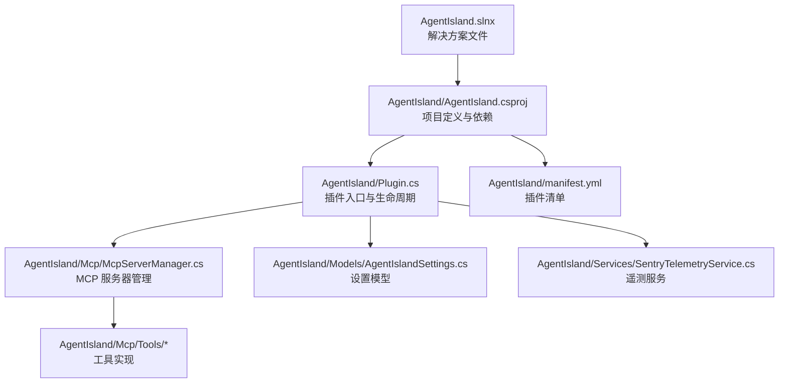
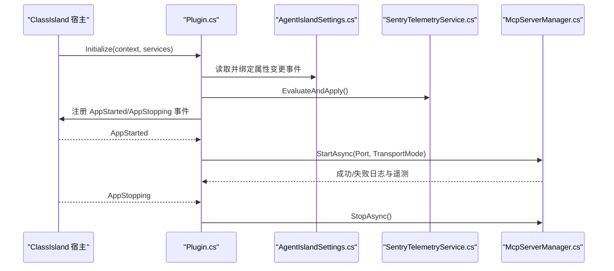
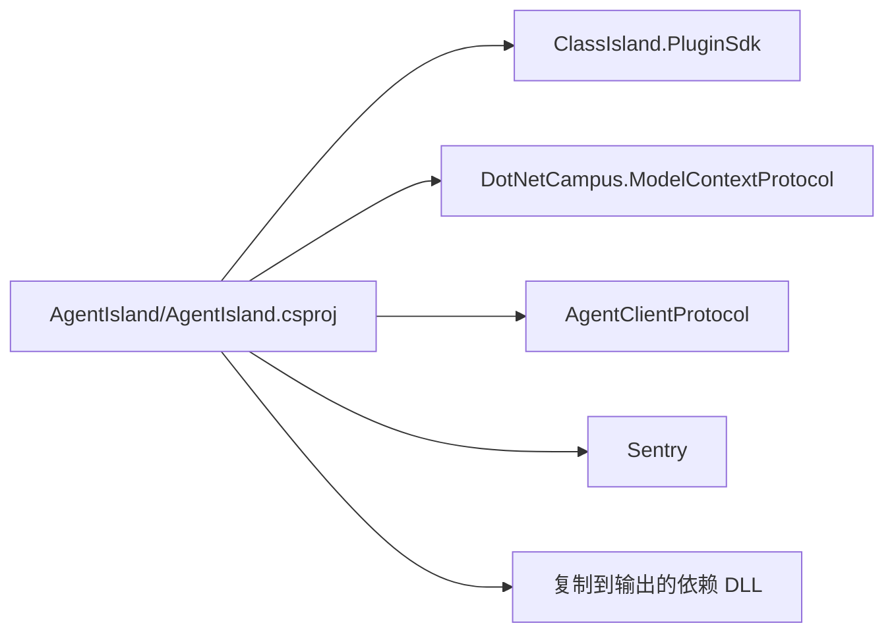

# 环境搭建

<cite>
**本文引用的文件**   
- [AgentIsland.csproj](file://AgentIsland/AgentIsland.csproj)
- [manifest.yml](file://AgentIsland/manifest.yml)
- [build.ps1](file://build.ps1)
- [build-release.ps1](file://build-release.ps1)
- [Plugin.cs](file://AgentIsland/Plugin.cs)
- [McpServerManager.cs](file://AgentIsland/Mcp/McpServerManager.cs)
- [AgentIslandSettings.cs](file://AgentIsland/Models/AgentIslandSettings.cs)
- [McpTransportMode.cs](file://AgentIsland/Models/McpTransportMode.cs)
- [SentryTelemetryService.cs](file://AgentIsland/Services/SentryTelemetryService.cs)
- [cipx.ps1](file://cipx.ps1)
- [cipx-debug.ps1](file://cipx-debug.ps1)
- [AgentIsland.slnx](file://AgentIsland.slnx)
</cite>

## 更新摘要
**变更内容**   
- 更新了项目结构说明，反映源代码现在位于 AgentIsland/ 目录下
- 修正了所有文件路径引用，从根目录改为 AgentIsland/ 子目录
- 更新了构建脚本的路径配置和输出目录说明
- 保持了原有的文档结构和功能完整性

## 目录
1. [简介](#简介)
2. [项目结构](#项目结构)
3. [核心组件](#核心组件)
4. [架构总览](#架构总览)
5. [详细组件分析](#详细组件分析)
6. [依赖分析](#依赖分析)
7. [性能考虑](#性能考虑)
8. [故障排查指南](#故障排查指南)
9. [结论](#结论)
10. [附录](#附录)

## 简介
本指南面向 AgentIsland 插件开发者，提供从零开始的环境搭建与构建说明。内容涵盖：
- .NET 8.0 SDK 安装与配置
- ClassIsland 开发环境准备
- Visual Studio / VS Code 项目配置
- 关键 NuGet 依赖包说明（ClassIsland.PluginSdk、DotNetCampus.ModelContextProtocol、AgentClientProtocol 等）
- 构建脚本 build.ps1、build-release.ps1、cipx.ps1 与 cipx-debug.ps1 的参数与执行步骤
- 项目文件结构与清单 manifest.yml 字段含义
- 常见环境问题排查与解决方案

## 项目结构
AgentIsland 是一个基于 Avalonia 的 Windows 桌面插件，源代码位于 `AgentIsland/` 目录下，目标框架为 net8.0-windows，通过 ClassIsland.PluginSdk 集成到 ClassIsland 宿主中，并在运行时暴露 MCP Server 给外部智能体或工具调用。

**图表来源**
- [AgentIsland.csproj:1-56](file://AgentIsland/AgentIsland.csproj#L1-L56)
- [Plugin.cs:1-138](file://AgentIsland/Plugin.cs#L1-L138)
- [McpServerManager.cs:1-130](file://AgentIsland/Mcp/McpServerManager.cs#L1-L130)
- [AgentIslandSettings.cs:1-394](file://AgentIsland/Models/AgentIslandSettings.cs#L1-L394)
- [SentryTelemetryService.cs:1-182](file://AgentIsland/Services/SentryTelemetryService.cs#L1-L182)
- [manifest.yml:1-16](file://AgentIsland/manifest.yml#L1-L16)
- [AgentIsland.slnx:1-4](file://AgentIsland.slnx#L1-L4)

## 核心组件
- 插件入口与生命周期：负责加载配置、注册服务、启动/停止 MCP 服务器、处理遥测。
- MCP 服务器管理器：封装 McpServer 的创建、传输模式选择（StreamableHttp 或 SSE）、工具注册与启停。
- 设置模型：集中管理端口、传输模式、遥测开关、隐私协议同意状态、ACP 相关选项等，并支持自动持久化。
- 遥测服务：根据用户设置动态初始化/关闭 Sentry SDK，提供异常捕获与埋点辅助方法。

## 架构总览
下图展示了插件在 ClassIsland 宿主中的运行流程：插件初始化时加载设置、注册 UI 与能力；应用启动后按配置启动 MCP 服务器；应用退出时优雅停止。

**图表来源**
- [Plugin.cs:33-121](file://AgentIsland/Plugin.cs#L33-L121)
- [AgentIslandSettings.cs:28-173](file://AgentIsland/Models/AgentIslandSettings.cs#L28-L173)
- [SentryTelemetryService.cs:30-69](file://AgentIsland/Services/SentryTelemetryService.cs#L30-L69)
- [McpServerManager.cs:25-82](file://AgentIsland/Mcp/McpServerManager.cs#L25-L82)

## 详细组件分析

### 插件入口与生命周期（AgentIsland/Plugin.cs）
- 职责
  - 加载插件配置并监听属性变更以自动保存。
  - 注册遥测服务、通知提供者、组件、设置页与自动化动作。
  - 订阅宿主应用启动/停止事件，按需启动/停止 MCP 服务器。
- 关键点
  - 使用 IAppHost 获取日志服务。
  - 根据 TransportMode 输出不同端点提示（mcp/sse）。
  - 异常捕获并通过遥测上报。

**章节来源**
- [Plugin.cs:1-138](file://AgentIsland/Plugin.cs#L1-L138)

### MCP 服务器管理器（AgentIsland/Mcp/McpServerManager.cs）
- 职责
  - 构建并启动本地 HTTP 服务器，支持两种传输模式：
    - StreamableHttp：默认端点 mcp
    - SSE：端点 sse
  - 注册内置工具集。
  - 提供 StopAsync 与 Dispose 进行资源清理。
- 关键点
  - 使用 McpServerBuilder 组装服务器与工具。
  - 使用 CancellationTokenSource 控制生命周期。
  - 异常路径记录日志并上报遥测。

**章节来源**
- [McpServerManager.cs:1-130](file://AgentIsland/Mcp/McpServerManager.cs#L1-L130)

### 设置模型（AgentIsland/Models/AgentIslandSettings.cs）
- 职责
  - 集中管理插件所有可配置项，包括端口、传输模式、遥测开关、隐私协议同意、自定义 DSN、ACP 列表等。
  - 提供派生属性（如连接地址、遥测是否活跃、是否可使用自定义 DSN 等）。
  - 集合属性变更联动派生属性更新。
- 关键点
  - 使用 ObservableObject 与 SetProperty 触发属性变更。
  - ConnectionAddress 根据 Port 与 TransportMode 计算。
  - IsTelemetryActive 受隐私协议与自定义 DSN 影响。

**章节来源**
- [AgentIslandSettings.cs:1-394](file://AgentIsland/Models/AgentIslandSettings.cs#L1-L394)
- [McpTransportMode.cs:1-18](file://AgentIsland/Models/McpTransportMode.cs#L1-L18)

### 遥测服务（AgentIsland/Services/SentryTelemetryService.cs）
- 职责
  - 根据设置动态初始化/关闭 Sentry SDK。
  - 提供 CaptureException、AddBreadcrumb、WithInstrumentation 系列方法用于统一埋点。
- 关键点
  - 监听设置变更，必要时先关闭再重新初始化。
  - 支持自定义 DSN 覆盖默认值。

**章节来源**
- [SentryTelemetryService.cs:1-182](file://AgentIsland/Services/SentryTelemetryService.cs#L1-L182)

## 依赖分析
- 目标框架
  - net8.0-windows（Windows 平台专用）
- 关键 NuGet 包
  - ClassIsland.PluginSdk：插件 SDK，排除 runtime/native 资产，避免将宿主运行时打包进插件。
  - DotNetCampus.ModelContextProtocol：MCP 服务端实现。
  - AgentClientProtocol：ACP 客户端协议。
  - Sentry：遥测与错误上报。
- 运行时复制文件
  - 将若干依赖 DLL 复制到输出目录，确保 ClassIsland 宿主能正确加载。

**图表来源**
- [AgentIsland.csproj:22-37](file://AgentIsland/AgentIsland.csproj#L22-L37)

## 性能考虑
- 仅在需要时启用遥测，避免不必要的网络开销。
- 合理设置 MCP 端口与传输模式，优先使用 StreamableHttp。
- 避免在高频路径中进行阻塞 IO 操作，必要时使用异步 API。

## 故障排查指南
- 无法找到 ClassIsland 调试二进制
  - 现象：构建脚本报错或无法启动 ClassIsland。
  - 原因：未设置环境变量 ClassIsland_DebugBinaryDirectory。
  - 解决：在系统或用户环境变量中添加该变量，指向 ClassIsland 的调试可执行文件所在目录。
- 端口占用导致 MCP 服务器启动失败
  - 现象：启动时报错或无法访问 http://localhost:端口/mcp。
  - 解决：修改端口或释放占用进程，确认防火墙允许本机回环访问。
- 传输模式不兼容
  - 现象：客户端无法连接或握手失败。
  - 解决：确认客户端支持的传输模式与插件设置一致（StreamableHttp 或 SSE）。
- 遥测未生效
  - 现象：未收到错误或无埋点数据。
  - 解决：检查隐私协议同意状态与遥测开关；如需绕过协议检查，可配置自定义 DSN。
- 依赖缺失或版本冲突
  - 现象：编译或运行时找不到某些 DLL。
  - 解决：确保 .NET 8.0 SDK 已安装且可用；清理 bin/obj 后重新还原与构建；核对 csproj 中复制文件的版本与路径。

**章节来源**
- [build.ps1:1-10](file://build.ps1#L1-L10)
- [build-release.ps1:1-11](file://build-release.ps1#L1-L11)
- [AgentIsland.csproj:31-37](file://AgentIsland/AgentIsland.csproj#L31-L37)
- [SentryTelemetryService.cs:30-90](file://AgentIsland/Services/SentryTelemetryService.cs#L30-L90)

## 结论
完成 .NET 8.0 SDK 与 ClassIsland 开发环境准备后，通过提供的构建脚本即可快速构建并启动插件。理解插件入口、MCP 服务器管理与设置模型是后续扩展功能的关键。建议遵循本文的依赖与清单规范，结合遥测与日志进行问题定位与性能优化。

## 附录

### 一、环境准备清单
- 操作系统：Windows
- .NET 8.0 SDK：必须安装并加入 PATH
- ClassIsland 开发环境：参考官方文档提前搭建
- 环境变量：ClassIsland_DebugBinaryDirectory 指向 ClassIsland 调试可执行文件目录

### 二、IDE 配置要点
- Visual Studio
  - 打开 AgentIsland.slnx 解决方案文件。
  - 确保工作负载包含".NET 桌面开发"和"ASP.NET 和 Web 开发"（以便调试 HTTP 服务）。
  - 在"调试"选项中，可将启动程序设置为 ClassIsland 的可执行文件，并将参数传入插件输出目录。
- VS Code
  - 安装 C# 扩展。
  - 打开 AgentIsland.slnx 解决方案文件。
  - 在 launchSettings.json 中配置启动 ClassIsland 并传入插件输出目录参数（若可行）。
  - 或使用终端直接执行构建脚本。

**章节来源**
- [AgentIsland.slnx:1-4](file://AgentIsland.slnx#L1-L4)

### 三、NuGet 依赖说明
- ClassIsland.PluginSdk
  - 作用：提供插件基类、宿主交互、UI 扩展点等。
  - 注意：排除 runtime/native 资产，避免将宿主运行时打包进插件。
- DotNetCampus.ModelContextProtocol
  - 作用：MCP 服务端实现，用于暴露工具接口。
- AgentClientProtocol
  - 作用：ACP 客户端协议，用于与外部 Agent 通信。
- Sentry
  - 作用：错误上报与性能埋点。

**章节来源**
- [AgentIsland.csproj:22-37](file://AgentIsland/AgentIsland.csproj#L22-L37)

### 四、构建脚本使用方法
- build.ps1
  - 用途：构建调试版本并启动 ClassIsland 调试实例，便于热调试。
  - 行为：终止现有 ClassIsland 进程 -> dotnet build -c Debug -> 若成功则启动 ClassIsland 并传入调试输出目录。
  - 适用场景：日常开发与联调。
  - 输出目录：AgentIsland/bin/Debug/net8.0-windows
- build-release.ps1
  - 用途：构建发布版本并启动 ClassIsland 调试实例，便于验证打包产物。
  - 行为：终止现有 ClassIsland 进程 -> dotnet build -c Release -> 若成功则启动 ClassIsland 并传入发布输出目录。
  - 适用场景：发布前验证与打包测试。
  - 输出目录：AgentIsland/bin/Release/net8.0-windows
- cipx.ps1
  - 用途：创建 ClassIsland 插件包（cipx 格式）。
  - 行为：终止现有 ClassIsland 进程 -> dotnet publish -c Release -p:CreateCipx=true -> 生成 cipx 包。
  - 输出位置：AgentIsland/cipx
- cipx-debug.ps1
  - 用途：创建调试版本的 ClassIsland 插件包。
  - 行为：终止现有 ClassIsland 进程 -> dotnet publish -c Debug -p:CreateCipx=true -> 生成 cipx 包。
  - 输出位置：AgentIsland/cipx

**章节来源**
- [build.ps1:1-10](file://build.ps1#L1-L10)
- [build-release.ps1:1-11](file://build-release.ps1#L1-L11)
- [cipx.ps1:1-9](file://cipx.ps1#L1-L9)
- [cipx-debug.ps1:1-10](file://cipx-debug.ps1#L1-L10)

### 五、项目文件结构说明（csproj 关键字段）
- TargetFramework
  - 值：net8.0-windows
  - 含义：仅适用于 Windows 平台的 .NET 8 桌面应用。
- ImplicitUsings / Nullable
  - 含义：启用隐式 using 与可空引用类型检查，提升代码质量。
- PackageReference
  - ClassIsland.PluginSdk：插件 SDK，排除 runtime/native。
  - DotNetCampus.ModelContextProtocol：MCP 服务端。
  - AgentClientProtocol：ACP 客户端。
  - Sentry：遥测。
- None 复制规则
  - 将若干依赖 DLL 复制到输出目录，确保宿主可加载。
  - 将 manifest.yml、README.md、icon.png 复制到输出目录。
- EmbeddedResource
  - 将 echo-cave.txt 嵌入为资源文件。

**章节来源**
- [AgentIsland.csproj:1-56](file://AgentIsland/AgentIsland.csproj#L1-L56)

### 六、清单文件 manifest.yml 字段说明
- id：插件唯一标识（ShihaoShen.AgentIsland）
- name：插件名称（AgentIsland）
- description：插件描述（你的课表，智能进化。）
- entranceAssembly：插件入口程序集名（AgentIsland.dll）
- url：仓库或主页链接
- version：插件版本（0.1.0.0）
- apiVersion：适配的 ClassIsland API 版本（2.0.0.0）
- author：作者（Shihao Shen）
- repoOwner / repoName：仓库所有者与名称
- assetsRoot：资源根目录（main）
- supportedOSPlatforms：支持的平台（Windows）
- dependencies：可选依赖项（lrs2187.sai，非必需）

**章节来源**
- [manifest.yml:1-16](file://AgentIsland/manifest.yml#L1-L16)

### 七、常见问题速查
- 问：如何切换 MCP 传输模式？
  - 答：在设置中更改 TransportMode（StreamableHttp 或 SSE），重启 ClassIsland 后生效。
- 问：如何查看当前 MCP 地址？
  - 答：根据 Port 与 TransportMode 生成，例如 http://localhost:端口/mcp 或 http://localhost:端口/sse。
- 问：遥测开关为何不可用？
  - 答：需同意隐私政策或配置自定义 DSN 后方可开启。
- 问：项目文件在哪里？
  - 答：主要项目文件位于 AgentIsland/ 目录下，包括 AgentIsland.csproj、manifest.yml 等。
- 问：如何打开解决方案？
  - 答：使用 AgentIsland.slnx 解决方案文件，它会自动定位到 AgentIsland/AgentIsland.csproj。

**章节来源**
- [AgentIslandSettings.cs:175-211](file://AgentIsland/Models/AgentIslandSettings.cs#L175-L211)
- [SentryTelemetryService.cs:77-90](file://AgentIsland/Services/SentryTelemetryService.cs#L77-L90)
- [AgentIsland.slnx:1-4](file://AgentIsland.slnx#L1-L4)