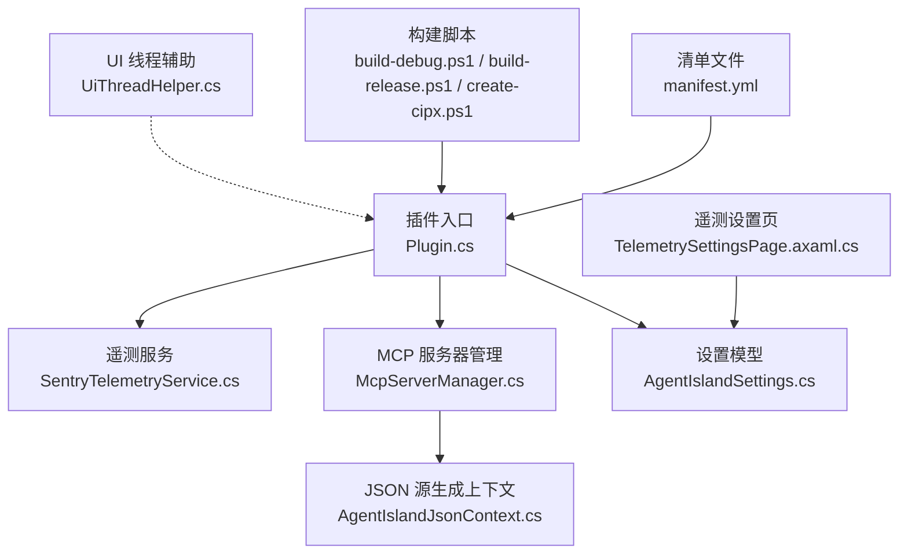
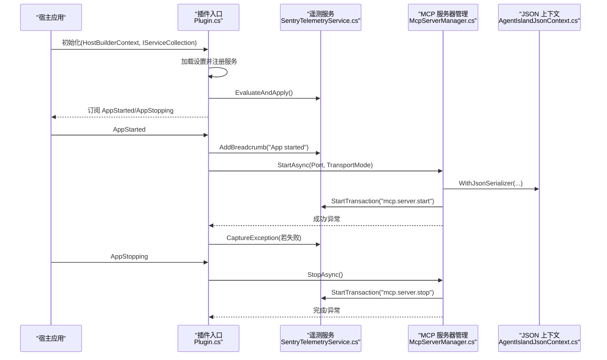
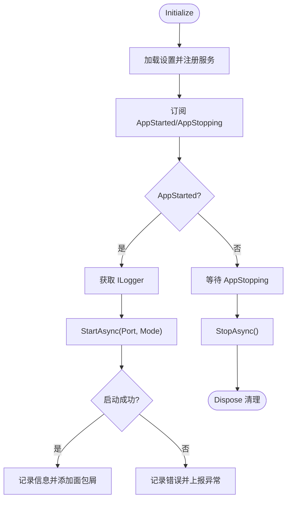
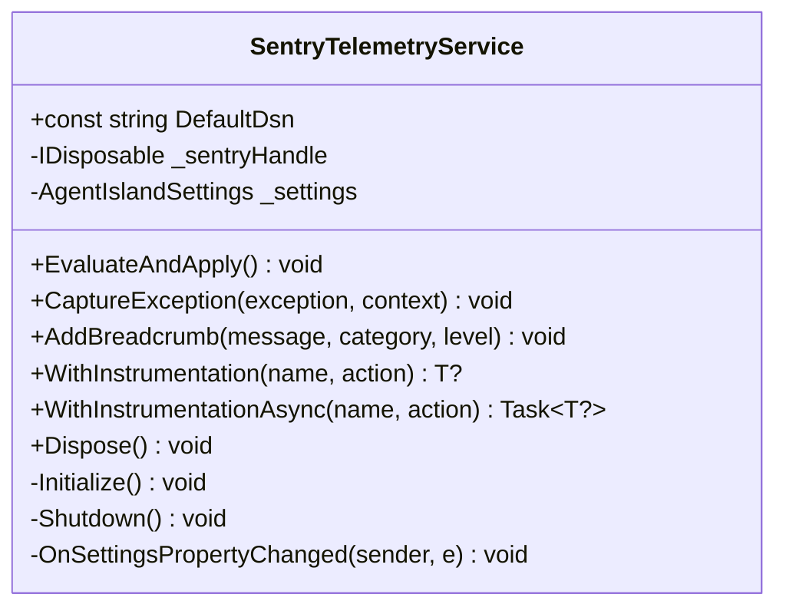
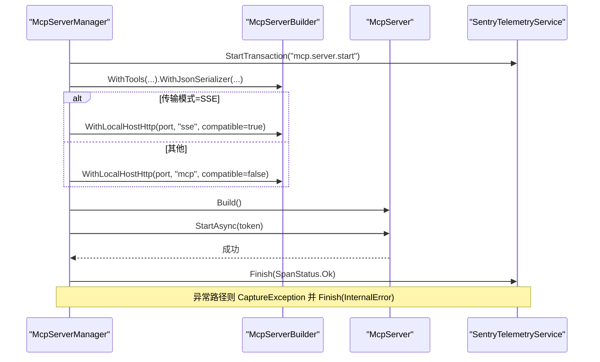
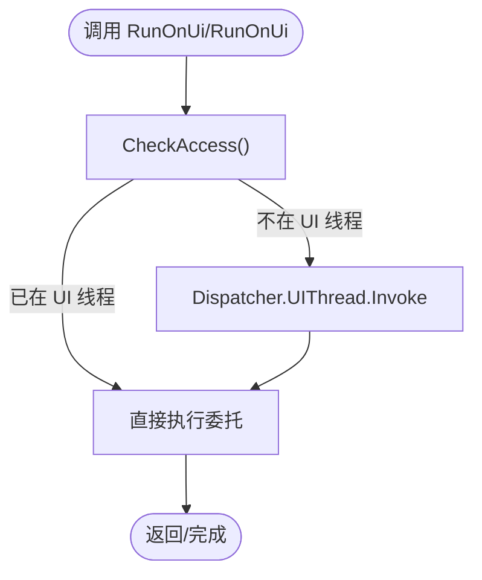
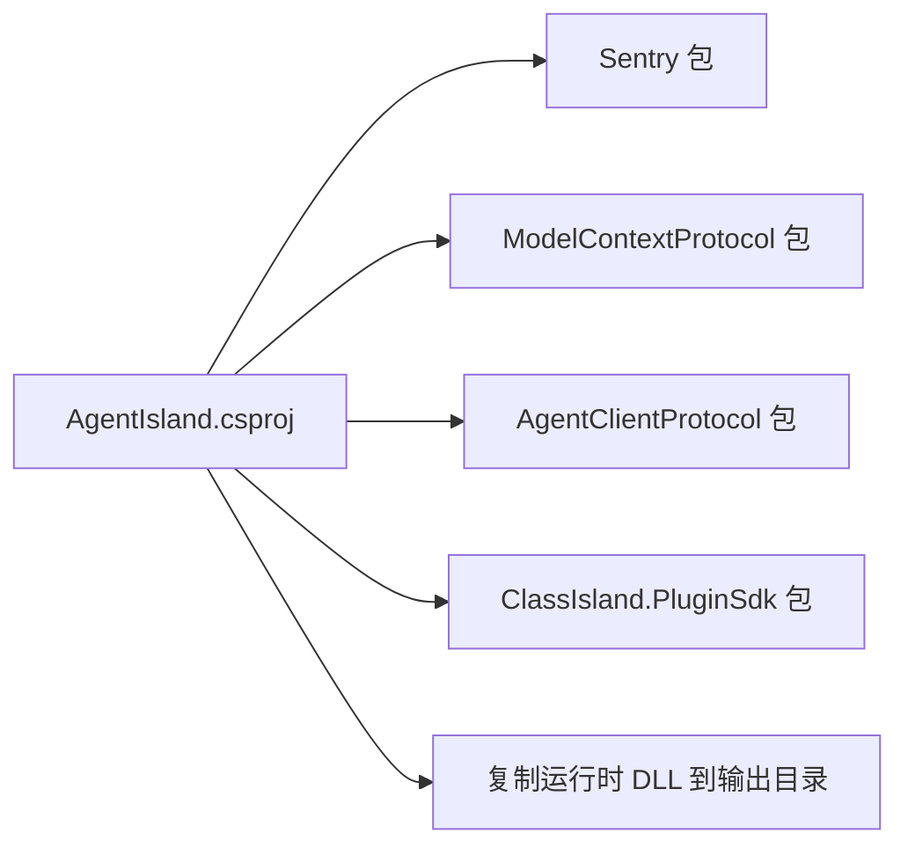

# 调试与测试

<cite>
**本文引用的文件**   
- [AgentIsland.csproj](file://AgentIsland.csproj)
- [Plugin.cs](file://Plugin.cs)
- [SentryTelemetryService.cs](file://Services/SentryTelemetryService.cs)
- [McpServerManager.cs](file://Mcp/McpServerManager.cs)
- [UiThreadHelper.cs](file://Helpers/UiThreadHelper.cs)
- [AgentIslandJsonContext.cs](file://Models/AgentIslandJsonContext.cs)
- [AgentIslandSettings.cs](file://Models/AgentIslandSettings.cs)
- [TelemetrySettingsPage.axaml.cs](file://Views/SettingsPages/TelemetrySettingsPage.axaml.cs)
- [build-debug.ps1](file://build-debug.ps1)
- [build-release.ps1](file://build-release.ps1)
- [create-cipx.ps1](file://create-cipx.ps1)
- [manifest.yml](file://manifest.yml)
</cite>

## 目录
1. [简介](#简介)
2. [项目结构](#项目结构)
3. [核心组件](#核心组件)
4. [架构总览](#架构总览)
5. [详细组件分析](#详细组件分析)
6. [依赖关系分析](#依赖关系分析)
7. [性能考虑](#性能考虑)
8. [故障排查指南](#故障排查指南)
9. [结论](#结论)
10. [附录](#附录)

## 简介
本指南面向 AgentIsland 插件开发者，聚焦于调试与测试实践。内容涵盖：
- Visual Studio 调试环境配置（附加进程、断点、变量监视）
- Sentry 遥测集成与使用（错误追踪、性能监控、日志策略）
- 线程安全与 UI 线程调用（UiThreadHelper 的使用场景）
- 单元测试编写方法与框架建议
- 常见问题排查（端口冲突、权限问题、内存泄漏检测）
- JSON 序列化调试技巧与性能优化

## 项目结构
本项目为 ClassIsland 插件，采用 .NET 8 + Avalonia 技术栈，通过 MCP 提供工具能力，并集成 Sentry 进行遥测。关键入口与模块如下：
- 插件入口：负责初始化设置、注册服务、启动 MCP 服务器、处理生命周期事件
- 遥测服务：封装 Sentry SDK 的初始化、开关控制、异常捕获、事务埋点
- MCP 服务器管理：构建并启动本地 HTTP 传输，注册工具集，统一异常上报
- UI 线程辅助：在 UI 线程执行委托，避免跨线程访问控件
- JSON 源生成上下文：用于 System.Text.Json 的高性能序列化
- 设置模型：集中管理插件配置项，包括遥测开关、隐私协议、DSN 等
- 遥测设置页：用户交互界面，支持同意/撤回隐私协议、测试发送消息
- 构建脚本：调试/发布打包与插件包创建

图表来源
- [Plugin.cs:29-79](file://Plugin.cs#L29-L79)
- [SentryTelemetryService.cs:30-69](file://Services/SentryTelemetryService.cs#L30-L69)
- [McpServerManager.cs:25-82](file://Mcp/McpServerManager.cs#L25-L82)
- [AgentIslandJsonContext.cs:1-20](file://Models/AgentIslandJsonContext.cs#L1-L20)
- [AgentIslandSettings.cs:148-200](file://Models/AgentIslandSettings.cs#L148-L200)
- [TelemetrySettingsPage.axaml.cs:27-42](file://Views/SettingsPages/TelemetrySettingsPage.axaml.cs#L27-L42)
- [build-debug.ps1:1-10](file://build-debug.ps1#L1-L10)
- [build-release.ps1:1-10](file://build-release.ps1#L1-L10)
- [create-cipx.ps1:1-9](file://create-cipx.ps1#L1-L9)
- [manifest.yml:1-13](file://manifest.yml#L1-L13)

章节来源
- [AgentIsland.csproj:1-52](file://AgentIsland.csproj#L1-L52)
- [Plugin.cs:1-114](file://Plugin.cs#L1-L114)
- [SentryTelemetryService.cs:1-182](file://Services/SentryTelemetryService.cs#L1-L182)
- [McpServerManager.cs:1-125](file://Mcp/McpServerManager.cs#L1-L125)
- [UiThreadHelper.cs:1-25](file://Helpers/UiThreadHelper.cs#L1-L25)
- [AgentIslandJsonContext.cs:1-20](file://Models/AgentIslandJsonContext.cs#L1-L20)
- [AgentIslandSettings.cs:1-394](file://Models/AgentIslandSettings.cs#L1-L394)
- [TelemetrySettingsPage.axaml.cs:1-145](file://Views/SettingsPages/TelemetrySettingsPage.axaml.cs#L1-L145)
- [build-debug.ps1:1-10](file://build-debug.ps1#L1-L10)
- [build-release.ps1:1-10](file://build-release.ps1#L1-L10)
- [create-cipx.ps1:1-9](file://create-cipx.ps1#L1-L9)
- [manifest.yml:1-13](file://manifest.yml#L1-L13)

## 核心组件
- 插件入口（Plugin）
  - 加载并持久化设置；注册遥测服务、MCP 服务器、通知提供者、组件与设置页；订阅应用启动/停止事件；在启动时根据配置启动 MCP 服务器，失败时记录日志并上报异常。
- 遥测服务（SentryTelemetryService）
  - 基于设置动态初始化或关闭 Sentry SDK；提供异常捕获、面包屑记录、同步/异步操作包装以自动埋点事务与异常。
- MCP 服务器管理（McpServerManager）
  - 构建 McpServer，注册工具集，按传输模式选择端点；启动/停止过程均包含事务埋点与异常上报。
- UI 线程辅助（UiThreadHelper）
  - 提供在 UI 线程执行委托的方法，内部检查当前线程并在需要时调度到 UI 线程。
- JSON 源生成上下文（AgentIslandJsonContext）
  - 声明式注册可序列化类型，启用驼峰命名策略，提升 System.Text.Json 性能。
- 设置模型（AgentIslandSettings）
  - 聚合遥测开关、隐私协议、自定义 DSN、MCP 端口与传输模式等；派生属性联动更新。
- 遥测设置页（TelemetrySettingsPage）
  - 用户界面：显示默认/自定义 DSN 横幅、测试按钮（Debug 或自定义 DSN 可见）、同意/撤回隐私协议对话框。

章节来源
- [Plugin.cs:29-97](file://Plugin.cs#L29-L97)
- [SentryTelemetryService.cs:30-174](file://Services/SentryTelemetryService.cs#L30-L174)
- [McpServerManager.cs:25-112](file://Mcp/McpServerManager.cs#L25-L112)
- [UiThreadHelper.cs:5-24](file://Helpers/UiThreadHelper.cs#L5-L24)
- [AgentIslandJsonContext.cs:1-20](file://Models/AgentIslandJsonContext.cs#L1-L20)
- [AgentIslandSettings.cs:148-200](file://Models/AgentIslandSettings.cs#L148-L200)
- [TelemetrySettingsPage.axaml.cs:27-129](file://Views/SettingsPages/TelemetrySettingsPage.axaml.cs#L27-L129)

## 架构总览
下图展示插件生命周期、遥测与 MCP 服务器的交互关系。

图表来源
- [Plugin.cs:29-97](file://Plugin.cs#L29-L97)
- [SentryTelemetryService.cs:30-69](file://Services/SentryTelemetryService.cs#L30-L69)
- [McpServerManager.cs:25-112](file://Mcp/McpServerManager.cs#L25-L112)
- [AgentIslandJsonContext.cs:1-20](file://Models/AgentIslandJsonContext.cs#L1-L20)

## 详细组件分析

### 插件入口（Plugin）
- 职责
  - 读取并保存设置；注册遥测、MCP、通知、组件与设置页；监听应用生命周期；启动/停止 MCP 服务器；异常上报。
- 关键点
  - 在应用启动后获取 ILogger 实例并启动 MCP 服务器；失败路径记录日志并上报异常。
  - 在停止阶段优雅关闭 MCP 服务器；异常同样上报。
  - Dispose 中解绑事件并释放资源。

图表来源
- [Plugin.cs:29-97](file://Plugin.cs#L29-L97)

章节来源
- [Plugin.cs:29-114](file://Plugin.cs#L29-L114)

### 遥测服务（SentryTelemetryService）
- 职责
  - 根据设置动态初始化/关闭 Sentry SDK；提供异常捕获、面包屑、同步/异步操作包装。
- 关键点
  - EvaluateAndApply 响应 IsTelemetryEnabled、HasAgreedToPrivacyPolicy、CustomSentryDsn 变化；DSN 变化需先关闭再初始化。
  - Initialize 设置 DSN、采样率、PII、会话跟踪、BeforeSend 标签与 Scope 标签。
  - WithInstrumentation/WithInstrumentationAsync 自动创建事务、记录面包屑、捕获异常并标记状态。

图表来源
- [SentryTelemetryService.cs:11-181](file://Services/SentryTelemetryService.cs#L11-L181)

章节来源
- [SentryTelemetryService.cs:30-174](file://Services/SentryTelemetryService.cs#L30-L174)

### MCP 服务器管理（McpServerManager）
- 职责
  - 构建并启动本地 HTTP 传输的 MCP 服务器；注册工具集；按传输模式选择端点；统一异常上报与事务埋点。
- 关键点
  - StartAsync 创建 CancellationTokenSource，构建服务器，选择 SSE 或 mcp 端点；异常路径上报并结束事务。
  - StopAsync 取消令牌、停止服务器、释放资源；异常路径上报并结束事务。

图表来源
- [McpServerManager.cs:25-82](file://Mcp/McpServerManager.cs#L25-L82)
- [AgentIslandJsonContext.cs:1-20](file://Models/AgentIslandJsonContext.cs#L1-L20)

章节来源
- [McpServerManager.cs:25-112](file://Mcp/McpServerManager.cs#L25-L112)

### UI 线程辅助（UiThreadHelper）
- 使用场景
  - 当非 UI 线程需要更新 UI 或访问控件时，使用 RunOnUi/RunOnUi<T> 确保在 UI 线程执行。
- 实现要点
  - 使用 Dispatcher.UIThread.CheckAccess 判断当前线程；若非 UI 线程则 Invoke 到 UI 线程。

图表来源
- [UiThreadHelper.cs:5-24](file://Helpers/UiThreadHelper.cs#L5-L24)

章节来源
- [UiThreadHelper.cs:5-24](file://Helpers/UiThreadHelper.cs#L5-L24)

### JSON 序列化（AgentIslandJsonContext）
- 作用
  - 通过源生成器预编译序列化逻辑，减少反射开销，提高吞吐与稳定性。
- 配置
  - 注册常用结果类型与列表类型；启用驼峰命名策略。

章节来源
- [AgentIslandJsonContext.cs:1-20](file://Models/AgentIslandJsonContext.cs#L1-L20)

### 遥测设置页（TelemetrySettingsPage）
- 功能
  - 绑定设置对象；根据是否使用自定义 DSN 切换横幅；在 Debug 或自定义 DSN 下显示“测试 Sentry”；提供同意/撤回隐私协议的确认对话框。
- 行为
  - 点击测试按钮直接发送一条消息到 Sentry（便于验证集成）。

章节来源
- [TelemetrySettingsPage.axaml.cs:27-129](file://Views/SettingsPages/TelemetrySettingsPage.axaml.cs#L27-L129)

## 依赖关系分析
- 外部依赖
  - ClassIsland.PluginSdk：插件开发基础
  - DotNetCampus.ModelContextProtocol：MCP 服务端与传输
  - AgentClientProtocol：客户端协议
  - Sentry：遥测与性能监控
- 运行时复制
  - 将必要的 DLL 复制到输出目录，确保运行期可用

图表来源
- [AgentIsland.csproj:22-37](file://AgentIsland.csproj#L22-L37)

章节来源
- [AgentIsland.csproj:22-37](file://AgentIsland.csproj#L22-L37)

## 性能考虑
- JSON 序列化
  - 使用源生成上下文（AgentIslandJsonContext）可减少反射，提升吞吐与稳定性。
- 遥测开销
  - 默认开启 TracesSampleRate=1.0，生产环境可按需调整；避免在高频路径内重复创建事务。
- UI 线程调度
  - 尽量减少跨线程调度次数，批量更新 UI 或使用合适的队列机制。

[本节为通用指导，不直接分析具体文件]

## 故障排查指南

### Visual Studio 调试环境配置
- 附加进程调试
  - 使用调试脚本启动宿主应用，然后在 VS 中附加到 ClassIsland.Desktop.exe 进程。
  - 参考脚本：
    - [build-debug.ps1:1-10](file://build-debug.ps1#L1-L10)
    - [build-release.ps1:1-10](file://build-release.ps1#L1-L10)
- 断点设置
  - 建议在以下位置设置断点：
    - 插件初始化与生命周期事件：[Plugin.cs:29-97](file://Plugin.cs#L29-L97)
    - MCP 服务器启动/停止：[McpServerManager.cs:25-112](file://Mcp/McpServerManager.cs#L25-L112)
    - 遥测初始化与异常捕获：[SentryTelemetryService.cs:30-174](file://Services/SentryTelemetryService.cs#L30-L174)
- 变量监视
  - 监视设置对象（Port、TransportMode、IsTelemetryEnabled、HasAgreedToPrivacyPolicy、CustomSentryDsn）以验证配置生效。
  - 监视遥测句柄与服务实例状态，确认初始化/关闭流程。

章节来源
- [build-debug.ps1:1-10](file://build-debug.ps1#L1-L10)
- [build-release.ps1:1-10](file://build-release.ps1#L1-L10)
- [Plugin.cs:29-97](file://Plugin.cs#L29-L97)
- [McpServerManager.cs:25-112](file://Mcp/McpServerManager.cs#L25-L112)
- [SentryTelemetryService.cs:30-174](file://Services/SentryTelemetryService.cs#L30-L174)

### Sentry 遥测集成与使用
- 初始化与开关
  - 由遥测服务根据设置动态初始化/关闭 SDK；DSN 变化会触发重新初始化。
- 错误追踪
  - 使用 CaptureException 上报异常，并可附加上下文标签。
- 性能监控
  - 使用 WithInstrumentation/WithInstrumentationAsync 包裹关键操作，自动创建事务与面包屑。
- 日志策略
  - 结合 ILogger 与 Sentry 面包屑，形成端到端链路；避免上报敏感信息（PII 已关闭）。

章节来源
- [SentryTelemetryService.cs:30-174](file://Services/SentryTelemetryService.cs#L30-L174)
- [TelemetrySettingsPage.axaml.cs:126-129](file://Views/SettingsPages/TelemetrySettingsPage.axaml.cs#L126-L129)

### 线程安全与跨线程调用
- 使用 UiThreadHelper
  - 在非 UI 线程更新 UI 或访问控件时，务必通过 RunOnUi/RunOnUi<T> 调度到 UI 线程。
- 常见陷阱
  - 在后台任务中直接修改 ObservableCollection 或 UI 控件会导致异常；应先在后台计算，再在 UI 线程更新。

章节来源
- [UiThreadHelper.cs:5-24](file://Helpers/UiThreadHelper.cs#L5-L24)

### 单元测试编写方法与框架建议
- 建议框架
  - xUnit/NUnit/MSTest 均可；推荐 xUnit 配合 Moq 进行依赖注入模拟。
- 测试范围
  - 遥测服务：验证 EvaluateAndApply 在不同设置组合下的行为；验证 WithInstrumentation 的事务与异常捕获。
  - MCP 服务器管理：验证 StartAsync/StopAsync 的幂等性与异常路径。
  - 设置模型：验证派生属性联动（如 ConnectionAddress、IsTelemetryActive、CanToggleTelemetry）。
- 测试数据
  - 使用最小化设置对象与伪造的日志/遥测接口，避免真实网络与 UI 依赖。
- 示例思路
  - 构造不同 HasAgreedToPrivacyPolicy 与 CustomSentryDsn 的组合，断言 IsTelemetryActive 与 CanToggleTelemetry 的结果。
  - 模拟 McpServer 的异常抛出，断言遥测服务是否正确捕获异常并结束事务。

[本节为通用指导，不直接分析具体文件]

### 常见问题排查
- 端口冲突
  - 现象：MCP 服务器无法启动，报端口占用。
  - 排查：检查 Port 设置；确保与其他服务端口不冲突；可在设置页调整端口。
  - 相关代码：
    - [McpServerManager.cs:25-82](file://Mcp/McpServerManager.cs#L25-L82)
    - [AgentIslandSettings.cs:37-62](file://Models/AgentIslandSettings.cs#L37-L62)
- 权限问题
  - 现象：无法写入配置文件或访问系统资源。
  - 排查：以管理员身份运行宿主应用；检查插件目录写权限。
- 内存泄漏检测
  - 方法：使用 Visual Studio 诊断工具或 dotnet-gc 系列工具；关注未释放的事件订阅与长生命周期对象。
  - 重点检查：
    - 插件入口的事件订阅与释放：[Plugin.cs:99-114](file://Plugin.cs#L99-L114)
    - 遥测服务的设置变更订阅与句柄释放：[SentryTelemetryService.cs:176-181](file://Services/SentryTelemetryService.cs#L176-L181)
    - MCP 服务器的取消令牌与服务器实例释放：[McpServerManager.cs:114-125](file://Mcp/McpServerManager.cs#L114-L125)

章节来源
- [McpServerManager.cs:25-112](file://Mcp/McpServerManager.cs#L25-L112)
- [AgentIslandSettings.cs:37-62](file://Models/AgentIslandSettings.cs#L37-L62)
- [Plugin.cs:99-114](file://Plugin.cs#L99-L114)
- [SentryTelemetryService.cs:176-181](file://Services/SentryTelemetryService.cs#L176-L181)
- [McpServerManager.cs:114-125](file://Mcp/McpServerManager.cs#L114-L125)

### JSON 序列化调试技巧与性能优化
- 调试技巧
  - 使用源生成上下文（AgentIslandJsonContext）进行序列化，便于定位缺失的类型注册与命名策略问题。
  - 在 MCP 服务器构建时指定 WithJsonSerializer(AgentIslandJsonContext.Default)，确保一致的行为。
- 性能优化
  - 启用源生成器以减少反射；合理配置 PropertyNamingPolicy；避免频繁创建新的 JsonSerializerOptions。

章节来源
- [AgentIslandJsonContext.cs:1-20](file://Models/AgentIslandJsonContext.cs#L1-L20)
- [McpServerManager.cs:41-51](file://Mcp/McpServerManager.cs#L41-L51)

## 结论
通过合理的调试配置、完善的遥测埋点、严格的线程安全实践以及系统的测试策略，可以显著提升 AgentIsland 插件的可维护性与稳定性。建议在生产环境中谨慎调整遥测采样率，持续监控异常与性能指标，并结合内存诊断工具定期排查潜在泄漏。

[本节为总结性内容，不直接分析具体文件]

## 附录
- 构建与发布
  - 调试版本：使用调试脚本快速编译并启动宿主应用。
  - 发布版本：使用发布脚本生成 Release 产物。
  - 插件包：使用创建 cipx 脚本打包插件。
- 清单文件
  - manifest.yml 定义插件元数据与入口程序集。

章节来源
- [build-debug.ps1:1-10](file://build-debug.ps1#L1-L10)
- [build-release.ps1:1-10](file://build-release.ps1#L1-L10)
- [create-cipx.ps1:1-9](file://create-cipx.ps1#L1-L9)
- [manifest.yml:1-13](file://manifest.yml#L1-L13)