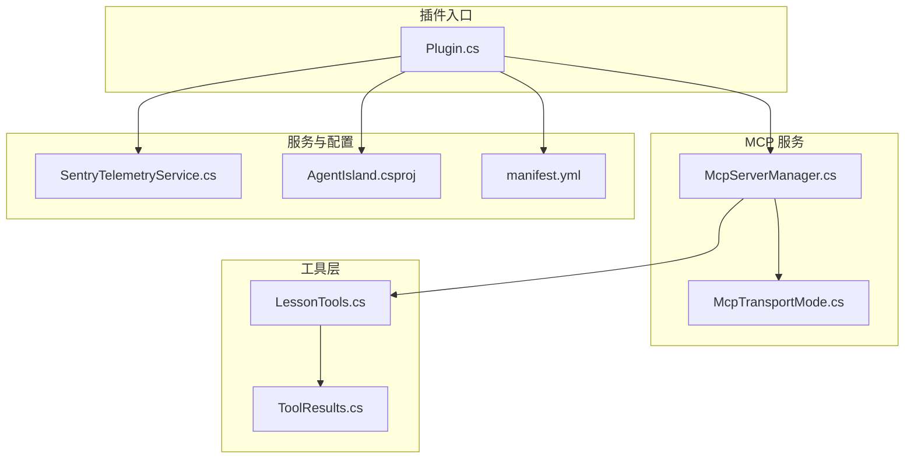
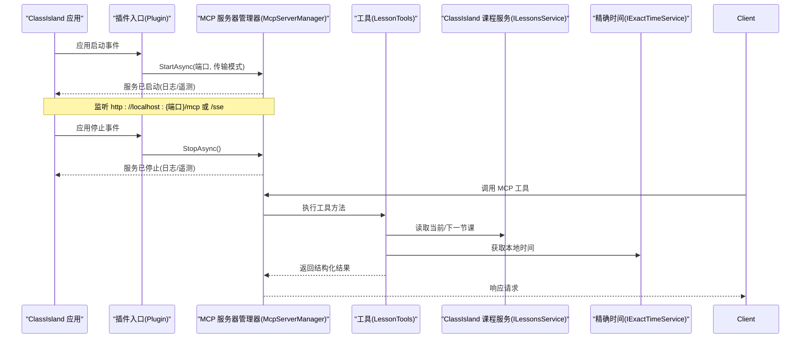
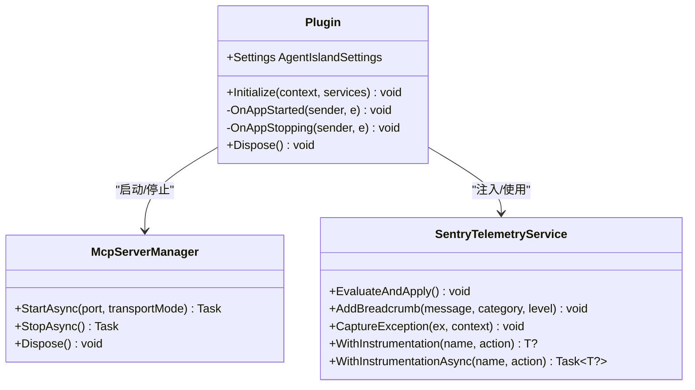
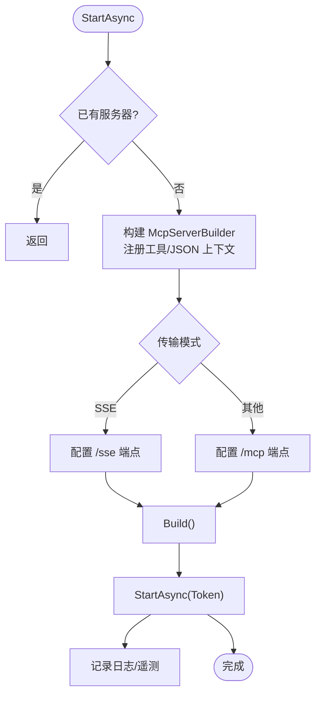
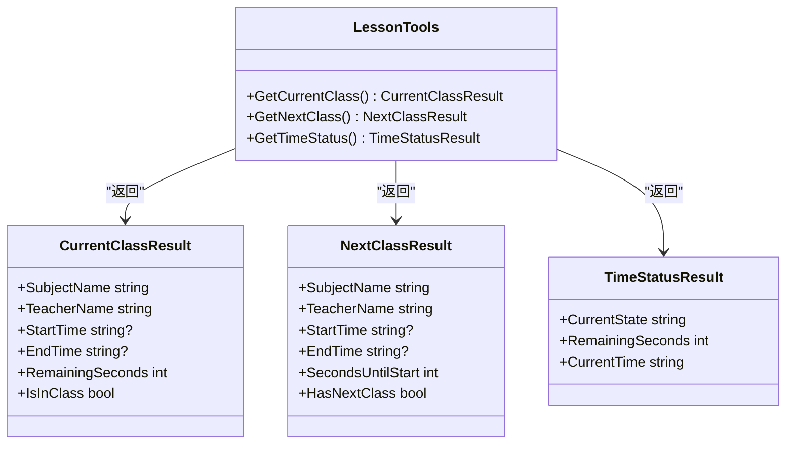
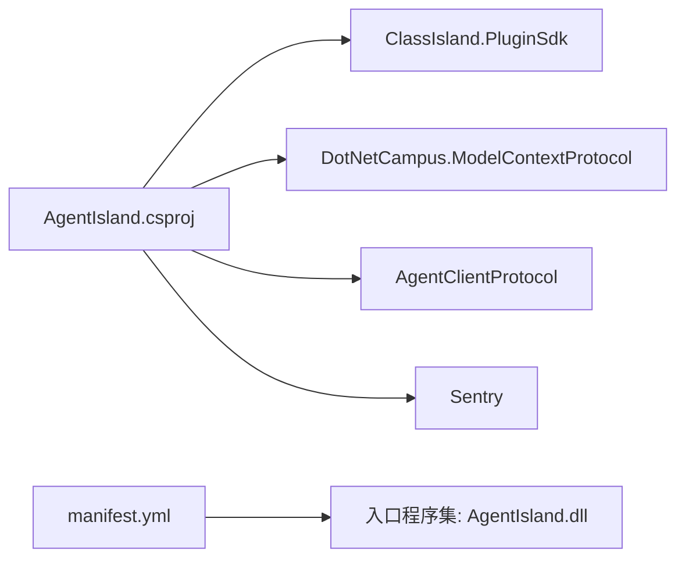

# 快速开始

<cite>
**本文引用的文件**   
- [README.md](file://README.md)
- [manifest.yml](file://manifest.yml)
- [Plugin.cs](file://Plugin.cs)
- [AgentIsland.csproj](file://AgentIsland.csproj)
- [McpServerManager.cs](file://Mcp/McpServerManager.cs)
- [McpTransportMode.cs](file://Models/McpTransportMode.cs)
- [LessonTools.cs](file://Mcp/Tools/LessonTools.cs)
- [ToolResults.cs](file://Models/ToolResults.cs)
- [SentryTelemetryService.cs](file://Services/SentryTelemetryService.cs)
- [build-debug.ps1](file://build-debug.ps1)
- [build-release.ps1](file://build-release.ps1)
- [create-cipx.ps1](file://create-cipx.ps1)
- [McpSettingsPage.axaml.cs](file://Views/SettingsPages/McpSettingsPage.axaml.cs)
</cite>

## 目录
1. [简介](#简介)
2. [项目结构](#项目结构)
3. [核心组件](#核心组件)
4. [架构总览](#架构总览)
5. [详细组件分析](#详细组件分析)
6. [依赖分析](#依赖分析)
7. [性能与运行特性](#性能与运行特性)
8. [常见问题与故障排除](#常见问题与故障排除)
9. [结论](#结论)
10. [附录：配置与示例](#附录配置与示例)

## 简介
AgentIsland 是面向 ClassIsland 的插件，将本地课程表能力以 MCP Server 的形式暴露给外部智能体或工具。安装并启动后，插件会在本机开启一个 MCP 服务，外部客户端可通过该服务读取当前课表状态、查询上下课信息，或直接对指定日期的课表执行换课操作。

- 已暴露工具包括：获取当前上课、下一节课、时间状态、当天课表、学科列表、交换两节课等。
- 默认监听地址：http://localhost:5943/mcp 与 http://localhost:5943/sse（取决于传输模式）。

本节为概览性说明，不直接分析具体代码文件。

## 项目结构
- 插件入口与生命周期管理位于 Plugin.cs，负责加载设置、注册服务、在应用启动时启动 MCP 服务、在应用停止时关闭服务。
- MCP 服务器由 McpServerManager 管理，使用 DotNetCampus.ModelContextProtocol 构建并启动，支持 StreamableHttp 与 SSE 两种传输模式。
- 工具实现位于 Mcp/Tools 下，例如 LessonTools 提供 get_current_class、get_next_class、get_time_status 等工具。
- 模型定义位于 Models 下，包含返回结果记录类型与设置项。
- 遥测服务 SentryTelemetryService 负责异常上报与链路追踪。
- 构建脚本位于根目录，提供调试构建、发布构建与打包 cipx 包的能力。

图表来源
- [Plugin.cs:1-114](file://Plugin.cs#L1-L114)
- [McpServerManager.cs:1-125](file://Mcp/McpServerManager.cs#L1-L125)
- [McpTransportMode.cs:1-18](file://Models/McpTransportMode.cs#L1-L18)
- [LessonTools.cs:1-146](file://Mcp/Tools/LessonTools.cs#L1-L146)
- [ToolResults.cs:1-59](file://Models/ToolResults.cs#L1-L59)
- [SentryTelemetryService.cs:1-182](file://Services/SentryTelemetryService.cs#L1-L182)
- [AgentIsland.csproj:1-52](file://AgentIsland.csproj#L1-L52)
- [manifest.yml:1-13](file://manifest.yml#L1-L13)

章节来源
- [README.md:1-174](file://README.md#L1-L174)
- [Plugin.cs:1-114](file://Plugin.cs#L1-L114)
- [McpServerManager.cs:1-125](file://Mcp/McpServerManager.cs#L1-L125)
- [AgentIsland.csproj:1-52](file://AgentIsland.csproj#L1-L52)
- [manifest.yml:1-13](file://manifest.yml#L1-L13)

## 核心组件
- 插件入口与生命周期
  - 初始化阶段：加载 Settings.json，注册通知提供者、组件、设置页、动作；订阅应用启动/停止事件。
  - 应用启动：根据设置启用 MCP 服务，按端口和传输模式启动，输出日志与遥测面包屑。
  - 应用停止：优雅停止 MCP 服务，捕获异常并上报。
- MCP 服务器管理器
  - 构建 McpServerBuilder，注册工具集，选择 JSON 序列化上下文。
  - 根据传输模式选择端点：StreamableHttp 使用 /mcp，SSE 使用 /sse。
  - 启动与停止均包含异常捕获与遥测事务。
- 工具与结果模型
  - LessonTools 暴露 get_current_class、get_next_class、get_time_status 等工具，内部通过 IAppHost 获取 ClassIsland 服务，并在 UI 线程上执行。
  - ToolResults 定义了各工具的返回记录类型。
- 遥测服务
  - 基于 Sentry SDK，根据隐私协议同意与开关动态初始化/关闭。
  - 提供 WithInstrumentation 包裹同步/异步调用，自动添加事务、面包屑与异常上报。

章节来源
- [Plugin.cs:29-97](file://Plugin.cs#L29-L97)
- [McpServerManager.cs:25-112](file://Mcp/McpServerManager.cs#L25-L112)
- [LessonTools.cs:14-145](file://Mcp/Tools/LessonTools.cs#L14-L145)
- [ToolResults.cs:1-59](file://Models/ToolResults.cs#L1-L59)
- [SentryTelemetryService.cs:30-174](file://Services/SentryTelemetryService.cs#L30-L174)

## 架构总览
插件作为 ClassIsland 的扩展运行，在应用启动时按需启动 MCP 服务，并通过 HTTP 暴露工具。外部客户端通过 MCP 协议访问这些工具，从而读取或修改 ClassIsland 的课程表数据。

图表来源
- [Plugin.cs:55-97](file://Plugin.cs#L55-L97)
- [McpServerManager.cs:25-112](file://Mcp/McpServerManager.cs#L25-L112)
- [LessonTools.cs:22-113](file://Mcp/Tools/LessonTools.cs#L22-L113)

## 详细组件分析

### 插件入口与生命周期（Plugin）
- 职责
  - 加载与持久化设置（Settings.json），属性变更自动保存。
  - 注册遥测服务、通知提供者、UI 组件与设置页面。
  - 在应用启动时根据 IsEnabled 决定是否启动 MCP 服务。
  - 在应用停止时确保 MCP 服务被正确释放。
- 关键点
  - 连接地址由 Port 与 TransportMode 决定，便于用户复制与验证。
  - 所有关键路径均有日志与遥测面包屑，便于问题定位。

图表来源
- [Plugin.cs:29-113](file://Plugin.cs#L29-L113)
- [McpServerManager.cs:19-124](file://Mcp/McpServerManager.cs#L19-L124)
- [SentryTelemetryService.cs:30-174](file://Services/SentryTelemetryService.cs#L30-L174)

章节来源
- [Plugin.cs:29-113](file://Plugin.cs#L29-L113)

### MCP 服务器管理器（McpServerManager）
- 职责
  - 构建并启动 MCP 服务器，注册工具集与 JSON 序列化上下文。
  - 根据传输模式选择端点：/mcp（StreamableHttp）或 /sse（SSE）。
  - 处理启动/停止过程中的异常与遥测事务。
- 关键点
  - 支持多工具注册，便于后续扩展。
  - 启动失败会捕获异常并上报，避免影响宿主应用。

图表来源
- [McpServerManager.cs:25-82](file://Mcp/McpServerManager.cs#L25-L82)
- [McpTransportMode.cs:6-17](file://Models/McpTransportMode.cs#L6-L17)

章节来源
- [McpServerManager.cs:25-112](file://Mcp/McpServerManager.cs#L25-L112)
- [McpTransportMode.cs:1-18](file://Models/McpTransportMode.cs#L1-L18)

### 工具与结果模型（LessonTools 与 ToolResults）
- 工具
  - get_current_class：返回当前课程名、教师、起止时间、剩余秒数、是否正在上课。
  - get_next_class：返回下一节课名、教师、起止时间、距离开始的秒数、是否存在下一节课。
  - get_time_status：返回当前状态、剩余秒数、当前本地时间。
- 结果模型
  - 使用 record 类型定义结构化返回，便于 JSON 序列化与客户端解析。
- 关键点
  - 所有工具均在 UI 线程执行，避免跨线程访问 ClassIsland 服务导致异常。
  - 通过遥测服务包裹调用，自动记录事务与异常。

图表来源
- [LessonTools.cs:14-145](file://Mcp/Tools/LessonTools.cs#L14-L145)
- [ToolResults.cs:1-59](file://Models/ToolResults.cs#L1-L59)

章节来源
- [LessonTools.cs:14-145](file://Mcp/Tools/LessonTools.cs#L14-L145)
- [ToolResults.cs:1-59](file://Models/ToolResults.cs#L1-L59)

### 遥测服务（SentryTelemetryService）
- 职责
  - 根据设置动态初始化/关闭 Sentry SDK。
  - 提供 WithInstrumentation 包装同步/异步调用，自动添加事务、面包屑与异常上报。
- 关键点
  - 支持自定义 DSN，允许跳过隐私协议同意检查。
  - 遥测开关受隐私协议与自定义 DSN 控制。

章节来源
- [SentryTelemetryService.cs:30-174](file://Services/SentryTelemetryService.cs#L30-L174)

## 依赖分析
- 目标框架与运行时
  - net8.0-windows，要求 Windows 平台与 .NET 8。
- 关键 NuGet 包
  - ClassIsland.PluginSdk：插件开发 SDK。
  - DotNetCampus.ModelContextProtocol：MCP 服务端实现。
  - AgentClientProtocol：MCP 客户端协议。
  - Sentry：遥测与异常上报。
- 清单与入口
  - manifest.yml 声明插件 ID、名称、入口程序集、版本、API 版本、作者与仓库信息。
  - csproj 中复制必要 DLL 到输出目录，确保运行时可用。

图表来源
- [AgentIsland.csproj:22-37](file://AgentIsland.csproj#L22-L37)
- [manifest.yml:1-13](file://manifest.yml#L1-L13)

章节来源
- [AgentIsland.csproj:1-52](file://AgentIsland.csproj#L1-L52)
- [manifest.yml:1-13](file://manifest.yml#L1-L13)

## 性能与运行特性
- 传输模式
  - StreamableHttp（现代协议）与 SSE（旧版协议）均可用，默认使用 StreamableHttp。
- 线程模型
  - 工具方法在 UI 线程执行，避免与 ClassIsland 服务的线程冲突。
- 遥测开销
  - 遥测仅在启用且满足条件时初始化，工具调用通过 WithInstrumentation 包裹，开销可控。
- 资源释放
  - 插件与 MCP 服务器均实现 IDisposable，确保应用退出时释放资源。

[本节为通用性能讨论，不直接分析具体代码文件]

## 常见问题与故障排除
- 无法启动 MCP 服务
  - 检查端口是否被占用，确认防火墙未阻止 localhost 访问。
  - 查看应用日志与遥测面包屑，定位启动异常。
- 工具调用无响应
  - 确认传输模式与端点匹配（/mcp 或 /sse）。
  - 检查 ClassIsland 课程服务是否正常（是否有当前/下一节课）。
- 遥测未上报
  - 确认隐私协议已同意或使用自定义 DSN。
  - 检查 IsTelemetryEnabled 与 EffectiveSentryDsn 是否正确。
- 构建/运行报错
  - 请先搭建 ClassIsland 开发环境，否则 dotnet run 或脚本都会失败。
  - 使用提供的 PowerShell 脚本进行构建与运行，避免手动路径错误。

章节来源
- [README.md:123-153](file://README.md#L123-L153)
- [Plugin.cs:67-97](file://Plugin.cs#L67-L97)
- [McpServerManager.cs:76-112](file://Mcp/McpServerManager.cs#L76-L112)
- [SentryTelemetryService.cs:30-90](file://Services/SentryTelemetryService.cs#L30-L90)

## 结论
AgentIsland 通过 MCP 服务将 ClassIsland 的课程表能力开放给外部智能体与工具，具备清晰的插件生命周期、灵活的传输模式与完善的遥测支持。按照本指南完成环境搭建、构建运行与基本配置后，即可快速体验第一个 MCP 工具调用。

[本节为总结性内容，不直接分析具体代码文件]

## 附录：配置与示例

### 开发环境搭建步骤
- 系统与环境
  - Windows 平台，安装 .NET 8 SDK。
  - 参考 ClassIsland 官方文档提前搭建开发环境。
- 克隆与打开项目
  - 使用 IDE 或命令行打开  项目。
- 依赖恢复
  - 首次构建前执行 dotnet restore（脚本会自动触发构建）。

章节来源
- [README.md:117-126](file://README.md#L117-L126)
- [AgentIsland.csproj:1-11](file://AgentIsland.csproj#L1-L11)

### 依赖安装说明
- 主要依赖
  - ClassIsland.PluginSdk：插件 SDK。
  - DotNetCampus.ModelContextProtocol：MCP 服务端。
  - AgentClientProtocol：MCP 客户端协议。
  - Sentry：遥测与异常上报。
- 运行时 DLL 复制
  - csproj 已将必要的 DLL 复制到输出目录，确保运行时可用。

章节来源
- [AgentIsland.csproj:22-37](file://AgentIsland.csproj#L22-L37)
- [AgentIsland.csproj:31-37](file://AgentIsland.csproj#L31-L37)

### 项目构建与运行流程
- 推荐方式：使用构建脚本
  - 调试构建并运行：.\build-debug.ps1
  - 发布构建并运行：.\build-release.ps1
- 备选方式：dotnet run
  - 注意：需先完成 ClassIsland 开发环境搭建。
- 打包插件包
  - 执行 create-cipx.ps1 生成 cipx 包。

章节来源
- [build-debug.ps1:1-10](file://build-debug.ps1#L1-L10)
- [build-release.ps1:1-10](file://build-release.ps1#L1-L10)
- [create-cipx.ps1:1-9](file://create-cipx.ps1#L1-L9)
- [README.md:128-153](file://README.md#L128-L153)

### 基本配置示例
- 设置文件位置
  - 插件设置保存在 Settings.json，位于插件配置文件夹。
- 关键设置项
  - port：MCP 服务器监听端口（默认 5943）。
  - isEnabled：是否启用 MCP 服务。
  - transportMode：传输模式（StreamableHttp 或 SSE）。
  - isAcpEnabled、isAgentAutomationEnabled：可选功能开关。
  - aiTextEntries、acpAgents：AI 文本条目与 ACP Agent 列表。
  - isTelemetryEnabled、hasAgreedToPrivacyPolicy、customSentryDsn：遥测相关。
- 连接地址
  - 根据端口与传输模式自动生成 ConnectionAddress，便于复制与验证。

章节来源
- [Plugin.cs:31-34](file://Plugin.cs#L31-L34)
- [AgentIsland.csproj:40-49](file://AgentIsland.csproj#L40-L49)
- [McpSettingsPage.axaml.cs:26-41](file://Views/SettingsPages/McpSettingsPage.axaml.cs#L26-L41)

### 第一个 MCP 工具调用示例
- 启动 ClassIsland 并加载插件后，MCP 服务将在以下地址可用：
  - http://localhost:5943/mcp（StreamableHttp）
  - http://localhost:5943/sse（SSE）
- 调用示例（以 get_current_class 为例）
  - 通过 MCP 客户端向对应端点发起工具调用，传入工具名与参数（本工具无需参数）。
  - 返回结构化结果，包含课程名、教师、起止时间、剩余秒数、是否正在上课。
- 其他常用工具
  - get_next_class：获取下一节课信息。
  - get_time_status：获取当前时间状态。
  - get_today_schedule：获取当天课表。
  - list_subjects：列出所有学科。
  - swap_classes：交换指定日期课表中的两节课。

章节来源
- [README.md:18-110](file://README.md#L18-L110)
- [LessonTools.cs:14-113](file://Mcp/Tools/LessonTools.cs#L14-L113)
- [ToolResults.cs:1-59](file://Models/ToolResults.cs#L1-L59)

### 安装到 ClassIsland 应用与验证
- 安装方式
  - 使用 create-cipx.ps1 生成 cipx 包，或通过 ClassIsland 内置打包功能发布。
  - 在 ClassIsland 中安装插件包。
- 基本设置
  - 打开“AgentIsland / MCP 设置”页面，确认端口与传输模式。
  - 如需遥测，同意隐私政策或填写自定义 DSN。
- 验证安装成功
  - 观察日志是否显示“MCP server started at ...”。
  - 使用浏览器或 MCP 客户端访问 http://localhost:5943/mcp 或 /sse，确认服务可达。
  - 调用 get_current_class 或 get_time_status，检查返回结果是否符合预期。

章节来源
- [Plugin.cs:67-78](file://Plugin.cs#L67-L78)
- [McpSettingsPage.axaml.cs:26-41](file://Views/SettingsPages/McpSettingsPage.axaml.cs#L26-L41)
- [README.md:18-24](file://README.md#L18-L24)