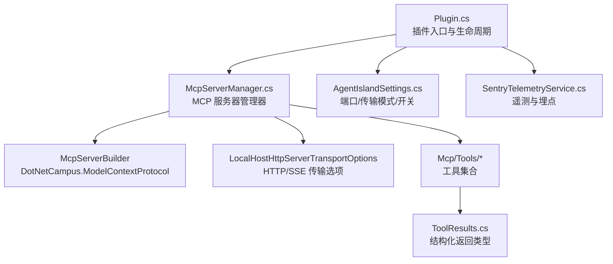
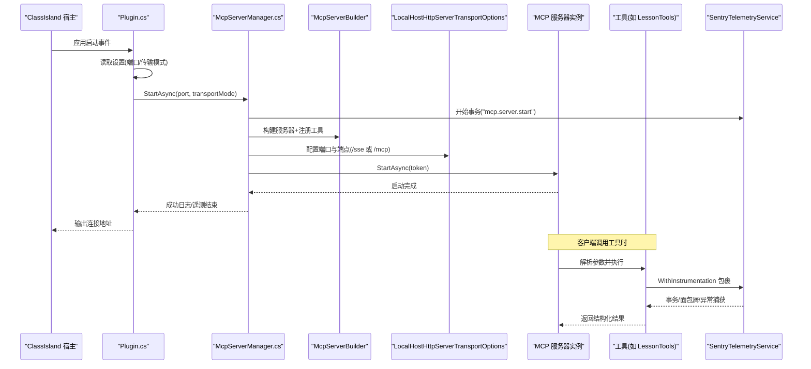
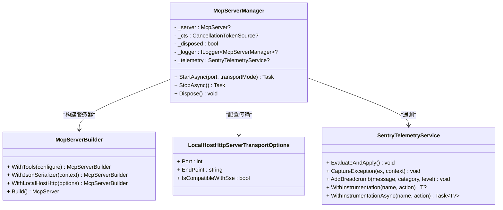
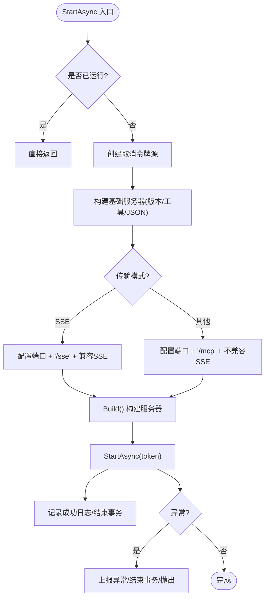
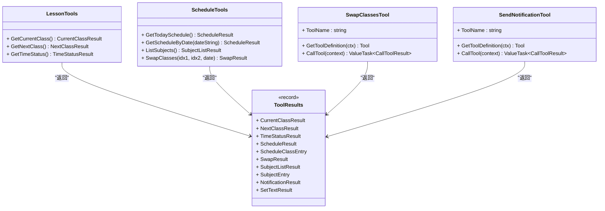
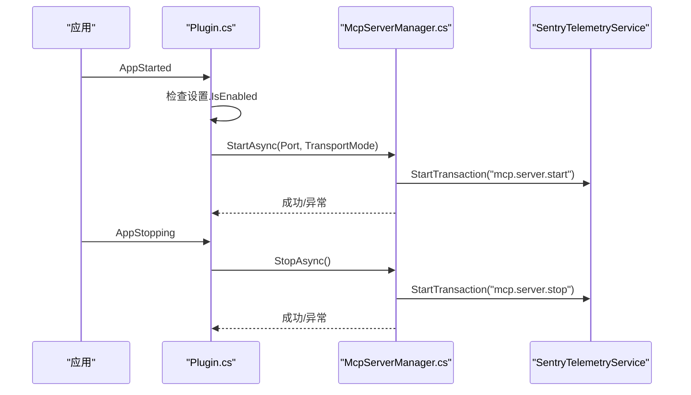
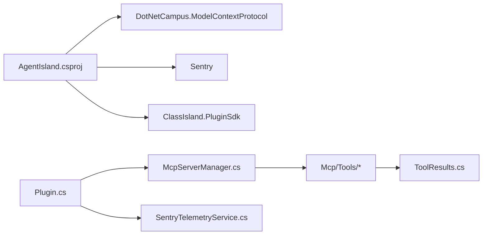

# MCP 服务器架构

<cite>
**本文引用的文件**
- [McpServerManager.cs](file://Mcp/McpServerManager.cs)
- [Plugin.cs](file://Plugin.cs)
- [AgentIslandSettings.cs](file://Models/AgentIslandSettings.cs)
- [McpTransportMode.cs](file://Models/McpTransportMode.cs)
- [SentryTelemetryService.cs](file://Services/SentryTelemetryService.cs)
- [LessonTools.cs](file://Mcp/Tools/LessonTools.cs)
- [ScheduleTools.cs](file://Mcp/Tools/ScheduleTools.cs)
- [SwapClassesTool.cs](file://Mcp/Tools/SwapClassesTool.cs)
- [SendNotificationTool.cs](file://Mcp/Tools/SendNotificationTool.cs)
- [ToolResults.cs](file://Models/ToolResults.cs)
- [AgentIsland.csproj](file://AgentIsland.csproj)
</cite>

## 目录
1. [简介](#简介)
2. [项目结构](#项目结构)
3. [核心组件](#核心组件)
4. [架构总览](#架构总览)
5. [详细组件分析](#详细组件分析)
6. [依赖关系分析](#依赖关系分析)
7. [性能与扩展性](#性能与扩展性)
8. [故障排查指南](#故障排查指南)
9. [结论](#结论)
10. [附录：客户端集成与调试](#附录客户端集成与调试)

## 简介
本文件面向 .NET 8 Windows 平台下的 AgentIsland 插件，系统性梳理其基于 Model Context Protocol（MCP）的服务器实现。重点覆盖以下方面：
- McpServerManager 的设计模式与实现原理：生命周期管理、传输模式切换（SSE/HTTP）、工具注册机制
- DotNetCampus.ModelContextProtocol 库在 .NET 中的使用方式
- 服务器启动流程、端口管理、错误处理与优雅关闭
- 多传输模式支持策略、性能优化考虑与扩展性设计
- MCP 客户端集成示例与调试技巧

## 项目结构
本项目采用“功能域 + 分层”组织方式：
- 入口与生命周期：Plugin.cs 负责插件初始化、事件绑定、MCP 服务器启停
- 服务器管理：Mcp/McpServerManager.cs 封装 MCP 服务器构建、传输配置、工具注册、启停控制
- 模型与设置：Models 下包含传输模式枚举、全局设置、工具返回结果等
- 工具实现：Mcp/Tools 下按能力分组提供具体工具方法
- 遥测服务：Services/SentryTelemetryService.cs 提供异常上报、事务埋点、面包屑记录
- 项目依赖：AgentIsland.csproj 声明对 DotNetCampus.ModelContextProtocol 等包的引用

图表来源
- [Plugin.cs:29-79](file://Plugin.cs#L29-L79)
- [McpServerManager.cs:25-82](file://Mcp/McpServerManager.cs#L25-L82)
- [AgentIslandSettings.cs:34-62](file://Models/AgentIslandSettings.cs#L34-L62)
- [SentryTelemetryService.cs:11-40](file://Services/SentryTelemetryService.cs#L11-L40)
- [ToolResults.cs:1-59](file://Models/ToolResults.cs#L1-L59)

章节来源
- [Plugin.cs:1-114](file://Plugin.cs#L1-L114)
- [McpServerManager.cs:1-125](file://Mcp/McpServerManager.cs#L1-L125)
- [AgentIslandSettings.cs:1-394](file://Models/AgentIslandSettings.cs#L1-L394)
- [SentryTelemetryService.cs:1-182](file://Services/SentryTelemetryService.cs#L1-L182)
- [ToolResults.cs:1-59](file://Models/ToolResults.cs#L1-L59)

## 核心组件
- McpServerManager：封装 MCP 服务器的创建、传输模式选择、工具注册、启动与停止；提供可观测性与异常上报
- Plugin：插件入口，订阅应用生命周期事件，根据设置决定是否启动 MCP 服务器并输出连接地址
- SentryTelemetryService：统一遥测服务，提供 WithInstrumentation 包装器，自动为工具调用生成事务与面包屑
- 工具类：LessonTools、ScheduleTools、SwapClassesTool、SendNotificationTool 等，通过特性或接口暴露给 MCP 框架

章节来源
- [McpServerManager.cs:11-125](file://Mcp/McpServerManager.cs#L11-L125)
- [Plugin.cs:19-114](file://Plugin.cs#L19-L114)
- [SentryTelemetryService.cs:11-182](file://Services/SentryTelemetryService.cs#L11-L182)
- [LessonTools.cs:12-146](file://Mcp/Tools/LessonTools.cs#L12-L146)
- [ScheduleTools.cs:13-204](file://Mcp/Tools/ScheduleTools.cs#L13-L204)
- [SwapClassesTool.cs:16-103](file://Mcp/Tools/SwapClassesTool.cs#L16-L103)
- [SendNotificationTool.cs:16-137](file://Mcp/Tools/SendNotificationTool.cs#L16-L137)

## 架构总览
下图展示了从插件启动到 MCP 服务器对外暴露 HTTP/SSE 端点的整体流程，以及工具调用路径。

图表来源
- [Plugin.cs:55-79](file://Plugin.cs#L55-L79)
- [McpServerManager.cs:25-82](file://Mcp/McpServerManager.cs#L25-L82)
- [SentryTelemetryService.cs:127-174](file://Services/SentryTelemetryService.cs#L127-L174)
- [LessonTools.cs:14-45](file://Mcp/Tools/LessonTools.cs#L14-L45)

## 详细组件分析

### McpServerManager 设计与实现
- 设计模式
  - 门面模式：对外仅暴露 StartAsync/StopAsync/Dispose，隐藏内部构建细节
  - 工厂模式：使用 McpServerBuilder 组装服务器与传输层
  - 策略模式：根据 McpTransportMode 选择 SSE 或 StreamableHttp 传输端点
- 生命周期管理
  - 启动：创建 CancellationTokenSource，构建服务器，注册工具，启动监听
  - 停止：取消令牌、调用 StopAsync、释放资源
  - 可处置：实现 IDisposable，确保同步安全释放
- 传输模式切换
  - SSE：端口 + 端点 "/sse"，兼容 SSE
  - StreamableHttp：端口 + 端点 "/mcp"，不兼容 SSE
- 工具注册机制
  - 通过 builder.WithTools 批量注册多个工具类，支持构造注入与无参构造
  - 使用自定义 JSON 序列化上下文以优化性能
- 错误处理与遥测
  - 启动/停止过程均包裹事务，异常上报 Sentry，失败时抛出异常
  - 日志记录关键状态变化

图表来源
- [McpServerManager.cs:11-125](file://Mcp/McpServerManager.cs#L11-L125)
- [SentryTelemetryService.cs:11-182](file://Services/SentryTelemetryService.cs#L11-L182)

章节来源
- [McpServerManager.cs:25-112](file://Mcp/McpServerManager.cs#L25-L112)

### 传输模式与端口管理
- 传输模式枚举
  - StreamableHttp：现代流式 HTTP 协议
  - Sse：旧版 Server-Sent Events 协议
- 端口与端点
  - 默认端口 5943，可通过设置修改
  - SSE 端点 "/sse"，StreamableHttp 端点 "/mcp"
- 连接地址计算
  - 根据当前传输模式动态拼接 http://localhost:{Port}/{EndPoint}

图表来源
- [McpServerManager.cs:25-82](file://Mcp/McpServerManager.cs#L25-L82)
- [McpTransportMode.cs:6-17](file://Models/McpTransportMode.cs#L6-L17)
- [AgentIslandSettings.cs:34-62](file://Models/AgentIslandSettings.cs#L34-L62)

章节来源
- [McpTransportMode.cs:1-18](file://Models/McpTransportMode.cs#L1-L18)
- [AgentIslandSettings.cs:34-62](file://Models/AgentIslandSettings.cs#L34-L62)

### 工具注册机制与实现
- 注册方式
  - 通过 builder.WithTools 批量注册，支持泛型类型与实例化对象
  - 使用自定义 JSON 序列化上下文提升性能
- 工具分类
  - 课程查询：LessonTools（当前课、下一节、时间状态）
  - 课表操作：ScheduleTools（今日课表、指定日期课表、科目列表、交换课程）
  - 通知与 UI：SendNotificationTool、SetComponentTextTool
  - 复杂输入：SwapClassesTool（显式定义输入 Schema）
- 结构化返回
  - 所有工具返回结构化记录类型，便于客户端强类型消费

图表来源
- [LessonTools.cs:12-146](file://Mcp/Tools/LessonTools.cs#L12-L146)
- [ScheduleTools.cs:13-204](file://Mcp/Tools/ScheduleTools.cs#L13-L204)
- [SwapClassesTool.cs:16-103](file://Mcp/Tools/SwapClassesTool.cs#L16-L103)
- [SendNotificationTool.cs:16-137](file://Mcp/Tools/SendNotificationTool.cs#L16-L137)
- [ToolResults.cs:1-59](file://Models/ToolResults.cs#L1-L59)

章节来源
- [McpServerManager.cs:41-51](file://Mcp/McpServerManager.cs#L41-L51)
- [LessonTools.cs:14-146](file://Mcp/Tools/LessonTools.cs#L14-L146)
- [ScheduleTools.cs:15-204](file://Mcp/Tools/ScheduleTools.cs#L15-L204)
- [SwapClassesTool.cs:18-103](file://Mcp/Tools/SwapClassesTool.cs#L18-L103)
- [SendNotificationTool.cs:18-137](file://Mcp/Tools/SendNotificationTool.cs#L18-L137)
- [ToolResults.cs:1-59](file://Models/ToolResults.cs#L1-L59)

### 服务器启动流程与优雅关闭
- 启动流程
  - 插件初始化时读取设置，若启用则创建 McpServerManager 并调用 StartAsync
  - 根据传输模式输出连接地址，记录遥测面包屑
- 优雅关闭
  - 应用停止事件触发 StopAsync，取消令牌并等待服务器停止
  - 清理资源并记录遥测

图表来源
- [Plugin.cs:55-97](file://Plugin.cs#L55-L97)
- [McpServerManager.cs:25-112](file://Mcp/McpServerManager.cs#L25-L112)
- [SentryTelemetryService.cs:127-174](file://Services/SentryTelemetryService.cs#L127-L174)

章节来源
- [Plugin.cs:55-97](file://Plugin.cs#L55-L97)
- [McpServerManager.cs:84-112](file://Mcp/McpServerManager.cs#L84-L112)

## 依赖关系分析
- 外部包
  - DotNetCampus.ModelContextProtocol：提供 MCP 服务器、传输、工具框架
  - Sentry：遥测与异常上报
  - ClassIsland 相关 SDK：插件宿主、服务发现、UI 交互
- 内部依赖
  - Plugin 依赖 McpServerManager、SentryTelemetryService、设置模型
  - McpServerManager 依赖 McpServerBuilder、传输选项、工具集
  - 工具类依赖 IAppHost 获取服务、UiThreadHelper 访问 UI 线程、SentryTelemetryService 埋点

图表来源
- [AgentIsland.csproj:22-37](file://AgentIsland.csproj#L22-L37)
- [Plugin.cs:29-79](file://Plugin.cs#L29-L79)
- [McpServerManager.cs:25-82](file://Mcp/McpServerManager.cs#L25-L82)

章节来源
- [AgentIsland.csproj:1-52](file://AgentIsland.csproj#L1-L52)
- [Plugin.cs:29-79](file://Plugin.cs#L29-L79)
- [McpServerManager.cs:25-82](file://Mcp/McpServerManager.cs#L25-L82)

## 性能与扩展性
- 性能优化
  - 使用 System.Text.Json 编译期上下文（AgentIslandJsonContext）减少反射开销
  - 工具方法尽量轻量，避免阻塞 UI 线程（通过 UiThreadHelper 调度）
  - 遥测采样率设置为 1.0，可根据负载调整
- 扩展性设计
  - 新增工具只需在 McpServerManager 中注册，或通过 IMcpServerTool 接口实现自定义工具
  - 传输模式通过枚举与 switch 分支扩展，未来可支持更多传输后端
  - 遥测服务解耦，可在不同模块复用 WithInstrumentation 包装器

[本节为通用指导，不直接分析具体文件]

## 故障排查指南
- 常见问题
  - 端口占用：确认本地端口未被占用，必要时更换端口
  - 传输模式不匹配：客户端需与服务端一致（/sse 或 /mcp）
  - 工具调用异常：查看 Sentry 事务与面包屑，定位具体工具与方法
- 诊断手段
  - 启用 Sentry 调试与日志，关注 mcp.server.start/stop 事务
  - 使用浏览器或 curl 访问 http://localhost:{Port}/sse 或 /mcp 验证连通性
  - 检查工具输入参数是否符合 Schema 要求

章节来源
- [McpServerManager.cs:76-82](file://Mcp/McpServerManager.cs#L76-L82)
- [SentryTelemetryService.cs:95-148](file://Services/SentryTelemetryService.cs#L95-L148)
- [SwapClassesTool.cs:82-101](file://Mcp/Tools/SwapClassesTool.cs#L82-L101)
- [SendNotificationTool.cs:107-135](file://Mcp/Tools/SendNotificationTool.cs#L107-L135)

## 结论
AgentIsland 的 MCP 服务器实现以 McpServerManager 为核心，结合 McpServerBuilder 与 DotNetCampus.ModelContextProtocol 提供了灵活的传输模式与工具注册机制。通过 SentryTelemetryService 实现了完善的可观测性。整体架构清晰、可扩展性强，适合在 ClassIsland 生态中作为 AI 代理的工具总线。

[本节为总结，不直接分析具体文件]

## 附录：客户端集成与调试
- 客户端集成要点
  - 选择与服务器一致的传输模式：SSE 使用 /sse，StreamableHttp 使用 /mcp
  - 使用 MCP 客户端 SDK 连接到 http://localhost:{Port}/{EndPoint}
  - 调用工具时遵循工具定义的输入 Schema，接收结构化返回
- 调试技巧
  - 在服务端开启 Sentry 调试，观察事务与面包屑
  - 使用网络抓包工具验证请求/响应格式
  - 逐步缩小问题范围：先验证连通性，再验证工具参数与返回值

[本节为概念性内容，不直接分析具体文件]