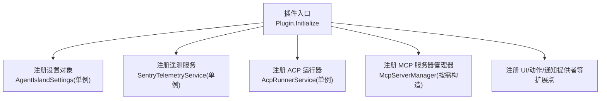
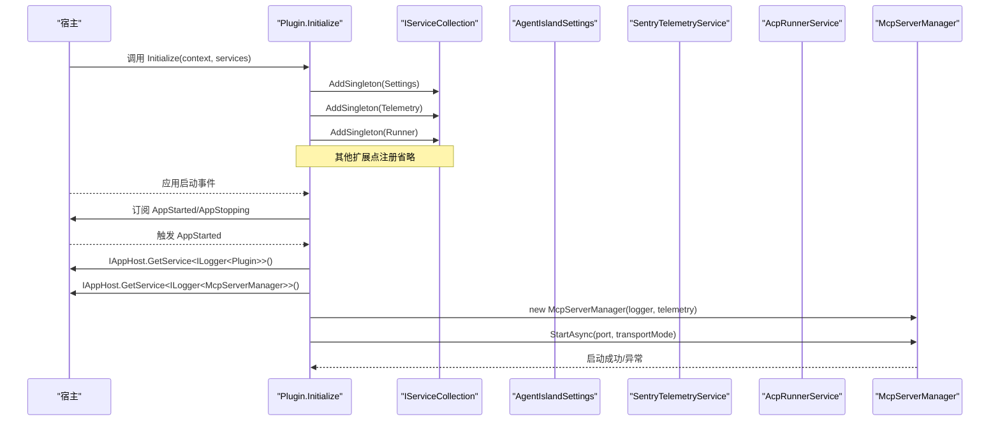
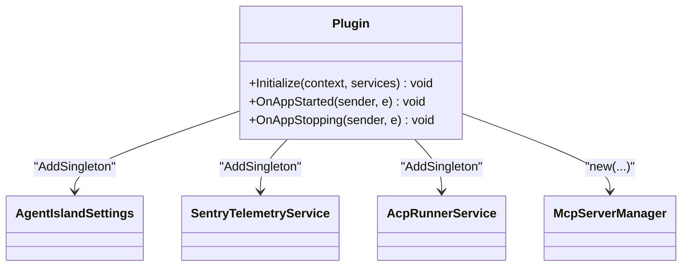
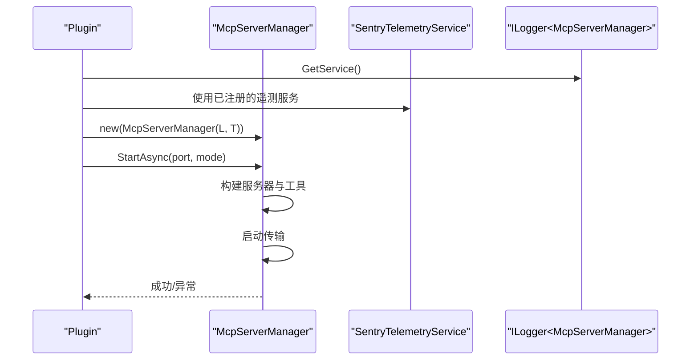
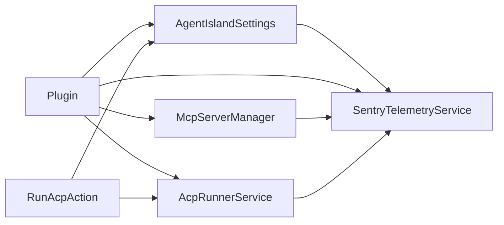

# 依赖注入容器

<cite>
**本文引用的文件**   
- [Plugin.cs](file://Plugin.cs)
- [AgentIsland.csproj](file://AgentIsland.csproj)
- [McpServerManager.cs](file://Mcp/McpServerManager.cs)
- [AcpRunnerService.cs](file://Services/AcpRunnerService.cs)
- [SentryTelemetryService.cs](file://Services/SentryTelemetryService.cs)
- [AgentIslandSettings.cs](file://Models/AgentIslandSettings.cs)
- [RunAcpAction.cs](file://Automation/RunAcpAction.cs)
</cite>

## 目录
1. [简介](#简介)
2. [项目结构](#项目结构)
3. [核心组件](#核心组件)
4. [架构总览](#架构总览)
5. [详细组件分析](#详细组件分析)
6. [依赖关系分析](#依赖关系分析)
7. [性能与生命周期](#性能与生命周期)
8. [测试与替换策略](#测试与替换策略)
9. [常见问题与排障](#常见问题与排障)
10. [结论](#结论)

## 简介
本文件聚焦于 AgentIsland 插件中 Microsoft.Extensions.DependencyInjection 的使用模式，围绕服务注册、解析、生命周期管理展开，结合代码级实现说明：
- 服务注册策略（单例等）
- 服务解析机制与顺序
- 循环依赖处理建议
- 自定义工厂与装饰器模式的落地方式
- 条件注册策略
- 避免服务定位器反模式
- 测试环境下的服务替换
- 性能优化技巧与最佳实践

## 项目结构
从依赖注入视角看，关键入口位于插件初始化阶段，负责将配置对象、遥测服务、运行期服务等注册到容器中；业务组件通过构造函数注入获取所需依赖。

图表来源
- [Plugin.cs:29-53](file://Plugin.cs#L29-L53)

章节来源
- [Plugin.cs:29-53](file://Plugin.cs#L29-L53)
- [AgentIsland.csproj:1-52](file://AgentIsland.csproj#L1-L52)

## 核心组件
- 插件入口与容器装配：在 Initialize 中完成服务注册与宿主事件绑定。
- 设置模型：作为单例被多处消费，承载运行时开关与连接信息。
- 遥测服务：封装 Sentry SDK 的生命周期与埋点 API，按设置动态启停。
- MCP 服务器管理器：对外暴露启动/停止能力，内部构建并托管 HTTP 传输与工具。
- ACP 运行器：通过 stdio 协议与外部 Agent 进程通信，维护会话。
- 自动化动作：由框架解析并触发，依赖注入获取设置与服务。

章节来源
- [Plugin.cs:29-53](file://Plugin.cs#L29-L53)
- [AgentIslandSettings.cs:1-394](file://Models/AgentIslandSettings.cs#L1-L394)
- [SentryTelemetryService.cs:1-182](file://Services/SentryTelemetryService.cs#L1-L182)
- [McpServerManager.cs:1-125](file://Mcp/McpServerManager.cs#L1-L125)
- [AcpRunnerService.cs:1-207](file://Services/AcpRunnerService.cs#L1-L207)
- [RunAcpAction.cs:1-45](file://Automation/RunAcpAction.cs#L1-L45)

## 架构总览
下图展示插件初始化时服务的注册关系以及典型调用链。

图表来源
- [Plugin.cs:29-79](file://Plugin.cs#L29-L79)
- [McpServerManager.cs:25-82](file://Mcp/McpServerManager.cs#L25-L82)

## 详细组件分析

### 插件入口与容器装配（Plugin）
- 职责
  - 加载并持久化设置对象
  - 创建并注册遥测服务实例
  - 注册 ACP 运行器为单例
  - 订阅宿主生命周期事件，并在启动时启动 MCP 服务器
- 关键点
  - 使用 AddSingleton 注册设置对象、遥测服务、ACP 运行器
  - 通过 IAppHost.GetService 解析 ILogger<T> 用于日志记录
  - 手动 new 出 McpServerManager 并传入已解析的依赖

章节来源
- [Plugin.cs:29-79](file://Plugin.cs#L29-L79)

#### 类图（与 DI 相关）

图表来源
- [Plugin.cs:29-79](file://Plugin.cs#L29-L79)

### 设置模型（AgentIslandSettings）
- 职责
  - 提供 MCP 端口、传输模式、遥测开关、隐私同意状态、DSN 等配置
  - 计算派生属性（如是否启用遥测、有效 DSN、连接地址）
- 与 DI 的关系
  - 以单例形式注册，供多组件共享
  - 变更事件驱动 UI 与遥测服务行为

章节来源
- [AgentIslandSettings.cs:1-394](file://Models/AgentIslandSettings.cs#L1-L394)

### 遥测服务（SentryTelemetryService）
- 职责
  - 根据设置动态初始化/关闭 Sentry SDK
  - 提供捕获异常、添加面包屑、包裹操作（同步/异步）等 API
- 与 DI 的关系
  - 单例注册，持有对设置的引用，监听属性变化
  - 其他组件通过构造函数或 IAppHost 获取该服务进行埋点

章节来源
- [SentryTelemetryService.cs:1-182](file://Services/SentryTelemetryService.cs#L1-L182)

### MCP 服务器管理器（McpServerManager）
- 职责
  - 构建并启动本地 HTTP 传输的 MCP 服务器
  - 注册工具集，支持 SSE 与普通 HTTP 两种模式
  - 提供停止与资源释放
- 与 DI 的关系
  - 当前由插件在启动事件中手动 new，并注入 ILogger 与遥测服务
  - 可改为容器解析以获得更好的可测试性

章节来源
- [McpServerManager.cs:1-125](file://Mcp/McpServerManager.cs#L1-L125)

#### 序列图（MCP 启动流程）

图表来源
- [Plugin.cs:64-79](file://Plugin.cs#L64-L79)
- [McpServerManager.cs:25-82](file://Mcp/McpServerManager.cs#L25-L82)

### ACP 运行器（AcpRunnerService）
- 职责
  - 通过 stdio 协议与外部 Agent 进程通信
  - 维护会话列表，发送初始化与提示请求
  - 在析构时优雅关闭子进程
- 与 DI 的关系
  - 单例注册
  - 内部通过 IAppHost.GetService<SentryTelemetryService>() 获取遥测服务（存在服务定位器用法）

章节来源
- [AcpRunnerService.cs:1-207](file://Services/AcpRunnerService.cs#L1-L207)

### 自动化动作（RunAcpAction）
- 职责
  - 响应自动化触发，校验设置后调用 AcpRunnerService
- 与 DI 的关系
  - 通过构造函数注入设置与服务，遵循依赖注入原则

章节来源
- [RunAcpAction.cs:1-45](file://Automation/RunAcpAction.cs#L1-L45)

## 依赖关系分析
- 直接依赖
  - Plugin 依赖设置、遥测、ACP 运行器、MCP 管理器
  - McpServerManager 依赖 ILogger 与遥测服务
  - AcpRunnerService 依赖 ILogger 与遥测服务（后者通过服务定位器获取）
  - RunAcpAction 依赖设置、ACP 运行器与日志
- 间接依赖
  - 遥测服务依赖设置（属性变更驱动）
  - 各工具类可通过 IAppHost 获取遥测服务进行埋点

图表来源
- [Plugin.cs:29-79](file://Plugin.cs#L29-L79)
- [McpServerManager.cs:19-23](file://Mcp/McpServerManager.cs#L19-L23)
- [AcpRunnerService.cs:20-33](file://Services/AcpRunnerService.cs#L20-L33)
- [RunAcpAction.cs:22-27](file://Automation/RunAcpAction.cs#L22-L27)

章节来源
- [Plugin.cs:29-79](file://Plugin.cs#L29-L79)
- [McpServerManager.cs:19-23](file://Mcp/McpServerManager.cs#L19-L23)
- [AcpRunnerService.cs:20-33](file://Services/AcpRunnerService.cs#L20-L33)
- [RunAcpAction.cs:22-27](file://Automation/RunAcpAction.cs#L22-L27)

## 性能与生命周期
- 生命周期策略
  - 设置对象、遥测服务、ACP 运行器均以单例注册，适合全局共享且无状态或线程安全的对象
  - MCP 管理器采用手动 new，生命周期由插件显式控制（启动/停止），便于与宿主事件对齐
- 解析顺序
  - 注册顺序影响首次解析时的构造顺序；当前注册顺序清晰，无相互构造依赖
- 循环依赖
  - 当前未发现循环依赖；若未来引入接口抽象，需确保不形成环
- 性能建议
  - 避免在热路径频繁解析服务，尽量通过构造函数注入
  - 遥测服务仅在需要时开启，减少开销
  - 长生命周期服务应实现 IDisposable 并在合适时机释放

章节来源
- [Plugin.cs:39-42](file://Plugin.cs#L39-L42)
- [SentryTelemetryService.cs:30-40](file://Services/SentryTelemetryService.cs#L30-L40)
- [McpServerManager.cs:114-124](file://Mcp/McpServerManager.cs#L114-L124)

## 测试与替换策略
- 测试环境替换
  - 使用独立的 IServiceCollection 构建测试容器，注册 Mock 的 ILogger、遥测服务与设置对象
  - 将 McpServerManager 改为通过容器解析，以便在测试中注入轻量实现
- 条件注册
  - 基于设置对象的开关（如遥测开关、功能开关）在 Initialize 中进行条件注册
- 自定义工厂
  - 对于复杂构造逻辑的服务，可使用 AddSingleton(factory) 或 AddScoped(factory) 进行工厂化创建
- 装饰器模式
  - 定义统一接口，注册真实实现与装饰器，利用容器解析顺序或中间件式包装增强横切关注点（如日志、遥测）

章节来源
- [Plugin.cs:29-53](file://Plugin.cs#L29-L53)
- [SentryTelemetryService.cs:30-40](file://Services/SentryTelemetryService.cs#L30-L40)

## 常见问题与排障
- 问题：遥测未生效
  - 检查设置中的遥测开关与隐私同意状态，确认 EffectiveSentryDsn 非空
  - 查看 EvaluateAndApply 的执行分支是否正确
- 问题：MCP 服务器无法启动
  - 检查端口占用与传输模式配置
  - 查看日志与遥测异常上报
- 问题：ACP Agent 未初始化
  - 检查命令配置与进程启动参数
  - 确认会话初始化请求与响应流程

章节来源
- [AgentIslandSettings.cs:178-200](file://Models/AgentIslandSettings.cs#L178-L200)
- [SentryTelemetryService.cs:30-40](file://Services/SentryTelemetryService.cs#L30-L40)
- [McpServerManager.cs:25-82](file://Mcp/McpServerManager.cs#L25-L82)
- [AcpRunnerService.cs:79-100](file://Services/AcpRunnerService.cs#L79-L100)

## 结论
AgentIsland 在当前实现中采用简洁的单例注册与手动生命周期控制相结合的模式，满足插件场景下的服务组织需求。建议在后续迭代中：
- 将 McpServerManager 纳入容器解析，提升可测试性与一致性
- 避免在服务内部使用服务定位器，统一通过构造函数注入
- 引入装饰器与工厂模式，增强横切能力与构造灵活性
- 完善条件注册与测试替换策略，提高整体健壮性与可维护性