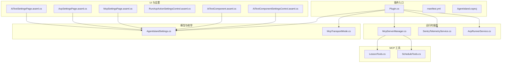
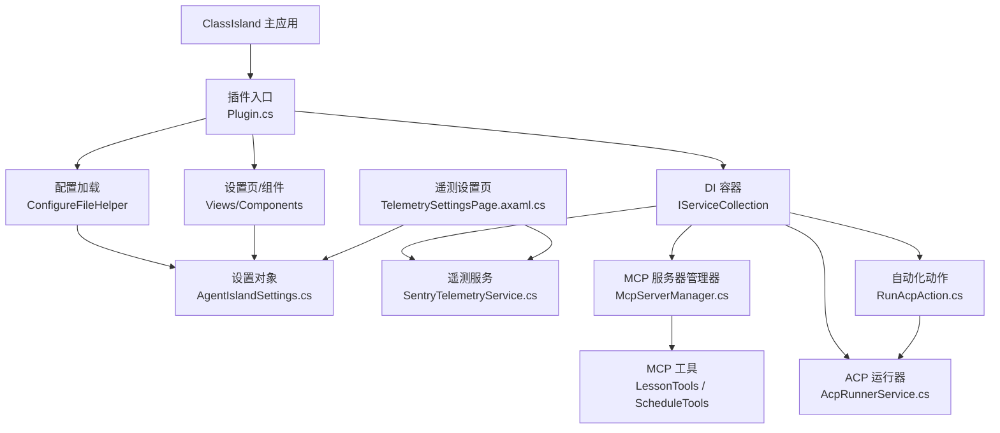
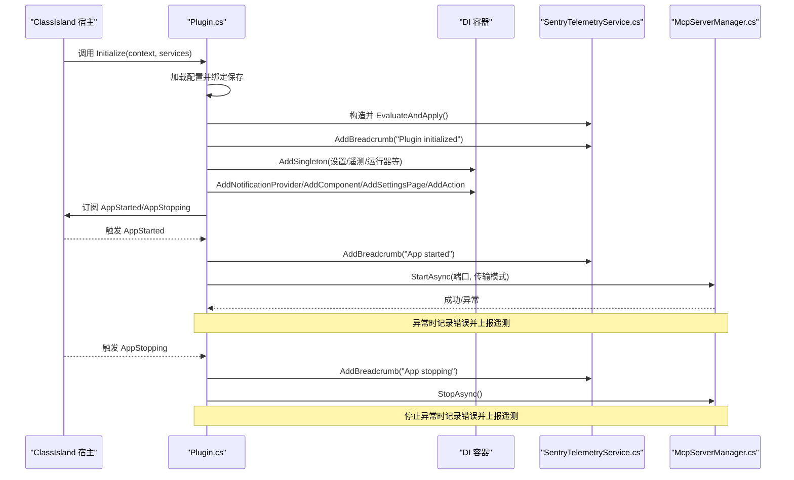
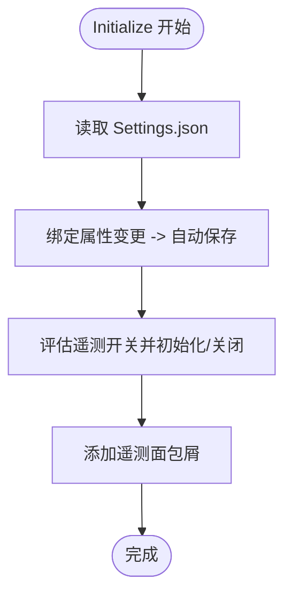
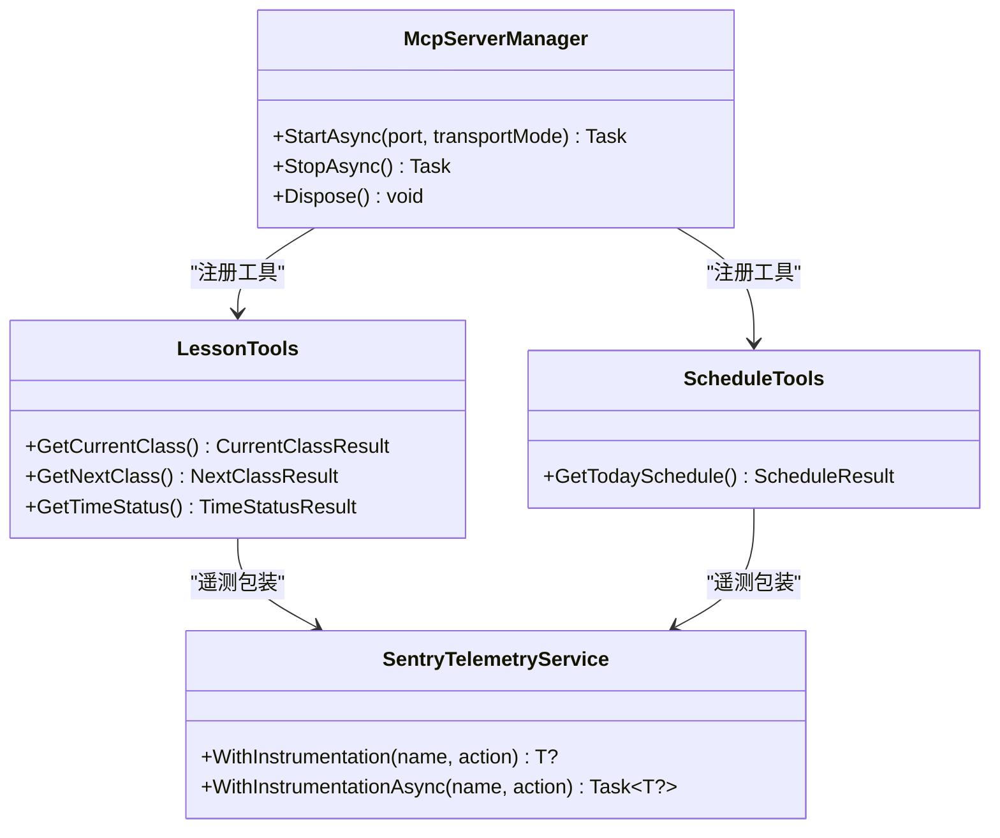
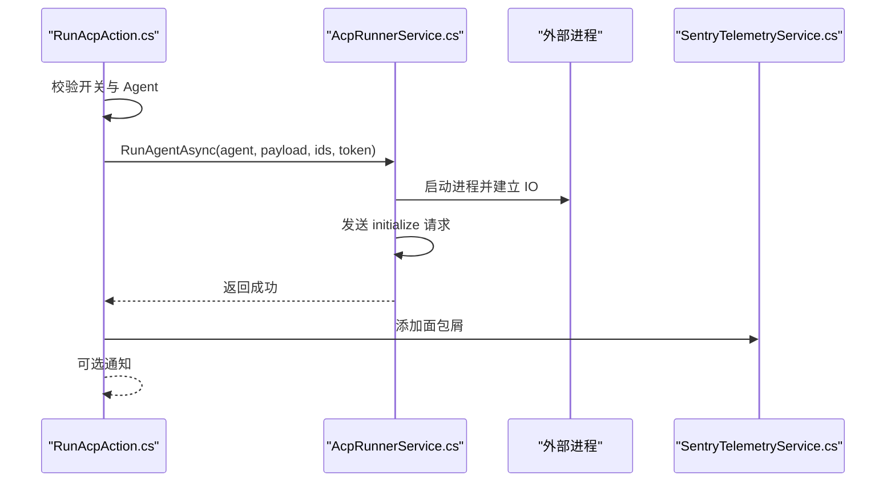
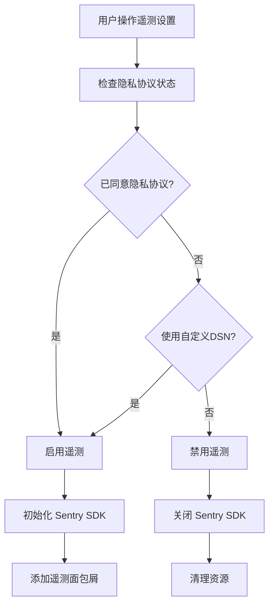
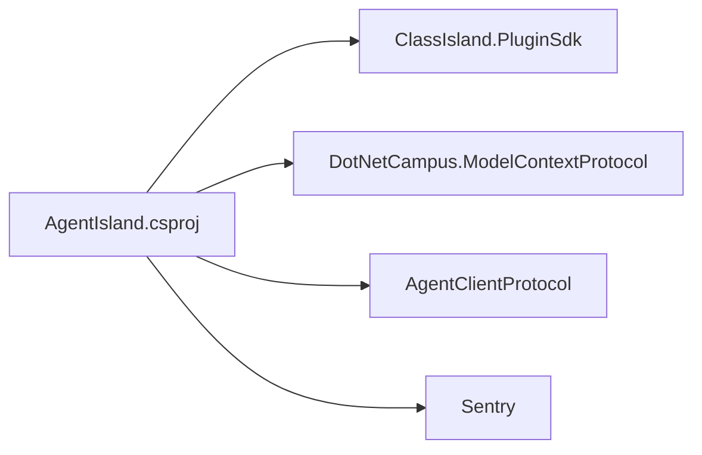

# 插件架构

<cite>
**本文引用的文件**   
- [Plugin.cs](file://AgentIsland/Plugin.cs)
- [manifest.yml](file://AgentIsland/manifest.yml)
- [AgentIsland.csproj](file://AgentIsland/AgentIsland.csproj)
- [McpServerManager.cs](file://AgentIsland/Mcp/McpServerManager.cs)
- [SentryTelemetryService.cs](file://AgentIsland/Services/SentryTelemetryService.cs)
- [AcpRunnerService.cs](file://AgentIsland/Services/AcpRunnerService.cs)
- [RunAcpAction.cs](file://AgentIsland/Automation/RunAcpAction.cs)
- [LessonTools.cs](file://AgentIsland/Mcp/Tools/LessonTools.cs)
- [ScheduleTools.cs](file://AgentIsland/Mcp/Tools/ScheduleTools.cs)
- [AiTextComponent.axaml.cs](file://AgentIsland/Components/AiTextComponent.axaml.cs)
- [AiTextComponentSettingsControl.axaml.cs](file://AgentIsland/Components/AiTextComponentSettingsControl.axaml.cs)
- [AiTextSettingsPage.axaml.cs](file://AgentIsland/Views/SettingsPages/AiTextSettingsPage.axaml.cs)
- [AcpSettingsPage.axaml.cs](file://AgentIsland/Views/SettingsPages/AcpSettingsPage.axaml.cs)
- [McpSettingsPage.axaml.cs](file://AgentIsland/Views/SettingsPages/McpSettingsPage.axaml.cs)
- [RunAcpActionSettingsControl.axaml.cs](file://AgentIsland/Views/ActionSettings/RunAcpActionSettingsControl.axaml.cs)
- [AgentIslandSettings.cs](file://AgentIsland/Models/AgentIslandSettings.cs)
- [McpTransportMode.cs](file://AgentIsland/Models/McpTransportMode.cs)
- [TelemetrySettingsPage.axaml.cs](file://AgentIsland/Views/SettingsPages/TelemetrySettingsPage.axaml.cs)
- [OverviewSettingsPage.axaml.cs](file://AgentIsland/Views/SettingsPages/OverviewSettingsPage.axaml.cs)
- [AiTextEntry.cs](file://AgentIsland/Models/AiTextEntry.cs)
- [AcpAgentProfile.cs](file://AgentIsland/Models/AcpAgentProfile.cs)
- [RunAcpActionSettings.cs](file://AgentIsland/Models/RunAcpActionSettings.cs)
</cite>

## 更新摘要
**变更内容**   
- 增强了插件入口点的初始化逻辑，包括更好的错误处理和遥测集成
- 改进了生命周期管理，添加了更完善的异常捕获和日志记录
- 增强了遥测服务的动态启用/禁用机制
- 优化了 MCP 服务器的启动和停止流程的错误处理

## 目录
1. [简介](#简介)
2. [项目结构](#项目结构)
3. [核心组件](#核心组件)
4. [架构总览](#架构总览)
5. [详细组件分析](#详细组件分析)
6. [依赖关系分析](#依赖关系分析)
7. [性能与可观测性](#性能与可观测性)
8. [故障排查指南](#故障排查指南)
9. [结论](#结论)
10. [附录：开发最佳实践与常见陷阱](#附录开发最佳实践与常见陷阱)

## 简介
本文件面向基于 ClassIsland Plugin SDK 的 AgentIsland 插件，系统性阐述其设计模式、生命周期管理、依赖注入集成、入口特性与服务注册机制、事件处理模式、与主应用交互方式、配置加载策略、资源管理机制，以及插件发现、加载、卸载流程。文档同时提供可视化图示、关键实现路径引用与排障建议，帮助开发者快速理解并高质量扩展该插件。

## 项目结构
AgentIsland 采用"按功能域组织"的结构：入口与生命周期在根目录；MCP 服务器与工具位于 Mcp；自动化动作位于 Automation；设置页面与组件 UI 分别位于 Views 与 Components；模型与设置集中于 Models；服务集中在 Services。

图表来源
- [Plugin.cs:1-138](file://AgentIsland/Plugin.cs#L1-L138)
- [manifest.yml:1-13](file://AgentIsland/manifest.yml#L1-L13)
- [AgentIsland.csproj:1-52](file://AgentIsland/AgentIsland.csproj#L1-L52)
- [McpServerManager.cs:1-130](file://AgentIsland/Mcp/McpServerManager.cs#L1-L130)
- [SentryTelemetryService.cs:1-182](file://AgentIsland/Services/SentryTelemetryService.cs#L1-L182)
- [AcpRunnerService.cs:1-207](file://AgentIsland/Services/AcpRunnerService.cs#L1-L207)
- [LessonTools.cs:1-146](file://AgentIsland/Mcp/Tools/LessonTools.cs#L1-L146)
- [ScheduleTools.cs:1-204](file://AgentIsland/Mcp/Tools/ScheduleTools.cs#L1-L204)
- [AiTextComponent.axaml.cs:1-85](file://AgentIsland/Components/AiTextComponent.axaml.cs#L1-L85)
- [AiTextComponentSettingsControl.axaml.cs:1-52](file://AgentIsland/Components/AiTextComponentSettingsControl.axaml.cs#L1-L52)
- [AiTextSettingsPage.axaml.cs:1-35](file://AgentIsland/Views/SettingsPages/AiTextSettingsPage.axaml.cs#L1-L35)
- [AcpSettingsPage.axaml.cs:1-48](file://AgentIsland/Views/SettingsPages/AcpSettingsPage.axaml.cs#L1-L48)
- [McpSettingsPage.axaml.cs:1-41](file://AgentIsland/Views/SettingsPages/McpSettingsPage.axaml.cs#L1-L41)
- [RunAcpActionSettingsControl.axaml.cs:1-36](file://AgentIsland/Views/ActionSettings/RunAcpActionSettingsControl.axaml.cs#L1-L36)
- [AgentIslandSettings.cs:1-394](file://AgentIsland/Models/AgentIslandSettings.cs#L1-L394)
- [McpTransportMode.cs:1-18](file://AgentIsland/Models/McpTransportMode.cs#L1-L18)

章节来源
- [Plugin.cs:1-138](file://AgentIsland/Plugin.cs#L1-L138)
- [manifest.yml:1-13](file://AgentIsland/manifest.yml#L1-L13)
- [AgentIsland.csproj:1-52](file://AgentIsland/AgentIsland.csproj#L1-L52)

## 核心组件
- 插件入口与生命周期
  - 通过入口特性标记插件类，继承基类并实现初始化与释放逻辑，负责配置加载、服务注册、事件订阅与资源清理。
  - 在应用启动与停止时分别启动/停止 MCP 服务器，并记录遥测信息。
  - **增强** 改进了错误处理机制，添加了更完善的异常捕获和日志记录。
- 配置与持久化
  - 使用宿主提供的配置辅助方法从插件配置目录加载 Settings.json，并在属性变更时自动保存。
- 依赖注入容器集成
  - 在 Initialize 中向 DI 容器注册单例服务（设置对象、遥测服务、ACP 运行器）、通知提供者、组件、设置页与自动化动作。
- 遥测与日志
  - 封装 Sentry 遥测服务，根据用户隐私同意与开关动态启用/关闭，并提供带事务与异常捕获的包装方法。
  - **增强** 实现了动态启用/禁用机制，支持运行时切换遥测状态。
- MCP 服务器与工具
  - 通过构建器注册工具集，支持两种传输模式（StreamableHttp 与 SSE），并按端口与端点暴露本地 HTTP 服务。
  - **增强** 改进了服务器启停的错误处理和遥测集成。
- 自动化动作
  - 提供"运行 ACP"动作，校验开关与 Agent 可用性后通过 stdio JSON-RPC 协议启动并通信。

章节来源
- [Plugin.cs:33-77](file://AgentIsland/Plugin.cs#L33-L77)
- [Plugin.cs:79-121](file://AgentIsland/Plugin.cs#L79-L121)
- [Plugin.cs:123-137](file://AgentIsland/Plugin.cs#L123-L137)
- [SentryTelemetryService.cs:11-90](file://AgentIsland/Services/SentryTelemetryService.cs#L11-L90)
- [McpServerManager.cs:25-82](file://AgentIsland/Mcp/McpServerManager.cs#L25-L82)
- [RunAcpAction.cs:10-84](file://AgentIsland/Automation/RunAcpAction.cs#L10-L84)

## 架构总览
下图展示插件与 ClassIsland 主应用、DI 容器、MCP 服务器、遥测与自动化之间的交互关系。

图表来源
- [Plugin.cs:33-77](file://AgentIsland/Plugin.cs#L33-L77)
- [AgentIslandSettings.cs:1-394](file://AgentIsland/Models/AgentIslandSettings.cs#L1-L394)
- [SentryTelemetryService.cs:11-90](file://AgentIsland/Services/SentryTelemetryService.cs#L11-L90)
- [McpServerManager.cs:25-82](file://AgentIsland/Mcp/McpServerManager.cs#L25-L82)
- [LessonTools.cs:1-146](file://AgentIsland/Mcp/Tools/LessonTools.cs#L1-L146)
- [ScheduleTools.cs:1-204](file://AgentIsland/Mcp/Tools/ScheduleTools.cs#L1-L204)
- [RunAcpAction.cs:10-84](file://AgentIsland/Automation/RunAcpAction.cs#L10-L84)
- [AcpRunnerService.cs:1-207](file://AgentIsland/Services/AcpRunnerService.cs#L1-L207)
- [TelemetrySettingsPage.axaml.cs:1-178](file://AgentIsland/Views/SettingsPages/TelemetrySettingsPage.axaml.cs#L1-L178)

## 详细组件分析

### 插件入口与生命周期
- 入口特性与基类
  - 插件类由入口特性标注，继承基类并实现初始化与释放。
- 初始化阶段
  - 加载配置并绑定属性变更到持久化。
  - 创建遥测服务并评估是否启用。
  - 向 DI 容器注册服务、通知提供者、组件、设置页与自动化动作。
  - 订阅应用启动与停止事件。
  - **增强** 添加了详细的遥测面包屑记录，便于追踪插件生命周期。
- 应用启动回调
  - 获取日志与遥测实例，依据设置决定是否启动 MCP 服务器，记录启动信息与面包屑。
  - **增强** 改进了异常处理，确保 MCP 服务器启动失败时能正确上报错误。
- 应用停止回调
  - 安全停止 MCP 服务器并上报错误。
  - **增强** 增加了停止过程中的异常捕获和错误上报。
- 释放
  - 取消事件订阅，释放 MCP 与遥测资源。
  - **增强** 添加了防重复释放检查和垃圾回收抑制。

图表来源
- [Plugin.cs:33-77](file://AgentIsland/Plugin.cs#L33-L77)
- [Plugin.cs:79-121](file://AgentIsland/Plugin.cs#L79-L121)
- [Plugin.cs:123-137](file://AgentIsland/Plugin.cs#L123-L137)
- [SentryTelemetryService.cs:30-40](file://AgentIsland/Services/SentryTelemetryService.cs#L30-L40)
- [McpServerManager.cs:25-82](file://AgentIsland/Mcp/McpServerManager.cs#L25-L82)

章节来源
- [Plugin.cs:33-77](file://AgentIsland/Plugin.cs#L33-L77)
- [Plugin.cs:79-121](file://AgentIsland/Plugin.cs#L79-L121)
- [Plugin.cs:123-137](file://AgentIsland/Plugin.cs#L123-L137)

### 配置加载与持久化
- 配置文件位置与格式
  - 位于插件配置目录下的 Settings.json，使用 JSON 序列化。
- 加载与保存
  - 初始化时加载，属性变更时自动保存。
- 设置项与派生属性
  - 包含 MCP 端口、传输模式、遥测开关、ACP 相关开关与列表等。
  - 派生属性如连接地址、遥测活动状态、可用性等，随基础属性变化而更新。

图表来源
- [Plugin.cs:33-42](file://AgentIsland/Plugin.cs#L33-L42)
- [AgentIslandSettings.cs:176-200](file://AgentIsland/Models/AgentIslandSettings.cs#L176-L200)
- [AgentIslandSettings.cs:240-273](file://AgentIsland/Models/AgentIslandSettings.cs#L240-L273)

章节来源
- [Plugin.cs:33-42](file://AgentIsland/Plugin.cs#L33-L42)
- [AgentIslandSettings.cs:1-394](file://AgentIsland/Models/AgentIslandSettings.cs#L1-L394)

### 依赖注入与服务注册
- 注册的服务
  - 设置对象、遥测服务、ACP 运行器为单例。
  - 注册通知提供者、组件、设置页与自动化动作。
  - **增强** 新增了遥测设置页面的注册。
- 解析与使用
  - 在应用启动回调中通过宿主服务定位器获取日志与遥测实例。
  - 工具类通过宿主服务定位器获取遥测与业务服务。

章节来源
- [Plugin.cs:40-54](file://AgentIsland/Plugin.cs#L40-L54)
- [LessonTools.cs:17-20](file://AgentIsland/Mcp/Tools/LessonTools.cs#L17-L20)
- [ScheduleTools.cs:18-21](file://AgentIsland/Mcp/Tools/ScheduleTools.cs#L18-L21)

### MCP 服务器与工具
- 服务器启动流程
  - 根据传输模式选择端点（sse/mcp），构建并启动本地 HTTP 服务器。
  - 注册工具集，包括课程、课表、通知、组件文本等工具。
  - **增强** 添加了完整的遥测事务跟踪和异常处理。
- 工具访问主应用服务
  - 通过宿主服务定位器获取日志、课表、时间等服务。
  - 所有工具调用均通过遥测包装，记录事务与异常。

图表来源
- [McpServerManager.cs:25-82](file://AgentIsland/Mcp/McpServerManager.cs#L25-L82)
- [LessonTools.cs:14-45](file://AgentIsland/Mcp/Tools/LessonTools.cs#L14-L45)
- [ScheduleTools.cs:15-21](file://AgentIsland/Mcp/Tools/ScheduleTools.cs#L15-L21)
- [SentryTelemetryService.cs:127-174](file://AgentIsland/Services/SentryTelemetryService.cs#L127-L174)

章节来源
- [McpServerManager.cs:25-82](file://AgentIsland/Mcp/McpServerManager.cs#L25-L82)
- [LessonTools.cs:1-146](file://AgentIsland/Mcp/Tools/LessonTools.cs#L1-L146)
- [ScheduleTools.cs:1-204](file://AgentIsland/Mcp/Tools/ScheduleTools.cs#L1-L204)

### 自动化动作与 ACP 运行器
- 动作执行流程
  - 校验功能开关与 Agent 可用性，查找目标 Agent，调用运行器启动进程。
  - 可选发送通知提示。
- ACP 运行器
  - 通过标准输入输出以 JSON-RPC 协议与 Agent 进程通信，维护会话状态。
  - 释放时优雅关闭或强制终止进程。

图表来源
- [RunAcpAction.cs:29-82](file://AgentIsland/Automation/RunAcpAction.cs#L29-L82)
- [AcpRunnerService.cs:25-77](file://AgentIsland/Services/AcpRunnerService.cs#L25-L77)
- [AcpRunnerService.cs:79-100](file://AgentIsland/Services/AcpRunnerService.cs#L79-L100)
- [SentryTelemetryService.cs:92-122](file://AgentIsland/Services/SentryTelemetryService.cs#L92-L122)

章节来源
- [RunAcpAction.cs:10-84](file://AgentIsland/Automation/RunAcpAction.cs#L10-L84)
- [AcpRunnerService.cs:1-207](file://AgentIsland/Services/AcpRunnerService.cs#L1-L207)

### UI 组件与设置页
- 设置页
  - 各设置页通过特性标注，绑定到全局设置对象，监听属性变更并请求重启。
  - **增强** 新增了遥测与隐私设置页面，提供更完善的遥测控制界面。
- 组件
  - AI 文字组件与其设置控件联动，根据当前条目渲染文本与占位符。

章节来源
- [AiTextSettingsPage.axaml.cs:9-35](file://AgentIsland/Views/SettingsPages/AiTextSettingsPage.axaml.cs#L9-L35)
- [AcpSettingsPage.axaml.cs:13-48](file://AgentIsland/Views/SettingsPages/AcpSettingsPage.axaml.cs#L13-L48)
- [McpSettingsPage.axaml.cs:14-41](file://AgentIsland/Views/SettingsPages/McpSettingsPage.axaml.cs#L14-L41)
- [TelemetrySettingsPage.axaml.cs:1-178](file://AgentIsland/Views/SettingsPages/TelemetrySettingsPage.axaml.cs#L1-L178)
- [AiTextComponent.axaml.cs:71-84](file://AgentIsland/Components/AiTextComponent.axaml.cs#L71-L84)
- [AiTextComponentSettingsControl.axaml.cs:16-52](file://AgentIsland/Components/AiTextComponentSettingsControl.axaml.cs#L16-L52)

### 遥测服务增强
- 动态启用/禁用机制
  - 根据用户隐私同意状态和开关实时初始化或关闭 SDK。
  - 支持 DSN 变化时的重新初始化。
- 增强的错误处理
  - 所有关键操作都包含异常捕获和错误上报。
  - 提供了详细的遥测面包屑记录。
- 遥测设置界面
  - 提供用户友好的隐私政策同意界面。
  - 支持自定义 DSN 配置和测试功能。

图表来源
- [SentryTelemetryService.cs:30-90](file://AgentIsland/Services/SentryTelemetryService.cs#L30-L90)
- [TelemetrySettingsPage.axaml.cs:42-92](file://AgentIsland/Views/SettingsPages/TelemetrySettingsPage.axaml.cs#L42-L92)

章节来源
- [SentryTelemetryService.cs:30-90](file://AgentIsland/Services/SentryTelemetryService.cs#L30-L90)
- [TelemetrySettingsPage.axaml.cs:42-92](file://AgentIsland/Views/SettingsPages/TelemetrySettingsPage.axaml.cs#L42-L92)

## 依赖关系分析
- 直接依赖
  - ClassIsland.PluginSdk：提供插件基类、特性、注册扩展与宿主服务定位器。
  - DotNetCampus.ModelContextProtocol：MCP 服务器与工具框架。
  - AgentClientProtocol：ACP 协议相关类型。
  - Sentry：遥测与异常上报。
- 间接依赖
  - Microsoft.Extensions.*：DI、日志、主机抽象等。
- 耦合与内聚
  - 插件入口高内聚地管理生命周期与注册；MCP 管理器与工具低耦合，通过宿主服务定位器获取依赖；遥测服务独立封装，便于开关与复用。

图表来源
- [AgentIsland.csproj:22-37](file://AgentIsland/AgentIsland.csproj#L22-L37)

章节来源
- [AgentIsland.csproj:1-52](file://AgentIsland/AgentIsland.csproj#L1-L52)

## 性能与可观测性
- 性能考虑
  - 避免在初始化阶段进行耗时操作；MCP 服务器按需启动；工具方法尽量轻量，必要时异步。
  - UI 相关操作通过 UI 线程助手调度，避免跨线程访问。
- 可观测性
  - 遥测服务根据用户同意与开关动态启用，提供事务、面包屑与异常上报。
  - 关键路径（服务器启停、工具调用、ACP 运行）均有日志与遥测埋点。
  - **增强** 添加了更详细的遥测面包屑，覆盖插件生命周期的各个阶段。

章节来源
- [SentryTelemetryService.cs:30-40](file://AgentIsland/Services/SentryTelemetryService.cs#L30-L40)
- [SentryTelemetryService.cs:127-174](file://AgentIsland/Services/SentryTelemetryService.cs#L127-L174)
- [McpServerManager.cs:32-82](file://AgentIsland/Mcp/McpServerManager.cs#L32-L82)
- [LessonTools.cs:17-20](file://AgentIsland/Mcp/Tools/LessonTools.cs#L17-L20)
- [ScheduleTools.cs:18-21](file://AgentIsland/Mcp/Tools/ScheduleTools.cs#L18-L21)

## 故障排查指南
- 常见问题
  - MCP 端口占用或传输模式不匹配导致启动失败。
  - 遥测未上报：检查隐私政策同意与 DSN 配置。
  - ACP 动作无法运行：确认功能开关、Agent 名称与命令配置。
- 定位手段
  - 查看日志级别信息与遥测面包屑。
  - 检查 Settings.json 中的端口、传输模式与开关。
  - 验证 MCP 端点可达性与工具响应。
  - **增强** 利用新增的详细遥测面包屑追踪问题根源。

章节来源
- [Plugin.cs:98-102](file://AgentIsland/Plugin.cs#L98-L102)
- [Plugin.cs:116-120](file://AgentIsland/Plugin.cs#L116-L120)
- [SentryTelemetryService.cs:77-90](file://AgentIsland/Services/SentryTelemetryService.cs#L77-L90)
- [RunAcpAction.cs:35-60](file://AgentIsland/Automation/RunAcpAction.cs#L35-L60)

## 结论
AgentIsland 插件遵循 ClassIsland Plugin SDK 的标准模式：以入口特性标识插件类，继承基类管理生命周期，通过 DI 容器注册服务与 UI 元素，结合 MCP 服务器与工具扩展能力，并通过遥测与日志提升可观测性。整体架构清晰、职责分离良好，便于扩展与维护。**最新的改进增强了错误处理、遥测集成和生命周期管理的健壮性**。

## 附录：开发最佳实践与常见陷阱
- 最佳实践
  - 在 Initialize 中仅做必要注册与轻量初始化，耗时任务延后至应用启动回调。
  - 使用 DI 注册单例服务，避免重复创建与资源泄漏。
  - 对可能失败的 I/O 与网络操作进行异常捕获与遥测上报。
  - 通过设置页引导用户正确配置，并在关键配置变更时提示重启。
  - **新增** 充分利用遥测服务的面包屑功能，记录关键操作的上下文信息。
- 常见陷阱
  - 忘记在 Dispose 中取消事件订阅与释放资源。
  - 在非 UI 线程访问 UI 相关服务，应使用 UI 线程助手。
  - 忽略遥测开关与隐私协议，导致上报失败或合规风险。
  - 未校验参数与状态，导致空引用或无效操作。
  - **新增** 未正确处理遥测服务动态启用/禁用的边界情况。

[本节为通用指导，不直接分析具体文件]