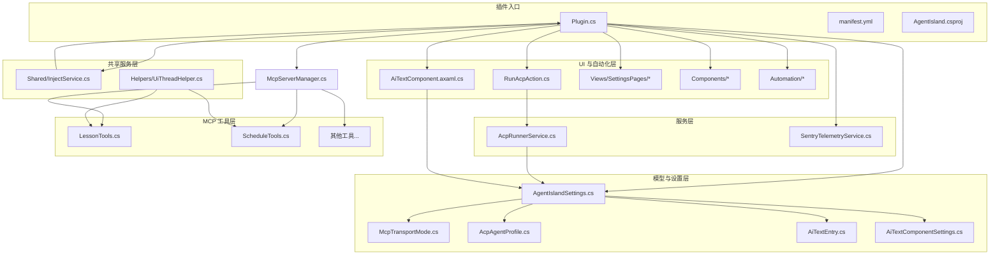
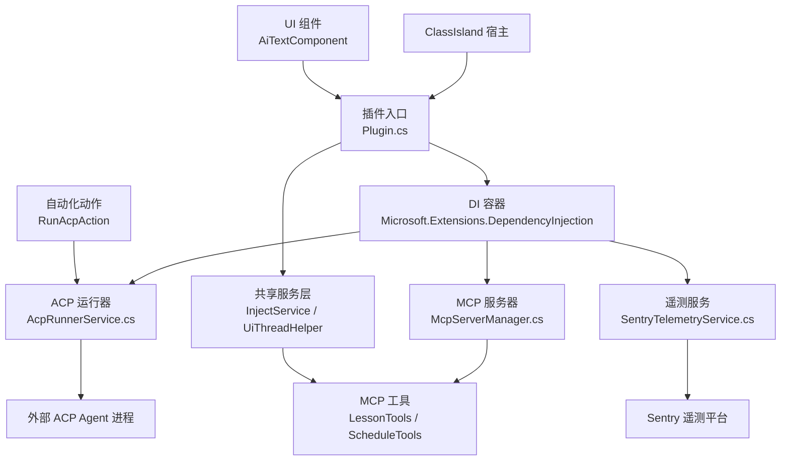
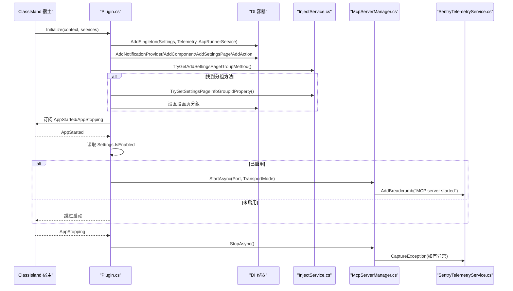
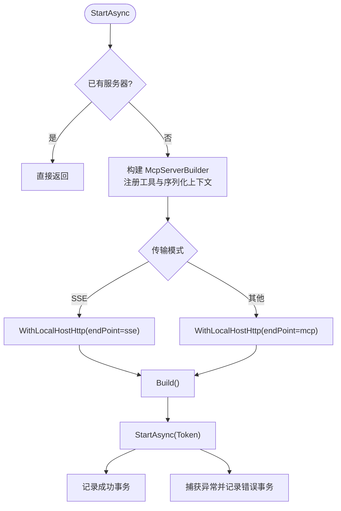
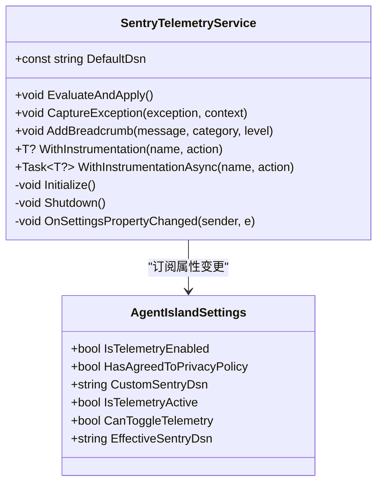
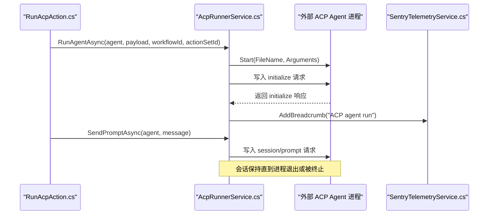
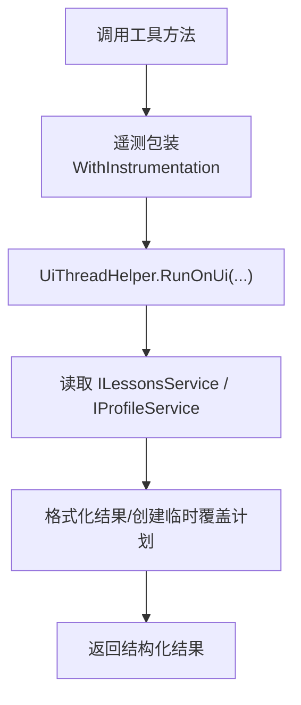
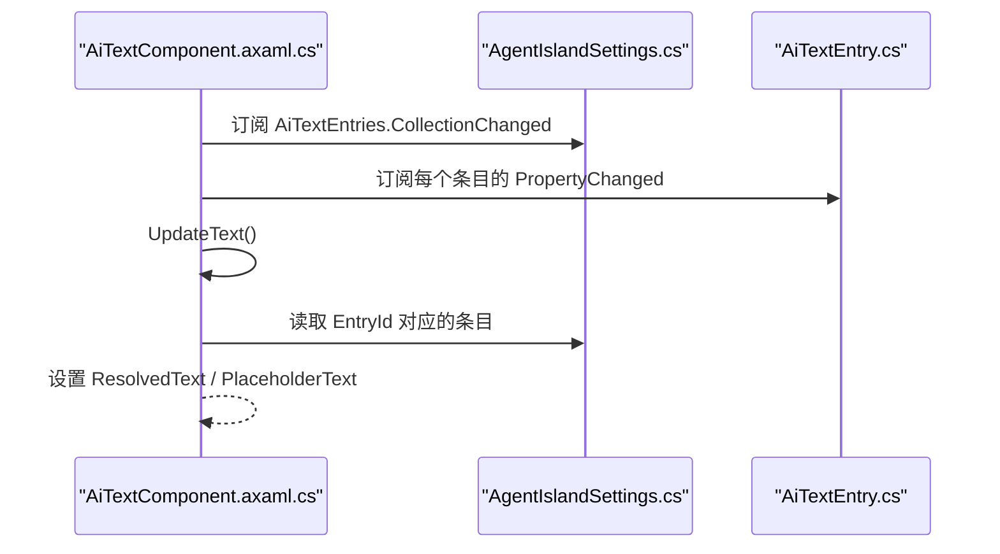
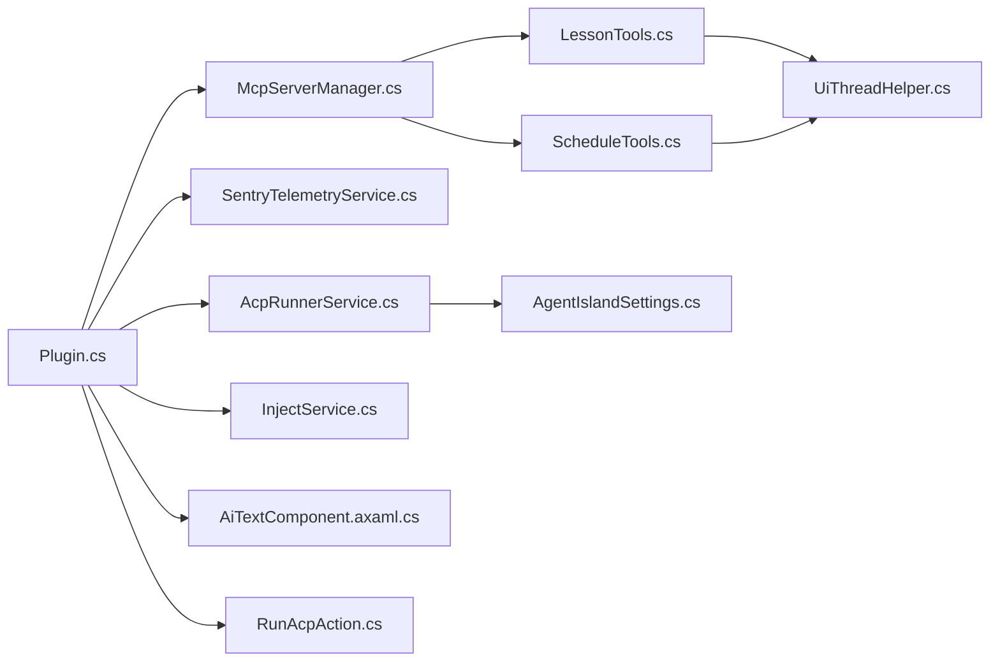

# 架构设计

<cite>
**本文引用的文件**   
- [Plugin.cs](file://AgentIsland/Plugin.cs)
- [manifest.yml](file://AgentIsland/manifest.yml)
- [AgentIsland.csproj](file://AgentIsland/AgentIsland.csproj)
- [McpServerManager.cs](file://AgentIsland/Mcp/McpServerManager.cs)
- [SentryTelemetryService.cs](file://AgentIsland/Services/SentryTelemetryService.cs)
- [AcpRunnerService.cs](file://AgentIsland/Services/AcpRunnerService.cs)
- [LessonTools.cs](file://AgentIsland/Mcp/Tools/LessonTools.cs)
- [ScheduleTools.cs](file://AgentIsland/Mcp/Tools/ScheduleTools.cs)
- [AiTextComponent.axaml.cs](file://AgentIsland/Components/AiTextComponent.axaml.cs)
- [RunAcpAction.cs](file://AgentIsland/Automation/RunAcpAction.cs)
- [AgentIslandSettings.cs](file://AgentIsland/Models/AgentIslandSettings.cs)
- [McpTransportMode.cs](file://AgentIsland/Models/McpTransportMode.cs)
- [AcpAgentProfile.cs](file://AgentIsland/Models/AcpAgentProfile.cs)
- [AiTextEntry.cs](file://AgentIsland/Models/AiTextEntry.cs)
- [AiTextComponentSettings.cs](file://AgentIsland/Models/AiTextComponentSettings.cs)
- [InjectService.cs](file://AgentIsland/Shared/InjectService.cs)
- [UiThreadHelper.cs](file://AgentIsland/Helpers/UiThreadHelper.cs)
- [OverviewSettingsPage.axaml.cs](file://AgentIsland/Views/SettingsPages/OverviewSettingsPage.axaml.cs)
</cite>

## 更新摘要
**所做更改**   
- 更新了项目结构章节以反映新的分层组织
- 新增了 Shared 目录和依赖注入服务说明
- 更新了组件分解图以显示新的目录结构
- 增强了架构模式说明，包含新的分层设计
- 更新了依赖关系分析以反映新的模块边界

## 目录
1. [简介](#简介)
2. [项目结构](#项目结构)
3. [核心组件](#核心组件)
4. [架构总览](#架构总览)
5. [详细组件分析](#详细组件分析)
6. [依赖关系分析](#依赖关系分析)
7. [性能与可扩展性](#性能与可扩展性)
8. [横切关注点：安全、监控与灾难恢复](#横切关注点安全监控与灾难恢复)
9. [部署拓扑与环境要求](#部署拓扑与环境要求)
10. [故障排查指南](#故障排查指南)
11. [结论](#结论)

## 简介
本文件为 AgentIsland 插件的架构设计文档，面向 ClassIsland 生态，提供基于 ClassIsland Plugin SDK 的插件化能力。该插件通过 MCP（Model Context Protocol）对外暴露工具能力，结合 ACP（Agent Client Protocol）运行外部智能体进程，并在 ClassIsland 中提供 UI 组件与自动化动作。整体采用分层架构与依赖注入模式，强调可观测性与可配置性。

**更新** 项目已从扁平结构迁移到分层组织，引入了清晰的目录结构和共享服务层。

## 项目结构
项目采用分层架构组织，主要目录结构如下：

### 核心目录结构
- **入口与清单**
  - `Plugin.cs` - 插件入口类，负责生命周期管理、DI 容器注册、事件订阅与 MCP 服务器启停
  - `manifest.yml` - 描述插件元数据与宿主 API 版本
  - `AgentIsland.csproj` - 项目配置文件，定义依赖项和目标框架

- **模型与设置层 (Models)**
  - 集中式设置对象承载所有用户配置项，支持属性变更持久化与派生属性计算
  - 传输模式枚举用于选择 MCP 服务器的 HTTP 传输协议
  - 数据模型定义包括 ACP Agent 配置、AI 文本条目等

- **服务层 (Services)**
  - 遥测服务封装 Sentry SDK 初始化、开关控制与埋点辅助方法
  - ACP 运行器负责启动外部 Agent 进程、建立 JSON-RPC 会话并发送提示

- **MCP 工具层 (Mcp/Tools)**
  - 课程与课表工具通过 ClassIsland 内部服务读取当前状态与计划，并以结构化结果返回
  - 通知和组件文本操作工具

- **UI 与自动化层**
  - `Components` - Avalonia UI 组件，在加载时订阅全局 AI 文本条目集合，动态渲染内容
  - `Automation` - 自动化动作触发 ACP 运行流程，并可弹出通知
  - `Views` - 设置页面和用户界面控件

- **共享服务层 (Shared)**
  - 新增的共享服务层，提供反射式依赖注入支持和通用功能

- **辅助工具层 (Helpers)**
  - UI 线程辅助工具，确保跨线程访问的安全性

**图表来源**
- [Plugin.cs:1-138](file://AgentIsland/Plugin.cs#L1-L138)
- [AgentIsland.csproj:1-56](file://AgentIsland/AgentIsland.csproj#L1-L56)
- [McpServerManager.cs:1-130](file://AgentIsland/Mcp/McpServerManager.cs#L1-L130)
- [InjectService.cs:1-28](file://AgentIsland/Shared/InjectService.cs#L1-L28)
- [UiThreadHelper.cs:1-25](file://AgentIsland/Helpers/UiThreadHelper.cs#L1-L25)

**章节来源**
- [Plugin.cs:1-138](file://AgentIsland/Plugin.cs#L1-L138)
- [manifest.yml:1-13](file://AgentIsland/manifest.yml#L1-L13)
- [AgentIsland.csproj:1-56](file://AgentIsland/AgentIsland.csproj#L1-L56)

## 核心组件
- **插件入口与 DI 注册**
  - 负责加载 Settings.json、注册设置与遥测服务、注册通知提供者、组件、设置页与自动化动作；监听应用启动/停止事件以启停 MCP 服务器
  - 使用反射机制动态获取设置窗口分组功能，增强兼容性

- **MCP 服务器管理器**
  - 使用 McpServerBuilder 构建并启动本地 HTTP 服务，按传输模式选择端点；注册工具集与 JSON 序列化上下文；统一异常上报与事务记录

- **遥测服务**
  - 根据隐私策略与开关动态初始化/关闭 Sentry SDK；提供 WithInstrumentation 包装同步/异步操作，自动添加事务、面包屑与异常捕获

- **ACP 运行器**
  - 通过 stdio 启动外部 Agent 进程，执行 JSON-RPC initialize 握手，维护会话并发送 session/prompt；退出时优雅关闭或强制终止进程

- **课程与课表工具**
  - 通过 ClassIsland 内部服务获取当前/下一节课、时间状态、今日/指定日期课表、科目列表；支持交换两节课并创建临时覆盖计划

- **UI 组件**
  - 订阅全局 AI 文本条目集合，根据 EntryId 解析显示文本与占位符

- **自动化动作**
  - 校验功能开关与 Agent 可用性后，调用 ACP 运行器启动目标 Agent，并可弹出系统通知

- **共享注入服务**
  - 提供反射式方法发现，支持动态获取 ClassIsland 扩展点方法，增强插件兼容性

**章节来源**
- [Plugin.cs:33-77](file://AgentIsland/Plugin.cs#L33-L77)
- [McpServerManager.cs:25-87](file://AgentIsland/Mcp/McpServerManager.cs#L25-L87)
- [SentryTelemetryService.cs:30-90](file://AgentIsland/Services/SentryTelemetryService.cs#L30-L90)
- [AcpRunnerService.cs:25-77](file://AgentIsland/Services/AcpRunnerService.cs#L25-L77)
- [LessonTools.cs:14-45](file://AgentIsland/Mcp/Tools/LessonTools.cs#L14-L45)
- [AiTextComponent.axaml.cs:36-56](file://AgentIsland/Components/AiTextComponent.axaml.cs#L36-L56)
- [InjectService.cs:10-26](file://AgentIsland/Shared/InjectService.cs#L10-L26)

## 架构总览
- **分层架构**
  - 表现层：ClassIsland 中的 Avalonia 组件与设置页
  - 插件适配层：Plugin 入口与 DI 注册、自动化动作
  - 服务层：遥测、ACP 运行器、MCP 服务器管理
  - 工具层：课程/课表等 MCP 工具
  - 数据与集成层：ClassIsland 内部服务、外部 Agent 进程、Sentry 遥测
  - 共享层：反射注入服务和 UI 线程辅助工具

- **架构模式**
  - 依赖注入：通过 Microsoft.Extensions.DependencyInjection 注册单例服务与插件扩展点
  - 观察者模式：设置对象与集合的属性变更驱动 UI 与派生属性更新
  - 工厂/构建器：McpServerBuilder 构建并装配工具与传输
  - 装饰器/包装：遥测服务对工具调用进行可观测性包装
  - 反射模式：动态方法发现增强兼容性

- **系统边界**
  - 与 ClassIsland 宿主交互：组件、动作、设置页、通知、内部服务
  - 与外部系统交互：本地 HTTP 端口上的 MCP 客户端、外部 ACP Agent 进程、Sentry 云

**图表来源**
- [Plugin.cs:33-77](file://AgentIsland/Plugin.cs#L33-L77)
- [McpServerManager.cs:25-87](file://AgentIsland/Mcp/McpServerManager.cs#L25-L87)
- [InjectService.cs:10-26](file://AgentIsland/Shared/InjectService.cs#L10-L26)
- [UiThreadHelper.cs:7-23](file://AgentIsland/Helpers/UiThreadHelper.cs#L7-L23)

## 详细组件分析

### 插件入口与生命周期
- **职责**
  - 加载并持久化设置；注册遥测、ACP 运行器、通知提供者、组件、设置页与动作；订阅应用启动/停止事件；按需启动/停止 MCP 服务器
  - 使用反射机制动态获取设置窗口分组功能，增强与不同版本 ClassIsland 的兼容性

- **关键流程**
  - 初始化阶段：读取 Settings.json，注册服务，订阅 AppStarted/AppStopping
  - 应用启动：若启用则创建 McpServerManager 并按端口与传输模式启动
  - 应用停止：确保 MCP 服务器优雅停止

- **错误处理**
  - 启动/停止失败均记录日志并通过遥测上报异常

**图表来源**
- [Plugin.cs:33-121](file://AgentIsland/Plugin.cs#L33-L121)
- [InjectService.cs:10-26](file://AgentIsland/Shared/InjectService.cs#L10-L26)
- [McpServerManager.cs:25-87](file://AgentIsland/Mcp/McpServerManager.cs#L25-L87)

**章节来源**
- [Plugin.cs:33-121](file://AgentIsland/Plugin.cs#L33-L121)

### MCP 服务器与工具装配
- **职责**
  - 使用 McpServerBuilder 注册工具集与 JSON 序列化上下文；根据传输模式选择端点；统一异常与事务记录
- **工具注册**
  - 课程工具、课表工具、通知工具、组件文本设置工具、交换课程工具等
- **传输模式**
  - StreamableHttp 默认端点 mcp；SSE 兼容端点 sse

**图表来源**
- [McpServerManager.cs:25-87](file://AgentIsland/Mcp/McpServerManager.cs#L25-L87)
- [McpTransportMode.cs:6-17](file://AgentIsland/Models/McpTransportMode.cs#L6-L17)

**章节来源**
- [McpServerManager.cs:25-87](file://AgentIsland/Mcp/McpServerManager.cs#L25-L87)
- [McpTransportMode.cs:6-17](file://AgentIsland/Models/McpTransportMode.cs#L6-L17)

### 遥测服务与可观测性
- **职责**
  - 根据设置动态初始化/关闭 Sentry SDK；提供 WithInstrumentation 包装同步/异步操作；统一标签与额外信息
- **隐私与合规**
  - 仅在同意隐私政策或使用自定义 DSN 时允许开启遥测；支持运行时切换
- **事务与面包屑**
  - 工具调用前后添加面包屑，异常路径记录上下文

**图表来源**
- [SentryTelemetryService.cs:11-90](file://AgentIsland/Services/SentryTelemetryService.cs#L11-L90)
- [AgentIslandSettings.cs:176-200](file://AgentIsland/Models/AgentIslandSettings.cs#L176-L200)

**章节来源**
- [SentryTelemetryService.cs:30-90](file://AgentIsland/Services/SentryTelemetryService.cs#L30-L90)
- [AgentIslandSettings.cs:176-200](file://AgentIsland/Models/AgentIslandSettings.cs#L176-L200)

### ACP 运行器与会话管理
- **职责**
  - 启动外部 Agent 进程，执行 JSON-RPC initialize，维护会话，发送 prompt；退出时清理资源
- **关键流程**
  - 启动：解析命令，创建进程，写入初始化请求，读取响应并标记已初始化
  - 发送提示：查找会话，构造 session/prompt 请求并写入标准输入
  - 清理：关闭标准输入，等待退出，必要时 Kill，释放进程句柄

**图表来源**
- [AcpRunnerService.cs:25-131](file://AgentIsland/Services/AcpRunnerService.cs#L25-L131)
- [SentryTelemetryService.cs:92-122](file://AgentIsland/Services/SentryTelemetryService.cs#L92-L122)

**章节来源**
- [AcpRunnerService.cs:25-131](file://AgentIsland/Services/AcpRunnerService.cs#L25-L131)

### 课程与课表工具
- **课程工具**
  - 获取当前课程、下一节课、时间状态；通过 UiThreadHelper 在 UI 线程访问 ClassIsland 服务
- **课表工具**
  - 获取今日/指定日期课表、列出科目、交换两节课并保存；支持临时覆盖计划

**图表来源**
- [LessonTools.cs:14-45](file://AgentIsland/Mcp/Tools/LessonTools.cs#L14-L45)
- [UiThreadHelper.cs:7-23](file://AgentIsland/Helpers/UiThreadHelper.cs#L7-L23)

**章节来源**
- [LessonTools.cs:14-45](file://AgentIsland/Mcp/Tools/LessonTools.cs#L14-L45)

### UI 组件与数据绑定
- **职责**
  - 在 Loaded 时订阅全局 AI 文本条目集合与设置变更；根据 EntryId 解析文本并显示占位符
- **数据流**
  - 集合变更与条目属性变更触发 UpdateText，更新 ResolvedText 与 PlaceholderText

**图表来源**
- [AiTextComponent.axaml.cs:36-83](file://AgentIsland/Components/AiTextComponent.axaml.cs#L36-L83)
- [AgentIslandSettings.cs:107-122](file://AgentIsland/Models/AgentIslandSettings.cs#L107-L122)

**章节来源**
- [AiTextComponent.axaml.cs:36-83](file://AgentIsland/Components/AiTextComponent.axaml.cs#L36-L83)
- [AgentIslandSettings.cs:107-122](file://AgentIsland/Models/AgentIslandSettings.cs#L107-L122)

## 依赖关系分析
- **内部依赖**
  - Plugin 依赖 McpServerManager、SentryTelemetryService、AcpRunnerService 及各类 UI/自动化扩展
  - McpServerManager 依赖工具集与 JSON 序列化上下文
  - 工具依赖 ClassIsland 内部服务（课程、时间、档案）和 UiThreadHelper
  - AcpRunnerService 依赖 System.Diagnostics.Process 与 JSON 序列化
  - 共享层提供反射注入支持和 UI 线程辅助功能

- **外部依赖**
  - ClassIsland.PluginSdk（插件框架）、DotNetCampus.ModelContextProtocol（MCP 服务器）、AgentClientProtocol、Sentry（遥测）
- **版本与兼容性**
  - 目标框架 net8.0-windows；插件 SDK 版本由常量定义；MCP 包为 alpha 版本，需注意稳定性

**图表来源**
- [Plugin.cs:33-77](file://AgentIsland/Plugin.cs#L33-L77)
- [InjectService.cs:10-26](file://AgentIsland/Shared/InjectService.cs#L10-L26)
- [UiThreadHelper.cs:7-23](file://AgentIsland/Helpers/UiThreadHelper.cs#L7-L23)

**章节来源**
- [AgentIsland.csproj:1-56](file://AgentIsland/AgentIsland.csproj#L1-L56)

## 性能与可扩展性
- **性能考虑**
  - 工具方法通过 UiThreadHelper 在 UI 线程执行，避免跨线程访问导致的开销与竞态
  - MCP 服务器仅监听本地回环地址，减少网络栈开销
  - 遥测采样率设置为 1.0，建议在生产环境根据负载调整
- **可扩展性**
  - 新增 MCP 工具只需实现方法并注册到 McpServerBuilder
  - 新增 UI 组件/设置页/自动化动作通过 DI 扩展点注册
  - 设置对象支持集合与派生属性，便于扩展新的配置域
  - 共享层提供反射机制，支持动态扩展 ClassIsland 功能
- **约束**
  - Windows 平台限定；alpha 版本的 MCP 库可能存在不稳定因素
  - ACP 进程通信基于 stdio，需保证外部 Agent 遵循 JSON-RPC 规范

## 横切关注点：安全、监控与灾难恢复
- **安全性**
  - 仅本地回环监听，避免外网暴露
  - 遥测默认关闭 PII 发送，支持用户自定义 DSN 与隐私策略同意检查
- **监控**
  - 关键生命周期（插件初始化、MCP 启动/停止、工具调用）记录面包屑与事务
  - 异常捕获附带上下文标签，便于定位问题
- **灾难恢复**
  - MCP 服务器启动失败不影响插件继续运行；停止过程包含取消令牌与异常保护
  - ACP 运行器在退出时尝试优雅关闭，超时则强制终止，防止僵尸进程

**章节来源**
- [McpServerManager.cs:76-87](file://AgentIsland/Mcp/McpServerManager.cs#L76-L87)
- [SentryTelemetryService.cs:42-75](file://AgentIsland/Services/SentryTelemetryService.cs#L42-L75)
- [AcpRunnerService.cs:156-191](file://AgentIsland/Services/AcpRunnerService.cs#L156-L191)

## 部署拓扑与环境要求
- **环境要求**
  - Windows 平台；.NET 8 运行时；ClassIsland 宿主满足插件 API 版本要求
- **部署拓扑**
  - 插件作为 ClassIsland 子模块加载；MCP 服务器以本地 HTTP 形式暴露；外部 ACP Agent 作为独立进程运行
- **配置要点**
  - 端口与传输模式在设置中配置；遥测开关与隐私策略需在设置页完成

**章节来源**
- [manifest.yml:1-13](file://AgentIsland/manifest.yml#L1-L13)
- [AgentIsland.csproj:1-56](file://AgentIsland/AgentIsland.csproj#L1-L56)
- [AgentIslandSettings.cs:34-62](file://AgentIsland/Models/AgentIslandSettings.cs#L34-L62)

## 故障排查指南
- **MCP 服务器无法启动**
  - 检查端口占用与传输模式配置；查看日志与 Sentry 异常上下文
- **ACP Agent 未连接**
  - 确认命令有效且外部进程存在；检查 JSON-RPC initialize 响应；观察会话状态
- **遥测未上报**
  - 确认隐私策略已同意或已配置自定义 DSN；检查 IsTelemetryActive 与 EffectiveSentryDsn
- **UI 组件无内容**
  - 核对 EntryId 是否存在于 AiTextEntries；检查集合与条目属性变更是否触发更新
- **设置页分组问题**
  - 检查 InjectService 反射方法是否成功获取；验证 GroupId 属性是否正确设置

**章节来源**
- [Plugin.cs:67-79](file://AgentIsland/Plugin.cs#L67-L79)
- [AcpRunnerService.cs:79-100](file://AgentIsland/Services/AcpRunnerService.cs#L79-L100)
- [SentryTelemetryService.cs:30-90](file://AgentIsland/Services/SentryTelemetryService.cs#L30-L90)
- [AiTextComponent.axaml.cs:73-83](file://AgentIsland/Components/AiTextComponent.axaml.cs#L73-L83)
- [InjectService.cs:10-26](file://AgentIsland/Shared/InjectService.cs#L10-L26)

## 结论
AgentIsland 插件以分层架构与依赖注入为核心，围绕 MCP 工具与 ACP 运行器构建了可扩展的智能体集成方案。通过引入共享服务层和反射机制，增强了插件的兼容性和可维护性。通过遥测与日志增强可观测性，结合 UI 组件与自动化动作提升用户体验。建议在后续迭代中完善错误恢复策略、优化遥测采样率，并对 alpha 版 MCP 库进行稳定性评估与替代方案准备。

**更新** 新的分层架构设计使代码组织更加清晰，共享服务层提供了更好的复用性和兼容性支持。