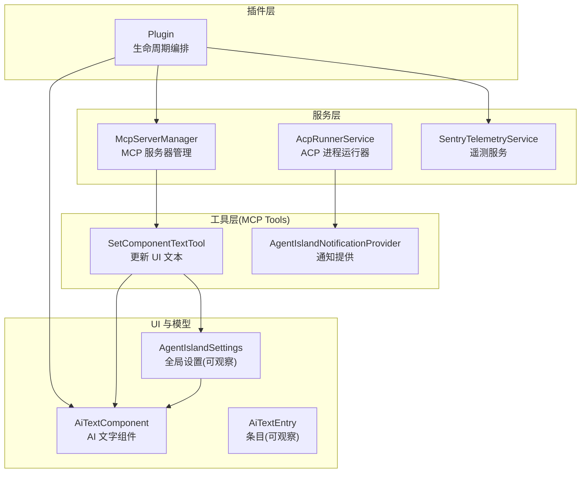
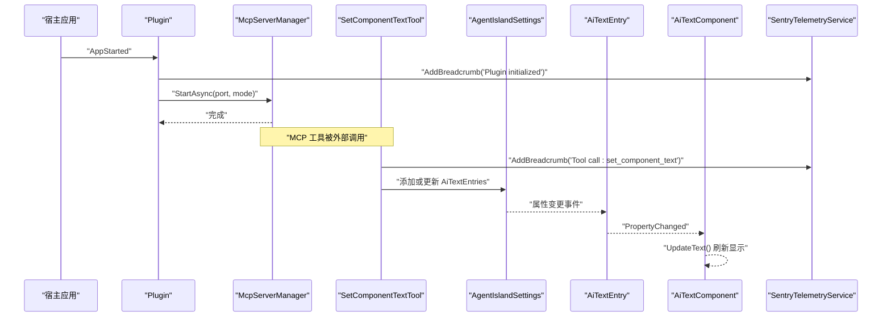
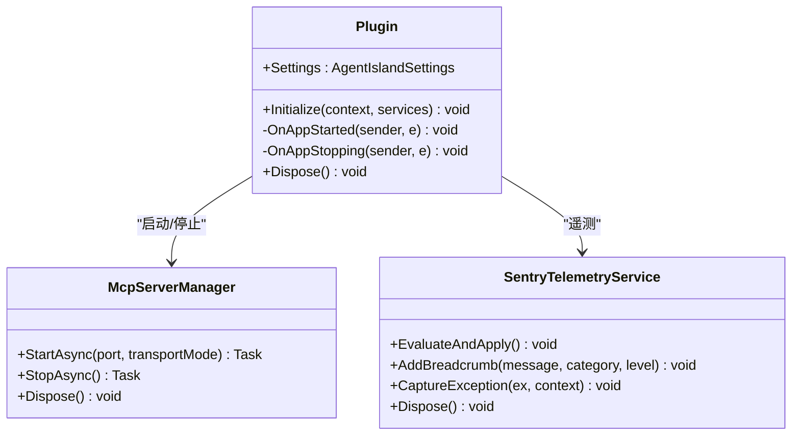
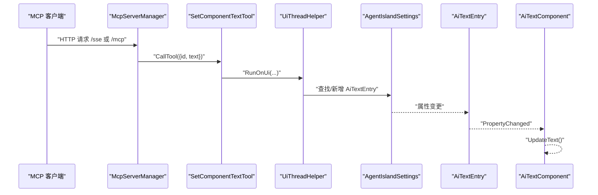
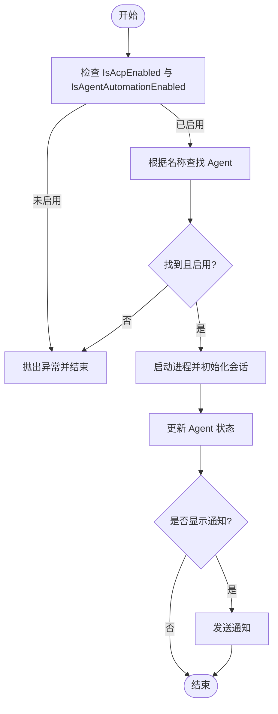
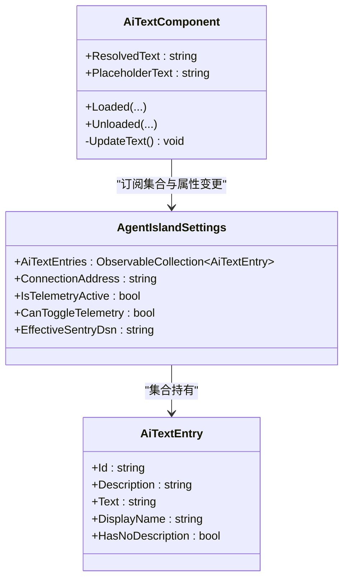
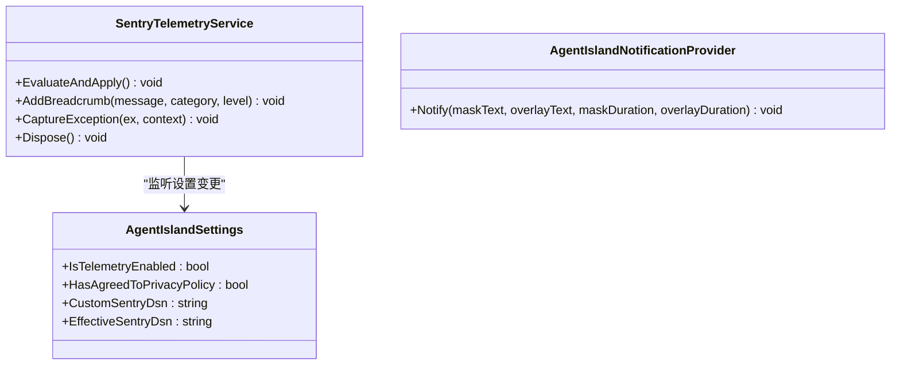
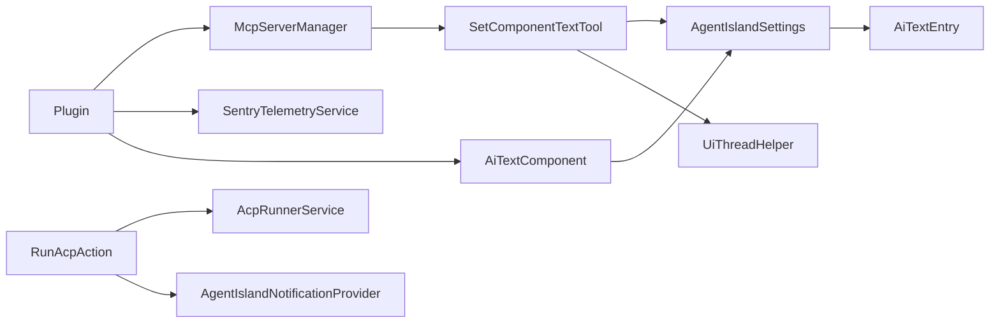

# 组件交互模式

<cite>
**本文引用的文件**   
- [Plugin.cs](file://Plugin.cs)
- [McpServerManager.cs](file://Mcp/McpServerManager.cs)
- [AcpRunnerService.cs](file://Services/AcpRunnerService.cs)
- [AiTextComponent.axaml.cs](file://Components/AiTextComponent.axaml.cs)
- [SetComponentTextTool.cs](file://Mcp/Tools/SetComponentTextTool.cs)
- [AgentIslandSettings.cs](file://Models/AgentIslandSettings.cs)
- [AiTextEntry.cs](file://Models/AiTextEntry.cs)
- [SentryTelemetryService.cs](file://Services/SentryTelemetryService.cs)
- [UiThreadHelper.cs](file://Helpers/UiThreadHelper.cs)
- [RunAcpAction.cs](file://Automation/RunAcpAction.cs)
- [AgentIslandNotificationProvider.cs](file://Mcp/Tools/AgentIslandNotificationProvider.cs)
</cite>

## 目录
1. [简介](#简介)
2. [项目结构](#项目结构)
3. [核心组件](#核心组件)
4. [架构总览](#架构总览)
5. [详细组件分析](#详细组件分析)
6. [依赖关系分析](#依赖关系分析)
7. [性能考量](#性能考量)
8. [故障排查指南](#故障排查指南)
9. [结论](#结论)
10. [附录](#附录)

## 简介
本文件聚焦于 AgentIsland 插件内部的“组件交互模式”，系统性阐述：
- 事件驱动与消息传递机制（含观察者模式）
- Plugin 作为协调者对 McpServerManager、AcpRunnerService、UI 组件等核心组件的生命周期管理
- 跨组件数据共享策略与状态同步机制
- 异步操作协调方式
- 组件解耦设计原则、接口抽象策略与向后兼容性保证
- 组件间通信最佳实践与性能优化建议

## 项目结构
从代码组织看，本项目采用“按功能域分层 + 插件入口集中编排”的结构：
- 插件入口与生命周期编排：Plugin.cs
- MCP 服务器管理与工具注册：Mcp/McpServerManager.cs、Mcp/Tools/*
- ACP 进程运行器：Services/AcpRunnerService.cs
- UI 组件与设置模型：Components/*、Views/*、Models/*
- 辅助能力：Helpers/UiThreadHelper.cs、Services/SentryTelemetryService.cs

图表来源
- [Plugin.cs:29-79](file://Plugin.cs#L29-L79)
- [McpServerManager.cs:25-82](file://Mcp/McpServerManager.cs#L25-L82)
- [SetComponentTextTool.cs:41-72](file://Mcp/Tools/SetComponentTextTool.cs#L41-L72)
- [AiTextComponent.axaml.cs:36-56](file://Components/AiTextComponent.axaml.cs#L36-L56)
- [AgentIslandSettings.cs:107-122](file://Models/AgentIslandSettings.cs#L107-L122)
- [AiTextEntry.cs:5-14](file://Models/AiTextEntry.cs#L5-L14)
- [SentryTelemetryService.cs:30-40](file://Services/SentryTelemetryService.cs#L30-L40)
- [RunAcpAction.cs:29-82](file://Automation/RunAcpAction.cs#L29-L82)
- [AgentIslandNotificationProvider.cs:27-50](file://Mcp/Tools/AgentIslandNotificationProvider.cs#L27-L50)

章节来源
- [Plugin.cs:29-79](file://Plugin.cs#L29-L79)
- [McpServerManager.cs:25-82](file://Mcp/McpServerManager.cs#L25-L82)
- [AiTextComponent.axaml.cs:36-56](file://Components/AiTextComponent.axaml.cs#L36-L56)
- [AgentIslandSettings.cs:107-122](file://Models/AgentIslandSettings.cs#L107-L122)

## 核心组件
- Plugin：插件入口，负责加载配置、注册服务、订阅宿主应用启动/停止事件、启动/停止 MCP 服务器。
- McpServerManager：封装 MCP 服务器的构建、传输模式选择、工具注册、启停控制。
- AcpRunnerService：通过 stdio JSON-RPC 协议启动并管理外部 ACP Agent 进程会话。
- SetComponentTextTool：MCP 工具，接收外部调用，将文本写入全局设置的 AiTextEntries，并在 UI 线程上触发更新。
- AiTextComponent：Avalonia 组件，订阅全局设置集合与条目属性变更，渲染最终文本。
- AgentIslandSettings：全局可观察设置，持有 AI 文字条目集合、ACP Agent 列表等，并通过属性派生值联动 UI。
- SentryTelemetryService：根据隐私策略与开关动态初始化/关闭遥测 SDK，并提供统一埋点 API。
- UiThreadHelper：在 Avalonia UI 线程安全执行委托的辅助方法。
- RunAcpAction：自动化动作，校验开关后调用 AcpRunnerService 启动 Agent，并可发送通知。
- AgentIslandNotificationProvider：基于 ClassIsland 通知通道展示遮罩/覆盖层通知。

章节来源
- [Plugin.cs:29-79](file://Plugin.cs#L29-L79)
- [McpServerManager.cs:25-82](file://Mcp/McpServerManager.cs#L25-L82)
- [AcpRunnerService.cs:25-77](file://Services/AcpRunnerService.cs#L25-L77)
- [SetComponentTextTool.cs:41-72](file://Mcp/Tools/SetComponentTextTool.cs#L41-L72)
- [AiTextComponent.axaml.cs:36-56](file://Components/AiTextComponent.axaml.cs#L36-L56)
- [AgentIslandSettings.cs:107-122](file://Models/AgentIslandSettings.cs#L107-L122)
- [SentryTelemetryService.cs:30-40](file://Services/SentryTelemetryService.cs#L30-L40)
- [UiThreadHelper.cs:7-23](file://Helpers/UiThreadHelper.cs#L7-L23)
- [RunAcpAction.cs:29-82](file://Automation/RunAcpAction.cs#L29-L82)
- [AgentIslandNotificationProvider.cs:27-50](file://Mcp/Tools/AgentIslandNotificationProvider.cs#L27-L50)

## 架构总览
整体采用“事件驱动 + 观察者 + 依赖注入”的混合模式：
- 事件驱动：宿主应用 AppStarted/AppStopping 事件驱动 MCP 服务器启停；Ui 生命周期事件驱动组件订阅/取消订阅。
- 观察者模式：AgentIslandSettings 及其集合项使用 ObservableObject/ObservableCollection，UI 组件与设置页自动响应变更。
- 消息传递：MCP 工具以结构化输入输出进行跨进程/跨模块调用；ACP 通过 stdio JSON-RPC 与外部 Agent 通信。
- 依赖注入：Plugin.Initialize 中集中注册服务、组件、设置页、动作与通知提供者，实现松耦合装配。

图表来源
- [Plugin.cs:55-79](file://Plugin.cs#L55-L79)
- [McpServerManager.cs:25-82](file://Mcp/McpServerManager.cs#L25-L82)
- [SetComponentTextTool.cs:41-72](file://Mcp/Tools/SetComponentTextTool.cs#L41-L72)
- [AgentIslandSettings.cs:107-122](file://Models/AgentIslandSettings.cs#L107-L122)
- [AiTextEntry.cs:5-14](file://Models/AiTextEntry.cs#L5-L14)
- [AiTextComponent.axaml.cs:36-56](file://Components/AiTextComponent.axaml.cs#L36-L56)
- [SentryTelemetryService.cs:114-122](file://Services/SentryTelemetryService.cs#L114-L122)

## 详细组件分析

### 组件 A：Plugin 协调者与生命周期管理
- 职责
  - 加载并持久化全局设置（保存时绑定 PropertyChanged）。
  - 初始化遥测服务并根据设置启用/禁用。
  - 注册服务、组件、设置页、动作与通知提供者。
  - 订阅宿主应用启动/停止事件，启动/停止 MCP 服务器。
- 关键流程
  - Initialize：加载配置、注册服务、订阅 AppStarted/AppStopping。
  - OnAppStarted：创建并启动 McpServerManager，记录遥测日志。
  - OnAppStopping：优雅停止 MCP 服务器。
  - Dispose：注销事件、释放资源。
- 设计要点
  - 通过静态 Settings 暴露全局可观察配置，供多组件订阅。
  - 使用 ILogger 与 SentryTelemetryService 进行诊断与异常上报。

图表来源
- [Plugin.cs:29-97](file://Plugin.cs#L29-L97)
- [McpServerManager.cs:25-112](file://Mcp/McpServerManager.cs#L25-L112)
- [SentryTelemetryService.cs:30-40](file://Services/SentryTelemetryService.cs#L30-L40)

章节来源
- [Plugin.cs:29-97](file://Plugin.cs#L29-L97)

### 组件 B：MCP 服务器与工具链（McpServerManager + SetComponentTextTool）
- 职责
  - McpServerManager：构建并启动 MCP 服务器，按传输模式选择端点，注册工具集。
  - SetComponentTextTool：处理来自外部的“设置组件文本”调用，更新全局设置中的条目，并在 UI 线程触发界面刷新。
- 关键流程
  - StartAsync：创建 builder，注册工具，选择 SSE 或 HTTP 端点，启动服务。
  - CallTool：解析参数，定位或新增 AiTextEntry，使用 UiThreadHelper 切换到 UI 线程更新。
- 设计要点
  - 工具与 UI 解耦：工具不直接访问 UI，仅修改可观察数据源。
  - 线程安全：所有 UI 相关操作经 UiThreadHelper 调度。

图表来源
- [McpServerManager.cs:25-82](file://Mcp/McpServerManager.cs#L25-L82)
- [SetComponentTextTool.cs:41-72](file://Mcp/Tools/SetComponentTextTool.cs#L41-L72)
- [AiTextComponent.axaml.cs:73-83](file://Components/AiTextComponent.axaml.cs#L73-L83)
- [AgentIslandSettings.cs:107-122](file://Models/AgentIslandSettings.cs#L107-L122)
- [AiTextEntry.cs:5-14](file://Models/AiTextEntry.cs#L5-L14)
- [UiThreadHelper.cs:7-23](file://Helpers/UiThreadHelper.cs#L7-L23)

章节来源
- [McpServerManager.cs:25-82](file://Mcp/McpServerManager.cs#L25-L82)
- [SetComponentTextTool.cs:41-72](file://Mcp/Tools/SetComponentTextTool.cs#L41-L72)
- [AiTextComponent.axaml.cs:73-83](file://Components/AiTextComponent.axaml.cs#L73-L83)

### 组件 C：ACP 运行器与自动化（AcpRunnerService + RunAcpAction）
- 职责
  - AcpRunnerService：通过标准输入输出与外部 ACP Agent 进程进行 JSON-RPC 会话管理（initialize、session/prompt）。
  - RunAcpAction：在自动化框架中触发，校验开关与 Agent 可用性后，调用 AcpRunnerService 启动 Agent，并可发送通知。
- 关键流程
  - RunAgentAsync：解析命令、启动进程、建立会话、标记已初始化。
  - SendPromptAsync：向指定会话发送 prompt。
  - OnInvoke：校验 IsAcpEnabled、IsAgentAutomationEnabled、Agent 存在且启用，然后启动并更新状态，必要时发送通知。
- 设计要点
  - 进程隔离：每个 Agent 独立进程，避免崩溃扩散。
  - 状态可见性：通过 AcpAgentProfile.Status 暴露连接/运行状态，便于 UI 展示。

图表来源
- [RunAcpAction.cs:29-82](file://Automation/RunAcpAction.cs#L29-L82)
- [AcpRunnerService.cs:25-77](file://Services/AcpRunnerService.cs#L25-L77)
- [AgentIslandNotificationProvider.cs:27-50](file://Mcp/Tools/AgentIslandNotificationProvider.cs#L27-L50)

章节来源
- [RunAcpAction.cs:29-82](file://Automation/RunAcpAction.cs#L29-L82)
- [AcpRunnerService.cs:25-77](file://Services/AcpRunnerService.cs#L25-L77)
- [AgentIslandNotificationProvider.cs:27-50](file://Mcp/Tools/AgentIslandNotificationProvider.cs#L27-L50)

### 组件 D：UI 组件与数据绑定（AiTextComponent + AgentIslandSettings + AiTextEntry）
- 职责
  - AiTextComponent：在 Loaded/Unloaded 生命周期内订阅/取消订阅全局设置集合与条目属性变更，计算并渲染 ResolvedText 与 PlaceholderText。
  - AgentIslandSettings：维护 AiTextEntries 集合，并在集合变化与条目属性变化时触发 PropertyChanged，支持派生属性（如 ConnectionAddress、遥测开关逻辑）。
  - AiTextEntry：单个条目的可观察对象，包含 Id、Description、Text 等字段。
- 关键流程
  - 组件加载：订阅 Settings.AiTextEntries.CollectionChanged 与每个 Entry.PropertyChanged，以及 Settings.PropertyChanged。
  - 数据更新：当任意条目 Text 变化，组件重新计算 ResolvedText 与占位符可见性。
- 设计要点
  - 纯观察者模式：无直接引用 UI 之外的业务逻辑，仅消费数据源。
  - 内存管理：在 Unloaded 中正确取消订阅，防止泄漏。

图表来源
- [AgentIslandSettings.cs:107-122](file://Models/AgentIslandSettings.cs#L107-L122)
- [AiTextEntry.cs:5-14](file://Models/AiTextEntry.cs#L5-L14)
- [AiTextComponent.axaml.cs:36-56](file://Components/AiTextComponent.axaml.cs#L36-L56)
- [AiTextComponent.axaml.cs:73-83](file://Components/AiTextComponent.axaml.cs#L73-L83)

章节来源
- [AiTextComponent.axaml.cs:36-56](file://Components/AiTextComponent.axaml.cs#L36-L56)
- [AiTextComponent.axaml.cs:73-83](file://Components/AiTextComponent.axaml.cs#L73-L83)
- [AgentIslandSettings.cs:107-122](file://Models/AgentIslandSettings.cs#L107-L122)
- [AiTextEntry.cs:5-14](file://Models/AiTextEntry.cs#L5-L14)

### 组件 E：遥测与通知（SentryTelemetryService + AgentIslandNotificationProvider）
- 职责
  - SentryTelemetryService：监听设置变更，按需初始化/关闭 Sentry SDK，提供 AddBreadcrumb/CaptureException/WithInstrumentation 等 API。
  - AgentIslandNotificationProvider：在 UI 线程上通过 ClassIsland 通知通道展示遮罩/覆盖层通知。
- 关键流程
  - EvaluateAndApply：根据 IsTelemetryActive 决定是否初始化或关闭 SDK。
  - Notify：构造 NotificationRequest，调用 Channel(MessageChannelId).ShowNotification。
- 设计要点
  - 条件启用：遥测受隐私策略与用户开关双重约束。
  - UI 线程安全：通知显示强制切到 UI 线程。

图表来源
- [SentryTelemetryService.cs:30-40](file://Services/SentryTelemetryService.cs#L30-L40)
- [SentryTelemetryService.cs:114-122](file://Services/SentryTelemetryService.cs#L114-L122)
- [AgentIslandNotificationProvider.cs:27-50](file://Mcp/Tools/AgentIslandNotificationProvider.cs#L27-L50)
- [AgentIslandSettings.cs:178-200](file://Models/AgentIslandSettings.cs#L178-L200)

章节来源
- [SentryTelemetryService.cs:30-40](file://Services/SentryTelemetryService.cs#L30-L40)
- [AgentIslandNotificationProvider.cs:27-50](file://Mcp/Tools/AgentIslandNotificationProvider.cs#L27-L50)
- [AgentIslandSettings.cs:178-200](file://Models/AgentIslandSettings.cs#L178-L200)

## 依赖关系分析
- 组件耦合
  - Plugin 与 McpServerManager、SentryTelemetryService 为强依赖（生命周期管理）。
  - SetComponentTextTool 依赖 AgentIslandSettings 与 UiThreadHelper，间接影响 AiTextComponent。
  - RunAcpAction 依赖 AcpRunnerService 与 AgentIslandNotificationProvider。
- 依赖注入
  - 通过 IServiceCollection 注册单例服务与 UI 组件、设置页、动作、通知提供者，降低硬编码耦合。
- 潜在循环依赖
  - 当前未见循环引用；工具仅写数据，UI 仅读数据，方向清晰。

图表来源
- [Plugin.cs:29-79](file://Plugin.cs#L29-L79)
- [McpServerManager.cs:25-82](file://Mcp/McpServerManager.cs#L25-L82)
- [SetComponentTextTool.cs:41-72](file://Mcp/Tools/SetComponentTextTool.cs#L41-L72)
- [RunAcpAction.cs:29-82](file://Automation/RunAcpAction.cs#L29-L82)
- [AiTextComponent.axaml.cs:36-56](file://Components/AiTextComponent.axaml.cs#L36-L56)
- [AgentIslandSettings.cs:107-122](file://Models/AgentIslandSettings.cs#L107-L122)

章节来源
- [Plugin.cs:29-79](file://Plugin.cs#L29-L79)
- [McpServerManager.cs:25-82](file://Mcp/McpServerManager.cs#L25-L82)
- [SetComponentTextTool.cs:41-72](file://Mcp/Tools/SetComponentTextTool.cs#L41-L72)
- [RunAcpAction.cs:29-82](file://Automation/RunAcpAction.cs#L29-L82)
- [AiTextComponent.axaml.cs:36-56](file://Components/AiTextComponent.axaml.cs#L36-L56)
- [AgentIslandSettings.cs:107-122](file://Models/AgentIslandSettings.cs#L107-L122)

## 性能考量
- 事件订阅与取消订阅
  - 在组件 Loaded/Unloaded 中成对订阅/取消订阅，避免内存泄漏与重复回调。
- UI 线程调度
  - 非 UI 线程更新 UI 相关数据时，统一通过 UiThreadHelper 切换，减少竞态与重绘开销。
- 遥测开销
  - 遥测仅在满足条件时初始化；批量埋点建议使用 WithInstrumentation/WithInstrumentationAsync 包裹关键路径，避免重复事务创建。
- 进程管理
  - ACP 进程启动与退出需合理超时与清理，避免僵尸进程占用资源。
- 网络 I/O
  - MCP 服务器与外部 Agent 的 I/O 均为异步，注意 CancellationToken 的正确传播，避免阻塞。

[本节为通用指导，无需特定文件来源]

## 故障排查指南
- MCP 服务器无法启动
  - 检查端口占用与传输模式配置；查看日志与遥测面包屑。
  - 参考：[McpServerManager.cs:25-82](file://Mcp/McpServerManager.cs#L25-L82)、[Plugin.cs:55-79](file://Plugin.cs#L55-L79)
- 组件文本未更新
  - 确认 SetComponentTextTool 的参数 id/text 是否正确；检查 UiThreadHelper 是否成功调度；验证 AiTextEntry 是否存在且 Text 已变更。
  - 参考：[SetComponentTextTool.cs:41-72](file://Mcp/Tools/SetComponentTextTool.cs#L41-L72)、[AiTextComponent.axaml.cs:73-83](file://Components/AiTextComponent.axaml.cs#L73-L83)
- ACP Agent 启动失败
  - 检查 IsAcpEnabled、IsAgentAutomationEnabled 开关；确认 Agent 名称与命令有效；查看进程输出与异常捕获。
  - 参考：[RunAcpAction.cs:29-82](file://Automation/RunAcpAction.cs#L29-L82)、[AcpRunnerService.cs:25-77](file://Services/AcpRunnerService.cs#L25-L77)
- 通知未显示
  - 确认通知渠道 ID 与 UI 线程调度；检查 OverlayDuration 是否为正数。
  - 参考：[AgentIslandNotificationProvider.cs:27-50](file://Mcp/Tools/AgentIslandNotificationProvider.cs#L27-L50)
- 遥测未上报
  - 检查隐私策略同意与开关；确认 EffectiveSentryDsn 不为空；查看 EvaluateAndApply 是否触发初始化。
  - 参考：[SentryTelemetryService.cs:30-40](file://Services/SentryTelemetryService.cs#L30-L40)、[AgentIslandSettings.cs:178-200](file://Models/AgentIslandSettings.cs#L178-L200)

章节来源
- [McpServerManager.cs:25-82](file://Mcp/McpServerManager.cs#L25-L82)
- [Plugin.cs:55-79](file://Plugin.cs#L55-L79)
- [SetComponentTextTool.cs:41-72](file://Mcp/Tools/SetComponentTextTool.cs#L41-L72)
- [AiTextComponent.axaml.cs:73-83](file://Components/AiTextComponent.axaml.cs#L73-L83)
- [RunAcpAction.cs:29-82](file://Automation/RunAcpAction.cs#L29-L82)
- [AcpRunnerService.cs:25-77](file://Services/AcpRunnerService.cs#L25-L77)
- [AgentIslandNotificationProvider.cs:27-50](file://Mcp/Tools/AgentIslandNotificationProvider.cs#L27-L50)
- [SentryTelemetryService.cs:30-40](file://Services/SentryTelemetryService.cs#L30-L40)
- [AgentIslandSettings.cs:178-200](file://Models/AgentIslandSettings.cs#L178-L200)

## 结论
AgentIsland 通过“事件驱动 + 观察者 + 依赖注入”的组合实现了清晰的组件交互模式：
- Plugin 作为协调者，统一管理 MCP 服务器与遥测服务的生命周期。
- 数据流单向：工具只写可观察数据，UI 只读数据并响应变更，避免紧耦合。
- 异步与线程安全：I/O 与 UI 操作均遵循异步与 UI 线程调度规范。
- 可扩展性与向后兼容：通过依赖注入与接口抽象（IMcpServerTool、NotificationProviderBase），新增工具与通知渠道无需改动现有组件。

[本节为总结，无需特定文件来源]

## 附录

### 组件间通信最佳实践
- 明确数据所有权：全局设置作为唯一事实源，其他组件仅订阅变更。
- 严格线程边界：非 UI 线程一律通过 UiThreadHelper 切换。
- 最小权限原则：工具仅修改必要字段，避免副作用。
- 错误上报与可观测性：关键路径使用 SentryTelemetryService 埋点，便于问题定位。
- 资源清理：组件卸载时及时取消订阅，服务停止时释放进程与句柄。

[本节为通用指导，无需特定文件来源]