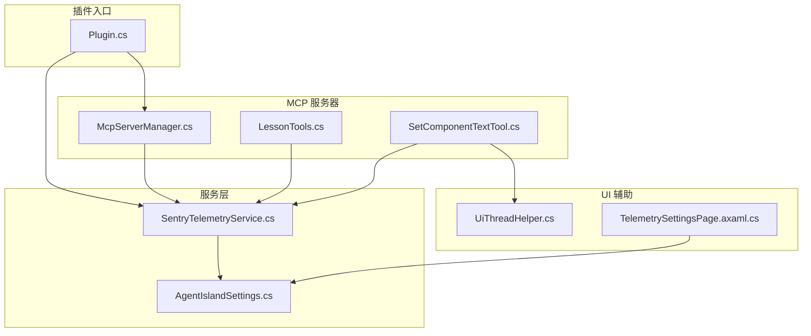
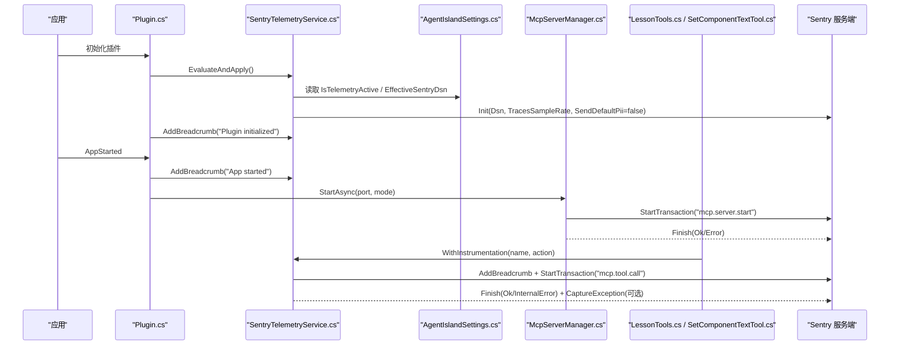
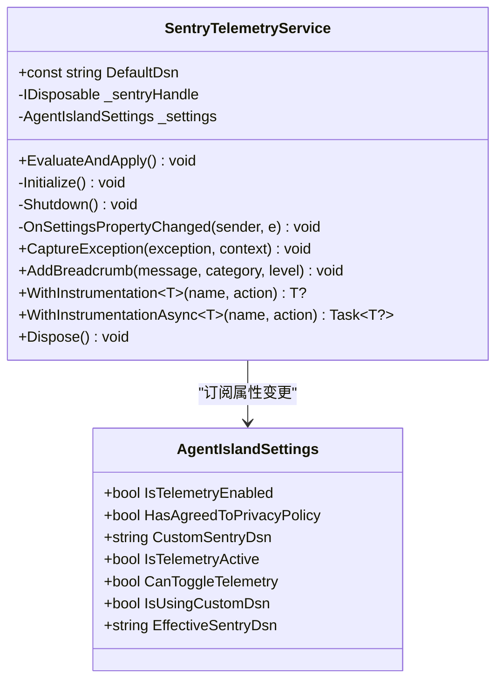
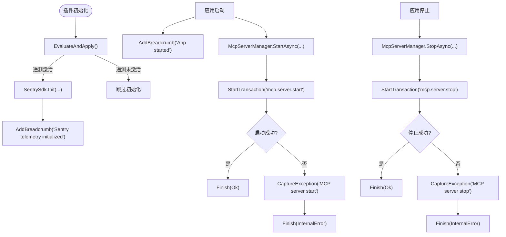
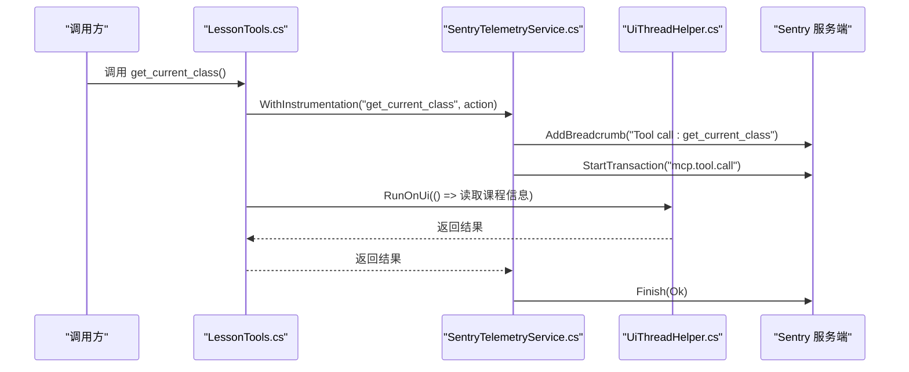
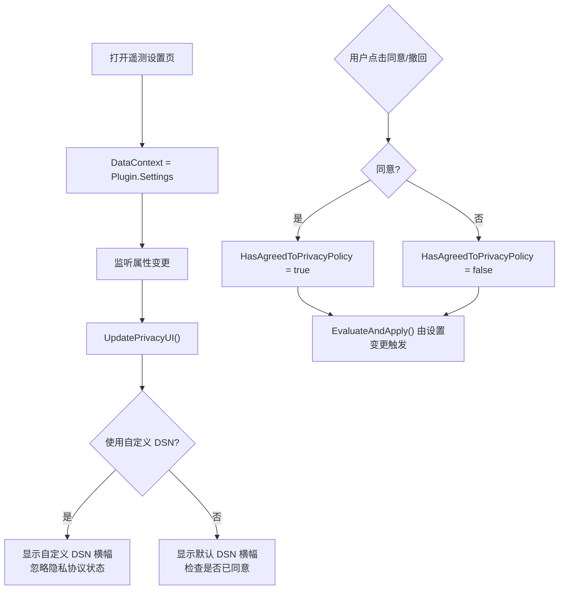
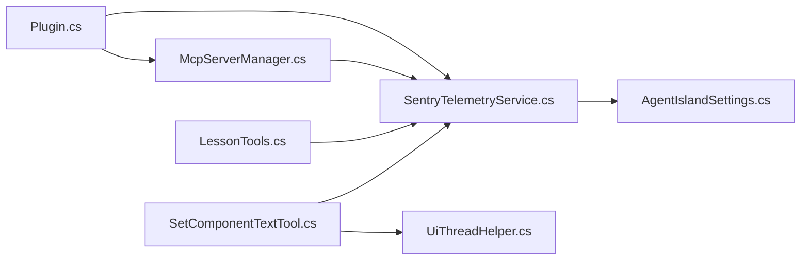

# 遥测和监控

<cite>
**本文引用的文件**
- [Services/SentryTelemetryService.cs](file://Services/SentryTelemetryService.cs)
- [Models/AgentIslandSettings.cs](file://Models/AgentIslandSettings.cs)
- [Plugin.cs](file://Plugin.cs)
- [Mcp/McpServerManager.cs](file://Mcp/McpServerManager.cs)
- [Helpers/UiThreadHelper.cs](file://Helpers/UiThreadHelper.cs)
- [Views/SettingsPages/TelemetrySettingsPage.axaml.cs](file://Views/SettingsPages/TelemetrySettingsPage.axaml.cs)
- [Mcp/Tools/LessonTools.cs](file://Mcp/Tools/LessonTools.cs)
- [Mcp/Tools/SetComponentTextTool.cs](file://Mcp/Tools/SetComponentTextTool.cs)
- [PRIVACY_POLICY.md](file://PRIVACY_POLICY.md)
- [CROSS_BORDER_DATA_TRANSFER.md](file://CROSS_BORDER_DATA_TRANSFER.md)
</cite>

## 目录
1. [简介](#简介)
2. [项目结构](#项目结构)
3. [核心组件](#核心组件)
4. [架构总览](#架构总览)
5. [详细组件分析](#详细组件分析)
6. [依赖关系分析](#依赖关系分析)
7. [性能与指标](#性能与指标)
8. [调试与故障排查](#调试与故障排查)
9. [隐私与合规](#隐私与合规)
10. [结论](#结论)

## 简介
本文件面向遥测与监控系统，系统性说明 AgentIsland 插件中基于 Sentry 的错误追踪、性能监控、日志记录策略、告警配置思路、线程辅助工具使用、UI 线程安全与异步操作监控，以及遥测数据的收集、传输与分析流程。同时提供调试技巧、常见问题排查与性能优化建议，并解释监控指标定义与阈值设置方法，最后覆盖隐私保护与数据合规要求。

## 项目结构
遥测与监控相关代码主要分布在以下位置：
- 服务层：SentryTelemetryService 负责 SDK 生命周期管理与遥测 API
- 模型层：AgentIslandSettings 管理遥测开关、隐私同意与 DSN 配置
- 插件入口：Plugin 初始化遥测服务并在应用生命周期事件中添加面包屑
- MCP 服务器：McpServerManager 在启动/停止时创建事务并上报异常
- UI 线程辅助：UiThreadHelper 确保 UI 访问安全
- 设置页面：TelemetrySettingsPage 提供用户同意与测试能力
- 工具类：LessonTools、SetComponentTextTool 等通过 WithInstrumentation 包裹调用以采集性能与错误

图表来源
- [Plugin.cs:29-53](file://Plugin.cs#L29-L53)
- [Services/SentryTelemetryService.cs:21-40](file://Services/SentryTelemetryService.cs#L21-L40)
- [Models/AgentIslandSettings.cs:177-200](file://Models/AgentIslandSettings.cs#L177-L200)
- [Mcp/McpServerManager.cs:25-82](file://Mcp/McpServerManager.cs#L25-L82)
- [Mcp/Tools/LessonTools.cs:14-20](file://Mcp/Tools/LessonTools.cs#L14-L20)
- [Mcp/Tools/SetComponentTextTool.cs:41-72](file://Mcp/Tools/SetComponentTextTool.cs#L41-L72)
- [Helpers/UiThreadHelper.cs:7-23](file://Helpers/UiThreadHelper.cs#L7-L23)
- [Views/SettingsPages/TelemetrySettingsPage.axaml.cs:27-42](file://Views/SettingsPages/TelemetrySettingsPage.axaml.cs#L27-L42)

章节来源
- [Plugin.cs:29-53](file://Plugin.cs#L29-L53)
- [Services/SentryTelemetryService.cs:21-40](file://Services/SentryTelemetryService.cs#L21-L40)
- [Models/AgentIslandSettings.cs:177-200](file://Models/AgentIslandSettings.cs#L177-L200)
- [Mcp/McpServerManager.cs:25-82](file://Mcp/McpServerManager.cs#L25-L82)
- [Mcp/Tools/LessonTools.cs:14-20](file://Mcp/Tools/LessonTools.cs#L14-L20)
- [Mcp/Tools/SetComponentTextTool.cs:41-72](file://Mcp/Tools/SetComponentTextTool.cs#L41-L72)
- [Helpers/UiThreadHelper.cs:7-23](file://Helpers/UiThreadHelper.cs#L7-L23)
- [Views/SettingsPages/TelemetrySettingsPage.axaml.cs:27-42](file://Views/SettingsPages/TelemetrySettingsPage.axaml.cs#L27-L42)

## 核心组件
- SentryTelemetryService：封装 Sentry SDK 的初始化、关闭、异常捕获、面包屑添加、同步/异步操作的性能埋点（Transaction）与自动异常上报；监听设置变更动态启用/禁用遥测。
- AgentIslandSettings：维护遥测开关、隐私协议同意状态、自定义 DSN 与实际生效的 DSN；提供派生属性控制遥测是否活动及开关可用性。
- Plugin：在插件初始化时注册遥测服务、注入到 DI 容器，并在应用启动/停止事件中记录关键生命周期面包屑与异常。
- McpServerManager：在 MCP 服务器启动/停止过程中创建事务，记录成功或失败状态，并将异常上报至 Sentry。
- UiThreadHelper：统一在 UI 线程执行委托，避免跨线程访问 UI 元素导致异常。
- TelemetrySettingsPage：提供用户同意/撤回同意的交互、显示默认/自定义 DSN 提示、测试发送消息的能力。
- 工具类（如 LessonTools、SetComponentTextTool）：通过 WithInstrumentation 包裹业务逻辑，实现统一的性能埋点与异常捕获；必要时使用 UiThreadHelper 保证 UI 线程安全。

章节来源
- [Services/SentryTelemetryService.cs:11-90](file://Services/SentryTelemetryService.cs#L11-L90)
- [Models/AgentIslandSettings.cs:148-200](file://Models/AgentIslandSettings.cs#L148-L200)
- [Plugin.cs:29-53](file://Plugin.cs#L29-L53)
- [Mcp/McpServerManager.cs:25-82](file://Mcp/McpServerManager.cs#L25-L82)
- [Helpers/UiThreadHelper.cs:7-23](file://Helpers/UiThreadHelper.cs#L7-L23)
- [Views/SettingsPages/TelemetrySettingsPage.axaml.cs:27-42](file://Views/SettingsPages/TelemetrySettingsPage.axaml.cs#L27-L42)
- [Mcp/Tools/LessonTools.cs:14-20](file://Mcp/Tools/LessonTools.cs#L14-L20)
- [Mcp/Tools/SetComponentTextTool.cs:41-72](file://Mcp/Tools/SetComponentTextTool.cs#L41-L72)

## 架构总览
下图展示了从插件初始化到 MCP 服务器运行期间，遥测服务的集成方式与数据流路径。

图表来源
- [Plugin.cs:29-53](file://Plugin.cs#L29-L53)
- [Services/SentryTelemetryService.cs:30-69](file://Services/SentryTelemetryService.cs#L30-L69)
- [Models/AgentIslandSettings.cs:177-200](file://Models/AgentIslandSettings.cs#L177-L200)
- [Mcp/McpServerManager.cs:25-82](file://Mcp/McpServerManager.cs#L25-L82)
- [Mcp/Tools/LessonTools.cs:14-20](file://Mcp/Tools/LessonTools.cs#L14-L20)
- [Mcp/Tools/SetComponentTextTool.cs:41-72](file://Mcp/Tools/SetComponentTextTool.cs#L41-L72)

## 详细组件分析

### SentryTelemetryService 完整功能
- 生命周期管理
  - EvaluateAndApply：根据 IsTelemetryActive 决定是否初始化或关闭 SDK
  - Initialize：设置 Dsn、TracesSampleRate、SendDefaultPii=false、AutoSessionTracking=false，添加 BeforeSend 标签，ConfigureScope 设置全局标签，记录初始化面包屑
  - Shutdown：释放 SDK 句柄
- 设置变更监听
  - OnSettingsPropertyChanged：当遥测开关、隐私同意、自定义 DSN 变化时重新评估并应用
- 遥测 API
  - CaptureException：在遥测未启用时静默返回，启用后上报异常并可附加上下文
  - AddBreadcrumb：添加分类化事件用于问题复现
  - WithInstrumentation / WithInstrumentationAsync：为同步/异步操作创建 Transaction，记录成功/失败状态，异常时自动上报并标记 InternalError

图表来源
- [Services/SentryTelemetryService.cs:11-90](file://Services/SentryTelemetryService.cs#L11-L90)
- [Models/AgentIslandSettings.cs:148-200](file://Models/AgentIslandSettings.cs#L148-L200)

章节来源
- [Services/SentryTelemetryService.cs:30-90](file://Services/SentryTelemetryService.cs#L30-L90)
- [Services/SentryTelemetryService.cs:95-174](file://Services/SentryTelemetryService.cs#L95-L174)
- [Models/AgentIslandSettings.cs:177-200](file://Models/AgentIslandSettings.cs#L177-L200)

### 插件生命周期与 MCP 服务器监控
- 插件初始化：注册遥测服务、保存设置、记录“插件已初始化”面包屑
- 应用启动：记录“应用启动”面包屑，启动 MCP 服务器，记录“MCP 服务器启动”面包屑，异常时上报
- 应用停止：记录“应用停止”面包屑，停止 MCP 服务器，异常时上报
- MCP 服务器：StartAsync/StopAsync 分别创建事务，成功完成 Ok，异常完成 InternalError 并上报

图表来源
- [Plugin.cs:29-97](file://Plugin.cs#L29-L97)
- [Mcp/McpServerManager.cs:25-112](file://Mcp/McpServerManager.cs#L25-L112)

章节来源
- [Plugin.cs:29-97](file://Plugin.cs#L29-L97)
- [Mcp/McpServerManager.cs:25-112](file://Mcp/McpServerManager.cs#L25-L112)

### 工具调用性能埋点与 UI 线程安全
- 工具调用模式
  - 通过 IAppHost.GetService<SentryTelemetryService>() 获取遥测服务
  - 使用 WithInstrumentation 或 WithInstrumentationAsync 包裹核心逻辑，自动记录面包屑、创建 Transaction、捕获异常并标注状态
- UI 线程安全
  - 涉及 UI 操作的工具（如 SetComponentTextTool）使用 UiThreadHelper.RunOnUi 确保在 UI 线程执行，避免跨线程异常
- 示例工具
  - LessonTools：get_current_class、get_next_class、get_time_status 均使用 WithInstrumentation 包裹
  - SetComponentTextTool：更新文本时使用 UiThreadHelper 并记录面包屑与异常

图表来源
- [Mcp/Tools/LessonTools.cs:14-20](file://Mcp/Tools/LessonTools.cs#L14-L20)
- [Mcp/Tools/LessonTools.cs:22-45](file://Mcp/Tools/LessonTools.cs#L22-L45)
- [Services/SentryTelemetryService.cs:127-148](file://Services/SentryTelemetryService.cs#L127-L148)
- [Helpers/UiThreadHelper.cs:7-23](file://Helpers/UiThreadHelper.cs#L7-L23)

章节来源
- [Mcp/Tools/LessonTools.cs:14-91](file://Mcp/Tools/LessonTools.cs#L14-L91)
- [Mcp/Tools/SetComponentTextTool.cs:41-72](file://Mcp/Tools/SetComponentTextTool.cs#L41-L72)
- [Services/SentryTelemetryService.cs:127-174](file://Services/SentryTelemetryService.cs#L127-L174)
- [Helpers/UiThreadHelper.cs:7-23](file://Helpers/UiThreadHelper.cs#L7-L23)

### 遥测设置与用户同意流程
- 设置页面
  - 绑定到 Plugin.Settings，监听隐私协议与自定义 DSN 变化，动态更新 UI 状态
  - 支持“同意/撤回同意”，并显示横幅提示默认/自定义 DSN
  - 测试按钮可直接发送一条测试消息验证连接
- 设置模型
  - IsTelemetryActive：遥测是否处于活动状态（启用且同意或使用自定义 DSN）
  - CanToggleTelemetry：开关是否可用（同意或使用自定义 DSN）
  - EffectiveSentryDsn：实际使用的 DSN（自定义优先，否则默认）

图表来源
- [Views/SettingsPages/TelemetrySettingsPage.axaml.cs:27-73](file://Views/SettingsPages/TelemetrySettingsPage.axaml.cs#L27-L73)
- [Models/AgentIslandSettings.cs:177-200](file://Models/AgentIslandSettings.cs#L177-L200)
- [Services/SentryTelemetryService.cs:30-40](file://Services/SentryTelemetryService.cs#L30-L40)

章节来源
- [Views/SettingsPages/TelemetrySettingsPage.axaml.cs:27-124](file://Views/SettingsPages/TelemetrySettingsPage.axaml.cs#L27-L124)
- [Models/AgentIslandSettings.cs:177-200](file://Models/AgentIslandSettings.cs#L177-L200)
- [Services/SentryTelemetryService.cs:30-40](file://Services/SentryTelemetryService.cs#L30-L40)

## 依赖关系分析
- 低耦合设计
  - SentryTelemetryService 仅依赖 AgentIslandSettings 与 Sentry SDK，不直接依赖 UI 或 MCP 框架
  - 工具类通过 DI 获取遥测服务，保持松耦合
- 直接依赖
  - Plugin 依赖 SentryTelemetryService 与 McpServerManager
  - McpServerManager 依赖 SentryTelemetryService（可选）
  - 工具类依赖 SentryTelemetryService 与 UiThreadHelper（需要 UI 操作时）
- 外部依赖
  - Sentry SDK：错误追踪与性能监控
  - Avalonia Dispatcher：UI 线程调度

图表来源
- [Plugin.cs:29-53](file://Plugin.cs#L29-L53)
- [Services/SentryTelemetryService.cs:21-40](file://Services/SentryTelemetryService.cs#L21-L40)
- [Mcp/McpServerManager.cs:19-23](file://Mcp/McpServerManager.cs#L19-L23)
- [Mcp/Tools/LessonTools.cs:14-20](file://Mcp/Tools/LessonTools.cs#L14-L20)
- [Mcp/Tools/SetComponentTextTool.cs:41-72](file://Mcp/Tools/SetComponentTextTool.cs#L41-L72)
- [Helpers/UiThreadHelper.cs:7-23](file://Helpers/UiThreadHelper.cs#L7-L23)

章节来源
- [Plugin.cs:29-53](file://Plugin.cs#L29-L53)
- [Services/SentryTelemetryService.cs:21-40](file://Services/SentryTelemetryService.cs#L21-L40)
- [Mcp/McpServerManager.cs:19-23](file://Mcp/McpServerManager.cs#L19-L23)
- [Mcp/Tools/LessonTools.cs:14-20](file://Mcp/Tools/LessonTools.cs#L14-L20)
- [Mcp/Tools/SetComponentTextTool.cs:41-72](file://Mcp/Tools/SetComponentTextTool.cs#L41-L72)
- [Helpers/UiThreadHelper.cs:7-23](file://Helpers/UiThreadHelper.cs#L7-L23)

## 性能与指标
- 采样率
  - TracesSampleRate=1.0：所有事务均被采样，便于全面分析但会增加数据量
- 事务与跨度
  - 服务器启动/停止：mcp.server.start、mcp.server.stop
  - 工具调用：mcp.tool.call（每个工具调用一个事务）
- 面包屑
  - 插件生命周期：plugin.lifecycle（初始化、应用启动/停止）
  - MCP 生命周期：mcp.lifecycle（服务器启动端口信息）
  - 工具调用：mcp.tool（每次调用前记录）
- 标签与额外信息
  - 全局标签：classisland.plugin=AgentIsland
  - 事件标签：plugin=AgentIsland
  - 工具上下文：context/tool 字段用于区分调用来源
- 指标定义建议
  - 成功率：Finish(Ok)/Finish(InternalError) 的比例
  - 延迟分布：事务持续时间分位数（P50/P90/P95/P99）
  - 错误率：每千次调用的异常数
  - 首包时间：服务器启动耗时
- 阈值设置建议
  - 成功率低于 99% 触发告警
  - P95 延迟超过 500ms 触发告警
  - 错误率超过 1% 触发告警
  - 服务器启动耗时超过 3s 触发告警

章节来源
- [Services/SentryTelemetryService.cs:49-69](file://Services/SentryTelemetryService.cs#L49-L69)
- [Mcp/McpServerManager.cs:33-82](file://Mcp/McpServerManager.cs#L33-L82)
- [Mcp/Tools/LessonTools.cs:14-91](file://Mcp/Tools/LessonTools.cs#L14-L91)

## 调试与故障排查
- 快速验证
  - 在遥测设置页面点击“发送测试消息”，确认 Sentry 连接正常
- 常见现象与处理
  - 遥测未上报：检查 IsTelemetryActive 是否为真；确认 HasAgreedToPrivacyPolicy 或 CustomSentryDsn 有效
  - 自定义 DSN 变更后未生效：Ensure EvaluateAndApply 被调用（设置变更会触发），必要时重启插件
  - UI 线程异常：确保 UI 操作通过 UiThreadHelper.RunOnUi 执行
  - 工具调用无事务：确认使用了 WithInstrumentation/WithInstrumentationAsync 包裹
- 定位步骤
  - 查看面包屑序列，定位异常发生前的关键事件
  - 检查事务状态（Ok/InternalError）与额外上下文（tool/context）
  - 对比不同环境下的 TracesSampleRate 与网络连通性

章节来源
- [Views/SettingsPages/TelemetrySettingsPage.axaml.cs:126-138](file://Views/SettingsPages/TelemetrySettingsPage.axaml.cs#L126-L138)
- [Services/SentryTelemetryService.cs:30-40](file://Services/SentryTelemetryService.cs#L30-L40)
- [Helpers/UiThreadHelper.cs:7-23](file://Helpers/UiThreadHelper.cs#L7-L23)
- [Mcp/Tools/SetComponentTextTool.cs:41-72](file://Mcp/Tools/SetComponentTextTool.cs#L41-L72)

## 隐私与合规
- 数据最小化
  - SendDefaultPii=false：不发送 IP、主机名等个人身份信息
  - 不收集课程内容、用户输入、敏感凭证
- 用户控制
  - 默认开启遥测功能，但需用户明确同意后才生效
  - 可随时撤回同意，立即停止新数据收集
  - 支持自定义 DSN，跳过隐私同意检查，将数据发送至自有项目
- 跨境数据传输
  - 数据经 HTTPS/TLS 加密传输至 Sentry 美国数据中心
  - 依据 PIPL 第三十八条取得单独同意，并提供撤回权
- 数据保留
  - Sentry 默认保留 90 天，本地离线缓存最多 30 条，发送后清理

章节来源
- [PRIVACY_POLICY.md:1-145](file://PRIVACY_POLICY.md#L1-L145)
- [CROSS_BORDER_DATA_TRANSFER.md:1-141](file://CROSS_BORDER_DATA_TRANSFER.md#L1-L141)
- [Services/SentryTelemetryService.cs:49-69](file://Services/SentryTelemetryService.cs#L49-L69)
- [Views/SettingsPages/TelemetrySettingsPage.axaml.cs:75-124](file://Views/SettingsPages/TelemetrySettingsPage.axaml.cs#L75-L124)

## 结论
本遥测与监控系统围绕 SentryTelemetryService 构建，结合 AgentIslandSettings 的用户控制与隐私同意机制，实现了错误追踪、性能监控与生命周期事件的全面采集。通过 WithInstrumentation 系列方法对工具调用进行标准化埋点，配合 UiThreadHelper 保障 UI 线程安全，确保了数据采集的一致性与可靠性。在满足隐私与合规要求的前提下，系统提供了清晰的调试与排障手段，并为后续告警与性能优化奠定了坚实基础。