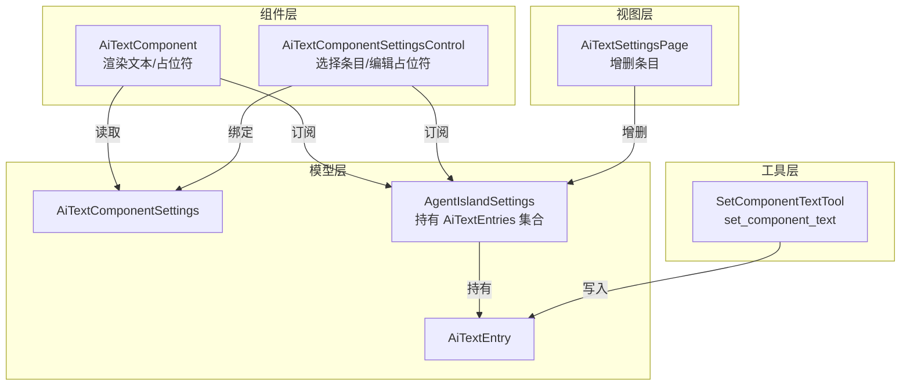
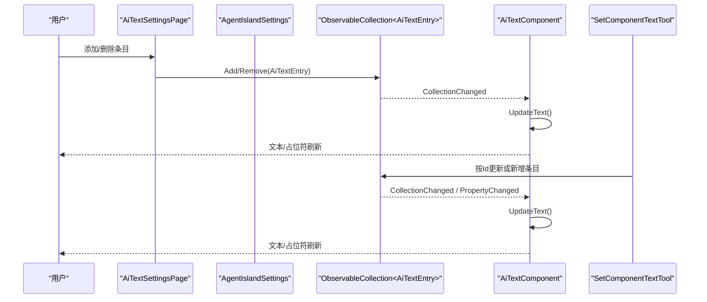
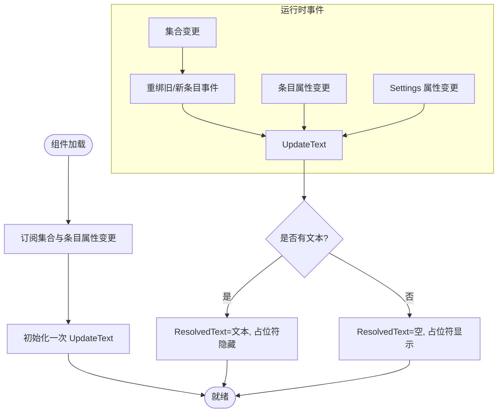
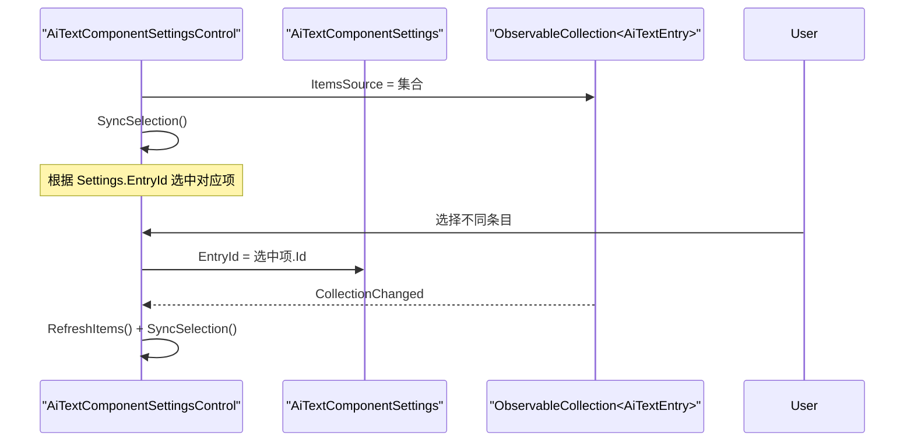
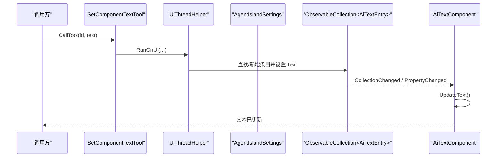
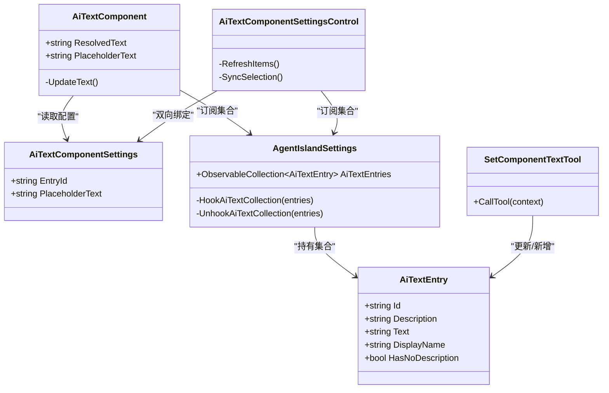

# AI 文字组件配置

<cite>
**本文引用的文件**   
- [AiTextEntry.cs](file://Models/AiTextEntry.cs)
- [AiTextComponentSettings.cs](file://Models/AiTextComponentSettings.cs)
- [AgentIslandSettings.cs](file://Models/AgentIslandSettings.cs)
- [AiTextComponent.axaml.cs](file://Components/AiTextComponent.axaml.cs)
- [AiTextComponent.axaml](file://Components/AiTextComponent.axaml)
- [AiTextComponentSettingsControl.axaml.cs](file://Components/AiTextComponentSettingsControl.axaml.cs)
- [AiTextComponentSettingsControl.axaml](file://Components/AiTextComponentSettingsControl.axaml)
- [AiTextSettingsPage.axaml.cs](file://Views/SettingsPages/AiTextSettingsPage.axaml.cs)
- [SetComponentTextTool.cs](file://Mcp/Tools/SetComponentTextTool.cs)
</cite>

## 目录
1. [简介](#简介)
2. [项目结构](#项目结构)
3. [核心数据模型](#核心数据模型)
4. [架构总览](#架构总览)
5. [详细组件分析](#详细组件分析)
6. [依赖关系分析](#依赖关系分析)
7. [性能与优化](#性能与优化)
8. [故障排查指南](#故障排查指南)
9. [结论](#结论)
10. [附录：配置示例与最佳实践](#附录配置示例与最佳实践)

## 简介
本文件为“AI 文字组件”的数据模型与配置系统提供全面文档，覆盖以下要点：
- AiTextEntry 实体结构与字段语义（文本内容、显示样式、更新策略等）
- AiTextComponentSettings 类的配置项与行为控制
- ObservableCollection 集合的变更监听机制与事件处理流程
- 配置项验证规则、数据类型约束与默认值管理
- 组件配置的完整示例与最佳实践
- 配置与 UI 绑定的实现方式、性能优化策略与数据同步机制

## 项目结构
围绕 AI 文字组件的相关代码分布在 Models、Components、Views 与 Mcp/Tools 四个层次：
- Models：数据模型与设置容器（AiTextEntry、AiTextComponentSettings、AgentIslandSettings）
- Components：UI 组件与设置控件（AiTextComponent、AiTextComponentSettingsControl）
- Views：设置页面（AiTextSettingsPage）
- Mcp/Tools：通过 MCP 工具 set_component_text 更新条目文本

图表来源
- [AiTextEntry.cs:1-31](file://Models/AiTextEntry.cs#L1-L31)
- [AiTextComponentSettings.cs:1-13](file://Models/AiTextComponentSettings.cs#L1-L13)
- [AgentIslandSettings.cs:108-122](file://Models/AgentIslandSettings.cs#L108-L122)
- [AiTextComponent.axaml.cs:16-84](file://Components/AiTextComponent.axaml.cs#L16-L84)
- [AiTextComponentSettingsControl.axaml.cs:7-52](file://Components/AiTextComponentSettingsControl.axaml.cs#L7-L52)
- [AiTextSettingsPage.axaml.cs:14-35](file://Views/SettingsPages/AiTextSettingsPage.axaml.cs#L14-L35)
- [SetComponentTextTool.cs:17-72](file://Mcp/Tools/SetComponentTextTool.cs#L17-L72)

章节来源
- [AiTextEntry.cs:1-31](file://Models/AiTextEntry.cs#L1-L31)
- [AiTextComponentSettings.cs:1-13](file://Models/AiTextComponentSettings.cs#L1-L13)
- [AgentIslandSettings.cs:108-122](file://Models/AgentIslandSettings.cs#L108-L122)
- [AiTextComponent.axaml.cs:16-84](file://Components/AiTextComponent.axaml.cs#L16-L84)
- [AiTextComponentSettingsControl.axaml.cs:7-52](file://Components/AiTextComponentSettingsControl.axaml.cs#L7-L52)
- [AiTextSettingsPage.axaml.cs:14-35](file://Views/SettingsPages/AiTextSettingsPage.axaml.cs#L14-L35)
- [SetComponentTextTool.cs:17-72](file://Mcp/Tools/SetComponentTextTool.cs#L17-L72)

## 核心数据模型
本节聚焦两个核心类：AiTextEntry 与 AiTextComponentSettings。

### AiTextEntry 实体结构
- 标识与描述
  - Id：字符串，条目的唯一标识，用于组件绑定与工具更新定位
  - Description：字符串，可选的描述信息；当为空时，DisplayName 回退到 Id
- 文本内容
  - Text：字符串，实际要显示的文本内容
- 派生属性
  - DisplayName：若 Description 为空则返回 Id，否则返回 Description
  - HasNoDescription：指示是否缺少描述
- 通知机制
  - 使用可观察属性生成器，Id/Description 变化时会触发 DisplayName 与 HasNoDescription 的变更通知

复杂度与行为
- 时间复杂度：属性访问 O(1)，变更通知 O(1)
- 空间复杂度：O(1)
- 适用场景：作为列表项展示、被组件按 Id 查找并绑定其 Text

章节来源
- [AiTextEntry.cs:1-31](file://Models/AiTextEntry.cs#L1-L31)

### AiTextComponentSettings 配置类
- EntryId：字符串，当前组件绑定的条目 Id
- PlaceholderText：字符串，无内容时的占位提示文本，默认值为“暂无内容”
- 继承自可观察接收者基类，支持属性变更通知

用途
- 由组件实例持有，决定从哪个条目取文本以及占位符文案

章节来源
- [AiTextComponentSettings.cs:1-13](file://Models/AiTextComponentSettings.cs#L1-L13)

## 架构总览
AI 文字组件的数据流遵循“设置驱动 + 双向通知”的模式：
- 设置页维护 AiTextEntries 集合（增删条目）
- 组件在加载时订阅集合与条目属性变更，根据 Settings.EntryId 解析目标条目并计算 ResolvedText
- 占位符文本来自 Settings.PlaceholderText，并在无内容时显示占位块
- MCP 工具 set_component_text 可直接修改或新增条目，从而实时反映到 UI

图表来源
- [AiTextSettingsPage.axaml.cs:22-34](file://Views/SettingsPages/AiTextSettingsPage.axaml.cs#L22-L34)
- [AgentIslandSettings.cs:340-392](file://Models/AgentIslandSettings.cs#L340-L392)
- [AiTextComponent.axaml.cs:39-83](file://Components/AiTextComponent.axaml.cs#L39-L83)
- [SetComponentTextTool.cs:41-72](file://Mcp/Tools/SetComponentTextTool.cs#L41-L72)

## 详细组件分析

### AiTextComponent 组件
职责
- 暴露 Avalonia 样式属性 ResolvedText 与 PlaceholderText
- 在 Loaded/Unloaded 生命周期中订阅/取消订阅集合与条目属性变更
- 根据 Settings.EntryId 查找对应条目，计算最终文本与占位符可见性

关键流程
- 加载时：订阅集合变更、遍历现有条目订阅属性变更、订阅 Settings 变更、执行一次 UpdateText
- 集合变更：对旧条目解绑、对新条目绑定、重新计算文本
- 条目属性变更：直接触发 UpdateText
- UpdateText：基于 EntryId 查找条目，若无内容则隐藏文本、显示占位符

图表来源
- [AiTextComponent.axaml.cs:36-83](file://Components/AiTextComponent.axaml.cs#L36-L83)

XAML 绑定
- ResolvedText 绑定到主文本块
- PlaceholderText 绑定到占位文本块，并通过 IsVisible 控制显隐

章节来源
- [AiTextComponent.axaml.cs:16-84](file://Components/AiTextComponent.axaml.cs#L16-L84)
- [AiTextComponent.axaml:1-20](file://Components/AiTextComponent.axaml#L1-L20)

### AiTextComponentSettingsControl 设置控件
职责
- 将 ComboBox 的 ItemsSource 绑定到全局 AiTextEntries
- 根据 Settings.EntryId 同步选中项
- 用户选择变化时写回 Settings.EntryId
- 提供 PlaceholderText 的输入框，双向绑定到 Settings.PlaceholderText

交互流程
- 加载：刷新下拉项、订阅集合变更、订阅选择变化
- 卸载：取消订阅
- 集合变更：刷新下拉项并同步选中项
- 选择变化：将选中项的 Id 写入 Settings.EntryId

图表来源
- [AiTextComponentSettingsControl.axaml.cs:16-51](file://Components/AiTextComponentSettingsControl.axaml.cs#L16-L51)
- [AiTextComponentSettingsControl.axaml:1-32](file://Components/AiTextComponentSettingsControl.axaml#L1-L32)

章节来源
- [AiTextComponentSettingsControl.axaml.cs:7-52](file://Components/AiTextComponentSettingsControl.axaml.cs#L7-L52)
- [AiTextComponentSettingsControl.axaml:1-32](file://Components/AiTextComponentSettingsControl.axaml#L1-L32)

### 集合管理与设置页
- AgentIslandSettings 持有 AiTextEntries 集合，并在集合替换时正确解绑/重绑事件
- 设置页 AiTextSettingsPage 提供“添加/删除”操作，动态维护集合
- 所有变更都会触发 UI 层的响应（组件与设置控件均订阅了集合与条目属性变更）

章节来源
- [AgentIslandSettings.cs:108-122](file://Models/AgentIslandSettings.cs#L108-L122)
- [AgentIslandSettings.cs:340-392](file://Models/AgentIslandSettings.cs#L340-L392)
- [AiTextSettingsPage.axaml.cs:22-34](file://Views/SettingsPages/AiTextSettingsPage.axaml.cs#L22-L34)

### MCP 工具集成：set_component_text
- 输入参数：id（条目标识）、text（要设置的文本）
- 逻辑：在 UI 线程上查找对应条目并更新 Text；若不存在则新增条目
- 结果：集合变更会驱动组件自动刷新显示

图表来源
- [SetComponentTextTool.cs:41-72](file://Mcp/Tools/SetComponentTextTool.cs#L41-L72)
- [AiTextComponent.axaml.cs:60-83](file://Components/AiTextComponent.axaml.cs#L60-L83)

章节来源
- [SetComponentTextTool.cs:17-72](file://Mcp/Tools/SetComponentTextTool.cs#L17-L72)

## 依赖关系分析
- 模型层
  - AiTextEntry：可观察对象，提供 Id/Description/Text 及派生属性
  - AiTextComponentSettings：组件级配置，包含 EntryId 与 PlaceholderText
  - AgentIslandSettings：全局设置容器，持有并管理 AiTextEntries 集合的事件钩子
- 组件层
  - AiTextComponent：消费 Settings 与全局集合，负责渲染与占位符逻辑
  - AiTextComponentSettingsControl：提供可视化配置入口，双向绑定 Settings
- 视图层
  - AiTextSettingsPage：维护集合的增删操作
- 工具层
  - SetComponentTextTool：跨进程/外部源更新条目文本

图表来源
- [AiTextEntry.cs:1-31](file://Models/AiTextEntry.cs#L1-L31)
- [AiTextComponentSettings.cs:1-13](file://Models/AiTextComponentSettings.cs#L1-L13)
- [AgentIslandSettings.cs:108-122](file://Models/AgentIslandSettings.cs#L108-L122)
- [AiTextComponent.axaml.cs:16-84](file://Components/AiTextComponent.axaml.cs#L16-L84)
- [AiTextComponentSettingsControl.axaml.cs:7-52](file://Components/AiTextComponentSettingsControl.axaml.cs#L7-L52)
- [SetComponentTextTool.cs:17-72](file://Mcp/Tools/SetComponentTextTool.cs#L17-L72)

## 性能与优化
- 事件订阅生命周期管理
  - 组件在 Loaded/Unloaded 中成对订阅/取消订阅集合与条目属性变更，避免内存泄漏与重复回调
- 最小化重算
  - UpdateText 仅在必要事件发生时执行，且仅基于 EntryId 进行一次线性查找
- 占位符可见性
  - 通过 IsVisible 切换占位文本块，减少不必要的布局重排
- 建议
  - 条目数量较大时，可在集合层面引入索引缓存以加速按 Id 查找
  - 批量更新条目时，考虑合并多次 PropertyChanged 为一次 UI 刷新

[本节为通用指导，不直接分析具体文件]

## 故障排查指南
- 组件未显示预期文本
  - 检查 Settings.EntryId 是否正确指向存在的条目
  - 确认条目 Text 非空；若为空，应显示占位符
- 占位符始终显示或从不显示
  - 确认 UpdateText 中的可见性判断逻辑未被覆盖
  - 检查 PlaceholderText 是否被意外清空
- 集合变更未生效
  - 确认集合变更事件是否被正确订阅/取消订阅
  - 检查是否在 UI 线程外修改集合（MCP 工具已在 UI 线程执行）
- 设置控件选择不同步
  - 确认 SyncSelection 是否能找到对应 Id 的条目
  - 检查 SelectionChanged 是否写回了 Settings.EntryId

章节来源
- [AiTextComponent.axaml.cs:60-83](file://Components/AiTextComponent.axaml.cs#L60-L83)
- [AiTextComponentSettingsControl.axaml.cs:29-51](file://Components/AiTextComponentSettingsControl.axaml.cs#L29-L51)
- [SetComponentTextTool.cs:56-63](file://Mcp/Tools/SetComponentTextTool.cs#L56-L63)

## 结论
AI 文字组件采用清晰的数据模型与事件驱动架构：
- AiTextEntry 提供稳定的标识与内容字段，并具备友好的显示派生属性
- AiTextComponentSettings 集中管理组件级配置
- 通过全局集合与属性变更通知，实现多端（设置页、组件、MCP 工具）一致的数据同步
- 组件在生命周期内妥善管理事件订阅，确保性能与稳定性

[本节为总结性内容，不直接分析具体文件]

## 附录：配置示例与最佳实践

### 配置项说明与默认值
- AiTextEntry
  - Id：必填（用于绑定与查找），默认空字符串
  - Description：可选，用于更友好的显示名称；为空时回退到 Id
  - Text：实际显示文本；为空时组件显示占位符
- AiTextComponentSettings
  - EntryId：组件绑定的条目 Id；默认空字符串
  - PlaceholderText：无内容时的提示文本；默认“暂无内容”

章节来源
- [AiTextEntry.cs:1-31](file://Models/AiTextEntry.cs#L1-L31)
- [AiTextComponentSettings.cs:1-13](file://Models/AiTextComponentSettings.cs#L1-L13)

### 典型用法示例（步骤）
- 在设置页创建条目
  - 点击“添加”，自动生成带递增编号的 Id
- 在组件设置中选择条目
  - 在下拉框中选择目标条目，设置控件会将 EntryId 写回
- 设置占位符文案
  - 在设置控件中输入占位符文本，实时更新
- 通过 MCP 工具更新文本
  - 调用 set_component_text，传入 id 与 text，组件将立即刷新

章节来源
- [AiTextSettingsPage.axaml.cs:22-34](file://Views/SettingsPages/AiTextSettingsPage.axaml.cs#L22-L34)
- [AiTextComponentSettingsControl.axaml.cs:44-51](file://Components/AiTextComponentSettingsControl.axaml.cs#L44-L51)
- [SetComponentTextTool.cs:41-72](file://Mcp/Tools/SetComponentTextTool.cs#L41-L72)

### 最佳实践
- 保持 Id 稳定且唯一，便于跨会话与跨进程引用
- 为条目提供有意义的 Description，提升可读性与可维护性
- 合理设置 PlaceholderText，改善空状态的用户体验
- 在大量条目场景下，考虑在集合层建立 Id 到索引的映射以提升查找效率
- 避免在非 UI 线程直接修改集合或条目属性（MCP 工具已封装 UI 线程调度）

[本节为通用指导，不直接分析具体文件]