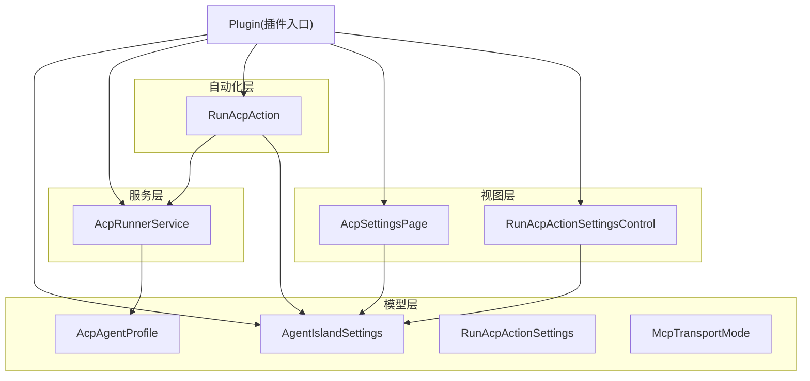
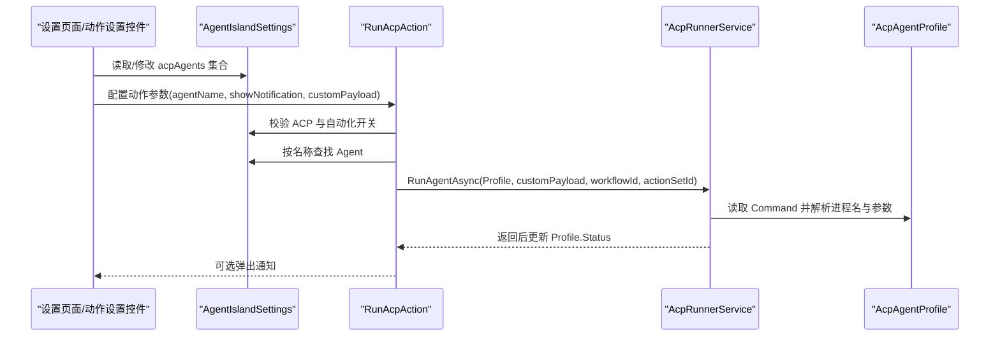
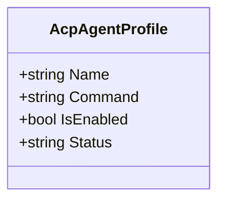
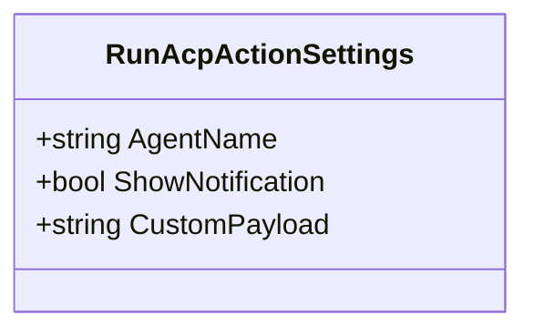
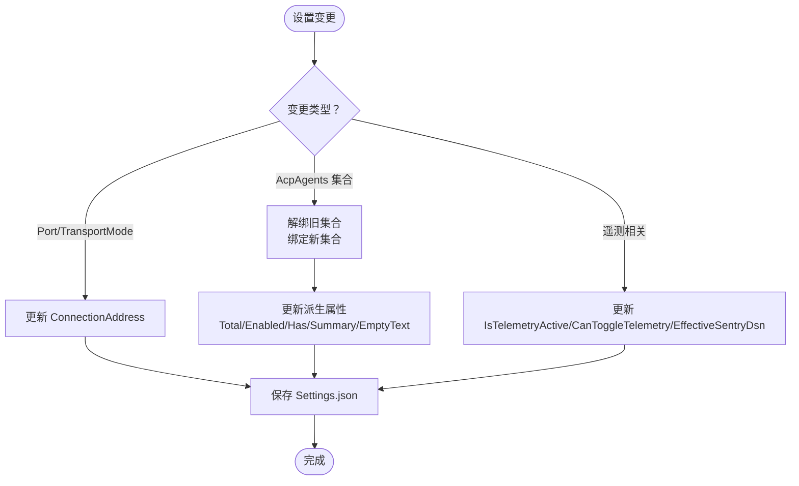
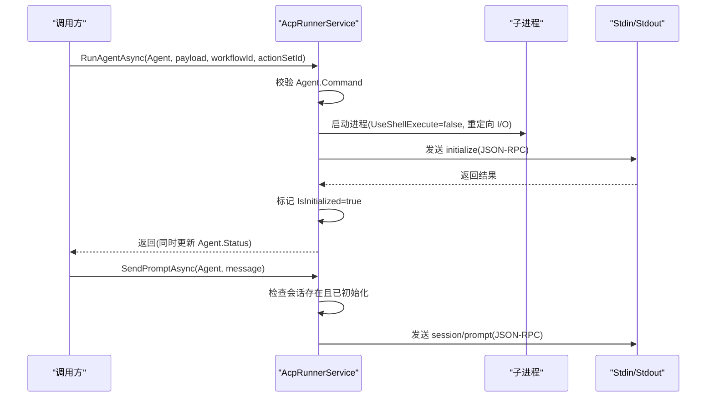
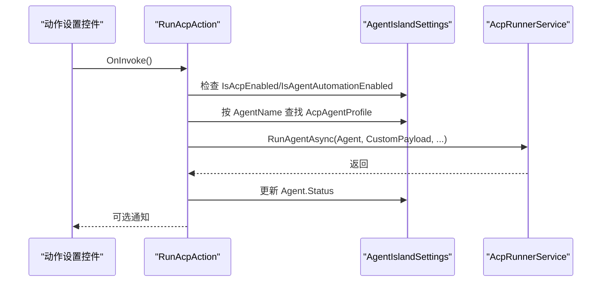
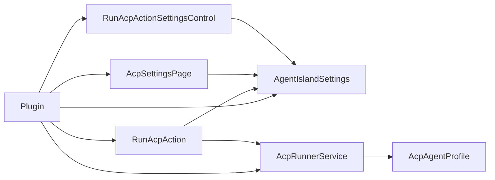

# Agent 配置管理

<cite>
**本文引用的文件**   
- [AcpAgentProfile.cs](file://Models/AcpAgentProfile.cs)
- [RunAcpActionSettings.cs](file://Models/RunAcpActionSettings.cs)
- [AgentIslandSettings.cs](file://Models/AgentIslandSettings.cs)
- [McpTransportMode.cs](file://Models/McpTransportMode.cs)
- [AcpRunnerService.cs](file://Services/AcpRunnerService.cs)
- [RunAcpAction.cs](file://Automation/RunAcpAction.cs)
- [AcpSettingsPage.axaml.cs](file://Views/SettingsPages/AcpSettingsPage.axaml.cs)
- [RunAcpActionSettingsControl.axaml.cs](file://Views/ActionSettings/RunAcpActionSettingsControl.axaml.cs)
- [Plugin.cs](file://Plugin.cs)
</cite>

## 目录
1. [简介](#简介)
2. [项目结构](#项目结构)
3. [核心组件](#核心组件)
4. [架构总览](#架构总览)
5. [详细组件分析](#详细组件分析)
6. [依赖关系分析](#依赖关系分析)
7. [性能与可扩展性](#性能与可扩展性)
8. [故障排查指南](#故障排查指南)
9. [结论](#结论)
10. [附录：配置示例与迁移建议](#附录配置示例与迁移建议)

## 简介
本文件面向 ACP Agent 配置管理系统的数据模型与运行期行为，聚焦以下目标：
- 深入说明 AcpAgentProfile 类的结构与配置项（名称、命令、启用状态、状态文本等）
- 文档化 RunAcpActionSettings 的动作配置模型与执行参数
- 解释多 Agent 管理的架构设计（注册、状态监控、动态启停）
- 给出配置验证规则、安全考虑与错误处理策略
- 提供配置示例与集成指南
- 记录热重载支持、版本兼容性与迁移方案

## 项目结构
与 Agent 配置管理直接相关的代码主要分布在 Models、Services、Automation 与 Views 四个层次：
- Models：数据模型与设置聚合类
- Services：运行时服务（进程启动、会话管理、JSON-RPC 通信）
- Automation：自动化动作入口（触发运行 ACP Agent）
- Views：设置页面与动作设置控件（UI 绑定与交互）

图表来源
- [Plugin.cs:29-53](file://Plugin.cs#L29-L53)
- [AgentIslandSettings.cs:13-143](file://Models/AgentIslandSettings.cs#L13-L143)
- [AcpAgentProfile.cs:9-43](file://Models/AcpAgentProfile.cs#L9-L43)
- [RunAcpActionSettings.cs:9-35](file://Models/RunAcpActionSettings.cs#L9-L35)
- [AcpRunnerService.cs:14-77](file://Services/AcpRunnerService.cs#L14-L77)
- [RunAcpAction.cs:16-83](file://Automation/RunAcpAction.cs#L16-L83)
- [AcpSettingsPage.axaml.cs:18-66](file://Views/SettingsPages/AcpSettingsPage.axaml.cs#L18-L66)
- [RunAcpActionSettingsControl.axaml.cs:8-36](file://Views/ActionSettings/RunAcpActionSettingsControl.axaml.cs#L8-L36)

章节来源
- [Plugin.cs:29-53](file://Plugin.cs#L29-L53)
- [AgentIslandSettings.cs:13-143](file://Models/AgentIslandSettings.cs#L13-L143)

## 核心组件
本节概述关键数据模型及其职责。

- AcpAgentProfile：单个 ACP Agent 的配置与运行时状态
  - 字段：名称、启动命令、是否启用、状态文本
  - 用途：描述一个可被外部进程实现的 ACP Agent，并通过 stdio JSON-RPC 进行初始化与对话
- RunAcpActionSettings：自动化动作“运行 ACP”的参数
  - 字段：目标 Agent 名称、是否显示通知、自定义负载（payload）
  - 用途：在自动化流程中指定要运行的 Agent 及行为
- AgentIslandSettings：插件全局设置与集合容器
  - 包含：ACP 开关、Agent 列表、MCP 端口与传输模式、遥测开关等
  - 特性：对集合变更与属性变更进行响应式联动，派生属性自动更新
- McpTransportMode：MCP 服务器传输模式枚举（StreamableHttp、Sse）
- AcpRunnerService：负责启动 Agent 进程、建立会话、发送 JSON-RPC 消息、清理资源

章节来源
- [AcpAgentProfile.cs:9-43](file://Models/AcpAgentProfile.cs#L9-L43)
- [RunAcpActionSettings.cs:9-35](file://Models/RunAcpActionSettings.cs#L9-L35)
- [AgentIslandSettings.cs:13-232](file://Models/AgentIslandSettings.cs#L13-L232)
- [McpTransportMode.cs:6-17](file://Models/McpTransportMode.cs#L6-L17)
- [AcpRunnerService.cs:14-77](file://Services/AcpRunnerService.cs#L14-L77)

## 架构总览
下图展示了从 UI 到自动化动作再到运行服务的调用链，以及数据模型的关联关系。

图表来源
- [AcpSettingsPage.axaml.cs:31-48](file://Views/SettingsPages/AcpSettingsPage.axaml.cs#L31-L48)
- [RunAcpActionSettingsControl.axaml.cs:22-35](file://Views/ActionSettings/RunAcpActionSettingsControl.axaml.cs#L22-L35)
- [RunAcpAction.cs:29-82](file://Automation/RunAcpAction.cs#L29-L82)
- [AcpRunnerService.cs:25-77](file://Services/AcpRunnerService.cs#L25-L77)
- [AcpAgentProfile.cs:16-42](file://Models/AcpAgentProfile.cs#L16-L42)

## 详细组件分析

### AcpAgentProfile 数据模型
- 字段与语义
  - Name：Agent 唯一标识名（用于 UI 展示与动作选择）
  - Command：启动命令字符串（空格分隔，首段为可执行文件名，后续为参数）
  - IsEnabled：是否允许被自动化或手动启动
  - Status：运行时状态文本（如“未连接”、“已连接：HH:mm:ss”、“上次运行：HH:mm:ss”）
- 序列化
  - 使用 System.Text.Json 的 JsonPropertyName 映射到驼峰命名
- 典型用法
  - 在设置页新增/删除 Agent
  - 在自动化动作中根据 Name 匹配具体 Agent
  - 在服务层通过 Command 启动子进程并维护会话

图表来源
- [AcpAgentProfile.cs:9-43](file://Models/AcpAgentProfile.cs#L9-L43)

章节来源
- [AcpAgentProfile.cs:9-43](file://Models/AcpAgentProfile.cs#L9-L43)

### RunAcpActionSettings 动作配置模型
- 字段与语义
  - AgentName：目标 Agent 的名称（需与 AcpAgentProfile.Name 一致）
  - ShowNotification：是否在执行完成后显示系统通知
  - CustomPayload：传递给 Agent 的自定义负载（当前由动作传入运行器，但运行器尚未消费该字段）
- 典型用法
  - 在动作设置控件中下拉选择已有 Agent 名称
  - 控制是否显示通知
  - 将 payload 透传给运行器以便未来扩展

图表来源
- [RunAcpActionSettings.cs:9-35](file://Models/RunAcpActionSettings.cs#L9-L35)

章节来源
- [RunAcpActionSettings.cs:9-35](file://Models/RunAcpActionSettings.cs#L9-L35)

### AgentIslandSettings 设置聚合与多 Agent 管理
- 关键属性
  - Port：MCP 监听端口
  - TransportMode：MCP 传输模式（StreamableHttp/Sse）
  - IsAcpEnabled：是否启用 ACP 面板能力
  - IsAgentAutomationEnabled：是否启用基于 Agent 的自动化
  - AutoStartAgentsWithClassIsland：是否在宿主应用启动时自动启动 Agent（预留）
  - ShowAutomationNotifications：是否显示自动化提示
  - AcpAgents：ObservableCollection<AcpAgentProfile>，多 Agent 集合
  - ConnectionAddress：只读属性，根据 Port 与 TransportMode 生成 http://localhost:{Port}/{mcp|sse}
  - TotalAgentCount / EnabledAgentCount / HasAcpAgents / AcpAgentSummary / AcpAgentEmptyStateText：派生属性，随集合变化自动更新
- 集合与属性变更联动
  - 对 AcpAgents 集合添加/移除元素时，订阅/取消订阅每个元素的 PropertyChanged，并触发派生属性更新
  - 当 Port 或 TransportMode 变化时，ConnectionAddress 随之更新
  - 遥测相关属性联动（IsTelemetryEnabled、HasAgreedToPrivacyPolicy、CustomSentryDsn）
- 生命周期与持久化
  - 插件初始化时加载 Settings.json，并在任意属性变更时写回磁盘，实现热重载效果

图表来源
- [AgentIslandSettings.cs:240-273](file://Models/AgentIslandSettings.cs#L240-L273)
- [AgentIslandSettings.cs:275-338](file://Models/AgentIslandSettings.cs#L275-L338)
- [AgentIslandSettings.cs:204-238](file://Models/AgentIslandSettings.cs#L204-L238)
- [Plugin.cs:31-34](file://Plugin.cs#L31-L34)

章节来源
- [AgentIslandSettings.cs:13-238](file://Models/AgentIslandSettings.cs#L13-L238)
- [AgentIslandSettings.cs:240-338](file://Models/AgentIslandSettings.cs#L240-L338)
- [Plugin.cs:31-34](file://Plugin.cs#L31-L34)

### AcpRunnerService 运行期服务
- 职责
  - 启动 Agent 进程（解析 Command），创建会话并维护进程句柄
  - 通过标准输入输出发送 JSON-RPC 消息（initialize、session/prompt）
  - 在 Dispose 时优雅关闭所有会话（先关闭 stdin，等待退出，必要时强制终止）
- 关键流程
  - RunAgentAsync：校验命令、启动进程、初始化会话、更新 Agent 状态
  - SendPromptAsync：向已初始化的会话发送 prompt
  - 内部 AcpAgentSession：封装 Agent、Process、SessionId、IsInitialized
- 错误处理
  - 未配置命令或命令无效抛出异常
  - 未初始化即发送 prompt 抛出异常
  - 停止会话时捕获异常并记录日志

图表来源
- [AcpRunnerService.cs:25-77](file://Services/AcpRunnerService.cs#L25-L77)
- [AcpRunnerService.cs:79-100](file://Services/AcpRunnerService.cs#L79-L100)
- [AcpRunnerService.cs:102-131](file://Services/AcpRunnerService.cs#L102-L131)
- [AcpRunnerService.cs:156-191](file://Services/AcpRunnerService.cs#L156-L191)

章节来源
- [AcpRunnerService.cs:14-206](file://Services/AcpRunnerService.cs#L14-L206)

### 自动化动作 RunAcpAction
- 职责
  - 作为 ClassIsland 自动化框架中的动作，接收 RunAcpActionSettings
  - 校验全局开关（ACP 功能、Agent 自动化）
  - 根据 AgentName 在 Settings.AcpAgents 中查找目标 Agent
  - 调用 AcpRunnerService.RunAgentAsync 启动 Agent
  - 更新 Agent.Status 并可弹出通知
- 错误处理
  - 功能未启用或未找到 Agent 时抛出异常，避免误操作

图表来源
- [RunAcpAction.cs:29-82](file://Automation/RunAcpAction.cs#L29-L82)
- [RunAcpActionSettingsControl.axaml.cs:22-35](file://Views/ActionSettings/RunAcpActionSettingsControl.axaml.cs#L22-L35)

章节来源
- [RunAcpAction.cs:16-83](file://Automation/RunAcpAction.cs#L16-L83)
- [RunAcpActionSettingsControl.axaml.cs:8-36](file://Views/ActionSettings/RunAcpActionSettingsControl.axaml.cs#L8-L36)

### 设置页面与动作设置控件
- AcpSettingsPage
  - 提供“添加/删除 Agent”、“全部启用/禁用”等操作
  - 通过 Plugin.Settings 直接读写 AcpAgents 集合
- RunAcpActionSettingsControl
  - 暴露 AgentNames 供下拉选择
  - 根据是否有可用 Agent 切换空状态文案
  - 默认选中首个 Agent 名称

章节来源
- [AcpSettingsPage.axaml.cs:31-64](file://Views/SettingsPages/AcpSettingsPage.axaml.cs#L31-L64)
- [RunAcpActionSettingsControl.axaml.cs:15-35](file://Views/ActionSettings/RunAcpActionSettingsControl.axaml.cs#L15-L35)

## 依赖关系分析
- 插件入口 Plugin
  - 加载 Settings.json 并监听属性变更以持久化
  - 注入 AcpRunnerService、通知提供者、设置页面、自动化动作
- 模型层
  - AgentIslandSettings 持有 AcpAgentProfile 集合，并提供派生属性
  - RunAcpActionSettings 独立于运行时，仅承载动作参数
- 服务层
  - AcpRunnerService 依赖 AcpAgentProfile 的 Command 字段启动进程
- 自动化层
  - RunAcpAction 依赖 AgentIslandSettings 与 AcpRunnerService
- 视图层
  - 设置页面与动作设置控件均绑定到 Plugin.Settings

图表来源
- [Plugin.cs:29-53](file://Plugin.cs#L29-L53)
- [RunAcpAction.cs:29-82](file://Automation/RunAcpAction.cs#L29-L82)
- [AcpRunnerService.cs:25-77](file://Services/AcpRunnerService.cs#L25-L77)
- [AcpSettingsPage.axaml.cs:31-48](file://Views/SettingsPages/AcpSettingsPage.axaml.cs#L31-L48)
- [RunAcpActionSettingsControl.axaml.cs:22-35](file://Views/ActionSettings/RunAcpActionSettingsControl.axaml.cs#L22-L35)

章节来源
- [Plugin.cs:29-53](file://Plugin.cs#L29-L53)

## 性能与可扩展性
- 进程管理
  - 每个 Agent 对应一个子进程，注意进程数量增长带来的资源占用
  - 建议在大规模部署场景下增加进程池或复用机制（当前实现为每运行一次新建进程）
- JSON-RPC 通信
  - 使用标准输入输出行协议，简单可靠；在高并发场景下需关注序列化/反序列化开销
- 配置持久化
  - 每次属性变更都会写盘，频繁批量修改可能带来 I/O 压力；可在 UI 层合并提交或使用事务式保存
- 可扩展点
  - CustomPayload 目前未被运行器消费，可作为未来扩展点（例如传递工作流上下文、认证令牌等）
  - 可增加 Agent 健康检查与自动重启逻辑

[本节为通用指导，不直接分析具体文件]

## 故障排查指南
- 常见错误与定位
  - “未配置启动命令”或“启动命令无效”：检查 AcpAgentProfile.Command 是否为空或无法解析
  - “未初始化”：确认 InitializeAcpSessionAsync 成功收到 initialize 响应后再发送 prompt
  - MCP 启动失败：查看 Plugin.OnAppStarted 中的异常日志与遥测上报
- 日志与遥测
  - 使用 ILogger 记录关键步骤（启动、发送消息、停止会话）
  - SentryTelemetryService 提供 Breadcrumb 与异常上报，便于问题追踪
- 资源释放
  - 确保在应用停止时调用 AcpRunnerService.Dispose，避免僵尸进程

章节来源
- [AcpRunnerService.cs:35-48](file://Services/AcpRunnerService.cs#L35-L48)
- [AcpRunnerService.cs:112-116](file://Services/AcpRunnerService.cs#L112-L116)
- [AcpRunnerService.cs:156-191](file://Services/AcpRunnerService.cs#L156-L191)
- [Plugin.cs:67-78](file://Plugin.cs#L67-L78)

## 结论
本系统通过清晰的数据模型与分层架构实现了 ACP Agent 的配置管理与运行期控制：
- 数据模型简洁明确，易于扩展
- 多 Agent 管理通过集合与派生属性实现响应式 UI 与统计
- 自动化动作与服务层解耦良好，具备较好的可测试性与可维护性
- 当前实现已覆盖基本生命周期与错误处理，后续可在健壮性与性能方面继续优化

[本节为总结，不直接分析具体文件]

## 附录：配置示例与迁移建议

### 配置示例（Settings.json 片段）
以下为符合当前数据模型的配置示例（键名为驼峰格式，值类型与字段一一对应）：
- 全局设置
  - port：整数，MCP 监听端口
  - transportMode：枚举，值为 StreamableHttp 或 Sse
  - isAcpEnabled：布尔，是否启用 ACP 面板能力
  - isAgentAutomationEnabled：布尔，是否启用基于 Agent 的自动化
  - showAutomationNotifications：布尔，是否显示自动化提示
  - aiTextEntries：数组，AI 文字条目（与本主题无关，略）
  - acpAgents：数组，ACP Agent 列表
- 单个 AcpAgentProfile
  - name：字符串，Agent 名称
  - command：字符串，启动命令（空格分隔）
  - isEnabled：布尔，是否启用
  - status：字符串，运行时状态（由系统更新）
- 动作设置 RunAcpActionSettings
  - agentName：字符串，目标 Agent 名称
  - showNotification：布尔，是否显示通知
  - customPayload：字符串，自定义负载（当前未使用）

注意：以上为字段说明与示例结构，不包含实际代码内容。

章节来源
- [AgentIslandSettings.cs:37-102](file://Models/AgentIslandSettings.cs#L37-L102)
- [AcpAgentProfile.cs:16-42](file://Models/AcpAgentProfile.cs#L16-L42)
- [RunAcpActionSettings.cs:15-34](file://Models/RunAcpActionSettings.cs#L15-L34)

### 配置验证规则
- 必填项
  - AcpAgentProfile.Command 非空且至少包含可执行文件名
  - RunAcpActionSettings.AgentName 必须存在于 AcpAgents 列表中
- 范围与格式
  - AgentIslandSettings.Port 应为有效端口号（建议 1-65535）
  - McpTransportMode 仅接受 StreamableHttp 或 Sse
- 业务约束
  - 若 IsAcpEnabled 或 IsAgentAutomationEnabled 为 false，则拒绝执行自动化动作
  - 目标 Agent 的 IsEnabled 必须为 true

章节来源
- [AcpRunnerService.cs:35-48](file://Services/AcpRunnerService.cs#L35-L48)
- [RunAcpAction.cs:35-60](file://Automation/RunAcpAction.cs#L35-L60)
- [McpTransportMode.cs:6-17](file://Models/McpTransportMode.cs#L6-L17)

### 安全考虑
- 命令注入防护
  - Command 由用户配置，建议限制可执行路径白名单或对参数进行严格校验
- 权限最小化
  - 子进程应以最小权限运行，避免提升权限
- 敏感信息
  - 如需传递认证令牌，建议使用环境变量或受保护的存储，而非明文写入配置

[本节为通用指导，不直接分析具体文件]

### 错误处理策略
- 启动前校验
  - 校验命令有效性、目标 Agent 是否存在且启用
- 运行期异常
  - 未初始化即发送消息时抛出异常
  - 进程启动失败或 JSON-RPC 通信异常时记录日志并上报遥测
- 资源清理
  - 应用停止时统一关闭会话，必要时强制终止进程

章节来源
- [AcpRunnerService.cs:112-116](file://Services/AcpRunnerService.cs#L112-L116)
- [AcpRunnerService.cs:156-191](file://Services/AcpRunnerService.cs#L156-L191)
- [Plugin.cs:67-78](file://Plugin.cs#L67-L78)

### 热重载支持
- 机制
  - 插件初始化时加载 Settings.json，并在任意属性变更时写回磁盘
  - 由于使用 ObservableObject 与集合事件，UI 可实时反映配置变化
- 注意事项
  - 频繁写盘可能影响性能，建议在 UI 层合并提交或使用批处理保存

章节来源
- [Plugin.cs:31-34](file://Plugin.cs#L31-L34)
- [AgentIslandSettings.cs:240-273](file://Models/AgentIslandSettings.cs#L240-L273)

### 版本兼容性与迁移方案
- 向后兼容
  - 使用 JsonPropertyName 显式映射字段名，保证 JSON 结构稳定
  - 新增字段时应提供默认值，避免旧配置加载失败
- 迁移建议
  - 若需要废弃字段，保留字段并忽略其值，或在升级脚本中进行转换
  - 对于枚举值变更，应在加载时做映射或降级处理

章节来源
- [AcpAgentProfile.cs:16-42](file://Models/AcpAgentProfile.cs#L16-L42)
- [RunAcpActionSettings.cs:15-34](file://Models/RunAcpActionSettings.cs#L15-L34)
- [AgentIslandSettings.cs:37-102](file://Models/AgentIslandSettings.cs#L37-L102)