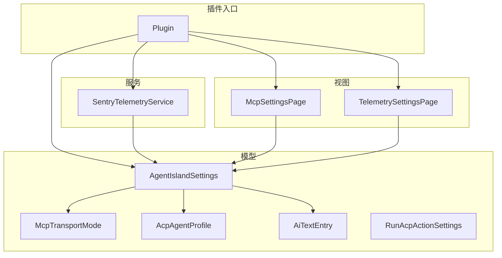
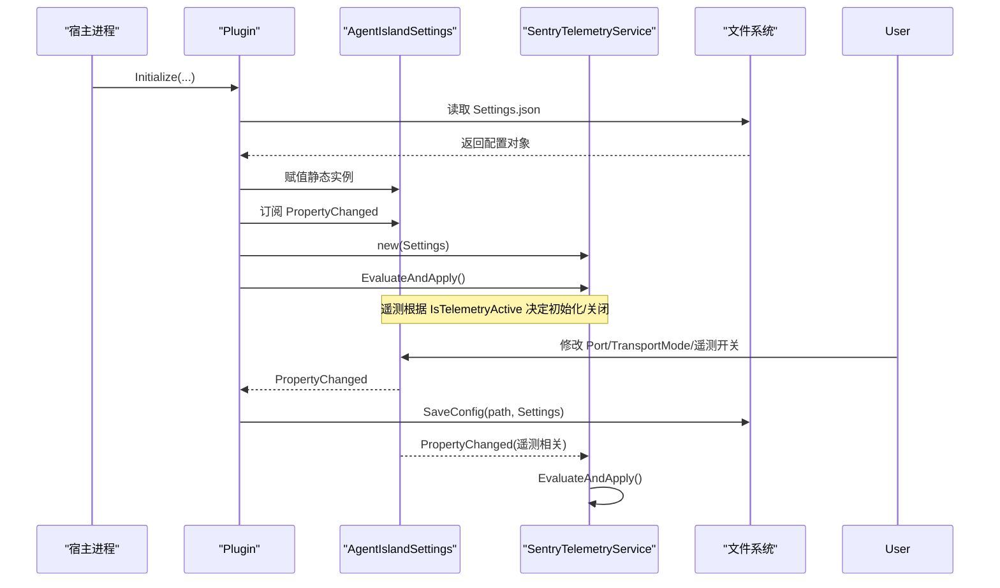
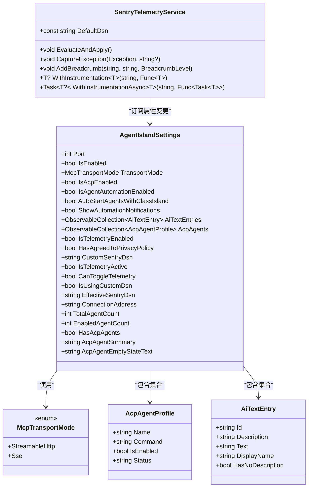
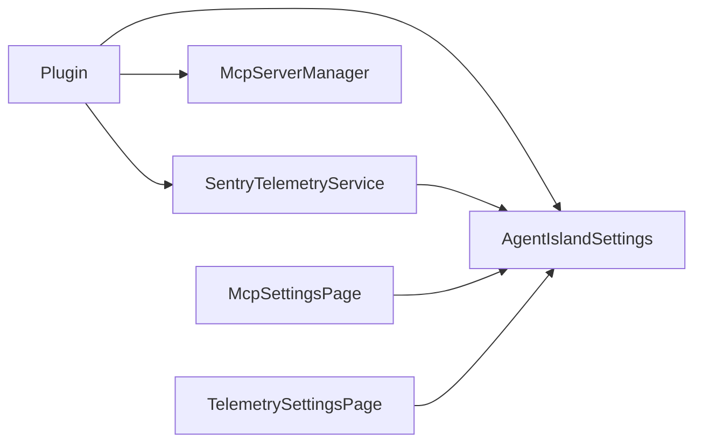

# 全局配置

<cite>
**本文引用的文件**   
- [AgentIslandSettings.cs](file://Models/AgentIslandSettings.cs)
- [McpTransportMode.cs](file://Models/McpTransportMode.cs)
- [AcpAgentProfile.cs](file://Models/AcpAgentProfile.cs)
- [AiTextEntry.cs](file://Models/AiTextEntry.cs)
- [RunAcpActionSettings.cs](file://Models/RunAcpActionSettings.cs)
- [SentryTelemetryService.cs](file://Services/SentryTelemetryService.cs)
- [Plugin.cs](file://Plugin.cs)
- [McpSettingsPage.axaml.cs](file://Views/SettingsPages/McpSettingsPage.axaml.cs)
- [TelemetrySettingsPage.axaml.cs](file://Views/SettingsPages/TelemetrySettingsPage.axaml.cs)
</cite>

## 目录
1. [简介](#简介)
2. [项目结构](#项目结构)
3. [核心组件](#核心组件)
4. [架构总览](#架构总览)
5. [详细组件分析](#详细组件分析)
6. [依赖关系分析](#依赖关系分析)
7. [性能考虑](#性能考虑)
8. [故障排查指南](#故障排查指南)
9. [结论](#结论)
10. [附录](#附录)

## 简介
本文件为 AgentIsland 插件的全局配置系统数据模型文档，重点围绕 AgentIslandSettings 类展开，涵盖 MCP 服务器配置（端口、传输模式）、ACP 自动化设置、遥测数据收集配置等关键属性；详细说明属性变更通知机制（OnPropertyChanged 重写与依赖属性的自动更新）；解释 McpTransportMode 枚举的作用与不同传输模式的特点；记录配置验证规则、默认值设置与业务逻辑约束；提供 JSON 序列化示例与配置文件结构图；并总结配置持久化策略、性能优化考虑与数据迁移方案。

## 项目结构
与全局配置相关的关键代码位于 Models、Services、Views 与根级 Plugin 入口中：
- 数据模型：AgentIslandSettings、McpTransportMode、AcpAgentProfile、AiTextEntry、RunAcpActionSettings
- 服务层：SentryTelemetryService（遥测生命周期管理）
- 视图层：McpSettingsPage、TelemetrySettingsPage（设置页面交互）
- 插件入口：Plugin（加载/保存配置、启动 MCP 服务器、注册遥测服务）

图表来源
- [Plugin.cs:27-53](file://Plugin.cs#L27-L53)
- [AgentIslandSettings.cs:13-232](file://Models/AgentIslandSettings.cs#L13-L232)
- [McpTransportMode.cs:6-17](file://Models/McpTransportMode.cs#L6-L17)
- [SentryTelemetryService.cs:11-40](file://Services/SentryTelemetryService.cs#L11-L40)
- [McpSettingsPage.axaml.cs:26-41](file://Views/SettingsPages/McpSettingsPage.axaml.cs#L26-L41)
- [TelemetrySettingsPage.axaml.cs:27-42](file://Views/SettingsPages/TelemetrySettingsPage.axaml.cs#L27-L42)

章节来源
- [Plugin.cs:27-53](file://Plugin.cs#L27-L53)
- [AgentIslandSettings.cs:13-232](file://Models/AgentIslandSettings.cs#L13-L232)
- [McpTransportMode.cs:6-17](file://Models/McpTransportMode.cs#L6-L17)
- [SentryTelemetryService.cs:11-40](file://Services/SentryTelemetryService.cs#L11-L40)
- [McpSettingsPage.axaml.cs:26-41](file://Views/SettingsPages/McpSettingsPage.axaml.cs#L26-L41)
- [TelemetrySettingsPage.axaml.cs:27-42](file://Views/SettingsPages/TelemetrySettingsPage.axaml.cs#L27-L42)

## 核心组件
- AgentIslandSettings：全局配置对象，承载 MCP 服务器、ACP 自动化、遥测等所有可配置项，并提供派生属性与集合监听。
- McpTransportMode：定义 MCP 传输模式（StreamableHttp、Sse）。
- AcpAgentProfile：单个 ACP Agent 的配置条目。
- AiTextEntry：AI 文字条目配置项。
- RunAcpActionSettings：“运行 ACP”动作的独立设置。
- SentryTelemetryService：根据配置动态初始化/关闭遥测 SDK，并暴露捕获异常、添加面包屑、包裹操作等方法。

章节来源
- [AgentIslandSettings.cs:13-232](file://Models/AgentIslandSettings.cs#L13-L232)
- [McpTransportMode.cs:6-17](file://Models/McpTransportMode.cs#L6-L17)
- [AcpAgentProfile.cs:9-43](file://Models/AcpAgentProfile.cs#L9-L43)
- [AiTextEntry.cs:5-30](file://Models/AiTextEntry.cs#L5-L30)
- [RunAcpActionSettings.cs:9-35](file://Models/RunAcpActionSettings.cs#L9-L35)
- [SentryTelemetryService.cs:11-122](file://Services/SentryTelemetryService.cs#L11-L122)

## 架构总览
全局配置在插件初始化时从磁盘加载，并在任意属性变更时自动持久化。遥测服务订阅配置变更，按需初始化或关闭 Sentry SDK。设置页面通过绑定到配置对象，实现 UI 与配置的实时同步。

图表来源
- [Plugin.cs:27-53](file://Plugin.cs#L27-L53)
- [AgentIslandSettings.cs:240-273](file://Models/AgentIslandSettings.cs#L240-L273)
- [SentryTelemetryService.cs:21-40](file://Services/SentryTelemetryService.cs#L21-L40)

## 详细组件分析

### AgentIslandSettings 数据模型
- 职责
  - 集中管理 MCP 服务器、ACP 自动化、遥测等配置项。
  - 维护派生属性（如连接地址、遥测状态、计数摘要等），并在底层属性变化时自动更新。
  - 对集合属性进行变更监听，联动更新派生属性。

- 关键属性与默认值
  - Port：MCP 服务器监听端口，默认 5943。
  - IsEnabled：是否启用 MCP 服务器，默认 true。
  - TransportMode：MCP 传输模式，默认 StreamableHttp。
  - IsAcpEnabled：是否启用 ACP 面板能力，默认 true。
  - IsAgentAutomationEnabled：是否启用基于 Agent 的自动化，默认 true。
  - AutoStartAgentsWithClassIsland：是否在 ClassIsland 启动时自动启动 Agent。
  - ShowAutomationNotifications：是否显示自动化提示，默认 true。
  - AiTextEntries：AI 文字条目集合，默认空集合。
  - AcpAgents：ACP Agent 列表，默认空集合。
  - IsTelemetryEnabled：是否启用遥测，默认 true。
  - HasAgreedToPrivacyPolicy：是否同意隐私协议与跨境数据传输协议。
  - CustomSentryDsn：用户自定义 Sentry DSN，留空则使用默认。

- 派生属性与计算逻辑
  - ConnectionAddress：根据 Port 与 TransportMode 生成 http://localhost:{Port}/{mcp|sse}。
  - TotalAgentCount / EnabledAgentCount / HasAcpAgents / AcpAgentSummary / AcpAgentEmptyStateText：基于 AcpAgents 集合的统计与文案。
  - IsTelemetryActive：当 IsTelemetryEnabled 且（HasAgreedToPrivacyPolicy 或使用了自定义 DSN）时为真。
  - CanToggleTelemetry：当已同意协议或使用自定义 DSN 时允许切换遥测开关。
  - IsUsingCustomDsn：是否正在使用自定义 DSN。
  - EffectiveSentryDsn：优先使用自定义 DSN，否则回退到 SentryTelemetryService.DefaultDsn。

- 属性变更通知机制
  - 继承自 ObservableObject，使用 SetProperty 触发 OnPropertyChanged。
  - 重写 OnPropertyChanged，针对特定属性变更广播关联派生属性：
    - Port/TransportMode 变化 → 更新 ConnectionAddress。
    - IsTelemetryEnabled/HasAgreedToPrivacyPolicy/CustomSentryDsn 变化 → 更新 IsTelemetryActive。
    - HasAgreedToPrivacyPolicy/CustomSentryDsn 变化 → 更新 CanToggleTelemetry，并在满足条件时自动开启遥测。
    - CustomSentryDsn 变化 → 更新 EffectiveSentryDsn 与 IsUsingCustomDsn。
  - 集合监听：
    - AcpAgents 与 AiTextEntries 在 setter 中解绑旧集合、绑定新集合，并在集合元素属性变化时触发相应派生属性更新。

- 业务逻辑约束
  - 遥测开关可用性受隐私协议与自定义 DSN 控制。
  - 当用户同意协议或输入有效自定义 DSN 后，若遥测未开启则自动开启。
  - 连接地址由端口与传输模式共同决定，无需手动校验。

章节来源
- [AgentIslandSettings.cs:13-232](file://Models/AgentIslandSettings.cs#L13-L232)
- [AgentIslandSettings.cs:240-273](file://Models/AgentIslandSettings.cs#L240-L273)
- [AgentIslandSettings.cs:275-338](file://Models/AgentIslandSettings.cs#L275-L338)
- [AgentIslandSettings.cs:340-392](file://Models/AgentIslandSettings.cs#L340-L392)

#### 类图（AgentIslandSettings 及其依赖）

图表来源
- [AgentIslandSettings.cs:13-232](file://Models/AgentIslandSettings.cs#L13-L232)
- [McpTransportMode.cs:6-17](file://Models/McpTransportMode.cs#L6-L17)
- [AcpAgentProfile.cs:9-43](file://Models/AcpAgentProfile.cs#L9-L43)
- [AiTextEntry.cs:5-30](file://Models/AiTextEntry.cs#L5-L30)
- [SentryTelemetryService.cs:11-122](file://Services/SentryTelemetryService.cs#L11-L122)

### McpTransportMode 枚举
- 作用：指定 MCP 服务器的传输协议类型。
- 取值与特点
  - StreamableHttp：现代传输协议，作为默认模式。
  - Sse：Server-Sent Events，兼容旧版客户端。
- 影响范围
  - 影响 ConnectionAddress 的路径段（mcp 或 sse）。
  - 影响 MCP 服务器启动时的端点选择。

章节来源
- [McpTransportMode.cs:6-17](file://Models/McpTransportMode.cs#L6-L17)
- [AgentIslandSettings.cs:204-211](file://Models/AgentIslandSettings.cs#L204-L211)
- [Plugin.cs:69-72](file://Plugin.cs#L69-L72)

### AcpAgentProfile 与 AiTextEntry
- AcpAgentProfile：表示单个 ACP Agent 的基本配置（名称、命令、启用状态、状态文本）。
- AiTextEntry：表示 AI 文字条目的标识、描述与内容，并提供 DisplayName 与 HasNoDescription 派生属性。

章节来源
- [AcpAgentProfile.cs:9-43](file://Models/AcpAgentProfile.cs#L9-L43)
- [AiTextEntry.cs:5-30](file://Models/AiTextEntry.cs#L5-L30)

### RunAcpActionSettings
- 用于“运行 ACP”自动化动作的设置，包括目标 Agent 名称、是否显示通知、自定义负载等。

章节来源
- [RunAcpActionSettings.cs:9-35](file://Models/RunAcpActionSettings.cs#L9-L35)

### 遥测服务 SentryTelemetryService
- 职责
  - 根据 AgentIslandSettings 的遥测相关属性动态初始化或关闭 Sentry SDK。
  - 提供统一的异常捕获、面包屑记录与带监控的操作包装方法。
- 关键行为
  - EvaluateAndApply：根据 IsTelemetryActive 决定是否初始化/关闭。
  - OnSettingsPropertyChanged：监听遥测相关属性变化，必要时先关闭再重新初始化。
  - DefaultDsn：内置默认 DSN，供 EffectiveSentryDsn 回退使用。

章节来源
- [SentryTelemetryService.cs:11-122](file://Services/SentryTelemetryService.cs#L11-L122)
- [SentryTelemetryService.cs:77-90](file://Services/SentryTelemetryService.cs#L77-L90)

### 设置页面与配置交互
- McpSettingsPage：监听 IsEnabled、Port、TransportMode 变化，请求重启以应用更改。
- TelemetrySettingsPage：处理隐私协议同意/撤回、测试遥测、展示横幅与按钮状态。

章节来源
- [McpSettingsPage.axaml.cs:26-41](file://Views/SettingsPages/McpSettingsPage.axaml.cs#L26-L41)
- [TelemetrySettingsPage.axaml.cs:27-42](file://Views/SettingsPages/TelemetrySettingsPage.axaml.cs#L27-L42)
- [TelemetrySettingsPage.axaml.cs:75-124](file://Views/SettingsPages/TelemetrySettingsPage.axaml.cs#L75-L124)

## 依赖关系分析
- 插件入口 Plugin 负责：
  - 从磁盘加载 Settings.json 到 AgentIslandSettings 静态实例。
  - 订阅属性变更并调用 ConfigureFileHelper.SaveConfig 持久化。
  - 创建 SentryTelemetryService 并立即评估应用。
  - 在应用启动时根据配置启动 MCP 服务器。
- 遥测服务依赖 AgentIslandSettings 的遥测相关属性，并在属性变化时调整 SDK 生命周期。
- 设置页面直接绑定到 AgentIslandSettings，驱动 UI 与配置的双向同步。

图表来源
- [Plugin.cs:27-53](file://Plugin.cs#L27-L53)
- [Plugin.cs:55-79](file://Plugin.cs#L55-L79)
- [SentryTelemetryService.cs:21-40](file://Services/SentryTelemetryService.cs#L21-L40)
- [McpSettingsPage.axaml.cs:26-41](file://Views/SettingsPages/McpSettingsPage.axaml.cs#L26-L41)
- [TelemetrySettingsPage.axaml.cs:27-42](file://Views/SettingsPages/TelemetrySettingsPage.axaml.cs#L27-L42)

章节来源
- [Plugin.cs:27-53](file://Plugin.cs#L27-L53)
- [Plugin.cs:55-79](file://Plugin.cs#L55-L79)
- [SentryTelemetryService.cs:21-40](file://Services/SentryTelemetryService.cs#L21-L40)
- [McpSettingsPage.axaml.cs:26-41](file://Views/SettingsPages/McpSettingsPage.axaml.cs#L26-L41)
- [TelemetrySettingsPage.axaml.cs:27-42](file://Views/SettingsPages/TelemetrySettingsPage.axaml.cs#L27-L42)

## 性能考虑
- 属性变更批量持久化：每次属性变更都会触发保存，建议在高并发写入场景下考虑节流或合并保存策略，避免频繁 I/O。
- 遥测 SDK 生命周期：仅在需要时初始化/关闭，避免不必要的资源占用。
- 集合监听：对 AcpAgents 与 AiTextEntries 的元素变更进行细粒度监听，注意在大量条目时减少不必要的派生属性重算。
- 连接地址计算：ConnectionAddress 为只读派生属性，计算开销极低，但应避免在高频循环中重复访问。

[本节为通用指导，不直接分析具体文件]

## 故障排查指南
- 遥测无法上报
  - 检查 IsTelemetryEnabled 是否为真。
  - 确认 HasAgreedToPrivacyPolicy 是否为真或是否设置了有效的 CustomSentryDsn。
  - 查看 EffectiveSentryDsn 是否正确（自定义优先，否则回退默认）。
  - 观察 SentryTelemetryService.EvaluateAndApply 是否被调用以及 SDK 是否处于初始化状态。
- MCP 服务器未启动
  - 确认 IsEnabled 为真。
  - 检查 Port 是否可用，TransportMode 是否与客户端期望一致。
  - 查看 ConnectionAddress 生成的路径段（mcp/sse）是否符合预期。
- 设置页面未生效
  - McpSettingsPage 会在 Port/TransportMode/IsEnabled 变化时请求重启，确保重启流程正常执行。
  - TelemetrySettingsPage 会依据隐私协议与自定义 DSN 状态更新 UI，检查对应属性变更事件是否触发。

章节来源
- [AgentIslandSettings.cs:176-200](file://Models/AgentIslandSettings.cs#L176-L200)
- [SentryTelemetryService.cs:30-40](file://Services/SentryTelemetryService.cs#L30-L40)
- [Plugin.cs:69-79](file://Plugin.cs#L69-L79)
- [McpSettingsPage.axaml.cs:33-41](file://Views/SettingsPages/McpSettingsPage.axaml.cs#L33-L41)
- [TelemetrySettingsPage.axaml.cs:44-73](file://Views/SettingsPages/TelemetrySettingsPage.axaml.cs#L44-L73)

## 结论
AgentIslandSettings 作为全局配置的核心，提供了完善的属性变更通知与派生属性自动更新机制，结合 SentryTelemetryService 实现了灵活的遥测生命周期管理。McpTransportMode 枚举简化了传输协议的选择，并通过 ConnectionAddress 与 MCP 服务器启动逻辑形成闭环。整体设计清晰、可扩展性强，适合在复杂插件生态中复用与维护。

[本节为总结性内容，不直接分析具体文件]

## 附录

### 配置验证规则与默认值
- 默认值
  - Port：5943
  - IsEnabled：true
  - TransportMode：StreamableHttp
  - IsAcpEnabled：true
  - IsAgentAutomationEnabled：true
  - ShowAutomationNotifications：true
  - IsTelemetryEnabled：true
  - AcpAgents/AiTextEntries：空集合
- 验证与约束
  - 遥测开关可用性：CanToggleTelemetry 取决于隐私协议同意或自定义 DSN。
  - 自动开启遥测：当 CanToggleTelemetry 为真且 IsTelemetryEnabled 为假时，设置为真。
  - 连接地址：由 Port 与 TransportMode 决定，无需额外校验。
  - 自定义 DSN：为空时使用默认 DSN；非空时跳过隐私协议检查。

章节来源
- [AgentIslandSettings.cs:15-27](file://Models/AgentIslandSettings.cs#L15-L27)
- [AgentIslandSettings.cs:176-200](file://Models/AgentIslandSettings.cs#L176-L200)
- [AgentIslandSettings.cs:240-273](file://Models/AgentIslandSettings.cs#L240-L273)

### JSON 序列化示例与配置文件结构
- 字段命名策略
  - 使用 JsonPropertyName 指定 JSON 键名（如 port、isEnabled、transportMode 等）。
  - 集合元素按各自模型的 JsonPropertyName 序列化。
- 典型结构（示意）
  - port：整数
  - isEnabled：布尔
  - transportMode：枚举值（StreamableHttp 或 Sse）
  - isAcpEnabled：布尔
  - isAgentAutomationEnabled：布尔
  - autoStartAgentsWithClassIsland：布尔
  - showAutomationNotifications：布尔
  - aiTextEntries：数组，每项含 id/description/text
  - acpAgents：数组，每项含 name/command/isEnabled/status
  - isTelemetryEnabled：布尔
  - hasAgreedToPrivacyPolicy：布尔
  - customSentryDsn：字符串
- 说明
  - 实际 JSON 键名以各属性的 JsonPropertyName 为准。
  - 派生属性（如 ConnectionAddress、IsTelemetryActive 等）不参与序列化。

章节来源
- [AgentIslandSettings.cs:37-173](file://Models/AgentIslandSettings.cs#L37-L173)
- [AcpAgentProfile.cs:16-42](file://Models/AcpAgentProfile.cs#L16-L42)
- [AiTextEntry.cs:7-14](file://Models/AiTextEntry.cs#L7-L14)

### 配置持久化策略
- 加载时机：插件初始化时从 Settings.json 加载。
- 保存时机：任何属性变更均触发保存。
- 存储位置：插件配置文件夹下的 Settings.json。
- 错误处理：参考参考实现中的 Load/Save 模式，建议在失败时回退到默认配置并记录日志。

章节来源
- [Plugin.cs:27-35](file://Plugin.cs#L27-L35)

### 数据迁移方案
- 版本兼容
  - 新增字段：保持向后兼容，缺失字段使用默认值。
  - 废弃字段：保留反序列化兼容性，忽略未知字段。
- 迁移步骤
  - 首次启动检测当前配置版本。
  - 执行必要的字段映射或格式转换。
  - 保存新版本配置并记录迁移日志。
- 注意事项
  - 避免破坏现有用户配置。
  - 对敏感字段（如 DSN）提供安全提示与校验。

[本节为通用指导，不直接分析具体文件]