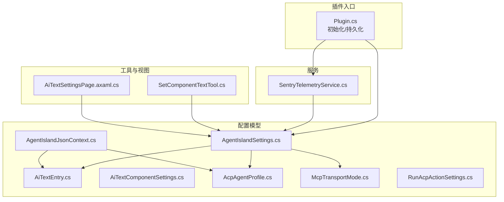
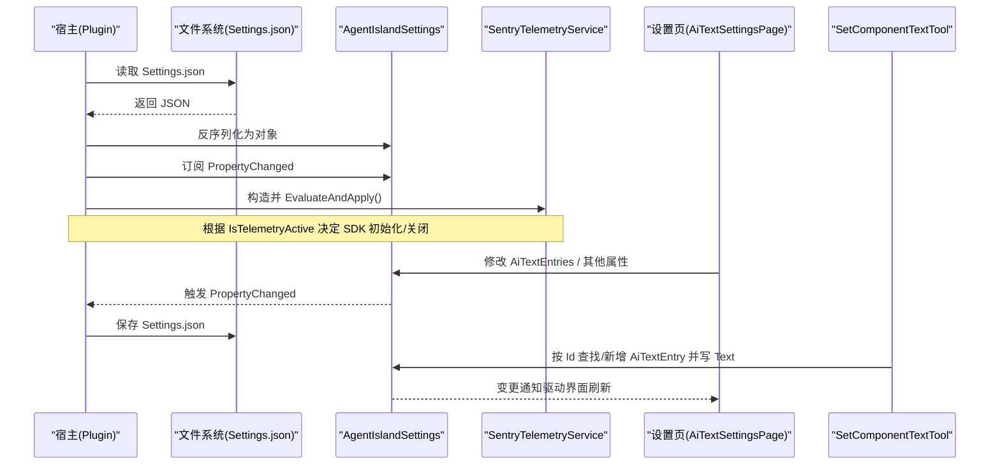
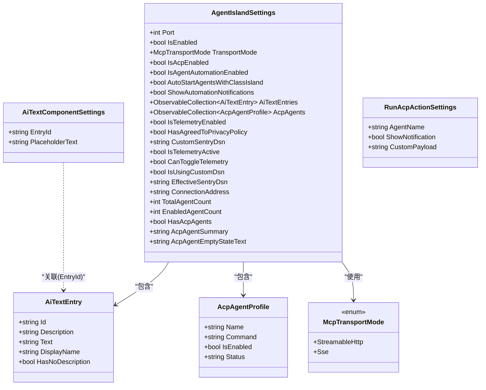
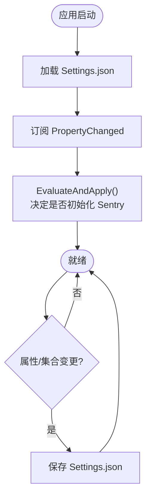
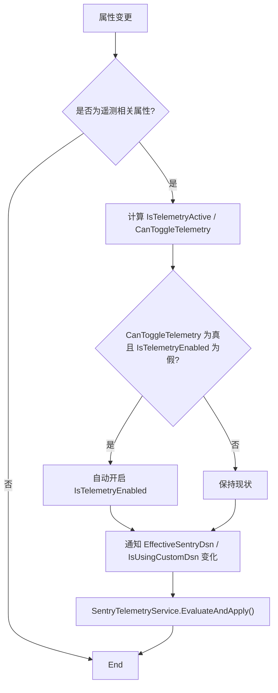
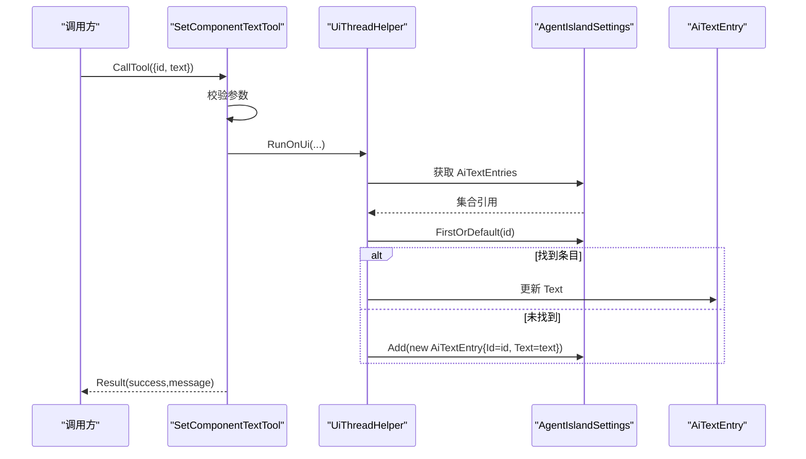
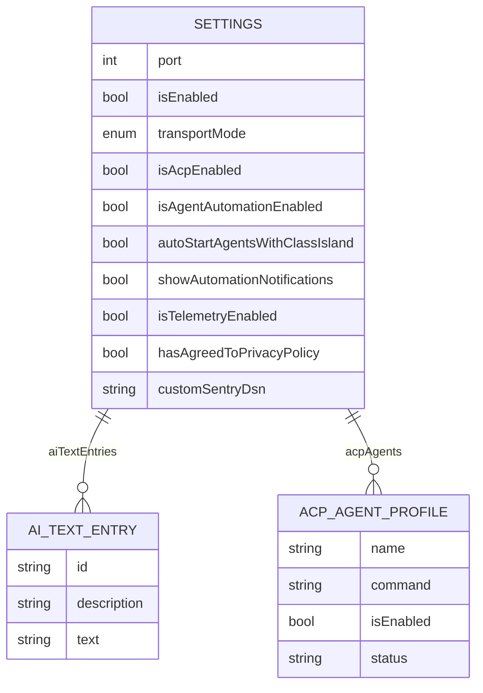
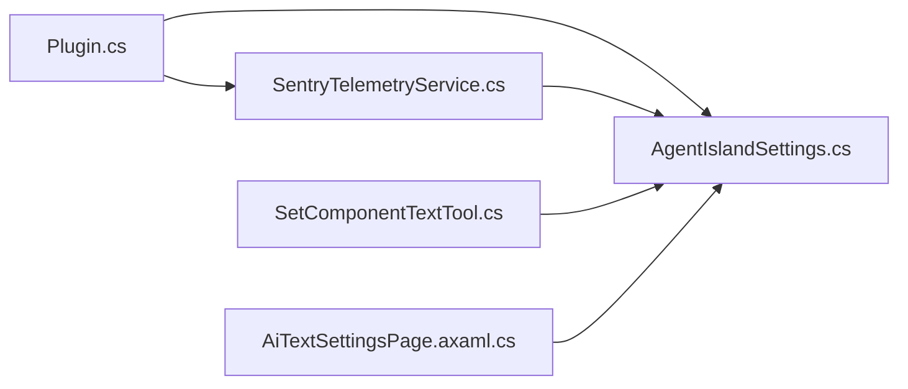

# 配置管理

<cite>
**本文引用的文件**   
- [Plugin.cs](file://Plugin.cs)
- [AgentIslandSettings.cs](file://Models/AgentIslandSettings.cs)
- [AiTextEntry.cs](file://Models/AiTextEntry.cs)
- [AiTextComponentSettings.cs](file://Models/AiTextComponentSettings.cs)
- [AcpAgentProfile.cs](file://Models/AcpAgentProfile.cs)
- [McpTransportMode.cs](file://Models/McpTransportMode.cs)
- [RunAcpActionSettings.cs](file://Models/RunAcpActionSettings.cs)
- [SentryTelemetryService.cs](file://Services/SentryTelemetryService.cs)
- [SetComponentTextTool.cs](file://Mcp/Tools/SetComponentTextTool.cs)
- [AiTextSettingsPage.axaml.cs](file://Views/SettingsPages/AiTextSettingsPage.axaml.cs)
- [AgentIslandJsonContext.cs](file://Models/AgentIslandJsonContext.cs)
- [PRIVACY_POLICY.md](file://PRIVACY_POLICY.md)
- [CROSS_BORDER_DATA_TRANSFER.md](file://CROSS_BORDER_DATA_TRANSFER.md)
</cite>

## 目录
1. [简介](#简介)
2. [项目结构](#项目结构)
3. [核心组件](#核心组件)
4. [架构总览](#架构总览)
5. [详细组件分析](#详细组件分析)
6. [依赖关系分析](#依赖关系分析)
7. [性能考虑](#性能考虑)
8. [故障排查指南](#故障排查指南)
9. [结论](#结论)
10. [附录](#附录)

## 简介
本文件为 AgentIsland 插件的配置管理系统提供全面的数据模型文档，覆盖以下方面：
- 实体关系与字段定义（AgentIslandSettings、AiTextEntry、AiTextComponentSettings、AcpAgentProfile、RunAcpActionSettings、McpTransportMode）
- 配置持久化机制、属性变更通知与 JSON 序列化约定
- 数据验证规则与业务规则（遥测开关、隐私同意、DSN 优先级等）
- 配置文件结构与示例数据
- 配置访问模式、缓存策略与性能考量
- 配置生命周期、保留策略与归档规则
- 配置迁移路径与版本管理建议
- 数据安全、隐私要求与访问控制

## 项目结构
配置相关代码主要分布在 Models、Services、Views 与根入口 Plugin.cs 中。关键要点：
- 配置根对象为 AgentIslandSettings，包含 MCP 服务器参数、遥测与隐私选项、AI 文字条目集合、ACP Agent 列表等
- 通过 ObservableObject 实现属性变更通知；集合使用 ObservableCollection 以支持 UI 双向绑定与自动保存
- 配置加载与保存由 Plugin.cs 在初始化时完成，基于 ConfigureFileHelper 的 LoadConfig/SaveConfig
- 遥测服务 SentryTelemetryService 监听设置变更并动态启停 SDK
- AI 文字工具 SetComponentTextTool 通过 ID 更新 AiTextEntry.Text，体现运行时对配置的读写

图示来源
- [Plugin.cs:29-53](file://Plugin.cs#L29-L53)
- [AgentIslandSettings.cs:13-122](file://Models/AgentIslandSettings.cs#L13-L122)
- [AiTextEntry.cs:5-30](file://Models/AiTextEntry.cs#L5-L30)
- [AiTextComponentSettings.cs:5-12](file://Models/AiTextComponentSettings.cs#L5-L12)
- [AcpAgentProfile.cs:9-43](file://Models/AcpAgentProfile.cs#L9-L43)
- [McpTransportMode.cs:6-17](file://Models/McpTransportMode.cs#L6-L17)
- [RunAcpActionSettings.cs:9-35](file://Models/RunAcpActionSettings.cs#L9-L35)
- [SentryTelemetryService.cs:21-40](file://Services/SentryTelemetryService.cs#L21-L40)
- [SetComponentTextTool.cs:41-72](file://Mcp/Tools/SetComponentTextTool.cs#L41-L72)
- [AiTextSettingsPage.axaml.cs:16-35](file://Views/SettingsPages/AiTextSettingsPage.axaml.cs#L16-L35)
- [AgentIslandJsonContext.cs:1-19](file://Models/AgentIslandJsonContext.cs#L1-L19)

章节来源
- [Plugin.cs:29-53](file://Plugin.cs#L29-L53)
- [AgentIslandSettings.cs:13-122](file://Models/AgentIslandSettings.cs#L13-L122)

## 核心组件
本节聚焦配置根对象及其子项的关系与职责。

- AgentIslandSettings
  - 作用：插件全局配置聚合体，承载 MCP 端口、传输模式、遥测与隐私、AI 文字条目、ACP Agent 列表等
  - 特性：
    - 使用 SetProperty 实现属性变更通知
    - 维护两个 ObservableCollection：AiTextEntries、AcpAgents，并在集合变化时重新挂接事件
    - 派生属性：ConnectionAddress、TotalAgentCount、EnabledAgentCount、HasAcpAgents、AcpAgentSummary、AcpAgentEmptyStateText
    - 遥测相关：IsTelemetryActive、CanToggleTelemetry、EffectiveSentryDsn、IsUsingCustomDsn
- AiTextEntry
  - 作用：AI 文字条目，用于界面展示与工具写入
  - 特性：Id、Description、Text；DisplayName 与 HasNoDescription 派生属性
- AiTextComponentSettings
  - 作用：组件级设置（如占位文本），继承自 ObservableRecipient，便于消息传递
- AcpAgentProfile
  - 作用：单个 ACP Agent 的连接与启用状态
- RunAcpActionSettings
  - 作用：“运行 ACP”自动化动作的设置（名称、是否通知、自定义负载）
- McpTransportMode
  - 作用：枚举，表示 StreamableHttp 或 SSE 两种传输模式
- AgentIslandJsonContext
  - 作用：System.Text.Json 源生成上下文，声明可序列化的类型与命名策略（CamelCase）

章节来源
- [AgentIslandSettings.cs:13-232](file://Models/AgentIslandSettings.cs#L13-L232)
- [AiTextEntry.cs:5-30](file://Models/AiTextEntry.cs#L5-L30)
- [AiTextComponentSettings.cs:5-12](file://Models/AiTextComponentSettings.cs#L5-L12)
- [AcpAgentProfile.cs:9-43](file://Models/AcpAgentProfile.cs#L9-L43)
- [RunAcpActionSettings.cs:9-35](file://Models/RunAcpActionSettings.cs#L9-L35)
- [McpTransportMode.cs:6-17](file://Models/McpTransportMode.cs#L6-L17)
- [AgentIslandJsonContext.cs:1-19](file://Models/AgentIslandJsonContext.cs#L1-L19)

## 架构总览
配置系统围绕“设置对象 + 变更通知 + 文件持久化 + 遥测联动”展开。

图示来源
- [Plugin.cs:29-53](file://Plugin.cs#L29-L53)
- [AgentIslandSettings.cs:240-273](file://Models/AgentIslandSettings.cs#L240-L273)
- [SentryTelemetryService.cs:21-40](file://Services/SentryTelemetryService.cs#L21-L40)
- [AiTextSettingsPage.axaml.cs:16-35](file://Views/SettingsPages/AiTextSettingsPage.axaml.cs#L16-L35)
- [SetComponentTextTool.cs:41-72](file://Mcp/Tools/SetComponentTextTool.cs#L41-L72)

## 详细组件分析

### 类关系图（配置模型）

图示来源
- [AgentIslandSettings.cs:13-232](file://Models/AgentIslandSettings.cs#L13-L232)
- [AiTextEntry.cs:5-30](file://Models/AiTextEntry.cs#L5-L30)
- [AiTextComponentSettings.cs:5-12](file://Models/AiTextComponentSettings.cs#L5-L12)
- [AcpAgentProfile.cs:9-43](file://Models/AcpAgentProfile.cs#L9-L43)
- [RunAcpActionSettings.cs:9-35](file://Models/RunAcpActionSettings.cs#L9-L35)
- [McpTransportMode.cs:6-17](file://Models/McpTransportMode.cs#L6-L17)

章节来源
- [AgentIslandSettings.cs:13-232](file://Models/AgentIslandSettings.cs#L13-L232)
- [AiTextEntry.cs:5-30](file://Models/AiTextEntry.cs#L5-L30)
- [AiTextComponentSettings.cs:5-12](file://Models/AiTextComponentSettings.cs#L5-L12)
- [AcpAgentProfile.cs:9-43](file://Models/AcpAgentProfile.cs#L9-L43)
- [RunAcpActionSettings.cs:9-35](file://Models/RunAcpActionSettings.cs#L9-L35)
- [McpTransportMode.cs:6-17](file://Models/McpTransportMode.cs#L6-L17)

### 配置持久化与变更通知流程
- 启动阶段
  - 从插件配置目录加载 Settings.json 到 AgentIslandSettings
  - 订阅 PropertyChanged，任何属性变更均触发 SaveConfig
- 运行时
  - UI 修改集合或属性 → 触发 PropertyChanged → 自动落盘
  - 遥测服务监听关键属性变化，必要时重启 SDK

图示来源
- [Plugin.cs:29-53](file://Plugin.cs#L29-L53)
- [AgentIslandSettings.cs:240-273](file://Models/AgentIslandSettings.cs#L240-L273)
- [SentryTelemetryService.cs:21-40](file://Services/SentryTelemetryService.cs#L21-L40)

章节来源
- [Plugin.cs:29-53](file://Plugin.cs#L29-L53)
- [AgentIslandSettings.cs:240-273](file://Models/AgentIslandSettings.cs#L240-L273)

### 遥测开关与隐私同意的业务规则
- 生效条件
  - IsTelemetryActive = IsTelemetryEnabled && (HasAgreedToPrivacyPolicy || !string.IsNullOrWhiteSpace(CustomSentryDsn))
- 可用性条件
  - CanToggleTelemetry = HasAgreedToPrivacyPolicy || !string.IsNullOrWhiteSpace(CustomSentryDsn)
- DSN 优先级
  - EffectiveSentryDsn：优先使用 CustomSentryDsn，否则回退默认值
- 自动开启行为
  - 当 CanToggleTelemetry 变为真且 IsTelemetryEnabled 为假时，自动将 IsTelemetryEnabled 置为真

图示来源
- [AgentIslandSettings.cs:176-200](file://Models/AgentIslandSettings.cs#L176-L200)
- [AgentIslandSettings.cs:240-273](file://Models/AgentIslandSettings.cs#L240-L273)
- [SentryTelemetryService.cs:21-40](file://Services/SentryTelemetryService.cs#L21-L40)

章节来源
- [AgentIslandSettings.cs:176-200](file://Models/AgentIslandSettings.cs#L176-L200)
- [AgentIslandSettings.cs:240-273](file://Models/AgentIslandSettings.cs#L240-L273)
- [SentryTelemetryService.cs:21-40](file://Services/SentryTelemetryService.cs#L21-L40)

### AI 文字条目写入流程（工具调用）
- 输入校验：必须包含 id 与 text
- 执行逻辑：在 UI 线程上查找对应 AiTextEntry，存在则更新 Text，不存在则新增条目
- 结果返回：结构化结果 SetTextResult

图示来源
- [SetComponentTextTool.cs:41-72](file://Mcp/Tools/SetComponentTextTool.cs#L41-L72)
- [AiTextEntry.cs:5-30](file://Models/AiTextEntry.cs#L5-L30)
- [AgentIslandSettings.cs:104-122](file://Models/AgentIslandSettings.cs#L104-L122)

章节来源
- [SetComponentTextTool.cs:41-72](file://Mcp/Tools/SetComponentTextTool.cs#L41-L72)
- [AiTextEntry.cs:5-30](file://Models/AiTextEntry.cs#L5-L30)
- [AgentIslandSettings.cs:104-122](file://Models/AgentIslandSettings.cs#L104-L122)

### 配置文件的结构图与示例数据
- 存储位置：插件配置目录下的 Settings.json
- 序列化策略：使用 System.Text.Json 源生成上下文，统一采用驼峰命名（camelCase）
- 顶层字段（节选）：port、isEnabled、transportMode、isAcpEnabled、isAgentAutomationEnabled、autoStartAgentsWithClassIsland、showAutomationNotifications、aiTextEntries、acpAgents、isTelemetryEnabled、hasAgreedToPrivacyPolicy、customSentryDsn
- aiTextEntries 元素字段：id、description、text
- acpAgents 元素字段：name、command、isEnabled、status

示例数据（JSON 片段示意）
- 顶层键名遵循 camelCase
- aiTextEntries 为数组，每个元素包含 id、description、text
- acpAgents 为数组，每个元素包含 name、command、isEnabled、status

章节来源
- [Plugin.cs:29-53](file://Plugin.cs#L29-L53)
- [AgentIslandJsonContext.cs:1-19](file://Models/AgentIslandJsonContext.cs#L1-L19)
- [AgentIslandSettings.cs:34-173](file://Models/AgentIslandSettings.cs#L34-L173)
- [AiTextEntry.cs:5-30](file://Models/AiTextEntry.cs#L5-L30)
- [AcpAgentProfile.cs:9-43](file://Models/AcpAgentProfile.cs#L9-L43)

## 依赖关系分析
- 低耦合高内聚
  - 配置模型仅关注自身状态与派生属性，不直接依赖外部 IO
  - 持久化由 Plugin.cs 集中处理，避免在各处重复 I/O 逻辑
- 遥测服务与设置的解耦
  - SentryTelemetryService 通过订阅设置变更来动态调整 SDK 状态，避免强耦合
- 工具层对配置的访问
  - SetComponentTextTool 通过注入的服务定位设置实例并进行最小化修改（按 Id 更新或新增）

图示来源
- [Plugin.cs:29-53](file://Plugin.cs#L29-L53)
- [SentryTelemetryService.cs:21-40](file://Services/SentryTelemetryService.cs#L21-L40)
- [SetComponentTextTool.cs:41-72](file://Mcp/Tools/SetComponentTextTool.cs#L41-L72)
- [AiTextSettingsPage.axaml.cs:16-35](file://Views/SettingsPages/AiTextSettingsPage.axaml.cs#L16-L35)

章节来源
- [Plugin.cs:29-53](file://Plugin.cs#L29-L53)
- [SentryTelemetryService.cs:21-40](file://Services/SentryTelemetryService.cs#L21-L40)
- [SetComponentTextTool.cs:41-72](file://Mcp/Tools/SetComponentTextTool.cs#L41-L72)
- [AiTextSettingsPage.axaml.cs:16-35](file://Views/SettingsPages/AiTextSettingsPage.axaml.cs#L16-L35)

## 性能考虑
- 变更即保存
  - 每次属性变更都会触发保存，适合小体积配置；若未来配置膨胀，可考虑节流合并保存
- 集合事件挂接
  - 对集合增删改会遍历元素进行事件挂接/解挂，注意频繁批量操作时的开销
- 遥测 SDK 生命周期
  - 仅在需要时初始化/关闭 SDK，避免不必要的资源占用
- 序列化策略
  - 使用源生成上下文减少反射开销，提升序列化性能

[本节为通用指导，无需列出具体文件来源]

## 故障排查指南
- 无法启动 MCP 服务器
  - 检查端口与传输模式是否正确，查看日志输出与遥测面包屑
- 遥测未上报
  - 确认已同意隐私政策或未留空自定义 DSN；检查 IsTelemetryActive 与 EffectiveSentryDsn
- 设置未持久化
  - 确认 PropertyChanged 订阅是否生效；检查磁盘权限与路径
- AI 文字未更新
  - 确认传入的 id 是否存在；若不存在将被新增；检查 UI 线程上下文

章节来源
- [Plugin.cs:55-97](file://Plugin.cs#L55-L97)
- [SentryTelemetryService.cs:77-90](file://Services/SentryTelemetryService.cs#L77-L90)
- [SetComponentTextTool.cs:41-72](file://Mcp/Tools/SetComponentTextTool.cs#L41-L72)

## 结论
AgentIsland 的配置系统以轻量、响应式为核心设计目标：
- 通过 ObservableObject 与 ObservableCollection 实现细粒度变更通知
- 统一的 JSON 序列化与源生成上下文保证一致性与性能
- 遥测服务与设置解耦，按需启停，兼顾隐私与可观测性
- 面向未来的可扩展性良好，可在不破坏现有契约的前提下演进

[本节为总结性内容，无需列出具体文件来源]

## 附录

### 字段定义与数据类型（节选）
- AgentIslandSettings
  - port: 整数，MCP 监听端口
  - isEnabled: 布尔，是否启用 MCP 服务器
  - transportMode: 枚举，StreamableHttp 或 SSE
  - isAcpEnabled: 布尔，是否启用 ACP 面板能力
  - isAgentAutomationEnabled: 布尔，是否启用基于 Agent 的自动化
  - autoStartAgentsWithClassIsland: 布尔，是否在宿主启动时自动启动 Agent
  - showAutomationNotifications: 布尔，是否显示自动化提示
  - aiTextEntries: 数组，AiTextEntry 集合
  - acpAgents: 数组，AcpAgentProfile 集合
  - isTelemetryEnabled: 布尔，是否启用遥测
  - hasAgreedToPrivacyPolicy: 布尔，是否同意隐私协议
  - customSentryDsn: 字符串，自定义 DSN
- AiTextEntry
  - id: 字符串，唯一标识
  - description: 字符串，描述
  - text: 字符串，显示内容
- AcpAgentProfile
  - name: 字符串，名称
  - command: 字符串，命令
  - isEnabled: 布尔，是否启用
  - status: 字符串，连接状态
- RunAcpActionSettings
  - agentName: 字符串
  - showNotification: 布尔
  - customPayload: 字符串
- McpTransportMode
  - StreamableHttp、Sse

章节来源
- [AgentIslandSettings.cs:34-173](file://Models/AgentIslandSettings.cs#L34-L173)
- [AiTextEntry.cs:5-30](file://Models/AiTextEntry.cs#L5-L30)
- [AcpAgentProfile.cs:9-43](file://Models/AcpAgentProfile.cs#L9-L43)
- [RunAcpActionSettings.cs:9-35](file://Models/RunAcpActionSettings.cs#L9-L35)
- [McpTransportMode.cs:6-17](file://Models/McpTransportMode.cs#L6-L17)

### 数据验证规则与业务规则
- 端口范围：建议使用有效端口范围（1-65535），超出范围应回退默认值
- 必填字段：aiTextEntries 中的 id 不应为空；工具写入时需校验
- 遥测开关：
  - 仅在同意隐私或使用自定义 DSN 时可开启
  - EffectiveSentryDsn 优先使用自定义 DSN
- 连接地址：ConnectionAddress 由 Port 与 TransportMode 派生

章节来源
- [AgentIslandSettings.cs:176-211](file://Models/AgentIslandSettings.cs#L176-L211)
- [SetComponentTextTool.cs:41-72](file://Mcp/Tools/SetComponentTextTool.cs#L41-L72)

### 配置访问模式与缓存策略
- 访问模式
  - 单例注入：Plugin.Settings 作为静态实例供全局访问
  - DI 容器注册：同时以单例形式注入，便于测试与替换
- 缓存策略
  - 内存中持有最新配置对象，变更即时反映至 UI 与工具
  - 文件层无额外缓存，变更即落盘

章节来源
- [Plugin.cs:27-41](file://Plugin.cs#L27-L41)

### 配置生命周期、保留策略与归档规则
- 生命周期
  - 启动：加载配置 → 订阅变更 → 初始化遥测 → 启动 MCP 服务器
  - 停止：优雅停止 MCP 服务器 → 释放遥测资源
- 保留策略
  - 本地：Settings.json 长期保留，直至用户手动删除或重置
  - 遥测：遵循隐私政策与第三方平台保留策略（默认约 90 天）
- 归档规则
  - 当前未实现自动归档；建议在重大版本升级前导出备份

章节来源
- [Plugin.cs:55-97](file://Plugin.cs#L55-L97)
- [PRIVACY_POLICY.md:105-113](file://PRIVACY_POLICY.md#L105-L113)

### 配置迁移路径与版本管理
- 迁移建议
  - 引入版本号字段，并在加载后进行向后兼容处理
  - 对废弃字段提供降级策略（忽略或映射到新字段）
- 版本管理
  - 在设置页面提示用户进行必要迁移
  - 记录迁移日志以便回溯

[本节为通用指导，无需列出具体文件来源]

### 数据安全、隐私要求与访问控制
- 数据最小化
  - 遥测仅收集异常、性能指标与生命周期事件，不包含课程或个人信息
- 传输安全
  - 通过 HTTPS/TLS 加密传输
- 用户控制
  - 明确同意机制与撤回机制；支持自定义 DSN 豁免同意检查
- 访问控制
  - 仅开发者可访问遥测数据；本地配置受操作系统文件权限保护

章节来源
- [PRIVACY_POLICY.md:16-35](file://PRIVACY_POLICY.md#L16-L35)
- [PRIVACY_POLICY.md:69-102](file://PRIVACY_POLICY.md#L69-L102)
- [CROSS_BORDER_DATA_TRANSFER.md:38-55](file://CROSS_BORDER_DATA_TRANSFER.md#L38-L55)
- [CROSS_BORDER_DATA_TRANSFER.md:67-92](file://CROSS_BORDER_DATA_TRANSFER.md#L67-L92)