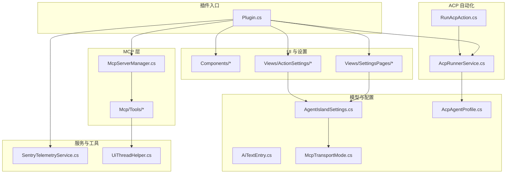
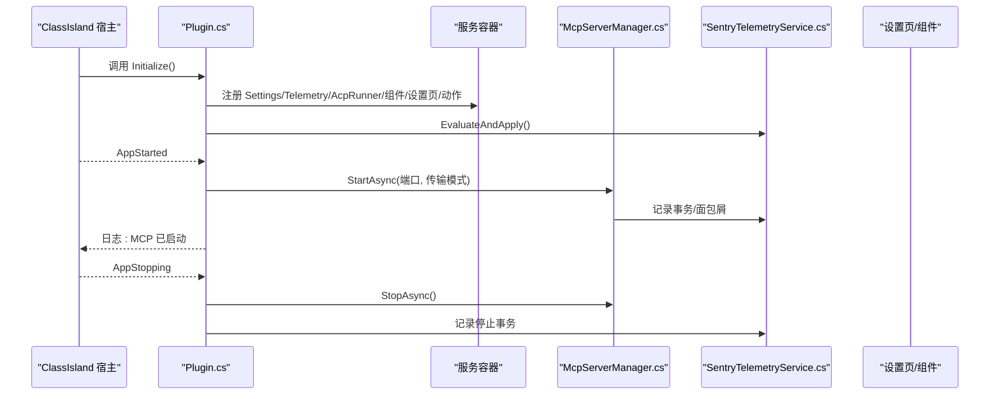
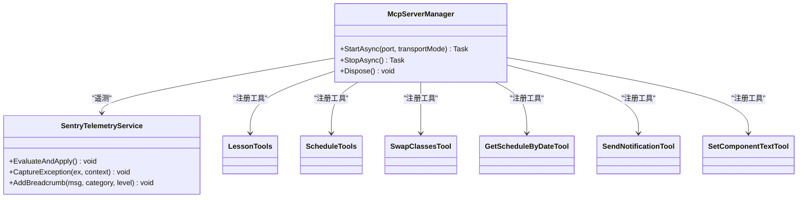
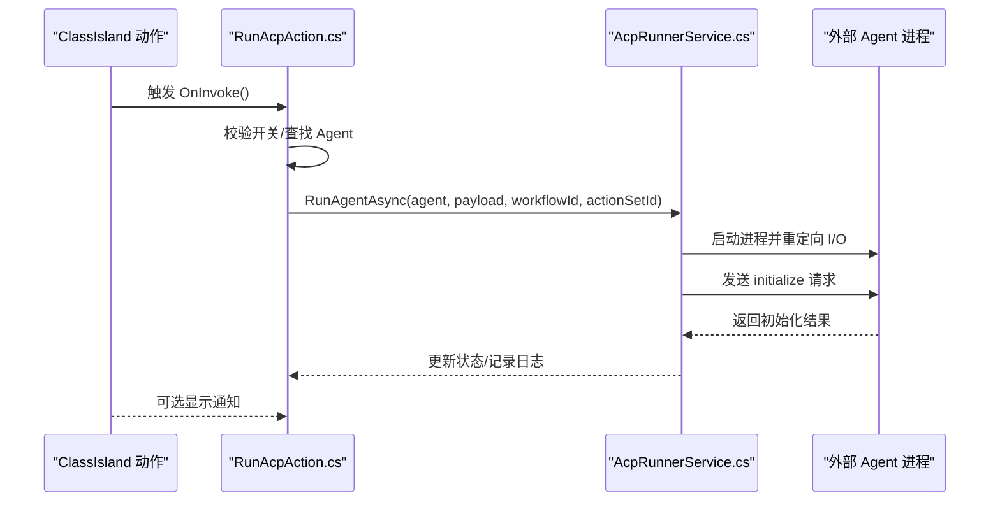
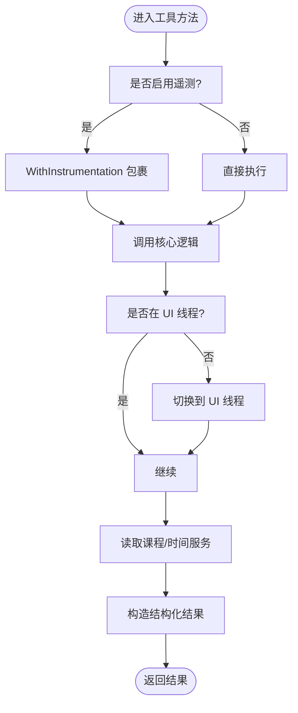
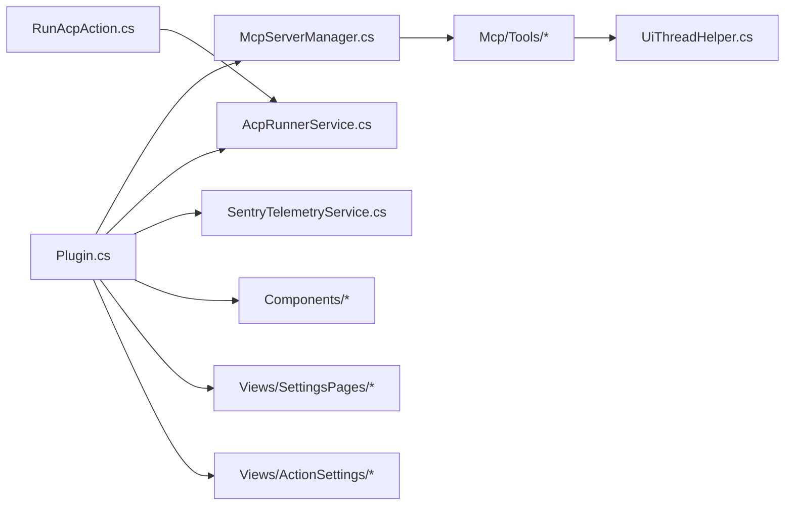

# 项目概述

<cite>
**本文引用的文件**   
- [Plugin.cs](file://Plugin.cs)
- [manifest.yml](file://manifest.yml)
- [AgentIsland.csproj](file://AgentIsland.csproj)
- [AGENTS.md](file://AGENTS.md)
- [McpServerManager.cs](file://Mcp/McpServerManager.cs)
- [AcpRunnerService.cs](file://Services/AcpRunnerService.cs)
- [SentryTelemetryService.cs](file://Services/SentryTelemetryService.cs)
- [RunAcpAction.cs](file://Automation/RunAcpAction.cs)
- [LessonTools.cs](file://Mcp/Tools/LessonTools.cs)
- [AiTextComponent.axaml.cs](file://Components/AiTextComponent.axaml.cs)
- [AiTextSettingsPage.axaml.cs](file://Views/SettingsPages/AiTextSettingsPage.axaml.cs)
- [McpSettingsPage.axaml.cs](file://Views/SettingsPages/McpSettingsPage.axaml.cs)
- [AcpSettingsPage.axaml.cs](file://Views/SettingsPages/AcpSettingsPage.axaml.cs)
- [TelemetrySettingsPage.axaml.cs](file://Views/SettingsPages/TelemetrySettingsPage.axaml.cs)
- [RunAcpActionSettingsControl.axaml.cs](file://Views/ActionSettings/RunAcpActionSettingsControl.axaml.cs)
- [AgentIslandSettings.cs](file://Models/AgentIslandSettings.cs)
- [AcpAgentProfile.cs](file://Models/AcpAgentProfile.cs)
- [AiTextEntry.cs](file://Models/AiTextEntry.cs)
- [McpTransportMode.cs](file://Models/McpTransportMode.cs)
- [UiThreadHelper.cs](file://Helpers/UiThreadHelper.cs)
</cite>

## 目录
1. [简介](#简介)
2. [项目结构](#项目结构)
3. [核心组件](#核心组件)
4. [架构总览](#架构总览)
5. [详细组件分析](#详细组件分析)
6. [依赖关系分析](#依赖关系分析)
7. [性能与可观测性](#性能与可观测性)
8. [故障排查指南](#故障排查指南)
9. [结论](#结论)
10. [附录：快速开始与使用示例](#附录快速开始与使用示例)

## 简介
AgentIsland 是 ClassIsland 桌面应用的智能代理插件，目标是在 ClassIsland 生态中注入“智能体”能力。它通过暴露 MCP（Model Context Protocol）服务器，让外部 AI 智能体能够安全、可控地访问课程表、通知、UI 组件等系统能力；同时提供 ACP（Agent Client Protocol）自动化子系统，支持在 ClassIsland 动作流程中启动并驱动外部 Agent 进程，实现更复杂的自动化编排。此外，插件内置 UI 组件系统与遥测监控，便于用户配置与管理功能。

本概述面向两类读者：
- 初学者：理解插件定位、核心概念与基本用法
- 有经验的开发者：掌握架构设计、关键流程与扩展点

## 项目结构
插件采用分层与按职责组织的方式：
- 入口与生命周期：Plugin.cs
- MCP 服务器管理：Mcp/McpServerManager.cs 与 Mcp/Tools/*
- ACP 自动化：Services/AcpRunnerService.cs 与 Automation/RunAcpAction.cs
- UI 组件与设置页：Components/* 与 Views/*
- 模型与配置：Models/*
- 辅助工具：Helpers/*
- 构建与清单：AgentIsland.csproj、manifest.yml、AGENTS.md

图表来源
- [Plugin.cs:1-114](file://Plugin.cs#L1-L114)
- [McpServerManager.cs:1-125](file://Mcp/McpServerManager.cs#L1-L125)
- [AcpRunnerService.cs:1-207](file://Services/AcpRunnerService.cs#L1-L207)
- [RunAcpAction.cs:1-84](file://Automation/RunAcpAction.cs#L1-L84)
- [SentryTelemetryService.cs:1-182](file://Services/SentryTelemetryService.cs#L1-L182)
- [AgentIslandSettings.cs:1-394](file://Models/AgentIslandSettings.cs#L1-L394)
- [McpTransportMode.cs:1-18](file://Models/McpTransportMode.cs#L1-L18)
- [AiTextComponent.axaml.cs](file://Components/AiTextComponent.axaml.cs)
- [AiTextSettingsPage.axaml.cs](file://Views/SettingsPages/AiTextSettingsPage.axaml.cs)
- [McpSettingsPage.axaml.cs](file://Views/SettingsPages/McpSettingsPage.axaml.cs)
- [AcpSettingsPage.axaml.cs](file://Views/SettingsPages/AcpSettingsPage.axaml.cs)
- [TelemetrySettingsPage.axaml.cs](file://Views/SettingsPages/TelemetrySettingsPage.axaml.cs)
- [RunAcpActionSettingsControl.axaml.cs](file://Views/ActionSettings/RunAcpActionSettingsControl.axaml.cs)
- [UiThreadHelper.cs:1-25](file://Helpers/UiThreadHelper.cs#L1-L25)

章节来源
- [AGENTS.md:1-61](file://AGENTS.md#L1-L61)
- [AgentIsland.csproj:1-52](file://AgentIsland.csproj#L1-L52)
- [manifest.yml:1-13](file://manifest.yml#L1-L13)

## 核心组件
- 插件入口与生命周期
  - 负责加载配置、注册服务、注入 UI 组件与设置页、订阅应用生命周期事件、启动/停止 MCP 服务器、上报遥测。
- MCP 服务器管理
  - 基于 DotNetCampus.ModelContextProtocol 构建本地 HTTP 服务器，支持 Streamable HTTP 与 SSE 两种传输模式，动态注册工具集。
- ACP 自动化系统
  - 通过 stdio JSON-RPC 协议启动外部 Agent 进程，维护会话、发送 prompt，并在 ClassIsland 动作中触发执行。
- UI 组件系统
  - 提供 AiText 组件及对应设置控件，支持在 ClassIsland 界面中展示与编辑 AI 文本条目。
- 遥测监控
  - 基于 Sentry SDK，根据隐私策略与开关动态初始化/关闭，提供异常捕获、面包屑与事务埋点。

章节来源
- [Plugin.cs:1-114](file://Plugin.cs#L1-L114)
- [McpServerManager.cs:1-125](file://Mcp/McpServerManager.cs#L1-L125)
- [AcpRunnerService.cs:1-207](file://Services/AcpRunnerService.cs#L1-L207)
- [SentryTelemetryService.cs:1-182](file://Services/SentryTelemetryService.cs#L1-L182)
- [AiTextComponent.axaml.cs](file://Components/AiTextComponent.axaml.cs)

## 架构总览
插件以 Plugin 为入口，在应用启动时完成配置加载与服务注册，随后启动 MCP 服务器；ACP 自动化由 ClassIsland 动作触发，经由 AcpRunnerService 管理外部 Agent 进程；所有关键路径均接入 Sentry 遥测；UI 组件与设置页通过 ClassIsland 插件 SDK 注册到宿主。

图表来源
- [Plugin.cs:29-97](file://Plugin.cs#L29-L97)
- [McpServerManager.cs:25-112](file://Mcp/McpServerManager.cs#L25-L112)
- [SentryTelemetryService.cs:30-90](file://Services/SentryTelemetryService.cs#L30-L90)

## 详细组件分析

### 插件入口与生命周期（Plugin）
- 职责
  - 加载并持久化设置（自动保存）。
  - 注册遥测、ACP 运行器、通知提供者、AI 文本组件、设置页与自动化动作。
  - 监听宿主应用启动/停止事件，控制 MCP 服务器启停。
- 关键点
  - 设置变更自动落盘，避免重复 IO。
  - 遥测在服务初始化阶段即启用，贯穿后续关键路径。
  - 错误路径统一记录日志并上报异常。

章节来源
- [Plugin.cs:29-97](file://Plugin.cs#L29-L97)

### MCP 服务器管理（McpServerManager）
- 职责
  - 构建并启动 MCP 服务器，注册工具集，选择传输端点（/mcp 或 /sse）。
  - 管理取消令牌与生命周期，确保优雅停止。
- 关键点
  - 工具注册集中管理，便于扩展。
  - 传输模式由设置决定，默认 Streamable HTTP。
  - 启动/停止过程均有遥测事务包裹。

图表来源
- [McpServerManager.cs:1-125](file://Mcp/McpServerManager.cs#L1-L125)
- [LessonTools.cs:1-146](file://Mcp/Tools/LessonTools.cs#L1-L146)

章节来源
- [McpServerManager.cs:25-112](file://Mcp/McpServerManager.cs#L25-L112)

### ACP 自动化系统（AcpRunnerService 与 RunAcpAction）
- 职责
  - AcpRunnerService：通过 stdio JSON-RPC 启动外部 Agent 进程，维护会话状态，发送 prompt。
  - RunAcpAction：作为 ClassIsland 自动化动作，校验开关与 Agent 配置后调用运行器。
- 关键流程

图表来源
- [RunAcpAction.cs:29-82](file://Automation/RunAcpAction.cs#L29-L82)
- [AcpRunnerService.cs:25-100](file://Services/AcpRunnerService.cs#L25-L100)

章节来源
- [RunAcpAction.cs:29-82](file://Automation/RunAcpAction.cs#L29-L82)
- [AcpRunnerService.cs:25-100](file://Services/AcpRunnerService.cs#L25-L100)

### UI 组件系统（AiText 组件与设置页）
- 职责
  - 提供可在 ClassIsland 界面中展示的 AI 文本组件与设置控件。
  - 提供独立的设置页面用于管理 AI 文本条目与行为。
- 集成方式
  - 通过插件入口注册组件与设置页，随宿主加载。

章节来源
- [AiTextComponent.axaml.cs](file://Components/AiTextComponent.axaml.cs)
- [AiTextSettingsPage.axaml.cs](file://Views/SettingsPages/AiTextSettingsPage.axaml.cs)

### 遥测监控（SentryTelemetryService）
- 职责
  - 根据设置与隐私策略动态初始化/关闭 Sentry SDK。
  - 提供异常捕获、面包屑与事务包装方法。
- 关键点
  - 支持自定义 DSN，优先于默认值。
  - 属性变更实时生效，无需重启。

章节来源
- [SentryTelemetryService.cs:30-90](file://Services/SentryTelemetryService.cs#L30-L90)
- [SentryTelemetryService.cs:95-174](file://Services/SentryTelemetryService.cs#L95-L174)

### 工具实现示例（LessonTools）
- 职责
  - 暴露当前课程、下一节课、时间状态等只读工具，供 MCP 客户端调用。
- 关键点
  - 通过 UiThreadHelper 确保在 UI 线程访问 ClassIsland 服务。
  - 每个工具方法均被遥测事务包裹，便于追踪。

图表来源
- [LessonTools.cs:14-45](file://Mcp/Tools/LessonTools.cs#L14-L45)
- [UiThreadHelper.cs:7-23](file://Helpers/UiThreadHelper.cs#L7-L23)

章节来源
- [LessonTools.cs:14-45](file://Mcp/Tools/LessonTools.cs#L14-L45)
- [UiThreadHelper.cs:7-23](file://Helpers/UiThreadHelper.cs#L7-L23)

### 模型与配置（AgentIslandSettings 及相关）
- 职责
  - 集中管理插件设置项（端口、传输模式、遥测、ACP 开关、Agent 列表、AI 文本条目等）。
  - 提供派生属性与集合变更联动，自动持久化。
- 关键点
  - 连接地址根据端口与传输模式动态计算。
  - 遥测可用性受隐私策略与自定义 DSN 影响。

章节来源
- [AgentIslandSettings.cs:14-211](file://Models/AgentIslandSettings.cs#L14-L211)
- [AgentIslandSettings.cs:176-200](file://Models/AgentIslandSettings.cs#L176-L200)
- [AcpAgentProfile.cs:1-44](file://Models/AcpAgentProfile.cs#L1-L44)
- [AiTextEntry.cs:1-31](file://Models/AiTextEntry.cs#L1-L31)
- [McpTransportMode.cs:1-18](file://Models/McpTransportMode.cs#L1-L18)

## 依赖关系分析
- 内部依赖
  - Plugin 依赖 McpServerManager、AcpRunnerService、SentryTelemetryService、UI 组件与设置页。
  - McpServerManager 依赖工具集与遥测服务。
  - RunAcpAction 依赖 AcpRunnerService 与设置。
  - 工具类依赖 UiThreadHelper 与 ClassIsland 服务。
- 外部依赖
  - .NET 8.0 运行时。
  - ClassIsland.PluginSdk（插件框架）。
  - DotNetCampus.ModelContextProtocol（MCP 服务器）。
  - AgentClientProtocol（ACP 协议）。
  - Sentry（遥测）。

图表来源
- [Plugin.cs:29-53](file://Plugin.cs#L29-L53)
- [McpServerManager.cs:41-51](file://Mcp/McpServerManager.cs#L41-L51)
- [RunAcpAction.cs:22-27](file://Automation/RunAcpAction.cs#L22-L27)
- [LessonTools.cs:1-10](file://Mcp/Tools/LessonTools.cs#L1-L10)

章节来源
- [AgentIsland.csproj:22-37](file://AgentIsland.csproj#L22-L37)

## 性能与可观测性
- 性能
  - MCP 服务器仅监听本地回环地址，减少网络开销。
  - 工具方法尽量轻量，避免阻塞 UI 线程（通过 UiThreadHelper 切换）。
  - ACP 进程启动与通信采用异步 I/O，避免主线程阻塞。
- 可观测性
  - 关键路径（服务器启停、工具调用、ACP 运行）均记录面包屑与事务。
  - 异常统一捕获并上报，附带上下文标签，便于定位问题。

[本节为通用指导，不直接分析具体文件]

## 故障排查指南
- MCP 服务器无法启动
  - 检查端口占用与传输模式设置。
  - 查看日志与 Sentry 异常信息，确认 StartAsync 抛出的异常类型。
- ACP Agent 未响应
  - 确认命令与参数正确，进程能独立启动。
  - 检查 initialize 响应是否符合 JSON-RPC 2.0 规范。
  - 查看会话状态与上次运行时间戳。
- 遥测未上报
  - 确认隐私策略同意状态与遥测开关。
  - 若使用自定义 DSN，确保有效且未被拦截。

章节来源
- [Plugin.cs:67-97](file://Plugin.cs#L67-L97)
- [McpServerManager.cs:76-112](file://Mcp/McpServerManager.cs#L76-L112)
- [AcpRunnerService.cs:79-100](file://Services/AcpRunnerService.cs#L79-L100)
- [SentryTelemetryService.cs:30-90](file://Services/SentryTelemetryService.cs#L30-L90)

## 结论
AgentIsland 将 ClassIsland 的能力以 MCP 与 ACP 的形式开放给外部智能体，既保证了安全性与可控性，又提供了良好的可扩展性与可观测性。通过清晰的模块划分与统一的遥测体系，开发者可以快速扩展工具、集成新的 Agent 与优化用户体验。

[本节为总结性内容，不直接分析具体文件]

## 附录：快速开始与使用示例
- 技术栈概览
  - 运行时：.NET 8.0（Windows）
  - UI：Avalonia UI（FluentAvalonia）
  - 插件框架：ClassIsland Plugin SDK
  - MCP：DotNetCampus.ModelContextProtocol
  - ACP：AgentClientProtocol
  - 遥测：Sentry
- 构建与运行
  - 使用提供的脚本进行调试/发布构建与打包。
  - 需要预先配置 ClassIsland 开发环境与相关环境变量。
- 基本使用
  - 在设置页中配置 MCP 端口与传输模式，启动后可通过 http://localhost:{端口}/mcp 或 /sse 访问。
  - 在 ACP 设置页添加 Agent 条目，指定命令与名称，然后在 ClassIsland 动作中触发运行。
  - 在 AI 文本设置页管理条目，并通过 AiText 组件在界面展示。
  - 在遥测设置页同意隐私策略或使用自定义 DSN 后开启遥测。

章节来源
- [AGENTS.md:7-22](file://AGENTS.md#L7-L22)
- [AGENTS.md:58-61](file://AGENTS.md#L58-L61)
- [AgentIsland.csproj:1-11](file://AgentIsland.csproj#L1-L11)
- [Manifest.yml:1-13](file://manifest.yml#L1-L13)